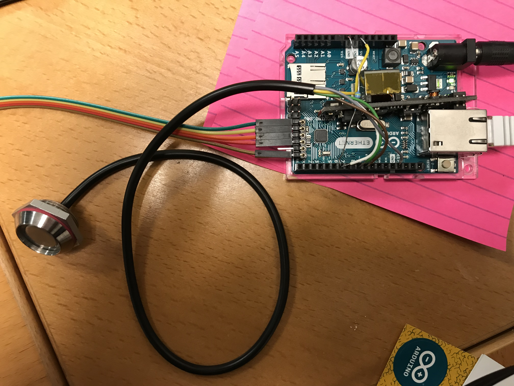

<!--s_name-->
# Access_manager

<!--e_name-->

## Home Access Control

<!--s_descr-->
Defines access for people or items such as cars.  For people access_point's register incoming and outgoing persons and grant access given proper credentials. For items, bluetooth low energy keys can be used.  This App defines the access keys and what they do, and the respective notifications and ifttt hooks

<!--e_descr-->

## Background

<!--s_sub_toc_access-->

Access control is a very important aspect to any home automation system and significant effort and time has been devoted to design a solid future proof solution.

Access control could be implemented for a variety of physical access verification methods, being card readers, 1 wire buttons or more advanced fingerprint or facial recognition.

Therefore, the concept of access points is that all these possible verification methods result in an access key that is then forwarded to the security guardian to determine access to the scene linked to this access point for this key.

The system "knows" through the definition of the access point if a registration concerns an entry or an exit.  Access points that have a selectable access direction will transmit with the access key also the access direction that has to be applied (entering or leaving).

Many access points can exist, to register the entrance of the property, or a safe room or any other room as each access_key / access_point combination results in a set of specific actions 'granting access'.

So when an identification is successful at the access point, then the access key is presented to the security controller.
 
Firstly, the access key will be verified against the authorization access key database and rejected if it not assigned to an access entity, assuming in the example that this is a person.

Assuming this test passes, the access_point, access_key combination will be tested against the access rights database and if positive, a access_event key is retrieved to lookup the associated actions.

A further restriction can be inserted for time bound access, whereby the person should be registered in the Google calendar before access can be considered.

This access_event_key points to a scene, which is typically a list of things (real and virtual) to be given a payload.

Everything is logged with detailed reporting and advanced notification possibilities.

This flexibility allows a very complete access solution that probably solves most home access issues and even allows access controlling any set of things, being door openers or anything else.   

For mobile access control such as cars, motors or people, blue tooth low energy beacons can be used as access keys, see [__Btle_driver__](Btle_driver.md) for more information.

<!--e_sub_toc_access-->

Lets look first at the access_manager object definition.

<!--s_tbl-->
## List of [properties](Properties.md) for __Access_manager__:

  | Property | Validation | Optional? | Repeat? | Description |
  | --- | --- | --- | --- | --- |
  | access_scenes | data_dict | True | - | a dict with scenes events for entering/leaving the premises or controlling access to any particular room | 
  | fav | str | True | - | is this a favorite element | 
  | icon | str | True | - | icon file for this element | 
  | notifications | ['a_none', '{id}.a_entry', '{id}.a_exit', '{id}.a_refused'] | True | - | notifications whereby {id} is the device or person, see [__Notifier__](Notifier.md) | 

## List of [Notifications](Notifier.md) for  __Access_manager__:

  | Notification Suffix | When invoked? |
  | --- | --- | 
  | a_none | person/device not recognised notification | 
  | {id}.a_entry | person/device entry notification | 
  | {id}.a_exit | person/device exit notification | 
  | {id}.a_refused | person/device entry refused notification | 

## List of [Errors/Warnings](Error_Warn.md) for  __Access_manager__:

  | Error/Warning ID | Error/Warning MSG | Occurring When? |
  | --- | --- | --- | 
  | err_a_k_role | !!access key role is {:} and must be {:} |  
  | err_acc_dir_select | !!Account_controller <{:}> is select and comma after <{:}> not in {:} |  
  | err_acc_templ | !!Access Rights for <{:}>, template <{:}> is not defined in rights_templates: {:} |  
  | msg_acc_entry_ok | {:}/{:} entry by {:}/{:} |  
  | msg_acc_exit_ok | {:}/{:} exit by {:}/{:} |  
  | msg_acc_key_gcal | Access Key {:} for {:} no access in google calendar |  
  | msg_acc_key_no_access | Access Key {:} no entry access |  
  | msg_b_entry_ok | {:} entry by beacon {:}/{:} |  
  | msg_b_exit_ok | {:} exit by beacon {:}/{:} |  
  | msg_b_found_ign | Beacon {:} : ignored as not discovered on {:} |  
  | msg_b_gcal | Beacon {:} for {:} no access in google calendar |  
  | msg_b_no_event | Beacon {:} : no event defined for <{:}> |  
<!--e_tbl-->

All access_keys should have an entry in app_data.conf, in the section /[DEVICES/] in access_keys.   See the example further down.

## Access Role

<!--s_role-->
<!--e_role-->
The role attributed to the access_manager must be the same as the role attributed to the security_system or an error message is issued!
The reason is that security is centralized and this includes access control.  

<!--s_name_ak-->
# Access_keys

<!--e_name_ak-->

<!--s_role_ak-->
<!--e_role_ak-->

<!--s_descr_ak-->
is a dictionary of access keys for persons with access keys or vehicles with btle tags that define the access rights granted by the controller where the access key is registered

<!--e_descr_ak-->

<!--s_tbl_ak-->
## List of [properties](Properties.md) for __Access_keys__:

  | Property | Validation | Optional? | Repeat? | Description |
  | --- | --- | --- | --- | --- |
  | fav | str | True | - | is this a favorite element | 
  | icon | str | True | - | icon file for this element | 
  | keys | ['Access'] | False | False | is a dictionary of access keys for persons with access keys or vehicles with btle tags that define the access rights granted by the controller where the access key is registered | 
  | rights_templates | data_dict | False | False | is a dictionary of right templates that links a template to a list of access rights | 
<!--e_tbl_ak-->

## The 'Access' Object

In the access_manager object, __Access__ objects define the entity requesting access and it therefore includes the following attributes: 

* who_is : typically the name of the person or the car

* what_do : typically the function of the person and this is the lbl in the pin

* rights: the dictionary making the link between the access points, and the access events defined in the security_system.  The directory can also contain __"gcal_must":True__ and means if the who_is must be registered in the google calendar to allow the access to work.
With the example configuration below, to give Zoulikha authorization to enter, the text __\@Zoulikha\@__ has to exist in a google calendar event.

See further below an example on the syntax and how this works.


<!--s_name_cntrl-->
# Access_ways

<!--e_name_cntrl-->

<!--s_descr_cntrl-->
Define a list or a dict of one or multiple instances of Access_point or Access_trigger

<!--e_descr_cntrl-->

## 1w buttons from Loxone via Arduino

To test the implementation, I used a set of ibuttons and 2 ibutton readers from loxone, see www.loxone.com.

See the purchase document attached [__2017-01-16_Amazon_Loxone_iButtons.pdf__](2017-01-16_Amazon_Loxone_iButtons.pdf).

All the id's of the available 1 wire button devices are included in app_data.conf, in the section /[DEVICES/] in the dictionary access_keys. 
The id's are readable (you need a magnifier glass) on the key.

The 1 button reader connected to an Arduino Ethernet will read this codes and send them to the security raspberry using the special message string for that purpose.

These outdoor readers from Loxone (item 200191) have a red and green led that can be used for feedback that the access is accepted or refused.

The sketch for the Arduino 1 wire can be found:  [__arduino 1button sketch__](../arduino/2020-12-13_AR_1W_USB) and it scans for iButtons on the 1wire pin and checks for the checksum and family (it should really be 1buttons, but you can change these).

The unique code of the iButton is then sent to the security raspberry who takes proper measures and has the ability to activate the red or green led into the reader to return a visual on the access control result.

The duration however is programmed fixed in the arduino sketch, so changing the duration in site.conf does not impact.

Any device can send a controlling string, but if the arduino is powered up, then it will send a string to a __fix ip addr which must be the security raspberry__. This ip address is fixed in this Arduino sketch.

To make the Arduino script for the outgoing access_point, from AR-1W-IN and AR-1W-OUT, just rename the buttons in the script from _in to _out AND update the mac address!!

The pin/wire assignment is documented in the Arduino sketch and the configuration does not allow the same ibutton to be read within 5 seconds to avoid repeat reads.

Be careful however with some hard lessons learned, see the Arduino sketch, read that first before making changes!.

Wiring image: 

A picture on [close up wiring](1w_reader2.JPG).

## Use your phone's bluetooth with Nold

Nold is a very particular system in that sense that access is managed through cloud.nold.io in a very user friendly way.  It is ultimately the bluetooth of the person phone which transmits to the nold box to open the contact.
With that the Access_trigger can receive this instruction and play the access scene.
Very nice access solution in combination with the Access_trigger thing (see below)!


## Access_point Object

The access point object has a special attribute "direction", it should be "entry", "exit" or "select" and specifies if the registration device is an entry or exit device or it can be selected.

If the access direction is "select", then the program assumes that the message of the access point contains the access_key and an added byword, ",entry" or ",exit" to indicate direction.

This enables a great choice in access point types and what they do.

<!--s_tbl_point-->
## List of [properties](Properties.md) for __Access_point__:

  | Property | Validation | Optional? | Repeat? | Description |
  | --- | --- | --- | --- | --- |
  | active | valid_set_int | False | - | designate the active state for a binary thing, either 0 or 1 | 
  | descr | str | False | - | free description field for this thing | 
  | descr_01 | list-2 | False | - | description for a binary thing when payload value is 0 or 1 | 
  | direction | valid_list | False | - | is the direction of the access point : exit/entry or both | 
  | duration | float | False | - | duration of the output being active/ input must be active for duration before considered active | 
  | effect_virtuals | ['Virtual', 'Virtual_A', 'Virtual_R'] | False | True | virtual things that are affected by, or can have an effect on, the value of the parent thing | 
  | fav | str | True | - | is this a favorite element | 
  | icon | str | True | - | icon file for this element | 
  | member_of | list | True | - | a list of group names to which thing belongs | 
  | method_things | ['access_green', 'access_red'] | False | - | special methods of this thing, mostly realised through things | 
  | notifications | ['access_try', 'active', 'inactive'] | True | - | access controllers nty's, see [__Notifier__](Notifier.md) | 
  | path | str, str_list | False | - | path to the specific hardware element | 
  | short | str | False | - | free (preferably short) description for this thing | 
  | th_grp | str | False | - | the technical group to which this thing belongs, used in groupings for lists and reports | 
  | value_logic | dict | False | - | logic to automatically determine the payload  based on time or other things | 
  | where2find | str | True | - | where to find in the room or place | 

## List of [Notifications](Notifier.md) for  __Access_point__:

  | Notification Suffix | When invoked? |
  | --- | --- | 
  | access_try | when access through a code is requested | 
  | active | when payload is an access code | 
  | inactive | when payload is empty | 

## List of [method_things] for  __Access_point__:

  | Method Thing | Type Thing | What it does? |
  | --- | --- | --- | 
  | access_green | Light | {'descr': 'is the led acceptance light to signal that the access registration was accepted', 'short': 'access_green'} | 
  | access_red | Light | {'descr': 'is the led refusal light to signal that the access registration was rejected', 'short': 'access_red'} | 
<!--e_tbl_point-->

## Access_trigger Object

The access trigger object has a special attribute access_scene and this should be one of the access_scenes as defined in the access_manager app.

The assumption is that access is verified in the setup prior to triggering the input that access can be granted.

An example of a real life situation is the use of nold.io, see www.nold.io and the example above.

<!--s_tbl_trigger-->
## List of [properties](Properties.md) for __Access_trigger__:

  | Property | Validation | Optional? | Repeat? | Description |
  | --- | --- | --- | --- | --- |
  | access_scene | str | False | - | is the direction of the access point : exit/entry or both | 
  | active | valid_set_int | False | - | designate the active state for a binary thing, either 0 or 1 | 
  | descr | str | False | - | free description field for this thing | 
  | descr_01 | list-2 | False | - | description for a binary thing when payload value is 0 or 1 | 
  | direction | valid_list | False | - | is the direction of the access point : exit/entry or both | 
  | duration | float | False | - | duration of the output being active/ input must be active for duration before considered active | 
  | effect_virtuals | ['Virtual', 'Virtual_A', 'Virtual_R'] | False | True | virtual things that are affected by, or can have an effect on, the value of the parent thing | 
  | fav | str | True | - | is this a favorite element | 
  | icon | str | True | - | icon file for this element | 
  | member_of | list | True | - | a list of group names to which thing belongs | 
  | method_things | ['access_green', 'access_red'] | False | - | special methods of this thing, mostly realised through things | 
  | notifications | ['active', 'app_done', 'app_start', 'disable_off', 'disable_on', 'enable_off', 'enable_on', 'freeze_off', 'freeze_on', 'inactive', 'notify+', 'payload_no'] | True | - | access trigger nty's, see [__Notifier__](Notifier.md) | 
  | path | str, str_list | False | - | path to the specific hardware element | 
  | short | str | False | - | free (preferably short) description for this thing | 
  | th_grp | str | False | - | the technical group to which this thing belongs, used in groupings for lists and reports | 
  | value_logic | dict | False | - | logic to automatically determine the payload  based on time or other things | 
  | where2find | str | True | - | where to find in the room or place | 

## List of [Notifications](Notifier.md) for  __Access_trigger__:

  | Notification Suffix | When invoked? |
  | --- | --- | 
  | active | when payload is active | 
  | app_done | when a things_app completes | 
  | app_start | when a things_app starts | 
  | disable_off | when all of the disable conditions fail | 
  | disable_on | when one of the disable conditions succeed | 
  | enable_off | when one of the enable conditions fail | 
  | enable_on | when all the enable conditions succeed | 
  | freeze_off | all of the freeze conditions fail | 
  | freeze_on | one of the freeze conditions succeed | 
  | inactive | when payload is nonactive | 
  | notify+ | extra notifications | 
  | payload_no | the requested payload is refused | 

## List of [method_things] for  __Access_trigger__:

  | Method Thing | Type Thing | What it does? |
  | --- | --- | --- | 
  | access_green | Light | {'descr': 'is the led acceptance light to signal that the access trigger was accepted', 'short': 'access_green'} | 
  | access_red | Light | {'descr': 'is the led refusal light to signal that the access trigger was rejected', 'short': 'access_red'} | 
<!--e_tbl_trigger-->

# Example Configuration

In the below configuration example, 2 ibutton readers are interfaced to Arduino's which are networked and programmed to transmit the iButton id to the raspberry with the security role which returns a red or green light to give visual feedback on acceptance or rejection of entry.

One reader combination is placed [at the entrance](1w_outside.JPG) and one [inside the house/garage](1w_inside.JPG), where typically passing to leave the house.

Notifications are defined obviously and in the example below there are emails, sonos voice messages and IFTTT triggers when the person leaves or enters.

## Example access authorizations:

<!--s_insert_{"tree":"(o:Access_manager)"}-->

from project.py tree:(o:Access_manager)
```python3
# --> project.py :<dk:project,o:Project,kw:apps,lp:6,o:Access_manager>

from lucy_app import *

Access_manager(
    access_scenes = {
            "entry_via_garage_and_unlock":["<gate^pulse2open>.mk_active()","<do_unarm>.mk_active()","<garage^pulse2open>.mk_active()"],
            "entry_via_garage_rear_door_and_unlock":["<garage_rear_door^pulse2open>.mk_active()","<do_unarm>.mk_active()"],
            "entry_via_garage_rear_door_no_unlock":["<garage_rear_door^pulse2open>.mk_active()"],
            "entry_via_gate_and_unlock":["<gate^pulse2open>.mk_active()","<do_unarm>.mk_active()"],
            "entry_via_gate_no_unlock":["<gate^pulse2open>.mk_active()"],
            "entry_via_soccer":["<soccer_entrance^pulse2open>.mk_active()"],
            "exit_via_garage_and_lockup":["<garage^pulse2open>.mk_active()","<gate^pulse2open>.mk_active()","<do_arm_at_close>.mk_active()","<btle_blackout>.mk_active()"],
            "exit_via_garage_no_lockup":["<garage^pulse2open>.mk_active()","<gate^pulse2open>.mk_active()","<btle_blackout>.mk_active()"],
            "exit_via_garage_rear_door_lockup":[
                "<garage_rear_door^pulse2open>.mk_active()",
                "<gate^pulse2open>.mk_active()",
                "<do_arm_at_close>.mk_active()",
                "<btle_blackout>.mk_active()"],
            "exit_via_gate":["<gate^pulse2open>.mk_active()"],
            "exit_via_veranda_and_lockup":[
                "<main_entrance^pulse2open>.mk_active()",
                "<gate^pulse2open>.mk_active()",
                "<do_arm_at_close>.mk_active()",
                "<btle_blackout>.mk_active()"],
            "soccer_detected":["<soccer_entrance^keep_opened>.mk_active()","<soccer_entrance^pulse2open>.mk_active()"],
            "soccer_lost":["<soccer_entrance^keep_opened>.mk_inactive()","<soccer_entrance^pulse2open>.mk_inactive()"]},
    notifications = {
            "a_none":[
                Mail(subject='{app_txt}', to='{prime}', cams=None, cam_groups=None, passes=0, body_file='', files2mail=None, ceiling=None),
                Say(txt='{tts_start} someone unknown arrived{tts_end}', ceiling=None, times=1, override=None, volume=None),
                Cal(txt='{app_txt}', summary='', ceiling=None),
                Ifttt(txt='unidentified', ceiling=None)],
            "{id}.a_entry":[
                Mail(subject='{app_txt}', to=None, cams=None, cam_groups=None, passes=0, body_file='', files2mail=None, ceiling=None),
                Say(txt='{tts_start} {id} entered the house{tts_end}', ceiling=None, times=1, override=None, volume=None),
                Cal(txt='{app_txt}', summary='', ceiling=None),
                Ifttt(txt='entry', ceiling=None)],
            "{id}.a_exit":[
                Mail(subject='{app_txt}', to=None, cams=None, cam_groups=None, passes=0, body_file='', files2mail=None, ceiling=None),
                Say(txt='{tts_start} {id} left the house{tts_end}', ceiling=None, times=1, override=None, volume=None),
                Cal(txt='{app_txt}', summary='', ceiling=None),
                Ifttt(txt='exit', ceiling=None)],
            "{id}.a_refused":[
                Mail(subject='{app_txt}', to='{prime}', cams=None, cam_groups=None, passes=0, body_file='', files2mail=None, ceiling=None),
                Cal(txt='{app_txt}', summary='', ceiling=None),
                Say(txt='{tts_start} {id} is refused access to the house{tts_end}', ceiling=None, times=1, override=None, volume=None),
                Ifttt(txt='refused_entry', ceiling=None),
                Sms(to='{prime}', txt='Entry Refused for {id}', override=None, ceiling=None)]},
    role_me = "PI-Security")

```

<!--e_insert-->


## Example access point:

<!--s_insert_{"tree":["(dk:street).*(o:Access_ways)","(dk:garage).*(o:Access_ways)","(dk:garage).*(o:Security_system)"]}-->

from project.py tree:['(dk:street).*(o:Access_ways)', '(dk:garage).*(o:Access_ways)', '(dk:garage).*(o:Security_system)']
```python3
# --> project.py :<dk:project,o:Project,kw:property,lp:0,o:House,kw:places,dk:street,o:Place,kw:contents,lp:1,o:Access_ways>

from lucy_app import *

Access_ways(
    items = {
            "iButton_in_soccer":Access_point(
                    direction = "entry",
                    method_things = {
                            "access_red":Light(duration = 3,path = "unipi:PI-Soccer,relay,2")},
                    notifications = {
                            "access_try":Mail(subject='Soccer Access, {app_txt}', to='{prime}', cams=['cam_alpha_soccer'], cam_groups=None, passes=2, body_file='', files2mail=None, ceiling=None)},
                    path = "usb:PI-Soccer,serial_arduino,1w_button,0"),
            "iButton_in_street":Access_point(
                    direction = "entry",
                    method_things = {
                            "access_green":Light(duration = 3,path = "unipi:PI-Gate,relay,10"),
                            "access_red":Light(duration = 3,path = "unipi:PI-Gate,relay,9")},
                    notifications = {
                            "access_try":Mail(subject='Gate Access, {app_txt}', to='{prime}', cams=None, cam_groups=['cams_gate'], passes=0, body_file='', files2mail=None, ceiling=None)},
                    path = "usb:PI-Gate,serial_arduino,1w_button,0"),
            "nold_gate_enter":Access_trigger(
                    access_scene = "entry_via_gate_no_unlock",
                    direction = "entry",
                    method_things = {
                            "access_green":Light(duration = 3,path = "unipi:PI-Gate,relay,10")},
                    path = "unipi:PI-Gate,input,11"),
            "nold_gate_leave":Access_trigger(
                    access_scene = "exit_via_gate",
                    direction = "exit",
                    method_things = {
                            "access_green":Light(duration = 3,path = "unipi:PI-Gate,relay,10")},
                    path = "unipi:PI-Gate,input,12")})

# --> project.py :<dk:project,o:Project,kw:property,lp:0,o:House,kw:places,dk:garage,o:Room,kw:contents,lp:1,o:Access_ways>

from lucy_app import *

Access_ways(
    items = {
            "alp_enter":Access_trigger(
                    access_scene = "entry_via_garage_rear_door_and_unlock",
                    direction = "entry",
                    method_things = {
                            "access_green":Light(duration = 3,path = "unipi:PI-RearDoor,relay,1")},
                    path = "unipi:PI-RearDoor,input,2"),
            "iButton_in_rear_door":Access_point(
                    direction = "entry",
                    method_things = {
                            "access_red":Light(duration = 3,path = "unipi:PI-RearDoor,relay,2")},
                    notifications = {
                            "access_try":Mail(subject='RearDoor Access, {app_txt}', to=None, cams=['cam_alpha_rear_door'], cam_groups=None, passes=2, body_file='', files2mail=None, ceiling=None)},
                    path = "usb:PI-RearDoor,serial_arduino,1w_button,1"),
            "iButton_out_garage":Access_point(direction = "exit",method_things = {
                            "access_green":Light(duration = 3,path = "unipi:PI-Security,relay,13"),
                            "access_red":Light(duration = 3,path = "unipi:PI-Security,relay,12")},path = "usb:PI-Security,serial_arduino,1w_button,0"),
            "iButton_out_rear_door":Access_point(direction = "exit",method_things = {
                            "access_red":Light(duration = 3,path = "unipi:PI-RearDoor,relay,2")},path = "usb:PI-RearDoor,serial_arduino,1w_button,0"),
            "keycode_enter":Access_trigger(
                    access_scene = "entry_via_garage_rear_door_no_unlock",
                    direction = "entry",
                    method_things = {
                            "access_green":Light(duration = 3,path = "unipi:PI-RearDoor,relay,1")},
                    notifications = {
                            "active":Mail(subject='RearDoor Access - keycode', to=None, cams=['cam_alpha_rear_door'], cam_groups=None, passes=2, body_file='', files2mail=None, ceiling=None)},
                    path = "unipi:PI-RearDoor,input,5"),
            "nold_garage_enter":Access_trigger(
                    access_scene = "entry_via_garage_and_unlock",
                    direction = "entry",
                    method_things = {
                            "access_green":Light(duration = 3,path = "unipi:PI-Security,relay,13")},
                    path = "unipi:PI-Security,input,1"),
            "nold_garage_leave":Access_trigger(
                    access_scene = "exit_via_garage_and_lockup",
                    direction = "exit",
                    method_things = {
                            "access_green":Light(duration = 3,path = "unipi:PI-Security,relay,13")},
                    path = "unipi:PI-Security,input,4")})

# --> project.py :<dk:project,o:Project,kw:property,lp:0,o:House,kw:places,dk:garage,o:Room,kw:contents,lp:9,o:Security_system>

from lucy_app import *

Security_system(
    blackout_mode = Virtual(duration = 600,effect_virtuals = {
                    "is_reboot":Virtual(
                            play = Effect(maker='self', condition='become_active', effect='make_active', taker='parent', delay=None, duration=None))}),
    daily_routine = Virtual(
            notifications = {
                    "active":Vera_nty(txt='vera_open_curtains'),
                    "app_done":Log(txt='unarm briefly completed', ceiling=None),
                    "app_start":Log(txt='unarm briefly started', ceiling=None),
                    "inactive":Vera_nty(txt='vera_close_curtains')},
            things_app = "unarm_briefly",
            value_logic = {"assign":{"is_day":"True","is_not_day":"False"},"freeze":{"sleep":True}}),
    do_alarm = Virtual(duration = 1),
    do_arm_at_close = Virtual(),
    do_arm_full = Virtual(duration = 90),
    do_arm_full_req = Virtual(duration = 1),
    do_arm_partial = Virtual(duration = 90),
    do_arm_partial_req = Virtual(duration = 4),
    do_burglar = Virtual(duration = 1),
    do_fire = Virtual(duration = 1),
    do_unarm = Virtual(duration = 1),
    is_alarm = Virtual(copy_things = {
                    "carbon_copy":Output(path = "vera:Vera_plus,zw,buttonset,173,Status6")},effect_virtuals = {
                    "dw_autom_close":Virtual(
                            duration = 600,
                            play = Effect(maker='parent', condition='i_change', effect='make_same', taker='self', delay=None, duration=None)),
                    "dw_autom_open":Virtual(
                            duration = 2,
                            play = Effect(maker='parent', condition='become_active', effect='make_active', taker='self', delay=None, duration=None))}),
    is_alarm_eminent = Virtual(duration = 90),
    is_arm_eminent = Virtual(duration = 90),
    is_armed = Virtual(
            effect_virtuals = {
                    "dw_autom_close":Virtual(
                            duration = 600,
                            play = Effect(maker='parent', condition='become_active', effect='make_active', taker='self', delay=None, duration=None))},
            notifications = {
                    "active":[
                        Mail(subject='Alarm is Armed', to=None, cams=None, cam_groups=['cams_alarm'], passes=1, body_file='', files2mail=None, ceiling=None),
                        Cal(txt='Alarm is Armed', summary='', ceiling=None)],
                    "inactive":[
                        Mail(subject='Alarm is Unarmed', to=None, cams=None, cam_groups=['cams_alarm'], passes=1, body_file='', files2mail=None, ceiling=None),
                        Cal(txt='Alarm is Unarmed', summary='', ceiling=None)]}),
    is_armed_full = Virtual(),
    is_armed_partial = Virtual(effect_virtuals = {
                    "wakeup_curtains":Virtual(
                            notifications = {"inactive":Vera_nty(txt='vera_open_curtains')},
                            play = Effect(maker='parent', condition='i_change', effect='make_same', taker='self', delay=None, duration=None),
                            value_logic = {"freeze":{"is_not_day":True}})}),
    is_burglar = Virtual(notifications = {"active":Vera_nty(txt='vera_open_curtains')}),
    is_fire = Virtual(copy_things = {
                    "carbon_copy":Output(path = "vera:Vera_plus,zw,buttonset,173,Status7")}),
    light_armed_warn = Light(
            copy_things = {
                    "carbon_copy":Output(path = "unipi:PI-Veranda,relay,8")},
            duration = 1800,
            effect_virtuals = {
                    "do_arm_at_close":Virtual(
                            play = Effect(maker='self', condition='i_change', effect='make_same', taker='parent', delay=None, duration=None))},
            path = "unipi:PI-Security,relay,5"),
    maintenance_mode = Virtual_R(descr_range = ["OFF","Ignore Master","Ignore Slave","Silent_only"],digital_range = [0,1,2,3]),
    master_r_armed_always = Input(path = "unipi:PI-Security,input,5"),
    master_r_armed_partial = Input(path = "unipi:PI-Security,input,6"),
    master_r_burglar = Input(path = "unipi:PI-Security,input,3"),
    role_me = "PI-Security",
    safe_ways = {
            "entry_way":["garage_rear_door","garage","main_entrance","old_entrance","movement_veranda"],
            "exit_way":["garage_rear_door","garage","main_entrance","old_entrance","movement_veranda"]},
    si_system_type = Virtual_R(descr_range = ["Slave","Alone","Master","Hybrid"],digital_range = [-1,0,1,2]),
    slave_s_arm_full_t = Output(duration = 2,path = "unipi:PI-Security,relay,3"),
    slave_s_arm_partial_t = Output(duration = 2,path = "unipi:PI-Security,relay,6"),
    slave_s_burglar = Output(duration = 12,path = "unipi:PI-Security,relay,14"),
    slave_s_fire = Output(duration = 12,path = "unipi:PI-Security,relay,4"),
    zones = {"always_zones":["house"],"ignore_zones":["street","garden"],"partial_zones":["sleep"]})

```

<!--e_insert-->


## Example access_scenes

These are defined in access_manager whereby the gate (a door), garage (another door) are opened or closed and lights are handled.
If it would be needed to give beacon reading feedback on a specific gateway through a light, then the light could be inserted in the scene. 

<!--s_insert_{"tree":["(kw:apps).*(o:Access_manager)"]}-->

from project.py tree:['(kw:apps).*(o:Access_manager)']
```python3
# --> project.py :<dk:project,o:Project,kw:apps,lp:6,o:Access_manager>

from lucy_app import *

Access_manager(
    access_scenes = {
            "entry_via_garage_and_unlock":["<gate^pulse2open>.mk_active()","<do_unarm>.mk_active()","<garage^pulse2open>.mk_active()"],
            "entry_via_garage_rear_door_and_unlock":["<garage_rear_door^pulse2open>.mk_active()","<do_unarm>.mk_active()"],
            "entry_via_garage_rear_door_no_unlock":["<garage_rear_door^pulse2open>.mk_active()"],
            "entry_via_gate_and_unlock":["<gate^pulse2open>.mk_active()","<do_unarm>.mk_active()"],
            "entry_via_gate_no_unlock":["<gate^pulse2open>.mk_active()"],
            "entry_via_soccer":["<soccer_entrance^pulse2open>.mk_active()"],
            "exit_via_garage_and_lockup":["<garage^pulse2open>.mk_active()","<gate^pulse2open>.mk_active()","<do_arm_at_close>.mk_active()","<btle_blackout>.mk_active()"],
            "exit_via_garage_no_lockup":["<garage^pulse2open>.mk_active()","<gate^pulse2open>.mk_active()","<btle_blackout>.mk_active()"],
            "exit_via_garage_rear_door_lockup":[
                "<garage_rear_door^pulse2open>.mk_active()",
                "<gate^pulse2open>.mk_active()",
                "<do_arm_at_close>.mk_active()",
                "<btle_blackout>.mk_active()"],
            "exit_via_gate":["<gate^pulse2open>.mk_active()"],
            "exit_via_veranda_and_lockup":[
                "<main_entrance^pulse2open>.mk_active()",
                "<gate^pulse2open>.mk_active()",
                "<do_arm_at_close>.mk_active()",
                "<btle_blackout>.mk_active()"],
            "soccer_detected":["<soccer_entrance^keep_opened>.mk_active()","<soccer_entrance^pulse2open>.mk_active()"],
            "soccer_lost":["<soccer_entrance^keep_opened>.mk_inactive()","<soccer_entrance^pulse2open>.mk_inactive()"]},
    notifications = {
            "a_none":[
                Mail(subject='{app_txt}', to='{prime}', cams=None, cam_groups=None, passes=0, body_file='', files2mail=None, ceiling=None),
                Say(txt='{tts_start} someone unknown arrived{tts_end}', ceiling=None, times=1, override=None, volume=None),
                Cal(txt='{app_txt}', summary='', ceiling=None),
                Ifttt(txt='unidentified', ceiling=None)],
            "{id}.a_entry":[
                Mail(subject='{app_txt}', to=None, cams=None, cam_groups=None, passes=0, body_file='', files2mail=None, ceiling=None),
                Say(txt='{tts_start} {id} entered the house{tts_end}', ceiling=None, times=1, override=None, volume=None),
                Cal(txt='{app_txt}', summary='', ceiling=None),
                Ifttt(txt='entry', ceiling=None)],
            "{id}.a_exit":[
                Mail(subject='{app_txt}', to=None, cams=None, cam_groups=None, passes=0, body_file='', files2mail=None, ceiling=None),
                Say(txt='{tts_start} {id} left the house{tts_end}', ceiling=None, times=1, override=None, volume=None),
                Cal(txt='{app_txt}', summary='', ceiling=None),
                Ifttt(txt='exit', ceiling=None)],
            "{id}.a_refused":[
                Mail(subject='{app_txt}', to='{prime}', cams=None, cam_groups=None, passes=0, body_file='', files2mail=None, ceiling=None),
                Cal(txt='{app_txt}', summary='', ceiling=None),
                Say(txt='{tts_start} {id} is refused access to the house{tts_end}', ceiling=None, times=1, override=None, volume=None),
                Ifttt(txt='refused_entry', ceiling=None),
                Sms(to='{prime}', txt='Entry Refused for {id}', override=None, ceiling=None)]},
    role_me = "PI-Security")

```

<!--e_insert-->


## Example access_keys in app_data.conf

<!--s_insert_{"tree":["(kw:apps).*(o:Access_keys)"]}-->

from project.py tree:['(kw:apps).*(o:Access_keys)']
```python3
# --> project.py :<dk:project,o:Project,kw:apps,lp:7,o:Access_keys>

from lucy_app import *

Access_keys(
    keys = {
            "Isabel":Access(
                    member_of = ["persons"],
                    path = "ow:PI-Security,003100000174B67D,DS2401,neighbor",
                    rights = {
                            "iButton_in_soccer":"entry_via_soccer",
                            "iButton_in_street":"entry_via_gate_no_unlock",
                            "iButton_out_garden":"exit_via_gate"}),
            "Leandro":Access(
                    member_of = ["persons"],
                    path = "ow:PI-Security,00350000012EEC5E,DS2401,trainer",
                    rights = {
                            "iButton_in_soccer":"entry_via_soccer",
                            "iButton_in_street":"entry_via_gate_no_unlock",
                            "iButton_out_garden":"exit_via_gate"}),
            "Lucy":Access(
                    member_of = ["persons"],
                    path = "ow:PI-Security,00B20000181BDB68,DS2401,owner",
                    rights = {
                            "iButton_in_rear_door":"entry_via_garage_rear_door_and_unlock",
                            "iButton_in_soccer":"entry_via_soccer",
                            "iButton_in_street":"entry_via_gate_and_unlock",
                            "iButton_out_garage":"exit_via_garage_and_lockup",
                            "iButton_out_garden":"exit_via_gate",
                            "iButton_out_rear_door":"exit_via_garage_rear_door_lockup",
                            "iButton_out_veranda":"exit_via_veranda_and_lockup"}),
            "Rebecca":Access(
                    member_of = ["persons"],
                    path = "ow:PI-Security,00F3000001C7BB7C,DS2401,daughter",
                    rights = {
                            "iButton_in_rear_door":"entry_via_garage_rear_door_and_unlock",
                            "iButton_in_soccer":"entry_via_soccer",
                            "iButton_in_street":"entry_via_gate_and_unlock",
                            "iButton_out_garage":"exit_via_garage_and_lockup",
                            "iButton_out_garden":"exit_via_gate",
                            "iButton_out_rear_door":"exit_via_garage_rear_door_lockup",
                            "iButton_out_veranda":"exit_via_veranda_and_lockup"}),
            "Ronald":Access(
                    member_of = ["persons"],
                    path = "ow:PI-Security,00020000193E2C1F,DS2401,supervisor",
                    rights = {
                            "iButton_in_rear_door":"entry_via_garage_rear_door_and_unlock",
                            "iButton_in_soccer":"entry_via_soccer",
                            "iButton_in_street":"entry_via_gate_and_unlock",
                            "iButton_out_garage":"exit_via_garage_and_lockup",
                            "iButton_out_garden":"exit_via_gate",
                            "iButton_out_rear_door":"exit_via_garage_rear_door_lockup",
                            "iButton_out_veranda":"exit_via_veranda_and_lockup"}),
            "Rudy":Access(
                    member_of = ["persons"],
                    path = "ow:PI-Security,0006000019389F75,DS2401,owner",
                    rights = {
                            "iButton_in_rear_door":"entry_via_garage_rear_door_and_unlock",
                            "iButton_in_soccer":"entry_via_soccer",
                            "iButton_in_street":"entry_via_gate_and_unlock",
                            "iButton_out_garage":"exit_via_garage_and_lockup",
                            "iButton_out_garden":"exit_via_gate",
                            "iButton_out_rear_door":"exit_via_garage_rear_door_lockup",
                            "iButton_out_veranda":"exit_via_veranda_and_lockup"}),
            "Rudy_motor":Access(
                    member_of = ["persons"],
                    path = "ow:PI-Security,00D40000193E7738,DS2401,owner",
                    rights = {
                            "iButton_in_rear_door":"entry_via_garage_rear_door_and_unlock",
                            "iButton_in_soccer":"entry_via_soccer",
                            "iButton_in_street":"entry_via_gate_and_unlock",
                            "iButton_out_garage":"exit_via_garage_and_lockup",
                            "iButton_out_garden":"exit_via_gate",
                            "iButton_out_rear_door":"exit_via_garage_rear_door_lockup",
                            "iButton_out_veranda":"exit_via_veranda_and_lockup"}),
            "Rudy_scooter":Access(
                    member_of = ["persons"],
                    path = "ow:PI-Security,00FA000019389F58,DS2401,owner",
                    rights = {
                            "iButton_in_rear_door":"entry_via_garage_rear_door_and_unlock",
                            "iButton_in_soccer":"entry_via_soccer",
                            "iButton_in_street":"entry_via_gate_and_unlock",
                            "iButton_out_garage":"exit_via_garage_and_lockup",
                            "iButton_out_garden":"exit_via_gate",
                            "iButton_out_rear_door":"exit_via_garage_rear_door_lockup",
                            "iButton_out_veranda":"exit_via_veranda_and_lockup"}),
            "Tony":Access(
                    member_of = ["persons"],
                    path = "ow:PI-Security,0051000001057C5F,DS2401,worker",
                    rights = {
                            "iButton_in_soccer":"entry_via_soccer",
                            "iButton_in_street":"entry_via_gate_no_unlock",
                            "iButton_out_garden":"exit_via_gate"}),
            "Zoulikha":Access(
                    member_of = ["persons"],
                    path = "ow:PI-Security,006D00001939D336,DS2401,cleaner",
                    rights = {
                            "iButton_in_rear_door":"entry_via_garage_rear_door_and_unlock",
                            "iButton_in_soccer":"entry_via_soccer",
                            "iButton_in_street":"entry_via_gate_and_unlock",
                            "iButton_out_garage":"exit_via_garage_and_lockup",
                            "iButton_out_garden":"exit_via_gate",
                            "iButton_out_rear_door":"exit_via_garage_rear_door_lockup",
                            "iButton_out_veranda":"exit_via_veranda_and_lockup"}),
            "bruna_twingo":Access(
                    member_of = ["vehicles"],
                    path = "btle:PI-Security,0117c58c73aa,23a01af0232a45189c0e323fb773f5ef,52,52",
                    rights = {"*":"entry_via_gate_no_unlock"}),
            "car":Access(
                    member_of = ["vehicles"],
                    path = "btle:PI-Security,0117c58556ac,23a01af0232a45189c0e323fb773f5ef,1,1",
                    rights = {
                            "PI-Garden":"entry_via_garage_and_unlock",
                            "PI-Gate":"entry_via_garage_and_unlock",
                            "PI-Security":"exit_via_garage_no_lockup",
                            "PI-Soccer":"entry_via_garage_and_unlock"}),
            "leandro_car":Access(
                    member_of = ["vehicles"],
                    path = "btle:PI-Security,0117c58d426a,23a01af0232a45189c0e323fb773f5ef,5,5",
                    rights = {"*":"entry_via_gate_no_unlock"}),
            "motor":Access(
                    member_of = ["vehicles"],
                    path = "btle:PI-Security,0117c587fea6,23a01af0232a45189c0e323fb773f5ef,2,2",
                    rights = {
                            "PI-Garden":"entry_via_garage_and_unlock",
                            "PI-Gate":"entry_via_garage_and_unlock",
                            "PI-Security":"exit_via_garage_no_lockup",
                            "PI-Soccer":"entry_via_garage_and_unlock"}),
            "scooter":Access(
                    member_of = ["vehicles"],
                    path = "btle:PI-Security,0117c58b0b9b,23a01af0232a45189c0e323fb773f5ef,3,3",
                    rights = {
                            "PI-Garden":"entry_via_garage_and_unlock",
                            "PI-Gate":"entry_via_garage_and_unlock",
                            "PI-Security":"exit_via_garage_no_lockup",
                            "PI-Soccer":"entry_via_garage_and_unlock"}),
            "soccer_beacon":Access(
                    member_of = ["services"],
                    path = "btle:PI-Soccer,0117c5838753,23a01af0232a45189c0e323fb773f5ef,4,4",
                    rights = {"*":"soccer_{detected_lost}"})},
    rights_templates = {
            "access_all":{
                    "iButton_in_rear_door":"entry_via_garage_rear_door_and_unlock",
                    "iButton_in_soccer":"entry_via_soccer",
                    "iButton_in_street":"entry_via_gate_and_unlock",
                    "iButton_out_garage":"exit_via_garage_and_lockup",
                    "iButton_out_garden":"exit_via_gate",
                    "iButton_out_rear_door":"exit_via_garage_rear_door_lockup",
                    "iButton_out_veranda":"exit_via_veranda_and_lockup"},
            "garden_only":{"iButton_in_soccer":"entry_via_soccer","iButton_in_street":"entry_via_gate_no_unlock","iButton_out_garden":"exit_via_gate"},
            "vehicle":{
                    "PI-Garden":"entry_via_garage_and_unlock",
                    "PI-Gate":"entry_via_garage_and_unlock",
                    "PI-Security":"exit_via_garage_no_lockup",
                    "PI-Soccer":"entry_via_garage_and_unlock"}})

```

<!--e_insert-->
