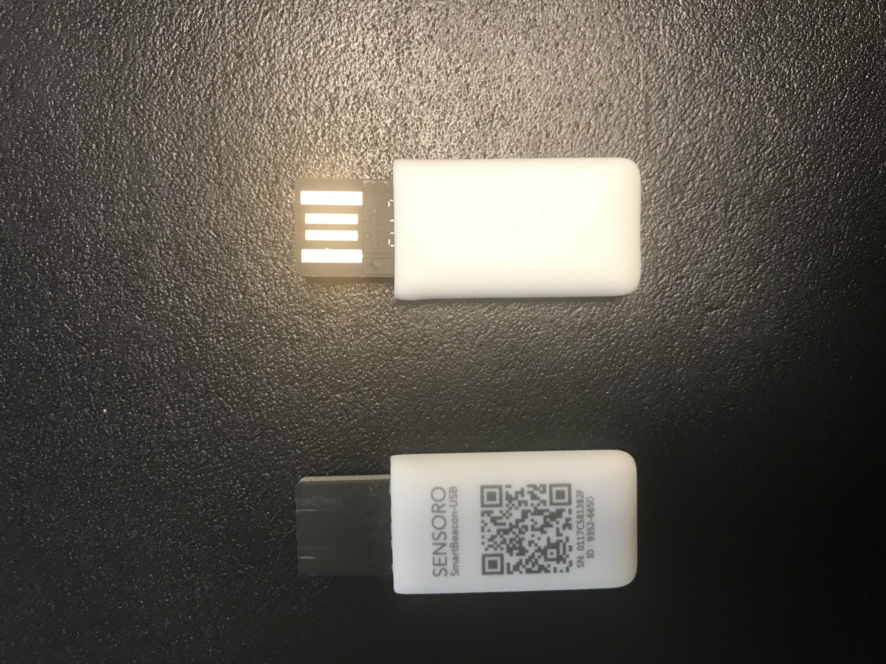

<!--s_name-->
# Btle_driver

<!--e_name-->

<!--s_role-->
<!--e_role-->

## What is btle and btle_beacons?

<!--s_descr-->
Bluetooth low energy beacons! They are used to provide access and registration to the house for cars and motor's or for other mobile services (heart monitoring..)

<!--e_descr-->

## Background

Definition of the bluetooth low energy beacons used for registering mobile devices such as cars, motors, electrical bikes,etc.., the gateways responsible for entering/leaving registration and the respective notifications and ifttt hooks

Bluetooth low energy devices can be purchased from different suppliers, but i bought a beacon in USB format from Sensoro http://www.sensoro.com, see purchase pdf file __2016-08-03 Sensoro USB btle beacon.pdf__.

The advantage is that you can protect these beacons with a pin code, they have a fixed mac address and the power output is adjustable to maximum setting.

The power comes from the USB port which you can find nowadays in every car, and you do not need a battery to power them.

Sensoro btle beacon image: 

You can install the app into a phone and configure the beacon at will and ensure the parameters match with the settings in site.conf.

See the example below for the mac address notation, the name of the device, the uuid and major and minor of the beacon.

What the beacon does is defined in the rights dictionary in the Beacon definition and the key here must be one of the gateways and output is an access_event key for the access_events dictionary in security_interface which translate in actions (opening doors, ...).
For more information on access, see [__access__](Access.md) or [__security_system__](Security.md).

These USB beacons work when they have power, and when inserted in the power outlet of a car or motor cycle, they begin sending when the car or motor is engaged.
A green led light shows that the beacon is working.

I have the experience that the beacons are very reliable and detectable from 50 meters at least in open air when inside a car or motor luggage compartment.

I have placed btle receivers at the entrance of the garden (where the car is registered first when entering, or last when leaving) and a receiver inside the garage which will register a leaving car first. 
These are defined in btle_leaver and btle_arriver gateways and these must be defined in the btle_gateways list.

The way the system is currently is setup is that when you activate the car, doors will automatically open and close when the car passes and you can leave the house with no effort.
The house is not secured when leaving, but if the house has to be locked down (as everyone leaves) when leaving with the car, then prior of engaging the car, i use my iButton key to register a lock down leaving, and then i can simple leave the house with the car and when the garage door automatically closes, the house is locked down automatically.

Very convenient and simple system, used to great comfort! 

Notifications can be defined obviously and in the example below there are emails, sonos voice messages and IFTTT triggers when the car/moto leaves or enters.


<!--s_tbl-->
## List of [properties](Properties.md) for __Btle_driver__:

  | Property | Validation | Optional? | Repeat? | Description |
  | --- | --- | --- | --- | --- |
  | btle_blackout | Virtual | True | - | virtual to blackout all btle devices | 
  | btle_entry_blackout | Virtual | True | - | virtual to blackout arrival of btle devices | 
  | btle_exit_blackout | Virtual | True | - | virtual to blackout leavers of btle devices | 
  | btle_gw_entry | str_list | False | - | list of names of tc btle gateways furthest from the home to first notice the arrival of btle devices wanting to enter | 
  | btle_gw_exit | str_list | False | - | list of names of tc btle gateways closest in the home to first notice the wakeup of btle devices that are going to exit | 
  | btle_gw_other | str_list | True | - | list of names of tc btle gateways used for other purposes than access beacons | 
  | fav | str | True | - | is this a favorite element | 
  | icon | str | True | - | icon file for this element | 
  | notifications | ['b_none', '{id}.b_detected', '{id}.b_entry', '{id}.b_exit', '{id}.b_lost', '{id}.b_refused'] | True | - | notifications whereby {id} is the device equipped with a btle tag, see [__Notifier__](Notifier.md) | 
  | role_me | {tc} | False | - | role_me of 'Btle_driver', adds <beacon> to the roles of the specified tc | 

## List of [Notifications](Notifier.md) for  __Btle_driver__:

  | Notification Suffix | When invoked? |
  | --- | --- | 
  | b_none | person/device not recognised notification | 
  | {id}.b_detected | beacon discovered notification, only if scenes are to be executed | 
  | {id}.b_entry | person/device entry notification | 
  | {id}.b_exit | person/device exit notification | 
  | {id}.b_lost | beacon lost notification, only if scenes are to be executed | 
  | {id}.b_refused | person/device entry refused notification | 

## List of [Errors/Warnings](Error_Warn.md) for  __Btle_driver__:

  | Error/Warning ID | Error/Warning MSG | Occurring When? |
  | --- | --- | --- | 
  | err_b_drivers | !!btle drivers for <{}> not installed!! |  
  | err_b_par | !!Beacon {:}-{:} has wrong {:} pars <{:}> != <{:}> |  
  | err_b_pi_la | !!btle leaver <{:}> is also defined in btle_arrivals list <{:}> |  
  | err_b_role | !!btle role is {:} and must be {:} |  
  | err_b_sock | !!btle socket cannot be opened!! |  
  | err_b_tc_n | !!btle gateway <{:}> is not a defined tc <{:}> |  
  | msg_b_detected | Discovered Beacon {:} - {:}/{:} |  
  | msg_b_found | Found Beacon {:} - {:} at {:} |  
  | msg_b_gw | Beacon: {:} -> {:} |  
  | msg_b_lost | Lost Beacon {:} - {:}/{:} |  
<!--e_tbl-->

Btle gateway receivers are raspberry's with a dongle or raspberry pi3's with internal bluetooth low energy receivers.
The installation script for the raspberry takes into account the gateway role and automatically adds the driver and the custom made java script for checking presence or absence of beacons.
If the beacon gateway name starts with "PI-", then it will be removed for internal representation, which will only be noticeable in reports.

## Example btle_driver configuration

<!--s_insert_{"tree":"(o:Btle_driver)"}-->

from project.py tree:(o:Btle_driver)
```python3
# --> project.py :<dk:project,o:Project,kw:drivers,lp:13,o:Btle_driver>

from lucy_app import *

Btle_driver(
    btle_blackout = Virtual(duration = 180),
    btle_gw_entry = ["PI-Garden","PI-Gate","PI-Soccer"],
    btle_gw_exit = ["PI-Security"],
    btle_gw_other = ,
    notifications = {
            "b_none":[
                Mail(subject='{app_txt}', to='{prime}', cams=None, cam_groups=None, passes=0, body_file='', files2mail=None, ceiling=None),
                Say(txt='{tts_start} unidentified something approached the house{tts_end}', ceiling=None, times=1, override=None, volume=None),
                Cal(txt='{app_txt}', summary='', ceiling=None),
                Ifttt(txt='unidentified', ceiling=None)],
            "{id}.b_detected":[
                Mail(subject='{app_txt}', to='{prime}', cams=None, cam_groups=None, passes=0, body_file='', files2mail=None, ceiling=None),
                Say(txt='{tts_start} Leandro arrived for the soccer training{tts_end}', ceiling=None, times=1, override=None, volume=None),
                Cal(txt='{app_txt}', summary='', ceiling=None),
                Ifttt(txt='beacon_discovered', ceiling=None)],
            "{id}.b_entry":[
                Mail(subject='{app_txt}', to='{prime}', cams=None, cam_groups=None, passes=0, body_file='', files2mail=None, ceiling=None),
                Cal(txt='{app_txt}', summary='', ceiling=None),
                Say(txt='{tts_start} {id} entered the house{tts_end}', ceiling=None, times=1, override=None, volume=None),
                Ifttt(txt='entry', ceiling=None)],
            "{id}.b_exit":[
                Mail(subject='{app_txt}', to='{prime}', cams=None, cam_groups=None, passes=0, body_file='', files2mail=None, ceiling=None),
                Say(txt='{tts_start} {id} left the house{tts_end}', ceiling=None, times=1, override=None, volume=None),
                Cal(txt='{app_txt}', summary='', ceiling=None),
                Ifttt(txt='exit', ceiling=None)],
            "{id}.b_lost":[
                Mail(subject='{app_txt}', to='{prime}', cams=None, cam_groups=None, passes=0, body_file='', files2mail=None, ceiling=None),
                Say(txt='{tts_start} Leandro closed the soccer training{tts_end}', ceiling=None, times=1, override=None, volume=None),
                Cal(txt='{app_txt}', summary='', ceiling=None),
                Ifttt(txt='beacon_lost', ceiling=None)],
            "{id}.b_refused":[
                Mail(subject='{app_txt}', to='{prime}', cams=None, cam_groups=None, passes=0, body_file='', files2mail=None, ceiling=None),
                Say(txt='{tts_start} {id} is refused access to the house{tts_end}', ceiling=None, times=1, override=None, volume=None),
                Cal(txt='{app_txt}', summary='', ceiling=None),
                Ifttt(txt='refused_entry', ceiling=None)]},
    role_me = "PI-Security")

```

<!--e_insert-->
