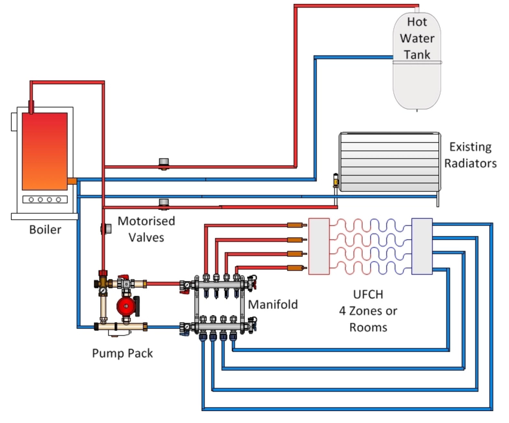

<!--s_name_ci-->
# Climate_system

<!--e_name_ci-->

## Summary

<!--s_descr_ci-->
Climate Systems are typically multi room systems that drive multiple makers in multiple rooms with a central energy source such as a boiler and a pump to drive the energy around. This opposed to solo makers, which impact a climate just in one room and do not have not a multi system to back them. This App controls boilers, pumps, hvac devices in a classical radiator or underfloor heating (or combined) and everything else to give you excellent climate comfort given the context of comfort, standard or economy, the rooms that are in scope and the home occupancy, normal day, away, sleeping or on holiday

<!--e_descr_ci-->

<!--s_sub_toc_climate-->

Climatisation is a crucial component of a home control system and significant time has been invested to make this rich in functionality and options.

Climatisation includes heating, cooling and proper ventilation and humidity control and the app is designed to cover these needs.
Most home control solutions involve a nice thermostat and some valve control units. Problematic is the low reliability with battery powered wireless devices.

Although the app allows the use of such devices, a house is built for many decades and the continues maintenance of such devices is surely a major enthusiasm put off on the long turn and therefore we need to offer alternatives. 

With the use of 1 wire temperature sensors and 24V valves, a reliable system can be built that works decades with little or no maintenance whatsoever as it should be.

In the same room or building you can combine multiple climate sources, such as a daikin multisplit in combination with a traditional boiler heating system.
They are put to work seamlessly together for your climate needs.
Even when you just have a classical multi room radiator system or underfloor heating or even a complex system of radiators and underfloor heaters and a hot water tank with motorized valves and manifolds.

The climatisation mode in effect at a given moment in the house can be cooling, none or heating, and this depends on the outside temperature.  This switch from heating to cooling and the inverse happens automatically and is announced with the usual system of notifications.

A climatisation comfort setting exists and can be set for the whole house or just for a room or set of rooms and it can be "comfort","normal","economy".   The difference between comfort and economy is a deviation from the target temperature (colder or warmer).

Rooms can be switched off when not in use and then a maintain temperature is enforced.

All temperature target settings are influenced by the occupancy mode, sleep, away or day mode, the time of the day and day of the week and if the house is set in holidays mode.

Every 5 seconds, the room temperatures are checked against the target and valves, pump and heaters/coolers are actualized.
The pump speed depends on the number of heating/cooling devices needing energy and the heater temperature range depends on the outside temperature, colder outside means higher boiler temperatures.
This ensures that energy is spent only there where needed and justly the amount to reach the programmed setpoint level. 

The air removal mode can be activated, where all the valves are opened and pump and heater are deactivated to allow maintenance personnel to remove air from the system.

Climatisation comfort, enabling or disabling a room can be controlled by voice, or set via the google calendar or any one of the feeders app channels.
 
The climate system registers when doors or windows are open and stop normal climatisation to avoid energy loss.

Rooms can be prioritized when lots of rooms need energy (imagine coming home in the cold after a holiday, some rooms you need warming up faster than others).

Setting the house in Holiday mode disables all heating and maintains a safeguarding low (or high) temperature.   Some rooms can deviate (a target setting exists for holiday mode) for example when you have plants that need upper or lower temperatures to survive.
 
The software takes care of the valves and pumps that they get active once a day to avoid malfunction due to not being used for a long period.
 
Reporting is very extensive, not only in real time on the displays of the climate controller(s), but also on a daily cumulative basis.

<!--e_sub_toc_climate-->

## Example : combining existing radiators and underfloor heating

How do existing radiators and underfloor heating work together?
Underfloor heating and radiators are regularly used together. Many people have installed underfloor heating on the ground floor and radiators on the upper floors, and vice versa.
Keeping your existing radiators in upstairs rooms is certainly a cost efficient alternative. Your existing boiler (if suitable) should provide hot water for both heating systems, as well as hot water for showers, baths etc.



The diagram shows an outline of a four circuit underfloor system connected to an existing heating system.
The boiler feeds three water circuits. Water flow is controlled by motorised valves.

* Circuit 1. A hot water circuit from the boiler goes directly to the radiator system and returns to the boiler.
* Circuit 2. The hot water cylinder is fed directly and returns to the boiler.
* Circuit 3. The underfloor heating system has a new water circuit from the boiler.

This third circuit has a pump pack fitted, basically a pump and a set of valves. 
This feeds a manifold which splits into four zones or rooms. You can have a single circuit up to a maximum of twelve depending on the manifold.
Your hot water supply and radiators use a timer and temperature controller.
The underfloor heating system uses a new set of programmable room thermostats.
The controls of this heating system would include wiring centers to control the boiler and a set of motorised valves that allow hot water to enter the radiators and underfloor circuits and on/off valves on the radiators and the floor circuits. 

## How to do?

Climatisation is defined site.conf in __climatisation_manager__, __climatisation_interface__ and through __climate_control__ in every room.

The climate module contains the scripts for climatisation of the house, that is, heating, cooling, drying or humidification, ventilation, making room dark or light, there is really no
limit to what this module can do.
The clim_dna dictionary in app_obj.conf contains the properties that can be climatised, what the sensors must read and the makers must make:

<!--s_insert_{"prj_parser":"app_obj.conf","sections":["CLIMATE"],"vars":["clim_dna","clim_sp_in_between","sensor_types"]}-->

from app_obj.conf:
```python3
[CLIMATE]

clim_dna={"Temperature": {"i_make":{"warm":"is_heating","cold":"is_cooling"},"i_read":"°C","clim_tst":{"is_heating":"<","is_cooling":">"},"soll":"temp_soll","sens_ok":"temp_ok","short":"temp","fmt":"{:>05.2f}"},
	"Humidity":    {"i_make":{"dry":"is_humid","moist":"is_dry"},"i_read":"%H","clim_tst":{"is_dry":"<","is_humid":">"},"soll":"humid_soll","sens_ok":"humid_ok","short":"humid","fmt":"{:>05.0f}"},
	"Luminosity":  {"i_make":{"dark":"is_lum_light","light":"is_lum_dark"},"i_read":"%L","clim_tst":{"is_light":">","is_dark":"<"},"soll":"light_soll","sens_ok":"lum_ok","short":"lum","fmt":"{:>05.0f}"}}
clim_sp_in_between={"Temperature":"warm_sp","Humidity":"dry_sp","Luminosity":"light_sp"}
sensor_types=["°C","%H","%L","Lux","mmB","dP°C","CO2","CO","msec","%V"]

```

<!--e_insert-->

In site.conf, for every room to be climatised properties for climate_control can be defined and these include sensors, makers, targets for the climatisation to achieve and user input fields.

The climate manager takes every aspect of the clim_dna sequentially such as temperature, calculates the targets for every room and using the sensors determine if the room climate on that property is ok or not.
Then every climate system is activated (climate systems typically manage sets of makers covering multiple rooms) whereby these makers are set and other attributes such as pumps and boilers are adjusted.

As example taking the obvious climate property Temperature,

Climate Manager Does:
1. measuring the temperature of every room and compare against a set temperature (configurable in conf file), normal, comfort or economy, and sleeping, holiday, away and normal
2. determine if the room is below the target or not and if temperature is extreme 
3. activates every climate system that works temperature
4. activates the makes that are individually set
5. loops over the other climate properties
6. makes the reporting (current and cumulative)

Climate Systems Does: 
1. controls the climate makers (open/close) and setpoints and measuring the controller temperature (should be close to the boiler one when open)
2. controls the boiler (on/off) and controlling the input/output temperature range based on the outside temperature
3. controls the pump (on/off) and dynamically adjusting the speed of the pump based on the number of makers needing energy
4. periodically keeping the valves of the climate controller active to avoid long time no use (summer) rusting
5. special condition of opening all the valves when air in the system has to be removed
6. prioritising the rooms/makers when all need energy (end of holiday, back home scenario) to avoid long recovery time

For some of the makers properties (i_make="wind","vent","fan","fan_direction"), value_logic can be used to set the value of the maker, there is no additional processing provided in the climatisation module.

Further adjustment parameters are available in app_core.conf in the sections [COOLING], [HEATING] and [CLIMATE]. 

## Climate Management Parameters

Below are the different parameters listed that can be set to configure the workings of the climate systems.
Please use the default values and change only if you know what you are doing.

<!--s_tbl_cm-->
## List of [properties](Properties.md) for __Climate_manager__:

  | Property | Validation | Optional? | Repeat? | Description |
  | --- | --- | --- | --- | --- |
  | C_outdoor_cm | Sensor | False | - | outside temperature sensor, lower temperature means the more warm the boiler water has to become before the boiler is deactivated | 
  | climate_comfort_mode | Virtual_R | False | - | virtual to capture the current climate comfort mode : 'Economy','Normal' or 'Comfort' at a global level, as rooms can be put into an individual climate mode.  Economy (comfort) means that a value is subtracted (added) to every rooms setpoint | 
  | climate_mode | Virtual_R | False | - | virtual to capture the climate system state : 'Cooling','Off' or 'Heating'.  The climate system is off when the outside temperature is within comfort boundaries and there is no need for climatisation | 
  | cold_priority_temp | float | False | - | above this temperature, cooling is activated, even when the room is off | 
  | fav | str | True | - | is this a favorite element | 
  | heat_priority_frost | float | False | - | is the temp of the room in which it becomes a heat_room_is_priority room notwithstanding its status defined below | 
  | holiday_sp | data_dict | False | - | holiday absence minimum safeguards, is a dict with keys: warm_sp, cold_sp, dry_sp, moist_sp, dark_sp, light_sp | 
  | icon | str | True | - | icon file for this element | 
  | is_cooling | Virtual | False | - | virtual to capture if the climate system is in cooling mode | 
  | is_cooling_temp | float | False | - | temperature outside above, then cooling will be activated | 
  | is_dry | Virtual | True | - | virtual to capture if the climate system is dry and needs humidification | 
  | is_heating | Virtual | False | - | virtual to capture if the climate system is in heating mode | 
  | is_heating_temp | float | False | - | temperature outside below, then heating will be activated, just make sure that is_cooling_temp is higher than is_heating_temp | 
  | is_humid | Virtual | True | - | virtual to capture if the climate system is humid and needs drying | 
  | is_lum_dark | Virtual | True | - | virtual to capture if the climate system is dark and needs lightening | 
  | is_lum_light | Virtual | True | - | virtual to capture if the climate system is light and needs darkening | 
  | notifications | ['climate_report', 'comfort_0', 'comfort_1', 'economy_0', 'economy_1', '{room}.clim_on_0', '{room}.clim_on_1', '{room}.comfort_0', '{room}.comfort_1', '{room}.economy_0', '{room}.economy_1', '{room}.humid_ok_0', '{room}.humid_ok_1', '{room}.lum_ok_0', '{room}.lum_ok_1', '{room}.temp_ok_0', '{room}.temp_ok_1'] | True | - | extensive list of notifications, see [__Notifier__](Notifier.md) | 
  | role_followers | str_list | False | - | list of names of tc's that are climate slaves, all the same processing but driving outputs is disabled as this is exclusive for the master.  They are good to show on a display what happens... | 
  | role_me | {tc} | False | - | role_me of 'Climate_manager', adds <m.clim> to the roles of the specified tc | 
  | sp_presets | data_dict | True | - | dictionary of climate setpoint presets | 

## List of [Notifications](Notifier.md) for  __Climate_manager__:

  | Notification Suffix | When invoked? |
  | --- | --- | 
  | climate_report | notification when the climate report is issued | 
  | comfort_0 | climate comfort mode is disabled | 
  | comfort_1 | climate comfort mode is enabled | 
  | economy_0 | climate economy mode is disabled | 
  | economy_1 | climate economy mode is enabled | 
  | {room}.clim_on_0 | climate for the room is disabled | 
  | {room}.clim_on_1 | climate for the room is enabled | 
  | {room}.comfort_0 | climate comfort mode for the room is disabled | 
  | {room}.comfort_1 | climate comfort mode for the room is enabled | 
  | {room}.economy_0 | climate economy mode for the room is disabled | 
  | {room}.economy_1 | climate economy mode for the room is enabled | 
  | {room}.humid_ok_0 | humidity for the room is nok | 
  | {room}.humid_ok_1 | humidity for the room is ok | 
  | {room}.lum_ok_0 | light intensity for the room is nok | 
  | {room}.lum_ok_1 | light intensity for the room is ok | 
  | {room}.temp_ok_0 | temperature for the room is nok | 
  | {room}.temp_ok_1 | temperature for the room is ok | 

## List of [Errors/Warnings](Error_Warn.md) for  __Climate_manager__:

  | Error/Warning ID | Error/Warning MSG | Occurring When? |
  | --- | --- | --- | 
  | err_attr_type | !!Parse of {:} in {:} <{:}> |  
  | err_clim_cntrl | !!Climate for <{:}> with <{:}> verify <{:}> |  
  | err_clim_mk_make | !!Maker <{}> makes {}, but production can only make: {} |  
  | err_clim_mk_must | !!Maker <{}> should be member_of transport: {} |  
  | err_clim_pr_member | !!Transport <{}> has invalid member_of: {}, should be one of {} |  
  | err_clim_s | !!Climate_manager role_follow error <{:}> <{:}> |  
  | err_clim_tr_member | !!Maker <{}> has invalid member_of: {}, should be one of {} |  
  | err_cool_heat | !!Climatisation conf error, temp cool {:} - temp heat {:} must be > 1 °C |  
  | err_ip_missing | !!ip of {:} missing |  
  | err_ip_spec | !!{:} spec_func is <{:}> not in: [None, 'Master', 'Echo'] |  
  | err_mail_key | !!Mail Notifs with <{:}> undefined {:} |  
  | err_mkr_defect | !!{:} in {:} is defect? {:>05.2f}-{:>05.2f} < {:>05.2f} |  
  | err_no_setpoint | !!Setpoint {:} in {:} for {:} missing |  
  | err_owdevice_unknown | !!{:} Unknown in {:} |  
  | err_room_temp | !!Room {:} sensor now below {:} °C limit with {:+06.2f} °C |  
  | err_soll_ip | !!Soll from ip <plc_grp> {:} in {:} undefined |  
  | err_soll_no_default | !!Soll {:} no default on/off {:} for mode {:} |  
  | err_soll_no_mode | !!Soll {:} has no {:} for mode {:} |  
  | err_soll_no_time | !!Soll {:} no time/value pair {:} |  
  | err_soll_not_found | !!Soll {:} {:} {:} not found |  
  | err_sp_id | !!Climate for room <{:}> contains a clim_target <{:}> not in {:} |  
  | err_type_wrong | !!{:},type={:} not={:} as in conf |  
  | err_unipi_wrong | !!{:} attached to {:} not {:} |  
  | err_weekday_miss | !!Weekday {:} not defined in {:} |  
  | msg_clim_nty | Climate Slave notification skipped {:} |  
  | msg_mkr_activation | {:} {:}/{:} {:} Activation {:} mins |  
  | msg_mkr_working | {:} in {:} is working {:>05.2f}-{:>05.2f} > {:>05.2f} |  
  | msg_plc_now | Room {:} now close to {:} |  
  | msg_pump_act_run | Heating Pump <{:}> Activation Run |  
  | msg_room_locked | Room {:} now locked |  
  | msg_room_low | Room {:} now below {:} |  
  | msg_room_not_locked | Room {:} not locked |  
  | msg_temp_config | Temperature Config Reloaded |  
<!--e_tbl_cm-->

## Definition of climate_system

<!--s_role_ci-->
<!--e_role_ci-->

Below are the different parameters listed that can be used to interface to the energy generating hardware kit available in the market. 
Specifically observe climate_mode and climate_comfort_mode.

<!--s_tbl_ci-->
## List of [properties](Properties.md) for __Climate_system__:

  | Property | Validation | Optional? | Repeat? | Description |
  | --- | --- | --- | --- | --- |
  | air_removal | Virtual | True | - | when active, the pump and boiler are automatically stopped and all valves are opened to allow air removal in optimal circumstances | 
  | clim_SW_periodic_on | Virtual | True | - | is the long idle activation for the clim_SW, the climate makers switches | 
  | fav | str | True | - | is this a favorite element | 
  | icon | str | True | - | icon file for this element | 
  | production | ['Clim_energy_SW', 'Clim_energy_DM', 'Input'] | True | True | climate production devices such as gas/electricity boilers, heaters | 
  | role_me | {tc} | False | - | role_me of 'Climate_system', adds <m.clim> to the roles of the specified tc | 
  | storage | ['Clim_SW', 'Clim_SP', 'Clim_DM', 'Clim_ANY'] | True | True | climate storage devices such as hot water tanks | 
  | transport | ['Output', 'Motor'] | True | True | climate transport devices such as pumps, valves, motor valves | 
<!--e_tbl_ci-->

## Example climate_management


<!--s_insert_{"tree":"(o:Climate_manager)"}-->

from project.py tree:(o:Climate_manager)
```python3
# --> project.py :<dk:project,o:Project,kw:apps,lp:11,o:Climate_manager>

from lucy_app import *

Climate_manager(
    C_outdoor_cm = Sensor(i_read = "°C",path = "unipi:PI-Gate,ow,28DAE37306000070,DS18B20,,99"),
    climate_comfort_mode = Virtual_R(copy_things = {
                    "twin_copy@-1":Output(path = "vera:Vera_plus,zw,buttonset,152,Status6"),
                    "twin_copy@1":Output(path = "vera:Vera_plus,zw,buttonset,152,Status2")},descr_range = ["Economy","Standard","Comfort"],digital_range = [-1,0,1]),
    climate_mode = Virtual_R(descr_range = ["Cooling","Deactivated","Heating"],digital_range = [-1,0,1]),
    cold_priority_temp = 33,
    heat_priority_frost = 5.0,
    holiday_sp = {"cold_sp":27.0,"dry_sp":90,"warm_sp":10.0},
    is_cooling = Virtual(
            notifications = {
                    "active":[
                        Mail(subject='Cooling Climatisation Started', to='{prime}', cams=None, cam_groups=None, passes=0, body_file='', files2mail=None, ceiling=None),
                        Say(txt='{tts_start} cooling climatisation started {tts_end}', ceiling='1/day', times=1, override=None, volume=None)],
                    "inactive":[
                        Mail(subject='Cooling Climatisation Halted', to='{prime}', cams=None, cam_groups=None, passes=0, body_file='', files2mail=None, ceiling=None),
                        Say(txt='{tts_start} with the nice temperature outside, cooling climatisation stopped {tts_end}', ceiling='1/day', times=1, override=None, volume=None)]}),
    is_cooling_temp = 24,
    is_heating = Virtual(
            notifications = {
                    "active":[
                        Mail(subject='Heating Climatisation Started', to='{prime}', cams=None, cam_groups=None, passes=0, body_file='', files2mail=None, ceiling=None),
                        Say(txt='{tts_start} heating climatisation started {tts_end}', ceiling='1/day', times=1, override=None, volume=None)],
                    "inactive":[
                        Mail(subject='Heating Climatisation Halted', to='{prime}', cams=None, cam_groups=None, passes=0, body_file='', files2mail=None, ceiling=None),
                        Say(txt='{tts_start} with the nice temperature outside, heating climatisation stopped {tts_end}', ceiling='1/day', times=1, override=None, volume=None)]}),
    is_heating_temp = 22,
    notifications = {
            "climate_report":Mail(subject='Complete Report', to='{prime}', cams=None, cam_groups=None, passes=0, body_file='cum', files2mail=['p_cum.log', 'p_cur.log'], ceiling=None),
            "comfort_0":Say(txt='{tts_start} house is set to regular climatisation{tts_end}', ceiling=None, times=1, override=None, volume=None),
            "comfort_1":Say(txt='{tts_start} house is set to comfort climatisation{tts_end}', ceiling=None, times=1, override=None, volume=None),
            "economy_0":Say(txt='{tts_start} house is set to regular climatisation{tts_end}', ceiling=None, times=1, override=None, volume=None),
            "economy_1":Say(txt='{tts_start} house is set to economy climatisation{tts_end}', ceiling=None, times=1, override=None, volume=None),
            "{room}.clim_on_0":Say(txt='{tts_start} {room} climatisation is de-activated{tts_end}', ceiling=None, times=1, override=None, volume=None),
            "{room}.clim_on_1":Say(txt='{tts_start} {room} climatisation is activated, it will get comfortable soon{tts_end}', ceiling=None, times=1, override=None, volume=None),
            "{room}.comfort_0":Say(txt='{tts_start} {room} is set to regular climatisation{tts_end}', ceiling=None, times=1, override=None, volume=None),
            "{room}.comfort_1":Say(txt='{tts_start} {room} is set to comfort climatisation{tts_end}', ceiling=None, times=1, override=None, volume=None),
            "{room}.economy_0":Say(txt='{tts_start} {room} is set to regular climatisation{tts_end}', ceiling=None, times=1, override=None, volume=None),
            "{room}.economy_1":Say(txt='{tts_start} {room} is set to economy climatisation{tts_end}', ceiling=None, times=1, override=None, volume=None)},
    role_followers = ["PI-CSlave"],
    role_me = "PI-Climate",
    sp_presets = {
            "cold_preset":{"away":28.0,"comfort":-1.0,"day":{"off":28.0,"on":24.0},"economy":1.5,"sleep":{"off":28.0,"on":24}},
            "humid_preset":{"away":90.0,"comfort":0.0,"day":95.0,"economy":0.0,"sleep":90.0},
            "warm_preset_1":{
                    "away":17.0,
                    "clim_on":True,
                    "comfort":2.0,
                    "day":{"off":13.0,"on":{"00:00":18.0,"07:30":19.0,"16:30":21.0,"22:00":20.5,"23:00":20.0,"23:30":18.0}},
                    "economy":-1.5,
                    "holiday":15.0,
                    "sleep":17.0},
            "warm_preset_2":{
                    "away":{"off":13.0,"on":17.5},
                    "clim_on":True,
                    "comfort":1.0,
                    "day":{"off":13.0,"on":{"00:00":20.0,"09:30":18.5,"12:00":20.0,"14:00":18.5,"17:00":20.0}},
                    "economy":-1.5,
                    "sleep":{"off":13.0,"on":20.0}},
            "warm_preset_3":{
                    "away":{"off":13.0,"on":18.0},
                    "clim_on":False,
                    "comfort":1.0,
                    "day":{"off":13.0,"on":20.5},
                    "economy":-1.5,
                    "sleep":{"off":13.0,"on":19.5}},
            "warm_preset_4":{
                    "away":{"off":13.0,"on":18.0},
                    "clim_on":False,
                    "comfort":1.0,
                    "day":{"off":13.0,"on":{"preset":"warm_preset_41"}},
                    "economy":-1.5,
                    "sleep":{"off":13.0,"on":{"preset":"warm_preset_41"}}},
            "warm_preset_41":{"00:00":19.5,"07:00":20.5,"10:00":18.5,"17:00":20.5,"23:00":19.5},
            "warm_preset_5":{
                    "away":{"off":13.0,"on":18.0},
                    "clim_on":True,
                    "comfort":1.0,
                    "day":{"off":13.0,"on":"sensor_switch_living_dining_0"},
                    "economy":-1.5,
                    "sleep":{"off":13.0,"on":19.5}}})

```

<!--e_insert-->


## Example climate_system

<!--s_insert_{"tree":"(o:Climate_system)"}-->

from project.py tree:(o:Climate_system)
```python3
# --> project.py :<dk:project,o:Project,kw:property,lp:0,o:House,kw:places,dk:garage_dressing,o:Room,kw:contents,lp:5,o:Climate_system>

from lucy_app import *

Climate_system(
    air_removal = Virtual(
            copy_things = {
                    "twin_copy":Output(path = "vera:Vera_plus,zw,buttonset,152,Status5")},
            notifications = {
                    "active":[
                        Mail(subject='The heating air removal process is started', to='{prime}', cams=None, cam_groups=None, passes=0, body_file='', files2mail=None, ceiling=None),
                        Say(txt='{tts_start} the heating air removal process is started{tts_end}', ceiling=None, times=1, override=None, volume=35)],
                    "inactive":[
                        Mail(subject='The heating air removal process is completed', to='{prime}', cams=None, cam_groups=None, passes=0, body_file='', files2mail=None, ceiling=None),
                        Say(txt='{tts_start} the heating air removal process is stopped, heating works normal again{tts_end}', ceiling=None, times=1, override=None, volume=35)]}),
    clim_SW_periodic_on = Virtual(value_app = Makers_pertinence(check_freq_mins=5, not_used_hours=13, open_duration_mins=4, C_ok_diff=-0.001)),
    production = {
            "gas_heater":Clim_energy_SW(
                    copy_things = {
                            "carbon_copy":Output(path = "unipi:PI-Climate,relay,3")},
                    i_make = ['warm'],
                    method_things = {
                            "C_in":Sensor(i_read = "°C",path = "unipi:PI-Climate,ow,28F1EE5E07000094,DS18B20,,77"),
                            "C_out":Sensor(i_read = "°C",path = "unipi:PI-Climate,ow,28E6B45F070000ED,DS18B20,,96")},
                    path = "unipi:PI-Climate,relay,2",
                    value_app = Boiler_on_off(max_boiler_nr_rooms=6, C_boiler_highest=70, C_boiler_lowest=40, C_boiler_threshold=4, C_outside_max_boiler=-5, C_outside_min_boiler=15))},
    role_me = "PI-Climate",
    storage = {
            "hot_water_tank":Clim_SW(
                    active = 0,
                    i_make = ['warm'],
                    member_of = ["pump"],
                    method_things = {
                            "C_fluid":Sensor(i_read = "°C",path = "unipi:PI-Climate,ow,28A91F600700002D,DS18B20,,84")},
                    path = "unipi:PI-Test,relay,1",
                    value_logic = {"assign":{"hot_water_tank^C_fluid<55":"0","hot_water_tank^C_fluid>65":"1"},"disable":['is_holiday']})},
    transport = {
            "%vent":Motor(path = "unipi:PI-Gate,ao,1",value_logic = {"assign":{"is_armed":"15","is_day":"50","is_holiday":"10","sleep":"25"}}),
            "pump":Motor(
                    duration = 310,
                    member_of = ["gas_heater"],
                    method_things = {
                            "on_off_relay":Output(active = 0,duration = 310,path = "unipi:PI-Climate,relay,1")},
                    path = "unipi:PI-Climate,ao,1",
                    threshold = 1.0,
                    value_app = Pump_speed_set(act_run_idle_hours=13, max_speed_active_makers=60, speed_act_run=50, speed_lowest=50))})

```

<!--e_insert-->

## Climate Production

These devices generate the energy and examples are the boilers, heaters using gas, electricity or another source of energy

<!--s_name_e_sw-->
# Clim_energy_SW

<!--e_name_e_sw-->

<!--s_descr_e_sw-->
Climate energy Switch, is a binary on/off switch for gas or electricity heaters or coolers. Specify i_make.

<!--e_descr_e_sw-->

<!--s_tbl_e_sw-->
## List of [properties](Properties.md) for __Clim_energy_SW__:

  | Property | Validation | Optional? | Repeat? | Description |
  | --- | --- | --- | --- | --- |
  | active | valid_set_int | False | - | designate the active state for a binary thing, either 0 or 1 | 
  | copy_things | {'carbon_copy': {'doc': {'descr': 'receiving copy - carbon copy', 'short': 'carbon_copy'}, 'optional': True, 'type': ['Output', 'Motor', 'Light', 'Dim_light', 'Virtual', 'Virtual_A']}, 'twin_copy': {'doc': {'descr': 'two way copy - twin_copy', 'short': 'twin_copy'}, 'optional': True, 'type': ['Output', 'Motor', 'Light', 'Dim_light', 'Virtual', 'Virtual_A']}} | False | - | copies of things, either carbon copy (one sided copy) or twin copy (copies in both directions) | 
  | descr | str | False | - | free description field for this thing | 
  | descr_01 | list-2 | False | - | description for a binary thing when payload value is 0 or 1 | 
  | duration | float | False | - | duration of the output being active/ input must be active for duration before considered active | 
  | effect_virtuals | ['Virtual', 'Virtual_A', 'Virtual_R'] | False | True | virtual things that are affected by, or can have an effect on, the value of the parent thing | 
  | fav | str | True | - | is this a favorite element | 
  | i_make | str | False | - | the type of environmental impact that this thing makes | 
  | icon | str | True | - | icon file for this element | 
  | member_of | list | True | - | a list of group names to which thing belongs | 
  | method_things | ['activate_button', 'C_fluid', 'C_in', 'C_out', 'de_activate_button', 'is_on', 'on_off_relay', 'toggle_button'] | False | - | special methods of this thing, mostly realised through things | 
  | notifications | ['active', 'app_done', 'app_start', 'disable_off', 'disable_on', 'enable_off', 'enable_on', 'freeze_off', 'freeze_on', 'inactive', 'notify+', 'payload_no'] | True | - | the notifications for outputs, see [__Notifier__](Notifier.md) | 
  | path | str, str_list | False | - | path to the specific hardware element | 
  | th_grp | str | False | - | the technical group to which this thing belongs, used in groupings for lists and reports | 
  | value_app | tuple:value_app_tuples | True | - | app logic to determine the payload based programming logic and input parameters | 
  | value_logic | dict | False | - | logic to automatically determine the payload  based on time or other things | 

## List of [Notifications](Notifier.md) for  __Clim_energy_SW__:

  | Notification Suffix | When invoked? |
  | --- | --- | 
  | active | when payload is active | 
  | app_done | when a things_app completes | 
  | app_start | when a things_app starts | 
  | disable_off | when all of the disable conditions fail | 
  | disable_on | when one of the disable conditions succeed | 
  | enable_off | when one of the enable conditions fail | 
  | enable_on | when all the enable conditions succeed | 
  | freeze_off | all of the freeze conditions fail | 
  | freeze_on | one of the freeze conditions succeed | 
  | inactive | when payload is nonactive | 
  | notify+ | extra notifications | 
  | payload_no | the requested payload is refused | 

## List of [copy_things] for  __Clim_energy_SW__:

  | Copy Thing | Type Thing | What it does? |
  | --- | --- | --- | 
  | carbon_copy | ['Output', 'Motor', 'Light', 'Dim_light', 'Virtual', 'Virtual_A'] | {'descr': 'receiving copy - carbon copy', 'short': 'carbon_copy'} | 
  | twin_copy | ['Output', 'Motor', 'Light', 'Dim_light', 'Virtual', 'Virtual_A'] | {'descr': 'two way copy - twin_copy', 'short': 'twin_copy'} | 

## List of [method_things] for  __Clim_energy_SW__:

  | Method Thing | Type Thing | What it does? |
  | --- | --- | --- | 
  | activate_button | ['Button'] | {'descr': 'activates the output if inactive', 'short': 'activate_button'} | 
  | C_fluid | ['Sensor'] | {'descr': 'this measures the °C fluid temperature', 'short': '°C_fluid'} | 
  | C_in | ['Sensor'] | {'descr': 'this measures the °C fluid input temperature', 'short': '°C_in'} | 
  | C_out | ['Sensor'] | {'descr': 'this measures the °C fluid output temperature', 'short': '°C_out'} | 
  | de_activate_button | ['Button'] | {'descr': 'deactivates the output if active', 'short': 'de_activate_button'} | 
  | is_on | Input | {'descr': 'is the input to measure if the output is active or not', 'short': 'is_on'} | 
  | on_off_relay | ['Output', 'Light'] | {'descr': 'deactivates the output if active', 'short': 'de_activate_button'} | 
  | toggle_button | ['Button'] | {'descr': 'is an input to toggle the output state', 'short': 'toggle_button'} | 
<!--e_tbl_e_sw-->

<!--s_name_e_dm-->
# Clim_energy_DM

<!--e_name_e_dm-->

<!--s_descr_e_dm-->
Climate energy Dimmer, is a device that has a 0% to 100% setting and value can be set with value_logic.  Typically this is for heat/cool pump generation. Specify i_make.

<!--e_descr_e_dm-->

<!--s_tbl_e_dm-->
## List of [properties](Properties.md) for __Clim_energy_DM__:

  | Property | Validation | Optional? | Repeat? | Description |
  | --- | --- | --- | --- | --- |
  | copy_things | {'carbon_copy': {'doc': {'descr': 'receiving copy - carbon copy', 'short': 'carbon_copy'}, 'optional': True, 'type': ['Output', 'Motor', 'Light', 'Dim_light', 'Virtual', 'Virtual_A']}, 'twin_copy': {'doc': {'descr': 'two way copy - twin_copy', 'short': 'twin_copy'}, 'optional': True, 'type': ['Output', 'Motor', 'Light', 'Dim_light', 'Virtual', 'Virtual_A']}} | False | - | copies of things, either carbon copy (one sided copy) or twin copy (copies in both directions) | 
  | descr | str | False | - | free description field for this thing | 
  | duration | float | False | - | duration of the output being active/ input must be active for duration before considered active | 
  | effect_virtuals | ['Virtual', 'Virtual_A', 'Virtual_R'] | False | True | virtual things that are affected by, or can have an effect on, the value of the parent thing | 
  | fav | str | True | - | is this a favorite element | 
  | i_make | str | False | - | the type of environmental impact that this thing makes | 
  | icon | str | True | - | icon file for this element | 
  | member_of | list | True | - | a list of group names to which thing belongs | 
  | method_things | ['activate_button', 'de_activate_button', 'is_on', 'on_off_relay', 'toggle_button'] | False | - | special methods of this thing, mostly realised through things | 
  | notifications | ['active', 'app_done', 'app_start', 'disable_off', 'disable_on', 'enable_off', 'enable_on', 'freeze_off', 'freeze_on', 'high', 'inactive', 'low', 'normal', 'notify+', 'payload_no'] | True | - | similar for the notifications for Sensors, see [__Notifier__](Notifier.md) | 
  | th_grp | str | False | - | the technical group to which this thing belongs, used in groupings for lists and reports | 
  | threshold | float | False | - | the minimum value that an analog input must change before the value is considered changed | 
  | value_app | tuple:value_app_tuples | True | - | app logic to determine the payload based programming logic and input parameters | 
  | value_logic | dict | False | - | logic to automatically determine the payload  based on time or other things | 

## List of [Notifications](Notifier.md) for  __Clim_energy_DM__:

  | Notification Suffix | When invoked? |
  | --- | --- | 
  | active | when payload is non zero | 
  | app_done | when a things_app completes | 
  | app_start | when a things_app starts | 
  | disable_off | when all of the disable conditions fail | 
  | disable_on | when one of the disable conditions succeed | 
  | enable_off | when one of the enable conditions fail | 
  | enable_on | when all the enable conditions succeed | 
  | freeze_off | all of the freeze conditions fail | 
  | freeze_on | one of the freeze conditions succeed | 
  | high | when payload reaches high | 
  | inactive | when payload is zero | 
  | low | when payload reaches low | 
  | normal | when payload becomes lower than high or higher than low | 
  | notify+ | extra notifications | 
  | payload_no | the requested payload is refused | 

## List of [copy_things] for  __Clim_energy_DM__:

  | Copy Thing | Type Thing | What it does? |
  | --- | --- | --- | 
  | carbon_copy | ['Output', 'Motor', 'Light', 'Dim_light', 'Virtual', 'Virtual_A'] | {'descr': 'receiving copy - carbon copy', 'short': 'carbon_copy'} | 
  | twin_copy | ['Output', 'Motor', 'Light', 'Dim_light', 'Virtual', 'Virtual_A'] | {'descr': 'two way copy - twin_copy', 'short': 'twin_copy'} | 

## List of [method_things] for  __Clim_energy_DM__:

  | Method Thing | Type Thing | What it does? |
  | --- | --- | --- | 
  | activate_button | ['Button'] | {'descr': 'activates the output if inactive', 'short': 'activate_button'} | 
  | de_activate_button | ['Button'] | {'descr': 'deactivates the output if active', 'short': 'de_activate_button'} | 
  | is_on | Input | {'descr': 'is the input to measure if the output is active or not', 'short': 'is_on'} | 
  | on_off_relay | ['Output', 'Light'] | {'descr': 'deactivates the output if active', 'short': 'de_activate_button'} | 
  | toggle_button | ['Button'] | {'descr': 'is an input to toggle the output state', 'short': 'toggle_button'} | 
<!--e_tbl_e_dm-->

## Climate Transport


<!--s_name_cc-->
# Climate

<!--e_name_cc-->

<!--s_descr_cc-->
Defines the valves, sensors, climate devices such as heaters, coolers, ventilation and humidification regulators and there settings in sleep, away, holiday or day mode

<!--e_descr_cc-->

<!--s_tbl_cc-->
## List of [properties](Properties.md) for __Climate__:

  | Property | Validation | Optional? | Repeat? | Description |
  | --- | --- | --- | --- | --- |
  | clim_makers | ['Clim_SW', 'Clim_SP', 'Clim_DM', 'Clim_ANY'] | False | True | clim_SW (switch) is a binary on/off climate switch, the better word is a valve.  you can add a temperature sensor which measures the passing through cooling or heating liquids.  clim_SP is a climate device that has a (temperature) set-point setting, it is therefore an analog device. clim_DM is a climate dimmer, a better word would be a mortised valve. | 
  | clim_sensors | ['Sensor', 'Sensor_switch'] | False | True | the sensor of the room measuring '%H','Lux','mmB','dP°C','CO2','CO'..., or a a binary classical thermostat = sensor_switch | 
  | clim_targets | data_dict | False | - | a dictionary of {warm_sp,cold_sp,vent_sp,humid_sp} dictionaries with a set-point string that can be a preset or a dictionary with detailed °C,%H,%V statements based on time of day, home occupancy, comfort settings | 
  | fav | str | True | - | is this a favorite element | 
  | icon | str | True | - | icon file for this element | 
  | my_assistant | bool | True | - | a flag if voice (alexa) can activate this thing | 
  | notifications | ['{room}_clim_on_0', '{room}_clim_on_1', '{room}_comfort_0', '{room}_comfort_1', '{room}_economy_0', '{room}_economy_1'] | True | - | extensive list of notifications and they overrule what is defined in the climate_manager APP, see [__Notifier__](Notifier.md) | 
  | room_is_priority | bool | True | - | rooms with room_is_priority climate control get dealt with before all the rest when there are a lot of rooms needing energy.  This can be useful returning home in winter after holiday, give room_is_priority to living and sleeping rooms | 
  | room_virtuals | ['role_me', '{room}^air_ok', '{room}^clim_on', '{room}^clim_pref', '{room}^comfort_offset', '{room}^economy_offset', '{room}^humid_ok', '{room}^humid_soll', '{room}^light_ok', '{room}^light_soll', '{room}^temp_ok', '{room}^temp_soll', '{room}^vent_soll'] | True | True | Room Virtuals are prescribed in their structure and stores information about room aspects such as if climatisation is enabled, preferences (comfort, economy).  These settings can be influenced by other virtuals such that you can build user interface panels easily as in the examples | 

## List of [Notifications](Notifier.md) for  __Climate__:

  | Notification Suffix | When invoked? |
  | --- | --- | 
  | {room}_clim_on_0 | climate for the room is disabled | 
  | {room}_clim_on_1 | climate for the room is enabled | 
  | {room}_comfort_0 | climate comfort mode for the room is disabled | 
  | {room}_comfort_1 | climate comfort mode for the room is enabled | 
  | {room}_economy_0 | climate economy mode for the room is disabled | 
  | {room}_economy_1 | climate economy mode for the room is enabled | 

## List of [Room Virtuals](place.md) for  __Climate__:

  | Virtual | Type Virtual | What it does? |
  | --- | --- | --- | 
  | {room}^air_ok | Virtual | is the air in the room ok | 
  | {room}^clim_on | Virtual | is the room climatised | 
  | {room}^clim_pref | Virtual_R | current climate preference, Economy, Normal or Comfort setting, automatically created when clim_sensors exist that read °C | 
  | {room}^comfort_offset | Virtual_A | is the °C offset for comfort mode for the room, automatically created when clim_sensors exist that read °C | 
  | {room}^economy_offset | Virtual_A | is the °C offset for economy mode for the room, automatically created when clim_sensors exist that read °C | 
  | {room}^humid_ok | Virtual | is the humidity of the room ok, automatically created when clim_sensors exist that read %H | 
  | {room}^humid_soll | Virtual_A | is the target humidity for the room, automatically created when clim_sensors exist that read %H | 
  | {room}^light_ok | Virtual | is the luminosity of the room ok, automatically created when clim_sensors exist that read %L | 
  | {room}^light_soll | Virtual_A | is the target light intensity for the room, automatically created when clim_sensors exist that read %L | 
  | {room}^temp_ok | Virtual | is the temperature of the room ok, automatically created when clim_sensors exist that read °C | 
  | {room}^temp_soll | Virtual_A | is the target temperature for the room, automatically created when clim_sensors exist that read °C | 
  | {room}^vent_soll | Virtual_A | is the target ventilation % for the room | 
<!--e_tbl_cc-->

<!--s_name_sw-->
# Clim_SW

<!--e_name_sw-->

<!--s_descr_sw-->
Climate Switch, Clim_SW (switch) is a binary on/off climate switch such as an on/off valve.  you can add a temperature sensor which measures the passing through cooling or heating liquids

<!--e_descr_sw-->

<!--s_tbl_sw-->
## List of [properties](Properties.md) for __Clim_SW__:

  | Property | Validation | Optional? | Repeat? | Description |
  | --- | --- | --- | --- | --- |
  | active | valid_set_int | False | - | designate the active state for a binary thing, either 0 or 1 | 
  | copy_things | {'carbon_copy': {'doc': {'descr': 'receiving copy - carbon copy', 'short': 'carbon_copy'}, 'optional': True, 'type': ['Output', 'Motor', 'Light', 'Dim_light', 'Virtual', 'Virtual_A']}, 'twin_copy': {'doc': {'descr': 'two way copy - twin_copy', 'short': 'twin_copy'}, 'optional': True, 'type': ['Output', 'Motor', 'Light', 'Dim_light', 'Virtual', 'Virtual_A']}} | False | - | copies of things, either carbon copy (one sided copy) or twin copy (copies in both directions) | 
  | descr | str | False | - | free description field for this thing | 
  | descr_01 | list-2 | False | - | description for a binary thing when payload value is 0 or 1 | 
  | duration | float | False | - | duration of the output being active/ input must be active for duration before considered active | 
  | effect_virtuals | ['Virtual', 'Virtual_A', 'Virtual_R'] | False | True | virtual things that are affected by, or can have an effect on, the value of the parent thing | 
  | fav | str | True | - | is this a favorite element | 
  | i_make | str | False | - | the type of environmental impact that this thing makes | 
  | icon | str | True | - | icon file for this element | 
  | member_of | list | True | - | a list of group names to which thing belongs | 
  | method_things | ['C_fluid', 'C_in', 'C_out', 'is_on'] | False | - | special methods of this thing, mostly realised through things | 
  | notifications | ['active', 'app_done', 'app_start', 'disable_off', 'disable_on', 'enable_off', 'enable_on', 'freeze_off', 'freeze_on', 'inactive', 'notify+', 'payload_no'] | True | - | the notifications for outputs, see [__Notifier__](Notifier.md) | 
  | path | str, str_list | False | - | path to the specific hardware element | 
  | th_grp | str | False | - | the technical group to which this thing belongs, used in groupings for lists and reports | 
  | value_logic | dict | False | - | logic to automatically determine the payload  based on time or other things | 

## List of [Notifications](Notifier.md) for  __Clim_SW__:

  | Notification Suffix | When invoked? |
  | --- | --- | 
  | active | when payload is active | 
  | app_done | when a things_app completes | 
  | app_start | when a things_app starts | 
  | disable_off | when all of the disable conditions fail | 
  | disable_on | when one of the disable conditions succeed | 
  | enable_off | when one of the enable conditions fail | 
  | enable_on | when all the enable conditions succeed | 
  | freeze_off | all of the freeze conditions fail | 
  | freeze_on | one of the freeze conditions succeed | 
  | inactive | when payload is nonactive | 
  | notify+ | extra notifications | 
  | payload_no | the requested payload is refused | 

## List of [copy_things] for  __Clim_SW__:

  | Copy Thing | Type Thing | What it does? |
  | --- | --- | --- | 
  | carbon_copy | ['Output', 'Motor', 'Light', 'Dim_light', 'Virtual', 'Virtual_A'] | {'descr': 'receiving copy - carbon copy', 'short': 'carbon_copy'} | 
  | twin_copy | ['Output', 'Motor', 'Light', 'Dim_light', 'Virtual', 'Virtual_A'] | {'descr': 'two way copy - twin_copy', 'short': 'twin_copy'} | 

## List of [method_things] for  __Clim_SW__:

  | Method Thing | Type Thing | What it does? |
  | --- | --- | --- | 
  | C_fluid | ['Sensor'] | {'descr': 'this measures the °C fluid temperature', 'short': '°C_fluid'} | 
  | C_in | ['Sensor'] | {'descr': 'this measures the °C fluid input temperature', 'short': '°C_in'} | 
  | C_out | ['Sensor'] | {'descr': 'this measures the °C fluid output temperature', 'short': '°C_out'} | 
  | is_on | Input | {'descr': 'is the input to measure if the output is active or not', 'short': 'is_on'} | 
<!--e_tbl_sw-->


<!--s_name_sp-->
# Clim_SP

<!--e_name_sp-->

<!--s_descr_sp-->
Climate Setpoint, Clim_SP is a climate device that has a (temperature) set-point setting, it is therefore an analog device

<!--e_descr_sp-->

<!--s_tbl_sp-->
## List of [properties](Properties.md) for __Clim_SP__:

  | Property | Validation | Optional? | Repeat? | Description |
  | --- | --- | --- | --- | --- |
  | copy_things | {'carbon_copy': {'doc': {'descr': 'receiving copy - carbon copy', 'short': 'carbon_copy'}, 'optional': True, 'type': ['Output', 'Motor', 'Light', 'Dim_light', 'Virtual', 'Virtual_A']}, 'twin_copy': {'doc': {'descr': 'two way copy - twin_copy', 'short': 'twin_copy'}, 'optional': True, 'type': ['Output', 'Motor', 'Light', 'Dim_light', 'Virtual', 'Virtual_A']}} | False | - | copies of things, either carbon copy (one sided copy) or twin copy (copies in both directions) | 
  | descr | str | False | - | free description field for this thing | 
  | duration | float | False | - | duration of the output being active/ input must be active for duration before considered active | 
  | effect_virtuals | ['Virtual', 'Virtual_A', 'Virtual_R'] | False | True | virtual things that are affected by, or can have an effect on, the value of the parent thing | 
  | fav | str | True | - | is this a favorite element | 
  | i_make | str | False | - | the type of environmental impact that this thing makes | 
  | icon | str | True | - | icon file for this element | 
  | member_of | list | True | - | a list of group names to which thing belongs | 
  | method_things | ['C_fluid', 'C_in', 'C_out', 'is_on'] | False | - | special methods of this thing, mostly realised through things | 
  | notifications | ['active', 'app_done', 'app_start', 'deicing', 'disable_off', 'disable_on', 'enable_off', 'enable_on', 'freeze_off', 'freeze_on', 'freezing', 'high', 'inactive', 'low', 'negative', 'normal', 'notify+', 'payload_no', 'positive'] | True | - | similar for the notifications for Sensors, see [__Notifier__](Notifier.md) | 
  | path | str, str_list | False | - | path to the specific hardware element | 
  | th_grp | str | False | - | the technical group to which this thing belongs, used in groupings for lists and reports | 
  | threshold | float | False | - | the minimum value that an analog input must change before the value is considered changed | 
  | value_logic | dict | False | - | logic to automatically determine the payload  based on time or other things | 

## List of [Notifications](Notifier.md) for  __Clim_SP__:

  | Notification Suffix | When invoked? |
  | --- | --- | 
  | active | when payload is not zero | 
  | app_done | when a things_app completes | 
  | app_start | when a things_app starts | 
  | deicing | temperature becomes positive | 
  | disable_off | when all of the disable conditions fail | 
  | disable_on | when one of the disable conditions succeed | 
  | enable_off | when one of the enable conditions fail | 
  | enable_on | when all the enable conditions succeed | 
  | freeze_off | all of the freeze conditions fail | 
  | freeze_on | one of the freeze conditions succeed | 
  | freezing | temperature becomes below zero | 
  | high | when payload reaches high | 
  | inactive | when payload is zero | 
  | low | when payload reaches low | 
  | negative | when payload reaches negative, coming from a positive payload | 
  | normal | when payload becomes lower than high or higher than low | 
  | notify+ | extra notifications | 
  | payload_no | the requested payload is refused | 
  | positive | when payload reaches positive or zero coming from a negative payload | 

## List of [copy_things] for  __Clim_SP__:

  | Copy Thing | Type Thing | What it does? |
  | --- | --- | --- | 
  | carbon_copy | ['Output', 'Motor', 'Light', 'Dim_light', 'Virtual', 'Virtual_A'] | {'descr': 'receiving copy - carbon copy', 'short': 'carbon_copy'} | 
  | twin_copy | ['Output', 'Motor', 'Light', 'Dim_light', 'Virtual', 'Virtual_A'] | {'descr': 'two way copy - twin_copy', 'short': 'twin_copy'} | 

## List of [method_things] for  __Clim_SP__:

  | Method Thing | Type Thing | What it does? |
  | --- | --- | --- | 
  | C_fluid | ['Sensor'] | {'descr': 'this measures the °C fluid temperature', 'short': '°C_fluid'} | 
  | C_in | ['Sensor'] | {'descr': 'this measures the °C fluid input temperature', 'short': '°C_in'} | 
  | C_out | ['Sensor'] | {'descr': 'this measures the °C fluid output temperature', 'short': '°C_out'} | 
  | is_on | Input | {'descr': 'is the input to measure if the output is active or not', 'short': 'is_on'} | 
<!--e_tbl_sp-->

<!--s_name_dm-->
# Clim_DM

<!--e_name_dm-->

<!--s_descr_dm-->
Climate Dimmer, clim_DM is a climate device that has a 0% to 100% setting and value can be set with value_logic.  Typically this is for 3 way or motorised valves that can be more opened automatically with the outside temperature as more hot water can be channeled through instead of being looped back.  Other purposes are in combination with i_make='wind','vent','fan' and in combination with value_logic is this climate maker multi purpose friend

<!--e_descr_dm-->

<!--s_tbl_dm-->
## List of [properties](Properties.md) for __Clim_DM__:

  | Property | Validation | Optional? | Repeat? | Description |
  | --- | --- | --- | --- | --- |
  | copy_things | {'carbon_copy': {'doc': {'descr': 'receiving copy - carbon copy', 'short': 'carbon_copy'}, 'optional': True, 'type': ['Output', 'Motor', 'Light', 'Dim_light', 'Virtual', 'Virtual_A']}, 'twin_copy': {'doc': {'descr': 'two way copy - twin_copy', 'short': 'twin_copy'}, 'optional': True, 'type': ['Output', 'Motor', 'Light', 'Dim_light', 'Virtual', 'Virtual_A']}} | False | - | copies of things, either carbon copy (one sided copy) or twin copy (copies in both directions) | 
  | descr | str | False | - | free description field for this thing | 
  | duration | float | False | - | duration of the output being active/ input must be active for duration before considered active | 
  | effect_virtuals | ['Virtual', 'Virtual_A', 'Virtual_R'] | False | True | virtual things that are affected by, or can have an effect on, the value of the parent thing | 
  | fav | str | True | - | is this a favorite element | 
  | i_make | str | False | - | the type of environmental impact that this thing makes | 
  | icon | str | True | - | icon file for this element | 
  | member_of | list | True | - | a list of group names to which thing belongs | 
  | method_things | ['C_fluid', 'C_in', 'C_out'] | False | - | special methods of this thing, mostly realised through things | 
  | notifications | ['active', 'app_done', 'app_start', 'disable_off', 'disable_on', 'enable_off', 'enable_on', 'freeze_off', 'freeze_on', 'high', 'inactive', 'low', 'normal', 'notify+', 'payload_no'] | True | - | similar for the notifications for Sensors, see [__Notifier__](Notifier.md) | 
  | path | str, str_list | False | - | path to the specific hardware element | 
  | th_grp | str | False | - | the technical group to which this thing belongs, used in groupings for lists and reports | 
  | threshold | float | False | - | the minimum value that an analog input must change before the value is considered changed | 
  | value_logic | dict | False | - | logic to automatically determine the payload  based on time or other things | 

## List of [Notifications](Notifier.md) for  __Clim_DM__:

  | Notification Suffix | When invoked? |
  | --- | --- | 
  | active | when payload is non zero | 
  | app_done | when a things_app completes | 
  | app_start | when a things_app starts | 
  | disable_off | when all of the disable conditions fail | 
  | disable_on | when one of the disable conditions succeed | 
  | enable_off | when one of the enable conditions fail | 
  | enable_on | when all the enable conditions succeed | 
  | freeze_off | all of the freeze conditions fail | 
  | freeze_on | one of the freeze conditions succeed | 
  | high | when payload reaches high | 
  | inactive | when payload is zero | 
  | low | when payload reaches low | 
  | normal | when payload becomes lower than high or higher than low | 
  | notify+ | extra notifications | 
  | payload_no | the requested payload is refused | 

## List of [copy_things] for  __Clim_DM__:

  | Copy Thing | Type Thing | What it does? |
  | --- | --- | --- | 
  | carbon_copy | ['Output', 'Motor', 'Light', 'Dim_light', 'Virtual', 'Virtual_A'] | {'descr': 'receiving copy - carbon copy', 'short': 'carbon_copy'} | 
  | twin_copy | ['Output', 'Motor', 'Light', 'Dim_light', 'Virtual', 'Virtual_A'] | {'descr': 'two way copy - twin_copy', 'short': 'twin_copy'} | 

## List of [method_things] for  __Clim_DM__:

  | Method Thing | Type Thing | What it does? |
  | --- | --- | --- | 
  | C_fluid | ['Sensor'] | {'descr': 'this measures the °C fluid temperature', 'short': '°C_fluid'} | 
  | C_in | ['Sensor'] | {'descr': 'this measures the °C fluid input temperature', 'short': '°C_in'} | 
  | C_out | ['Sensor'] | {'descr': 'this measures the °C fluid output temperature', 'short': '°C_out'} | 
<!--e_tbl_dm-->


The __userassistance__ dictionary is somewhat special, example whereby through voice the living room can be activated via voice or gmail (alexa True) or via vera zwave buttons:

```
[LIVING_LOUNGE]
    name_say="living room"
    ...
    climate_control={
         ...
         "userassistance":{"alexa":True, # via alexa, the room can be on/off or put in Comfort or Economy using the first 2 words of the room name_say
                           "comfort":"zw:buttonset,171,Status1",  # vera multifunction buttons
                           "economy":"zw:buttonset,171,Status5"}} # vera multifunction buttons 
```

## Example climate_control


<!--s_insert_{"tree":["(dk:garage).*(o:Climate)","(dk:garage_dressing).*(o:Climate)","(dk:living_lounge).*(o:Climate)"]}-->

from project.py tree:['(dk:garage).*(o:Climate)', '(dk:garage_dressing).*(o:Climate)', '(dk:living_lounge).*(o:Climate)']
```python3
# --> project.py :<dk:project,o:Project,kw:property,lp:0,o:House,kw:places,dk:garage,o:Room,kw:contents,lp:6,o:Climate>

from lucy_app import *

Climate(clim_makers = {
            "r26_rear":Clim_SW(
                    i_make = ['warm'],
                    member_of = ["pump"],
                    method_things = {
                            "C_fluid":Sensor(i_read = "°C",path = "unipi:PI-Climate,ow,2826236007000046,DS18B20,,83")},
                    path = "unipi:PI-Climate,relay,8"),
            "r27_front":Clim_SW(
                    i_make = ['warm'],
                    member_of = ["pump"],
                    method_things = {
                            "C_fluid":Sensor(i_read = "°C",path = "unipi:PI-Climate,ow,285BFB5E070000A9,DS18B20,,69")},
                    path = "unipi:PI-Climate,relay,12")},clim_sensors = [Sensor(i_read = "°C",path = "unipi:PI-Climate,ow,28A2FC5F07000093,DS18B20,,74"),Sensor(i_read = "°C",path = "unipi:PI-Climate,ow,28C12C6007000085,DS18B20,,75")],clim_targets = {"warm_sp":{"away":10.0,"day":12.0,"sleep":10.0}})

# --> project.py :<dk:project,o:Project,kw:property,lp:0,o:House,kw:places,dk:garage_dressing,o:Room,kw:contents,lp:3,o:Climate>

from lucy_app import *

Climate(clim_makers = {
            "r25":Clim_SW(
                    i_make = ['warm'],
                    member_of = ["pump"],
                    method_things = {
                            "C_fluid":Sensor(i_read = "°C",path = "unipi:PI-Climate,ow,28A91F600700002D,DS18B20,,84")},
                    path = "unipi:PI-Climate,relay,22")},clim_sensors = [Sensor(i_read = "°C",path = "unipi:PI-Climate,ow,28B82760070000FB,DS18B20,,63")],clim_targets = {"warm_sp":{"away":13.0,"day":15.0,"sleep":13.0}})

# --> project.py :<dk:project,o:Project,kw:property,lp:0,o:House,kw:places,dk:living_lounge,o:Room,kw:contents,lp:3,o:Climate>

from lucy_app import *

Climate(
    clim_makers = {
            "dk_living_fan_dir":Clim_ANY(path = "daikin:DK_Living,f_dir",value_logic = {"assign":{"00:00":"2"}}),
            "dk_living_sp":Clim_SP(i_make = ['cold', 'warm'],method_things = {
                            "is_on":Input(path = "daikin:DK_Living,is_on")},path = "daikin:DK_Living,sp"),
            "r18_south_rear":Clim_SW(
                    i_make = ['warm'],
                    member_of = ["pump"],
                    method_things = {
                            "C_fluid":Sensor(i_read = "°C",path = "unipi:PI-Climate,ow,2870835F0700003B,DS18B20,,53")},
                    path = "unipi:PI-Climate,relay,13"),
            "r19_south_front":Clim_SW(
                    i_make = ['warm'],
                    member_of = ["pump"],
                    method_things = {
                            "C_fluid":Sensor(i_read = "°C",path = "unipi:PI-Climate,ow,28CC0560070000C4,DS18B20,,66")},
                    path = "unipi:PI-Climate,relay,6"),
            "r20_north_rear":Clim_SW(
                    i_make = ['warm'],
                    member_of = ["pump"],
                    method_things = {
                            "C_fluid":Sensor(i_read = "°C",path = "unipi:PI-Climate,ow,28835A600700006F,DS18B20,,72")},
                    path = "unipi:PI-Climate,relay,17"),
            "r21_rear":Clim_SW(
                    i_make = ['warm'],
                    member_of = ["pump"],
                    method_things = {
                            "C_fluid":Sensor(i_read = "°C",path = "unipi:PI-Climate,ow,286CCB5F070000CA,DS18B20,,47")},
                    path = "unipi:PI-Climate,relay,7")},
    clim_sensors = [
        Sensor(i_read = "°C",path = "unipi:PI-Climate,ow,28014BAF0400001D,DS18B20,,42"),
        Sensor(i_read = "°C",path = "daikin:DK_Living,h_temp",th_grp = "daikin"),
        Sensor(i_read = "%H",path = "daikin:DK_Living,h_humid",th_grp = "daikin")],
    clim_targets = {"cold_sp":{"preset":"cold_preset"},"warm_sp":{"preset":"warm_preset_1"}},
    my_assistant = True,
    room_is_priority = True,
    room_virtuals = {
            "{room}^clim_on":Virtual(copy_things = {
                            "twin_copy":Output(path = "vera:Vera_plus,zw,buttonset,146,Status4")}),
            "{room}^clim_pref":Virtual_R(copy_things = {
                            "twin_copy@-1":Output(path = "vera:Vera_plus,zw,buttonset,171,Status7"),
                            "twin_copy@1":Output(path = "vera:Vera_plus,zw,buttonset,171,Status3")},descr_range = ["Economy","Standard","Comfort"],digital_range = [-1,0,1])})

```

<!--e_insert-->
        
# Climate presetting
   
Temperature preset settings exist for cooling, warming, ventilation and humidification defining a target temperature or percentage of ventilation speed and percentage of desired humidity.
   
These settings may vary with the room occupation (room is on/off), a certain home occupation mode (sleep, away or home) and comfort preferences (comfort, standard or economy) and the time of day.
   
To allow these complex variations of desired target based on these criteria a python directory structure is used to define a preset setting.

Examples:

```
warm_preset={"comfort":1.0,"economy":-1.5} ; set comfort as an increase of 1 degree 
warm_preset={"weekday":{"67":{"comfort":"on"},"12345":{"comfort":"off"}}} ; set comfort active on saturday and sundays
warm_preset={"comfort":1.0,"economy":-1.5,"weekday":{"67":{"comfort":"on"},"12345":{"comfort":"off"}}} ; do both
cold_preset={"weekday":{"67":{"Beauty":{"clim_on":"on"}},"12345":{"Beauty":{"clim_on":"off"}}}}
```

Comfort and economy are global or room specific preference parameters that (when present) will be added (substracted when cooling) as an offset to the target temperature. 

Ensure that economy is a negative offset in a warm_preset and positive in a cool_preset, and the reverse for comfort.

Holiday is a mode parameter that can be used to overrule the holiday_temp setting, f.i. when the room has plants that should receive warmth even then.

There are further 3 major mode parameter settings : Day, Away, Sleep : these are automatically determined by the security system when the mode is not Holiday.

Rooms can have an on/off temperature target setting : an on definition when the room is in use and an off definition when not.

It is also possible to define a time-temp array to have the target temperature variable and this works for all mode and on/off parameters.

The following examples will clarify whereby these presets are typical for the following rooms:

* warm_preset_1 : is for the dining and salon
* warm_preset_2 : is for the main bedroom
* warm_preset_3 : is for the other bedrooms
* warm_preset_4 : is for the other bathrooms (not master), it uses a timesetting array which is then used for day-on and sleep-on circumstance, it demonstrates that presetting can be recursive and repetitive
* warm_preset_5 : is an example with thermostat_0 as a thermostat set point connected as a digital input to the climate controller


These presets are defined in \[APPS\] climate_manager, item "presets" see below:

```
warm_preset_1={"comfort":1.0,"economy":-1.5,"Day":{"00:00":17.0,"07:30":18.5,"16:30":19.5,"18:00":20.5,"22:00":19.5,"22:30":19.0,"23:30":18.5},"Sleep":17.0,"Away":17.0,"Holiday":15.0}
warm_preset_2={"comfort":1.0,"economy":-1.5,"Day":{"on":{"00:00":17.5,"12:30":19.5,"14:00":18.5,"17:00":20.0},"off":13.0},"Sleep":{"on":20.0,"off":13.0},"Away":{"on":17.5,"off":13.0},"clim_on":True}
warm_preset_3={"comfort":1.0,"economy":-1.5,"Day":{"on":20.5,"off":13.0},"Sleep":{"on":19.5,"off":13.0},"Away":{"on":18.0,"off":13.0},"clim_on":False}
warm_preset_4={"comfort":1.0,"economy":-1.5,"Day":{"on":{"preset":"warm_preset_41"},"off":13.0},"Sleep":{"on":{"preset":"warm_preset_41"},"off":13.0},"Away":{"on":18.0,"off":13.0},"clim_on":False}
warm_preset_41={"00:00":18.5,"07:00":20.5,"10:00":18.5,"17:00":20.5,"23:00":18.5}
warm_preset_5={"comfort":1.0,"economy":-1.5,"Day":{"on":"thermostat_0","off":13.0},"Sleep":{"on":19.5,"off":13.0},"Away":{"on":18.0,"off":13.0},"clim_on":True}
cold_preset={"comfort":0.0,"economy":0.0,"Day":25.0,"Away":25.0,"Sleep":25.0} # don't have a cooler yet
vent_preset={"comfort":0.0,"economy":0.0,"Day":25.0,"Away":25.0,"Sleep":25.0} # don't have a ventilator yet
```

# Google Calendar and Voice Control Climate Setting

If all this is not enough, one of the the possible feeder channels is google calendar or through voice control for room settings to be specified .

Only designated rooms via __activators__ dictionary in a climate_control can be controlled via voice or google calendar.
This is given because of the limitations of the Philips Hue emulation bridge and Amazon Echo.  

__'Alexa, turn on comfort'__ or __\@ALEXA\@=Comfort__ in the google calendar as an event will activate comfort for the house.

__'Alexa, turn on the beauty room'__ or __\@ALEXA\@=Beauty Room__ in the google calendar as event will enable the climatisation for that room.

__'Alexa, turn off holiday mode'__ or __\@ALEXA\@=!Holiday__ in the google calendar as event will cancel the holiday mode for the house.

All these commands are automatically generated and in the reporting below you can find an example report.

# Reporting

In the next chapters different reports are presented, the formatting is altered by the github markup language style.
Each of these reports can be 'called' at any moment, but the first report is produced when the climate raspberry starts up while the others are produced daily at midnight.

1. Voice Commands in relation with climatisation : Possible Hue Echo Commands

2. Logging of voice commands : Climate Hue Echo Log

3. Cumulative Report : Things Cumulative Data

4. Report of actual climatisation data : Actual (snapshot) Settings

Enjoy!

* * * 
* * * 
# Possible Hue Echo Commands

* * * 
* * * 

<!--s_insert_{"role":"m.clim","suffix":"echo"}-->


[PI-Climate_echo.html](PI-Climate_echo.html)

<!DOCTYPE html><html><body><h1>Hue Emulation by PI-Climate  2020/06/18 10:05:08</h1><h2>Examples</h2><table><thead><tr><th>id</th><th>Alexa CMD</th><th>does what?</th><th>special for off</th></tr></thead><tbody><tr><td>41730688122</td><td>Alexa/ok Google/Siri(make note), please turn on Comfort</td><td>enable/disable climatisation comfort</td><td>enable/disable climatisation comfort</td></tr><tr><td>42141571223</td><td>Alexa/ok Google/Siri(make note), please turn on Economy</td><td>enable/disable climatisation economy</td><td>enable/disable climatisation economy</td></tr><tr><td>43758947371</td><td>Alexa/ok Google/Siri(make note), please turn on Climate Report</td><td>run and email the climatisation report</td><td>-</td></tr><tr><td>44036657365</td><td>Alexa/ok Google/Siri(make note), please turn on Air Removal</td><td>enable/disable air removal from the radiators</td><td>enable/disable air removal from the radiators</td></tr><tr><td>50228307427</td><td>Alexa/ok Google/Siri(make note), please turn on dining room comfort</td><td>enable/disable comfort climatisation for the room</td><td>enable/disable comfort climatisation for the room</td></tr><tr><td>50353783054</td><td>Alexa/ok Google/Siri(make note), please turn on dining room economy</td><td>enable/disable economy climatisation for the room</td><td>enable/disable economy climatisation for the room</td></tr><tr><td>50564515411</td><td>Alexa/ok Google/Siri(make note), please turn on living room economy</td><td>enable/disable economy climatisation for the room</td><td>enable/disable economy climatisation for the room</td></tr><tr><td>50765449513</td><td>Alexa/ok Google/Siri(make note), please turn on daughter room comfort</td><td>enable/disable comfort climatisation for the room</td><td>enable/disable comfort climatisation for the room</td></tr><tr><td>50890382788</td><td>Alexa/ok Google/Siri(make note), please turn on daughter room economy</td><td>enable/disable economy climatisation for the room</td><td>enable/disable economy climatisation for the room</td></tr><tr><td>50958934718</td><td>Alexa/ok Google/Siri(make note), please turn on living room comfort</td><td>enable/disable comfort climatisation for the room</td><td>enable/disable comfort climatisation for the room</td></tr><tr><td>51046942079</td><td>Alexa/ok Google/Siri(make note), please turn on office</td><td>enable/disable climatisation for the room</td><td>enable/disable climatisation for the room</td></tr><tr><td>51129595811</td><td>Alexa/ok Google/Siri(make note), please turn on rebeccas room economy</td><td>enable/disable economy climatisation for the room</td><td>enable/disable economy climatisation for the room</td></tr><tr><td>51227531911</td><td>Alexa/ok Google/Siri(make note), please turn on kings bedroom comfort</td><td>enable/disable comfort climatisation for the room</td><td>enable/disable comfort climatisation for the room</td></tr><tr><td>51234389908</td><td>Alexa/ok Google/Siri(make note), please turn on kitchen economy</td><td>enable/disable economy climatisation for the room</td><td>enable/disable economy climatisation for the room</td></tr><tr><td>51265221775</td><td>Alexa/ok Google/Siri(make note), please turn on guest room comfort</td><td>enable/disable comfort climatisation for the room</td><td>enable/disable comfort climatisation for the room</td></tr><tr><td>51322948872</td><td>Alexa/ok Google/Siri(make note), please turn on kings bathroom</td><td>enable/disable climatisation for the room</td><td>enable/disable climatisation for the room</td></tr><tr><td>51360967545</td><td>Alexa/ok Google/Siri(make note), please turn on kitchen comfort</td><td>enable/disable comfort climatisation for the room</td><td>enable/disable comfort climatisation for the room</td></tr><tr><td>51369922154</td><td>Alexa/ok Google/Siri(make note), please turn on kings bedroom economy</td><td>enable/disable economy climatisation for the room</td><td>enable/disable economy climatisation for the room</td></tr><tr><td>51407466594</td><td>Alexa/ok Google/Siri(make note), please turn on guest room economy</td><td>enable/disable economy climatisation for the room</td><td>enable/disable economy climatisation for the room</td></tr><tr><td>51540996942</td><td>Alexa/ok Google/Siri(make note), please turn on rebeccas room comfort</td><td>enable/disable comfort climatisation for the room</td><td>enable/disable comfort climatisation for the room</td></tr><tr><td>51664353212</td><td>Alexa/ok Google/Siri(make note), please turn on beauty room economy</td><td>enable/disable economy climatisation for the room</td><td>enable/disable economy climatisation for the room</td></tr><tr><td>51861756988</td><td>Alexa/ok Google/Siri(make note), please turn on veranda comfort</td><td>enable/disable comfort climatisation for the room</td><td>enable/disable comfort climatisation for the room</td></tr><tr><td>51987433681</td><td>Alexa/ok Google/Siri(make note), please turn on veranda economy</td><td>enable/disable economy climatisation for the room</td><td>enable/disable economy climatisation for the room</td></tr><tr><td>52075787089</td><td>Alexa/ok Google/Siri(make note), please turn on beauty room comfort</td><td>enable/disable comfort climatisation for the room</td><td>enable/disable comfort climatisation for the room</td></tr><tr><td>52414580346</td><td>Alexa/ok Google/Siri(make note), please turn on dining room</td><td>enable/disable climatisation for the room</td><td>enable/disable climatisation for the room</td></tr><tr><td>52761608715</td><td>Alexa/ok Google/Siri(make note), please turn on office economy</td><td>enable/disable economy climatisation for the room</td><td>enable/disable economy climatisation for the room</td></tr><tr><td>52951739056</td><td>Alexa/ok Google/Siri(make note), please turn on daughter room</td><td>enable/disable climatisation for the room</td><td>enable/disable climatisation for the room</td></tr><tr><td>53143109927</td><td>Alexa/ok Google/Siri(make note), please turn on living room</td><td>enable/disable climatisation for the room</td><td>enable/disable climatisation for the room</td></tr><tr><td>53155636966</td><td>Alexa/ok Google/Siri(make note), please turn on office comfort</td><td>enable/disable comfort climatisation for the room</td><td>enable/disable comfort climatisation for the room</td></tr><tr><td>53373916950</td><td>Alexa/ok Google/Siri(make note), please turn on guest room</td><td>enable/disable climatisation for the room</td><td>enable/disable climatisation for the room</td></tr><tr><td>53411707166</td><td>Alexa/ok Google/Siri(make note), please turn on kings bedroom</td><td>enable/disable climatisation for the room</td><td>enable/disable climatisation for the room</td></tr><tr><td>53433740945</td><td>Alexa/ok Google/Siri(make note), please turn on kings bathroom comfort</td><td>enable/disable comfort climatisation for the room</td><td>enable/disable comfort climatisation for the room</td></tr><tr><td>53547239648</td><td>Alexa/ok Google/Siri(make note), please turn on kitchen</td><td>enable/disable climatisation for the room</td><td>enable/disable climatisation for the room</td></tr><tr><td>53559343740</td><td>Alexa/ok Google/Siri(make note), please turn on kings bathroom economy</td><td>enable/disable economy climatisation for the room</td><td>enable/disable economy climatisation for the room</td></tr><tr><td>53651771607</td><td>Alexa/ok Google/Siri(make note), please turn on rebeccas room</td><td>enable/disable climatisation for the room</td><td>enable/disable climatisation for the room</td></tr><tr><td>53968338853</td><td>Alexa/ok Google/Siri(make note), please turn on veranda</td><td>enable/disable climatisation for the room</td><td>enable/disable climatisation for the room</td></tr><tr><td>54190756040</td><td>Alexa/ok Google/Siri(make note), please turn on beauty room</td><td>enable/disable climatisation for the room</td><td>enable/disable climatisation for the room</td></tr><tr><td>10385222809</td><td>Alexa/ok Google/Siri(make note), please turn on office candle</td><td>switch on/off light office candle in office</td><td>switch on/off light office candle in office</td></tr><tr><td>10596535917</td><td>Alexa/ok Google/Siri(make note), please turn on bed light</td><td>switch on/off light bed light in master_bed.rear</td><td>switch on/off light bed light in master_bed.rear</td></tr><tr><td>10875521274</td><td>Alexa/ok Google/Siri(make note), please turn on floor candle</td><td>switch on/off light floor candle in living_lounge</td><td>switch on/off light floor candle in living_lounge</td></tr><tr><td>10949033382</td><td>Alexa/ok Google/Siri(make note), please turn on closet RGB</td><td>switch on/off light closet RGB in master_bed.rear</td><td>switch on/off light closet RGB in master_bed.rear</td></tr><tr><td>11423131201</td><td>Alexa/ok Google/Siri(make note), please turn on bathroom wall light</td><td>switch on/off light bathroom wall light in master_bath</td><td>switch on/off light bathroom wall light in master_bath</td></tr><tr><td>11457212432</td><td>Alexa/ok Google/Siri(make note), please turn on office^main light</td><td>switch on/off light office^main light in office</td><td>switch on/off light office^main light in office</td></tr><tr><td>11471753871</td><td>Alexa/ok Google/Siri(make note), please turn on dressing wall light</td><td>switch on/off light dressing wall light in master_bed.rear</td><td>switch on/off light dressing wall light in master_bed.rear</td></tr><tr><td>11554059642</td><td>Alexa/ok Google/Siri(make note), please turn on garage light</td><td>switch on/off light garage light in garage</td><td>switch on/off light garage light in garage</td></tr><tr><td>11561230234</td><td>Alexa/ok Google/Siri(make note), please turn on dressing ventilation</td><td>switch on/off light dressing ventilation in master_bed.dress</td><td>switch on/off light dressing ventilation in master_bed.dress</td></tr><tr><td>11740352226</td><td>Alexa/ok Google/Siri(make note), please turn on stairs ledstrip</td><td>switch on/off light stairs ledstrip in hall.ground</td><td>switch on/off light stairs ledstrip in hall.ground</td></tr><tr><td>12117513296</td><td>Alexa/ok Google/Siri(make note), please turn on veranda main light</td><td>switch on/off light veranda main light in veranda</td><td>switch on/off light veranda main light in veranda</td></tr><tr><td>12128923619</td><td>Alexa/ok Google/Siri(make note), please turn on guest light</td><td>switch on/off light guest light in guest.sleep</td><td>switch on/off light guest light in guest.sleep</td></tr><tr><td>12375208015</td><td>Alexa/ok Google/Siri(make note), please turn on veranda color</td><td>switch on/off light veranda color in veranda</td><td>switch on/off light veranda color in veranda</td></tr><tr><td>12664320032</td><td>Alexa/ok Google/Siri(make note), please turn on TV ledstrip</td><td>switch on/off light TV ledstrip in living_lounge</td><td>switch on/off light TV ledstrip in living_lounge</td></tr><tr><td>13057217402</td><td>Alexa/ok Google/Siri(make note), please turn on bad candle</td><td>switch on/off light bad candle in beauty.bath</td><td>switch on/off light bad candle in beauty.bath</td></tr><tr><td>13106423420</td><td>Alexa/ok Google/Siri(make note), please turn on office^wall light</td><td>switch on/off light office^wall light in office</td><td>switch on/off light office^wall light in office</td></tr><tr><td>13522312580</td><td>Alexa/ok Google/Siri(make note), please turn on light garden toilet</td><td>switch on/off light light garden toilet in garden</td><td>switch on/off light light garden toilet in garden</td></tr><tr><td>13784217884</td><td>Alexa/ok Google/Siri(make note), please turn on christmas tree</td><td>switch on/off light christmas tree in living_lounge</td><td>switch on/off light christmas tree in living_lounge</td></tr><tr><td>14044372920</td><td>Alexa/ok Google/Siri(make note), please turn on hall light</td><td>switch on/off light hall light in hall.upstairs</td><td>switch on/off light hall light in hall.upstairs</td></tr><tr><td>43533208471</td><td>Alexa/ok Google/Siri(make note), please turn on home lights</td><td>set all home lights on or off</td><td>set all home lights on or off</td></tr><tr><td>23224766792</td><td>Alexa/ok Google/Siri(make note), please turn on Curtains</td><td>command vera controller Curtains on/off</td><td>command vera controller Curtains on/off</td></tr><tr><td>31593340156</td><td>Alexa/ok Google/Siri(make note), please turn on main entrance</td><td>open or close door or window main entrance in veranda</td><td>open or close door or window main entrance in veranda</td></tr><tr><td>32670092555</td><td>Alexa/ok Google/Siri(make note), please turn on garage</td><td>open or close door or window garage in garage</td><td>open or close door or window garage in garage</td></tr><tr><td>33089864852</td><td>Alexa/ok Google/Siri(make note), please turn on gate</td><td>open or close door or window gate in street</td><td>open or close door or window gate in street</td></tr><tr><td>40027688520</td><td>Alexa/ok Google/Siri(make note), please turn on Control Report</td><td>run and email the timers report</td><td>-</td></tr><tr><td>40154020331</td><td>Alexa/ok Google/Siri(make note), please turn on sirens test</td><td>run the sirens test program</td><td>-</td></tr><tr><td>40321358760</td><td>Alexa/ok Google/Siri(make note), please turn on Holiday</td><td>enables/disables holiday</td><td>enables/disables holiday</td></tr><tr><td>40438586995</td><td>Alexa/ok Google/Siri(make note), please turn on Report Everything</td><td>run and email all available reports</td><td>-</td></tr><tr><td>40441095436</td><td>Alexa/ok Google/Siri(make note), please turn on Siren</td><td>provokes an alarm</td><td>stops all alarms and unarms the alarm</td></tr><tr><td>40447528227</td><td>Alexa/ok Google/Siri(make note), please turn on Vacation</td><td>enables/disables holiday setting</td><td>enables/disables holiday setting</td></tr><tr><td>40641365823</td><td>Alexa/ok Google/Siri(make note), please turn on Voice</td><td>enables/disables voice response through voice system</td><td>enables/disables voice response through voice system</td></tr><tr><td>41006664890</td><td>Alexa/ok Google/Siri(make note), please turn on Silent</td><td>enables/disables voice response through voice system</td><td>enables/disables voice response through voice system</td></tr><tr><td>41022211991</td><td>Alexa/ok Google/Siri(make note), please turn on Security</td><td>arms the &#x27;sleep&#x27; alarm</td><td>stops all alarms and unarms the alarm</td></tr><tr><td>41122927639</td><td>Alexa/ok Google/Siri(make note), please turn on Security_off</td><td>does nothing</td><td>unarms the security system when it is armed</td></tr><tr><td>41376517771</td><td>Alexa/ok Google/Siri(make note), please turn on Weatherstation Report</td><td>run and email the weather report</td><td>-</td></tr><tr><td>41390684562</td><td>Alexa/ok Google/Siri(make note), please turn on Amazon Report</td><td>run and email the amazon echo report</td><td>-</td></tr><tr><td>41737038587</td><td>Alexa/ok Google/Siri(make note), please turn on Security Report</td><td>run and email the security report</td><td>-</td></tr><tr><td>41758470383</td><td>Alexa/ok Google/Siri(make note), please turn on Logging Report</td><td>run and email the logging</td><td>-</td></tr><tr><td>41993649614</td><td>Alexa/ok Google/Siri(make note), please turn on Network Report</td><td>run and email the network report</td><td>-</td></tr><tr><td>42041674081</td><td>Alexa/ok Google/Siri(make note), please turn on Irrigation Report</td><td>run and email the irrigation report</td><td>-</td></tr><tr><td>42377192066</td><td>Alexa/ok Google/Siri(make note), please turn on IrrNow</td><td>start the irrigation as if it was triggered to run in the calendar</td><td>-</td></tr><tr><td>42478507866</td><td>Alexa/ok Google/Siri(make note), please turn on IrrAbort</td><td>cancel the irrigation</td><td>-</td></tr><tr><td>42830496658</td><td>Alexa/ok Google/Siri(make note), please turn on Help</td><td>provokes an alarm</td><td>stops all alarms and unarms the alarm</td></tr><tr><td>43019117719</td><td>Alexa/ok Google/Siri(make note), please turn on Sonos</td><td>enables/disables voice response through voice system</td><td>enables/disables voice response through voice system</td></tr><tr><td>43140143727</td><td>Alexa/ok Google/Siri(make note), please turn on Start my Day</td><td>run the new day scenes in simulation mode</td><td>-</td></tr><tr><td>44122783192</td><td>Alexa/ok Google/Siri(make note), please turn on Irrigation</td><td>start the irrigation as if it was triggered to run in the calendar</td><td>abort the irrigation</td></tr><tr><td>44176258801</td><td>Alexa/ok Google/Siri(make note), please turn on Fire</td><td>generates a fire alarm</td><td>stops all alarms and unarms the alarm</td></tr><tr><td>44273915916</td><td>Alexa/ok Google/Siri(make note), please turn on Cameras Time</td><td>synchronises all the camera&#x27;s watch with router time</td><td>-</td></tr></tbody></table><h2>Reference</h2><table><thead><tr><th style='text-align:center'>id</th><th style='text-align:center'>type</th><th style='text-align:center'>name</th><th style='text-align:center'>Alexa/ok Google/Apple Siri CMD</th><th style='text-align:center'>room</th><th style='text-align:center'>group</th><th style='text-align:center'>on</th><th style='text-align:center'>off</th></tr></thead><tbody><tr><td style='background-color:cyan;text-align:center' colspan='8'>***Hue Bridge PI-Climate-37</td></tr><tr><td style='text-align:center'>41730688122</td><td style='text-align:center'>clim</td><td style='text-align:center'>Comfort</td><td style='background-color:gray;text-align:center'>Comfort</td><td style='text-align:center'>m.clim</td><td style='text-align:center'>indoor climate</td><td style='text-align:center'>{&quot;type&quot;:&quot;cmd&quot;,&quot;comfort&quot;:1}</td><td style='text-align:center'>{&quot;type&quot;:&quot;cmd&quot;,&quot;comfort&quot;:0}</td></tr><tr><td style='text-align:center'>42141571223</td><td style='text-align:center'>clim</td><td style='text-align:center'>Economy</td><td style='background-color:gray;text-align:center'>Economy</td><td style='text-align:center'>m.clim</td><td style='text-align:center'>indoor climate</td><td style='text-align:center'>{&quot;type&quot;:&quot;cmd&quot;,&quot;economy&quot;:1}</td><td style='text-align:center'>{&quot;type&quot;:&quot;cmd&quot;,&quot;economy&quot;:0}</td></tr><tr><td style='text-align:center'>43758947371</td><td style='text-align:center'>cmd</td><td style='text-align:center'>Climate_Report</td><td style='background-color:gray;text-align:center'>Climate Report</td><td style='text-align:center'>m.clim</td><td style='text-align:center'>indoor climate</td><td style='text-align:center'>{&quot;type&quot;:&quot;cmd&quot;,&quot;cmd&quot;:&quot;Climate_manager.climate_report&quot;}</td><td style='text-align:center'>None</td></tr><tr><td style='text-align:center'>44036657365</td><td style='text-align:center'>th</td><td style='text-align:center'>Air_Removal</td><td style='background-color:gray;text-align:center'>Air Removal</td><td style='text-align:center'>m.clim</td><td style='text-align:center'>indoor climate</td><td style='text-align:center'>air_removal.mk_active()</td><td style='text-align:center'>air_removal.mk_inactive()</td></tr><tr><td style='text-align:center'>50228307427</td><td style='text-align:center'>clim</td><td style='text-align:center'>living_dining_comfort</td><td style='background-color:gray;text-align:center'>dining room comfort</td><td style='text-align:center'>[&#x27;living_dining&#x27;]</td><td style='text-align:center'>living dining</td><td style='text-align:center'>{&quot;type&quot;:&quot;clim&quot;,&quot;living_dining&quot;:{&quot;comfort&quot;:1}}</td><td style='text-align:center'>{&quot;type&quot;:&quot;clim&quot;,&quot;living_dining&quot;:{&quot;comfort&quot;:0}}</td></tr><tr><td style='text-align:center'>50353783054</td><td style='text-align:center'>clim</td><td style='text-align:center'>living_dining_economy</td><td style='background-color:gray;text-align:center'>dining room economy</td><td style='text-align:center'>[&#x27;living_dining&#x27;]</td><td style='text-align:center'>living dining</td><td style='text-align:center'>{&quot;type&quot;:&quot;clim&quot;,&quot;living_dining&quot;:{&quot;economy&quot;:1}}</td><td style='text-align:center'>{&quot;type&quot;:&quot;clim&quot;,&quot;living_dining&quot;:{&quot;economy&quot;:0}}</td></tr><tr><td style='text-align:center'>50564515411</td><td style='text-align:center'>clim</td><td style='text-align:center'>living_lounge_economy</td><td style='background-color:gray;text-align:center'>living room economy</td><td style='text-align:center'>[&#x27;living_lounge&#x27;]</td><td style='text-align:center'>living lounge</td><td style='text-align:center'>{&quot;type&quot;:&quot;clim&quot;,&quot;living_lounge&quot;:{&quot;economy&quot;:1}}</td><td style='text-align:center'>{&quot;type&quot;:&quot;clim&quot;,&quot;living_lounge&quot;:{&quot;economy&quot;:0}}</td></tr><tr><td style='text-align:center'>50765449513</td><td style='text-align:center'>clim</td><td style='text-align:center'>daughter_comfort</td><td style='background-color:gray;text-align:center'>daughter room comfort</td><td style='text-align:center'>[&#x27;daughter.sleep&#x27;]</td><td style='text-align:center'>daughter</td><td style='text-align:center'>{&quot;type&quot;:&quot;clim&quot;,&quot;daughter&quot;:{&quot;comfort&quot;:1}}</td><td style='text-align:center'>{&quot;type&quot;:&quot;clim&quot;,&quot;daughter&quot;:{&quot;comfort&quot;:0}}</td></tr><tr><td style='text-align:center'>50890382788</td><td style='text-align:center'>clim</td><td style='text-align:center'>daughter_economy</td><td style='background-color:gray;text-align:center'>daughter room economy</td><td style='text-align:center'>[&#x27;daughter.sleep&#x27;]</td><td style='text-align:center'>daughter</td><td style='text-align:center'>{&quot;type&quot;:&quot;clim&quot;,&quot;daughter&quot;:{&quot;economy&quot;:1}}</td><td style='text-align:center'>{&quot;type&quot;:&quot;clim&quot;,&quot;daughter&quot;:{&quot;economy&quot;:0}}</td></tr><tr><td style='text-align:center'>50958934718</td><td style='text-align:center'>clim</td><td style='text-align:center'>living_lounge_comfort</td><td style='background-color:gray;text-align:center'>living room comfort</td><td style='text-align:center'>[&#x27;living_lounge&#x27;]</td><td style='text-align:center'>living lounge</td><td style='text-align:center'>{&quot;type&quot;:&quot;clim&quot;,&quot;living_lounge&quot;:{&quot;comfort&quot;:1}}</td><td style='text-align:center'>{&quot;type&quot;:&quot;clim&quot;,&quot;living_lounge&quot;:{&quot;comfort&quot;:0}}</td></tr><tr><td style='text-align:center'>51046942079</td><td style='text-align:center'>clim</td><td style='text-align:center'>office_clim_on</td><td style='background-color:gray;text-align:center'>office</td><td style='text-align:center'>[&#x27;office&#x27;]</td><td style='text-align:center'>office</td><td style='text-align:center'>{&quot;type&quot;:&quot;clim&quot;,&quot;office&quot;:{&quot;clim_on&quot;:1}}</td><td style='text-align:center'>{&quot;type&quot;:&quot;clim&quot;,&quot;office&quot;:{&quot;clim_on&quot;:0}}</td></tr><tr><td style='text-align:center'>51129595811</td><td style='text-align:center'>clim</td><td style='text-align:center'>daughter_bath_economy</td><td style='background-color:gray;text-align:center'>rebeccas room economy</td><td style='text-align:center'>[&#x27;daughter_bath&#x27;]</td><td style='text-align:center'>daughter bath</td><td style='text-align:center'>{&quot;type&quot;:&quot;clim&quot;,&quot;daughter_bath&quot;:{&quot;economy&quot;:1}}</td><td style='text-align:center'>{&quot;type&quot;:&quot;clim&quot;,&quot;daughter_bath&quot;:{&quot;economy&quot;:0}}</td></tr><tr><td style='text-align:center'>51227531911</td><td style='text-align:center'>clim</td><td style='text-align:center'>master_bed_comfort</td><td style='background-color:gray;text-align:center'>kings bedroom comfort</td><td style='text-align:center'>[&#x27;master_bed.front&#x27;, &#x27;master_bed.rear&#x27;]</td><td style='text-align:center'>master bed</td><td style='text-align:center'>{&quot;type&quot;:&quot;clim&quot;,&quot;master_bed&quot;:{&quot;comfort&quot;:1}}</td><td style='text-align:center'>{&quot;type&quot;:&quot;clim&quot;,&quot;master_bed&quot;:{&quot;comfort&quot;:0}}</td></tr><tr><td style='text-align:center'>51234389908</td><td style='text-align:center'>clim</td><td style='text-align:center'>kitchen_economy</td><td style='background-color:gray;text-align:center'>kitchen economy</td><td style='text-align:center'>[&#x27;kitchen&#x27;]</td><td style='text-align:center'>kitchen</td><td style='text-align:center'>{&quot;type&quot;:&quot;clim&quot;,&quot;kitchen&quot;:{&quot;economy&quot;:1}}</td><td style='text-align:center'>{&quot;type&quot;:&quot;clim&quot;,&quot;kitchen&quot;:{&quot;economy&quot;:0}}</td></tr><tr><td style='text-align:center'>51265221775</td><td style='text-align:center'>clim</td><td style='text-align:center'>guest_comfort</td><td style='background-color:gray;text-align:center'>guest room comfort</td><td style='text-align:center'>[&#x27;guest.sleep&#x27;, &#x27;guest.bath&#x27;]</td><td style='text-align:center'>guest</td><td style='text-align:center'>{&quot;type&quot;:&quot;clim&quot;,&quot;guest&quot;:{&quot;comfort&quot;:1}}</td><td style='text-align:center'>{&quot;type&quot;:&quot;clim&quot;,&quot;guest&quot;:{&quot;comfort&quot;:0}}</td></tr><tr><td style='text-align:center'>51322948872</td><td style='text-align:center'>clim</td><td style='text-align:center'>master_bath_clim_on</td><td style='background-color:gray;text-align:center'>kings bathroom</td><td style='text-align:center'>[&#x27;master_bath&#x27;]</td><td style='text-align:center'>master bath</td><td style='text-align:center'>{&quot;type&quot;:&quot;clim&quot;,&quot;master_bath&quot;:{&quot;clim_on&quot;:1}}</td><td style='text-align:center'>{&quot;type&quot;:&quot;clim&quot;,&quot;master_bath&quot;:{&quot;clim_on&quot;:0}}</td></tr><tr><td style='text-align:center'>51360967545</td><td style='text-align:center'>clim</td><td style='text-align:center'>kitchen_comfort</td><td style='background-color:gray;text-align:center'>kitchen comfort</td><td style='text-align:center'>[&#x27;kitchen&#x27;]</td><td style='text-align:center'>kitchen</td><td style='text-align:center'>{&quot;type&quot;:&quot;clim&quot;,&quot;kitchen&quot;:{&quot;comfort&quot;:1}}</td><td style='text-align:center'>{&quot;type&quot;:&quot;clim&quot;,&quot;kitchen&quot;:{&quot;comfort&quot;:0}}</td></tr><tr><td style='text-align:center'>51369922154</td><td style='text-align:center'>clim</td><td style='text-align:center'>master_bed_economy</td><td style='background-color:gray;text-align:center'>kings bedroom economy</td><td style='text-align:center'>[&#x27;master_bed.front&#x27;, &#x27;master_bed.rear&#x27;]</td><td style='text-align:center'>master bed</td><td style='text-align:center'>{&quot;type&quot;:&quot;clim&quot;,&quot;master_bed&quot;:{&quot;economy&quot;:1}}</td><td style='text-align:center'>{&quot;type&quot;:&quot;clim&quot;,&quot;master_bed&quot;:{&quot;economy&quot;:0}}</td></tr><tr><td style='text-align:center'>51407466594</td><td style='text-align:center'>clim</td><td style='text-align:center'>guest_economy</td><td style='background-color:gray;text-align:center'>guest room economy</td><td style='text-align:center'>[&#x27;guest.sleep&#x27;, &#x27;guest.bath&#x27;]</td><td style='text-align:center'>guest</td><td style='text-align:center'>{&quot;type&quot;:&quot;clim&quot;,&quot;guest&quot;:{&quot;economy&quot;:1}}</td><td style='text-align:center'>{&quot;type&quot;:&quot;clim&quot;,&quot;guest&quot;:{&quot;economy&quot;:0}}</td></tr><tr><td style='text-align:center'>51540996942</td><td style='text-align:center'>clim</td><td style='text-align:center'>daughter_bath_comfort</td><td style='background-color:gray;text-align:center'>rebeccas room comfort</td><td style='text-align:center'>[&#x27;daughter_bath&#x27;]</td><td style='text-align:center'>daughter bath</td><td style='text-align:center'>{&quot;type&quot;:&quot;clim&quot;,&quot;daughter_bath&quot;:{&quot;comfort&quot;:1}}</td><td style='text-align:center'>{&quot;type&quot;:&quot;clim&quot;,&quot;daughter_bath&quot;:{&quot;comfort&quot;:0}}</td></tr><tr><td style='text-align:center'>51664353212</td><td style='text-align:center'>clim</td><td style='text-align:center'>beauty_economy</td><td style='background-color:gray;text-align:center'>beauty room economy</td><td style='text-align:center'>[&#x27;beauty.bath&#x27;, &#x27;beauty.work&#x27;]</td><td style='text-align:center'>beauty</td><td style='text-align:center'>{&quot;type&quot;:&quot;clim&quot;,&quot;beauty&quot;:{&quot;economy&quot;:1}}</td><td style='text-align:center'>{&quot;type&quot;:&quot;clim&quot;,&quot;beauty&quot;:{&quot;economy&quot;:0}}</td></tr><tr><td style='text-align:center'>51861756988</td><td style='text-align:center'>clim</td><td style='text-align:center'>veranda_comfort</td><td style='background-color:gray;text-align:center'>veranda comfort</td><td style='text-align:center'>[&#x27;veranda&#x27;]</td><td style='text-align:center'>veranda</td><td style='text-align:center'>{&quot;type&quot;:&quot;clim&quot;,&quot;veranda&quot;:{&quot;comfort&quot;:1}}</td><td style='text-align:center'>{&quot;type&quot;:&quot;clim&quot;,&quot;veranda&quot;:{&quot;comfort&quot;:0}}</td></tr><tr><td style='text-align:center'>51987433681</td><td style='text-align:center'>clim</td><td style='text-align:center'>veranda_economy</td><td style='background-color:gray;text-align:center'>veranda economy</td><td style='text-align:center'>[&#x27;veranda&#x27;]</td><td style='text-align:center'>veranda</td><td style='text-align:center'>{&quot;type&quot;:&quot;clim&quot;,&quot;veranda&quot;:{&quot;economy&quot;:1}}</td><td style='text-align:center'>{&quot;type&quot;:&quot;clim&quot;,&quot;veranda&quot;:{&quot;economy&quot;:0}}</td></tr><tr><td style='text-align:center'>52075787089</td><td style='text-align:center'>clim</td><td style='text-align:center'>beauty_comfort</td><td style='background-color:gray;text-align:center'>beauty room comfort</td><td style='text-align:center'>[&#x27;beauty.bath&#x27;, &#x27;beauty.work&#x27;]</td><td style='text-align:center'>beauty</td><td style='text-align:center'>{&quot;type&quot;:&quot;clim&quot;,&quot;beauty&quot;:{&quot;comfort&quot;:1}}</td><td style='text-align:center'>{&quot;type&quot;:&quot;clim&quot;,&quot;beauty&quot;:{&quot;comfort&quot;:0}}</td></tr><tr><td style='text-align:center'>52414580346</td><td style='text-align:center'>clim</td><td style='text-align:center'>living_dining_clim_on</td><td style='background-color:gray;text-align:center'>dining room</td><td style='text-align:center'>[&#x27;living_dining&#x27;]</td><td style='text-align:center'>living dining</td><td style='text-align:center'>{&quot;type&quot;:&quot;clim&quot;,&quot;living_dining&quot;:{&quot;clim_on&quot;:1}}</td><td style='text-align:center'>{&quot;type&quot;:&quot;clim&quot;,&quot;living_dining&quot;:{&quot;clim_on&quot;:0}}</td></tr><tr><td style='text-align:center'>52761608715</td><td style='text-align:center'>clim</td><td style='text-align:center'>office_economy</td><td style='background-color:gray;text-align:center'>office economy</td><td style='text-align:center'>[&#x27;office&#x27;]</td><td style='text-align:center'>office</td><td style='text-align:center'>{&quot;type&quot;:&quot;clim&quot;,&quot;office&quot;:{&quot;economy&quot;:1}}</td><td style='text-align:center'>{&quot;type&quot;:&quot;clim&quot;,&quot;office&quot;:{&quot;economy&quot;:0}}</td></tr><tr><td style='text-align:center'>52951739056</td><td style='text-align:center'>clim</td><td style='text-align:center'>daughter_clim_on</td><td style='background-color:gray;text-align:center'>daughter room</td><td style='text-align:center'>[&#x27;daughter.sleep&#x27;]</td><td style='text-align:center'>daughter</td><td style='text-align:center'>{&quot;type&quot;:&quot;clim&quot;,&quot;daughter&quot;:{&quot;clim_on&quot;:1}}</td><td style='text-align:center'>{&quot;type&quot;:&quot;clim&quot;,&quot;daughter&quot;:{&quot;clim_on&quot;:0}}</td></tr><tr><td style='text-align:center'>53143109927</td><td style='text-align:center'>clim</td><td style='text-align:center'>living_lounge_clim_on</td><td style='background-color:gray;text-align:center'>living room</td><td style='text-align:center'>[&#x27;living_lounge&#x27;]</td><td style='text-align:center'>living lounge</td><td style='text-align:center'>{&quot;type&quot;:&quot;clim&quot;,&quot;living_lounge&quot;:{&quot;clim_on&quot;:1}}</td><td style='text-align:center'>{&quot;type&quot;:&quot;clim&quot;,&quot;living_lounge&quot;:{&quot;clim_on&quot;:0}}</td></tr><tr><td style='text-align:center'>53155636966</td><td style='text-align:center'>clim</td><td style='text-align:center'>office_comfort</td><td style='background-color:gray;text-align:center'>office comfort</td><td style='text-align:center'>[&#x27;office&#x27;]</td><td style='text-align:center'>office</td><td style='text-align:center'>{&quot;type&quot;:&quot;clim&quot;,&quot;office&quot;:{&quot;comfort&quot;:1}}</td><td style='text-align:center'>{&quot;type&quot;:&quot;clim&quot;,&quot;office&quot;:{&quot;comfort&quot;:0}}</td></tr><tr><td style='text-align:center'>53373916950</td><td style='text-align:center'>clim</td><td style='text-align:center'>guest_clim_on</td><td style='background-color:gray;text-align:center'>guest room</td><td style='text-align:center'>[&#x27;guest.sleep&#x27;, &#x27;guest.bath&#x27;]</td><td style='text-align:center'>guest</td><td style='text-align:center'>{&quot;type&quot;:&quot;clim&quot;,&quot;guest&quot;:{&quot;clim_on&quot;:1}}</td><td style='text-align:center'>{&quot;type&quot;:&quot;clim&quot;,&quot;guest&quot;:{&quot;clim_on&quot;:0}}</td></tr><tr><td style='text-align:center'>53411707166</td><td style='text-align:center'>clim</td><td style='text-align:center'>master_bed_clim_on</td><td style='background-color:gray;text-align:center'>kings bedroom</td><td style='text-align:center'>[&#x27;master_bed.front&#x27;, &#x27;master_bed.rear&#x27;]</td><td style='text-align:center'>master bed</td><td style='text-align:center'>{&quot;type&quot;:&quot;clim&quot;,&quot;master_bed&quot;:{&quot;clim_on&quot;:1}}</td><td style='text-align:center'>{&quot;type&quot;:&quot;clim&quot;,&quot;master_bed&quot;:{&quot;clim_on&quot;:0}}</td></tr><tr><td style='text-align:center'>53433740945</td><td style='text-align:center'>clim</td><td style='text-align:center'>master_bath_comfort</td><td style='background-color:gray;text-align:center'>kings bathroom comfort</td><td style='text-align:center'>[&#x27;master_bath&#x27;]</td><td style='text-align:center'>master bath</td><td style='text-align:center'>{&quot;type&quot;:&quot;clim&quot;,&quot;master_bath&quot;:{&quot;comfort&quot;:1}}</td><td style='text-align:center'>{&quot;type&quot;:&quot;clim&quot;,&quot;master_bath&quot;:{&quot;comfort&quot;:0}}</td></tr><tr><td style='text-align:center'>53547239648</td><td style='text-align:center'>clim</td><td style='text-align:center'>kitchen_clim_on</td><td style='background-color:gray;text-align:center'>kitchen</td><td style='text-align:center'>[&#x27;kitchen&#x27;]</td><td style='text-align:center'>kitchen</td><td style='text-align:center'>{&quot;type&quot;:&quot;clim&quot;,&quot;kitchen&quot;:{&quot;clim_on&quot;:1}}</td><td style='text-align:center'>{&quot;type&quot;:&quot;clim&quot;,&quot;kitchen&quot;:{&quot;clim_on&quot;:0}}</td></tr><tr><td style='text-align:center'>53559343740</td><td style='text-align:center'>clim</td><td style='text-align:center'>master_bath_economy</td><td style='background-color:gray;text-align:center'>kings bathroom economy</td><td style='text-align:center'>[&#x27;master_bath&#x27;]</td><td style='text-align:center'>master bath</td><td style='text-align:center'>{&quot;type&quot;:&quot;clim&quot;,&quot;master_bath&quot;:{&quot;economy&quot;:1}}</td><td style='text-align:center'>{&quot;type&quot;:&quot;clim&quot;,&quot;master_bath&quot;:{&quot;economy&quot;:0}}</td></tr><tr><td style='text-align:center'>53651771607</td><td style='text-align:center'>clim</td><td style='text-align:center'>daughter_bath_clim_on</td><td style='background-color:gray;text-align:center'>rebeccas room</td><td style='text-align:center'>[&#x27;daughter_bath&#x27;]</td><td style='text-align:center'>daughter bath</td><td style='text-align:center'>{&quot;type&quot;:&quot;clim&quot;,&quot;daughter_bath&quot;:{&quot;clim_on&quot;:1}}</td><td style='text-align:center'>{&quot;type&quot;:&quot;clim&quot;,&quot;daughter_bath&quot;:{&quot;clim_on&quot;:0}}</td></tr><tr><td style='text-align:center'>53968338853</td><td style='text-align:center'>clim</td><td style='text-align:center'>veranda_clim_on</td><td style='background-color:gray;text-align:center'>veranda</td><td style='text-align:center'>[&#x27;veranda&#x27;]</td><td style='text-align:center'>veranda</td><td style='text-align:center'>{&quot;type&quot;:&quot;clim&quot;,&quot;veranda&quot;:{&quot;clim_on&quot;:1}}</td><td style='text-align:center'>{&quot;type&quot;:&quot;clim&quot;,&quot;veranda&quot;:{&quot;clim_on&quot;:0}}</td></tr><tr><td style='text-align:center'>54190756040</td><td style='text-align:center'>clim</td><td style='text-align:center'>beauty_clim_on</td><td style='background-color:gray;text-align:center'>beauty room</td><td style='text-align:center'>[&#x27;beauty.bath&#x27;, &#x27;beauty.work&#x27;]</td><td style='text-align:center'>beauty</td><td style='text-align:center'>{&quot;type&quot;:&quot;clim&quot;,&quot;beauty&quot;:{&quot;clim_on&quot;:1}}</td><td style='text-align:center'>{&quot;type&quot;:&quot;clim&quot;,&quot;beauty&quot;:{&quot;clim_on&quot;:0}}</td></tr><tr><td style='background-color:cyan;text-align:center' colspan='8'>***Hue Bridge PI-Light-20</td></tr><tr><td style='text-align:center'>10385222809</td><td style='text-align:center'>th</td><td style='text-align:center'>office_candle</td><td style='background-color:gray;text-align:center'>office candle</td><td style='text-align:center'>office</td><td style='text-align:center'>office</td><td style='text-align:center'>office_candle.mk_active(skip_deco=True)</td><td style='text-align:center'>office_candle.mk_inactive(skip_deco=True)</td></tr><tr><td style='text-align:center'>10596535917</td><td style='text-align:center'>th</td><td style='text-align:center'>bed_light</td><td style='background-color:gray;text-align:center'>bed light</td><td style='text-align:center'>master_bed.rear</td><td style='text-align:center'>master bed</td><td style='text-align:center'>bed_light.mk_active(skip_deco=True)</td><td style='text-align:center'>bed_light.mk_inactive(skip_deco=True)</td></tr><tr><td style='text-align:center'>10875521274</td><td style='text-align:center'>th</td><td style='text-align:center'>floor_candle</td><td style='background-color:gray;text-align:center'>floor candle</td><td style='text-align:center'>living_lounge</td><td style='text-align:center'>living lounge</td><td style='text-align:center'>floor_candle.mk_active(skip_deco=True)</td><td style='text-align:center'>floor_candle.mk_inactive(skip_deco=True)</td></tr><tr><td style='text-align:center'>10949033382</td><td style='text-align:center'>th</td><td style='text-align:center'>closet_RGB</td><td style='background-color:gray;text-align:center'>closet RGB</td><td style='text-align:center'>master_bed.rear</td><td style='text-align:center'>master bed</td><td style='text-align:center'>closet_RGB.mk_active(skip_deco=True)</td><td style='text-align:center'>closet_RGB.mk_inactive(skip_deco=True)</td></tr><tr><td style='text-align:center'>11423131201</td><td style='text-align:center'>th</td><td style='text-align:center'>bathroom_wall_light</td><td style='background-color:gray;text-align:center'>bathroom wall light</td><td style='text-align:center'>master_bath</td><td style='text-align:center'>master bath</td><td style='text-align:center'>bathroom_wall_light.mk_active(skip_deco=True)</td><td style='text-align:center'>bathroom_wall_light.mk_inactive(skip_deco=True)</td></tr><tr><td style='text-align:center'>11457212432</td><td style='text-align:center'>th</td><td style='text-align:center'>office^main_light</td><td style='background-color:gray;text-align:center'>office^main light</td><td style='text-align:center'>office</td><td style='text-align:center'>office</td><td style='text-align:center'>office^main_light.mk_active(skip_deco=True)</td><td style='text-align:center'>office^main_light.mk_inactive(skip_deco=True)</td></tr><tr><td style='text-align:center'>11471753871</td><td style='text-align:center'>th</td><td style='text-align:center'>dressing_wall_light</td><td style='background-color:gray;text-align:center'>dressing wall light</td><td style='text-align:center'>master_bed.rear</td><td style='text-align:center'>master bed</td><td style='text-align:center'>dressing_wall_light.mk_active(skip_deco=True)</td><td style='text-align:center'>dressing_wall_light.mk_inactive(skip_deco=True)</td></tr><tr><td style='text-align:center'>11554059642</td><td style='text-align:center'>th</td><td style='text-align:center'>garage_light</td><td style='background-color:gray;text-align:center'>garage light</td><td style='text-align:center'>garage</td><td style='text-align:center'>garage</td><td style='text-align:center'>garage_light.mk_active(skip_deco=True)</td><td style='text-align:center'>garage_light.mk_inactive(skip_deco=True)</td></tr><tr><td style='text-align:center'>11561230234</td><td style='text-align:center'>th</td><td style='text-align:center'>dressing_ventilation</td><td style='background-color:gray;text-align:center'>dressing ventilation</td><td style='text-align:center'>master_bed.dress</td><td style='text-align:center'>master bed</td><td style='text-align:center'>dressing_ventilation.mk_active(skip_deco=True)</td><td style='text-align:center'>dressing_ventilation.mk_inactive(skip_deco=True)</td></tr><tr><td style='text-align:center'>11740352226</td><td style='text-align:center'>th</td><td style='text-align:center'>stairs_ledstrip</td><td style='background-color:gray;text-align:center'>stairs ledstrip</td><td style='text-align:center'>hall.ground</td><td style='text-align:center'>hall</td><td style='text-align:center'>stairs_ledstrip.mk_active(skip_deco=True)</td><td style='text-align:center'>stairs_ledstrip.mk_inactive(skip_deco=True)</td></tr><tr><td style='text-align:center'>12117513296</td><td style='text-align:center'>th</td><td style='text-align:center'>veranda_main_light</td><td style='background-color:gray;text-align:center'>veranda main light</td><td style='text-align:center'>veranda</td><td style='text-align:center'>veranda</td><td style='text-align:center'>veranda_main_light.mk_active(skip_deco=True)</td><td style='text-align:center'>veranda_main_light.mk_inactive(skip_deco=True)</td></tr><tr><td style='text-align:center'>12128923619</td><td style='text-align:center'>th</td><td style='text-align:center'>guest_light</td><td style='background-color:gray;text-align:center'>guest light</td><td style='text-align:center'>guest.sleep</td><td style='text-align:center'>guest</td><td style='text-align:center'>guest_light.mk_active(skip_deco=True)</td><td style='text-align:center'>guest_light.mk_inactive(skip_deco=True)</td></tr><tr><td style='text-align:center'>12375208015</td><td style='text-align:center'>th</td><td style='text-align:center'>veranda_color</td><td style='background-color:gray;text-align:center'>veranda color</td><td style='text-align:center'>veranda</td><td style='text-align:center'>veranda</td><td style='text-align:center'>veranda_color.mk_active(skip_deco=True)</td><td style='text-align:center'>veranda_color.mk_inactive(skip_deco=True)</td></tr><tr><td style='text-align:center'>12664320032</td><td style='text-align:center'>th</td><td style='text-align:center'>TV_ledstrip</td><td style='background-color:gray;text-align:center'>TV ledstrip</td><td style='text-align:center'>living_lounge</td><td style='text-align:center'>living lounge</td><td style='text-align:center'>TV_ledstrip.mk_active(skip_deco=True)</td><td style='text-align:center'>TV_ledstrip.mk_inactive(skip_deco=True)</td></tr><tr><td style='text-align:center'>13057217402</td><td style='text-align:center'>th</td><td style='text-align:center'>bad_candle</td><td style='background-color:gray;text-align:center'>bad candle</td><td style='text-align:center'>beauty.bath</td><td style='text-align:center'>beauty</td><td style='text-align:center'>bad_candle.mk_active(skip_deco=True)</td><td style='text-align:center'>bad_candle.mk_inactive(skip_deco=True)</td></tr><tr><td style='text-align:center'>13106423420</td><td style='text-align:center'>th</td><td style='text-align:center'>office^wall_light</td><td style='background-color:gray;text-align:center'>office^wall light</td><td style='text-align:center'>office</td><td style='text-align:center'>office</td><td style='text-align:center'>office^wall_light.mk_active(skip_deco=True)</td><td style='text-align:center'>office^wall_light.mk_inactive(skip_deco=True)</td></tr><tr><td style='text-align:center'>13522312580</td><td style='text-align:center'>th</td><td style='text-align:center'>light_garden_toilet</td><td style='background-color:gray;text-align:center'>light garden toilet</td><td style='text-align:center'>garden</td><td style='text-align:center'>garden</td><td style='text-align:center'>light_garden_toilet.mk_active(skip_deco=True)</td><td style='text-align:center'>light_garden_toilet.mk_inactive(skip_deco=True)</td></tr><tr><td style='text-align:center'>13784217884</td><td style='text-align:center'>th</td><td style='text-align:center'>christmas_tree</td><td style='background-color:gray;text-align:center'>christmas tree</td><td style='text-align:center'>living_lounge</td><td style='text-align:center'>living lounge</td><td style='text-align:center'>christmas_tree.mk_active(skip_deco=True)</td><td style='text-align:center'>christmas_tree.mk_inactive(skip_deco=True)</td></tr><tr><td style='text-align:center'>14044372920</td><td style='text-align:center'>th</td><td style='text-align:center'>hall_light</td><td style='background-color:gray;text-align:center'>hall light</td><td style='text-align:center'>hall.upstairs</td><td style='text-align:center'>hall</td><td style='text-align:center'>hall_light.mk_active(skip_deco=True)</td><td style='text-align:center'>hall_light.mk_inactive(skip_deco=True)</td></tr><tr><td style='text-align:center'>43533208471</td><td style='text-align:center'>cmd</td><td style='text-align:center'>home_lights</td><td style='background-color:gray;text-align:center'>home lights</td><td style='text-align:center'>light</td><td style='text-align:center'>light</td><td style='text-align:center'>{&quot;type&quot;:&quot;cmd&quot;,&quot;cmd&quot;:&quot;Light_manager.light_set_do&quot;,&quot;args&quot;:[&quot;&quot;,1]}</td><td style='text-align:center'>{&quot;type&quot;:&quot;cmd&quot;,&quot;cmd&quot;:&quot;Light_manager.light_set_do&quot;,&quot;args&quot;:[&quot;&quot;,0]}</td></tr><tr><td style='background-color:cyan;text-align:center' colspan='8'>***Hue Bridge PI-Security-28</td></tr><tr><td style='text-align:center'>23224766792</td><td style='text-align:center'>vera</td><td style='text-align:center'>Curtains</td><td style='background-color:gray;text-align:center'>Curtains</td><td style='text-align:center'>security</td><td style='text-align:center'>security</td><td style='text-align:center'>vera_close_curtains</td><td style='text-align:center'>vera_open_curtains</td></tr><tr><td style='text-align:center'>31593340156</td><td style='text-align:center'>th</td><td style='text-align:center'>main_entrance</td><td style='background-color:gray;text-align:center'>main entrance</td><td style='text-align:center'>veranda</td><td style='text-align:center'>veranda</td><td style='text-align:center'>main_entrance^pulse2open.mk_active()</td><td style='text-align:center'>None</td></tr><tr><td style='text-align:center'>32670092555</td><td style='text-align:center'>th</td><td style='text-align:center'>garage</td><td style='background-color:gray;text-align:center'>garage</td><td style='text-align:center'>garage</td><td style='text-align:center'>garage</td><td style='text-align:center'>garage^pulse2open.mk_active()</td><td style='text-align:center'>garage^pulse2close.mk_active()</td></tr><tr><td style='text-align:center'>33089864852</td><td style='text-align:center'>th</td><td style='text-align:center'>gate</td><td style='background-color:gray;text-align:center'>gate</td><td style='text-align:center'>street</td><td style='text-align:center'>street</td><td style='text-align:center'>gate^pulse2open.mk_active()</td><td style='text-align:center'>gate^pulse2close.mk_active()</td></tr><tr><td style='text-align:center'>40027688520</td><td style='text-align:center'>cmd</td><td style='text-align:center'>Control_Report</td><td style='background-color:gray;text-align:center'>Control Report</td><td style='text-align:center'>security</td><td style='text-align:center'>security</td><td style='text-align:center'>{&quot;type&quot;:&quot;cmd&quot;,&quot;cmd&quot;:&quot;Timers.report_timers&quot;}</td><td style='text-align:center'>None</td></tr><tr><td style='text-align:center'>40154020331</td><td style='text-align:center'>cmd</td><td style='text-align:center'>sirens_test</td><td style='background-color:gray;text-align:center'>sirens test</td><td style='text-align:center'>security</td><td style='text-align:center'>security</td><td style='text-align:center'>{&quot;type&quot;:&quot;cmd&quot;,&quot;cmd&quot;:&quot;Security_system.sirens_test&quot;}</td><td style='text-align:center'>None</td></tr><tr><td style='text-align:center'>40321358760</td><td style='text-align:center'>th</td><td style='text-align:center'>Holiday</td><td style='background-color:gray;text-align:center'>Holiday</td><td style='text-align:center'>security</td><td style='text-align:center'>security</td><td style='text-align:center'>is_holiday.mk_active()</td><td style='text-align:center'>is_holiday.mk_inactive()</td></tr><tr><td style='text-align:center'>40438586995</td><td style='text-align:center'>cmd</td><td style='text-align:center'>Report_Everything</td><td style='background-color:gray;text-align:center'>Report Everything</td><td style='text-align:center'>security</td><td style='text-align:center'>security</td><td style='text-align:center'>{&quot;type&quot;:&quot;cmd&quot;,&quot;cmd&quot;:&quot;Deployer.collect_report&quot;}</td><td style='text-align:center'>None</td></tr><tr><td style='text-align:center'>40441095436</td><td style='text-align:center'>th</td><td style='text-align:center'>Siren</td><td style='background-color:gray;text-align:center'>Siren</td><td style='text-align:center'>security</td><td style='text-align:center'>security</td><td style='text-align:center'>do_alarm.mk_active()</td><td style='text-align:center'>do_unarm.mk_active()</td></tr><tr><td style='text-align:center'>40447528227</td><td style='text-align:center'>th</td><td style='text-align:center'>Vacation</td><td style='background-color:gray;text-align:center'>Vacation</td><td style='text-align:center'>security</td><td style='text-align:center'>security</td><td style='text-align:center'>is_holiday.mk_active()</td><td style='text-align:center'>is_holiday.mk_inactive()</td></tr><tr><td style='text-align:center'>40641365823</td><td style='text-align:center'>th</td><td style='text-align:center'>Voice</td><td style='background-color:gray;text-align:center'>Voice</td><td style='text-align:center'>security</td><td style='text-align:center'>security</td><td style='text-align:center'>do_say.update(1,skip_deco=True)</td><td style='text-align:center'>do_say.update(0,skip_deco=True)</td></tr><tr><td style='text-align:center'>41006664890</td><td style='text-align:center'>th</td><td style='text-align:center'>Silent</td><td style='background-color:gray;text-align:center'>Silent</td><td style='text-align:center'>security</td><td style='text-align:center'>security</td><td style='text-align:center'>do_say.update(1,skip_deco=True)</td><td style='text-align:center'>do_say.update(0,skip_deco=True)</td></tr><tr><td style='text-align:center'>41022211991</td><td style='text-align:center'>th</td><td style='text-align:center'>Security</td><td style='background-color:gray;text-align:center'>Security</td><td style='text-align:center'>security</td><td style='text-align:center'>security</td><td style='text-align:center'>do_arm_partial_req.mk_active()</td><td style='text-align:center'>do_unarm.mk_active()</td></tr><tr><td style='text-align:center'>41122927639</td><td style='text-align:center'>th</td><td style='text-align:center'>Security_off</td><td style='background-color:gray;text-align:center'>Security_off</td><td style='text-align:center'>security</td><td style='text-align:center'>security</td><td style='text-align:center'>.mk_active()</td><td style='text-align:center'>do_unarm.mk_active()</td></tr><tr><td style='text-align:center'>41376517771</td><td style='text-align:center'>cmd</td><td style='text-align:center'>Weatherstation_Report</td><td style='background-color:gray;text-align:center'>Weatherstation Report</td><td style='text-align:center'>security</td><td style='text-align:center'>security</td><td style='text-align:center'>{&quot;type&quot;:&quot;cmd&quot;,&quot;cmd&quot;:&quot;Weather_station.weather_report&quot;}</td><td style='text-align:center'>None</td></tr><tr><td style='text-align:center'>41390684562</td><td style='text-align:center'>cmd</td><td style='text-align:center'>Amazon_Report</td><td style='background-color:gray;text-align:center'>Amazon Report</td><td style='text-align:center'>security</td><td style='text-align:center'>security</td><td style='text-align:center'>{&quot;type&quot;:&quot;cmd&quot;,&quot;cmd&quot;:&quot;My_assistant.hue_emul_report&quot;}</td><td style='text-align:center'>None</td></tr><tr><td style='text-align:center'>41737038587</td><td style='text-align:center'>cmd</td><td style='text-align:center'>Security_Report</td><td style='background-color:gray;text-align:center'>Security Report</td><td style='text-align:center'>security</td><td style='text-align:center'>security</td><td style='text-align:center'>{&quot;type&quot;:&quot;cmd&quot;,&quot;cmd&quot;:&quot;Security_system.security_report&quot;}</td><td style='text-align:center'>None</td></tr><tr><td style='text-align:center'>41758470383</td><td style='text-align:center'>cmd</td><td style='text-align:center'>Logging_Report</td><td style='background-color:gray;text-align:center'>Logging Report</td><td style='text-align:center'>security</td><td style='text-align:center'>security</td><td style='text-align:center'>{&quot;type&quot;:&quot;cmd&quot;,&quot;cmd&quot;:&quot;Forensics.forensics_report&quot;,&quot;args&quot;:[]}</td><td style='text-align:center'>None</td></tr><tr><td style='text-align:center'>41993649614</td><td style='text-align:center'>cmd</td><td style='text-align:center'>Network_Report</td><td style='background-color:gray;text-align:center'>Network Report</td><td style='text-align:center'>security</td><td style='text-align:center'>security</td><td style='text-align:center'>{&quot;type&quot;:&quot;cmd&quot;,&quot;cmd&quot;:&quot;Network_controller.network_report&quot;}</td><td style='text-align:center'>None</td></tr><tr><td style='text-align:center'>42041674081</td><td style='text-align:center'>cmd</td><td style='text-align:center'>Irrigation_Report</td><td style='background-color:gray;text-align:center'>Irrigation Report</td><td style='text-align:center'>security</td><td style='text-align:center'>security</td><td style='text-align:center'>{&quot;type&quot;:&quot;cmd&quot;,&quot;cmd&quot;:&quot;Irrigation_system.irr_report&quot;}</td><td style='text-align:center'>None</td></tr><tr><td style='text-align:center'>42377192066</td><td style='text-align:center'>cmd</td><td style='text-align:center'>IrrNow</td><td style='background-color:gray;text-align:center'>IrrNow</td><td style='text-align:center'>security</td><td style='text-align:center'>security</td><td style='text-align:center'>{&quot;type&quot;:&quot;cmd&quot;,&quot;cmd&quot;:&quot;Irrigation_system.irr_start&quot;,&quot;args&quot;:[&quot;CMD_hue&quot;]}</td><td style='text-align:center'>None</td></tr><tr><td style='text-align:center'>42478507866</td><td style='text-align:center'>cmd</td><td style='text-align:center'>IrrAbort</td><td style='background-color:gray;text-align:center'>IrrAbort</td><td style='text-align:center'>security</td><td style='text-align:center'>security</td><td style='text-align:center'>{&quot;type&quot;:&quot;cmd&quot;,&quot;cmd&quot;:&quot;Irrigation_system.irr_abort&quot;,&quot;args&quot;:[&quot;CMD_hue&quot;]}</td><td style='text-align:center'>None</td></tr><tr><td style='text-align:center'>42830496658</td><td style='text-align:center'>th</td><td style='text-align:center'>Help</td><td style='background-color:gray;text-align:center'>Help</td><td style='text-align:center'>security</td><td style='text-align:center'>security</td><td style='text-align:center'>do_alarm.mk_active()</td><td style='text-align:center'>do_unarm.mk_active()</td></tr><tr><td style='text-align:center'>43019117719</td><td style='text-align:center'>th</td><td style='text-align:center'>Sonos</td><td style='background-color:gray;text-align:center'>Sonos</td><td style='text-align:center'>security</td><td style='text-align:center'>security</td><td style='text-align:center'>do_say.update(1,skip_deco=True)</td><td style='text-align:center'>do_say.update(0,skip_deco=True)</td></tr><tr><td style='text-align:center'>43140143727</td><td style='text-align:center'>cmd</td><td style='text-align:center'>Start_my_Day</td><td style='background-color:gray;text-align:center'>Start my Day</td><td style='text-align:center'>security</td><td style='text-align:center'>security</td><td style='text-align:center'>{&quot;type&quot;:&quot;cmd&quot;,&quot;cmd&quot;:&quot;Site_settings.new_day_cmd&quot;}</td><td style='text-align:center'>None</td></tr><tr><td style='text-align:center'>44122783192</td><td style='text-align:center'>cmd</td><td style='text-align:center'>Irrigation</td><td style='background-color:gray;text-align:center'>Irrigation</td><td style='text-align:center'>security</td><td style='text-align:center'>security</td><td style='text-align:center'>{&quot;type&quot;:&quot;cmd&quot;,&quot;cmd&quot;:&quot;Irrigation_system.irr_start&quot;,  &quot;args&quot;:[&quot;CMD_hue&quot;]}</td><td style='text-align:center'>{&quot;type&quot;:&quot;cmd&quot;,&quot;cmd&quot;:&quot;Irrigation_system.irr_abort&quot;,&quot;args&quot;:[&quot;CMD_hue&quot;]}</td></tr><tr><td style='text-align:center'>44176258801</td><td style='text-align:center'>th</td><td style='text-align:center'>Fire</td><td style='background-color:gray;text-align:center'>Fire</td><td style='text-align:center'>security</td><td style='text-align:center'>security</td><td style='text-align:center'>do_fire.mk_active()</td><td style='text-align:center'>do_unarm.mk_active()</td></tr><tr><td style='text-align:center'>44273915916</td><td style='text-align:center'>cmd</td><td style='text-align:center'>Cameras_Time</td><td style='background-color:gray;text-align:center'>Cameras Time</td><td style='text-align:center'>security</td><td style='text-align:center'>security</td><td style='text-align:center'>{&quot;type&quot;:&quot;cmd&quot;,&quot;cmd&quot;:&quot;Security_system.do_cams_dtime_all&quot;}</td><td style='text-align:center'>None</td></tr></tbody></table></body></html>
<!--e_insert-->

* * * 
* * * 
# Climate Hue Echo Log

* * * 
* * * 

<!--s_insert_{"role":"m.clim","suffix":"hue_emul_log"}-->


[PI-Climate_hue_emul_log.html](PI-Climate_hue_emul_log.html)

<!DOCTYPE html><html><body><h1>Hue Emul Incoming Requests -> PI-Climate_cum.html  2020/06/19 00:01:12</h1><table><thead><tr><th>Bridge</th><th>Date</th><th>Time</th><th>who_id</th><th>who_is</th><th>id_num</th><th>what</th><th>to_do</th></tr></thead><tbody><tr><td>PI-Climate</td><td>2020-06-15</td><td>14:23:25</td><td>192.168.15.8</td><td>192.168.15.8</td><td>daughter_bath_clim_on</td><td>enable/disable climatisation for the room</td><td>b&#x27;{&quot;on&quot;: false}&#x27;</td></tr><tr><td>PI-Climate</td><td>2020-06-15</td><td>14:23:18</td><td>192.168.15.9</td><td>192.168.15.9</td><td>daughter_bath_clim_on</td><td>enable/disable climatisation for the room</td><td>b&#x27;{&quot;on&quot;: false}&#x27;</td></tr><tr><td>PI-Climate</td><td>2020-06-14</td><td>21:46:29</td><td>192.168.15.9</td><td>192.168.15.9</td><td>daughter_bath_clim_on</td><td>enable/disable climatisation for the room</td><td>b&#x27;{&quot;on&quot;: true}&#x27;</td></tr><tr><td>PI-Climate</td><td>2020-06-12</td><td>20:18:29</td><td>192.168.15.9</td><td>192.168.15.9</td><td>daughter_bath_clim_on</td><td>enable/disable climatisation for the room</td><td>b&#x27;{&quot;on&quot;: true}&#x27;</td></tr><tr><td>PI-Climate</td><td>2020-06-12</td><td>20:18:28</td><td>192.168.15.173</td><td>192.168.15.173</td><td>-</td><td>-</td><td>b&#x27;{&quot;on&quot;:true}&#x27;</td></tr><tr><td>PI-Climate</td><td>2020-06-10</td><td>17:35:21</td><td>192.168.15.9</td><td>192.168.15.9</td><td>daughter_bath_clim_on</td><td>enable/disable climatisation for the room</td><td>b&#x27;{&quot;on&quot;: true}&#x27;</td></tr><tr><td>PI-Climate</td><td>2020-06-09</td><td>17:22:54</td><td>192.168.15.9</td><td>192.168.15.9</td><td>daughter_bath_clim_on</td><td>enable/disable climatisation for the room</td><td>b&#x27;{&quot;on&quot;: true}&#x27;</td></tr><tr><td>PI-Climate</td><td>2020-06-09</td><td>17:22:54</td><td>192.168.15.172</td><td>192.168.15.172</td><td>-</td><td>-</td><td>b&#x27;{&quot;on&quot;:true}&#x27;</td></tr><tr><td>PI-Climate</td><td>2020-05-17</td><td>22:00:21</td><td>192.168.15.9</td><td>192.168.15.9</td><td>Comfort</td><td>enable/disable climatisation comfort</td><td>b&#x27;{&quot;on&quot;: false}&#x27;</td></tr><tr><td>PI-Climate</td><td>2020-05-17</td><td>18:12:48</td><td>192.168.15.9</td><td>192.168.15.9</td><td>Comfort</td><td>enable/disable climatisation comfort</td><td>b&#x27;{&quot;on&quot;: true}&#x27;</td></tr><tr><td>PI-Climate</td><td>2020-05-15</td><td>23:52:29</td><td>192.168.15.172</td><td>192.168.15.172</td><td>-</td><td>-</td><td>b&#x27;{&quot;on&quot;:false}&#x27;</td></tr><tr><td>PI-Climate</td><td>2020-05-15</td><td>17:40:52</td><td>192.168.15.9</td><td>192.168.15.9</td><td>kitchen_clim_on</td><td>enable/disable climatisation for the room</td><td>b&#x27;{&quot;on&quot;: true}&#x27;</td></tr><tr><td>PI-Climate</td><td>2020-05-15</td><td>17:40:51</td><td>192.168.15.104</td><td>192.168.15.104</td><td>kitchen_clim_on</td><td>enable/disable climatisation for the room</td><td>b&#x27;{&quot;bri&quot;:254}&#x27;</td></tr><tr><td>PI-Climate</td><td>2020-05-15</td><td>17:40:51</td><td>192.168.15.104</td><td>192.168.15.104</td><td>kitchen_clim_on</td><td>enable/disable climatisation for the room</td><td>b&#x27;{&quot;on&quot;:true}&#x27;</td></tr><tr><td>PI-Climate</td><td>2020-05-13</td><td>17:38:47</td><td>192.168.15.9</td><td>192.168.15.9</td><td>Comfort</td><td>enable/disable climatisation comfort</td><td>b&#x27;{&quot;on&quot;: false}&#x27;</td></tr><tr><td>PI-Climate</td><td>2020-05-12</td><td>16:11:00</td><td>192.168.15.9</td><td>192.168.15.9</td><td>Comfort</td><td>enable/disable climatisation comfort</td><td>b&#x27;{&quot;on&quot;: false}&#x27;</td></tr><tr><td>PI-Climate</td><td>2020-05-11</td><td>18:49:49</td><td>192.168.15.9</td><td>192.168.15.9</td><td>Comfort</td><td>enable/disable climatisation comfort</td><td>b&#x27;{&quot;on&quot;: true}&#x27;</td></tr><tr><td>PI-Climate</td><td>2020-05-07</td><td>10:38:35</td><td>192.168.15.9</td><td>192.168.15.9</td><td>Comfort</td><td>enable/disable climatisation comfort</td><td>b&#x27;{&quot;on&quot;: false}&#x27;</td></tr><tr><td>PI-Climate</td><td>2020-05-07</td><td>10:38:01</td><td>192.168.15.9</td><td>192.168.15.9</td><td>Comfort</td><td>enable/disable climatisation comfort</td><td>b&#x27;{&quot;on&quot;: true}&#x27;</td></tr><tr><td>PI-Climate</td><td>2020-05-05</td><td>07:38:29</td><td>192.168.15.9</td><td>192.168.15.9</td><td>Comfort</td><td>enable/disable climatisation comfort</td><td>b&#x27;{&quot;on&quot;: false}&#x27;</td></tr><tr><td>PI-Climate</td><td>2020-05-01</td><td>11:36:42</td><td>192.168.15.9</td><td>192.168.15.9</td><td>Comfort</td><td>enable/disable climatisation comfort</td><td>b&#x27;{&quot;on&quot;: true}&#x27;</td></tr><tr><td>PI-Climate</td><td>2020-04-18</td><td>23:19:40</td><td>192.168.15.8</td><td>192.168.15.8</td><td>Comfort</td><td>enable/disable climatisation comfort</td><td>b&#x27;{&quot;on&quot;: false}&#x27;</td></tr><tr><td>PI-Climate</td><td>2020-04-18</td><td>23:19:34</td><td>192.168.15.9</td><td>192.168.15.9</td><td>Comfort</td><td>enable/disable climatisation comfort</td><td>b&#x27;{&quot;on&quot;: false}&#x27;</td></tr><tr><td>PI-Climate</td><td>2020-04-18</td><td>20:49:41</td><td>192.168.15.9</td><td>192.168.15.9</td><td>Comfort</td><td>enable/disable climatisation comfort</td><td>b&#x27;{&quot;on&quot;: true}&#x27;</td></tr><tr><td>PI-Climate</td><td>2020-04-14</td><td>15:28:43</td><td>192.168.15.9</td><td>192.168.15.9</td><td>Comfort</td><td>enable/disable climatisation comfort</td><td>b&#x27;{&quot;on&quot;: false}&#x27;</td></tr><tr><td>PI-Climate</td><td>2020-04-14</td><td>14:50:58</td><td>192.168.15.9</td><td>192.168.15.9</td><td>Comfort</td><td>enable/disable climatisation comfort</td><td>b&#x27;{&quot;on&quot;: true}&#x27;</td></tr><tr><td>PI-Climate</td><td>2020-04-11</td><td>18:04:12</td><td>192.168.15.9</td><td>192.168.15.9</td><td>guest_clim_on</td><td>enable/disable climatisation for the room</td><td>b&#x27;{&quot;on&quot;: false}&#x27;</td></tr><tr><td>PI-Climate</td><td>2020-04-11</td><td>18:04:00</td><td>192.168.15.9</td><td>192.168.15.9</td><td>guest_clim_on</td><td>enable/disable climatisation for the room</td><td>b&#x27;{&quot;on&quot;: true}&#x27;</td></tr><tr><td>PI-Climate</td><td>2020-04-11</td><td>17:56:00</td><td>192.168.15.9</td><td>192.168.15.9</td><td>guest_clim_on</td><td>enable/disable climatisation for the room</td><td>b&#x27;{&quot;on&quot;: false}&#x27;</td></tr><tr><td>PI-Climate</td><td>2020-04-11</td><td>17:50:30</td><td>192.168.15.9</td><td>192.168.15.9</td><td>guest_clim_on</td><td>enable/disable climatisation for the room</td><td>b&#x27;{&quot;on&quot;: false}&#x27;</td></tr><tr><td>PI-Climate</td><td>2020-04-11</td><td>17:50:12</td><td>192.168.15.9</td><td>192.168.15.9</td><td>beauty_clim_on</td><td>enable/disable climatisation for the room</td><td>b&#x27;{&quot;on&quot;: false}&#x27;</td></tr><tr><td>PI-Climate</td><td>2020-04-11</td><td>17:02:34</td><td>192.168.15.9</td><td>192.168.15.9</td><td>Comfort</td><td>enable/disable climatisation comfort</td><td>b&#x27;{&quot;on&quot;: false}&#x27;</td></tr><tr><td>PI-Climate</td><td>2020-04-11</td><td>17:01:19</td><td>192.168.15.9</td><td>192.168.15.9</td><td>Comfort</td><td>enable/disable climatisation comfort</td><td>b&#x27;{&quot;on&quot;: false}&#x27;</td></tr><tr><td>PI-Climate</td><td>2020-04-11</td><td>17:00:58</td><td>192.168.15.9</td><td>192.168.15.9</td><td>Comfort</td><td>enable/disable climatisation comfort</td><td>b&#x27;{&quot;on&quot;: true}&#x27;</td></tr><tr><td>PI-Climate</td><td>2020-04-10</td><td>18:02:55</td><td>192.168.15.9</td><td>192.168.15.9</td><td>Comfort</td><td>enable/disable climatisation comfort</td><td>b&#x27;{&quot;on&quot;: true}&#x27;</td></tr><tr><td>PI-Climate</td><td>2020-04-10</td><td>17:51:44</td><td>192.168.15.9</td><td>192.168.15.9</td><td>guest_clim_on</td><td>enable/disable climatisation for the room</td><td>b&#x27;{&quot;on&quot;: true}&#x27;</td></tr><tr><td>PI-Climate</td><td>2020-04-10</td><td>17:50:58</td><td>192.168.15.9</td><td>192.168.15.9</td><td>guest_clim_on</td><td>enable/disable climatisation for the room</td><td>b&#x27;{&quot;on&quot;: true}&#x27;</td></tr><tr><td>PI-Climate</td><td>2020-04-10</td><td>17:50:57</td><td>192.168.15.173</td><td>192.168.15.173</td><td>guest_clim_on</td><td>enable/disable climatisation for the room</td><td>b&#x27;{&quot;bri&quot;:254}&#x27;</td></tr><tr><td>PI-Climate</td><td>2020-04-10</td><td>17:50:55</td><td>192.168.15.173</td><td>192.168.15.173</td><td>guest_clim_on</td><td>enable/disable climatisation for the room</td><td>b&#x27;{&quot;on&quot;:true}&#x27;</td></tr><tr><td>PI-Climate</td><td>2020-04-09</td><td>09:00:12</td><td>192.168.15.9</td><td>192.168.15.9</td><td>beauty_clim_on</td><td>enable/disable climatisation for the room</td><td>b&#x27;{&quot;on&quot;: true}&#x27;</td></tr><tr><td>PI-Climate</td><td>2020-04-08</td><td>19:17:30</td><td>192.168.15.9</td><td>192.168.15.9</td><td>beauty_clim_on</td><td>enable/disable climatisation for the room</td><td>b&#x27;{&quot;on&quot;: true}&#x27;</td></tr><tr><td>PI-Climate</td><td>2020-04-08</td><td>19:17:30</td><td>192.168.15.172</td><td>192.168.15.172</td><td>beauty_clim_on</td><td>enable/disable climatisation for the room</td><td>b&#x27;{&quot;bri&quot;:254}&#x27;</td></tr><tr><td>PI-Climate</td><td>2020-04-08</td><td>19:17:29</td><td>192.168.15.172</td><td>192.168.15.172</td><td>beauty_clim_on</td><td>enable/disable climatisation for the room</td><td>b&#x27;{&quot;on&quot;:true}&#x27;</td></tr><tr><td>PI-Climate</td><td>2020-04-06</td><td>10:26:00</td><td>192.168.15.9</td><td>192.168.15.9</td><td>beauty_clim_on</td><td>enable/disable climatisation for the room</td><td>b&#x27;{&quot;on&quot;: true}&#x27;</td></tr><tr><td>PI-Climate</td><td>2020-04-06</td><td>10:25:59</td><td>192.168.15.104</td><td>192.168.15.104</td><td>beauty_clim_on</td><td>enable/disable climatisation for the room</td><td>b&#x27;{&quot;bri&quot;:254}&#x27;</td></tr><tr><td>PI-Climate</td><td>2020-04-06</td><td>10:25:59</td><td>192.168.15.104</td><td>192.168.15.104</td><td>beauty_clim_on</td><td>enable/disable climatisation for the room</td><td>b&#x27;{&quot;on&quot;:true}&#x27;</td></tr><tr><td>PI-Climate</td><td>2020-04-05</td><td>11:48:01</td><td>192.168.15.9</td><td>192.168.15.9</td><td>beauty_clim_on</td><td>enable/disable climatisation for the room</td><td>b&#x27;{&quot;on&quot;: true}&#x27;</td></tr><tr><td>PI-Climate</td><td>2020-04-05</td><td>00:16:14</td><td>192.168.15.9</td><td>192.168.15.9</td><td>beauty_clim_on</td><td>enable/disable climatisation for the room</td><td>b&#x27;{&quot;on&quot;: false}&#x27;</td></tr><tr><td>PI-Climate</td><td>2020-04-04</td><td>08:10:59</td><td>192.168.15.9</td><td>192.168.15.9</td><td>beauty_clim_on</td><td>enable/disable climatisation for the room</td><td>b&#x27;{&quot;on&quot;: true}&#x27;</td></tr><tr><td>PI-Climate</td><td>2020-04-03</td><td>11:27:33</td><td>192.168.15.9</td><td>192.168.15.9</td><td>beauty_clim_on</td><td>enable/disable climatisation for the room</td><td>b&#x27;{&quot;on&quot;: false}&#x27;</td></tr><tr><td>PI-Climate</td><td>2020-04-02</td><td>18:08:03</td><td>192.168.15.9</td><td>192.168.15.9</td><td>Comfort</td><td>enable/disable climatisation comfort</td><td>b&#x27;{&quot;on&quot;: false}&#x27;</td></tr><tr><td>PI-Climate</td><td>2020-04-02</td><td>16:25:51</td><td>192.168.15.9</td><td>192.168.15.9</td><td>beauty_clim_on</td><td>enable/disable climatisation for the room</td><td>b&#x27;{&quot;on&quot;: true}&#x27;</td></tr><tr><td>PI-Climate</td><td>2020-04-02</td><td>16:25:50</td><td>192.168.15.6</td><td>192.168.15.6</td><td>beauty_clim_on</td><td>enable/disable climatisation for the room</td><td>b&#x27;{&quot;bri&quot;:254}&#x27;</td></tr><tr><td>PI-Climate</td><td>2020-04-02</td><td>16:25:49</td><td>192.168.15.6</td><td>192.168.15.6</td><td>beauty_clim_on</td><td>enable/disable climatisation for the room</td><td>b&#x27;{&quot;on&quot;:true}&#x27;</td></tr><tr><td>PI-Climate</td><td>2020-04-02</td><td>13:14:42</td><td>192.168.15.9</td><td>192.168.15.9</td><td>Comfort</td><td>enable/disable climatisation comfort</td><td>b&#x27;{&quot;on&quot;: true}&#x27;</td></tr><tr><td>PI-Climate</td><td>2020-03-30</td><td>17:54:33</td><td>192.168.15.9</td><td>192.168.15.9</td><td>beauty_clim_on</td><td>enable/disable climatisation for the room</td><td>b&#x27;{&quot;on&quot;: false}&#x27;</td></tr><tr><td>PI-Climate</td><td>2020-03-30</td><td>15:41:06</td><td>192.168.15.9</td><td>192.168.15.9</td><td>beauty_clim_on</td><td>enable/disable climatisation for the room</td><td>b&#x27;{&quot;on&quot;: true}&#x27;</td></tr><tr><td>PI-Climate</td><td>2020-03-30</td><td>15:41:06</td><td>192.168.15.172</td><td>192.168.15.172</td><td>beauty_clim_on</td><td>enable/disable climatisation for the room</td><td>b&#x27;{&quot;bri&quot;:254}&#x27;</td></tr><tr><td>PI-Climate</td><td>2020-03-30</td><td>15:41:05</td><td>192.168.15.172</td><td>192.168.15.172</td><td>beauty_clim_on</td><td>enable/disable climatisation for the room</td><td>b&#x27;{&quot;on&quot;:true}&#x27;</td></tr><tr><td>PI-Climate</td><td>2020-03-29</td><td>19:29:01</td><td>192.168.15.9</td><td>192.168.15.9</td><td>Comfort</td><td>enable/disable climatisation comfort</td><td>b&#x27;{&quot;on&quot;: false}&#x27;</td></tr><tr><td>PI-Climate</td><td>2020-03-29</td><td>12:07:33</td><td>192.168.15.9</td><td>192.168.15.9</td><td>Comfort</td><td>enable/disable climatisation comfort</td><td>b&#x27;{&quot;on&quot;: true}&#x27;</td></tr><tr><td>PI-Climate</td><td>2020-03-27</td><td>22:33:36</td><td>192.168.15.9</td><td>192.168.15.9</td><td>Comfort</td><td>enable/disable climatisation comfort</td><td>b&#x27;{&quot;on&quot;: false}&#x27;</td></tr><tr><td>PI-Climate</td><td>2020-03-26</td><td>20:26:19</td><td>192.168.15.9</td><td>192.168.15.9</td><td>beauty_clim_on</td><td>enable/disable climatisation for the room</td><td>b&#x27;{&quot;on&quot;: false}&#x27;</td></tr><tr><td>PI-Climate</td><td>2020-03-26</td><td>19:45:13</td><td>192.168.15.9</td><td>192.168.15.9</td><td>beauty_clim_on</td><td>enable/disable climatisation for the room</td><td>b&#x27;{&quot;on&quot;: true}&#x27;</td></tr><tr><td>PI-Climate</td><td>2020-03-26</td><td>19:45:13</td><td>192.168.15.172</td><td>192.168.15.172</td><td>beauty_clim_on</td><td>enable/disable climatisation for the room</td><td>b&#x27;{&quot;bri&quot;:254}&#x27;</td></tr><tr><td>PI-Climate</td><td>2020-03-26</td><td>19:45:12</td><td>192.168.15.172</td><td>192.168.15.172</td><td>beauty_clim_on</td><td>enable/disable climatisation for the room</td><td>b&#x27;{&quot;on&quot;:true}&#x27;</td></tr><tr><td>PI-Climate</td><td>2020-03-26</td><td>18:54:07</td><td>192.168.15.9</td><td>192.168.15.9</td><td>Comfort</td><td>enable/disable climatisation comfort</td><td>b&#x27;{&quot;on&quot;: true}&#x27;</td></tr><tr><td>PI-Climate</td><td>2020-03-26</td><td>18:16:16</td><td>192.168.15.8</td><td>192.168.15.8</td><td>Comfort</td><td>enable/disable climatisation comfort</td><td>b&#x27;{&quot;on&quot;: false}&#x27;</td></tr><tr><td>PI-Climate</td><td>2020-03-26</td><td>18:16:16</td><td>192.168.15.9</td><td>192.168.15.9</td><td>Comfort</td><td>enable/disable climatisation comfort</td><td>b&#x27;{&quot;on&quot;: false}&#x27;</td></tr><tr><td>PI-Climate</td><td>2020-03-26</td><td>18:06:16</td><td>192.168.15.9</td><td>192.168.15.9</td><td>Comfort</td><td>enable/disable climatisation comfort</td><td>b&#x27;{&quot;on&quot;: true}&#x27;</td></tr><tr><td>PI-Climate</td><td>2020-03-25</td><td>15:16:41</td><td>192.168.15.10</td><td>192.168.15.10</td><td>Comfort</td><td>enable/disable climatisation comfort</td><td>b&#x27;{&quot;on&quot;: false}&#x27;</td></tr><tr><td>PI-Climate</td><td>2020-03-21</td><td>20:39:31</td><td>192.168.15.9</td><td>192.168.15.9</td><td>beauty_clim_on</td><td>enable/disable climatisation for the room</td><td>{&#x27;on&#x27;: False}</td></tr><tr><td>PI-Climate</td><td>2020-03-21</td><td>15:59:13</td><td>192.168.15.9</td><td>192.168.15.9</td><td>beauty_clim_on</td><td>enable/disable climatisation for the room</td><td>{&#x27;on&#x27;: True}</td></tr><tr><td>PI-Climate</td><td>2020-03-21</td><td>12:50:52</td><td>192.168.15.9</td><td>192.168.15.9</td><td>beauty_clim_on</td><td>enable/disable climatisation for the room</td><td>{&#x27;on&#x27;: True}</td></tr><tr><td>PI-Climate</td><td>2020-03-20</td><td>22:23:48</td><td>192.168.15.8</td><td>192.168.15.8</td><td>Comfort</td><td>enable/disable climatisation comfort</td><td>{&#x27;on&#x27;: False}</td></tr><tr><td>PI-Climate</td><td>2020-03-20</td><td>20:51:55</td><td>192.168.15.9</td><td>192.168.15.9</td><td>beauty_clim_on</td><td>enable/disable climatisation for the room</td><td>{&#x27;on&#x27;: False}</td></tr><tr><td>PI-Climate</td><td>2020-03-20</td><td>17:25:08</td><td>192.168.15.9</td><td>192.168.15.9</td><td>beauty_clim_on</td><td>enable/disable climatisation for the room</td><td>{&#x27;on&#x27;: True}</td></tr><tr><td>PI-Climate</td><td>2020-03-20</td><td>13:34:29</td><td>192.168.15.9</td><td>192.168.15.9</td><td>Comfort</td><td>enable/disable climatisation comfort</td><td>{&#x27;on&#x27;: True}</td></tr><tr><td>PI-Climate</td><td>2020-03-20</td><td>10:24:05</td><td>192.168.15.9</td><td>192.168.15.9</td><td>beauty_clim_on</td><td>enable/disable climatisation for the room</td><td>{&#x27;on&#x27;: True}</td></tr><tr><td>PI-Climate</td><td>2020-03-20</td><td>08:29:59</td><td>192.168.15.9</td><td>192.168.15.9</td><td>Air_Removal</td><td>enable/disable air removal from the radiators</td><td>{&#x27;on&#x27;: False}</td></tr><tr><td>PI-Climate</td><td>2020-03-20</td><td>08:26:30</td><td>192.168.15.9</td><td>192.168.15.9</td><td>Air_Removal</td><td>enable/disable air removal from the radiators</td><td>{&#x27;on&#x27;: True}</td></tr><tr><td>PI-Climate</td><td>2020-03-16</td><td>22:51:12</td><td>192.168.15.10</td><td>192.168.15.10</td><td>beauty_clim_on</td><td>enable/disable climatisation for the room</td><td>{&#x27;on&#x27;: False}</td></tr><tr><td>PI-Climate</td><td>2020-03-16</td><td>20:11:34</td><td>192.168.15.10</td><td>192.168.15.10</td><td>Comfort</td><td>enable/disable climatisation comfort</td><td>{&#x27;on&#x27;: False}</td></tr><tr><td>PI-Climate</td><td>2020-03-16</td><td>17:44:06</td><td>192.168.15.10</td><td>192.168.15.10</td><td>Comfort</td><td>enable/disable climatisation comfort</td><td>{&#x27;on&#x27;: True}</td></tr><tr><td>PI-Climate</td><td>2020-03-16</td><td>17:43:44</td><td>192.168.15.10</td><td>192.168.15.10</td><td>beauty_clim_on</td><td>enable/disable climatisation for the room</td><td>{&#x27;on&#x27;: True}</td></tr><tr><td>PI-Climate</td><td>2020-03-16</td><td>17:16:32</td><td>192.168.15.10</td><td>192.168.15.10</td><td>beauty_clim_on</td><td>enable/disable climatisation for the room</td><td>{&#x27;on&#x27;: True}</td></tr><tr><td>PI-Climate</td><td>2020-03-16</td><td>15:18:32</td><td>192.168.15.10</td><td>192.168.15.10</td><td>beauty_clim_on</td><td>enable/disable climatisation for the room</td><td>{&#x27;on&#x27;: True}</td></tr><tr><td>PI-Climate</td><td>2020-03-16</td><td>15:18:31</td><td>192.168.15.173</td><td>192.168.15.173</td><td>beauty_clim_on</td><td>enable/disable climatisation for the room</td><td>{&#x27;bri&#x27;: 254}</td></tr><tr><td>PI-Climate</td><td>2020-03-16</td><td>15:18:31</td><td>192.168.15.173</td><td>192.168.15.173</td><td>beauty_clim_on</td><td>enable/disable climatisation for the room</td><td>{&#x27;on&#x27;: True}</td></tr><tr><td>PI-Climate</td><td>2020-03-15</td><td>19:03:03</td><td>192.168.15.8</td><td>192.168.15.8</td><td>Comfort</td><td>enable/disable climatisation comfort</td><td>{&#x27;on&#x27;: False}</td></tr><tr><td>PI-Climate</td><td>2020-03-15</td><td>14:36:30</td><td>192.168.15.8</td><td>192.168.15.8</td><td>Comfort</td><td>enable/disable climatisation comfort</td><td>{&#x27;on&#x27;: True}</td></tr><tr><td>PI-Climate</td><td>2020-03-12</td><td>20:15:03</td><td>192.168.15.8</td><td>192.168.15.8</td><td>beauty_clim_on</td><td>enable/disable climatisation for the room</td><td>{&#x27;on&#x27;: False}</td></tr><tr><td>PI-Climate</td><td>2020-03-12</td><td>08:10:58</td><td>192.168.15.9</td><td>192.168.15.9</td><td>beauty_clim_on</td><td>enable/disable climatisation for the room</td><td>{&#x27;on&#x27;: True}</td></tr><tr><td>PI-Climate</td><td>2020-03-09</td><td>15:27:39</td><td>192.168.15.10</td><td>192.168.15.10</td><td>beauty_clim_on</td><td>enable/disable climatisation for the room</td><td>{&#x27;on&#x27;: False}</td></tr><tr><td>PI-Climate</td><td>2020-03-09</td><td>08:20:09</td><td>192.168.15.9</td><td>192.168.15.9</td><td>beauty_clim_on</td><td>enable/disable climatisation for the room</td><td>{&#x27;on&#x27;: True}</td></tr><tr><td>PI-Climate</td><td>2020-03-08</td><td>11:34:06</td><td>192.168.15.9</td><td>192.168.15.9</td><td>Comfort</td><td>enable/disable climatisation comfort</td><td>{&#x27;on&#x27;: False}</td></tr><tr><td>PI-Climate</td><td>2020-03-08</td><td>11:33:49</td><td>192.168.15.9</td><td>192.168.15.9</td><td>Comfort</td><td>enable/disable climatisation comfort</td><td>{&#x27;on&#x27;: True}</td></tr><tr><td>PI-Climate</td><td>2020-03-08</td><td>10:28:25</td><td>192.168.15.9</td><td>192.168.15.9</td><td>Comfort</td><td>enable/disable climatisation comfort</td><td>{&#x27;on&#x27;: False}</td></tr><tr><td>PI-Climate</td><td>2020-03-07</td><td>14:54:03</td><td>192.168.15.10</td><td>192.168.15.10</td><td>Comfort</td><td>enable/disable climatisation comfort</td><td>{&#x27;on&#x27;: True}</td></tr><tr><td>PI-Climate</td><td>2020-03-06</td><td>16:06:01</td><td>192.168.15.10</td><td>192.168.15.10</td><td>Air_Removal</td><td>enable/disable air removal from the radiators</td><td>{&#x27;on&#x27;: False}</td></tr><tr><td>PI-Climate</td><td>2020-03-06</td><td>16:03:24</td><td>192.168.15.10</td><td>192.168.15.10</td><td>Air_Removal</td><td>enable/disable air removal from the radiators</td><td>{&#x27;on&#x27;: True}</td></tr><tr><td>PI-Climate</td><td>2020-03-06</td><td>14:22:28</td><td>192.168.15.10</td><td>192.168.15.10</td><td>beauty_clim_on</td><td>enable/disable climatisation for the room</td><td>{&#x27;on&#x27;: False}</td></tr><tr><td>PI-Climate</td><td>2020-03-06</td><td>13:43:33</td><td>192.168.15.10</td><td>192.168.15.10</td><td>beauty_clim_on</td><td>enable/disable climatisation for the room</td><td>{&#x27;on&#x27;: True}</td></tr><tr><td>PI-Climate</td><td>2020-03-02</td><td>22:13:32</td><td>192.168.15.11</td><td>192.168.15.11</td><td>Comfort</td><td>enable/disable climatisation comfort</td><td>{&#x27;on&#x27;: False}</td></tr><tr><td>PI-Climate</td><td>2020-03-02</td><td>22:13:24</td><td>192.168.15.11</td><td>192.168.15.11</td><td>beauty_clim_on</td><td>enable/disable climatisation for the room</td><td>{&#x27;on&#x27;: False}</td></tr><tr><td>PI-Climate</td><td>2020-03-02</td><td>22:13:15</td><td>192.168.15.11</td><td>192.168.15.11</td><td>guest_clim_on</td><td>enable/disable climatisation for the room</td><td>{&#x27;on&#x27;: False}</td></tr><tr><td>PI-Climate</td><td>2020-03-02</td><td>19:19:23</td><td>192.168.15.11</td><td>192.168.15.11</td><td>beauty_clim_on</td><td>enable/disable climatisation for the room</td><td>{&#x27;on&#x27;: False}</td></tr><tr><td>PI-Climate</td><td>2020-03-02</td><td>15:36:30</td><td>192.168.15.11</td><td>192.168.15.11</td><td>beauty_clim_on</td><td>enable/disable climatisation for the room</td><td>{&#x27;on&#x27;: True}</td></tr><tr><td>PI-Climate</td><td>2020-03-02</td><td>09:00:16</td><td>192.168.15.11</td><td>192.168.15.11</td><td>beauty_clim_on</td><td>enable/disable climatisation for the room</td><td>{&#x27;on&#x27;: True}</td></tr><tr><td>PI-Climate</td><td>2020-03-01</td><td>23:10:44</td><td>192.168.15.11</td><td>192.168.15.11</td><td>Comfort</td><td>enable/disable climatisation comfort</td><td>{&#x27;on&#x27;: False}</td></tr><tr><td>PI-Climate</td><td>2020-03-01</td><td>22:56:31</td><td>192.168.15.11</td><td>192.168.15.11</td><td>veranda_clim_on</td><td>enable/disable climatisation for the room</td><td>{&#x27;on&#x27;: False}</td></tr><tr><td>PI-Climate</td><td>2020-03-01</td><td>19:43:53</td><td>192.168.15.11</td><td>192.168.15.11</td><td>veranda_clim_on</td><td>enable/disable climatisation for the room</td><td>{&#x27;on&#x27;: True}</td></tr><tr><td>PI-Climate</td><td>2020-03-01</td><td>19:43:53</td><td>192.168.15.172</td><td>192.168.15.172</td><td>veranda_clim_on</td><td>enable/disable climatisation for the room</td><td>{&#x27;bri&#x27;: 254}</td></tr><tr><td>PI-Climate</td><td>2020-03-01</td><td>19:43:52</td><td>192.168.15.172</td><td>192.168.15.172</td><td>veranda_clim_on</td><td>enable/disable climatisation for the room</td><td>{&#x27;on&#x27;: True}</td></tr><tr><td>PI-Climate</td><td>2020-03-01</td><td>13:51:23</td><td>192.168.15.11</td><td>192.168.15.11</td><td>Comfort</td><td>enable/disable climatisation comfort</td><td>{&#x27;on&#x27;: True}</td></tr><tr><td>PI-Climate</td><td>2020-02-29</td><td>10:16:18</td><td>192.168.15.10</td><td>192.168.15.10</td><td>beauty_clim_on</td><td>enable/disable climatisation for the room</td><td>{&#x27;on&#x27;: True}</td></tr><tr><td>PI-Climate</td><td>2020-02-28</td><td>19:30:49</td><td>192.168.15.10</td><td>192.168.15.10</td><td>beauty_clim_on</td><td>enable/disable climatisation for the room</td><td>{&#x27;on&#x27;: False}</td></tr><tr><td>PI-Climate</td><td>2020-02-28</td><td>16:19:51</td><td>192.168.15.10</td><td>192.168.15.10</td><td>beauty_clim_on</td><td>enable/disable climatisation for the room</td><td>{&#x27;on&#x27;: True}</td></tr><tr><td>PI-Climate</td><td>2020-02-28</td><td>14:48:18</td><td>192.168.15.10</td><td>192.168.15.10</td><td>beauty_clim_on</td><td>enable/disable climatisation for the room</td><td>{&#x27;on&#x27;: True}</td></tr><tr><td>PI-Climate</td><td>2020-02-28</td><td>14:43:09</td><td>192.168.15.10</td><td>192.168.15.10</td><td>Comfort</td><td>enable/disable climatisation comfort</td><td>{&#x27;on&#x27;: True}</td></tr><tr><td>PI-Climate</td><td>2020-02-27</td><td>00:30:08</td><td>192.168.15.11</td><td>192.168.15.11</td><td>Comfort</td><td>enable/disable climatisation comfort</td><td>{&#x27;on&#x27;: False}</td></tr><tr><td>PI-Climate</td><td>2020-02-26</td><td>19:17:20</td><td>192.168.15.11</td><td>192.168.15.11</td><td>Comfort</td><td>enable/disable climatisation comfort</td><td>{&#x27;on&#x27;: True}</td></tr><tr><td>PI-Climate</td><td>2020-02-26</td><td>10:30:12</td><td>192.168.15.11</td><td>192.168.15.11</td><td>guest_clim_on</td><td>enable/disable climatisation for the room</td><td>{&#x27;on&#x27;: True}</td></tr><tr><td>PI-Climate</td><td>2020-02-24</td><td>08:50:13</td><td>192.168.15.11</td><td>192.168.15.11</td><td>daughter_bath_clim_on</td><td>enable/disable climatisation for the room</td><td>{&#x27;on&#x27;: False}</td></tr><tr><td>PI-Climate</td><td>2020-02-24</td><td>08:02:01</td><td>192.168.15.11</td><td>192.168.15.11</td><td>beauty_clim_on</td><td>enable/disable climatisation for the room</td><td>{&#x27;on&#x27;: True}</td></tr><tr><td>PI-Climate</td><td>2020-02-22</td><td>17:40:50</td><td>192.168.15.11</td><td>192.168.15.11</td><td>Comfort</td><td>enable/disable climatisation comfort</td><td>{&#x27;on&#x27;: True}</td></tr><tr><td>PI-Climate</td><td>2020-02-20</td><td>15:07:35</td><td>192.168.15.10</td><td>192.168.15.10</td><td>guest_clim_on</td><td>enable/disable climatisation for the room</td><td>{&#x27;on&#x27;: False}</td></tr><tr><td>PI-Climate</td><td>2020-02-20</td><td>13:33:18</td><td>192.168.15.10</td><td>192.168.15.10</td><td>beauty_clim_on</td><td>enable/disable climatisation for the room</td><td>{&#x27;on&#x27;: True}</td></tr><tr><td>PI-Climate</td><td>2020-02-20</td><td>13:33:17</td><td>192.168.15.172</td><td>192.168.15.172</td><td>beauty_clim_on</td><td>enable/disable climatisation for the room</td><td>{&#x27;bri&#x27;: 254}</td></tr><tr><td>PI-Climate</td><td>2020-02-20</td><td>13:33:17</td><td>192.168.15.172</td><td>192.168.15.172</td><td>beauty_clim_on</td><td>enable/disable climatisation for the room</td><td>{&#x27;on&#x27;: True}</td></tr><tr><td>PI-Climate</td><td>2020-02-20</td><td>13:30:00</td><td>192.168.15.10</td><td>192.168.15.10</td><td>guest_clim_on</td><td>enable/disable climatisation for the room</td><td>{&#x27;on&#x27;: True}</td></tr><tr><td>PI-Climate</td><td>2020-02-20</td><td>13:29:59</td><td>192.168.15.172</td><td>192.168.15.172</td><td>guest_clim_on</td><td>enable/disable climatisation for the room</td><td>{&#x27;bri&#x27;: 254}</td></tr><tr><td>PI-Climate</td><td>2020-02-20</td><td>13:29:59</td><td>192.168.15.172</td><td>192.168.15.172</td><td>guest_clim_on</td><td>enable/disable climatisation for the room</td><td>{&#x27;on&#x27;: True}</td></tr><tr><td>PI-Climate</td><td>2020-02-20</td><td>08:42:28</td><td>192.168.15.10</td><td>192.168.15.10</td><td>beauty_clim_on</td><td>enable/disable climatisation for the room</td><td>{&#x27;on&#x27;: True}</td></tr><tr><td>PI-Climate</td><td>2020-02-20</td><td>08:42:27</td><td>192.168.15.173</td><td>192.168.15.173</td><td>beauty_clim_on</td><td>enable/disable climatisation for the room</td><td>{&#x27;bri&#x27;: 254}</td></tr><tr><td>PI-Climate</td><td>2020-02-20</td><td>08:42:27</td><td>192.168.15.173</td><td>192.168.15.173</td><td>beauty_clim_on</td><td>enable/disable climatisation for the room</td><td>{&#x27;on&#x27;: True}</td></tr><tr><td>PI-Climate</td><td>2020-02-17</td><td>09:03:34</td><td>192.168.15.9</td><td>192.168.15.9</td><td>beauty_clim_on</td><td>enable/disable climatisation for the room</td><td>{&#x27;on&#x27;: True}</td></tr><tr><td>PI-Climate</td><td>2020-02-17</td><td>08:12:14</td><td>192.168.15.9</td><td>192.168.15.9</td><td>beauty_clim_on</td><td>enable/disable climatisation for the room</td><td>{&#x27;on&#x27;: True}</td></tr><tr><td>PI-Climate</td><td>2020-02-17</td><td>08:12:14</td><td>192.168.15.173</td><td>192.168.15.173</td><td>beauty_clim_on</td><td>enable/disable climatisation for the room</td><td>{&#x27;bri&#x27;: 254}</td></tr><tr><td>PI-Climate</td><td>2020-02-17</td><td>08:12:14</td><td>192.168.15.173</td><td>192.168.15.173</td><td>beauty_clim_on</td><td>enable/disable climatisation for the room</td><td>{&#x27;on&#x27;: True}</td></tr><tr><td>PI-Climate</td><td>2020-02-16</td><td>19:17:29</td><td>192.168.15.9</td><td>192.168.15.9</td><td>daughter_bath_clim_on</td><td>enable/disable climatisation for the room</td><td>{&#x27;on&#x27;: True}</td></tr><tr><td>PI-Climate</td><td>2020-02-14</td><td>14:22:28</td><td>192.168.15.8</td><td>192.168.15.8</td><td>beauty_clim_on</td><td>enable/disable climatisation for the room</td><td>{&#x27;on&#x27;: True}</td></tr><tr><td>PI-Climate</td><td>2020-02-13</td><td>14:52:52</td><td>192.168.15.11</td><td>192.168.15.11</td><td>beauty_clim_on</td><td>enable/disable climatisation for the room</td><td>{&#x27;on&#x27;: True}</td></tr><tr><td>PI-Climate</td><td>2020-02-13</td><td>14:52:51</td><td>192.168.15.173</td><td>192.168.15.173</td><td>beauty_clim_on</td><td>enable/disable climatisation for the room</td><td>{&#x27;bri&#x27;: 254}</td></tr><tr><td>PI-Climate</td><td>2020-02-13</td><td>14:52:51</td><td>192.168.15.173</td><td>192.168.15.173</td><td>beauty_clim_on</td><td>enable/disable climatisation for the room</td><td>{&#x27;on&#x27;: True}</td></tr><tr><td>PI-Climate</td><td>2020-02-10</td><td>14:03:50</td><td>192.168.15.11</td><td>192.168.15.11</td><td>beauty_clim_on</td><td>enable/disable climatisation for the room</td><td>{&#x27;on&#x27;: True}</td></tr><tr><td>PI-Climate</td><td>2020-02-10</td><td>13:35:20</td><td>192.168.15.11</td><td>192.168.15.11</td><td>beauty_clim_on</td><td>enable/disable climatisation for the room</td><td>{&#x27;on&#x27;: False}</td></tr><tr><td>PI-Climate</td><td>2020-02-10</td><td>13:35:10</td><td>192.168.15.11</td><td>192.168.15.11</td><td>beauty_clim_on</td><td>enable/disable climatisation for the room</td><td>{&#x27;on&#x27;: True}</td></tr><tr><td>PI-Climate</td><td>2020-02-10</td><td>13:35:10</td><td>192.168.15.104</td><td>192.168.15.104</td><td>beauty_clim_on</td><td>enable/disable climatisation for the room</td><td>{&#x27;bri&#x27;: 254}</td></tr><tr><td>PI-Climate</td><td>2020-02-10</td><td>13:35:09</td><td>192.168.15.104</td><td>192.168.15.104</td><td>beauty_clim_on</td><td>enable/disable climatisation for the room</td><td>{&#x27;on&#x27;: True}</td></tr><tr><td>PI-Climate</td><td>2020-02-09</td><td>18:26:50</td><td>192.168.15.8</td><td>192.168.15.8</td><td>Comfort</td><td>enable/disable climatisation comfort</td><td>{&#x27;on&#x27;: False}</td></tr><tr><td>PI-Climate</td><td>2020-02-09</td><td>10:49:02</td><td>192.168.15.8</td><td>192.168.15.8</td><td>Comfort</td><td>enable/disable climatisation comfort</td><td>{&#x27;on&#x27;: True}</td></tr><tr><td>PI-Climate</td><td>2020-02-08</td><td>20:50:19</td><td>192.168.15.10</td><td>192.168.15.10</td><td>Comfort</td><td>enable/disable climatisation comfort</td><td>{&#x27;on&#x27;: False}</td></tr><tr><td>PI-Climate</td><td>2020-02-08</td><td>15:01:40</td><td>192.168.15.10</td><td>192.168.15.10</td><td>Comfort</td><td>enable/disable climatisation comfort</td><td>{&#x27;on&#x27;: True}</td></tr><tr><td>PI-Climate</td><td>2020-02-08</td><td>14:36:43</td><td>192.168.15.10</td><td>192.168.15.10</td><td>Comfort</td><td>enable/disable climatisation comfort</td><td>{&#x27;on&#x27;: True}</td></tr><tr><td>PI-Climate</td><td>2020-02-08</td><td>14:14:06</td><td>192.168.15.10</td><td>192.168.15.10</td><td>beauty_clim_on</td><td>enable/disable climatisation for the room</td><td>{&#x27;on&#x27;: False}</td></tr><tr><td>PI-Climate</td><td>2020-02-08</td><td>10:57:24</td><td>192.168.15.10</td><td>192.168.15.10</td><td>Comfort</td><td>enable/disable climatisation comfort</td><td>{&#x27;on&#x27;: True}</td></tr><tr><td>PI-Climate</td><td>2020-02-07</td><td>18:23:41</td><td>192.168.15.10</td><td>192.168.15.10</td><td>Air_Removal</td><td>enable/disable air removal from the radiators</td><td>{&#x27;on&#x27;: False}</td></tr><tr><td>PI-Climate</td><td>2020-02-07</td><td>18:17:56</td><td>192.168.15.10</td><td>192.168.15.10</td><td>Air_Removal</td><td>enable/disable air removal from the radiators</td><td>{&#x27;on&#x27;: True}</td></tr><tr><td>PI-Climate</td><td>2020-02-06</td><td>19:40:15</td><td>192.168.15.9</td><td>192.168.15.9</td><td>beauty_clim_on</td><td>enable/disable climatisation for the room</td><td>{&#x27;on&#x27;: False}</td></tr><tr><td>PI-Climate</td><td>2020-02-06</td><td>16:27:54</td><td>192.168.15.9</td><td>192.168.15.9</td><td>beauty_clim_on</td><td>enable/disable climatisation for the room</td><td>{&#x27;on&#x27;: True}</td></tr><tr><td>PI-Climate</td><td>2020-02-06</td><td>16:27:53</td><td>192.168.15.104</td><td>192.168.15.104</td><td>beauty_clim_on</td><td>enable/disable climatisation for the room</td><td>{&#x27;bri&#x27;: 254}</td></tr><tr><td>PI-Climate</td><td>2020-02-06</td><td>16:27:52</td><td>192.168.15.104</td><td>192.168.15.104</td><td>beauty_clim_on</td><td>enable/disable climatisation for the room</td><td>{&#x27;on&#x27;: True}</td></tr><tr><td>PI-Climate</td><td>2020-02-02</td><td>11:15:23</td><td>192.168.15.10</td><td>192.168.15.10</td><td>guest_clim_on</td><td>enable/disable climatisation for the room</td><td>{&#x27;on&#x27;: True}</td></tr><tr><td>PI-Climate</td><td>2020-02-01</td><td>19:42:01</td><td>192.168.15.10</td><td>192.168.15.10</td><td>Comfort</td><td>enable/disable climatisation comfort</td><td>{&#x27;on&#x27;: False}</td></tr><tr><td>PI-Climate</td><td>2020-02-01</td><td>19:41:23</td><td>192.168.15.10</td><td>192.168.15.10</td><td>Comfort</td><td>enable/disable climatisation comfort</td><td>{&#x27;on&#x27;: False}</td></tr><tr><td>PI-Climate</td><td>2020-02-01</td><td>15:05:26</td><td>192.168.15.10</td><td>192.168.15.10</td><td>guest_economy</td><td>enable/disable economy climatisation for the room</td><td>{&#x27;on&#x27;: True}</td></tr><tr><td>PI-Climate</td><td>2020-02-01</td><td>15:05:25</td><td>192.168.15.172</td><td>192.168.15.172</td><td>guest_economy</td><td>enable/disable economy climatisation for the room</td><td>{&#x27;bri&#x27;: 254}</td></tr><tr><td>PI-Climate</td><td>2020-02-01</td><td>15:05:24</td><td>192.168.15.172</td><td>192.168.15.172</td><td>guest_economy</td><td>enable/disable economy climatisation for the room</td><td>{&#x27;on&#x27;: True}</td></tr><tr><td>PI-Climate</td><td>2020-02-01</td><td>15:03:25</td><td>192.168.15.10</td><td>192.168.15.10</td><td>Comfort</td><td>enable/disable climatisation comfort</td><td>{&#x27;on&#x27;: False}</td></tr><tr><td>PI-Climate</td><td>2020-02-01</td><td>11:30:31</td><td>192.168.15.9</td><td>192.168.15.9</td><td>guest_clim_on</td><td>enable/disable climatisation for the room</td><td>{&#x27;on&#x27;: True}</td></tr><tr><td>PI-Climate</td><td>2020-02-01</td><td>09:00:07</td><td>192.168.15.9</td><td>192.168.15.9</td><td>Comfort</td><td>enable/disable climatisation comfort</td><td>{&#x27;on&#x27;: True}</td></tr><tr><td>PI-Climate</td><td>2020-01-31</td><td>13:00:30</td><td>192.168.15.11</td><td>192.168.15.11</td><td>guest_clim_on</td><td>enable/disable climatisation for the room</td><td>{&#x27;on&#x27;: True}</td></tr><tr><td>PI-Climate</td><td>2020-01-31</td><td>13:00:30</td><td>192.168.15.172</td><td>192.168.15.172</td><td>guest_clim_on</td><td>enable/disable climatisation for the room</td><td>{&#x27;bri&#x27;: 254}</td></tr><tr><td>PI-Climate</td><td>2020-01-31</td><td>13:00:29</td><td>192.168.15.172</td><td>192.168.15.172</td><td>guest_clim_on</td><td>enable/disable climatisation for the room</td><td>{&#x27;on&#x27;: True}</td></tr><tr><td>PI-Climate</td><td>2020-01-30</td><td>23:06:22</td><td>192.168.15.11</td><td>192.168.15.11</td><td>beauty_clim_on</td><td>enable/disable climatisation for the room</td><td>{&#x27;on&#x27;: False}</td></tr><tr><td>PI-Climate</td><td>2020-01-30</td><td>23:05:36</td><td>192.168.15.11</td><td>192.168.15.11</td><td>beauty_clim_on</td><td>enable/disable climatisation for the room</td><td>{&#x27;on&#x27;: True}</td></tr><tr><td>PI-Climate</td><td>2020-01-30</td><td>08:46:13</td><td>192.168.15.8</td><td>192.168.15.8</td><td>kitchen_clim_on</td><td>enable/disable climatisation for the room</td><td>{&#x27;on&#x27;: True}</td></tr><tr><td>PI-Climate</td><td>2020-01-30</td><td>08:46:13</td><td>192.168.15.6</td><td>192.168.15.6</td><td>kitchen_clim_on</td><td>enable/disable climatisation for the room</td><td>{&#x27;bri&#x27;: 254}</td></tr><tr><td>PI-Climate</td><td>2020-01-30</td><td>08:46:13</td><td>192.168.15.6</td><td>192.168.15.6</td><td>kitchen_clim_on</td><td>enable/disable climatisation for the room</td><td>{&#x27;on&#x27;: True}</td></tr><tr><td>PI-Climate</td><td>2020-01-29</td><td>18:40:37</td><td>192.168.15.172</td><td>192.168.15.172</td><td>guest_clim_on</td><td>enable/disable climatisation for the room</td><td>{&#x27;on&#x27;: False}</td></tr><tr><td>PI-Climate</td><td>2020-01-29</td><td>18:40:15</td><td>192.168.15.172</td><td>192.168.15.172</td><td>guest_clim_on</td><td>enable/disable climatisation for the room</td><td>{&#x27;on&#x27;: False}</td></tr><tr><td>PI-Climate</td><td>2020-01-29</td><td>18:40:02</td><td>192.168.15.8</td><td>192.168.15.8</td><td>beauty_clim_on</td><td>enable/disable climatisation for the room</td><td>{&#x27;on&#x27;: False}</td></tr><tr><td>PI-Climate</td><td>2020-01-29</td><td>15:16:45</td><td>192.168.15.8</td><td>192.168.15.8</td><td>beauty_clim_on</td><td>enable/disable climatisation for the room</td><td>{&#x27;on&#x27;: True}</td></tr><tr><td>PI-Climate</td><td>2020-01-29</td><td>15:16:22</td><td>192.168.15.8</td><td>192.168.15.8</td><td>beauty_clim_on</td><td>enable/disable climatisation for the room</td><td>{&#x27;on&#x27;: True}</td></tr><tr><td>PI-Climate</td><td>2020-01-29</td><td>15:16:21</td><td>192.168.15.104</td><td>192.168.15.104</td><td>beauty_clim_on</td><td>enable/disable climatisation for the room</td><td>{&#x27;bri&#x27;: 254}</td></tr><tr><td>PI-Climate</td><td>2020-01-29</td><td>15:16:21</td><td>192.168.15.104</td><td>192.168.15.104</td><td>beauty_clim_on</td><td>enable/disable climatisation for the room</td><td>{&#x27;on&#x27;: True}</td></tr><tr><td>PI-Climate</td><td>2020-01-29</td><td>09:55:13</td><td>192.168.15.11</td><td>192.168.15.11</td><td>beauty_clim_on</td><td>enable/disable climatisation for the room</td><td>{&#x27;on&#x27;: True}</td></tr><tr><td>PI-Climate</td><td>2020-01-29</td><td>09:55:13</td><td>192.168.15.104</td><td>192.168.15.104</td><td>beauty_clim_on</td><td>enable/disable climatisation for the room</td><td>{&#x27;bri&#x27;: 254}</td></tr><tr><td>PI-Climate</td><td>2020-01-29</td><td>09:55:12</td><td>192.168.15.104</td><td>192.168.15.104</td><td>beauty_clim_on</td><td>enable/disable climatisation for the room</td><td>{&#x27;on&#x27;: True}</td></tr><tr><td>PI-Climate</td><td>2020-01-27</td><td>16:40:22</td><td>192.168.15.9</td><td>192.168.15.9</td><td>Air_Removal</td><td>enable/disable air removal from the radiators</td><td>{&#x27;on&#x27;: False}</td></tr><tr><td>PI-Climate</td><td>2020-01-27</td><td>16:40:03</td><td>192.168.15.9</td><td>192.168.15.9</td><td>Air_Removal</td><td>enable/disable air removal from the radiators</td><td>{&#x27;on&#x27;: True}</td></tr><tr><td>PI-Climate</td><td>2020-01-27</td><td>16:26:53</td><td>192.168.15.9</td><td>192.168.15.9</td><td>Comfort</td><td>enable/disable climatisation comfort</td><td>{&#x27;on&#x27;: False}</td></tr><tr><td>PI-Climate</td><td>2020-01-27</td><td>16:26:21</td><td>192.168.15.9</td><td>192.168.15.9</td><td>Comfort</td><td>enable/disable climatisation comfort</td><td>{&#x27;on&#x27;: True}</td></tr><tr><td>PI-Climate</td><td>2020-01-27</td><td>15:49:44</td><td>192.168.15.9</td><td>192.168.15.9</td><td>Air_Removal</td><td>enable/disable air removal from the radiators</td><td>{&#x27;on&#x27;: True}</td></tr><tr><td>PI-Climate</td><td>2020-01-27</td><td>13:24:18</td><td>192.168.15.10</td><td>192.168.15.10</td><td>daughter_clim_on</td><td>enable/disable climatisation for the room</td><td>{&#x27;on&#x27;: False}</td></tr><tr><td>PI-Climate</td><td>2020-01-27</td><td>13:24:04</td><td>192.168.15.10</td><td>192.168.15.10</td><td>daughter_clim_on</td><td>enable/disable climatisation for the room</td><td>{&#x27;on&#x27;: True}</td></tr><tr><td>PI-Climate</td><td>2020-01-27</td><td>12:29:30</td><td>PI-Security</td><td>192.168.15.33</td><td>guest_clim_on</td><td>enable/disable climatisation for the room</td><td>{&#x27;on&#x27;: False}</td></tr><tr><td>PI-Climate</td><td>2020-01-27</td><td>12:26:39</td><td>PI-Security</td><td>192.168.15.33</td><td>guest_clim_on</td><td>enable/disable climatisation for the room</td><td>{&#x27;on&#x27;: False}</td></tr><tr><td>PI-Climate</td><td>2020-01-27</td><td>12:26:10</td><td>PI-Security</td><td>192.168.15.33</td><td>guest_clim_on</td><td>enable/disable climatisation for the room</td><td>{&#x27;on&#x27;: True}</td></tr></tbody></table></body></html>
<!--e_insert-->

* * * 
* * * 
# Example of cumulative data generated and daily emailed at midnight

* * * 
* * * 

<!--s_insert_{"role":"m.clim","suffix":"cum"}-->


[PI-Climate_cum.html](PI-Climate_cum.html)

<!DOCTYPE html><html><body><h1>Climate_manager -> PI-Climate_cum.html 2020/06/19 00:01:08</h1><h2>Climate_actuals ->   </h2><h2>Climate Manager</h2><table><thead><tr><th>Parameter</th><th>Value</th><th>what is</th></tr></thead><tbody><tr><td>C_outdoor_cm</td><td>+20.15&deg;C</td><td>outside temperature sensor, lower temperature means the more warm the boiler water has to become before the boiler is deactivated</td></tr><tr><td>climate_comfort_mode</td><td>Standard</td><td>virtual to capture the current climate comfort mode : &#x27;Economy&#x27;,&#x27;Normal&#x27; or &#x27;Comfort&#x27; at a global level, as rooms can be put into an individual climate mode.  Economy (comfort) means that a value is subtracted (added) to every rooms setpoint</td></tr><tr><td>climate_mode</td><td>Heating</td><td>virtual to capture the climate system state : &#x27;Cooling&#x27;,&#x27;Off&#x27; or &#x27;Heating&#x27;.  The climate system is off when the outside temperature is within comfort boundaries and there is no need for climatisation</td></tr><tr><td>cold_priority_temp</td><td>33</td><td>above this temperature, cooling is activated, even when the room is off</td></tr><tr><td>heat_priority_frost</td><td>5.0</td><td>is the temp of the room in which it becomes a heat_room_is_priority room notwithstanding its status defined below</td></tr><tr><td>holiday_sp</td><td>{&#x27;cold_sp&#x27;: 27.0, &#x27;dry_sp&#x27;: 90, &#x27;warm_sp&#x27;: 10.0}</td><td>holiday absence minimum safeguards, is a dict with keys: warm_sp, cold_sp, dry_sp, moist_sp, dark_sp, light_sp</td></tr><tr><td>is_cooling</td><td>inactive</td><td>virtual to capture if the climate system is in cooling mode</td></tr><tr><td>is_cooling_temp</td><td>24</td><td>temperature outside above, then cooling will be activated</td></tr><tr><td>is_heating</td><td>active</td><td>virtual to capture if the climate system is in heating mode</td></tr><tr><td>is_heating_temp</td><td>22</td><td>temperature outside below, then heating will be activated, just make sure that is_cooling_temp is higher than is_heating_temp</td></tr><tr><td>role_followers</td><td>PI-CSlave,rudyv-VGN-Z5</td><td>list of names of tc&#x27;s that are climate slaves, all the same processing but driving outputs is disabled as this is exclusive for the master.  They are good to show on a display what happens...</td></tr><tr><td>role_me</td><td>PI-Climate</td><td>role_me of &#x27;Climate_manager&#x27;, adds &lt;m.clim&gt; to the roles of the specified tc</td></tr><tr><td style='background-color:cyan;text-align:center' colspan='3'>notifications - 11</td></tr><tr><td>climate_report</td><td>notification when the climate report is issued</td><td>Mail(subject=&#x27;Complete Report&#x27;, to=&#x27;{prime}&#x27;, cams=None, cam_groups=None, passes=0, body_file=&#x27;cum&#x27;, files2mail=[&#x27;p_cum.log&#x27;, &#x27;p_cur.log&#x27;], ceiling=None)</td></tr><tr><td>comfort_0</td><td>climate comfort mode is disabled</td><td>Say(txt=&#x27;{tts_start} house is set to regular climatisation{tts_end}&#x27;, ceiling=None, times=1, override=None, volume=None)</td></tr><tr><td>comfort_1</td><td>climate comfort mode is enabled</td><td>Say(txt=&#x27;{tts_start} house is set to comfort climatisation{tts_end}&#x27;, ceiling=None, times=1, override=None, volume=None)</td></tr><tr><td>economy_0</td><td>climate economy mode is disabled</td><td>Say(txt=&#x27;{tts_start} house is set to regular climatisation{tts_end}&#x27;, ceiling=None, times=1, override=None, volume=None)</td></tr><tr><td>economy_1</td><td>climate economy mode is enabled</td><td>Say(txt=&#x27;{tts_start} house is set to economy climatisation{tts_end}&#x27;, ceiling=None, times=1, override=None, volume=None)</td></tr><tr><td>{room}.clim_on_0</td><td>climate for the room is disabled</td><td>Say(txt=&#x27;{tts_start} {room} climatisation is de-activated{tts_end}&#x27;, ceiling=None, times=1, override=None, volume=None)</td></tr><tr><td>{room}.clim_on_1</td><td>climate for the room is enabled</td><td>Say(txt=&#x27;{tts_start} {room} climatisation is activated, it will get comfortable soon{tts_end}&#x27;, ceiling=None, times=1, override=None, volume=None)</td></tr><tr><td>{room}.comfort_0</td><td>climate comfort mode for the room is disabled</td><td>Say(txt=&#x27;{tts_start} {room} is set to regular climatisation{tts_end}&#x27;, ceiling=None, times=1, override=None, volume=None)</td></tr><tr><td>{room}.comfort_1</td><td>climate comfort mode for the room is enabled</td><td>Say(txt=&#x27;{tts_start} {room} is set to comfort climatisation{tts_end}&#x27;, ceiling=None, times=1, override=None, volume=None)</td></tr><tr><td>{room}.economy_0</td><td>climate economy mode for the room is disabled</td><td>Say(txt=&#x27;{tts_start} {room} is set to regular climatisation{tts_end}&#x27;, ceiling=None, times=1, override=None, volume=None)</td></tr><tr><td>{room}.economy_1</td><td>climate economy mode for the room is enabled</td><td>Say(txt=&#x27;{tts_start} {room} is set to economy climatisation{tts_end}&#x27;, ceiling=None, times=1, override=None, volume=None)</td></tr><tr><th colspan='3'>**Thermostats - sensor_switches**</th></tr><tr><td>Thermostat1</td><td colspan='2'>flow_passing</td></tr></tbody></table><h2>Climate System</h2><table><tr><th colspan='3'>**climate_system located in garage_dressing**</th></tr><tr><td>Air Removal is active?</td><td>inactive</td><td>air_removal</td></tr><tr><td>summary rooms</td><td colspan='2'>0 need Clim, 0 are Priority, 0 currently served</td></tr><tr><td>production</td><td>bp</td><td>bp=OFF</td></tr><tr><td>production</td><td>gas_heater</td><td>now is OFF (range 36.00&deg;C&lt;-&gt;44.00&deg;C is 57%, current measures in=21.50&deg;C, out=22.25&deg;C)</td></tr><tr><td>production</td><td>gas_heater - members</td><td>pump</td></tr><tr><td>transport</td><td>%vent</td><td>50%</td></tr><tr><td>transport</td><td>pump</td><td>00%</td></tr><tr><td>transport</td><td>pump^on_off_relay</td><td>off</td></tr><tr><td>transport</td><td>pump - members</td><td>hot_water_tank,r12,r14,r03,r04,r26_rear,r27_front,r25,r09,r10,r06,r05,r23_front,r24_rear,r28_front,r29_rear,r30_passthrough,r18_south_rear,r19_south_front,r20_north_rear,r21_rear,r13,r11,r15,r01_front,r02_south,r08,r07</td></tr><tr><td>storage</td><td>hot_water_tank</td><td>i_make=warm, now warm</td></tr><tr><td>storage</td><td>hot_water_tank^C_fluid</td><td>+22.65&deg;C</td></tr></table><h2>Room Status</h2><table><thead><tr><th>Room</th><th>Climatised</th><th>Room is Priority?</th><th>Setting</th><th>Now</th><th>Soll</th><th style='text-align:center' colspan='3'>Preference</th></tr><tr><th>-</th><th style='text-align:center'>-</th><th style='text-align:center'>-</th><th>-</th><th style='text-align:center'>-</th><th style='text-align:center'>-</th><th>Day  </th><th>Away </th><th>Sleep</th></tr></thead><tbody><tr><td>beauty.bath</td><td style='text-align:center'>No</td><td style='text-align:center'>-</td><td style='text-align:center'>Normal</td><td style='text-align:center'>+23.70&deg;C</td><td style='text-align:center'>13.00</td><td style='text-align:center'>13.00</td><td style='text-align:center'>13.00</td><td style='background-color:plum;text-align:center'>13.00</td></tr><tr><td>beauty.work</td><td style='text-align:center'>No</td><td style='text-align:center'>-</td><td style='text-align:center'>Normal</td><td style='text-align:center'>+23.95&deg;C, +26.00&deg;C, 50%H</td><td style='text-align:center'>13.00</td><td style='text-align:center'>13.00</td><td style='text-align:center'>13.00</td><td style='background-color:plum;text-align:center'>13.00</td></tr><tr><td>daughter.sleep</td><td style='text-align:center'>No</td><td style='text-align:center'>Yes</td><td style='text-align:center'>Normal</td><td style='text-align:center'>+23.45&deg;C, +26.00&deg;C, 55%H</td><td style='text-align:center'>13.00</td><td style='text-align:center'>13.00</td><td style='text-align:center'>13.00</td><td style='background-color:plum;text-align:center'>13.00</td></tr><tr><td>daughter_bath</td><td style='text-align:center'>No</td><td style='text-align:center'>-</td><td style='text-align:center'>Normal</td><td style='text-align:center'>+23.90&deg;C, +23.80&deg;C</td><td style='text-align:center'>13.00</td><td style='text-align:center'>13.00</td><td style='text-align:center'>13.00</td><td style='background-color:plum;text-align:center'>13.00</td></tr><tr><td>garage</td><td style='text-align:center'>Yes</td><td style='text-align:center'>-</td><td style='text-align:center'>Normal</td><td style='text-align:center'>+22.50&deg;C, +21.75&deg;C</td><td style='text-align:center'>10.00</td><td style='text-align:center'>12.00</td><td style='text-align:center'>10.00</td><td style='background-color:plum;text-align:center'>10.00</td></tr><tr><td>garage_dressing</td><td style='text-align:center'>Yes</td><td style='text-align:center'>-</td><td style='text-align:center'>Normal</td><td style='text-align:center'>+23.15&deg;C</td><td style='text-align:center'>13.00</td><td style='text-align:center'>15.00</td><td style='text-align:center'>13.00</td><td style='background-color:plum;text-align:center'>13.00</td></tr><tr><td>guest.bath</td><td style='text-align:center'>No</td><td style='text-align:center'>-</td><td style='text-align:center'>Normal</td><td style='text-align:center'>+23.55&deg;C</td><td style='text-align:center'>13.00</td><td style='text-align:center'>13.00</td><td style='text-align:center'>13.00</td><td style='background-color:plum;text-align:center'>13.00</td></tr><tr><td>guest.sleep</td><td style='text-align:center'>No</td><td style='text-align:center'>Yes</td><td style='text-align:center'>Normal</td><td style='text-align:center'>+24.00&deg;C, +26.00&deg;C, 55%H</td><td style='text-align:center'>13.00</td><td style='text-align:center'>13.00</td><td style='text-align:center'>13.00</td><td style='background-color:plum;text-align:center'>13.00</td></tr><tr><td>hall.ground</td><td style='text-align:center'>Yes</td><td style='text-align:center'>-</td><td style='text-align:center'>Normal</td><td style='text-align:center'>+23.55&deg;C</td><td style='text-align:center'>16.00</td><td style='text-align:center'>17.00</td><td style='text-align:center'>16.00</td><td style='background-color:plum;text-align:center'>16.00</td></tr><tr><td>hall.upstairs</td><td style='text-align:center'>Yes</td><td style='text-align:center'>-</td><td style='text-align:center'>Normal</td><td style='text-align:center'>+23.55&deg;C</td><td style='text-align:center'>16.00</td><td style='text-align:center'>18.00</td><td style='text-align:center'>16.00</td><td style='background-color:plum;text-align:center'>16.00</td></tr><tr><td>kitchen</td><td style='text-align:center'>Yes</td><td style='text-align:center'>-</td><td style='text-align:center'>Normal</td><td style='text-align:center'>+22.55&deg;C</td><td style='text-align:center'>17.00</td><td style='text-align:center'>17.00</td><td style='text-align:center'>17.00</td><td style='background-color:plum;text-align:center'>17.00</td></tr><tr><td>living_dining</td><td style='text-align:center'>Yes</td><td style='text-align:center'>Yes</td><td style='text-align:center'>Normal</td><td style='text-align:center'>flow_passing, +22.55&deg;C</td><td style='text-align:center'>17.00</td><td style='text-align:center'>17.50</td><td style='text-align:center'>17.00</td><td style='background-color:plum;text-align:center'>17.00</td></tr><tr><td>living_lounge</td><td style='text-align:center'>Yes</td><td style='text-align:center'>Yes</td><td style='text-align:center'>Normal</td><td style='text-align:center'>+22.55&deg;C, +25.00&deg;C, 55%H</td><td style='text-align:center'>17.00</td><td style='text-align:center'>17.50</td><td style='text-align:center'>17.00</td><td style='background-color:plum;text-align:center'>17.00</td></tr><tr><td>master_bath</td><td style='text-align:center'>Yes</td><td style='text-align:center'>Yes</td><td style='text-align:center'>Normal</td><td style='text-align:center'>+24.00&deg;C</td><td style='text-align:center'>20.00</td><td style='text-align:center'>20.00</td><td style='text-align:center'>17.50</td><td style='background-color:plum;text-align:center'>20.00</td></tr><tr><td>master_bed.front</td><td style='text-align:center'>Yes</td><td style='text-align:center'>Yes</td><td style='text-align:center'>Normal</td><td style='text-align:center'>+23.45&deg;C</td><td style='text-align:center'>20.00</td><td style='text-align:center'>20.00</td><td style='text-align:center'>17.50</td><td style='background-color:plum;text-align:center'>20.00</td></tr><tr><td>master_bed.rear</td><td style='text-align:center'>Yes</td><td style='text-align:center'>Yes</td><td style='text-align:center'>Normal</td><td style='text-align:center'>+23.70&deg;C, +22.00&deg;C, -%H</td><td style='text-align:center'>20.00</td><td style='text-align:center'>20.00</td><td style='text-align:center'>17.50</td><td style='background-color:plum;text-align:center'>20.00</td></tr><tr><td>office</td><td style='text-align:center'>Yes</td><td style='text-align:center'>-</td><td style='text-align:center'>Normal</td><td style='text-align:center'>+24.65&deg;C, +26.31&deg;C, 1010.80mmB, 47%H, 12.88dP&deg;C, 0.00Lux, +26.00&deg;C, 45%H</td><td style='text-align:center'>16.00</td><td style='text-align:center'>20.50</td><td style='text-align:center'>16.00</td><td style='background-color:plum;text-align:center'>16.00</td></tr><tr><td>toilet.ground</td><td style='text-align:center'>Yes</td><td style='text-align:center'>-</td><td style='text-align:center'>Normal</td><td style='text-align:center'>+23.30&deg;C</td><td style='text-align:center'>13.00</td><td style='text-align:center'>18.00</td><td style='text-align:center'>13.00</td><td style='background-color:plum;text-align:center'>13.00</td></tr><tr><td>toilet.hall</td><td style='text-align:center'>Yes</td><td style='text-align:center'>-</td><td style='text-align:center'>Normal</td><td style='text-align:center'>+22.90&deg;C</td><td style='text-align:center'>13.00</td><td style='text-align:center'>18.00</td><td style='text-align:center'>13.00</td><td style='background-color:plum;text-align:center'>13.00</td></tr><tr><td>veranda</td><td style='text-align:center'>No</td><td style='text-align:center'>-</td><td style='text-align:center'>Normal</td><td style='text-align:center'>+25.45&deg;C, +25.00&deg;C, 55%H</td><td style='text-align:center'>10.00</td><td style='text-align:center'>12.00</td><td style='text-align:center'>10.00</td><td style='background-color:plum;text-align:center'>10.00</td></tr></tbody></table><h2>Climate Things Status</h2><table><thead><tr><th>Room</th><th>Clim dev/sp</th><th>i_make</th><th>Working?</th><th style='text-align:center'>Temp &deg;C</th><th style='text-align:center'>Time Open</th><th style='text-align:center'>O/C Since</th></tr></thead><tbody><tr><td>beauty.bath</td><td>r12</td><td>warm</td><td>Closed</td><td style='text-align:center'>23.20</td><td style='text-align:center'>00:00:00</td><td style='text-align:center'>10:04</td></tr><tr><td rowspan='2'>beauty.work</td><td>r14</td><td>warm</td><td>Closed</td><td style='text-align:center'>23.00</td><td style='text-align:center'>00:00:00</td><td style='text-align:center'>10:04</td></tr><tr><td>dk_beauty_sp</td><td>warm,cold</td><td>+13.00</td><td style='text-align:center'>13.0</td><td style='text-align:center'>13:55:52</td><td style='text-align:center'>10:05</td></tr><tr><td rowspan='2'>daughter.sleep</td><td>r04</td><td>warm</td><td>Closed</td><td style='text-align:center'>22.65</td><td style='text-align:center'>00:00:00</td><td style='text-align:center'>10:04</td></tr><tr><td>dk_daughter_sp</td><td>warm,cold</td><td>+13.00</td><td style='text-align:center'>13.0</td><td style='text-align:center'>13:55:52</td><td style='text-align:center'>10:05</td></tr><tr><td>daughter_bath</td><td>r03</td><td>warm</td><td>Closed</td><td style='text-align:center'>22.40</td><td style='text-align:center'>00:00:00</td><td style='text-align:center'>10:04</td></tr><tr><td rowspan='2'>garage</td><td>r26_rear</td><td>warm</td><td>Closed</td><td style='text-align:center'>20.65</td><td style='text-align:center'>00:00:00</td><td style='text-align:center'>10:04</td></tr><tr><td>r27_front</td><td>warm</td><td>Closed</td><td style='text-align:center'>21.40</td><td style='text-align:center'>00:00:00</td><td style='text-align:center'>10:04</td></tr><tr><td>garage_dressing</td><td>r25</td><td>warm</td><td>Closed</td><td style='text-align:center'>22.65</td><td style='text-align:center'>00:00:00</td><td style='text-align:center'>10:04</td></tr><tr><td>guest.bath</td><td>r09</td><td>warm</td><td>Closed</td><td style='text-align:center'>23.25</td><td style='text-align:center'>00:00:00</td><td style='text-align:center'>10:04</td></tr><tr><td rowspan='2'>guest.sleep</td><td>r10</td><td>warm</td><td>Closed</td><td style='text-align:center'>23.55</td><td style='text-align:center'>00:00:00</td><td style='text-align:center'>10:04</td></tr><tr><td>dk_guest_sp</td><td>warm,cold</td><td>+13.00</td><td style='text-align:center'>13.0</td><td style='text-align:center'>13:55:51</td><td style='text-align:center'>10:05</td></tr><tr><td>hall.ground</td><td>r06</td><td>warm</td><td>Closed</td><td style='text-align:center'>23.15</td><td style='text-align:center'>00:00:00</td><td style='text-align:center'>10:04</td></tr><tr><td>hall.upstairs</td><td>r05</td><td>warm</td><td>Closed</td><td style='text-align:center'>23.25</td><td style='text-align:center'>00:00:00</td><td style='text-align:center'>10:04</td></tr><tr><td rowspan='2'>kitchen</td><td>r23_front</td><td>warm</td><td>Closed</td><td style='text-align:center'>22.75</td><td style='text-align:center'>00:00:00</td><td style='text-align:center'>10:04</td></tr><tr><td>r24_rear</td><td>warm</td><td>Closed</td><td style='text-align:center'>22.90</td><td style='text-align:center'>00:00:00</td><td style='text-align:center'>10:04</td></tr><tr><td rowspan='3'>living_dining</td><td>r28_front</td><td>warm</td><td>Closed</td><td style='text-align:center'>18.30</td><td style='text-align:center'>00:00:00</td><td style='text-align:center'>10:04</td></tr><tr><td>r29_rear</td><td>warm</td><td>Closed</td><td style='text-align:center'>17.75</td><td style='text-align:center'>00:00:00</td><td style='text-align:center'>10:04</td></tr><tr><td>r30_passthrough</td><td>warm</td><td>Closed</td><td style='text-align:center'>17.55</td><td style='text-align:center'>00:00:00</td><td style='text-align:center'>10:04</td></tr><tr><td rowspan='6'>living_lounge</td><td>r18_south_rear</td><td>warm</td><td>Closed</td><td style='text-align:center'>21.55</td><td style='text-align:center'>00:00:00</td><td style='text-align:center'>10:04</td></tr><tr><td>r19_south_front</td><td>warm</td><td>Closed</td><td style='text-align:center'>21.90</td><td style='text-align:center'>00:00:00</td><td style='text-align:center'>10:04</td></tr><tr><td>r20_north_rear</td><td>warm</td><td>Closed</td><td style='text-align:center'>21.25</td><td style='text-align:center'>00:00:00</td><td style='text-align:center'>10:04</td></tr><tr><td>r21_rear</td><td>warm</td><td>Closed</td><td style='text-align:center'>20.75</td><td style='text-align:center'>00:00:00</td><td style='text-align:center'>10:04</td></tr><tr><td>dk_living_fan_dir</td><td>-</td><td>2</td><td style='text-align:center'>2</td><td style='text-align:center'>13:56:15</td><td style='text-align:center'>10:04</td></tr><tr><td>dk_living_sp</td><td>warm,cold</td><td>+17.00</td><td style='text-align:center'>17.0</td><td style='text-align:center'>00:44:15</td><td style='text-align:center'>23:16</td></tr><tr><td>master_bath</td><td>r13</td><td>warm</td><td>Closed</td><td style='text-align:center'>23.80</td><td style='text-align:center'>00:00:00</td><td style='text-align:center'>10:04</td></tr><tr><td>master_bed.front</td><td>r11</td><td>warm</td><td>Closed</td><td style='text-align:center'>22.80</td><td style='text-align:center'>00:00:00</td><td style='text-align:center'>10:04</td></tr><tr><td rowspan='2'>master_bed.rear</td><td>r15</td><td>warm</td><td>Closed</td><td style='text-align:center'>22.80</td><td style='text-align:center'>00:00:00</td><td style='text-align:center'>10:04</td></tr><tr><td>dk_bedroom_sp</td><td>warm,cold</td><td>+20.00</td><td style='text-align:center'>20.0</td><td style='text-align:center'>07:01:07</td><td style='text-align:center'>17:00</td></tr><tr><td rowspan='3'>office</td><td>r01_front</td><td>warm</td><td>Closed</td><td style='text-align:center'>24.05</td><td style='text-align:center'>00:00:00</td><td style='text-align:center'>10:04</td></tr><tr><td>r02_south</td><td>warm</td><td>Closed</td><td style='text-align:center'>24.25</td><td style='text-align:center'>00:00:00</td><td style='text-align:center'>10:04</td></tr><tr><td>dk_office_sp</td><td>warm,cold</td><td>+16.00</td><td style='text-align:center'>16.0</td><td style='text-align:center'>00:44:14</td><td style='text-align:center'>23:16</td></tr><tr><td>toilet.ground</td><td>r08</td><td>warm</td><td>Closed</td><td style='text-align:center'>23.30</td><td style='text-align:center'>00:00:00</td><td style='text-align:center'>10:04</td></tr><tr><td>toilet.hall</td><td>r07</td><td>warm</td><td>Closed</td><td style='text-align:center'>22.90</td><td style='text-align:center'>00:00:00</td><td style='text-align:center'>10:04</td></tr><tr><td rowspan='4'>veranda</td><td>dk_veranda_dry_sp</td><td>dry</td><td>90</td><td style='text-align:center'>90.0</td><td style='text-align:center'>00:44:14</td><td style='text-align:center'>23:16</td></tr><tr><td>dk_veranda_f_dir</td><td>-</td><td>3</td><td style='text-align:center'>3</td><td style='text-align:center'>13:56:14</td><td style='text-align:center'>10:04</td></tr><tr><td>dk_veranda_f_rate</td><td>-</td><td>A</td><td style='text-align:center'>A</td><td style='text-align:center'>00:44:19</td><td style='text-align:center'>23:16</td></tr><tr><td>dk_veranda_sp</td><td>warm,cold</td><td>+10.00</td><td style='text-align:center'>10.0</td><td style='text-align:center'>00:44:14</td><td style='text-align:center'>23:16</td></tr></tbody></table><h2>Windows/Doors Status</h2><table><thead><tr><th>Room</th><th>Type</th><th>Name</th><th style='text-align:center'>Now</th><th style='text-align:center'>Time Open</th><th style='text-align:center'>Opened at</th></tr></thead><tbody><tr><td rowspan='2'>office</td><td>Window</td><td>win_office</td><td style='text-align:center'>closed</td><td style='text-align:center'>13:56:36</td><td style='text-align:center'>None </td></tr><tr><td>Door</td><td>door_office_balcony</td><td style='text-align:center'>open</td><td style='text-align:center'>00:00:20</td><td style='text-align:center'>10:04</td></tr></tbody></table><h2>Climate_forensics ->   </h2><h2>Climate System (1)</h2><table><thead><tr><th>Item</th><th style='text-align:center'>Now</th><th style='text-align:center'>Count On/Off</th><th style='text-align:center'>Time ON</th><th style='text-align:center'>Time OFF</th><th style='text-align:center'>Longest ON</th><th style='text-align:center'>Shortest ON</th><th style='text-align:center'>Mean ON</th></tr></thead><tbody><tr><td>is_heating</td><td style='text-align:center'>active</td><td style='text-align:center'>1</td><td style='text-align:center'>13:55:55</td><td style='text-align:center'>00:00:47</td><td style='text-align:center'>13:55:55</td><td style='text-align:center'>13:55:55</td><td style='text-align:center'>13:55:55</td></tr><tr><td>is_cooling</td><td style='text-align:center'>inactive</td><td style='text-align:center'>0</td><td style='text-align:center'>00:00:00</td><td style='text-align:center'>13:56:42</td><td style='text-align:center'>None    </td><td style='text-align:center'>None    </td><td style='text-align:center'>None    </td></tr><tr><td>garage_dressing - bp</td><td style='text-align:center'>open</td><td style='text-align:center'>2</td><td style='text-align:center'>00:09:34</td><td style='text-align:center'>13:47:05</td><td style='text-align:center'>00:09:09</td><td style='text-align:center'>00:00:24</td><td style='text-align:center'>00:04:47</td></tr><tr><td>garage_dressing - gas_heater</td><td style='text-align:center'>Closed</td><td style='text-align:center'>1</td><td style='text-align:center'>00:05:14</td><td style='text-align:center'>13:51:16</td><td style='text-align:center'>00:05:14</td><td style='text-align:center'>00:05:14</td><td style='text-align:center'>00:05:14</td></tr><tr><td>garage_dressing - pump^on_off_relay</td><td style='text-align:center'>off</td><td style='text-align:center'>4</td><td style='text-align:center'>00:00:04</td><td style='text-align:center'>13:56:34</td><td style='text-align:center'>00:00:02</td><td style='text-align:center'>00:00:00</td><td style='text-align:center'>00:00:01</td></tr></tbody></table><h2>Climate System (2)</h2><table><thead><tr><th>Item</th><th style='text-align:center'>Now</th><th style='text-align:center'>Lowest</th><th style='text-align:center'>Highest</th><th style='text-align:center'>Delta</th></tr></thead><tbody><tr><td>Outdoor &deg;C</td><td style='text-align:center'>+20.15&deg;C</td><td style='text-align:center'>+19.05</td><td style='text-align:center'>+20.20</td><td style='text-align:center'>+01.15</td></tr><tr><td>garage_dressing - gas_heater^C_in</td><td style='text-align:center'>+21.50&deg;C</td><td style='text-align:center'>+19.45</td><td style='text-align:center'>+25.00</td><td style='text-align:center'>+05.55</td></tr><tr><td>garage_dressing - gas_heater^C_out</td><td style='text-align:center'>+22.25&deg;C</td><td style='text-align:center'>+21.55</td><td style='text-align:center'>+73.80</td><td style='text-align:center'>+52.25</td></tr><tr><td>garage_dressing - %vent</td><td style='text-align:center'>50%</td><td style='text-align:center'>00</td><td style='text-align:center'>50</td><td style='text-align:center'>50</td></tr><tr><td>garage_dressing - pump</td><td style='text-align:center'>00%</td><td style='text-align:center'>00</td><td style='text-align:center'>50</td><td style='text-align:center'>50</td></tr></tbody></table><h2>Room Sensors</h2><table><thead><tr><th>Room</th><th>Sensor</th><th>i_read</th><th style='text-align:center'>Now</th><th style='text-align:center'>Lowest</th><th style='text-align:center'>Highest</th><th style='text-align:center'>Delta</th></tr></thead><tbody><tr><td>beauty.bath</td><td>beauty.bath_sensor</td><td>&deg;C</td><td style='text-align:center'>+23.70&deg;C</td><td style='text-align:center'>+23.55</td><td style='text-align:center'>+24.50</td><td style='text-align:center'>+00.95</td></tr><tr><td rowspan='3'>beauty.work</td><td>beauty.work_sensor</td><td>&deg;C</td><td style='text-align:center'>+23.95&deg;C</td><td style='text-align:center'>+23.50</td><td style='text-align:center'>+24.65</td><td style='text-align:center'>+01.15</td></tr><tr><td>DK_Beauty^&deg;C_room</td><td>&deg;C</td><td style='text-align:center'>+26.00&deg;C</td><td style='text-align:center'>+26.00</td><td style='text-align:center'>+26.00</td><td style='text-align:center'>+00.00</td></tr><tr><td>DK_Beauty^%H_room</td><td>%H</td><td style='text-align:center'>50%H</td><td style='text-align:center'>50</td><td style='text-align:center'>55</td><td style='text-align:center'>05</td></tr><tr><td rowspan='3'>daughter.sleep</td><td>daughter.sleep_sensor</td><td>&deg;C</td><td style='text-align:center'>+23.45&deg;C</td><td style='text-align:center'>+23.45</td><td style='text-align:center'>+23.90</td><td style='text-align:center'>+00.45</td></tr><tr><td>DK_Daughter^&deg;C_room</td><td>&deg;C</td><td style='text-align:center'>+26.00&deg;C</td><td style='text-align:center'>+25.00</td><td style='text-align:center'>+26.00</td><td style='text-align:center'>+01.00</td></tr><tr><td>DK_Daughter^%H_room</td><td>%H</td><td style='text-align:center'>55%H</td><td style='text-align:center'>50</td><td style='text-align:center'>55</td><td style='text-align:center'>05</td></tr><tr><td rowspan='2'>daughter_bath</td><td>daughter_bath_sensor_1</td><td>&deg;C</td><td style='text-align:center'>+23.90&deg;C</td><td style='text-align:center'>+21.90</td><td style='text-align:center'>+24.05</td><td style='text-align:center'>+02.15</td></tr><tr><td>daughter_bath_sensor_2</td><td>&deg;C</td><td style='text-align:center'>+23.80&deg;C</td><td style='text-align:center'>+22.30</td><td style='text-align:center'>+24.20</td><td style='text-align:center'>+01.90</td></tr><tr><td rowspan='2'>garage</td><td>garage_sensor_1</td><td>&deg;C</td><td style='text-align:center'>+22.50&deg;C</td><td style='text-align:center'>+21.90</td><td style='text-align:center'>+22.95</td><td style='text-align:center'>+01.05</td></tr><tr><td>garage_sensor_2</td><td>&deg;C</td><td style='text-align:center'>+21.75&deg;C</td><td style='text-align:center'>+21.20</td><td style='text-align:center'>+21.80</td><td style='text-align:center'>+00.60</td></tr><tr><td>garage_dressing</td><td>garage_dressing_sensor</td><td>&deg;C</td><td style='text-align:center'>+23.15&deg;C</td><td style='text-align:center'>+23.05</td><td style='text-align:center'>+23.70</td><td style='text-align:center'>+00.65</td></tr><tr><td>guest.bath</td><td>guest.bath_sensor</td><td>&deg;C</td><td style='text-align:center'>+23.55&deg;C</td><td style='text-align:center'>+23.55</td><td style='text-align:center'>+24.45</td><td style='text-align:center'>+00.90</td></tr><tr><td rowspan='3'>guest.sleep</td><td>guest.sleep_sensor</td><td>&deg;C</td><td style='text-align:center'>+24.00&deg;C</td><td style='text-align:center'>+24.00</td><td style='text-align:center'>+25.20</td><td style='text-align:center'>+01.20</td></tr><tr><td>DK_Guest^&deg;C_room</td><td>&deg;C</td><td style='text-align:center'>+26.00&deg;C</td><td style='text-align:center'>+25.00</td><td style='text-align:center'>+26.00</td><td style='text-align:center'>+01.00</td></tr><tr><td>DK_Guest^%H_room</td><td>%H</td><td style='text-align:center'>55%H</td><td style='text-align:center'>55</td><td style='text-align:center'>60</td><td style='text-align:center'>05</td></tr><tr><td>hall.ground</td><td>hall.ground_sensor</td><td>&deg;C</td><td style='text-align:center'>+23.55&deg;C</td><td style='text-align:center'>+23.55</td><td style='text-align:center'>+23.95</td><td style='text-align:center'>+00.40</td></tr><tr><td>hall.upstairs</td><td>hall.upstairs_sensor</td><td>&deg;C</td><td style='text-align:center'>+23.55&deg;C</td><td style='text-align:center'>+23.55</td><td style='text-align:center'>+23.95</td><td style='text-align:center'>+00.40</td></tr><tr><td>kitchen</td><td>kitchen_sensor</td><td>&deg;C</td><td style='text-align:center'>+22.55&deg;C</td><td style='text-align:center'>+22.05</td><td style='text-align:center'>+23.00</td><td style='text-align:center'>+00.95</td></tr><tr><td rowspan='2'>living_dining</td><td>Thermostat1</td><td>&deg;C</td><td style='text-align:center'>flow_passing</td><td style='text-align:center'>1</td><td style='text-align:center'>None </td><td style='text-align:center'>13:55:59</td></tr><tr><td>living_dining_&deg;C</td><td>&deg;C</td><td style='text-align:center'>+22.55&deg;C</td><td style='text-align:center'>+22.05</td><td style='text-align:center'>+22.90</td><td style='text-align:center'>+00.85</td></tr><tr><td rowspan='3'>living_lounge</td><td>living_lounge_sensor</td><td>&deg;C</td><td style='text-align:center'>+22.55&deg;C</td><td style='text-align:center'>+22.05</td><td style='text-align:center'>+22.90</td><td style='text-align:center'>+00.85</td></tr><tr><td>DK_Living^&deg;C_room</td><td>&deg;C</td><td style='text-align:center'>+25.00&deg;C</td><td style='text-align:center'>+21.00</td><td style='text-align:center'>+26.00</td><td style='text-align:center'>+05.00</td></tr><tr><td>DK_Living^%H_room</td><td>%H</td><td style='text-align:center'>55%H</td><td style='text-align:center'>55</td><td style='text-align:center'>65</td><td style='text-align:center'>10</td></tr><tr><td>master_bath</td><td>master_bath_sensor</td><td>&deg;C</td><td style='text-align:center'>+24.00&deg;C</td><td style='text-align:center'>+23.80</td><td style='text-align:center'>+25.50</td><td style='text-align:center'>+01.70</td></tr><tr><td>master_bed.front</td><td>master_bed.front_sensor</td><td>&deg;C</td><td style='text-align:center'>+23.45&deg;C</td><td style='text-align:center'>+22.90</td><td style='text-align:center'>+24.15</td><td style='text-align:center'>+01.25</td></tr><tr><td rowspan='3'>master_bed.rear</td><td>master_bed.rear_sensor</td><td>&deg;C</td><td style='text-align:center'>+23.70&deg;C</td><td style='text-align:center'>+22.70</td><td style='text-align:center'>+24.05</td><td style='text-align:center'>+01.35</td></tr><tr><td>DK_Bedroom^&deg;C_room</td><td>&deg;C</td><td style='text-align:center'>+22.00&deg;C</td><td style='text-align:center'>+22.00</td><td style='text-align:center'>+23.50</td><td style='text-align:center'>+01.50</td></tr><tr><td>DK_Bedroom^%H_room</td><td>%H</td><td style='text-align:center'>-%H</td><td style='text-align:center'>-</td><td style='text-align:center'>-</td><td style='text-align:center'>-</td></tr><tr><td rowspan='8'>office</td><td>office_sensor_1</td><td>&deg;C</td><td style='text-align:center'>+24.65&deg;C</td><td style='text-align:center'>+24.15</td><td style='text-align:center'>+25.25</td><td style='text-align:center'>+01.10</td></tr><tr><td>office_sensor_2</td><td>&deg;C</td><td style='text-align:center'>+26.31&deg;C</td><td style='text-align:center'>+25.31</td><td style='text-align:center'>+26.81</td><td style='text-align:center'>+01.50</td></tr><tr><td>office_sensor_3</td><td>mmB</td><td style='text-align:center'>1010.80mmB</td><td style='text-align:center'>1008.18</td><td style='text-align:center'>1010.93</td><td style='text-align:center'>2.75</td></tr><tr><td>office_sensor_4</td><td>%H</td><td style='text-align:center'>47%H</td><td style='text-align:center'>43</td><td style='text-align:center'>51</td><td style='text-align:center'>08</td></tr><tr><td>office_sensor_5</td><td>dP&deg;C</td><td style='text-align:center'>12.88dP&deg;C</td><td style='text-align:center'>12.44</td><td style='text-align:center'>14.44</td><td style='text-align:center'>2.00</td></tr><tr><td>office_sensor_6</td><td>Lux</td><td style='text-align:center'>0.00Lux</td><td style='text-align:center'>0.00</td><td style='text-align:center'>22.00</td><td style='text-align:center'>22.00</td></tr><tr><td>DK_Office^&deg;C_room</td><td>&deg;C</td><td style='text-align:center'>+26.00&deg;C</td><td style='text-align:center'>+26.00</td><td style='text-align:center'>+27.00</td><td style='text-align:center'>+01.00</td></tr><tr><td>DK_Office^%H_room</td><td>%H</td><td style='text-align:center'>45%H</td><td style='text-align:center'>45</td><td style='text-align:center'>50</td><td style='text-align:center'>05</td></tr><tr><td>toilet.ground</td><td>toilet.ground_sensor</td><td>&deg;C</td><td style='text-align:center'>+23.30&deg;C</td><td style='text-align:center'>+22.95</td><td style='text-align:center'>+24.15</td><td style='text-align:center'>+01.20</td></tr><tr><td>toilet.hall</td><td>toilet.hall_sensor</td><td>&deg;C</td><td style='text-align:center'>+22.90&deg;C</td><td style='text-align:center'>+22.80</td><td style='text-align:center'>+23.30</td><td style='text-align:center'>+00.50</td></tr><tr><td rowspan='3'>veranda</td><td>&deg;C_veranda</td><td>&deg;C</td><td style='text-align:center'>+25.45&deg;C</td><td style='text-align:center'>+25.40</td><td style='text-align:center'>+27.25</td><td style='text-align:center'>+01.85</td></tr><tr><td>&deg;C_veranda2</td><td>&deg;C</td><td style='text-align:center'>+25.00&deg;C</td><td style='text-align:center'>+25.00</td><td style='text-align:center'>+29.00</td><td style='text-align:center'>+04.00</td></tr><tr><td>DK_Veranda^%H_room</td><td>%H</td><td style='text-align:center'>55%H</td><td style='text-align:center'>45</td><td style='text-align:center'>55</td><td style='text-align:center'>10</td></tr></tbody></table><h2>Climate Devices/Switches</h2><table><thead><tr><th>Clim SW</th><th>i_make</th><th>Room</th><th style='text-align:center'>Count Open/Close</th><th style='text-align:center'>Time Open</th><th style='text-align:center'>Time Close</th><th style='text-align:center'>Mean Open</th><th style='text-align:center'>Water Low&deg;C</th><th style='text-align:center'>Water High&deg;C</th><th style='text-align:center'>Delta &deg;C</th><th style='text-align:center'>now O/C</th></tr></thead><tbody><tr><td>r12</td><td>warm from gas_heater</td><td>beauty.bath</td><td style='text-align:center'>0</td><td style='text-align:center'>00:00:00</td><td style='text-align:center'>13:56:18</td><td style='text-align:center'>None    </td><td style='text-align:center'>+22.70</td><td style='text-align:center'>+23.55</td><td style='text-align:center'>+00.85</td><td style='text-align:center'>Closed</td></tr><tr><td>dk_beauty_sp^is_on</td><td>warm,cold from DK_Beauty</td><td>beauty.work</td><td style='text-align:center'>0</td><td style='text-align:center'>00:00:00</td><td style='text-align:center'>13:56:41</td><td style='text-align:center'>None    </td><td style='text-align:center'>-</td><td style='text-align:center'>-</td><td style='text-align:center'>-</td><td style='text-align:center'>open</td></tr><tr><td>r14</td><td>warm from gas_heater</td><td>beauty.work</td><td style='text-align:center'>0</td><td style='text-align:center'>00:00:00</td><td style='text-align:center'>13:56:15</td><td style='text-align:center'>None    </td><td style='text-align:center'>+22.50</td><td style='text-align:center'>+23.45</td><td style='text-align:center'>+00.95</td><td style='text-align:center'>Closed</td></tr><tr><td>dk_daughter_sp^is_on</td><td>warm,cold from DK_Daughter</td><td>daughter.sleep</td><td style='text-align:center'>0</td><td style='text-align:center'>00:00:00</td><td style='text-align:center'>13:56:41</td><td style='text-align:center'>None    </td><td style='text-align:center'>-</td><td style='text-align:center'>-</td><td style='text-align:center'>-</td><td style='text-align:center'>open</td></tr><tr><td>r04</td><td>warm from gas_heater</td><td>daughter.sleep</td><td style='text-align:center'>0</td><td style='text-align:center'>00:00:00</td><td style='text-align:center'>13:56:16</td><td style='text-align:center'>None    </td><td style='text-align:center'>+20.00</td><td style='text-align:center'>+28.55</td><td style='text-align:center'>+08.55</td><td style='text-align:center'>Closed</td></tr><tr><td>r03</td><td>warm from gas_heater</td><td>daughter_bath</td><td style='text-align:center'>0</td><td style='text-align:center'>00:00:00</td><td style='text-align:center'>13:56:15</td><td style='text-align:center'>None    </td><td style='text-align:center'>+19.40</td><td style='text-align:center'>+22.40</td><td style='text-align:center'>+03.00</td><td style='text-align:center'>Closed</td></tr><tr><td>r26_rear</td><td>warm from gas_heater</td><td>garage</td><td style='text-align:center'>0</td><td style='text-align:center'>00:00:00</td><td style='text-align:center'>13:56:18</td><td style='text-align:center'>None    </td><td style='text-align:center'>+20.45</td><td style='text-align:center'>+20.95</td><td style='text-align:center'>+00.50</td><td style='text-align:center'>Closed</td></tr><tr><td>r27_front</td><td>warm from gas_heater</td><td>garage</td><td style='text-align:center'>0</td><td style='text-align:center'>00:00:00</td><td style='text-align:center'>13:56:18</td><td style='text-align:center'>None    </td><td style='text-align:center'>+20.75</td><td style='text-align:center'>+21.75</td><td style='text-align:center'>+01.00</td><td style='text-align:center'>Closed</td></tr><tr><td>r25</td><td>warm from gas_heater</td><td>garage_dressing</td><td style='text-align:center'>0</td><td style='text-align:center'>00:00:00</td><td style='text-align:center'>13:56:18</td><td style='text-align:center'>None    </td><td style='text-align:center'>+22.15</td><td style='text-align:center'>+22.70</td><td style='text-align:center'>+00.55</td><td style='text-align:center'>Closed</td></tr><tr><td>r09</td><td>warm from gas_heater</td><td>guest.bath</td><td style='text-align:center'>0</td><td style='text-align:center'>00:00:00</td><td style='text-align:center'>13:56:18</td><td style='text-align:center'>None    </td><td style='text-align:center'>+23.25</td><td style='text-align:center'>+23.65</td><td style='text-align:center'>+00.40</td><td style='text-align:center'>Closed</td></tr><tr><td>dk_guest_sp^is_on</td><td>warm,cold from DK_Guest</td><td>guest.sleep</td><td style='text-align:center'>0</td><td style='text-align:center'>00:00:00</td><td style='text-align:center'>13:56:38</td><td style='text-align:center'>None    </td><td style='text-align:center'>-</td><td style='text-align:center'>-</td><td style='text-align:center'>-</td><td style='text-align:center'>open</td></tr><tr><td>r10</td><td>warm from gas_heater</td><td>guest.sleep</td><td style='text-align:center'>0</td><td style='text-align:center'>00:00:00</td><td style='text-align:center'>13:56:15</td><td style='text-align:center'>None    </td><td style='text-align:center'>+23.00</td><td style='text-align:center'>+23.65</td><td style='text-align:center'>+00.65</td><td style='text-align:center'>Closed</td></tr><tr><td>r06</td><td>warm from gas_heater</td><td>hall.ground</td><td style='text-align:center'>0</td><td style='text-align:center'>00:00:00</td><td style='text-align:center'>13:56:18</td><td style='text-align:center'>None    </td><td style='text-align:center'>+22.55</td><td style='text-align:center'>+23.30</td><td style='text-align:center'>+00.75</td><td style='text-align:center'>Closed</td></tr><tr><td>r05</td><td>warm from gas_heater</td><td>hall.upstairs</td><td style='text-align:center'>0</td><td style='text-align:center'>00:00:00</td><td style='text-align:center'>13:56:15</td><td style='text-align:center'>None    </td><td style='text-align:center'>+23.25</td><td style='text-align:center'>+23.70</td><td style='text-align:center'>+00.45</td><td style='text-align:center'>Closed</td></tr><tr><td>r23_front</td><td>warm from gas_heater</td><td>kitchen</td><td style='text-align:center'>0</td><td style='text-align:center'>00:00:00</td><td style='text-align:center'>13:56:18</td><td style='text-align:center'>None    </td><td style='text-align:center'>+21.70</td><td style='text-align:center'>+22.90</td><td style='text-align:center'>+01.20</td><td style='text-align:center'>Closed</td></tr><tr><td>r24_rear</td><td>warm from gas_heater</td><td>kitchen</td><td style='text-align:center'>0</td><td style='text-align:center'>00:00:00</td><td style='text-align:center'>13:56:18</td><td style='text-align:center'>None    </td><td style='text-align:center'>+21.90</td><td style='text-align:center'>+23.40</td><td style='text-align:center'>+01.50</td><td style='text-align:center'>Closed</td></tr><tr><td>r28_front</td><td>warm from gas_heater</td><td>living_dining</td><td style='text-align:center'>0</td><td style='text-align:center'>00:00:00</td><td style='text-align:center'>13:56:18</td><td style='text-align:center'>None    </td><td style='text-align:center'>+18.30</td><td style='text-align:center'>+18.50</td><td style='text-align:center'>+00.20</td><td style='text-align:center'>Closed</td></tr><tr><td>r29_rear</td><td>warm from gas_heater</td><td>living_dining</td><td style='text-align:center'>0</td><td style='text-align:center'>00:00:00</td><td style='text-align:center'>13:56:18</td><td style='text-align:center'>None    </td><td style='text-align:center'>+17.50</td><td style='text-align:center'>+21.20</td><td style='text-align:center'>+03.70</td><td style='text-align:center'>Closed</td></tr><tr><td>r30_passthrough</td><td>warm from gas_heater</td><td>living_dining</td><td style='text-align:center'>0</td><td style='text-align:center'>00:00:00</td><td style='text-align:center'>13:56:18</td><td style='text-align:center'>None    </td><td style='text-align:center'>+16.90</td><td style='text-align:center'>+20.30</td><td style='text-align:center'>+03.40</td><td style='text-align:center'>Closed</td></tr><tr><td>dk_living_sp^is_on</td><td>warm,cold from DK_Living</td><td>living_lounge</td><td style='text-align:center'>1</td><td style='text-align:center'>00:29:23</td><td style='text-align:center'>13:27:13</td><td style='text-align:center'>00:29:23</td><td style='text-align:center'>-</td><td style='text-align:center'>-</td><td style='text-align:center'>-</td><td style='text-align:center'>open</td></tr><tr><td>r18_south_rear</td><td>warm from gas_heater</td><td>living_lounge</td><td style='text-align:center'>0</td><td style='text-align:center'>00:00:00</td><td style='text-align:center'>13:56:18</td><td style='text-align:center'>None    </td><td style='text-align:center'>+20.55</td><td style='text-align:center'>+21.55</td><td style='text-align:center'>+01.00</td><td style='text-align:center'>Closed</td></tr><tr><td>r19_south_front</td><td>warm from gas_heater</td><td>living_lounge</td><td style='text-align:center'>0</td><td style='text-align:center'>00:00:00</td><td style='text-align:center'>13:56:18</td><td style='text-align:center'>None    </td><td style='text-align:center'>+21.30</td><td style='text-align:center'>+22.20</td><td style='text-align:center'>+00.90</td><td style='text-align:center'>Closed</td></tr><tr><td>r20_north_rear</td><td>warm from gas_heater</td><td>living_lounge</td><td style='text-align:center'>0</td><td style='text-align:center'>00:00:00</td><td style='text-align:center'>13:56:18</td><td style='text-align:center'>None    </td><td style='text-align:center'>+20.75</td><td style='text-align:center'>+21.70</td><td style='text-align:center'>+00.95</td><td style='text-align:center'>Closed</td></tr><tr><td>r21_rear</td><td>warm from gas_heater</td><td>living_lounge</td><td style='text-align:center'>0</td><td style='text-align:center'>00:00:00</td><td style='text-align:center'>13:56:18</td><td style='text-align:center'>None    </td><td style='text-align:center'>+20.25</td><td style='text-align:center'>+21.20</td><td style='text-align:center'>+00.95</td><td style='text-align:center'>Closed</td></tr><tr><td>r13</td><td>warm from gas_heater</td><td>master_bath</td><td style='text-align:center'>0</td><td style='text-align:center'>00:00:00</td><td style='text-align:center'>13:56:18</td><td style='text-align:center'>None    </td><td style='text-align:center'>+22.30</td><td style='text-align:center'>+24.25</td><td style='text-align:center'>+01.95</td><td style='text-align:center'>Closed</td></tr><tr><td>r11</td><td>warm from gas_heater</td><td>master_bed.front</td><td style='text-align:center'>0</td><td style='text-align:center'>00:00:00</td><td style='text-align:center'>13:56:18</td><td style='text-align:center'>None    </td><td style='text-align:center'>+21.80</td><td style='text-align:center'>+23.70</td><td style='text-align:center'>+01.90</td><td style='text-align:center'>Closed</td></tr><tr><td>dk_bedroom_sp^is_on</td><td>warm,cold from DK_Bedroom</td><td>master_bed.rear</td><td style='text-align:center'>0</td><td style='text-align:center'>00:00:00</td><td style='text-align:center'>13:56:36</td><td style='text-align:center'>None    </td><td style='text-align:center'>-</td><td style='text-align:center'>-</td><td style='text-align:center'>-</td><td style='text-align:center'>open</td></tr><tr><td>r15</td><td>warm from gas_heater</td><td>master_bed.rear</td><td style='text-align:center'>0</td><td style='text-align:center'>00:00:00</td><td style='text-align:center'>13:56:18</td><td style='text-align:center'>None    </td><td style='text-align:center'>+21.80</td><td style='text-align:center'>+23.15</td><td style='text-align:center'>+01.35</td><td style='text-align:center'>Closed</td></tr><tr><td>dk_office_sp^is_on</td><td>warm,cold from DK_Office</td><td>office</td><td style='text-align:center'>0</td><td style='text-align:center'>00:00:00</td><td style='text-align:center'>13:56:36</td><td style='text-align:center'>None    </td><td style='text-align:center'>-</td><td style='text-align:center'>-</td><td style='text-align:center'>-</td><td style='text-align:center'>open</td></tr><tr><td>r01_front</td><td>warm from gas_heater</td><td>office</td><td style='text-align:center'>0</td><td style='text-align:center'>00:00:00</td><td style='text-align:center'>13:56:15</td><td style='text-align:center'>None    </td><td style='text-align:center'>+22.55</td><td style='text-align:center'>+24.95</td><td style='text-align:center'>+02.40</td><td style='text-align:center'>Closed</td></tr><tr><td>r02_south</td><td>warm from gas_heater</td><td>office</td><td style='text-align:center'>0</td><td style='text-align:center'>00:00:00</td><td style='text-align:center'>13:56:15</td><td style='text-align:center'>None    </td><td style='text-align:center'>+23.25</td><td style='text-align:center'>+24.70</td><td style='text-align:center'>+01.45</td><td style='text-align:center'>Closed</td></tr><tr><td>r08</td><td>warm from gas_heater</td><td>toilet.ground</td><td style='text-align:center'>0</td><td style='text-align:center'>00:00:00</td><td style='text-align:center'>13:56:18</td><td style='text-align:center'>None    </td><td style='text-align:center'>+22.95</td><td style='text-align:center'>+24.15</td><td style='text-align:center'>+01.20</td><td style='text-align:center'>Closed</td></tr><tr><td>r07</td><td>warm from gas_heater</td><td>toilet.hall</td><td style='text-align:center'>0</td><td style='text-align:center'>00:00:00</td><td style='text-align:center'>13:56:18</td><td style='text-align:center'>None    </td><td style='text-align:center'>+22.80</td><td style='text-align:center'>+23.30</td><td style='text-align:center'>+00.50</td><td style='text-align:center'>Closed</td></tr><tr><td>dk_veranda_sp^is_on</td><td>warm,cold from DK_Veranda</td><td>veranda</td><td style='text-align:center'>0</td><td style='text-align:center'>00:00:00</td><td style='text-align:center'>13:56:34</td><td style='text-align:center'>None    </td><td style='text-align:center'>-</td><td style='text-align:center'>-</td><td style='text-align:center'>-</td><td style='text-align:center'>open</td></tr><tr><td>hot_water_tank</td><td>warm from gas_heater</td><td>storage</td><td style='text-align:center'>0</td><td style='text-align:center'>00:00:00</td><td style='text-align:center'>13:56:16</td><td style='text-align:center'>None    </td><td style='text-align:center'>+22.15</td><td style='text-align:center'>+22.70</td><td style='text-align:center'>+00.55</td><td style='text-align:center'>warm</td></tr></tbody></table><h2>Climate Devices/Set Point</h2><table><thead><tr><th>Clim SP</th><th>i_make</th><th>Room</th><th style='text-align:center'>Highest &deg;C</th><th style='text-align:center'>Highest When</th><th style='text-align:center'>Lowest &deg;C</th><th style='text-align:center'>Lowest When</th><th style='text-align:center'>Average &deg;C</th><th style='text-align:center'>now &deg;C</th></tr></thead><tbody><tr><td>dk_beauty_sp</td><td>warm,cold from DK_Beauty</td><td>beauty.work</td><td style='text-align:center'>+13.00</td><td style='text-align:center'>10:05</td><td style='text-align:center'>+13.00</td><td style='text-align:center'>10:05</td><td style='text-align:center'>+13.00</td><td style='text-align:center'>+13.00</td></tr><tr><td>dk_daughter_sp</td><td>warm,cold from DK_Daughter</td><td>daughter.sleep</td><td style='text-align:center'>+13.00</td><td style='text-align:center'>10:05</td><td style='text-align:center'>+13.00</td><td style='text-align:center'>10:05</td><td style='text-align:center'>+13.00</td><td style='text-align:center'>+13.00</td></tr><tr><td>dk_guest_sp</td><td>warm,cold from DK_Guest</td><td>guest.sleep</td><td style='text-align:center'>+13.00</td><td style='text-align:center'>10:05</td><td style='text-align:center'>+13.00</td><td style='text-align:center'>10:05</td><td style='text-align:center'>+13.00</td><td style='text-align:center'>+13.00</td></tr><tr><td>dk_living_sp</td><td>warm,cold from DK_Living</td><td>living_lounge</td><td style='text-align:center'>+20.50</td><td style='text-align:center'>18:00</td><td style='text-align:center'>+17.00</td><td style='text-align:center'>23:16</td><td style='text-align:center'>+18.94</td><td style='text-align:center'>+17.00</td></tr><tr><td>dk_bedroom_sp</td><td>warm,cold from DK_Bedroom</td><td>master_bed.rear</td><td style='text-align:center'>+20.00</td><td style='text-align:center'>17:00</td><td style='text-align:center'>+18.50</td><td style='text-align:center'>14:00</td><td style='text-align:center'>+19.47</td><td style='text-align:center'>+20.00</td></tr><tr><td>dk_office_sp</td><td>warm,cold from DK_Office</td><td>office</td><td style='text-align:center'>+20.50</td><td style='text-align:center'>10:05</td><td style='text-align:center'>+16.00</td><td style='text-align:center'>23:16</td><td style='text-align:center'>+20.26</td><td style='text-align:center'>+16.00</td></tr><tr><td>dk_veranda_dry_sp</td><td>dry from DK_Veranda</td><td>veranda</td><td style='text-align:center'>95</td><td style='text-align:center'>10:05</td><td style='text-align:center'>90</td><td style='text-align:center'>23:16</td><td style='text-align:center'>94</td><td style='text-align:center'>90</td></tr><tr><td>dk_veranda_sp</td><td>warm,cold from DK_Veranda</td><td>veranda</td><td style='text-align:center'>+12.00</td><td style='text-align:center'>10:05</td><td style='text-align:center'>+10.00</td><td style='text-align:center'>23:16</td><td style='text-align:center'>+11.89</td><td style='text-align:center'>+10.00</td></tr></tbody></table><h2>Doors/Windows</h2><table><thead><tr><th>Type</th><th>Name</th><th>Room</th><th style='text-align:center'>Count Open/Close</th><th style='text-align:center'>Time Open</th><th style='text-align:center'>Time Closed</th><th style='text-align:center'>Last Closed</th><th style='text-align:center'>Last Opened</th><th style='text-align:center'>Now</th></tr></thead><tbody><tr><td>Window</td><td>win_beauty_right</td><td>beauty.bath</td><td style='text-align:center'>0</td><td style='text-align:center'>00:00:00</td><td style='text-align:center'>13:56:42</td><td style='text-align:center'>None </td><td style='text-align:center'>None </td><td style='text-align:center'>closed</td></tr><tr><td>Window</td><td>win_beauty_left</td><td>beauty.work</td><td style='text-align:center'>0</td><td style='text-align:center'>00:00:00</td><td style='text-align:center'>13:56:41</td><td style='text-align:center'>None </td><td style='text-align:center'>None </td><td style='text-align:center'>closed</td></tr><tr><td>Window</td><td>win_daughter_left</td><td>daughter.sleep</td><td style='text-align:center'>0</td><td style='text-align:center'>00:00:00</td><td style='text-align:center'>13:56:41</td><td style='text-align:center'>None </td><td style='text-align:center'>None </td><td style='text-align:center'>closed</td></tr><tr><td>Window</td><td>win_daughter_right</td><td>daughter.sleep</td><td style='text-align:center'>0</td><td style='text-align:center'>00:00:00</td><td style='text-align:center'>13:56:41</td><td style='text-align:center'>None </td><td style='text-align:center'>None </td><td style='text-align:center'>closed</td></tr><tr><td>Window</td><td>win_daughter_bath</td><td>daughter_bath</td><td style='text-align:center'>0</td><td style='text-align:center'>00:00:00</td><td style='text-align:center'>13:56:41</td><td style='text-align:center'>None </td><td style='text-align:center'>None </td><td style='text-align:center'>closed</td></tr><tr><td>Door</td><td>garage</td><td>garage</td><td style='text-align:center'>4</td><td style='text-align:center'>00:04:49</td><td style='text-align:center'>13:51:51</td><td style='text-align:center'>14:59</td><td style='text-align:center'>14:59</td><td style='text-align:center'>closed</td></tr><tr><td>Door</td><td>garage_backdoor</td><td>garage</td><td style='text-align:center'>13</td><td style='text-align:center'>02:53:41</td><td style='text-align:center'>11:02:58</td><td style='text-align:center'>16:05</td><td style='text-align:center'>16:05</td><td style='text-align:center'>closed</td></tr><tr><td>Window</td><td>win_guest_left</td><td>guest.sleep</td><td style='text-align:center'>0</td><td style='text-align:center'>00:00:00</td><td style='text-align:center'>13:56:38</td><td style='text-align:center'>None </td><td style='text-align:center'>None </td><td style='text-align:center'>closed</td></tr><tr><td>Window</td><td>win_guest_middle</td><td>guest.sleep</td><td style='text-align:center'>0</td><td style='text-align:center'>00:00:00</td><td style='text-align:center'>13:56:38</td><td style='text-align:center'>None </td><td style='text-align:center'>None </td><td style='text-align:center'>closed</td></tr><tr><td>Window</td><td>win_guest_right</td><td>guest.sleep</td><td style='text-align:center'>0</td><td style='text-align:center'>00:00:00</td><td style='text-align:center'>13:56:38</td><td style='text-align:center'>None </td><td style='text-align:center'>None </td><td style='text-align:center'>closed</td></tr><tr><td>Door</td><td>old_entrance</td><td>hall.ground</td><td style='text-align:center'>10</td><td style='text-align:center'>08:06:25</td><td style='text-align:center'>05:50:12</td><td style='text-align:center'>23:06</td><td style='text-align:center'>23:06</td><td style='text-align:center'>closed</td></tr><tr><td>Door</td><td>door_kitchen_terras</td><td>kitchen</td><td style='text-align:center'>1</td><td style='text-align:center'>00:25:15</td><td style='text-align:center'>13:31:22</td><td style='text-align:center'>15:25</td><td style='text-align:center'>15:25</td><td style='text-align:center'>closed</td></tr><tr><td>Window</td><td>win_kitchen_left</td><td>kitchen</td><td style='text-align:center'>0</td><td style='text-align:center'>00:00:00</td><td style='text-align:center'>13:56:37</td><td style='text-align:center'>None </td><td style='text-align:center'>None </td><td style='text-align:center'>closed</td></tr><tr><td>Window</td><td>win_kitchen_middle</td><td>kitchen</td><td style='text-align:center'>12</td><td style='text-align:center'>00:40:57</td><td style='text-align:center'>13:15:40</td><td style='text-align:center'>16:04</td><td style='text-align:center'>16:04</td><td style='text-align:center'>closed</td></tr><tr><td>Window</td><td>win_kitchen_right</td><td>kitchen</td><td style='text-align:center'>0</td><td style='text-align:center'>00:00:00</td><td style='text-align:center'>13:56:37</td><td style='text-align:center'>None </td><td style='text-align:center'>None </td><td style='text-align:center'>closed</td></tr><tr><td>Window</td><td>win_dining_front</td><td>living_dining</td><td style='text-align:center'>0</td><td style='text-align:center'>00:00:00</td><td style='text-align:center'>13:56:37</td><td style='text-align:center'>None </td><td style='text-align:center'>None </td><td style='text-align:center'>closed</td></tr><tr><td>Window</td><td>win_dining_rear</td><td>living_dining</td><td style='text-align:center'>0</td><td style='text-align:center'>00:00:00</td><td style='text-align:center'>13:56:37</td><td style='text-align:center'>None </td><td style='text-align:center'>None </td><td style='text-align:center'>closed</td></tr><tr><td>Window</td><td>win_living_front</td><td>living_lounge</td><td style='text-align:center'>0</td><td style='text-align:center'>00:00:00</td><td style='text-align:center'>13:56:37</td><td style='text-align:center'>None </td><td style='text-align:center'>None </td><td style='text-align:center'>closed</td></tr><tr><td>Window</td><td>win_living_rear_north</td><td>living_lounge</td><td style='text-align:center'>0</td><td style='text-align:center'>00:00:00</td><td style='text-align:center'>13:56:37</td><td style='text-align:center'>None </td><td style='text-align:center'>None </td><td style='text-align:center'>closed</td></tr><tr><td>Window</td><td>win_living_side_front</td><td>living_lounge</td><td style='text-align:center'>0</td><td style='text-align:center'>00:00:00</td><td style='text-align:center'>13:56:37</td><td style='text-align:center'>None </td><td style='text-align:center'>None </td><td style='text-align:center'>closed</td></tr><tr><td>Window</td><td>win_living_side_rear</td><td>living_lounge</td><td style='text-align:center'>0</td><td style='text-align:center'>00:00:00</td><td style='text-align:center'>13:56:37</td><td style='text-align:center'>None </td><td style='text-align:center'>None </td><td style='text-align:center'>closed</td></tr><tr><td>Window</td><td>win_master_bath</td><td>master_bath</td><td style='text-align:center'>0</td><td style='text-align:center'>00:00:00</td><td style='text-align:center'>13:56:37</td><td style='text-align:center'>None </td><td style='text-align:center'>None </td><td style='text-align:center'>closed</td></tr><tr><td>Window</td><td>win_master_front2</td><td>master_bed.front</td><td style='text-align:center'>1</td><td style='text-align:center'>13:02:56</td><td style='text-align:center'>00:53:40</td><td style='text-align:center'>23:07</td><td style='text-align:center'>23:07</td><td style='text-align:center'>closed</td></tr><tr><td>Window</td><td>win_master_rear2</td><td>master_bed.front</td><td style='text-align:center'>0</td><td style='text-align:center'>00:00:00</td><td style='text-align:center'>13:56:36</td><td style='text-align:center'>None </td><td style='text-align:center'>None </td><td style='text-align:center'>closed</td></tr><tr><td>Window</td><td>win_master_front</td><td>master_bed.rear</td><td style='text-align:center'>1</td><td style='text-align:center'>13:02:56</td><td style='text-align:center'>00:53:39</td><td style='text-align:center'>23:07</td><td style='text-align:center'>23:07</td><td style='text-align:center'>closed</td></tr><tr><td>Window</td><td>win_master_rear</td><td>master_bed.rear</td><td style='text-align:center'>0</td><td style='text-align:center'>00:00:00</td><td style='text-align:center'>13:56:36</td><td style='text-align:center'>None </td><td style='text-align:center'>None </td><td style='text-align:center'>closed</td></tr><tr><td>Window</td><td>win_office</td><td>office</td><td style='text-align:center'>0</td><td style='text-align:center'>00:00:00</td><td style='text-align:center'>13:56:36</td><td style='text-align:center'>None </td><td style='text-align:center'>None </td><td style='text-align:center'>closed</td></tr><tr><td>Door</td><td>door_office_balcony</td><td>office</td><td style='text-align:center'>1</td><td style='text-align:center'>13:56:15</td><td style='text-align:center'>00:00:20</td><td style='text-align:center'>10:04</td><td style='text-align:center'>10:04</td><td style='text-align:center'>open</td></tr><tr><td>Door</td><td>main_entrance</td><td>veranda</td><td style='text-align:center'>13</td><td style='text-align:center'>00:06:10</td><td style='text-align:center'>13:50:24</td><td style='text-align:center'>18:07</td><td style='text-align:center'>18:07</td><td style='text-align:center'>closed</td></tr></tbody></table><h2>Room Climatisation</h2><table><thead><tr><th>Room</th><th>Name</th><th style='text-align:center'>Count Climatised</th><th style='text-align:center'>Time Climatised</th><th style='text-align:center'>Time unClimatised</th><th style='text-align:center'>Last Unclimatised</th><th style='text-align:center'>Last Climatised</th><th style='text-align:center'>Now</th></tr></thead><tbody><tr><td>beauty.bath</td><td>beauty room</td><td style='text-align:center'>0</td><td style='text-align:center'>00:00:00</td><td style='text-align:center'>23:59:35</td><td style='text-align:center'>None </td><td style='text-align:center'>None </td><td style='text-align:center'>inactive</td></tr><tr><td>beauty.work</td><td>beauty room</td><td style='text-align:center'>0</td><td style='text-align:center'>00:00:00</td><td style='text-align:center'>23:59:35</td><td style='text-align:center'>None </td><td style='text-align:center'>None </td><td style='text-align:center'>inactive</td></tr><tr><td>daughter_bath</td><td>rebeccas room</td><td style='text-align:center'>0</td><td style='text-align:center'>10:03:40</td><td style='text-align:center'>13:55:55</td><td style='text-align:center'>10:05</td><td style='text-align:center'>10:05</td><td style='text-align:center'>inactive</td></tr><tr><td>daughter.sleep</td><td>daughter room</td><td style='text-align:center'>0</td><td style='text-align:center'>10:03:40</td><td style='text-align:center'>13:55:54</td><td style='text-align:center'>10:05</td><td style='text-align:center'>10:05</td><td style='text-align:center'>inactive</td></tr><tr><td>garage</td><td>garage</td><td style='text-align:center'>0</td><td style='text-align:center'>23:59:35</td><td style='text-align:center'>00:00:00</td><td style='text-align:center'>None </td><td style='text-align:center'>None </td><td style='text-align:center'>active</td></tr><tr><td>garage_dressing</td><td>dressing garage</td><td style='text-align:center'>0</td><td style='text-align:center'>23:59:35</td><td style='text-align:center'>00:00:00</td><td style='text-align:center'>None </td><td style='text-align:center'>None </td><td style='text-align:center'>active</td></tr><tr><td>guest.bath</td><td>guest room</td><td style='text-align:center'>0</td><td style='text-align:center'>00:00:00</td><td style='text-align:center'>23:59:35</td><td style='text-align:center'>None </td><td style='text-align:center'>None </td><td style='text-align:center'>inactive</td></tr><tr><td>guest.sleep</td><td>guest room</td><td style='text-align:center'>0</td><td style='text-align:center'>00:00:00</td><td style='text-align:center'>23:59:35</td><td style='text-align:center'>None </td><td style='text-align:center'>None </td><td style='text-align:center'>inactive</td></tr><tr><td>hall.ground</td><td>hall</td><td style='text-align:center'>0</td><td style='text-align:center'>23:59:35</td><td style='text-align:center'>00:00:00</td><td style='text-align:center'>None </td><td style='text-align:center'>None </td><td style='text-align:center'>active</td></tr><tr><td>hall.upstairs</td><td>hall</td><td style='text-align:center'>0</td><td style='text-align:center'>23:59:35</td><td style='text-align:center'>00:00:00</td><td style='text-align:center'>None </td><td style='text-align:center'>None </td><td style='text-align:center'>active</td></tr><tr><td>kitchen</td><td>kitchen</td><td style='text-align:center'>0</td><td style='text-align:center'>23:59:35</td><td style='text-align:center'>00:00:00</td><td style='text-align:center'>None </td><td style='text-align:center'>None </td><td style='text-align:center'>active</td></tr><tr><td>living_dining</td><td>dining room</td><td style='text-align:center'>0</td><td style='text-align:center'>23:59:35</td><td style='text-align:center'>00:00:00</td><td style='text-align:center'>None </td><td style='text-align:center'>None </td><td style='text-align:center'>active</td></tr><tr><td>living_lounge</td><td>living room</td><td style='text-align:center'>0</td><td style='text-align:center'>23:59:35</td><td style='text-align:center'>00:00:00</td><td style='text-align:center'>None </td><td style='text-align:center'>None </td><td style='text-align:center'>active</td></tr><tr><td>master_bath</td><td>kings bathroom</td><td style='text-align:center'>0</td><td style='text-align:center'>23:59:35</td><td style='text-align:center'>00:00:00</td><td style='text-align:center'>None </td><td style='text-align:center'>None </td><td style='text-align:center'>active</td></tr><tr><td>master_bed.front</td><td>kings bedroom</td><td style='text-align:center'>0</td><td style='text-align:center'>23:59:35</td><td style='text-align:center'>00:00:00</td><td style='text-align:center'>None </td><td style='text-align:center'>None </td><td style='text-align:center'>active</td></tr><tr><td>master_bed.rear</td><td>kings bedroom</td><td style='text-align:center'>0</td><td style='text-align:center'>23:59:35</td><td style='text-align:center'>00:00:00</td><td style='text-align:center'>None </td><td style='text-align:center'>None </td><td style='text-align:center'>active</td></tr><tr><td>office</td><td>office</td><td style='text-align:center'>0</td><td style='text-align:center'>23:59:35</td><td style='text-align:center'>00:00:00</td><td style='text-align:center'>None </td><td style='text-align:center'>None </td><td style='text-align:center'>active</td></tr><tr><td>toilet.ground</td><td>toilet</td><td style='text-align:center'>0</td><td style='text-align:center'>23:59:35</td><td style='text-align:center'>00:00:00</td><td style='text-align:center'>None </td><td style='text-align:center'>None </td><td style='text-align:center'>active</td></tr><tr><td>toilet.hall</td><td>toilet</td><td style='text-align:center'>0</td><td style='text-align:center'>23:59:35</td><td style='text-align:center'>00:00:00</td><td style='text-align:center'>None </td><td style='text-align:center'>None </td><td style='text-align:center'>active</td></tr><tr><td>veranda</td><td>veranda</td><td style='text-align:center'>0</td><td style='text-align:center'>00:00:00</td><td style='text-align:center'>23:59:35</td><td style='text-align:center'>None </td><td style='text-align:center'>None </td><td style='text-align:center'>inactive</td></tr></tbody></table><h2>Room Targets °C,%H,..</h2><table><thead><tr><th>Room</th><th>Name</th><th style='text-align:center'>Count Temp ok/nok</th><th style='text-align:center'>Time Temp ok</th><th style='text-align:center'>Time Temp &lt; Target</th><th style='text-align:center'>Last Temp Nok</th><th style='text-align:center'>Last Temp ok</th><th style='text-align:center'>Now</th></tr></thead><tbody><tr><td>beauty.bath</td><td>beauty room</td><td style='text-align:center'>1</td><td style='text-align:center'>13:53:26</td><td style='text-align:center'>00:00:46</td><td style='text-align:center'>10:07</td><td style='text-align:center'>10:05</td><td style='text-align:center'>active</td></tr><tr><td>beauty.work</td><td>beauty room</td><td style='text-align:center'>1</td><td style='text-align:center'>13:55:54</td><td style='text-align:center'>00:00:46</td><td style='text-align:center'>10:05</td><td style='text-align:center'>10:05</td><td style='text-align:center'>active</td></tr><tr><td>daughter_bath</td><td>rebeccas room</td><td style='text-align:center'>1</td><td style='text-align:center'>13:55:54</td><td style='text-align:center'>00:00:47</td><td style='text-align:center'>10:05</td><td style='text-align:center'>10:05</td><td style='text-align:center'>active</td></tr><tr><td>daughter.sleep</td><td>daughter room</td><td style='text-align:center'>1</td><td style='text-align:center'>13:55:53</td><td style='text-align:center'>00:00:47</td><td style='text-align:center'>10:05</td><td style='text-align:center'>10:05</td><td style='text-align:center'>active</td></tr><tr><td>garage</td><td>garage</td><td style='text-align:center'>1</td><td style='text-align:center'>13:55:53</td><td style='text-align:center'>00:00:46</td><td style='text-align:center'>10:05</td><td style='text-align:center'>10:05</td><td style='text-align:center'>active</td></tr><tr><td>garage_dressing</td><td>dressing garage</td><td style='text-align:center'>1</td><td style='text-align:center'>13:55:53</td><td style='text-align:center'>00:00:45</td><td style='text-align:center'>10:05</td><td style='text-align:center'>10:05</td><td style='text-align:center'>active</td></tr><tr><td>guest.bath</td><td>guest room</td><td style='text-align:center'>1</td><td style='text-align:center'>13:55:53</td><td style='text-align:center'>00:00:44</td><td style='text-align:center'>10:05</td><td style='text-align:center'>10:05</td><td style='text-align:center'>active</td></tr><tr><td>guest.sleep</td><td>guest room</td><td style='text-align:center'>1</td><td style='text-align:center'>13:55:53</td><td style='text-align:center'>00:00:44</td><td style='text-align:center'>10:05</td><td style='text-align:center'>10:05</td><td style='text-align:center'>active</td></tr><tr><td>hall.ground</td><td>hall</td><td style='text-align:center'>1</td><td style='text-align:center'>13:55:53</td><td style='text-align:center'>00:00:44</td><td style='text-align:center'>10:05</td><td style='text-align:center'>10:05</td><td style='text-align:center'>active</td></tr><tr><td>hall.upstairs</td><td>hall</td><td style='text-align:center'>1</td><td style='text-align:center'>13:55:53</td><td style='text-align:center'>00:00:44</td><td style='text-align:center'>10:05</td><td style='text-align:center'>10:05</td><td style='text-align:center'>active</td></tr><tr><td>kitchen</td><td>kitchen</td><td style='text-align:center'>1</td><td style='text-align:center'>13:55:53</td><td style='text-align:center'>00:00:44</td><td style='text-align:center'>10:05</td><td style='text-align:center'>10:05</td><td style='text-align:center'>active</td></tr><tr><td>living_dining</td><td>dining room</td><td style='text-align:center'>1</td><td style='text-align:center'>13:55:53</td><td style='text-align:center'>00:00:44</td><td style='text-align:center'>10:05</td><td style='text-align:center'>10:05</td><td style='text-align:center'>active</td></tr><tr><td>living_lounge</td><td>living room</td><td style='text-align:center'>1</td><td style='text-align:center'>13:55:53</td><td style='text-align:center'>00:00:44</td><td style='text-align:center'>10:05</td><td style='text-align:center'>10:05</td><td style='text-align:center'>active</td></tr><tr><td>master_bath</td><td>kings bathroom</td><td style='text-align:center'>1</td><td style='text-align:center'>13:55:53</td><td style='text-align:center'>00:00:43</td><td style='text-align:center'>10:05</td><td style='text-align:center'>10:05</td><td style='text-align:center'>active</td></tr><tr><td>master_bed.front</td><td>kings bedroom</td><td style='text-align:center'>1</td><td style='text-align:center'>13:50:38</td><td style='text-align:center'>00:00:43</td><td style='text-align:center'>10:10</td><td style='text-align:center'>10:05</td><td style='text-align:center'>active</td></tr><tr><td>master_bed.rear</td><td>kings bedroom</td><td style='text-align:center'>1</td><td style='text-align:center'>13:55:52</td><td style='text-align:center'>00:00:43</td><td style='text-align:center'>10:05</td><td style='text-align:center'>10:05</td><td style='text-align:center'>active</td></tr><tr><td>office</td><td>office</td><td style='text-align:center'>1</td><td style='text-align:center'>13:55:52</td><td style='text-align:center'>00:00:43</td><td style='text-align:center'>10:05</td><td style='text-align:center'>10:05</td><td style='text-align:center'>active</td></tr><tr><td>toilet.ground</td><td>toilet</td><td style='text-align:center'>1</td><td style='text-align:center'>13:55:52</td><td style='text-align:center'>00:00:41</td><td style='text-align:center'>10:05</td><td style='text-align:center'>10:05</td><td style='text-align:center'>active</td></tr><tr><td>toilet.hall</td><td>toilet</td><td style='text-align:center'>1</td><td style='text-align:center'>13:55:52</td><td style='text-align:center'>00:00:41</td><td style='text-align:center'>10:05</td><td style='text-align:center'>10:05</td><td style='text-align:center'>active</td></tr><tr><td>veranda</td><td>veranda</td><td style='text-align:center'>1</td><td style='text-align:center'>13:55:52</td><td style='text-align:center'>00:00:41</td><td style='text-align:center'>10:05</td><td style='text-align:center'>10:05</td><td style='text-align:center'>active</td></tr></tbody></table><h2>Room Access</h2><table><thead><tr><th>Room</th><th>Name</th><th style='text-align:center'>Count all closed</th><th style='text-align:center'>Time all closed</th><th style='text-align:center'>Time some open</th><th style='text-align:center'>Last some open</th><th style='text-align:center'>Last all closed</th><th style='text-align:center'>Now</th></tr></thead><tbody><tr><td>attic</td><td>attic</td><td style='text-align:center'>0</td><td style='text-align:center'>00:00:00</td><td style='text-align:center'>13:56:42</td><td style='text-align:center'>None </td><td style='text-align:center'>None </td><td style='text-align:center'>inactive</td></tr><tr><td>beauty.bath</td><td>beauty room</td><td style='text-align:center'>1</td><td style='text-align:center'>13:55:55</td><td style='text-align:center'>00:00:46</td><td style='text-align:center'>10:05</td><td style='text-align:center'>10:05</td><td style='text-align:center'>active</td></tr><tr><td>beauty.work</td><td>beauty room</td><td style='text-align:center'>1</td><td style='text-align:center'>13:55:55</td><td style='text-align:center'>00:00:46</td><td style='text-align:center'>10:05</td><td style='text-align:center'>10:05</td><td style='text-align:center'>active</td></tr><tr><td>daughter_bath</td><td>rebeccas room</td><td style='text-align:center'>1</td><td style='text-align:center'>13:55:54</td><td style='text-align:center'>00:00:46</td><td style='text-align:center'>10:05</td><td style='text-align:center'>10:05</td><td style='text-align:center'>active</td></tr><tr><td>daughter.sleep</td><td>daughter room</td><td style='text-align:center'>1</td><td style='text-align:center'>13:55:54</td><td style='text-align:center'>00:00:47</td><td style='text-align:center'>10:05</td><td style='text-align:center'>10:05</td><td style='text-align:center'>active</td></tr><tr><td>garage</td><td>garage</td><td style='text-align:center'>14</td><td style='text-align:center'>10:59:22</td><td style='text-align:center'>02:57:17</td><td style='text-align:center'>16:05</td><td style='text-align:center'>16:05</td><td style='text-align:center'>active</td></tr><tr><td>garage_dressing</td><td>dressing garage</td><td style='text-align:center'>1</td><td style='text-align:center'>13:55:53</td><td style='text-align:center'>00:00:45</td><td style='text-align:center'>10:05</td><td style='text-align:center'>10:05</td><td style='text-align:center'>active</td></tr><tr><td>garden</td><td>garden</td><td style='text-align:center'>0</td><td style='text-align:center'>00:00:00</td><td style='text-align:center'>13:56:38</td><td style='text-align:center'>None </td><td style='text-align:center'>None </td><td style='text-align:center'>inactive</td></tr><tr><td>guest.bath</td><td>guest room</td><td style='text-align:center'>1</td><td style='text-align:center'>13:55:53</td><td style='text-align:center'>00:00:44</td><td style='text-align:center'>10:05</td><td style='text-align:center'>10:05</td><td style='text-align:center'>active</td></tr><tr><td>guest.sleep</td><td>guest room</td><td style='text-align:center'>1</td><td style='text-align:center'>13:55:53</td><td style='text-align:center'>00:00:44</td><td style='text-align:center'>10:05</td><td style='text-align:center'>10:05</td><td style='text-align:center'>active</td></tr><tr><td>hall.ground</td><td>hall</td><td style='text-align:center'>11</td><td style='text-align:center'>05:49:30</td><td style='text-align:center'>08:07:07</td><td style='text-align:center'>23:06</td><td style='text-align:center'>23:06</td><td style='text-align:center'>active</td></tr><tr><td>hall.upstairs</td><td>hall</td><td style='text-align:center'>1</td><td style='text-align:center'>13:55:53</td><td style='text-align:center'>00:00:44</td><td style='text-align:center'>10:05</td><td style='text-align:center'>10:05</td><td style='text-align:center'>active</td></tr><tr><td>kitchen</td><td>kitchen</td><td style='text-align:center'>12</td><td style='text-align:center'>13:07:13</td><td style='text-align:center'>00:49:24</td><td style='text-align:center'>16:04</td><td style='text-align:center'>16:04</td><td style='text-align:center'>active</td></tr><tr><td>living_dining</td><td>dining room</td><td style='text-align:center'>1</td><td style='text-align:center'>13:55:53</td><td style='text-align:center'>00:00:44</td><td style='text-align:center'>10:05</td><td style='text-align:center'>10:05</td><td style='text-align:center'>active</td></tr><tr><td>living_lounge</td><td>living room</td><td style='text-align:center'>1</td><td style='text-align:center'>13:55:53</td><td style='text-align:center'>00:00:43</td><td style='text-align:center'>10:05</td><td style='text-align:center'>10:05</td><td style='text-align:center'>active</td></tr><tr><td>master_bath</td><td>kings bathroom</td><td style='text-align:center'>1</td><td style='text-align:center'>13:55:53</td><td style='text-align:center'>00:00:43</td><td style='text-align:center'>10:05</td><td style='text-align:center'>10:05</td><td style='text-align:center'>active</td></tr><tr><td>master_bed.dress</td><td>kings bedroom</td><td style='text-align:center'>0</td><td style='text-align:center'>00:00:00</td><td style='text-align:center'>13:56:36</td><td style='text-align:center'>None </td><td style='text-align:center'>None </td><td style='text-align:center'>inactive</td></tr><tr><td>master_bed.front</td><td>kings bedroom</td><td style='text-align:center'>1</td><td style='text-align:center'>00:53:21</td><td style='text-align:center'>13:03:15</td><td style='text-align:center'>23:07</td><td style='text-align:center'>23:07</td><td style='text-align:center'>active</td></tr><tr><td>master_bed.rear</td><td>kings bedroom</td><td style='text-align:center'>1</td><td style='text-align:center'>00:53:21</td><td style='text-align:center'>13:03:14</td><td style='text-align:center'>23:07</td><td style='text-align:center'>23:07</td><td style='text-align:center'>active</td></tr><tr><td>office</td><td>office</td><td style='text-align:center'>0</td><td style='text-align:center'>00:00:00</td><td style='text-align:center'>13:56:35</td><td style='text-align:center'>None </td><td style='text-align:center'>None </td><td style='text-align:center'>inactive</td></tr><tr><td>street</td><td>street</td><td style='text-align:center'>0</td><td style='text-align:center'>00:00:00</td><td style='text-align:center'>13:56:34</td><td style='text-align:center'>None </td><td style='text-align:center'>None </td><td style='text-align:center'>inactive</td></tr><tr><td>terrace</td><td>terrace</td><td style='text-align:center'>0</td><td style='text-align:center'>00:00:00</td><td style='text-align:center'>13:56:34</td><td style='text-align:center'>None </td><td style='text-align:center'>None </td><td style='text-align:center'>inactive</td></tr><tr><td>toilet.ground</td><td>toilet</td><td style='text-align:center'>1</td><td style='text-align:center'>13:55:52</td><td style='text-align:center'>00:00:41</td><td style='text-align:center'>10:05</td><td style='text-align:center'>10:05</td><td style='text-align:center'>active</td></tr><tr><td>toilet.hall</td><td>toilet</td><td style='text-align:center'>1</td><td style='text-align:center'>13:55:52</td><td style='text-align:center'>00:00:41</td><td style='text-align:center'>10:05</td><td style='text-align:center'>10:05</td><td style='text-align:center'>active</td></tr><tr><td>veranda</td><td>veranda</td><td style='text-align:center'>14</td><td style='text-align:center'>13:49:39</td><td style='text-align:center'>00:06:54</td><td style='text-align:center'>18:07</td><td style='text-align:center'>18:07</td><td style='text-align:center'>active</td></tr></tbody></table><h2>Detection ow Things</h2><table><thead><tr><th>unipi</th><th>ow Thing</th><th style='text-align:center'>Type</th><th style='text-align:center'>Label</th><th style='text-align:center'>Times Found</th><th style='text-align:center'>Times Lost</th><th style='text-align:center'>Last Found</th></tr></thead><tbody><tr><td>PI-Gate</td><td>C_outdoor_cm,C_outdoor_wc,C_outdoor</td><td style='text-align:center'>DS18B20</td><td style='text-align:center'>s99,s99,s99</td><td style='text-align:center'>368</td><td style='text-align:center'>0</td><td style='text-align:center'>10:54</td></tr><tr><td>PI-Climate</td><td>win_beauty_right</td><td style='text-align:center'>DS2406</td><td style='text-align:center'>window_win_beauty_right</td><td style='text-align:center'>1</td><td style='text-align:center'>0</td><td style='text-align:center'>10:04</td></tr><tr><td>PI-Climate</td><td>r12^C_fluid</td><td style='text-align:center'>DS18B20</td><td style='text-align:center'>s65</td><td style='text-align:center'>161</td><td style='text-align:center'>0</td><td style='text-align:center'>23:57</td></tr><tr><td>PI-Light</td><td>beauty.bath_sensor</td><td style='text-align:center'>DS18B20</td><td style='text-align:center'>s68</td><td style='text-align:center'>318</td><td style='background-color:plum;text-align:center'>218</td><td style='text-align:center'>00:00</td></tr><tr><td>PI-Light</td><td>win_beauty_left</td><td style='text-align:center'>DS2406</td><td style='text-align:center'>window_win_beauty_left</td><td style='text-align:center'>19</td><td style='text-align:center'>0</td><td style='text-align:center'>21:21</td></tr><tr><td>PI-Light</td><td>r14^C_fluid</td><td style='text-align:center'>DS18B20</td><td style='text-align:center'>s80</td><td style='text-align:center'>179</td><td style='text-align:center'>0</td><td style='text-align:center'>23:59</td></tr><tr><td>PI-Light</td><td>beauty.work_sensor</td><td style='text-align:center'>DS18B20</td><td style='text-align:center'>s48</td><td style='text-align:center'>348</td><td style='background-color:plum;text-align:center'>223</td><td style='text-align:center'>23:58</td></tr><tr><td>PI-Light</td><td>win_daughter_bath</td><td style='text-align:center'>DS2406</td><td style='text-align:center'>window_win_daughter_bath</td><td style='text-align:center'>276</td><td style='text-align:center'>0</td><td style='text-align:center'>23:27</td></tr><tr><td>PI-Light</td><td>r03^C_fluid</td><td style='text-align:center'>DS18B20</td><td style='text-align:center'>s73</td><td style='text-align:center'>357</td><td style='background-color:plum;text-align:center'>40</td><td style='text-align:center'>00:00</td></tr><tr><td>PI-Light</td><td>daughter_bath_sensor_1</td><td style='text-align:center'>DS18B20</td><td style='text-align:center'>s59</td><td style='text-align:center'>308</td><td style='text-align:center'>0</td><td style='text-align:center'>23:50</td></tr><tr><td>PI-Light</td><td>daughter_bath_sensor_2</td><td style='text-align:center'>DS18B20</td><td style='text-align:center'>s57</td><td style='text-align:center'>304</td><td style='text-align:center'>0</td><td style='text-align:center'>23:55</td></tr><tr><td>PI-Light</td><td>win_daughter_left,win_daughter_right</td><td style='text-align:center'>DS2406</td><td style='text-align:center'>window_win_daughter_left,window_win_daughter_right</td><td style='text-align:center'>55</td><td style='text-align:center'>0</td><td style='text-align:center'>22:00</td></tr><tr><td>PI-Light</td><td>r04^C_fluid</td><td style='text-align:center'>DS18B20</td><td style='text-align:center'>s67</td><td style='text-align:center'>345</td><td style='text-align:center'>0</td><td style='text-align:center'>23:58</td></tr><tr><td>PI-Light</td><td>daughter.sleep_sensor</td><td style='text-align:center'>DS18B20</td><td style='text-align:center'>s86</td><td style='text-align:center'>255</td><td style='text-align:center'>0</td><td style='text-align:center'>23:58</td></tr><tr><td>PI-Climate</td><td>r26_rear^C_fluid</td><td style='text-align:center'>DS18B20</td><td style='text-align:center'>s83</td><td style='text-align:center'>126</td><td style='text-align:center'>0</td><td style='text-align:center'>00:00</td></tr><tr><td>PI-Climate</td><td>r27_front^C_fluid</td><td style='text-align:center'>DS18B20</td><td style='text-align:center'>s69</td><td style='text-align:center'>226</td><td style='text-align:center'>0</td><td style='text-align:center'>23:48</td></tr><tr><td>PI-Climate</td><td>garage_sensor_1</td><td style='text-align:center'>DS18B20</td><td style='text-align:center'>s74</td><td style='text-align:center'>268</td><td style='text-align:center'>0</td><td style='text-align:center'>23:57</td></tr><tr><td>PI-Climate</td><td>garage_sensor_2</td><td style='text-align:center'>DS18B20</td><td style='text-align:center'>s75</td><td style='text-align:center'>220</td><td style='text-align:center'>0</td><td style='text-align:center'>00:00</td></tr><tr><td>PI-Climate</td><td>r25^C_fluid,hot_water_tank^C_fluid</td><td style='text-align:center'>DS18B20</td><td style='text-align:center'>s84,s84</td><td style='text-align:center'>195</td><td style='text-align:center'>0</td><td style='text-align:center'>23:31</td></tr><tr><td>PI-Climate</td><td>garage_dressing_sensor</td><td style='text-align:center'>DS18B20</td><td style='text-align:center'>s63</td><td style='text-align:center'>293</td><td style='text-align:center'>0</td><td style='text-align:center'>23:55</td></tr><tr><td>PI-Climate</td><td>&deg;C_case_clim_top</td><td style='text-align:center'>DS18B20</td><td style='text-align:center'>s95</td><td style='text-align:center'>221</td><td style='text-align:center'>0</td><td style='text-align:center'>00:00</td></tr><tr><td>PI-Climate</td><td>&deg;C_case_clim_under</td><td style='text-align:center'>DS18B20</td><td style='text-align:center'>s76</td><td style='text-align:center'>193</td><td style='text-align:center'>0</td><td style='text-align:center'>23:57</td></tr><tr><td>PI-Climate</td><td>gas_heater^C_in</td><td style='text-align:center'>DS18B20</td><td style='text-align:center'>s77</td><td style='text-align:center'>275</td><td style='text-align:center'>0</td><td style='text-align:center'>23:59</td></tr><tr><td>PI-Climate</td><td>gas_heater^C_out</td><td style='text-align:center'>DS18B20</td><td style='text-align:center'>s96</td><td style='text-align:center'>442</td><td style='text-align:center'>0</td><td style='text-align:center'>23:59</td></tr><tr><td>PI-Climate</td><td>gas_heating</td><td style='text-align:center'>DS18B20</td><td style='text-align:center'>s92</td><td style='text-align:center'>418</td><td style='text-align:center'>0</td><td style='text-align:center'>23:44</td></tr><tr><td>PI-Climate</td><td>r09^C_fluid</td><td style='text-align:center'>DS18B20</td><td style='text-align:center'>s56</td><td style='text-align:center'>194</td><td style='text-align:center'>0</td><td style='text-align:center'>23:50</td></tr><tr><td>PI-Light</td><td>guest.bath_sensor</td><td style='text-align:center'>DS18B20</td><td style='text-align:center'>s82</td><td style='text-align:center'>269</td><td style='text-align:center'>0</td><td style='text-align:center'>23:59</td></tr><tr><td>PI-Light</td><td>win_guest_left</td><td style='text-align:center'>DS2406</td><td style='text-align:center'>window_win_guest_left</td><td style='text-align:center'>263</td><td style='text-align:center'>0</td><td style='text-align:center'>21:59</td></tr><tr><td>PI-Light</td><td>win_guest_middle,win_guest_right</td><td style='text-align:center'>DS2406</td><td style='text-align:center'>window_win_guest_middle,window_win_guest_right</td><td style='text-align:center'>216</td><td style='text-align:center'>0</td><td style='text-align:center'>21:59</td></tr><tr><td>PI-Light</td><td>r10^C_fluid</td><td style='text-align:center'>DS18B20</td><td style='text-align:center'>s98</td><td style='text-align:center'>238</td><td style='background-color:plum;text-align:center'>5</td><td style='text-align:center'>23:57</td></tr><tr><td>PI-Light</td><td>guest.sleep_sensor</td><td style='text-align:center'>DS18B20</td><td style='text-align:center'>s61</td><td style='text-align:center'>296</td><td style='text-align:center'>0</td><td style='text-align:center'>23:34</td></tr><tr><td>PI-Climate</td><td>r06^C_fluid</td><td style='text-align:center'>DS18B20</td><td style='text-align:center'>s79</td><td style='text-align:center'>251</td><td style='text-align:center'>0</td><td style='text-align:center'>23:51</td></tr><tr><td>PI-Light</td><td>hall.ground_sensor,hall.upstairs_sensor</td><td style='text-align:center'>DS18B20</td><td style='text-align:center'>s71,s71</td><td style='text-align:center'>338</td><td style='text-align:center'>0</td><td style='text-align:center'>00:00</td></tr><tr><td>PI-Light</td><td>r05^C_fluid</td><td style='text-align:center'>DS18B20</td><td style='text-align:center'>s97</td><td style='text-align:center'>254</td><td style='text-align:center'>0</td><td style='text-align:center'>23:37</td></tr><tr><td>PI-Climate</td><td>door_kitchen_terras,win_kitchen_right</td><td style='text-align:center'>DS2406</td><td style='text-align:center'>door_door_kitchen_terras,window_win_kitchen_right</td><td style='text-align:center'>3</td><td style='text-align:center'>0</td><td style='text-align:center'>15:25</td></tr><tr><td>PI-Climate</td><td>win_kitchen_left,win_kitchen_middle</td><td style='text-align:center'>DS2406</td><td style='text-align:center'>window_win_kitchen_left,window_win_kitchen_middle</td><td style='text-align:center'>25</td><td style='text-align:center'>0</td><td style='text-align:center'>16:04</td></tr><tr><td>PI-Climate</td><td>r23_front^C_fluid</td><td style='text-align:center'>DS18B20</td><td style='text-align:center'>s81</td><td style='text-align:center'>204</td><td style='text-align:center'>0</td><td style='text-align:center'>23:37</td></tr><tr><td>PI-Climate</td><td>r24_rear^C_fluid</td><td style='text-align:center'>DS18B20</td><td style='text-align:center'>s46</td><td style='text-align:center'>233</td><td style='text-align:center'>0</td><td style='text-align:center'>23:48</td></tr><tr><td>PI-Climate</td><td>kitchen_sensor</td><td style='text-align:center'>DS18B20</td><td style='text-align:center'>s43</td><td style='text-align:center'>241</td><td style='text-align:center'>0</td><td style='text-align:center'>23:55</td></tr><tr><td>PI-Climate</td><td>r28_front^C_fluid</td><td style='text-align:center'>DS18B20</td><td style='text-align:center'>s55</td><td style='text-align:center'>234</td><td style='text-align:center'>0</td><td style='text-align:center'>23:59</td></tr><tr><td>PI-Climate</td><td>r29_rear^C_fluid</td><td style='text-align:center'>DS18B20</td><td style='text-align:center'>s49</td><td style='text-align:center'>235</td><td style='text-align:center'>0</td><td style='text-align:center'>00:00</td></tr><tr><td>PI-Climate</td><td>r30_passthrough^C_fluid</td><td style='text-align:center'>DS18B20</td><td style='text-align:center'>s51</td><td style='text-align:center'>256</td><td style='text-align:center'>0</td><td style='text-align:center'>00:00</td></tr><tr><td>PI-Climate</td><td>living_dining_&deg;C,living_lounge_sensor</td><td style='text-align:center'>DS18B20</td><td style='text-align:center'>s42,s42</td><td style='text-align:center'>223</td><td style='text-align:center'>0</td><td style='text-align:center'>00:00</td></tr><tr><td>PI-Climate</td><td>r18_south_rear^C_fluid</td><td style='text-align:center'>DS18B20</td><td style='text-align:center'>s53</td><td style='text-align:center'>191</td><td style='text-align:center'>0</td><td style='text-align:center'>23:57</td></tr><tr><td>PI-Climate</td><td>r19_south_front^C_fluid</td><td style='text-align:center'>DS18B20</td><td style='text-align:center'>s66</td><td style='text-align:center'>229</td><td style='text-align:center'>0</td><td style='text-align:center'>23:37</td></tr><tr><td>PI-Climate</td><td>r20_north_rear^C_fluid</td><td style='text-align:center'>DS18B20</td><td style='text-align:center'>s72</td><td style='text-align:center'>206</td><td style='text-align:center'>0</td><td style='text-align:center'>23:46</td></tr><tr><td>PI-Climate</td><td>r21_rear^C_fluid</td><td style='text-align:center'>DS18B20</td><td style='text-align:center'>s47</td><td style='text-align:center'>254</td><td style='text-align:center'>0</td><td style='text-align:center'>23:55</td></tr><tr><td>PI-Climate</td><td>win_master_bath</td><td style='text-align:center'>DS2406</td><td style='text-align:center'>window_win_master_bath</td><td style='text-align:center'>1</td><td style='text-align:center'>0</td><td style='text-align:center'>10:04</td></tr><tr><td>PI-Climate</td><td>r13^C_fluid</td><td style='text-align:center'>DS18B20</td><td style='text-align:center'>s45</td><td style='text-align:center'>186</td><td style='text-align:center'>0</td><td style='text-align:center'>23:54</td></tr><tr><td>PI-Light</td><td>master_bath_sensor</td><td style='text-align:center'>DS18B20</td><td style='text-align:center'>s78</td><td style='text-align:center'>314</td><td style='text-align:center'>0</td><td style='text-align:center'>23:59</td></tr><tr><td>PI-Climate</td><td>win_master_front2,win_master_front</td><td style='text-align:center'>DS2406</td><td style='text-align:center'>window_win_master_front2,window_win_master_front</td><td style='text-align:center'>2</td><td style='text-align:center'>0</td><td style='text-align:center'>23:07</td></tr><tr><td>PI-Climate</td><td>win_master_rear2,win_master_rear</td><td style='text-align:center'>DS2406</td><td style='text-align:center'>window_win_master_rear2,window_win_master_rear</td><td style='text-align:center'>1</td><td style='text-align:center'>0</td><td style='text-align:center'>10:04</td></tr><tr><td>PI-Climate</td><td>r11^C_fluid</td><td style='text-align:center'>DS18B20</td><td style='text-align:center'>s54</td><td style='text-align:center'>161</td><td style='text-align:center'>0</td><td style='text-align:center'>23:57</td></tr><tr><td>PI-Light</td><td>master_bed.front_sensor</td><td style='text-align:center'>DS18B20</td><td style='text-align:center'>s50</td><td style='text-align:center'>373</td><td style='background-color:plum;text-align:center'>189</td><td style='text-align:center'>23:34</td></tr><tr><td>PI-Climate</td><td>r15^C_fluid</td><td style='text-align:center'>DS18B20</td><td style='text-align:center'>s58</td><td style='text-align:center'>191</td><td style='text-align:center'>0</td><td style='text-align:center'>23:56</td></tr><tr><td>PI-Light</td><td>master_bed.rear_sensor</td><td style='text-align:center'>DS18B20</td><td style='text-align:center'>s85</td><td style='text-align:center'>315</td><td style='background-color:plum;text-align:center'>53</td><td style='text-align:center'>23:58</td></tr><tr><td>PI-Light</td><td>win_office</td><td style='text-align:center'>DS2406</td><td style='text-align:center'>window_win_office</td><td style='text-align:center'>131</td><td style='text-align:center'>0</td><td style='text-align:center'>21:59</td></tr><tr><td>PI-Light</td><td>door_office_balcony</td><td style='text-align:center'>DS2406</td><td style='text-align:center'>door_door_office_balcony</td><td style='text-align:center'>9</td><td style='text-align:center'>0</td><td style='text-align:center'>21:16</td></tr><tr><td>PI-Light</td><td>r01_front^C_fluid</td><td style='text-align:center'>DS18B20</td><td style='text-align:center'>s52</td><td style='text-align:center'>257</td><td style='text-align:center'>0</td><td style='text-align:center'>00:01</td></tr><tr><td>PI-Light</td><td>r02_south^C_fluid</td><td style='text-align:center'>DS18B20</td><td style='text-align:center'>s70</td><td style='text-align:center'>252</td><td style='text-align:center'>0</td><td style='text-align:center'>23:55</td></tr><tr><td>PI-Light</td><td>office_sensor_1</td><td style='text-align:center'>DS18B20</td><td style='text-align:center'>s64</td><td style='text-align:center'>354</td><td style='text-align:center'>0</td><td style='text-align:center'>23:58</td></tr><tr><td>ow_office</td><td>office_sensor_2,office_sensor_3,office_sensor_4,office_sensor_5,office_sensor_6</td><td style='text-align:center'>EDS0068</td><td style='text-align:center'>s42,s42,s42,s42,s42</td><td style='text-align:center'>31874</td><td style='text-align:center'>0</td><td style='text-align:center'>00:01</td></tr><tr><td>PI-Climate</td><td>r08^C_fluid,toilet.ground_sensor</td><td style='text-align:center'>DS18B20</td><td style='text-align:center'>s62,s62</td><td style='text-align:center'>244</td><td style='text-align:center'>0</td><td style='text-align:center'>00:00</td></tr><tr><td>PI-Climate</td><td>r07^C_fluid,toilet.hall_sensor</td><td style='text-align:center'>DS18B20</td><td style='text-align:center'>s60,s60</td><td style='text-align:center'>164</td><td style='text-align:center'>0</td><td style='text-align:center'>00:00</td></tr><tr><td>PI-Veranda</td><td>&deg;C_veranda</td><td style='text-align:center'>DS18B20</td><td style='text-align:center'>s104</td><td style='text-align:center'>5933</td><td style='text-align:center'>0</td><td style='text-align:center'>00:01</td></tr></tbody></table><h2>Things per Room</h2><table><thead><tr><th>Thing</th><th>Name</th><th style='text-align:center'>Count</th><th style='text-align:center'>UPT/High</th><th style='text-align:center'>DWT/Low</th><th style='text-align:center'>Mean</th><th style='text-align:center'>Last/Up</th><th style='text-align:center'>Last/Down</th><th style='text-align:center'>Now</th></tr></thead><tbody><tr><td style='background-color:cyan;text-align:center' colspan='9'>***PLACE/BEAUTY-5</td></tr><tr><td>r12</td><td>beauty.bath</td><td style='text-align:center'>0</td><td style='text-align:center'>00:00:00</td><td style='text-align:center'>13:56:18</td><td style='text-align:center'>None    </td><td style='text-align:center'>None </td><td style='text-align:center'>10:04</td><td style='text-align:center'>0</td></tr><tr><td>r14</td><td>beauty.work</td><td style='text-align:center'>0</td><td style='text-align:center'>00:00:00</td><td style='text-align:center'>13:56:15</td><td style='text-align:center'>None    </td><td style='text-align:center'>None </td><td style='text-align:center'>10:04</td><td style='text-align:center'>0</td></tr><tr><td>win_beauty_left</td><td>beauty.work</td><td style='text-align:center'>0</td><td style='text-align:center'>00:00:00</td><td style='text-align:center'>13:56:41</td><td style='text-align:center'>None    </td><td style='text-align:center'>None </td><td style='text-align:center'>None </td><td style='text-align:center'>1=A</td></tr><tr><td>win_beauty_right</td><td>beauty.bath</td><td style='text-align:center'>0</td><td style='text-align:center'>00:00:00</td><td style='text-align:center'>13:56:42</td><td style='text-align:center'>None    </td><td style='text-align:center'>None </td><td style='text-align:center'>None </td><td style='text-align:center'>1=A</td></tr><tr><td>dk_beauty_sp</td><td>beauty.work</td><td style='text-align:center'>1</td><td style='text-align:center'>+13.00&deg;C</td><td style='text-align:center'>+13.00&deg;C</td><td style='text-align:center'>+13.00&deg;C</td><td style='text-align:center'>10:05</td><td style='text-align:center'>10:05</td><td style='text-align:center'>+13.00&deg;C</td></tr><tr><td style='background-color:cyan;text-align:center' colspan='9'>***PLACE/DAUGHTER-4</td></tr><tr><td>r04</td><td>daughter.sleep</td><td style='text-align:center'>0</td><td style='text-align:center'>00:00:00</td><td style='text-align:center'>13:56:16</td><td style='text-align:center'>None    </td><td style='text-align:center'>None </td><td style='text-align:center'>10:04</td><td style='text-align:center'>0</td></tr><tr><td>win_daughter_left</td><td>daughter.sleep</td><td style='text-align:center'>0</td><td style='text-align:center'>00:00:00</td><td style='text-align:center'>13:56:41</td><td style='text-align:center'>None    </td><td style='text-align:center'>None </td><td style='text-align:center'>None </td><td style='text-align:center'>1=A</td></tr><tr><td>win_daughter_right</td><td>daughter.sleep</td><td style='text-align:center'>0</td><td style='text-align:center'>00:00:00</td><td style='text-align:center'>13:56:41</td><td style='text-align:center'>None    </td><td style='text-align:center'>None </td><td style='text-align:center'>None </td><td style='text-align:center'>1=A</td></tr><tr><td>dk_daughter_sp</td><td>daughter.sleep</td><td style='text-align:center'>1</td><td style='text-align:center'>+13.00&deg;C</td><td style='text-align:center'>+13.00&deg;C</td><td style='text-align:center'>+13.00&deg;C</td><td style='text-align:center'>10:05</td><td style='text-align:center'>10:05</td><td style='text-align:center'>+13.00&deg;C</td></tr><tr><td style='background-color:cyan;text-align:center' colspan='9'>***PLACE/DAUGHTER_BATH-2</td></tr><tr><td>r03</td><td>daughter_bath</td><td style='text-align:center'>0</td><td style='text-align:center'>00:00:00</td><td style='text-align:center'>13:56:15</td><td style='text-align:center'>None    </td><td style='text-align:center'>None </td><td style='text-align:center'>10:04</td><td style='text-align:center'>0</td></tr><tr><td>win_daughter_bath</td><td>daughter_bath</td><td style='text-align:center'>0</td><td style='text-align:center'>00:00:00</td><td style='text-align:center'>13:56:41</td><td style='text-align:center'>None    </td><td style='text-align:center'>None </td><td style='text-align:center'>None </td><td style='text-align:center'>1=A</td></tr><tr><td style='background-color:cyan;text-align:center' colspan='9'>***PLACE/GARAGE-4</td></tr><tr><td>garage</td><td>garage</td><td style='text-align:center'>4</td><td style='text-align:center'>00:04:49</td><td style='text-align:center'>13:51:51</td><td style='text-align:center'>00:01:12</td><td style='text-align:center'>14:59</td><td style='text-align:center'>14:59</td><td style='text-align:center'>0=A</td></tr><tr><td>garage_backdoor</td><td>garage</td><td style='text-align:center'>13</td><td style='text-align:center'>02:53:41</td><td style='text-align:center'>11:02:58</td><td style='text-align:center'>00:13:21</td><td style='text-align:center'>16:05</td><td style='text-align:center'>16:05</td><td style='text-align:center'>0=A</td></tr><tr><td>r26_rear</td><td>garage</td><td style='text-align:center'>0</td><td style='text-align:center'>00:00:00</td><td style='text-align:center'>13:56:18</td><td style='text-align:center'>None    </td><td style='text-align:center'>None </td><td style='text-align:center'>10:04</td><td style='text-align:center'>0</td></tr><tr><td>r27_front</td><td>garage</td><td style='text-align:center'>0</td><td style='text-align:center'>00:00:00</td><td style='text-align:center'>13:56:18</td><td style='text-align:center'>None    </td><td style='text-align:center'>None </td><td style='text-align:center'>10:04</td><td style='text-align:center'>0</td></tr><tr><td style='background-color:cyan;text-align:center' colspan='9'>***PLACE/GARAGE_DRESSING-3</td></tr><tr><td>gas_heater</td><td>garage_dressing</td><td style='text-align:center'>1</td><td style='text-align:center'>00:05:14</td><td style='text-align:center'>13:51:16</td><td style='text-align:center'>00:05:14</td><td style='text-align:center'>10:10</td><td style='text-align:center'>10:10</td><td style='text-align:center'>0</td></tr><tr><td>hot_water_tank</td><td>garage_dressing</td><td style='text-align:center'>0</td><td style='text-align:center'>00:00:00</td><td style='text-align:center'>13:56:16</td><td style='text-align:center'>None    </td><td style='text-align:center'>None </td><td style='text-align:center'>10:04</td><td style='text-align:center'>1</td></tr><tr><td>r25</td><td>garage_dressing</td><td style='text-align:center'>0</td><td style='text-align:center'>00:00:00</td><td style='text-align:center'>13:56:18</td><td style='text-align:center'>None    </td><td style='text-align:center'>None </td><td style='text-align:center'>10:04</td><td style='text-align:center'>0</td></tr><tr><td style='background-color:cyan;text-align:center' colspan='9'>***PLACE/GUEST-6</td></tr><tr><td>r09</td><td>guest.bath</td><td style='text-align:center'>0</td><td style='text-align:center'>00:00:00</td><td style='text-align:center'>13:56:18</td><td style='text-align:center'>None    </td><td style='text-align:center'>None </td><td style='text-align:center'>10:04</td><td style='text-align:center'>0</td></tr><tr><td>r10</td><td>guest.sleep</td><td style='text-align:center'>0</td><td style='text-align:center'>00:00:00</td><td style='text-align:center'>13:56:15</td><td style='text-align:center'>None    </td><td style='text-align:center'>None </td><td style='text-align:center'>10:04</td><td style='text-align:center'>0</td></tr><tr><td>win_guest_left</td><td>guest.sleep</td><td style='text-align:center'>0</td><td style='text-align:center'>00:00:00</td><td style='text-align:center'>13:56:38</td><td style='text-align:center'>None    </td><td style='text-align:center'>None </td><td style='text-align:center'>None </td><td style='text-align:center'>1=A</td></tr><tr><td>win_guest_middle</td><td>guest.sleep</td><td style='text-align:center'>0</td><td style='text-align:center'>00:00:00</td><td style='text-align:center'>13:56:38</td><td style='text-align:center'>None    </td><td style='text-align:center'>None </td><td style='text-align:center'>None </td><td style='text-align:center'>1=A</td></tr><tr><td>win_guest_right</td><td>guest.sleep</td><td style='text-align:center'>0</td><td style='text-align:center'>00:00:00</td><td style='text-align:center'>13:56:38</td><td style='text-align:center'>None    </td><td style='text-align:center'>None </td><td style='text-align:center'>None </td><td style='text-align:center'>1=A</td></tr><tr><td>dk_guest_sp</td><td>guest.sleep</td><td style='text-align:center'>1</td><td style='text-align:center'>+13.00&deg;C</td><td style='text-align:center'>+13.00&deg;C</td><td style='text-align:center'>+13.00&deg;C</td><td style='text-align:center'>10:05</td><td style='text-align:center'>10:05</td><td style='text-align:center'>+13.00&deg;C</td></tr><tr><td style='background-color:cyan;text-align:center' colspan='9'>***PLACE/HALL-3</td></tr><tr><td>old_entrance</td><td>hall.ground</td><td style='text-align:center'>10</td><td style='text-align:center'>08:06:25</td><td style='text-align:center'>05:50:12</td><td style='text-align:center'>00:48:38</td><td style='text-align:center'>23:06</td><td style='text-align:center'>23:06</td><td style='text-align:center'>1=A</td></tr><tr><td>r05</td><td>hall.upstairs</td><td style='text-align:center'>0</td><td style='text-align:center'>00:00:00</td><td style='text-align:center'>13:56:15</td><td style='text-align:center'>None    </td><td style='text-align:center'>None </td><td style='text-align:center'>10:04</td><td style='text-align:center'>0</td></tr><tr><td>r06</td><td>hall.ground</td><td style='text-align:center'>0</td><td style='text-align:center'>00:00:00</td><td style='text-align:center'>13:56:18</td><td style='text-align:center'>None    </td><td style='text-align:center'>None </td><td style='text-align:center'>10:04</td><td style='text-align:center'>0</td></tr><tr><td style='background-color:cyan;text-align:center' colspan='9'>***PLACE/KITCHEN-6</td></tr><tr><td>door_kitchen_terras</td><td>kitchen</td><td style='text-align:center'>1</td><td style='text-align:center'>00:25:15</td><td style='text-align:center'>13:31:22</td><td style='text-align:center'>00:25:15</td><td style='text-align:center'>15:25</td><td style='text-align:center'>15:25</td><td style='text-align:center'>1=A</td></tr><tr><td>r23_front</td><td>kitchen</td><td style='text-align:center'>0</td><td style='text-align:center'>00:00:00</td><td style='text-align:center'>13:56:18</td><td style='text-align:center'>None    </td><td style='text-align:center'>None </td><td style='text-align:center'>10:04</td><td style='text-align:center'>0</td></tr><tr><td>r24_rear</td><td>kitchen</td><td style='text-align:center'>0</td><td style='text-align:center'>00:00:00</td><td style='text-align:center'>13:56:18</td><td style='text-align:center'>None    </td><td style='text-align:center'>None </td><td style='text-align:center'>10:04</td><td style='text-align:center'>0</td></tr><tr><td>win_kitchen_left</td><td>kitchen</td><td style='text-align:center'>0</td><td style='text-align:center'>00:00:00</td><td style='text-align:center'>13:56:37</td><td style='text-align:center'>None    </td><td style='text-align:center'>None </td><td style='text-align:center'>None </td><td style='text-align:center'>1=A</td></tr><tr><td>win_kitchen_middle</td><td>kitchen</td><td style='text-align:center'>12</td><td style='text-align:center'>00:40:57</td><td style='text-align:center'>13:15:40</td><td style='text-align:center'>00:03:24</td><td style='text-align:center'>16:04</td><td style='text-align:center'>16:04</td><td style='text-align:center'>1=A</td></tr><tr><td>win_kitchen_right</td><td>kitchen</td><td style='text-align:center'>0</td><td style='text-align:center'>00:00:00</td><td style='text-align:center'>13:56:37</td><td style='text-align:center'>None    </td><td style='text-align:center'>None </td><td style='text-align:center'>None </td><td style='text-align:center'>1=A</td></tr><tr><td style='background-color:cyan;text-align:center' colspan='9'>***PLACE/LIVING_DINING-5</td></tr><tr><td>r28_front</td><td>living_dining</td><td style='text-align:center'>0</td><td style='text-align:center'>00:00:00</td><td style='text-align:center'>13:56:18</td><td style='text-align:center'>None    </td><td style='text-align:center'>None </td><td style='text-align:center'>10:04</td><td style='text-align:center'>0</td></tr><tr><td>r29_rear</td><td>living_dining</td><td style='text-align:center'>0</td><td style='text-align:center'>00:00:00</td><td style='text-align:center'>13:56:18</td><td style='text-align:center'>None    </td><td style='text-align:center'>None </td><td style='text-align:center'>10:04</td><td style='text-align:center'>0</td></tr><tr><td>r30_passthrough</td><td>living_dining</td><td style='text-align:center'>0</td><td style='text-align:center'>00:00:00</td><td style='text-align:center'>13:56:18</td><td style='text-align:center'>None    </td><td style='text-align:center'>None </td><td style='text-align:center'>10:04</td><td style='text-align:center'>0</td></tr><tr><td>win_dining_front</td><td>living_dining</td><td style='text-align:center'>0</td><td style='text-align:center'>00:00:00</td><td style='text-align:center'>13:56:37</td><td style='text-align:center'>None    </td><td style='text-align:center'>None </td><td style='text-align:center'>None </td><td style='text-align:center'>1=A</td></tr><tr><td>win_dining_rear</td><td>living_dining</td><td style='text-align:center'>0</td><td style='text-align:center'>00:00:00</td><td style='text-align:center'>13:56:37</td><td style='text-align:center'>None    </td><td style='text-align:center'>None </td><td style='text-align:center'>None </td><td style='text-align:center'>1=A</td></tr><tr><td style='background-color:cyan;text-align:center' colspan='9'>***PLACE/LIVING_LOUNGE-10</td></tr><tr><td>r18_south_rear</td><td>living_lounge</td><td style='text-align:center'>0</td><td style='text-align:center'>00:00:00</td><td style='text-align:center'>13:56:18</td><td style='text-align:center'>None    </td><td style='text-align:center'>None </td><td style='text-align:center'>10:04</td><td style='text-align:center'>0</td></tr><tr><td>r19_south_front</td><td>living_lounge</td><td style='text-align:center'>0</td><td style='text-align:center'>00:00:00</td><td style='text-align:center'>13:56:18</td><td style='text-align:center'>None    </td><td style='text-align:center'>None </td><td style='text-align:center'>10:04</td><td style='text-align:center'>0</td></tr><tr><td>r20_north_rear</td><td>living_lounge</td><td style='text-align:center'>0</td><td style='text-align:center'>00:00:00</td><td style='text-align:center'>13:56:18</td><td style='text-align:center'>None    </td><td style='text-align:center'>None </td><td style='text-align:center'>10:04</td><td style='text-align:center'>0</td></tr><tr><td>r21_rear</td><td>living_lounge</td><td style='text-align:center'>0</td><td style='text-align:center'>00:00:00</td><td style='text-align:center'>13:56:18</td><td style='text-align:center'>None    </td><td style='text-align:center'>None </td><td style='text-align:center'>10:04</td><td style='text-align:center'>0</td></tr><tr><td>win_living_front</td><td>living_lounge</td><td style='text-align:center'>0</td><td style='text-align:center'>00:00:00</td><td style='text-align:center'>13:56:37</td><td style='text-align:center'>None    </td><td style='text-align:center'>None </td><td style='text-align:center'>None </td><td style='text-align:center'>1=A</td></tr><tr><td>win_living_rear_north</td><td>living_lounge</td><td style='text-align:center'>0</td><td style='text-align:center'>00:00:00</td><td style='text-align:center'>13:56:37</td><td style='text-align:center'>None    </td><td style='text-align:center'>None </td><td style='text-align:center'>None </td><td style='text-align:center'>1=A</td></tr><tr><td>win_living_side_front</td><td>living_lounge</td><td style='text-align:center'>0</td><td style='text-align:center'>00:00:00</td><td style='text-align:center'>13:56:37</td><td style='text-align:center'>None    </td><td style='text-align:center'>None </td><td style='text-align:center'>None </td><td style='text-align:center'>1=A</td></tr><tr><td>win_living_side_rear</td><td>living_lounge</td><td style='text-align:center'>0</td><td style='text-align:center'>00:00:00</td><td style='text-align:center'>13:56:37</td><td style='text-align:center'>None    </td><td style='text-align:center'>None </td><td style='text-align:center'>None </td><td style='text-align:center'>1=A</td></tr><tr><td>dk_living_sp</td><td>living_lounge</td><td style='text-align:center'>6</td><td style='text-align:center'>+20.50&deg;C</td><td style='text-align:center'>+17.00&deg;C</td><td style='text-align:center'>+18.94&deg;C</td><td style='text-align:center'>23:16</td><td style='text-align:center'>18:00</td><td style='text-align:center'>+17.00&deg;C</td></tr><tr><td>dk_living_fan_dir</td><td>living_lounge</td><td style='text-align:center'>1</td><td style='text-align:center'>-</td><td style='text-align:center'>-</td><td style='text-align:center'>-</td><td style='text-align:center'>-</td><td style='text-align:center'>-</td><td style='text-align:center'>2</td></tr><tr><td style='background-color:cyan;text-align:center' colspan='9'>***PLACE/MASTER_BATH-2</td></tr><tr><td>r13</td><td>master_bath</td><td style='text-align:center'>0</td><td style='text-align:center'>00:00:00</td><td style='text-align:center'>13:56:18</td><td style='text-align:center'>None    </td><td style='text-align:center'>None </td><td style='text-align:center'>10:04</td><td style='text-align:center'>0</td></tr><tr><td>win_master_bath</td><td>master_bath</td><td style='text-align:center'>0</td><td style='text-align:center'>00:00:00</td><td style='text-align:center'>13:56:37</td><td style='text-align:center'>None    </td><td style='text-align:center'>None </td><td style='text-align:center'>None </td><td style='text-align:center'>1=A</td></tr><tr><td style='background-color:cyan;text-align:center' colspan='9'>***PLACE/MASTER_BED-7</td></tr><tr><td>r11</td><td>master_bed.front</td><td style='text-align:center'>0</td><td style='text-align:center'>00:00:00</td><td style='text-align:center'>13:56:18</td><td style='text-align:center'>None    </td><td style='text-align:center'>None </td><td style='text-align:center'>10:04</td><td style='text-align:center'>0</td></tr><tr><td>r15</td><td>master_bed.rear</td><td style='text-align:center'>0</td><td style='text-align:center'>00:00:00</td><td style='text-align:center'>13:56:18</td><td style='text-align:center'>None    </td><td style='text-align:center'>None </td><td style='text-align:center'>10:04</td><td style='text-align:center'>0</td></tr><tr><td>win_master_front</td><td>master_bed.rear</td><td style='text-align:center'>1</td><td style='text-align:center'>13:02:56</td><td style='text-align:center'>00:53:39</td><td style='text-align:center'>13:02:56</td><td style='text-align:center'>23:07</td><td style='text-align:center'>23:07</td><td style='text-align:center'>1=A</td></tr><tr><td>win_master_front2</td><td>master_bed.front</td><td style='text-align:center'>1</td><td style='text-align:center'>13:02:56</td><td style='text-align:center'>00:53:40</td><td style='text-align:center'>13:02:56</td><td style='text-align:center'>23:07</td><td style='text-align:center'>23:07</td><td style='text-align:center'>1=A</td></tr><tr><td>win_master_rear</td><td>master_bed.rear</td><td style='text-align:center'>0</td><td style='text-align:center'>00:00:00</td><td style='text-align:center'>13:56:36</td><td style='text-align:center'>None    </td><td style='text-align:center'>None </td><td style='text-align:center'>None </td><td style='text-align:center'>1=A</td></tr><tr><td>win_master_rear2</td><td>master_bed.front</td><td style='text-align:center'>0</td><td style='text-align:center'>00:00:00</td><td style='text-align:center'>13:56:36</td><td style='text-align:center'>None    </td><td style='text-align:center'>None </td><td style='text-align:center'>None </td><td style='text-align:center'>1=A</td></tr><tr><td>dk_bedroom_sp</td><td>master_bed.rear</td><td style='text-align:center'>4</td><td style='text-align:center'>+20.00&deg;C</td><td style='text-align:center'>+18.50&deg;C</td><td style='text-align:center'>+19.47&deg;C</td><td style='text-align:center'>14:00</td><td style='text-align:center'>17:00</td><td style='text-align:center'>+20.00&deg;C</td></tr><tr><td style='background-color:cyan;text-align:center' colspan='9'>***PLACE/OFFICE-5</td></tr><tr><td>door_office_balcony</td><td>office</td><td style='text-align:center'>1</td><td style='text-align:center'>13:56:15</td><td style='text-align:center'>00:00:20</td><td style='text-align:center'>13:56:15</td><td style='text-align:center'>10:04</td><td style='text-align:center'>10:04</td><td style='text-align:center'>0</td></tr><tr><td>r01_front</td><td>office</td><td style='text-align:center'>0</td><td style='text-align:center'>00:00:00</td><td style='text-align:center'>13:56:15</td><td style='text-align:center'>None    </td><td style='text-align:center'>None </td><td style='text-align:center'>10:04</td><td style='text-align:center'>0</td></tr><tr><td>r02_south</td><td>office</td><td style='text-align:center'>0</td><td style='text-align:center'>00:00:00</td><td style='text-align:center'>13:56:15</td><td style='text-align:center'>None    </td><td style='text-align:center'>None </td><td style='text-align:center'>10:04</td><td style='text-align:center'>0</td></tr><tr><td>win_office</td><td>office</td><td style='text-align:center'>0</td><td style='text-align:center'>00:00:00</td><td style='text-align:center'>13:56:36</td><td style='text-align:center'>None    </td><td style='text-align:center'>None </td><td style='text-align:center'>None </td><td style='text-align:center'>1=A</td></tr><tr><td>dk_office_sp</td><td>office</td><td style='text-align:center'>2</td><td style='text-align:center'>+20.50&deg;C</td><td style='text-align:center'>+16.00&deg;C</td><td style='text-align:center'>+20.26&deg;C</td><td style='text-align:center'>23:16</td><td style='text-align:center'>10:05</td><td style='text-align:center'>+16.00&deg;C</td></tr><tr><td style='background-color:cyan;text-align:center' colspan='9'>***PLACE/TOILET-2</td></tr><tr><td>r07</td><td>toilet.hall</td><td style='text-align:center'>0</td><td style='text-align:center'>00:00:00</td><td style='text-align:center'>13:56:18</td><td style='text-align:center'>None    </td><td style='text-align:center'>None </td><td style='text-align:center'>10:04</td><td style='text-align:center'>0</td></tr><tr><td>r08</td><td>toilet.ground</td><td style='text-align:center'>0</td><td style='text-align:center'>00:00:00</td><td style='text-align:center'>13:56:18</td><td style='text-align:center'>None    </td><td style='text-align:center'>None </td><td style='text-align:center'>10:04</td><td style='text-align:center'>0</td></tr><tr><td style='background-color:cyan;text-align:center' colspan='9'>***PLACE/VERANDA-5</td></tr><tr><td>main_entrance</td><td>veranda</td><td style='text-align:center'>13</td><td style='text-align:center'>00:06:10</td><td style='text-align:center'>13:50:24</td><td style='text-align:center'>00:00:28</td><td style='text-align:center'>18:07</td><td style='text-align:center'>18:07</td><td style='text-align:center'>1=A</td></tr><tr><td>dk_veranda_dry_sp</td><td>veranda</td><td style='text-align:center'>2</td><td style='text-align:center'>95%H</td><td style='text-align:center'>90%H</td><td style='text-align:center'>94%H</td><td style='text-align:center'>23:16</td><td style='text-align:center'>10:05</td><td style='text-align:center'>90%H</td></tr><tr><td>dk_veranda_sp</td><td>veranda</td><td style='text-align:center'>2</td><td style='text-align:center'>+12.00&deg;C</td><td style='text-align:center'>+10.00&deg;C</td><td style='text-align:center'>+11.89&deg;C</td><td style='text-align:center'>23:16</td><td style='text-align:center'>10:05</td><td style='text-align:center'>+10.00&deg;C</td></tr><tr><td>dk_veranda_f_dir</td><td>veranda</td><td style='text-align:center'>1</td><td style='text-align:center'>-</td><td style='text-align:center'>-</td><td style='text-align:center'>-</td><td style='text-align:center'>-</td><td style='text-align:center'>-</td><td style='text-align:center'>3</td></tr><tr><td>dk_veranda_f_rate</td><td>veranda</td><td style='text-align:center'>2</td><td style='text-align:center'>-</td><td style='text-align:center'>-</td><td style='text-align:center'>-</td><td style='text-align:center'>-</td><td style='text-align:center'>-</td><td style='text-align:center'>A</td></tr></tbody></table></body></html>
<!--e_insert-->

* * * 
* * * 
# Example of the actuals generated and daily emailed at midnight

* * * 
* * * 

<!--s_insert_{"role":"m.clim","suffix":"cur"}-->


[PI-Climate_cur.html](PI-Climate_cur.html)

<!DOCTYPE html><html><body><h1>Climate_actuals -> PI-Climate_cur.html  2020/06/03 16:19:02</h1><h2>Climate Manager</h2><table><thead><tr><th>Parameter</th><th>Value</th><th>what is</th></tr></thead><tbody><tr><td>C_outdoor_cm</td><td>+23.40&deg;C</td><td>outside temperature sensor, lower temperature means the more warm the boiler water has to become before the boiler is deactivated</td></tr><tr><td>climate_comfort_mode</td><td>Standard</td><td>virtual to capture the current climate comfort mode : &#x27;Economy&#x27;,&#x27;Normal&#x27; or &#x27;Comfort&#x27; at a global level, as rooms can be put into an individual climate mode.  Economy (comfort) means that a value is subtracted (added) to every rooms setpoint</td></tr><tr><td>climate_mode</td><td>Deactivated</td><td>virtual to capture the climate system state : &#x27;Cooling&#x27;,&#x27;Off&#x27; or &#x27;Heating&#x27;.  The climate system is off when the outside temperature is within comfort boundaries and there is no need for climatisation</td></tr><tr><td>cold_priority_temp</td><td>33</td><td>above this temperature, cooling is activated, even when the room is off</td></tr><tr><td>heat_priority_frost</td><td>5.0</td><td>is the temp of the room in which it becomes a heat_room_is_priority room notwithstanding its status defined below</td></tr><tr><td>holiday_sp</td><td>{&#x27;cold_sp&#x27;: 27.0, &#x27;dry_sp&#x27;: 90, &#x27;warm_sp&#x27;: 10.0}</td><td>holiday absence minimum safeguards, is a dict with keys: warm_sp, cold_sp, dry_sp, moist_sp, dark_sp, light_sp</td></tr><tr><td>is_cooling</td><td>inactive</td><td>virtual to capture if the climate system is in cooling mode</td></tr><tr><td>is_cooling_temp</td><td>24</td><td>temperature outside above, then cooling will be activated</td></tr><tr><td>is_heating</td><td>inactive</td><td>virtual to capture if the climate system is in heating mode</td></tr><tr><td>is_heating_temp</td><td>22</td><td>temperature outside below, then heating will be activated, just make sure that is_cooling_temp is higher than is_heating_temp</td></tr><tr><td>role_followers</td><td>PI-CSlave,rudyv-VGN-Z5</td><td>list of names of tc&#x27;s that are climate slaves, all the same processing but driving outputs is disabled as this is exclusive for the master.  They are good to show on a display what happens...</td></tr><tr><td>role_me</td><td>PI-Climate</td><td>role_me of &#x27;Climate_manager&#x27;, adds &lt;m.clim&gt; to the roles of the specified tc</td></tr><tr><td style='background-color:cyan;text-align:center' colspan='3'>notifications - 11</td></tr><tr><td>climate_report</td><td>notification when the climate report is issued</td><td>Mail(subject=&#x27;Complete Report&#x27;, to=&#x27;{prime}&#x27;, cams=None, cam_groups=None, passes=0, body_file=&#x27;cum&#x27;, files2mail=[&#x27;p_cum.log&#x27;, &#x27;p_cur.log&#x27;], ceiling=None)</td></tr><tr><td>comfort_0</td><td>climate comfort mode is disabled</td><td>Say(txt=&#x27;{tts_start} climatisation in house is now normal setting{tts_end}&#x27;, ceiling=None, times=1, override=None, volume=None)</td></tr><tr><td>comfort_1</td><td>climate comfort mode is enabled</td><td>Say(txt=&#x27;{tts_start} climatisation in house is now comfort setting{tts_end}&#x27;, ceiling=None, times=1, override=None, volume=None)</td></tr><tr><td>economy_0</td><td>climate economy mode is disabled</td><td>Say(txt=&#x27;{tts_start} climatisation in house is now normal setting{tts_end}&#x27;, ceiling=None, times=1, override=None, volume=None)</td></tr><tr><td>economy_1</td><td>climate economy mode is enabled</td><td>Say(txt=&#x27;{tts_start} climatisation in house is now economy setting{tts_end}&#x27;, ceiling=None, times=1, override=None, volume=None)</td></tr><tr><td>{room}.clim_on_0</td><td>climate for the room is disabled</td><td>Say(txt=&#x27;{tts_start} climatisation for the {room} is de-activated{tts_end}&#x27;, ceiling=None, times=1, override=None, volume=None)</td></tr><tr><td>{room}.clim_on_1</td><td>climate for the room is enabled</td><td>Say(txt=&#x27;{tts_start} climatisation for the {room} is activated, it will get comfortable soon{tts_end}&#x27;, ceiling=None, times=1, override=None, volume=None)</td></tr><tr><td>{room}.comfort_0</td><td>climate comfort mode for the room is disabled</td><td>Say(txt=&#x27;{tts_start} climatisation for the {room} is now normal{tts_end}&#x27;, ceiling=None, times=1, override=None, volume=None)</td></tr><tr><td>{room}.comfort_1</td><td>climate comfort mode for the room is enabled</td><td>Say(txt=&#x27;{tts_start} climatisation for the {room} is now comfort setting, you will get comfortable soon!{tts_end}&#x27;, ceiling=None, times=1, override=None, volume=None)</td></tr><tr><td>{room}.economy_0</td><td>climate economy mode for the room is disabled</td><td>Say(txt=&#x27;{tts_start} climatisation for the {room} is now normal{tts_end}&#x27;, ceiling=None, times=1, override=None, volume=None)</td></tr><tr><td>{room}.economy_1</td><td>climate economy mode for the room is enabled</td><td>Say(txt=&#x27;{tts_start} climatisation for the {room} is now economy, it will get chilly{tts_end}&#x27;, ceiling=None, times=1, override=None, volume=None)</td></tr><tr><th colspan='3'>**Thermostats - sensor_switches**</th></tr><tr><td>Thermostat1</td><td colspan='2'>flow_passing</td></tr></tbody></table><h2>Climate System</h2><table><tr><th colspan='3'>**climate_system located in garage_dressing**</th></tr><tr><td>Air Removal is active?</td><td>inactive</td><td>air_removal</td></tr><tr><td>summary rooms</td><td colspan='2'>0 need Clim, 0 are Priority, 0 currently served</td></tr><tr><td>production</td><td>bp</td><td>bp=OFF</td></tr><tr><td>production</td><td>gas_heater</td><td>now is OFF (range -&lt;-&gt;- is -, current measures in=20.30&deg;C, out=21.40&deg;C)</td></tr><tr><td>production</td><td>gas_heater - members</td><td>pump</td></tr><tr><td>transport</td><td>%vent</td><td>50%</td></tr><tr><td>transport</td><td>pump</td><td>00%</td></tr><tr><td>transport</td><td>pump^on_off_relay</td><td>on</td></tr><tr><td>transport</td><td>pump - members</td><td>hot_water_tank,r12,r14,r03,r04,r26_rear,r27_front,r25,r09,r10,r06,r05,r23_front,r24_rear,r28_front,r29_rear,r30_passthrough,r18_south_rear,r19_south_front,r20_north_rear,r21_rear,r13,r11,r15,r01_front,r02_south,r08,r07</td></tr><tr><td>storage</td><td>hot_water_tank</td><td>i_make=warm, now warm</td></tr><tr><td>storage</td><td>hot_water_tank^C_fluid</td><td>+21.95&deg;C</td></tr></table><h2>Room Status</h2><table><thead><tr><th>Room</th><th>Climatised</th><th>Room is Priority?</th><th>Setting</th><th>Now</th><th>Soll</th><th style='text-align:center' colspan='3'>Preference</th></tr><tr><th>-</th><th style='text-align:center'>-</th><th style='text-align:center'>-</th><th>-</th><th style='text-align:center'>-</th><th style='text-align:center'>-</th><th>Day  </th><th>Away </th><th>Sleep</th></tr></thead><tbody><tr><td>beauty.bath</td><td style='text-align:center'>No</td><td style='text-align:center'>-</td><td style='text-align:center'>Normal</td><td style='text-align:center'>+23.55&deg;C</td><td style='text-align:center'>13.00</td><td style='background-color:plum;text-align:center'>13.00</td><td style='text-align:center'>13.00</td><td style='text-align:center'>13.00</td></tr><tr><td>beauty.work</td><td style='text-align:center'>No</td><td style='text-align:center'>-</td><td style='text-align:center'>Normal</td><td style='text-align:center'>+23.15&deg;C, +26.00&deg;C, 40%H</td><td style='text-align:center'>13.00</td><td style='background-color:plum;text-align:center'>13.00</td><td style='text-align:center'>13.00</td><td style='text-align:center'>13.00</td></tr><tr><td>daughter.sleep</td><td style='text-align:center'>No</td><td style='text-align:center'>Yes</td><td style='text-align:center'>Normal</td><td style='text-align:center'>+23.80&deg;C, +26.00&deg;C, 40%H</td><td style='text-align:center'>13.00</td><td style='background-color:plum;text-align:center'>13.00</td><td style='text-align:center'>13.00</td><td style='text-align:center'>13.00</td></tr><tr><td>daughter_bath</td><td style='text-align:center'>No</td><td style='text-align:center'>-</td><td style='text-align:center'>Normal</td><td style='text-align:center'>+24.15&deg;C, +24.30&deg;C</td><td style='text-align:center'>13.00</td><td style='background-color:plum;text-align:center'>13.00</td><td style='text-align:center'>13.00</td><td style='text-align:center'>13.00</td></tr><tr><td>garage</td><td style='text-align:center'>Yes</td><td style='text-align:center'>-</td><td style='text-align:center'>Normal</td><td style='text-align:center'>+21.65&deg;C, +20.80&deg;C</td><td style='text-align:center'>12.00</td><td style='background-color:plum;text-align:center'>12.00</td><td style='text-align:center'>10.00</td><td style='text-align:center'>10.00</td></tr><tr><td>garage_dressing</td><td style='text-align:center'>Yes</td><td style='text-align:center'>-</td><td style='text-align:center'>Normal</td><td style='text-align:center'>+22.45&deg;C</td><td style='text-align:center'>15.00</td><td style='background-color:plum;text-align:center'>15.00</td><td style='text-align:center'>13.00</td><td style='text-align:center'>13.00</td></tr><tr><td>guest.bath</td><td style='text-align:center'>No</td><td style='text-align:center'>-</td><td style='text-align:center'>Normal</td><td style='text-align:center'>+24.20&deg;C</td><td style='text-align:center'>13.00</td><td style='background-color:plum;text-align:center'>13.00</td><td style='text-align:center'>13.00</td><td style='text-align:center'>13.00</td></tr><tr><td>guest.sleep</td><td style='text-align:center'>No</td><td style='text-align:center'>Yes</td><td style='text-align:center'>Normal</td><td style='text-align:center'>+24.50&deg;C, +26.00&deg;C, 45%H</td><td style='text-align:center'>13.00</td><td style='background-color:plum;text-align:center'>13.00</td><td style='text-align:center'>13.00</td><td style='text-align:center'>13.00</td></tr><tr><td>hall.ground</td><td style='text-align:center'>Yes</td><td style='text-align:center'>-</td><td style='text-align:center'>Normal</td><td style='text-align:center'>+23.55&deg;C</td><td style='text-align:center'>17.00</td><td style='background-color:plum;text-align:center'>17.00</td><td style='text-align:center'>16.00</td><td style='text-align:center'>16.00</td></tr><tr><td>hall.upstairs</td><td style='text-align:center'>Yes</td><td style='text-align:center'>-</td><td style='text-align:center'>Normal</td><td style='text-align:center'>+23.55&deg;C</td><td style='text-align:center'>18.00</td><td style='background-color:plum;text-align:center'>18.00</td><td style='text-align:center'>16.00</td><td style='text-align:center'>16.00</td></tr><tr><td>kitchen</td><td style='text-align:center'>Yes</td><td style='text-align:center'>-</td><td style='text-align:center'>Normal</td><td style='text-align:center'>+22.40&deg;C</td><td style='text-align:center'>18.50</td><td style='background-color:plum;text-align:center'>18.50</td><td style='text-align:center'>17.00</td><td style='text-align:center'>17.00</td></tr><tr><td>living_dining</td><td style='text-align:center'>Yes</td><td style='text-align:center'>Yes</td><td style='text-align:center'>Normal</td><td style='text-align:center'>flow_passing, +22.50&deg;C</td><td style='text-align:center'>18.00</td><td style='background-color:plum;text-align:center'>18.00</td><td style='text-align:center'>17.00</td><td style='text-align:center'>17.00</td></tr><tr><td>living_lounge</td><td style='text-align:center'>Yes</td><td style='text-align:center'>Yes</td><td style='text-align:center'>Normal</td><td style='text-align:center'>+22.50&deg;C, +25.00&deg;C, 50%H</td><td style='text-align:center'>18.00</td><td style='background-color:plum;text-align:center'>18.00</td><td style='text-align:center'>17.00</td><td style='text-align:center'>17.00</td></tr><tr><td>master_bath</td><td style='text-align:center'>Yes</td><td style='text-align:center'>Yes</td><td style='text-align:center'>Normal</td><td style='text-align:center'>+25.50&deg;C</td><td style='text-align:center'>18.50</td><td style='background-color:plum;text-align:center'>18.50</td><td style='text-align:center'>17.50</td><td style='text-align:center'>20.00</td></tr><tr><td>master_bed.front</td><td style='text-align:center'>Yes</td><td style='text-align:center'>Yes</td><td style='text-align:center'>Normal</td><td style='text-align:center'>+24.20&deg;C</td><td style='text-align:center'>18.50</td><td style='background-color:plum;text-align:center'>18.50</td><td style='text-align:center'>17.50</td><td style='text-align:center'>20.00</td></tr><tr><td>master_bed.rear</td><td style='text-align:center'>Yes</td><td style='text-align:center'>Yes</td><td style='text-align:center'>Normal</td><td style='text-align:center'>+23.90&deg;C, +22.50&deg;C, -%H</td><td style='text-align:center'>18.50</td><td style='background-color:plum;text-align:center'>18.50</td><td style='text-align:center'>17.50</td><td style='text-align:center'>20.00</td></tr><tr><td>office</td><td style='text-align:center'>Yes</td><td style='text-align:center'>-</td><td style='text-align:center'>Normal</td><td style='text-align:center'>+24.25&deg;C, +24.12&deg;C, 1001.62mmB, 40%H, 9.50dP&deg;C, 5.00Lux, +23.00&deg;C, 45%H</td><td style='text-align:center'>20.50</td><td style='background-color:plum;text-align:center'>20.50</td><td style='text-align:center'>16.00</td><td style='text-align:center'>16.00</td></tr><tr><td>toilet.ground</td><td style='text-align:center'>Yes</td><td style='text-align:center'>-</td><td style='text-align:center'>Normal</td><td style='text-align:center'>+23.40&deg;C</td><td style='text-align:center'>18.00</td><td style='background-color:plum;text-align:center'>18.00</td><td style='text-align:center'>13.00</td><td style='text-align:center'>13.00</td></tr><tr><td>toilet.hall</td><td style='text-align:center'>Yes</td><td style='text-align:center'>-</td><td style='text-align:center'>Normal</td><td style='text-align:center'>+23.20&deg;C</td><td style='text-align:center'>18.00</td><td style='background-color:plum;text-align:center'>18.00</td><td style='text-align:center'>13.00</td><td style='text-align:center'>13.00</td></tr><tr><td>veranda</td><td style='text-align:center'>No</td><td style='text-align:center'>-</td><td style='text-align:center'>Normal</td><td style='text-align:center'>+27.05&deg;C, +28.00&deg;C, 40%H</td><td style='text-align:center'>12.00</td><td style='background-color:plum;text-align:center'>12.00</td><td style='text-align:center'>10.00</td><td style='text-align:center'>10.00</td></tr></tbody></table><h2>Climate Things Status</h2><table><thead><tr><th>Room</th><th>Clim dev/sp</th><th>i_make</th><th>Working?</th><th style='text-align:center'>Temp &deg;C</th><th style='text-align:center'>Time Open</th><th style='text-align:center'>O/C Since</th></tr></thead><tbody><tr><td>beauty.bath</td><td>r12</td><td>warm</td><td>Closed</td><td style='text-align:center'>22.05</td><td style='text-align:center'>00:00:00</td><td style='text-align:center'>16:17</td></tr><tr><td rowspan='2'>beauty.work</td><td>r14</td><td>warm</td><td>Closed</td><td style='text-align:center'>21.95</td><td style='text-align:center'>00:00:00</td><td style='text-align:center'>16:17</td></tr><tr><td>dk_beauty_sp</td><td>cold,warm</td><td>+13.00</td><td style='text-align:center'>13.0</td><td style='text-align:center'>00:00:35</td><td style='text-align:center'>16:18</td></tr><tr><td rowspan='2'>daughter.sleep</td><td>r04</td><td>warm</td><td>Closed</td><td style='text-align:center'>22.45</td><td style='text-align:center'>00:00:00</td><td style='text-align:center'>16:17</td></tr><tr><td>dk_daughter_sp</td><td>cold,warm</td><td>+13.00</td><td style='text-align:center'>13.0</td><td style='text-align:center'>00:00:35</td><td style='text-align:center'>16:18</td></tr><tr><td>daughter_bath</td><td>r03</td><td>warm</td><td>Closed</td><td style='text-align:center'>22.15</td><td style='text-align:center'>00:00:00</td><td style='text-align:center'>16:17</td></tr><tr><td rowspan='2'>garage</td><td>r26_rear</td><td>warm</td><td>Closed</td><td style='text-align:center'>20.15</td><td style='text-align:center'>00:00:00</td><td style='text-align:center'>16:17</td></tr><tr><td>r27_front</td><td>warm</td><td>Closed</td><td style='text-align:center'>20.90</td><td style='text-align:center'>00:00:00</td><td style='text-align:center'>16:17</td></tr><tr><td>garage_dressing</td><td>r25</td><td>warm</td><td>Closed</td><td style='text-align:center'>21.95</td><td style='text-align:center'>00:00:00</td><td style='text-align:center'>16:17</td></tr><tr><td>guest.bath</td><td>r09</td><td>warm</td><td>Closed</td><td style='text-align:center'>23.30</td><td style='text-align:center'>00:00:00</td><td style='text-align:center'>16:17</td></tr><tr><td rowspan='2'>guest.sleep</td><td>r10</td><td>warm</td><td>Closed</td><td style='text-align:center'>23.50</td><td style='text-align:center'>00:00:00</td><td style='text-align:center'>16:17</td></tr><tr><td>dk_guest_sp</td><td>cold,warm</td><td>+13.00</td><td style='text-align:center'>13.0</td><td style='text-align:center'>00:00:35</td><td style='text-align:center'>16:18</td></tr><tr><td>hall.ground</td><td>r06</td><td>warm</td><td>Closed</td><td style='text-align:center'>22.90</td><td style='text-align:center'>00:00:00</td><td style='text-align:center'>16:17</td></tr><tr><td>hall.upstairs</td><td>r05</td><td>warm</td><td>Closed</td><td style='text-align:center'>23.50</td><td style='text-align:center'>00:00:00</td><td style='text-align:center'>16:17</td></tr><tr><td rowspan='2'>kitchen</td><td>r23_front</td><td>warm</td><td>Closed</td><td style='text-align:center'>22.40</td><td style='text-align:center'>00:00:00</td><td style='text-align:center'>16:17</td></tr><tr><td>r24_rear</td><td>warm</td><td>Closed</td><td style='text-align:center'>22.80</td><td style='text-align:center'>00:00:00</td><td style='text-align:center'>16:17</td></tr><tr><td rowspan='3'>living_dining</td><td>r28_front</td><td>warm</td><td>Closed</td><td style='text-align:center'>17.90</td><td style='text-align:center'>00:00:00</td><td style='text-align:center'>16:17</td></tr><tr><td>r29_rear</td><td>warm</td><td>Closed</td><td style='text-align:center'>16.65</td><td style='text-align:center'>00:00:00</td><td style='text-align:center'>16:17</td></tr><tr><td>r30_passthrough</td><td>warm</td><td>Closed</td><td style='text-align:center'>16.05</td><td style='text-align:center'>00:00:00</td><td style='text-align:center'>16:17</td></tr><tr><td rowspan='6'>living_lounge</td><td>r18_south_rear</td><td>warm</td><td>Closed</td><td style='text-align:center'>21.05</td><td style='text-align:center'>00:00:00</td><td style='text-align:center'>16:17</td></tr><tr><td>r19_south_front</td><td>warm</td><td>Closed</td><td style='text-align:center'>21.80</td><td style='text-align:center'>00:00:00</td><td style='text-align:center'>16:17</td></tr><tr><td>r20_north_rear</td><td>warm</td><td>Closed</td><td style='text-align:center'>21.25</td><td style='text-align:center'>00:00:00</td><td style='text-align:center'>16:17</td></tr><tr><td>r21_rear</td><td>warm</td><td>Closed</td><td style='text-align:center'>20.75</td><td style='text-align:center'>00:00:00</td><td style='text-align:center'>16:17</td></tr><tr><td>dk_living_fan_dir</td><td>-</td><td>2</td><td style='text-align:center'>2</td><td style='text-align:center'>00:01:09</td><td style='text-align:center'>16:17</td></tr><tr><td>dk_living_sp</td><td>cold,warm</td><td>+18.00</td><td style='text-align:center'>18.0</td><td style='text-align:center'>00:00:35</td><td style='text-align:center'>16:18</td></tr><tr><td>master_bath</td><td>r13</td><td>warm</td><td>Closed</td><td style='text-align:center'>24.20</td><td style='text-align:center'>00:00:00</td><td style='text-align:center'>16:17</td></tr><tr><td>master_bed.front</td><td>r11</td><td>warm</td><td>Closed</td><td style='text-align:center'>23.30</td><td style='text-align:center'>00:00:00</td><td style='text-align:center'>16:17</td></tr><tr><td rowspan='2'>master_bed.rear</td><td>r15</td><td>warm</td><td>Closed</td><td style='text-align:center'>22.55</td><td style='text-align:center'>00:00:00</td><td style='text-align:center'>16:17</td></tr><tr><td>dk_bedroom_sp</td><td>cold,warm</td><td>+18.50</td><td style='text-align:center'>18.5</td><td style='text-align:center'>00:00:35</td><td style='text-align:center'>16:18</td></tr><tr><td rowspan='3'>office</td><td>r01_front</td><td>warm</td><td>Closed</td><td style='text-align:center'>23.30</td><td style='text-align:center'>00:00:00</td><td style='text-align:center'>16:17</td></tr><tr><td>r02_south</td><td>warm</td><td>Closed</td><td style='text-align:center'>23.40</td><td style='text-align:center'>00:00:00</td><td style='text-align:center'>16:17</td></tr><tr><td>dk_office_sp</td><td>cold,warm</td><td>+20.50</td><td style='background-color:plum;text-align:center'>20.5</td><td style='text-align:center'>00:00:35</td><td style='text-align:center'>16:18</td></tr><tr><td>toilet.ground</td><td>r08</td><td>warm</td><td>Closed</td><td style='text-align:center'>23.40</td><td style='text-align:center'>00:00:00</td><td style='text-align:center'>16:17</td></tr><tr><td>toilet.hall</td><td>r07</td><td>warm</td><td>Closed</td><td style='text-align:center'>23.20</td><td style='text-align:center'>00:00:00</td><td style='text-align:center'>16:17</td></tr><tr><td rowspan='4'>veranda</td><td>dk_veranda_dry_sp</td><td>dry</td><td>95</td><td style='text-align:center'>95.0</td><td style='text-align:center'>00:00:35</td><td style='text-align:center'>16:18</td></tr><tr><td>dk_veranda_f_dir</td><td>-</td><td>3</td><td style='text-align:center'>3</td><td style='text-align:center'>00:01:09</td><td style='text-align:center'>16:17</td></tr><tr><td>dk_veranda_f_rate</td><td>-</td><td>B</td><td style='text-align:center'>B</td><td style='text-align:center'>00:01:09</td><td style='text-align:center'>16:17</td></tr><tr><td>dk_veranda_sp</td><td>cold,warm</td><td>+12.00</td><td style='text-align:center'>12.0</td><td style='text-align:center'>00:00:35</td><td style='text-align:center'>16:18</td></tr></tbody></table><h2>Windows/Doors Status</h2><table><thead><tr><th>Room</th><th>Type</th><th>Name</th><th style='text-align:center'>Now</th><th style='text-align:center'>Time Open</th><th style='text-align:center'>Opened at</th></tr></thead><tbody><tr><td rowspan='2'>garage</td><td>Door</td><td>garage</td><td style='text-align:center'>closed</td><td style='text-align:center'>00:00:00</td><td style='text-align:center'>None </td></tr><tr><td>Door</td><td>garage_backdoor</td><td style='text-align:center'>open</td><td style='text-align:center'>00:00:24</td><td style='text-align:center'>16:17</td></tr><tr><td>hall.ground</td><td>Door</td><td>old_entrance</td><td style='text-align:center'>open</td><td style='text-align:center'>00:00:21</td><td style='text-align:center'>16:17</td></tr></tbody></table></body></html>
<!--e_insert-->

* * * 
* * * 


