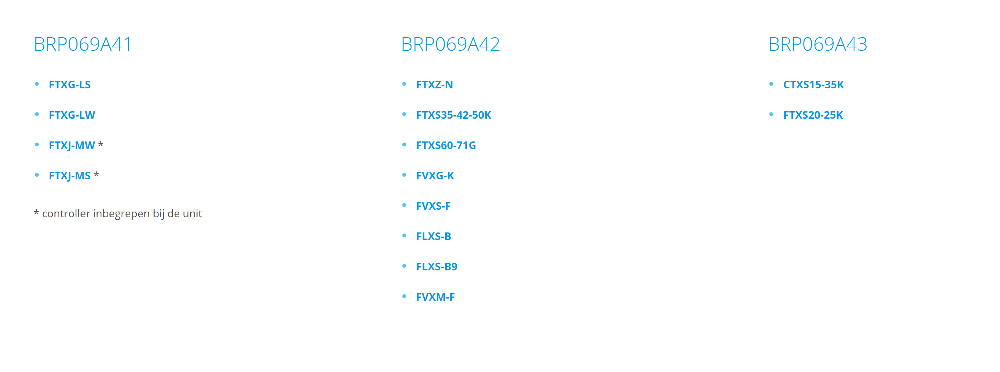
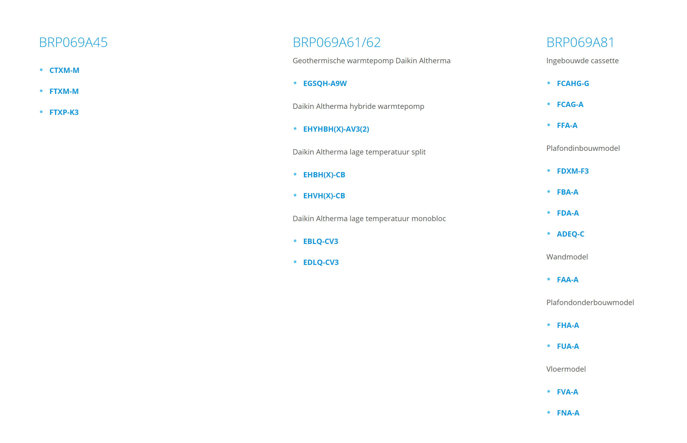
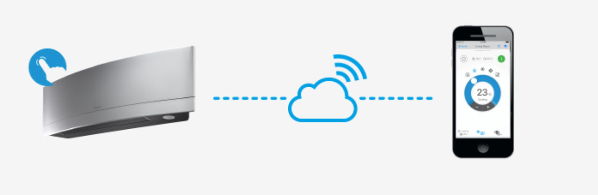
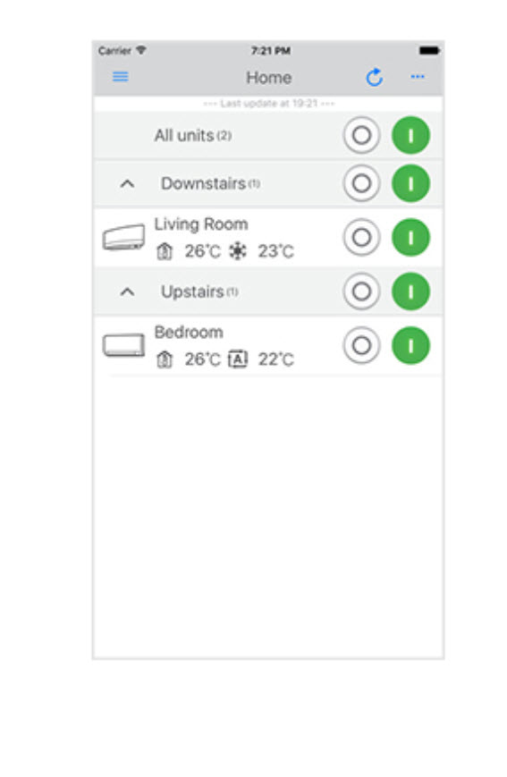

<!--s_name-->
# Daikin_driver

<!--e_name-->

Daikin has several room air controller devices with KNX and Wifi capability.
This driver enables all these devices to be integrated and be part of the climate_manager app.

Several models are compatible:





Daikin units and other sources of heating or cooling can be mixed seamlessly into the same room or building.
With the parameter skip_if_multi one can specify that the daikin unit should not be activated when another climate maker is available, f.i. to have your daikin performing cooling only, not heating, when there is another heating in the room.
However if the room needs lots of energy to cool or to heat if the temperature is largely off target, then skip_if_multi is ignored.





The Daikin APP  can still be used to override the temperature or other setting.  Control is again taken over when the programed to be temperature changes.

The powerful and streamer mode are set automatically and other parameters exist to shut the unit off.

Consumption (usage) is retrieved and reported in forensics with usage={"watts":"from_daikin"} as in the example below.
With a multi-split device, just include usage in only one of the device definitions.

As some Daikin models have fan rate AND fan direction, the Ventilation percent in some of the reporting is replaced with a code being the joined up values of f_rate and f_dir.

* f_dir : 0=off,1=v,2=h,3=3d
* f_rate: A=Auto,B=Silence,3..7   (3=20%,4=40%,5=60%,6=80%,7=100%)

Everything has been tested with the wifi module and still needs to be tested with the KNX interface.

## Auto-switching modes

Operating principle for determining the mode cool,heat,dry or fan is the following:
* when is_cooling and cool is in i_make : mode is cool
* when is heating and warm is in i_make : mode is heat
* if neither of the previous and i_make contains dry : mode is dry and a humid set-point for the room must be defined.  BUT CAUTION, in case of a multi-split configuration this cannot be used as all the units must have the same operating mode!!
* if room climatisation is off and f_rate is not "A", then mode will be set to fan when f_rate is changed through value_logic.  BUT CAUTION, in case of a multi-split configuration this cannot be used as all the units must have the same operating mode!!

So in case of a multi-split situation, only define makers that can cool or warm.
As the whole building switches from heating to cooling based on the outside temperature, the switch happens for all the units of a multi-split and all works as intended.

<!--s_role-->
<!--e_role-->

<!--s_descr-->
This driver enables the daikin room airconditioners to be used in the climatization app as room coolers, heaters, ventilators or air dryers

<!--e_descr-->

<!--s_tbl-->
## List of [properties](Properties.md) for __Daikin_driver__:

  | Property | Validation | Optional? | Repeat? | Description |
  | --- | --- | --- | --- | --- |
  | C_diff_off | float | False | - | difference between the SetPoint °C and the room °C to switch off the unit when the room °C is below (cooling) or above (heating) wanted temp | 
  | C_diff_powerful | float | False | - | difference between the SetPoint °C and the room °C to activate the powerful mode when the room °C is above (cooling) or below (heating) wanted temp.  Not all units suppoer powerful mode and then this is ignored. | 
  | fav | str | True | - | is this a favorite element | 
  | icon | str | True | - | icon file for this element | 
  | idle_time_off | int | True | - | minutes time elapse to shutdown the unit when the room temp stays above (for heating or below for cooling) the soll temperature, then switch it off, is also a time override in case manually activated by an app or remote control. | 
  | notifications | ['daikin_parsing'] | True | - | extensive list of notifications, see [__Notifier__](Notifier.md) | 
  | skip_if_multi | bool | False | - | skip activating the unit if for that room for that mode (cooling or heating) multiple energy sources exist and if powerful mode is not needed | 
  | streamer_mode | bool | False | - | io streamer mode decomposes and removes allergens such as mould, mites, and pollen, along with any unpleasant odours that may have infiltrated your home.  Not all units support this mode and then this is ignored. | 

## List of [Notifications](Notifier.md) for  __Daikin_driver__:

  | Notification Suffix | When invoked? |
  | --- | --- | 
  | daikin_parsing | when this report runs | 

## List of [Errors/Warnings](Error_Warn.md) for  __Daikin_driver__:

  | Error/Warning ID | Error/Warning MSG | Occurring When? |
  | --- | --- | --- | 
  | err_dk_get_fail | !!Daikin Requests Get Failure {:} {:} |  
  | err_dk_set_cntrl | !!Daikin {:} set_control failed <{:}> |  
  | err_dk_tmp | !!Daikin {:} write error {:} with {:} as no actual room temperature |  
  | err_dk_tpe | !!Daikin {:} {:} |  
  | err_dk_val | !!Daikin {:} unexpected parameter <{:}> with <{:}> |  
  | err_dk_write | !!Daikin {:} write error {:} with {:} |  
  | msg_dk_gen | Initiating Multiple Daikin(s) : {:} |  
  | msg_dk_off | !Daikin {:} is switched off as {:} mins idle |  
  | msg_dk_set_cntrl | Daikin {:} set_control <{:}> |  
  | msg_dk_write | !Daikin {:} write delayed {:} with {:} as not yet scanned |  
<!--e_tbl-->

## Example Configuration

In the example below there is a daikin unit defined.  

<!--s_insert_{"tree":["(o:Daikin_driver)","(dk:veranda).*(o:Climate)","(dk:veranda).*(o:Things_controllers)"]}-->

from project.py tree:['(o:Daikin_driver)', '(dk:veranda).*(o:Climate)', '(dk:veranda).*(o:Things_controllers)']
```python3
# --> project.py :<dk:project,o:Project,kw:drivers,lp:7,o:Daikin_driver>

from lucy_app import *

Daikin_driver(
    C_diff_off = 1.5,
    C_diff_powerful = 3.0,
    idle_time_off = 450,
    notifications = {
            "daikin_parsing":Mail(subject='Daikin room air controllers Parsing{app_txt}', to='{prime}', cams=None, cam_groups=None, passes=0, body_file='daikin', files2mail=None, ceiling=None)},
    skip_if_multi = True,
    streamer_mode = True)

# --> project.py :<dk:project,o:Project,kw:property,lp:0,o:House,kw:places,dk:veranda,o:Room,kw:contents,lp:8,o:Climate>

from lucy_app import *

Climate(
    clim_makers = {
            "dk_veranda_dry_sp":Clim_SP(i_make = ['dry'],path = "daikin:DK_Veranda,sp"),
            "dk_veranda_f_dir":Clim_ANY(path = "daikin:DK_Veranda,f_dir",value_logic = {"assign":{"00:00":"3"}}),
            "dk_veranda_f_rate":Clim_ANY(
                    path = "daikin:DK_Veranda,f_rate",
                    value_logic = {"assign":{"00:00":"B","away":"A","sleep":"A","°C_veranda>30":"5","°C_veranda>35":"7"}}),
            "dk_veranda_sp":Clim_SP(
                    i_make = ['cold', 'warm'],
                    method_things = {
                            "is_on":Input(path = "daikin:DK_Veranda,is_on")},
                    path = "daikin:DK_Veranda,sp",
                    usage = {"watts":"from_daikin"})},
    clim_sensors = {
            "°C_veranda":Sensor(i_read = "°C",path = "unipi:PI-Veranda,ow,284572ED0500008F,DS18B20,,104"),
            "°C_veranda2":Sensor(i_read = "°C",path = "daikin:DK_Veranda,h_temp")},
    clim_targets = {
            "cold_sp":{"away":27.0,"comfort":-2,"day":{"off":27.0,"on":24.0},"economy":1.5,"sleep":30.0},
            "dry_sp":{"preset":"humid_preset"},
            "warm_sp":{"away":10.0,"comfort":2,"day":{"off":12.0,"on":25.0},"economy":-1.5,"sleep":10.0}},
    my_assistant = True,
    notifications = {
            "{room}.clim_on_0":Say(txt='{tts_start} {room} climatisation is de-activated{tts_end}', ceiling=None, times=1, override=None, volume=None),
            "{room}.clim_on_1":Say(txt='{tts_start} {room} climatisation is activated, it will get comfortable soon{tts_end}', ceiling=None, times=1, override=None, volume=None),
            "{room}.comfort_0":Say(txt='{tts_start} {room} is set to regular climatisation{tts_end}', ceiling=None, times=1, override=None, volume=None),
            "{room}.comfort_1":Say(txt='{tts_start} {room} is set to comfort climatisation{tts_end}', ceiling=None, times=1, override=None, volume=None),
            "{room}.economy_0":Say(txt='{tts_start} {room} is set to regular climatisation{tts_end}', ceiling=None, times=1, override=None, volume=None),
            "{room}.economy_1":Say(txt='{tts_start} {room} is set to economy climatisation{tts_end}', ceiling=None, times=1, override=None, volume=None),
            "{room}_clim_on_0":Mail(subject='Veranda Climatisation is Stopped{app_txt}', to='{prime}', cams=None, cam_groups=None, passes=0, body_file='', files2mail=None, ceiling=None),
            "{room}_clim_on_1":Mail(subject='Veranda Climatisation is Activated{app_txt}', to='{prime}', cams=None, cam_groups=None, passes=0, body_file='', files2mail=None, ceiling=None)},
    room_virtuals = {
            "{room}^clim_on":Virtual(copy_things = {
                            "twin_copy":Output(path = "vera:Vera_plus,zw,buttonset,146,Status3")}),
            "{room}^clim_pref":Virtual_R(copy_things = {
                            "twin_copy@-1":Output(path = "vera:Vera_plus,zw,buttonset,171,Status5"),
                            "twin_copy@1":Output(path = "vera:Vera_plus,zw,buttonset,171,Status1")},descr_range = ["Economy","Standard","Comfort"],digital_range = [-1,0,1]),
            "{room}^humid_soll":Virtual_A(i_read = "%H")})

# --> project.py :<dk:project,o:Project,kw:property,lp:0,o:House,kw:places,dk:veranda,o:Room,kw:contents,lp:0,o:Things_controllers>

from lucy_app import *

Things_controllers(items = {
            "DK_Veranda":Daikin(path = "ip:192.168.15.62"),
            "PI-Veranda":Raspi(hw_gws = ["unipi:12,14"],path = "ip:192.168.15.32")})

```

<!--e_insert-->

* * * 
* * * 
# Example Daikin Parsing Report

This parsing report below corresponds with the above configuration example as a real life example.

* * * 
* * * 

<!--s_insert_{"role":"s.clim","suffix":"daikin"}-->


[PI-CSlave_daikin.html](PI-CSlave_daikin.html)

<!DOCTYPE html><html><body><h1>Daikin Analyzed -> PI-CSlave_daikin.html  2020/06/12 11:30:44</h1><h2>Daikin Discovery & Things Match</h2><table><thead><tr><th>dk:name</th><th>dk:ip</th><th>dk:type</th><th>myproject.py/place</th><th>myproject.py/name</th><th>myproject.py/i_make</th><th>Analysis</th></tr></thead><tbody><tr><td style='background-color:cyan;text-align:center' colspan='7'>*** daikins 5 discovered, 57 things defined</td></tr><tr><td>DK_Beauty</td><td>192.168.15.97</td><td>aircon</td><td>beauty.work</td><td>dk_beauty_sp</td><td>{&#x27;cold&#x27;, &#x27;warm&#x27;}</td><td>ok:match</td></tr><tr><td>DK_Beauty</td><td>192.168.15.97</td><td>aircon</td><td>-</td><td>-</td><td>dry</td><td>ok:thing dk_beauty.dry can be defined</td></tr><tr><td>DK_Beauty</td><td>192.168.15.97</td><td>aircon</td><td>beauty.work</td><td>dk_beauty_sp^is_on</td><td>power unit on/off</td><td>ok:self generated or matched thing</td></tr><tr><td>DK_Beauty</td><td>192.168.15.97</td><td>aircon</td><td>beauty.work</td><td>DK_Beauty^mode</td><td>Operating Mode (heat,cool,dry,fan)</td><td>ok:self generated or matched thing</td></tr><tr><td>DK_Beauty</td><td>192.168.15.97</td><td>aircon</td><td>beauty.work</td><td>DK_Beauty^f_rate</td><td>Daikin fan rate: A=Auto,B=Silence,3..7</td><td>ok:self generated or matched thing</td></tr><tr><td>DK_Beauty</td><td>192.168.15.97</td><td>aircon</td><td>beauty.work</td><td>DK_Beauty^f_dir</td><td>Daikin fan dir: 0=off,1=v,2=h,3=3d</td><td>ok:self generated or matched thing</td></tr><tr><td>DK_Beauty</td><td>192.168.15.97</td><td>aircon</td><td>beauty.work</td><td>DK_Beauty^&deg;C_outdoor</td><td>&deg;C Daikin Outdoor</td><td>ok:self generated or matched thing</td></tr><tr><td>DK_Beauty</td><td>192.168.15.97</td><td>aircon</td><td>beauty.work</td><td>DK_Beauty^&deg;C_room</td><td>&deg;C Daikin Indoor</td><td>ok:self generated or matched thing</td></tr><tr><td>DK_Beauty</td><td>192.168.15.97</td><td>aircon</td><td>beauty.work</td><td>DK_Beauty^%H_room</td><td>%H Daikin Indoor</td><td>ok:self generated or matched thing</td></tr><tr><td>DK_Daughter</td><td>192.168.15.98</td><td>aircon</td><td>daughter.sleep</td><td>dk_daughter_sp</td><td>{&#x27;cold&#x27;, &#x27;warm&#x27;}</td><td>ok:match</td></tr><tr><td>DK_Daughter</td><td>192.168.15.98</td><td>aircon</td><td>-</td><td>-</td><td>dry</td><td>ok:thing dk_daughter.dry can be defined</td></tr><tr><td>DK_Daughter</td><td>192.168.15.98</td><td>aircon</td><td>daughter.sleep</td><td>dk_daughter_sp^is_on</td><td>power unit on/off</td><td>ok:self generated or matched thing</td></tr><tr><td>DK_Daughter</td><td>192.168.15.98</td><td>aircon</td><td>daughter.sleep</td><td>DK_Daughter^mode</td><td>Operating Mode (heat,cool,dry,fan)</td><td>ok:self generated or matched thing</td></tr><tr><td>DK_Daughter</td><td>192.168.15.98</td><td>aircon</td><td>daughter.sleep</td><td>DK_Daughter^f_rate</td><td>Daikin fan rate: A=Auto,B=Silence,3..7</td><td>ok:self generated or matched thing</td></tr><tr><td>DK_Daughter</td><td>192.168.15.98</td><td>aircon</td><td>daughter.sleep</td><td>DK_Daughter^f_dir</td><td>Daikin fan dir: 0=off,1=v,2=h,3=3d</td><td>ok:self generated or matched thing</td></tr><tr><td>DK_Daughter</td><td>192.168.15.98</td><td>aircon</td><td>daughter.sleep</td><td>DK_Daughter^&deg;C_outdoor</td><td>&deg;C Daikin Outdoor</td><td>ok:self generated or matched thing</td></tr><tr><td>DK_Daughter</td><td>192.168.15.98</td><td>aircon</td><td>daughter.sleep</td><td>DK_Daughter^&deg;C_room</td><td>&deg;C Daikin Indoor</td><td>ok:self generated or matched thing</td></tr><tr><td>DK_Daughter</td><td>192.168.15.98</td><td>aircon</td><td>daughter.sleep</td><td>DK_Daughter^%H_room</td><td>%H Daikin Indoor</td><td>ok:self generated or matched thing</td></tr><tr><td>DK_Guest</td><td>192.168.15.100</td><td>aircon</td><td>guest.sleep</td><td>dk_guest_sp</td><td>{&#x27;cold&#x27;, &#x27;warm&#x27;}</td><td>ok:match</td></tr><tr><td>DK_Guest</td><td>192.168.15.100</td><td>aircon</td><td>-</td><td>-</td><td>dry</td><td>ok:thing dk_guest.dry can be defined</td></tr><tr><td>DK_Guest</td><td>192.168.15.100</td><td>aircon</td><td>guest.sleep</td><td>dk_guest_sp^is_on</td><td>power unit on/off</td><td>ok:self generated or matched thing</td></tr><tr><td>DK_Guest</td><td>192.168.15.100</td><td>aircon</td><td>guest.sleep</td><td>DK_Guest^mode</td><td>Operating Mode (heat,cool,dry,fan)</td><td>ok:self generated or matched thing</td></tr><tr><td>DK_Guest</td><td>192.168.15.100</td><td>aircon</td><td>guest.sleep</td><td>DK_Guest^f_rate</td><td>Daikin fan rate: A=Auto,B=Silence,3..7</td><td>ok:self generated or matched thing</td></tr><tr><td>DK_Guest</td><td>192.168.15.100</td><td>aircon</td><td>guest.sleep</td><td>DK_Guest^f_dir</td><td>Daikin fan dir: 0=off,1=v,2=h,3=3d</td><td>ok:self generated or matched thing</td></tr><tr><td>DK_Guest</td><td>192.168.15.100</td><td>aircon</td><td>guest.sleep</td><td>DK_Guest^&deg;C_outdoor</td><td>&deg;C Daikin Outdoor</td><td>ok:self generated or matched thing</td></tr><tr><td>DK_Guest</td><td>192.168.15.100</td><td>aircon</td><td>guest.sleep</td><td>DK_Guest^&deg;C_room</td><td>&deg;C Daikin Indoor</td><td>ok:self generated or matched thing</td></tr><tr><td>DK_Guest</td><td>192.168.15.100</td><td>aircon</td><td>guest.sleep</td><td>DK_Guest^%H_room</td><td>%H Daikin Indoor</td><td>ok:self generated or matched thing</td></tr><tr><td>DK_Living</td><td>192.168.15.61</td><td>aircon</td><td>living_lounge</td><td>dk_living_sp</td><td>{&#x27;cold&#x27;, &#x27;warm&#x27;}</td><td>ok:match</td></tr><tr><td>DK_Living</td><td>192.168.15.61</td><td>aircon</td><td>-</td><td>-</td><td>dry</td><td>ok:thing dk_living.dry can be defined</td></tr><tr><td>DK_Living</td><td>192.168.15.61</td><td>aircon</td><td>living_lounge</td><td>dk_living_sp^is_on</td><td>power unit on/off</td><td>ok:self generated or matched thing</td></tr><tr><td>DK_Living</td><td>192.168.15.61</td><td>aircon</td><td>living_lounge</td><td>DK_Living^mode</td><td>Operating Mode (heat,cool,dry,fan)</td><td>ok:self generated or matched thing</td></tr><tr><td>DK_Living</td><td>192.168.15.61</td><td>aircon</td><td>living_lounge</td><td>DK_Living^f_rate</td><td>Daikin fan rate: A=Auto,B=Silence,3..7</td><td>ok:self generated or matched thing</td></tr><tr><td>DK_Living</td><td>192.168.15.61</td><td>aircon</td><td>living_lounge</td><td>DK_Living^&deg;C_outdoor</td><td>&deg;C Daikin Outdoor</td><td>ok:self generated or matched thing</td></tr><tr><td>DK_Living</td><td>192.168.15.61</td><td>aircon</td><td>living_lounge</td><td>DK_Living^&deg;C_room</td><td>&deg;C Daikin Indoor</td><td>ok:self generated or matched thing</td></tr><tr><td>DK_Living</td><td>192.168.15.61</td><td>aircon</td><td>living_lounge</td><td>DK_Living^%H_room</td><td>%H Daikin Indoor</td><td>ok:self generated or matched thing</td></tr><tr><td>DK_Bedroom</td><td>192.168.15.92</td><td>aircon</td><td>master_bed.rear</td><td>dk_bedroom_sp</td><td>{&#x27;cold&#x27;, &#x27;warm&#x27;}</td><td>ok:match</td></tr><tr><td>DK_Bedroom</td><td>192.168.15.92</td><td>aircon</td><td>-</td><td>-</td><td>dry</td><td>ok:thing dk_bedroom.dry can be defined</td></tr><tr><td>DK_Bedroom</td><td>192.168.15.92</td><td>aircon</td><td>master_bed.rear</td><td>dk_bedroom_sp^is_on</td><td>power unit on/off</td><td>ok:self generated or matched thing</td></tr><tr><td>DK_Bedroom</td><td>192.168.15.92</td><td>aircon</td><td>master_bed.rear</td><td>DK_Bedroom^mode</td><td>Operating Mode (heat,cool,dry,fan)</td><td>ok:self generated or matched thing</td></tr><tr><td>DK_Bedroom</td><td>192.168.15.92</td><td>aircon</td><td>master_bed.rear</td><td>DK_Bedroom^f_rate</td><td>Daikin fan rate: A=Auto,B=Silence,3..7</td><td>ok:self generated or matched thing</td></tr><tr><td>DK_Bedroom</td><td>192.168.15.92</td><td>aircon</td><td>master_bed.rear</td><td>DK_Bedroom^f_dir</td><td>Daikin fan dir: 0=off,1=v,2=h,3=3d</td><td>ok:self generated or matched thing</td></tr><tr><td>DK_Bedroom</td><td>192.168.15.92</td><td>aircon</td><td>master_bed.rear</td><td>DK_Bedroom^&deg;C_outdoor</td><td>&deg;C Daikin Outdoor</td><td>ok:self generated or matched thing</td></tr><tr><td>DK_Bedroom</td><td>192.168.15.92</td><td>aircon</td><td>master_bed.rear</td><td>DK_Bedroom^&deg;C_room</td><td>&deg;C Daikin Indoor</td><td>ok:self generated or matched thing</td></tr><tr><td>DK_Bedroom</td><td>192.168.15.92</td><td>aircon</td><td>master_bed.rear</td><td>DK_Bedroom^%H_room</td><td>%H Daikin Indoor</td><td>ok:self generated or matched thing</td></tr><tr><td>DK_Office</td><td>192.168.15.60</td><td>aircon</td><td>office</td><td>dk_office_sp</td><td>{&#x27;cold&#x27;, &#x27;warm&#x27;}</td><td>ok:match</td></tr><tr><td>DK_Office</td><td>192.168.15.60</td><td>aircon</td><td>-</td><td>-</td><td>dry</td><td>ok:thing dk_office.dry can be defined</td></tr><tr><td>DK_Office</td><td>192.168.15.60</td><td>aircon</td><td>office</td><td>dk_office_sp^is_on</td><td>power unit on/off</td><td>ok:self generated or matched thing</td></tr><tr><td>DK_Office</td><td>192.168.15.60</td><td>aircon</td><td>office</td><td>DK_Office^mode</td><td>Operating Mode (heat,cool,dry,fan)</td><td>ok:self generated or matched thing</td></tr><tr><td>DK_Office</td><td>192.168.15.60</td><td>aircon</td><td>office</td><td>DK_Office^f_rate</td><td>Daikin fan rate: A=Auto,B=Silence,3..7</td><td>ok:self generated or matched thing</td></tr><tr><td>DK_Office</td><td>192.168.15.60</td><td>aircon</td><td>office</td><td>DK_Office^f_dir</td><td>Daikin fan dir: 0=off,1=v,2=h,3=3d</td><td>ok:self generated or matched thing</td></tr><tr><td>DK_Office</td><td>192.168.15.60</td><td>aircon</td><td>office</td><td>DK_Office^&deg;C_outdoor</td><td>&deg;C Daikin Outdoor</td><td>ok:self generated or matched thing</td></tr><tr><td>DK_Office</td><td>192.168.15.60</td><td>aircon</td><td>office</td><td>DK_Office^&deg;C_room</td><td>&deg;C Daikin Indoor</td><td>ok:self generated or matched thing</td></tr><tr><td>DK_Office</td><td>192.168.15.60</td><td>aircon</td><td>office</td><td>DK_Office^%H_room</td><td>%H Daikin Indoor</td><td>ok:self generated or matched thing</td></tr><tr><td>DK_Veranda</td><td>192.168.15.62</td><td>aircon</td><td>veranda</td><td>dk_veranda_dry_sp</td><td>{&#x27;dry&#x27;}</td><td>ok:match</td></tr><tr><td>DK_Veranda</td><td>192.168.15.62</td><td>aircon</td><td>veranda</td><td>dk_veranda_sp</td><td>{&#x27;cold&#x27;, &#x27;warm&#x27;}</td><td>ok:match</td></tr><tr><td>DK_Veranda</td><td>192.168.15.62</td><td>aircon</td><td>veranda</td><td>dk_veranda_sp^is_on</td><td>power unit on/off</td><td>ok:self generated or matched thing</td></tr><tr><td>DK_Veranda</td><td>192.168.15.62</td><td>aircon</td><td>veranda</td><td>DK_Veranda^mode</td><td>Operating Mode (heat,cool,dry,fan)</td><td>ok:self generated or matched thing</td></tr><tr><td>DK_Veranda</td><td>192.168.15.62</td><td>aircon</td><td>veranda</td><td>DK_Veranda^&deg;C_outdoor</td><td>&deg;C Daikin Outdoor</td><td>ok:self generated or matched thing</td></tr><tr><td>DK_Veranda</td><td>192.168.15.62</td><td>aircon</td><td>veranda</td><td>DK_Veranda^%H_room</td><td>%H Daikin Indoor</td><td>ok:self generated or matched thing</td></tr><tr><td>??</td><td>??</td><td>??</td><td>-</td><td>-</td><td>-</td><td>?ok: -1 units less declared than detected</td></tr><tr><td>DK_Living</td><td>192.168.15.61</td><td>-</td><td>living_lounge</td><td>??</td><td>??</td><td>nok:unit is defined but not (yet) discovered</td></tr><tr><td>DK_Veranda</td><td>192.168.15.62</td><td>-</td><td>veranda</td><td>??</td><td>??</td><td>nok:unit is defined but not (yet) discovered</td></tr></tbody></table><h2>Daikin Unit Status</h2><table><thead><tr><th>HTTP</th><th>response</th></tr></thead><tbody><tr><td style='background-color:cyan;text-align:center' colspan='2'>*** DK_Beauty/192.168.15.97</td></tr><tr><td>common/basic_info</td><td>{&#x27;ret&#x27;: &#x27;OK&#x27;, &#x27;type&#x27;: &#x27;aircon&#x27;, &#x27;reg&#x27;: &#x27;eu&#x27;, &#x27;dst&#x27;: &#x27;1&#x27;, &#x27;ver&#x27;: &#x27;1_2_51&#x27;, &#x27;rev&#x27;: &#x27;D3A0C9F&#x27;, &#x27;pow&#x27;: &#x27;0&#x27;, &#x27;err&#x27;: &#x27;0&#x27;, &#x27;location&#x27;: &#x27;0&#x27;, &#x27;name&#x27;: &#x27;Daikin Beauty&#x27;, &#x27;icon&#x27;: &#x27;0&#x27;, &#x27;method&#x27;: &#x27;home only&#x27;, &#x27;port&#x27;: &#x27;30050&#x27;, &#x27;id&#x27;: &#x27;&#x27;, &#x27;pw&#x27;: &#x27;&#x27;, &#x27;lpw_flag&#x27;: &#x27;0&#x27;, &#x27;adp_kind&#x27;: &#x27;3&#x27;, &#x27;pv&#x27;: &#x27;3.30&#x27;, &#x27;cpv&#x27;: &#x27;3&#x27;, &#x27;cpv_minor&#x27;: &#x27;20&#x27;, &#x27;led&#x27;: &#x27;1&#x27;, &#x27;en_setzone&#x27;: &#x27;1&#x27;, &#x27;mac&#x27;: &#x27;80C5F2F431BE&#x27;, &#x27;adp_mode&#x27;: &#x27;run&#x27;, &#x27;en_hol&#x27;: &#x27;0&#x27;, &#x27;grp_name&#x27;: &#x27;&#x27;, &#x27;en_grp&#x27;: &#x27;0&#x27;}</td></tr><tr><td>common/get_remote_method</td><td>{&#x27;ret&#x27;: &#x27;OK&#x27;, &#x27;method&#x27;: &#x27;home only&#x27;, &#x27;notice_ip_int&#x27;: &#x27;3600&#x27;, &#x27;notice_sync_int&#x27;: &#x27;60&#x27;}</td></tr><tr><td>aircon/get_sensor_info</td><td>{&#x27;ret&#x27;: &#x27;OK&#x27;, &#x27;htemp&#x27;: &#x27;24.0&#x27;, &#x27;hhum&#x27;: &#x27;50&#x27;, &#x27;otemp&#x27;: &#x27;21.0&#x27;, &#x27;err&#x27;: &#x27;0&#x27;, &#x27;cmpfreq&#x27;: &#x27;0&#x27;}</td></tr><tr><td>aircon/get_model_info</td><td>{&#x27;ret&#x27;: &#x27;OK&#x27;, &#x27;model&#x27;: &#x27;0FC0&#x27;, &#x27;type&#x27;: &#x27;N&#x27;, &#x27;pv&#x27;: &#x27;3.30&#x27;, &#x27;cpv&#x27;: &#x27;3&#x27;, &#x27;cpv_minor&#x27;: &#x27;20&#x27;, &#x27;mid&#x27;: &#x27;NA&#x27;, &#x27;humd&#x27;: &#x27;0&#x27;, &#x27;s_humd&#x27;: &#x27;0&#x27;, &#x27;acled&#x27;: &#x27;0&#x27;, &#x27;land&#x27;: &#x27;0&#x27;, &#x27;elec&#x27;: &#x27;1&#x27;, &#x27;temp&#x27;: &#x27;1&#x27;, &#x27;temp_rng&#x27;: &#x27;0&#x27;, &#x27;m_dtct&#x27;: &#x27;1&#x27;, &#x27;ac_dst&#x27;: &#x27;--&#x27;, &#x27;disp_dry&#x27;: &#x27;0&#x27;, &#x27;dmnd&#x27;: &#x27;1&#x27;, &#x27;en_scdltmr&#x27;: &#x27;1&#x27;, &#x27;en_frate&#x27;: &#x27;1&#x27;, &#x27;en_fdir&#x27;: &#x27;1&#x27;, &#x27;s_fdir&#x27;: &#x27;3&#x27;, &#x27;en_rtemp_a&#x27;: &#x27;0&#x27;, &#x27;en_spmode&#x27;: &#x27;5&#x27;, &#x27;en_ipw_sep&#x27;: &#x27;1&#x27;, &#x27;en_mompow&#x27;: &#x27;0&#x27;, &#x27;hmlmt_l&#x27;: &#x27;10.0&#x27;}</td></tr><tr><td>aircon/get_control_info</td><td>{&#x27;ret&#x27;: &#x27;OK&#x27;, &#x27;pow&#x27;: &#x27;0&#x27;, &#x27;mode&#x27;: &#x27;4&#x27;, &#x27;adv&#x27;: &#x27;13&#x27;, &#x27;stemp&#x27;: &#x27;13.0&#x27;, &#x27;shum&#x27;: &#x27;50&#x27;, &#x27;dt1&#x27;: &#x27;25.0&#x27;, &#x27;dt2&#x27;: &#x27;M&#x27;, &#x27;dt3&#x27;: &#x27;28.0&#x27;, &#x27;dt4&#x27;: &#x27;13.0&#x27;, &#x27;dt5&#x27;: &#x27;13.0&#x27;, &#x27;dt7&#x27;: &#x27;25.0&#x27;, &#x27;dh1&#x27;: &#x27;AUTO&#x27;, &#x27;dh2&#x27;: &#x27;50&#x27;, &#x27;dh3&#x27;: &#x27;40&#x27;, &#x27;dh4&#x27;: &#x27;50&#x27;, &#x27;dh5&#x27;: &#x27;50&#x27;, &#x27;dh7&#x27;: &#x27;AUTO&#x27;, &#x27;dhh&#x27;: &#x27;50&#x27;, &#x27;b_mode&#x27;: &#x27;4&#x27;, &#x27;b_stemp&#x27;: &#x27;13.0&#x27;, &#x27;b_shum&#x27;: &#x27;50&#x27;, &#x27;alert&#x27;: &#x27;255&#x27;, &#x27;f_rate&#x27;: &#x27;5&#x27;, &#x27;f_dir&#x27;: &#x27;0&#x27;, &#x27;b_f_rate&#x27;: &#x27;5&#x27;, &#x27;b_f_dir&#x27;: &#x27;0&#x27;, &#x27;dfr1&#x27;: &#x27;5&#x27;, &#x27;dfr2&#x27;: &#x27;5&#x27;, &#x27;dfr3&#x27;: &#x27;5&#x27;, &#x27;dfr4&#x27;: &#x27;5&#x27;, &#x27;dfr5&#x27;: &#x27;5&#x27;, &#x27;dfr6&#x27;: &#x27;5&#x27;, &#x27;dfr7&#x27;: &#x27;5&#x27;, &#x27;dfrh&#x27;: &#x27;5&#x27;, &#x27;dfd1&#x27;: &#x27;0&#x27;, &#x27;dfd2&#x27;: &#x27;0&#x27;, &#x27;dfd3&#x27;: &#x27;0&#x27;, &#x27;dfd4&#x27;: &#x27;0&#x27;, &#x27;dfd5&#x27;: &#x27;0&#x27;, &#x27;dfd6&#x27;: &#x27;0&#x27;, &#x27;dfd7&#x27;: &#x27;0&#x27;, &#x27;dfdh&#x27;: &#x27;0&#x27;, &#x27;dmnd_run&#x27;: &#x27;0&#x27;, &#x27;en_demand&#x27;: &#x27;0&#x27;}</td></tr><tr><td>aircon/get_target</td><td>{&#x27;ret&#x27;: &#x27;OK&#x27;, &#x27;target&#x27;: &#x27;0&#x27;}</td></tr><tr><td>aircon/get_price</td><td>{&#x27;ret&#x27;: &#x27;OK&#x27;, &#x27;price_int&#x27;: &#x27;27&#x27;, &#x27;price_dec&#x27;: &#x27;0&#x27;}</td></tr><tr><td>common/get_holiday</td><td>{&#x27;ret&#x27;: &#x27;OK&#x27;, &#x27;en_hol&#x27;: &#x27;0&#x27;}</td></tr><tr><td>common/get_notify</td><td>{&#x27;ret&#x27;: &#x27;OK&#x27;, &#x27;auto_off_flg&#x27;: &#x27;0&#x27;, &#x27;auto_off_tm&#x27;: &#x27;- -&#x27;}</td></tr><tr><td>aircon/get_week_power</td><td>{&#x27;ret&#x27;: &#x27;OK&#x27;, &#x27;today_runtime&#x27;: &#x27;0&#x27;, &#x27;datas&#x27;: &#x27;100/100/200/100/100/100/100&#x27;}</td></tr><tr><td>aircon/get_year_power</td><td>{&#x27;ret&#x27;: &#x27;OK&#x27;, &#x27;previous_year&#x27;: &#x27;5/3/8/3/3/13/25/6/4/12/7/20&#x27;, &#x27;this_year&#x27;: &#x27;32/22/22/7/8/1&#x27;}</td></tr><tr><td style='background-color:cyan;text-align:center' colspan='2'>*** DK_Daughter/192.168.15.98</td></tr><tr><td>common/basic_info</td><td>{&#x27;ret&#x27;: &#x27;OK&#x27;, &#x27;type&#x27;: &#x27;aircon&#x27;, &#x27;reg&#x27;: &#x27;eu&#x27;, &#x27;dst&#x27;: &#x27;1&#x27;, &#x27;ver&#x27;: &#x27;1_2_51&#x27;, &#x27;rev&#x27;: &#x27;D3A0C9F&#x27;, &#x27;pow&#x27;: &#x27;0&#x27;, &#x27;err&#x27;: &#x27;0&#x27;, &#x27;location&#x27;: &#x27;0&#x27;, &#x27;name&#x27;: &#x27;Daikin Daughter&#x27;, &#x27;icon&#x27;: &#x27;0&#x27;, &#x27;method&#x27;: &#x27;home only&#x27;, &#x27;port&#x27;: &#x27;30050&#x27;, &#x27;id&#x27;: &#x27;&#x27;, &#x27;pw&#x27;: &#x27;&#x27;, &#x27;lpw_flag&#x27;: &#x27;0&#x27;, &#x27;adp_kind&#x27;: &#x27;3&#x27;, &#x27;pv&#x27;: &#x27;3.30&#x27;, &#x27;cpv&#x27;: &#x27;3&#x27;, &#x27;cpv_minor&#x27;: &#x27;20&#x27;, &#x27;led&#x27;: &#x27;1&#x27;, &#x27;en_setzone&#x27;: &#x27;1&#x27;, &#x27;mac&#x27;: &#x27;D0C5D31FAA2A&#x27;, &#x27;adp_mode&#x27;: &#x27;run&#x27;, &#x27;en_hol&#x27;: &#x27;0&#x27;, &#x27;grp_name&#x27;: &#x27;&#x27;, &#x27;en_grp&#x27;: &#x27;0&#x27;}</td></tr><tr><td>common/get_remote_method</td><td>{&#x27;ret&#x27;: &#x27;OK&#x27;, &#x27;method&#x27;: &#x27;home only&#x27;, &#x27;notice_ip_int&#x27;: &#x27;3600&#x27;, &#x27;notice_sync_int&#x27;: &#x27;60&#x27;}</td></tr><tr><td>aircon/get_sensor_info</td><td>{&#x27;ret&#x27;: &#x27;OK&#x27;, &#x27;htemp&#x27;: &#x27;25.0&#x27;, &#x27;hhum&#x27;: &#x27;45&#x27;, &#x27;otemp&#x27;: &#x27;21.0&#x27;, &#x27;err&#x27;: &#x27;0&#x27;, &#x27;cmpfreq&#x27;: &#x27;0&#x27;}</td></tr><tr><td>aircon/get_model_info</td><td>{&#x27;ret&#x27;: &#x27;OK&#x27;, &#x27;model&#x27;: &#x27;0FBF&#x27;, &#x27;type&#x27;: &#x27;N&#x27;, &#x27;pv&#x27;: &#x27;3.30&#x27;, &#x27;cpv&#x27;: &#x27;3&#x27;, &#x27;cpv_minor&#x27;: &#x27;20&#x27;, &#x27;mid&#x27;: &#x27;NA&#x27;, &#x27;humd&#x27;: &#x27;0&#x27;, &#x27;s_humd&#x27;: &#x27;0&#x27;, &#x27;acled&#x27;: &#x27;0&#x27;, &#x27;land&#x27;: &#x27;0&#x27;, &#x27;elec&#x27;: &#x27;1&#x27;, &#x27;temp&#x27;: &#x27;1&#x27;, &#x27;temp_rng&#x27;: &#x27;0&#x27;, &#x27;m_dtct&#x27;: &#x27;1&#x27;, &#x27;ac_dst&#x27;: &#x27;--&#x27;, &#x27;disp_dry&#x27;: &#x27;0&#x27;, &#x27;dmnd&#x27;: &#x27;1&#x27;, &#x27;en_scdltmr&#x27;: &#x27;1&#x27;, &#x27;en_frate&#x27;: &#x27;1&#x27;, &#x27;en_fdir&#x27;: &#x27;1&#x27;, &#x27;s_fdir&#x27;: &#x27;3&#x27;, &#x27;en_rtemp_a&#x27;: &#x27;0&#x27;, &#x27;en_spmode&#x27;: &#x27;5&#x27;, &#x27;en_ipw_sep&#x27;: &#x27;1&#x27;, &#x27;en_mompow&#x27;: &#x27;0&#x27;, &#x27;hmlmt_l&#x27;: &#x27;10.0&#x27;}</td></tr><tr><td>aircon/get_control_info</td><td>{&#x27;ret&#x27;: &#x27;OK&#x27;, &#x27;pow&#x27;: &#x27;0&#x27;, &#x27;mode&#x27;: &#x27;4&#x27;, &#x27;adv&#x27;: &#x27;13&#x27;, &#x27;stemp&#x27;: &#x27;21.0&#x27;, &#x27;shum&#x27;: &#x27;45&#x27;, &#x27;dt1&#x27;: &#x27;25.0&#x27;, &#x27;dt2&#x27;: &#x27;M&#x27;, &#x27;dt3&#x27;: &#x27;28.0&#x27;, &#x27;dt4&#x27;: &#x27;21.0&#x27;, &#x27;dt5&#x27;: &#x27;21.0&#x27;, &#x27;dt7&#x27;: &#x27;25.0&#x27;, &#x27;dh1&#x27;: &#x27;AUTO&#x27;, &#x27;dh2&#x27;: &#x27;50&#x27;, &#x27;dh3&#x27;: &#x27;40&#x27;, &#x27;dh4&#x27;: &#x27;45&#x27;, &#x27;dh5&#x27;: &#x27;45&#x27;, &#x27;dh7&#x27;: &#x27;AUTO&#x27;, &#x27;dhh&#x27;: &#x27;50&#x27;, &#x27;b_mode&#x27;: &#x27;4&#x27;, &#x27;b_stemp&#x27;: &#x27;21.0&#x27;, &#x27;b_shum&#x27;: &#x27;45&#x27;, &#x27;alert&#x27;: &#x27;255&#x27;, &#x27;f_rate&#x27;: &#x27;A&#x27;, &#x27;f_dir&#x27;: &#x27;2&#x27;, &#x27;b_f_rate&#x27;: &#x27;A&#x27;, &#x27;b_f_dir&#x27;: &#x27;2&#x27;, &#x27;dfr1&#x27;: &#x27;5&#x27;, &#x27;dfr2&#x27;: &#x27;5&#x27;, &#x27;dfr3&#x27;: &#x27;A&#x27;, &#x27;dfr4&#x27;: &#x27;A&#x27;, &#x27;dfr5&#x27;: &#x27;A&#x27;, &#x27;dfr6&#x27;: &#x27;5&#x27;, &#x27;dfr7&#x27;: &#x27;5&#x27;, &#x27;dfrh&#x27;: &#x27;5&#x27;, &#x27;dfd1&#x27;: &#x27;0&#x27;, &#x27;dfd2&#x27;: &#x27;0&#x27;, &#x27;dfd3&#x27;: &#x27;2&#x27;, &#x27;dfd4&#x27;: &#x27;2&#x27;, &#x27;dfd5&#x27;: &#x27;2&#x27;, &#x27;dfd6&#x27;: &#x27;0&#x27;, &#x27;dfd7&#x27;: &#x27;0&#x27;, &#x27;dfdh&#x27;: &#x27;0&#x27;, &#x27;dmnd_run&#x27;: &#x27;0&#x27;, &#x27;en_demand&#x27;: &#x27;0&#x27;}</td></tr><tr><td>aircon/get_target</td><td>{&#x27;ret&#x27;: &#x27;OK&#x27;, &#x27;target&#x27;: &#x27;0&#x27;}</td></tr><tr><td>aircon/get_price</td><td>{&#x27;ret&#x27;: &#x27;OK&#x27;, &#x27;price_int&#x27;: &#x27;27&#x27;, &#x27;price_dec&#x27;: &#x27;0&#x27;}</td></tr><tr><td>common/get_holiday</td><td>{&#x27;ret&#x27;: &#x27;OK&#x27;, &#x27;en_hol&#x27;: &#x27;0&#x27;}</td></tr><tr><td>common/get_notify</td><td>{&#x27;ret&#x27;: &#x27;OK&#x27;, &#x27;auto_off_flg&#x27;: &#x27;0&#x27;, &#x27;auto_off_tm&#x27;: &#x27;- -&#x27;}</td></tr><tr><td>aircon/get_week_power</td><td>{&#x27;ret&#x27;: &#x27;OK&#x27;, &#x27;today_runtime&#x27;: &#x27;0&#x27;, &#x27;datas&#x27;: &#x27;100/200/100/100/100/100/100&#x27;}</td></tr><tr><td>aircon/get_year_power</td><td>{&#x27;ret&#x27;: &#x27;OK&#x27;, &#x27;previous_year&#x27;: &#x27;5/3/8/3/3/13/25/6/4/12/7/19&#x27;, &#x27;this_year&#x27;: &#x27;31/22/22/7/8/1&#x27;}</td></tr><tr><td style='background-color:cyan;text-align:center' colspan='2'>*** DK_Guest/192.168.15.100</td></tr><tr><td>common/basic_info</td><td>{&#x27;ret&#x27;: &#x27;OK&#x27;, &#x27;type&#x27;: &#x27;aircon&#x27;, &#x27;reg&#x27;: &#x27;eu&#x27;, &#x27;dst&#x27;: &#x27;1&#x27;, &#x27;ver&#x27;: &#x27;1_2_51&#x27;, &#x27;rev&#x27;: &#x27;D3A0C9F&#x27;, &#x27;pow&#x27;: &#x27;0&#x27;, &#x27;err&#x27;: &#x27;0&#x27;, &#x27;location&#x27;: &#x27;0&#x27;, &#x27;name&#x27;: &#x27;Daikin Guest&#x27;, &#x27;icon&#x27;: &#x27;0&#x27;, &#x27;method&#x27;: &#x27;home only&#x27;, &#x27;port&#x27;: &#x27;30050&#x27;, &#x27;id&#x27;: &#x27;&#x27;, &#x27;pw&#x27;: &#x27;&#x27;, &#x27;lpw_flag&#x27;: &#x27;0&#x27;, &#x27;adp_kind&#x27;: &#x27;3&#x27;, &#x27;pv&#x27;: &#x27;3.30&#x27;, &#x27;cpv&#x27;: &#x27;3&#x27;, &#x27;cpv_minor&#x27;: &#x27;20&#x27;, &#x27;led&#x27;: &#x27;1&#x27;, &#x27;en_setzone&#x27;: &#x27;1&#x27;, &#x27;mac&#x27;: &#x27;D0C5D303C9C0&#x27;, &#x27;adp_mode&#x27;: &#x27;run&#x27;, &#x27;en_hol&#x27;: &#x27;0&#x27;, &#x27;grp_name&#x27;: &#x27;&#x27;, &#x27;en_grp&#x27;: &#x27;0&#x27;}</td></tr><tr><td>common/get_remote_method</td><td>{&#x27;ret&#x27;: &#x27;OK&#x27;, &#x27;method&#x27;: &#x27;home only&#x27;, &#x27;notice_ip_int&#x27;: &#x27;3600&#x27;, &#x27;notice_sync_int&#x27;: &#x27;60&#x27;}</td></tr><tr><td>aircon/get_sensor_info</td><td>{&#x27;ret&#x27;: &#x27;OK&#x27;, &#x27;htemp&#x27;: &#x27;24.0&#x27;, &#x27;hhum&#x27;: &#x27;50&#x27;, &#x27;otemp&#x27;: &#x27;21.0&#x27;, &#x27;err&#x27;: &#x27;0&#x27;, &#x27;cmpfreq&#x27;: &#x27;0&#x27;}</td></tr><tr><td>aircon/get_model_info</td><td>{&#x27;ret&#x27;: &#x27;OK&#x27;, &#x27;model&#x27;: &#x27;0FBF&#x27;, &#x27;type&#x27;: &#x27;N&#x27;, &#x27;pv&#x27;: &#x27;3.30&#x27;, &#x27;cpv&#x27;: &#x27;3&#x27;, &#x27;cpv_minor&#x27;: &#x27;20&#x27;, &#x27;mid&#x27;: &#x27;NA&#x27;, &#x27;humd&#x27;: &#x27;0&#x27;, &#x27;s_humd&#x27;: &#x27;0&#x27;, &#x27;acled&#x27;: &#x27;0&#x27;, &#x27;land&#x27;: &#x27;0&#x27;, &#x27;elec&#x27;: &#x27;1&#x27;, &#x27;temp&#x27;: &#x27;1&#x27;, &#x27;temp_rng&#x27;: &#x27;0&#x27;, &#x27;m_dtct&#x27;: &#x27;1&#x27;, &#x27;ac_dst&#x27;: &#x27;--&#x27;, &#x27;disp_dry&#x27;: &#x27;0&#x27;, &#x27;dmnd&#x27;: &#x27;1&#x27;, &#x27;en_scdltmr&#x27;: &#x27;1&#x27;, &#x27;en_frate&#x27;: &#x27;1&#x27;, &#x27;en_fdir&#x27;: &#x27;1&#x27;, &#x27;s_fdir&#x27;: &#x27;3&#x27;, &#x27;en_rtemp_a&#x27;: &#x27;0&#x27;, &#x27;en_spmode&#x27;: &#x27;5&#x27;, &#x27;en_ipw_sep&#x27;: &#x27;1&#x27;, &#x27;en_mompow&#x27;: &#x27;0&#x27;, &#x27;hmlmt_l&#x27;: &#x27;10.0&#x27;}</td></tr><tr><td>aircon/get_control_info</td><td>{&#x27;ret&#x27;: &#x27;OK&#x27;, &#x27;pow&#x27;: &#x27;0&#x27;, &#x27;mode&#x27;: &#x27;4&#x27;, &#x27;adv&#x27;: &#x27;13&#x27;, &#x27;stemp&#x27;: &#x27;13.0&#x27;, &#x27;shum&#x27;: &#x27;55&#x27;, &#x27;dt1&#x27;: &#x27;25.0&#x27;, &#x27;dt2&#x27;: &#x27;M&#x27;, &#x27;dt3&#x27;: &#x27;28.0&#x27;, &#x27;dt4&#x27;: &#x27;13.0&#x27;, &#x27;dt5&#x27;: &#x27;13.0&#x27;, &#x27;dt7&#x27;: &#x27;25.0&#x27;, &#x27;dh1&#x27;: &#x27;AUTO&#x27;, &#x27;dh2&#x27;: &#x27;50&#x27;, &#x27;dh3&#x27;: &#x27;40&#x27;, &#x27;dh4&#x27;: &#x27;55&#x27;, &#x27;dh5&#x27;: &#x27;55&#x27;, &#x27;dh7&#x27;: &#x27;AUTO&#x27;, &#x27;dhh&#x27;: &#x27;50&#x27;, &#x27;b_mode&#x27;: &#x27;4&#x27;, &#x27;b_stemp&#x27;: &#x27;13.0&#x27;, &#x27;b_shum&#x27;: &#x27;55&#x27;, &#x27;alert&#x27;: &#x27;255&#x27;, &#x27;f_rate&#x27;: &#x27;A&#x27;, &#x27;f_dir&#x27;: &#x27;1&#x27;, &#x27;b_f_rate&#x27;: &#x27;A&#x27;, &#x27;b_f_dir&#x27;: &#x27;1&#x27;, &#x27;dfr1&#x27;: &#x27;5&#x27;, &#x27;dfr2&#x27;: &#x27;5&#x27;, &#x27;dfr3&#x27;: &#x27;A&#x27;, &#x27;dfr4&#x27;: &#x27;A&#x27;, &#x27;dfr5&#x27;: &#x27;A&#x27;, &#x27;dfr6&#x27;: &#x27;5&#x27;, &#x27;dfr7&#x27;: &#x27;5&#x27;, &#x27;dfrh&#x27;: &#x27;5&#x27;, &#x27;dfd1&#x27;: &#x27;0&#x27;, &#x27;dfd2&#x27;: &#x27;0&#x27;, &#x27;dfd3&#x27;: &#x27;1&#x27;, &#x27;dfd4&#x27;: &#x27;1&#x27;, &#x27;dfd5&#x27;: &#x27;1&#x27;, &#x27;dfd6&#x27;: &#x27;0&#x27;, &#x27;dfd7&#x27;: &#x27;0&#x27;, &#x27;dfdh&#x27;: &#x27;0&#x27;, &#x27;dmnd_run&#x27;: &#x27;0&#x27;, &#x27;en_demand&#x27;: &#x27;0&#x27;}</td></tr><tr><td>aircon/get_target</td><td>{&#x27;ret&#x27;: &#x27;OK&#x27;, &#x27;target&#x27;: &#x27;0&#x27;}</td></tr><tr><td>aircon/get_price</td><td>{&#x27;ret&#x27;: &#x27;OK&#x27;, &#x27;price_int&#x27;: &#x27;27&#x27;, &#x27;price_dec&#x27;: &#x27;0&#x27;}</td></tr><tr><td>common/get_holiday</td><td>{&#x27;ret&#x27;: &#x27;OK&#x27;, &#x27;en_hol&#x27;: &#x27;0&#x27;}</td></tr><tr><td>common/get_notify</td><td>{&#x27;ret&#x27;: &#x27;OK&#x27;, &#x27;auto_off_flg&#x27;: &#x27;0&#x27;, &#x27;auto_off_tm&#x27;: &#x27;- -&#x27;}</td></tr><tr><td>aircon/get_week_power</td><td>{&#x27;ret&#x27;: &#x27;OK&#x27;, &#x27;today_runtime&#x27;: &#x27;0&#x27;, &#x27;datas&#x27;: &#x27;100/100/100/100/200/100/0&#x27;}</td></tr><tr><td>aircon/get_year_power</td><td>{&#x27;ret&#x27;: &#x27;OK&#x27;, &#x27;previous_year&#x27;: &#x27;5/3/8/3/3/13/25/6/4/12/7/20&#x27;, &#x27;this_year&#x27;: &#x27;32/22/22/7/8/1&#x27;}</td></tr><tr><td style='background-color:cyan;text-align:center' colspan='2'>*** DK_Living/192.168.15.61</td></tr><tr><td>common/basic_info</td><td>{&#x27;ret&#x27;: &#x27;OK&#x27;, &#x27;type&#x27;: &#x27;aircon&#x27;, &#x27;reg&#x27;: &#x27;eu&#x27;, &#x27;dst&#x27;: &#x27;1&#x27;, &#x27;ver&#x27;: &#x27;1_2_51&#x27;, &#x27;rev&#x27;: &#x27;D3A0C9F&#x27;, &#x27;pow&#x27;: &#x27;0&#x27;, &#x27;err&#x27;: &#x27;0&#x27;, &#x27;location&#x27;: &#x27;0&#x27;, &#x27;name&#x27;: &#x27;Daikin Living&#x27;, &#x27;icon&#x27;: &#x27;0&#x27;, &#x27;method&#x27;: &#x27;home only&#x27;, &#x27;port&#x27;: &#x27;30050&#x27;, &#x27;id&#x27;: &#x27;&#x27;, &#x27;pw&#x27;: &#x27;&#x27;, &#x27;lpw_flag&#x27;: &#x27;0&#x27;, &#x27;adp_kind&#x27;: &#x27;3&#x27;, &#x27;pv&#x27;: &#x27;3.30&#x27;, &#x27;cpv&#x27;: &#x27;3&#x27;, &#x27;cpv_minor&#x27;: &#x27;20&#x27;, &#x27;led&#x27;: &#x27;1&#x27;, &#x27;en_setzone&#x27;: &#x27;1&#x27;, &#x27;mac&#x27;: &#x27;D0C5D303CBD5&#x27;, &#x27;adp_mode&#x27;: &#x27;run&#x27;, &#x27;en_hol&#x27;: &#x27;0&#x27;, &#x27;grp_name&#x27;: &#x27;&#x27;, &#x27;en_grp&#x27;: &#x27;0&#x27;}</td></tr><tr><td>common/get_remote_method</td><td>{&#x27;ret&#x27;: &#x27;OK&#x27;, &#x27;method&#x27;: &#x27;home only&#x27;, &#x27;notice_ip_int&#x27;: &#x27;3600&#x27;, &#x27;notice_sync_int&#x27;: &#x27;60&#x27;}</td></tr><tr><td>aircon/get_sensor_info</td><td>{&#x27;ret&#x27;: &#x27;OK&#x27;, &#x27;htemp&#x27;: &#x27;23.0&#x27;, &#x27;hhum&#x27;: &#x27;55&#x27;, &#x27;otemp&#x27;: &#x27;21.0&#x27;, &#x27;err&#x27;: &#x27;0&#x27;, &#x27;cmpfreq&#x27;: &#x27;0&#x27;}</td></tr><tr><td>aircon/get_model_info</td><td>{&#x27;ret&#x27;: &#x27;OK&#x27;, &#x27;model&#x27;: &#x27;0FC3&#x27;, &#x27;type&#x27;: &#x27;N&#x27;, &#x27;pv&#x27;: &#x27;3.30&#x27;, &#x27;cpv&#x27;: &#x27;3&#x27;, &#x27;cpv_minor&#x27;: &#x27;20&#x27;, &#x27;mid&#x27;: &#x27;NA&#x27;, &#x27;humd&#x27;: &#x27;0&#x27;, &#x27;s_humd&#x27;: &#x27;0&#x27;, &#x27;acled&#x27;: &#x27;0&#x27;, &#x27;land&#x27;: &#x27;0&#x27;, &#x27;elec&#x27;: &#x27;1&#x27;, &#x27;temp&#x27;: &#x27;1&#x27;, &#x27;temp_rng&#x27;: &#x27;0&#x27;, &#x27;m_dtct&#x27;: &#x27;1&#x27;, &#x27;ac_dst&#x27;: &#x27;--&#x27;, &#x27;disp_dry&#x27;: &#x27;0&#x27;, &#x27;dmnd&#x27;: &#x27;1&#x27;, &#x27;en_scdltmr&#x27;: &#x27;1&#x27;, &#x27;en_frate&#x27;: &#x27;1&#x27;, &#x27;en_fdir&#x27;: &#x27;1&#x27;, &#x27;s_fdir&#x27;: &#x27;3&#x27;, &#x27;en_rtemp_a&#x27;: &#x27;0&#x27;, &#x27;en_spmode&#x27;: &#x27;5&#x27;, &#x27;en_ipw_sep&#x27;: &#x27;1&#x27;, &#x27;en_mompow&#x27;: &#x27;0&#x27;, &#x27;hmlmt_l&#x27;: &#x27;10.0&#x27;}</td></tr><tr><td>aircon/get_control_info</td><td>{&#x27;ret&#x27;: &#x27;OK&#x27;, &#x27;pow&#x27;: &#x27;0&#x27;, &#x27;mode&#x27;: &#x27;4&#x27;, &#x27;adv&#x27;: &#x27;13&#x27;, &#x27;stemp&#x27;: &#x27;18.0&#x27;, &#x27;shum&#x27;: &#x27;50&#x27;, &#x27;dt1&#x27;: &#x27;25.0&#x27;, &#x27;dt2&#x27;: &#x27;M&#x27;, &#x27;dt3&#x27;: &#x27;23.0&#x27;, &#x27;dt4&#x27;: &#x27;18.0&#x27;, &#x27;dt5&#x27;: &#x27;18.0&#x27;, &#x27;dt7&#x27;: &#x27;25.0&#x27;, &#x27;dh1&#x27;: &#x27;AUTO&#x27;, &#x27;dh2&#x27;: &#x27;50&#x27;, &#x27;dh3&#x27;: &#x27;50&#x27;, &#x27;dh4&#x27;: &#x27;50&#x27;, &#x27;dh5&#x27;: &#x27;50&#x27;, &#x27;dh7&#x27;: &#x27;AUTO&#x27;, &#x27;dhh&#x27;: &#x27;50&#x27;, &#x27;b_mode&#x27;: &#x27;4&#x27;, &#x27;b_stemp&#x27;: &#x27;18.0&#x27;, &#x27;b_shum&#x27;: &#x27;50&#x27;, &#x27;alert&#x27;: &#x27;255&#x27;, &#x27;f_rate&#x27;: &#x27;A&#x27;, &#x27;f_dir&#x27;: &#x27;2&#x27;, &#x27;b_f_rate&#x27;: &#x27;A&#x27;, &#x27;b_f_dir&#x27;: &#x27;2&#x27;, &#x27;dfr1&#x27;: &#x27;5&#x27;, &#x27;dfr2&#x27;: &#x27;5&#x27;, &#x27;dfr3&#x27;: &#x27;A&#x27;, &#x27;dfr4&#x27;: &#x27;A&#x27;, &#x27;dfr5&#x27;: &#x27;A&#x27;, &#x27;dfr6&#x27;: &#x27;5&#x27;, &#x27;dfr7&#x27;: &#x27;5&#x27;, &#x27;dfrh&#x27;: &#x27;5&#x27;, &#x27;dfd1&#x27;: &#x27;0&#x27;, &#x27;dfd2&#x27;: &#x27;0&#x27;, &#x27;dfd3&#x27;: &#x27;2&#x27;, &#x27;dfd4&#x27;: &#x27;2&#x27;, &#x27;dfd5&#x27;: &#x27;2&#x27;, &#x27;dfd6&#x27;: &#x27;0&#x27;, &#x27;dfd7&#x27;: &#x27;0&#x27;, &#x27;dfdh&#x27;: &#x27;0&#x27;, &#x27;dmnd_run&#x27;: &#x27;0&#x27;, &#x27;en_demand&#x27;: &#x27;0&#x27;}</td></tr><tr><td>aircon/get_target</td><td>{&#x27;ret&#x27;: &#x27;OK&#x27;, &#x27;target&#x27;: &#x27;0&#x27;}</td></tr><tr><td>aircon/get_price</td><td>{&#x27;ret&#x27;: &#x27;OK&#x27;, &#x27;price_int&#x27;: &#x27;27&#x27;, &#x27;price_dec&#x27;: &#x27;0&#x27;}</td></tr><tr><td>common/get_holiday</td><td>{&#x27;ret&#x27;: &#x27;OK&#x27;, &#x27;en_hol&#x27;: &#x27;0&#x27;}</td></tr><tr><td>common/get_notify</td><td>{&#x27;ret&#x27;: &#x27;OK&#x27;, &#x27;auto_off_flg&#x27;: &#x27;0&#x27;, &#x27;auto_off_tm&#x27;: &#x27;- -&#x27;}</td></tr><tr><td>aircon/get_week_power</td><td>{&#x27;ret&#x27;: &#x27;OK&#x27;, &#x27;today_runtime&#x27;: &#x27;0&#x27;, &#x27;datas&#x27;: &#x27;100/100/100/100/200/100/0&#x27;}</td></tr><tr><td>aircon/get_year_power</td><td>{&#x27;ret&#x27;: &#x27;OK&#x27;, &#x27;previous_year&#x27;: &#x27;19/9/8/5/3/39/79/36/5/4/22/75&#x27;, &#x27;this_year&#x27;: &#x27;11/13/11/4/12/8&#x27;}</td></tr><tr><td style='background-color:cyan;text-align:center' colspan='2'>*** DK_Bedroom/192.168.15.92</td></tr><tr><td>common/basic_info</td><td>{&#x27;ret&#x27;: &#x27;OK&#x27;, &#x27;type&#x27;: &#x27;aircon&#x27;, &#x27;reg&#x27;: &#x27;eu&#x27;, &#x27;dst&#x27;: &#x27;1&#x27;, &#x27;ver&#x27;: &#x27;1_2_51&#x27;, &#x27;rev&#x27;: &#x27;D3A0C9F&#x27;, &#x27;pow&#x27;: &#x27;0&#x27;, &#x27;err&#x27;: &#x27;0&#x27;, &#x27;location&#x27;: &#x27;0&#x27;, &#x27;name&#x27;: &#x27;Daikin Bedroom&#x27;, &#x27;icon&#x27;: &#x27;0&#x27;, &#x27;method&#x27;: &#x27;home only&#x27;, &#x27;port&#x27;: &#x27;30050&#x27;, &#x27;id&#x27;: &#x27;&#x27;, &#x27;pw&#x27;: &#x27;&#x27;, &#x27;lpw_flag&#x27;: &#x27;0&#x27;, &#x27;adp_kind&#x27;: &#x27;3&#x27;, &#x27;pv&#x27;: &#x27;0&#x27;, &#x27;cpv&#x27;: &#x27;0&#x27;, &#x27;cpv_minor&#x27;: &#x27;00&#x27;, &#x27;led&#x27;: &#x27;1&#x27;, &#x27;en_setzone&#x27;: &#x27;1&#x27;, &#x27;mac&#x27;: &#x27;D0C5D30DB0BB&#x27;, &#x27;adp_mode&#x27;: &#x27;run&#x27;, &#x27;en_hol&#x27;: &#x27;0&#x27;, &#x27;grp_name&#x27;: &#x27;&#x27;, &#x27;en_grp&#x27;: &#x27;0&#x27;}</td></tr><tr><td>common/get_remote_method</td><td>{&#x27;ret&#x27;: &#x27;OK&#x27;, &#x27;method&#x27;: &#x27;home only&#x27;, &#x27;notice_ip_int&#x27;: &#x27;3600&#x27;, &#x27;notice_sync_int&#x27;: &#x27;60&#x27;}</td></tr><tr><td>aircon/get_sensor_info</td><td>{&#x27;ret&#x27;: &#x27;OK&#x27;, &#x27;htemp&#x27;: &#x27;21.0&#x27;, &#x27;hhum&#x27;: &#x27;-&#x27;, &#x27;otemp&#x27;: &#x27;-&#x27;, &#x27;err&#x27;: &#x27;0&#x27;, &#x27;cmpfreq&#x27;: &#x27;0&#x27;}</td></tr><tr><td>aircon/get_model_info</td><td>{&#x27;ret&#x27;: &#x27;OK&#x27;, &#x27;model&#x27;: &#x27;NOTSUPPORT&#x27;, &#x27;type&#x27;: &#x27;N&#x27;, &#x27;pv&#x27;: &#x27;0&#x27;, &#x27;cpv&#x27;: &#x27;0&#x27;, &#x27;mid&#x27;: &#x27;NA&#x27;, &#x27;s_fdir&#x27;: &#x27;1&#x27;, &#x27;en_scdltmr&#x27;: &#x27;1&#x27;}</td></tr><tr><td>aircon/get_control_info</td><td>{&#x27;ret&#x27;: &#x27;OK&#x27;, &#x27;pow&#x27;: &#x27;0&#x27;, &#x27;mode&#x27;: &#x27;4&#x27;, &#x27;adv&#x27;: &#x27;&#x27;, &#x27;stemp&#x27;: &#x27;18.0&#x27;, &#x27;shum&#x27;: &#x27;85&#x27;, &#x27;dt1&#x27;: &#x27;25.0&#x27;, &#x27;dt2&#x27;: &#x27;M&#x27;, &#x27;dt3&#x27;: &#x27;23.0&#x27;, &#x27;dt4&#x27;: &#x27;18.0&#x27;, &#x27;dt5&#x27;: &#x27;18.0&#x27;, &#x27;dt7&#x27;: &#x27;25.0&#x27;, &#x27;dh1&#x27;: &#x27;AUTO&#x27;, &#x27;dh2&#x27;: &#x27;50&#x27;, &#x27;dh3&#x27;: &#x27;85&#x27;, &#x27;dh4&#x27;: &#x27;85&#x27;, &#x27;dh5&#x27;: &#x27;85&#x27;, &#x27;dh7&#x27;: &#x27;AUTO&#x27;, &#x27;dhh&#x27;: &#x27;50&#x27;, &#x27;b_mode&#x27;: &#x27;4&#x27;, &#x27;b_stemp&#x27;: &#x27;18.0&#x27;, &#x27;b_shum&#x27;: &#x27;85&#x27;, &#x27;alert&#x27;: &#x27;255&#x27;, &#x27;f_rate&#x27;: &#x27;A&#x27;, &#x27;f_dir&#x27;: &#x27;0&#x27;, &#x27;b_f_rate&#x27;: &#x27;A&#x27;, &#x27;b_f_dir&#x27;: &#x27;0&#x27;, &#x27;dfr1&#x27;: &#x27;5&#x27;, &#x27;dfr2&#x27;: &#x27;5&#x27;, &#x27;dfr3&#x27;: &#x27;A&#x27;, &#x27;dfr4&#x27;: &#x27;A&#x27;, &#x27;dfr5&#x27;: &#x27;A&#x27;, &#x27;dfr6&#x27;: &#x27;5&#x27;, &#x27;dfr7&#x27;: &#x27;5&#x27;, &#x27;dfrh&#x27;: &#x27;5&#x27;, &#x27;dfd1&#x27;: &#x27;0&#x27;, &#x27;dfd2&#x27;: &#x27;0&#x27;, &#x27;dfd3&#x27;: &#x27;0&#x27;, &#x27;dfd4&#x27;: &#x27;0&#x27;, &#x27;dfd5&#x27;: &#x27;0&#x27;, &#x27;dfd6&#x27;: &#x27;0&#x27;, &#x27;dfd7&#x27;: &#x27;0&#x27;, &#x27;dfdh&#x27;: &#x27;0&#x27;}</td></tr><tr><td>aircon/get_target</td><td>{&#x27;ret&#x27;: &#x27;OK&#x27;, &#x27;target&#x27;: &#x27;0&#x27;}</td></tr><tr><td>aircon/get_price</td><td>{&#x27;ret&#x27;: &#x27;OK&#x27;, &#x27;price_int&#x27;: &#x27;27&#x27;, &#x27;price_dec&#x27;: &#x27;0&#x27;}</td></tr><tr><td>common/get_holiday</td><td>{&#x27;ret&#x27;: &#x27;OK&#x27;, &#x27;en_hol&#x27;: &#x27;0&#x27;}</td></tr><tr><td>common/get_notify</td><td>{&#x27;ret&#x27;: &#x27;OK&#x27;, &#x27;auto_off_flg&#x27;: &#x27;0&#x27;, &#x27;auto_off_tm&#x27;: &#x27;- -&#x27;}</td></tr><tr><td>aircon/get_week_power</td><td>{&#x27;ret&#x27;: &#x27;OK&#x27;, &#x27;today_runtime&#x27;: &#x27;0&#x27;, &#x27;datas&#x27;: &#x27;0/0/0/0/0/0/0&#x27;}</td></tr><tr><td>aircon/get_year_power</td><td>{&#x27;ret&#x27;: &#x27;OK&#x27;, &#x27;previous_year&#x27;: &#x27;0/0/0/0/0/0/0/0/0/0/0/0&#x27;, &#x27;this_year&#x27;: &#x27;0/0/0/0/0/0&#x27;}</td></tr><tr><td style='background-color:cyan;text-align:center' colspan='2'>*** DK_Office/192.168.15.60</td></tr><tr><td>common/basic_info</td><td>{&#x27;ret&#x27;: &#x27;OK&#x27;, &#x27;type&#x27;: &#x27;aircon&#x27;, &#x27;reg&#x27;: &#x27;eu&#x27;, &#x27;dst&#x27;: &#x27;1&#x27;, &#x27;ver&#x27;: &#x27;1_2_51&#x27;, &#x27;rev&#x27;: &#x27;D3A0C9F&#x27;, &#x27;pow&#x27;: &#x27;0&#x27;, &#x27;err&#x27;: &#x27;0&#x27;, &#x27;location&#x27;: &#x27;0&#x27;, &#x27;name&#x27;: &#x27;Daikin Office&#x27;, &#x27;icon&#x27;: &#x27;0&#x27;, &#x27;method&#x27;: &#x27;home only&#x27;, &#x27;port&#x27;: &#x27;30050&#x27;, &#x27;id&#x27;: &#x27;&#x27;, &#x27;pw&#x27;: &#x27;&#x27;, &#x27;lpw_flag&#x27;: &#x27;0&#x27;, &#x27;adp_kind&#x27;: &#x27;3&#x27;, &#x27;pv&#x27;: &#x27;3.30&#x27;, &#x27;cpv&#x27;: &#x27;3&#x27;, &#x27;cpv_minor&#x27;: &#x27;20&#x27;, &#x27;led&#x27;: &#x27;1&#x27;, &#x27;en_setzone&#x27;: &#x27;1&#x27;, &#x27;mac&#x27;: &#x27;D0C5D3041D32&#x27;, &#x27;adp_mode&#x27;: &#x27;run&#x27;, &#x27;en_hol&#x27;: &#x27;0&#x27;, &#x27;grp_name&#x27;: &#x27;&#x27;, &#x27;en_grp&#x27;: &#x27;0&#x27;}</td></tr><tr><td>common/get_remote_method</td><td>{&#x27;ret&#x27;: &#x27;OK&#x27;, &#x27;method&#x27;: &#x27;home only&#x27;, &#x27;notice_ip_int&#x27;: &#x27;3600&#x27;, &#x27;notice_sync_int&#x27;: &#x27;60&#x27;}</td></tr><tr><td>aircon/get_sensor_info</td><td>{&#x27;ret&#x27;: &#x27;OK&#x27;, &#x27;htemp&#x27;: &#x27;26.0&#x27;, &#x27;hhum&#x27;: &#x27;45&#x27;, &#x27;otemp&#x27;: &#x27;21.0&#x27;, &#x27;err&#x27;: &#x27;0&#x27;, &#x27;cmpfreq&#x27;: &#x27;0&#x27;}</td></tr><tr><td>aircon/get_model_info</td><td>{&#x27;ret&#x27;: &#x27;OK&#x27;, &#x27;model&#x27;: &#x27;0FC1&#x27;, &#x27;type&#x27;: &#x27;N&#x27;, &#x27;pv&#x27;: &#x27;3.30&#x27;, &#x27;cpv&#x27;: &#x27;3&#x27;, &#x27;cpv_minor&#x27;: &#x27;20&#x27;, &#x27;mid&#x27;: &#x27;NA&#x27;, &#x27;humd&#x27;: &#x27;0&#x27;, &#x27;s_humd&#x27;: &#x27;0&#x27;, &#x27;acled&#x27;: &#x27;0&#x27;, &#x27;land&#x27;: &#x27;0&#x27;, &#x27;elec&#x27;: &#x27;1&#x27;, &#x27;temp&#x27;: &#x27;1&#x27;, &#x27;temp_rng&#x27;: &#x27;0&#x27;, &#x27;m_dtct&#x27;: &#x27;1&#x27;, &#x27;ac_dst&#x27;: &#x27;--&#x27;, &#x27;disp_dry&#x27;: &#x27;0&#x27;, &#x27;dmnd&#x27;: &#x27;1&#x27;, &#x27;en_scdltmr&#x27;: &#x27;1&#x27;, &#x27;en_frate&#x27;: &#x27;1&#x27;, &#x27;en_fdir&#x27;: &#x27;1&#x27;, &#x27;s_fdir&#x27;: &#x27;3&#x27;, &#x27;en_rtemp_a&#x27;: &#x27;0&#x27;, &#x27;en_spmode&#x27;: &#x27;5&#x27;, &#x27;en_ipw_sep&#x27;: &#x27;1&#x27;, &#x27;en_mompow&#x27;: &#x27;0&#x27;, &#x27;hmlmt_l&#x27;: &#x27;10.0&#x27;}</td></tr><tr><td>aircon/get_control_info</td><td>{&#x27;ret&#x27;: &#x27;OK&#x27;, &#x27;pow&#x27;: &#x27;0&#x27;, &#x27;mode&#x27;: &#x27;4&#x27;, &#x27;adv&#x27;: &#x27;13&#x27;, &#x27;stemp&#x27;: &#x27;20.0&#x27;, &#x27;shum&#x27;: &#x27;45&#x27;, &#x27;dt1&#x27;: &#x27;25.0&#x27;, &#x27;dt2&#x27;: &#x27;M&#x27;, &#x27;dt3&#x27;: &#x27;23.0&#x27;, &#x27;dt4&#x27;: &#x27;20.0&#x27;, &#x27;dt5&#x27;: &#x27;20.0&#x27;, &#x27;dt7&#x27;: &#x27;25.0&#x27;, &#x27;dh1&#x27;: &#x27;AUTO&#x27;, &#x27;dh2&#x27;: &#x27;50&#x27;, &#x27;dh3&#x27;: &#x27;45&#x27;, &#x27;dh4&#x27;: &#x27;45&#x27;, &#x27;dh5&#x27;: &#x27;45&#x27;, &#x27;dh7&#x27;: &#x27;AUTO&#x27;, &#x27;dhh&#x27;: &#x27;50&#x27;, &#x27;b_mode&#x27;: &#x27;4&#x27;, &#x27;b_stemp&#x27;: &#x27;20.0&#x27;, &#x27;b_shum&#x27;: &#x27;45&#x27;, &#x27;alert&#x27;: &#x27;255&#x27;, &#x27;f_rate&#x27;: &#x27;5&#x27;, &#x27;f_dir&#x27;: &#x27;0&#x27;, &#x27;b_f_rate&#x27;: &#x27;5&#x27;, &#x27;b_f_dir&#x27;: &#x27;0&#x27;, &#x27;dfr1&#x27;: &#x27;5&#x27;, &#x27;dfr2&#x27;: &#x27;5&#x27;, &#x27;dfr3&#x27;: &#x27;5&#x27;, &#x27;dfr4&#x27;: &#x27;5&#x27;, &#x27;dfr5&#x27;: &#x27;5&#x27;, &#x27;dfr6&#x27;: &#x27;5&#x27;, &#x27;dfr7&#x27;: &#x27;5&#x27;, &#x27;dfrh&#x27;: &#x27;5&#x27;, &#x27;dfd1&#x27;: &#x27;0&#x27;, &#x27;dfd2&#x27;: &#x27;0&#x27;, &#x27;dfd3&#x27;: &#x27;0&#x27;, &#x27;dfd4&#x27;: &#x27;0&#x27;, &#x27;dfd5&#x27;: &#x27;0&#x27;, &#x27;dfd6&#x27;: &#x27;0&#x27;, &#x27;dfd7&#x27;: &#x27;0&#x27;, &#x27;dfdh&#x27;: &#x27;0&#x27;, &#x27;dmnd_run&#x27;: &#x27;0&#x27;, &#x27;en_demand&#x27;: &#x27;0&#x27;}</td></tr><tr><td>aircon/get_target</td><td>{&#x27;ret&#x27;: &#x27;OK&#x27;, &#x27;target&#x27;: &#x27;0&#x27;}</td></tr><tr><td>aircon/get_price</td><td>{&#x27;ret&#x27;: &#x27;OK&#x27;, &#x27;price_int&#x27;: &#x27;27&#x27;, &#x27;price_dec&#x27;: &#x27;0&#x27;}</td></tr><tr><td>common/get_holiday</td><td>{&#x27;ret&#x27;: &#x27;OK&#x27;, &#x27;en_hol&#x27;: &#x27;0&#x27;}</td></tr><tr><td>common/get_notify</td><td>{&#x27;ret&#x27;: &#x27;OK&#x27;, &#x27;auto_off_flg&#x27;: &#x27;0&#x27;, &#x27;auto_off_tm&#x27;: &#x27;- -&#x27;}</td></tr><tr><td>aircon/get_week_power</td><td>{&#x27;ret&#x27;: &#x27;OK&#x27;, &#x27;today_runtime&#x27;: &#x27;0&#x27;, &#x27;datas&#x27;: &#x27;100/100/100/200/100/100/100&#x27;}</td></tr><tr><td>aircon/get_year_power</td><td>{&#x27;ret&#x27;: &#x27;OK&#x27;, &#x27;previous_year&#x27;: &#x27;18/9/8/5/3/39/79/36/5/4/22/74&#x27;, &#x27;this_year&#x27;: &#x27;10/13/11/5/12/8&#x27;}</td></tr><tr><td style='background-color:cyan;text-align:center' colspan='2'>*** DK_Veranda/192.168.15.62</td></tr><tr><td>common/basic_info</td><td>{&#x27;ret&#x27;: &#x27;OK&#x27;, &#x27;type&#x27;: &#x27;aircon&#x27;, &#x27;reg&#x27;: &#x27;eu&#x27;, &#x27;dst&#x27;: &#x27;1&#x27;, &#x27;ver&#x27;: &#x27;1_2_51&#x27;, &#x27;rev&#x27;: &#x27;D3A0C9F&#x27;, &#x27;pow&#x27;: &#x27;0&#x27;, &#x27;err&#x27;: &#x27;0&#x27;, &#x27;location&#x27;: &#x27;0&#x27;, &#x27;name&#x27;: &#x27;Daikin Veranda&#x27;, &#x27;icon&#x27;: &#x27;0&#x27;, &#x27;method&#x27;: &#x27;home only&#x27;, &#x27;port&#x27;: &#x27;30050&#x27;, &#x27;id&#x27;: &#x27;&#x27;, &#x27;pw&#x27;: &#x27;&#x27;, &#x27;lpw_flag&#x27;: &#x27;0&#x27;, &#x27;adp_kind&#x27;: &#x27;3&#x27;, &#x27;pv&#x27;: &#x27;3.30&#x27;, &#x27;cpv&#x27;: &#x27;3&#x27;, &#x27;cpv_minor&#x27;: &#x27;20&#x27;, &#x27;led&#x27;: &#x27;1&#x27;, &#x27;en_setzone&#x27;: &#x27;1&#x27;, &#x27;mac&#x27;: &#x27;80C5F2F4BA68&#x27;, &#x27;adp_mode&#x27;: &#x27;run&#x27;, &#x27;en_hol&#x27;: &#x27;0&#x27;, &#x27;grp_name&#x27;: &#x27;&#x27;, &#x27;en_grp&#x27;: &#x27;0&#x27;}</td></tr><tr><td>common/get_remote_method</td><td>{&#x27;ret&#x27;: &#x27;OK&#x27;, &#x27;method&#x27;: &#x27;home only&#x27;, &#x27;notice_ip_int&#x27;: &#x27;3600&#x27;, &#x27;notice_sync_int&#x27;: &#x27;60&#x27;}</td></tr><tr><td>aircon/get_sensor_info</td><td>{&#x27;ret&#x27;: &#x27;OK&#x27;, &#x27;htemp&#x27;: &#x27;27.0&#x27;, &#x27;hhum&#x27;: &#x27;45&#x27;, &#x27;otemp&#x27;: &#x27;21.0&#x27;, &#x27;err&#x27;: &#x27;0&#x27;, &#x27;cmpfreq&#x27;: &#x27;0&#x27;}</td></tr><tr><td>aircon/get_model_info</td><td>{&#x27;ret&#x27;: &#x27;OK&#x27;, &#x27;model&#x27;: &#x27;0FC1&#x27;, &#x27;type&#x27;: &#x27;N&#x27;, &#x27;pv&#x27;: &#x27;3.30&#x27;, &#x27;cpv&#x27;: &#x27;3&#x27;, &#x27;cpv_minor&#x27;: &#x27;20&#x27;, &#x27;mid&#x27;: &#x27;NA&#x27;, &#x27;humd&#x27;: &#x27;0&#x27;, &#x27;s_humd&#x27;: &#x27;0&#x27;, &#x27;acled&#x27;: &#x27;0&#x27;, &#x27;land&#x27;: &#x27;0&#x27;, &#x27;elec&#x27;: &#x27;1&#x27;, &#x27;temp&#x27;: &#x27;1&#x27;, &#x27;temp_rng&#x27;: &#x27;0&#x27;, &#x27;m_dtct&#x27;: &#x27;1&#x27;, &#x27;ac_dst&#x27;: &#x27;--&#x27;, &#x27;disp_dry&#x27;: &#x27;0&#x27;, &#x27;dmnd&#x27;: &#x27;1&#x27;, &#x27;en_scdltmr&#x27;: &#x27;1&#x27;, &#x27;en_frate&#x27;: &#x27;1&#x27;, &#x27;en_fdir&#x27;: &#x27;1&#x27;, &#x27;s_fdir&#x27;: &#x27;3&#x27;, &#x27;en_rtemp_a&#x27;: &#x27;0&#x27;, &#x27;en_spmode&#x27;: &#x27;5&#x27;, &#x27;en_ipw_sep&#x27;: &#x27;1&#x27;, &#x27;en_mompow&#x27;: &#x27;0&#x27;, &#x27;hmlmt_l&#x27;: &#x27;10.0&#x27;}</td></tr><tr><td>aircon/get_control_info</td><td>{&#x27;ret&#x27;: &#x27;OK&#x27;, &#x27;pow&#x27;: &#x27;0&#x27;, &#x27;mode&#x27;: &#x27;4&#x27;, &#x27;adv&#x27;: &#x27;13&#x27;, &#x27;stemp&#x27;: &#x27;12.0&#x27;, &#x27;shum&#x27;: &#x27;50&#x27;, &#x27;dt1&#x27;: &#x27;25.0&#x27;, &#x27;dt2&#x27;: &#x27;M&#x27;, &#x27;dt3&#x27;: &#x27;25.0&#x27;, &#x27;dt4&#x27;: &#x27;12.0&#x27;, &#x27;dt5&#x27;: &#x27;12.0&#x27;, &#x27;dt7&#x27;: &#x27;25.0&#x27;, &#x27;dh1&#x27;: &#x27;AUTO&#x27;, &#x27;dh2&#x27;: &#x27;50&#x27;, &#x27;dh3&#x27;: &#x27;0&#x27;, &#x27;dh4&#x27;: &#x27;50&#x27;, &#x27;dh5&#x27;: &#x27;50&#x27;, &#x27;dh7&#x27;: &#x27;AUTO&#x27;, &#x27;dhh&#x27;: &#x27;50&#x27;, &#x27;b_mode&#x27;: &#x27;4&#x27;, &#x27;b_stemp&#x27;: &#x27;12.0&#x27;, &#x27;b_shum&#x27;: &#x27;50&#x27;, &#x27;alert&#x27;: &#x27;255&#x27;, &#x27;f_rate&#x27;: &#x27;B&#x27;, &#x27;f_dir&#x27;: &#x27;3&#x27;, &#x27;b_f_rate&#x27;: &#x27;B&#x27;, &#x27;b_f_dir&#x27;: &#x27;3&#x27;, &#x27;dfr1&#x27;: &#x27;5&#x27;, &#x27;dfr2&#x27;: &#x27;5&#x27;, &#x27;dfr3&#x27;: &#x27;5&#x27;, &#x27;dfr4&#x27;: &#x27;B&#x27;, &#x27;dfr5&#x27;: &#x27;B&#x27;, &#x27;dfr6&#x27;: &#x27;5&#x27;, &#x27;dfr7&#x27;: &#x27;5&#x27;, &#x27;dfrh&#x27;: &#x27;5&#x27;, &#x27;dfd1&#x27;: &#x27;0&#x27;, &#x27;dfd2&#x27;: &#x27;0&#x27;, &#x27;dfd3&#x27;: &#x27;0&#x27;, &#x27;dfd4&#x27;: &#x27;3&#x27;, &#x27;dfd5&#x27;: &#x27;3&#x27;, &#x27;dfd6&#x27;: &#x27;0&#x27;, &#x27;dfd7&#x27;: &#x27;0&#x27;, &#x27;dfdh&#x27;: &#x27;0&#x27;, &#x27;dmnd_run&#x27;: &#x27;0&#x27;, &#x27;en_demand&#x27;: &#x27;0&#x27;}</td></tr><tr><td>aircon/get_target</td><td>{&#x27;ret&#x27;: &#x27;OK&#x27;, &#x27;target&#x27;: &#x27;0&#x27;}</td></tr><tr><td>aircon/get_price</td><td>{&#x27;ret&#x27;: &#x27;OK&#x27;, &#x27;price_int&#x27;: &#x27;27&#x27;, &#x27;price_dec&#x27;: &#x27;0&#x27;}</td></tr><tr><td>common/get_holiday</td><td>{&#x27;ret&#x27;: &#x27;OK&#x27;, &#x27;en_hol&#x27;: &#x27;0&#x27;}</td></tr><tr><td>common/get_notify</td><td>{&#x27;ret&#x27;: &#x27;OK&#x27;, &#x27;auto_off_flg&#x27;: &#x27;0&#x27;, &#x27;auto_off_tm&#x27;: &#x27;- -&#x27;}</td></tr><tr><td>aircon/get_week_power</td><td>{&#x27;ret&#x27;: &#x27;OK&#x27;, &#x27;today_runtime&#x27;: &#x27;0&#x27;, &#x27;datas&#x27;: &#x27;100/100/100/200/100/100/100&#x27;}</td></tr><tr><td>aircon/get_year_power</td><td>{&#x27;ret&#x27;: &#x27;OK&#x27;, &#x27;previous_year&#x27;: &#x27;19/9/8/5/3/39/79/36/5/4/22/75&#x27;, &#x27;this_year&#x27;: &#x27;10/14/11/5/12/8&#x27;}</td></tr></tbody></table></body></html>
<!--e_insert-->

* * * 
* * *

