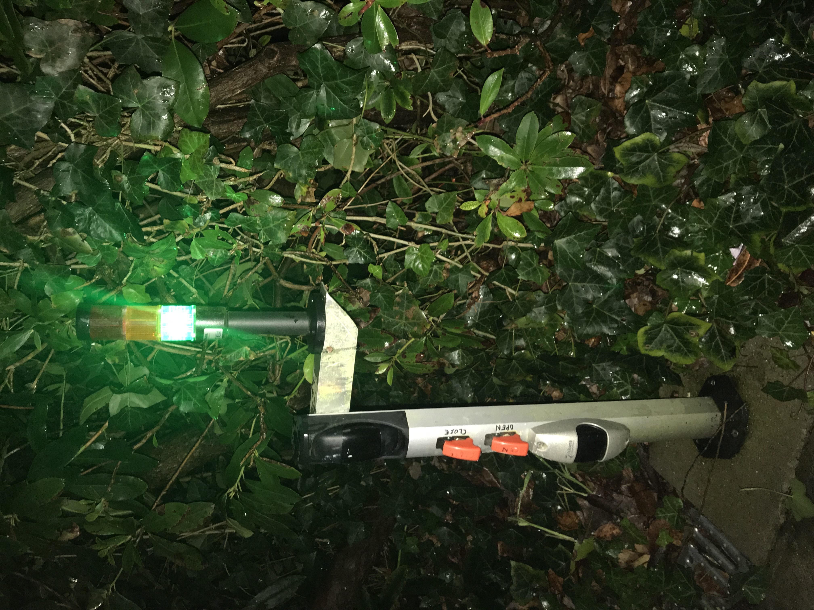

# Doors and Windows

## Summary

<!--s_descr_di-->
A door? Is it not a simple input that states if the door is closed or not? A door can have a raft of method_things including all types of notifications, lights or triggers to open or close the door. To name a few method_things; optical beams to open or close the door, light to open, to close, a light when opening or closing or a night light. Or a timer on the open or close duration that triggers something. Or to define which area the door/window gives access to which is used in the security App

<!--e_descr_di-->

<!--s_descr_wi-->
Door and Window methods are the same

<!--e_descr_wi-->


A door or window is simply a digital input stating if the door/window is closed or not.

Then many optional properties exist such as another input to tell if the door is fully open or not.

And lights and command pulses to open or close the door and triggers to the room lights when they open or close.

It is possible to register the zones where the door give access to, which is used in the security module, see [Security.md](Security.md) and [Access.md](Access.md).

Doors and windows are used in the climatization system to conserve energy if they are open.

Cumulative data is kept to register openings and closings and how many and duration as well as last_opened or last_closed moments.

Doors/windows can be protected against long opening time, then a notification is fired. 

Window coverings such as curtains and roller shutters can be defined and there is a set of parameters which drives this.

<!--s_descr_do-->
Door and Window methods are the same

<!--e_descr_do-->

<!--s_tbl_do-->
## List of [properties](Properties.md) for __Door__:

  | Property | Validation | Optional? | Repeat? | Description |
  | --- | --- | --- | --- | --- |
  | active | valid_set_int | False | - | designate the active state for a binary thing, either 0 or 1 | 
  | copy_things | {'carbon_copy': {'doc': {'descr': 'receiving copy - carbon copy', 'short': 'carbon_copy'}, 'optional': True, 'type': ['Output', 'Motor', 'Light', 'Dim_light', 'Virtual', 'Virtual_A']}, 'twin_copy': {'doc': {'descr': 'two way copy - twin_copy', 'short': 'twin_copy'}, 'optional': True, 'type': ['Output', 'Motor', 'Light', 'Dim_light', 'Virtual', 'Virtual_A']}} | False | - | copies of things, either carbon copy (one sided copy) or twin copy (copies in both directions) | 
  | descr | str | False | - | free description field for this thing | 
  | descr_01 | list-2 | False | - | description for a binary thing when payload value is 0 or 1 | 
  | duration | float | False | - | duration of the output being active/ input must be active for duration before considered active | 
  | effect_virtuals | ['Virtual', 'Virtual_A', 'Virtual_R'] | False | True | virtual things that are affected by, or can have an effect on, the value of the parent thing | 
  | fav | str | True | - | is this a favorite element | 
  | icon | str | True | - | icon file for this element | 
  | member_of | list | True | - | a list of group names to which thing belongs | 
  | method_things | ['access', 'beam2close', 'beam2open', 'beam_can_close', 'beam_can_open', 'cmd_close', 'cmd_close_ign', 'cmd_open', 'cmd_open_ign', 'is_opened', 'keep_closed', 'keep_opened', 'light_deco', 'light_green', 'light_night', 'light_not_closed', 'light_red', 'light_warn', 'lights_off_at_close', 'lights_off_at_open', 'lights_on_at_close', 'lights_on_at_open', 'pulse2close', 'pulse2open', 'ring_button', 'step2open_close', 'time_auto_close', 'time_check_close', 'time_check_open', 'time_open_max'] | False | - | special methods of this thing, mostly realised through things | 
  | my_assistant | bool | True | - | a flag if voice (alexa) can activate this thing | 
  | notifications | ['active', 'app_done', 'app_start', 'conflict_oc', 'disable_off', 'disable_on', 'enable_off', 'enable_on', 'freeze_off', 'freeze_on', 'inactive', 'notify+', 'open_max', 'payload_no', 'ring', 'ring_away', 'trigger', 'trigger_no'] | True | - | door nty's, see [__Notifier__](Notifier.md) | 
  | path | str, str_list | False | - | path to the specific hardware element | 
  | short | str | False | - | free (preferably short) description for this thing | 
  | th_grp | str | False | - | the technical group to which this thing belongs, used in groupings for lists and reports | 
  | value_logic | dict | False | - | logic to automatically determine the payload  based on time or other things | 
  | where2find | str | True | - | where to find in the room or place | 

## List of [Notifications](Notifier.md) for  __Door__:

  | Notification Suffix | When invoked? |
  | --- | --- | 
  | active | when payload is active | 
  | app_done | when a things_app completes | 
  | app_start | when a things_app starts | 
  | conflict_oc | error as door is registered to be open and closed at the same time | 
  | disable_off | when all of the disable conditions fail | 
  | disable_on | when one of the disable conditions succeed | 
  | enable_off | when one of the enable conditions fail | 
  | enable_on | when all the enable conditions succeed | 
  | freeze_off | all of the freeze conditions fail | 
  | freeze_on | one of the freeze conditions succeed | 
  | inactive | when payload is nonactive | 
  | notify+ | extra notifications | 
  | open_max | door is open for the specified maximum duration | 
  | payload_no | the requested payload is refused | 
  | ring | when the doorbell is pressed | 
  | ring_away | when the doorbell is pressed when away | 
  | trigger | door is triggered | 
  | trigger_no | door is trigger but opening is refused | 

## List of [copy_things] for  __Door__:

  | Copy Thing | Type Thing | What it does? |
  | --- | --- | --- | 
  | carbon_copy | ['Output', 'Motor', 'Light', 'Dim_light', 'Virtual', 'Virtual_A'] | {'descr': 'receiving copy - carbon copy', 'short': 'carbon_copy'} | 
  | twin_copy | ['Output', 'Motor', 'Light', 'Dim_light', 'Virtual', 'Virtual_A'] | {'descr': 'two way copy - twin_copy', 'short': 'twin_copy'} | 

## List of [method_things] for  __Door__:

  | Method Thing | Type Thing | What it does? |
  | --- | --- | --- | 
  | access | str_list | {'descr': 'zone list where the door give access to', 'short': 'access'} | 
  | beam2close | Optical | {'descr': 'optical beam, if tripped the door closes after 3 seconds', 'short': 'beam2close'} | 
  | beam2open | Optical | {'descr': 'optical beam, if tripped the door opens if beam_can_open', 'short': 'beam2open'} | 
  | beam_can_close | ['Switch', 'Optical', 'Virtual'] | {'descr': 'actually is not needed as a switch can be put in series with the optical close beam which is similar to a constantly interrupted beam', 'short': 'beam_can_close'} | 
  | beam_can_open | ['Switch', 'Optical', 'Virtual'] | {'descr': 'a switch that allows the optical open beam to work, it does not prevent ', 'short': 'beam_can_open'} | 
  | cmd_close | Input | {'descr': "the 'close the door' command from the doorbell that can trigger doors or events. It activates pulse2close if the door/window is open and pulse2close is not active.", 'short': 'cmd_close from a doorbell'} | 
  | cmd_close_ign | Input | {'descr': "the 'close the door' command from the doorbell that is ignored by the app", 'short': 'cmd_close_ign from a doorbell'} | 
  | cmd_open | Input | {'descr': "the 'open the door' command from the doorbell that can trigger doors or events.  It activates pulse2open if the door/window is closed and pulse2open is not active.", 'short': 'cmd_open from a doorbell'} | 
  | cmd_open_ign | Input | {'descr': "the 'open the door' command from the doorbell that is ignored by the app", 'short': 'cmd_open_ign from a doorbell'} | 
  | is_opened | Input | {'descr': 'f.i. a magnetic contact that registers that the door/window is fully opened', 'short': 'is_opened'} | 
  | keep_closed | ['Switch', 'Virtual'] | {'descr': 'all requests to open the dw are ignored', 'short': 'keep_closed'} | 
  | keep_opened | ['Switch', 'Virtual'] | {'descr': 'all requests to close the dw are ignored', 'short': 'keep_opened'} | 
  | light_deco | Light | {'descr': 'is on when the door is not closed', 'short': 'light_deco'} | 
  | light_green | Light | {'descr': 'is on when the door is fully open', 'short': 'light_green'} | 
  | light_night | Light | {'descr': 'is on when the f_night is on and till xx seconds after close', 'short': 'light_night'} | 
  | light_not_closed | Light | {'descr': 'is on when the door is not closed', 'short': 'light_not_closed'} | 
  | light_red | Light | {'descr': 'is on when the door is not closed and not fully open (door is moving)', 'short': 'light_red'} | 
  | light_warn | Light | {'descr': 'is on when the door is moving', 'short': 'light_warn'} | 
  | lights_off_at_close | Virtual | {'descr': "if this virtual is up and the door closes, then all the lights will go off in the room.The virtual is then 'consumed' and goes off", 'short': 'lights_off_at_close'} | 
  | lights_off_at_open | Virtual | {'descr': "if this virtual is up and the door opens, then all the lights will go on in the room.  The virtual is then 'consumed' and goes off", 'short': 'lights_off_at_open'} | 
  | lights_on_at_close | Virtual | {'descr': "if this virtual is up and the door closes, then all the lights will go on in the room. The virtual is then 'consumed' and goes off", 'short': 'lights_on_at_close'} | 
  | lights_on_at_open | Virtual | {'descr': "if this virtual is up and the door opens, then all the lights will go on in the room.  The virtual is then 'consumed' and goes off", 'short': 'lights_on_at_open'} | 
  | pulse2close | Output | {'descr': 'pulse to close the door', 'short': 'pulse2close'} | 
  | pulse2open | Output | {'descr': 'pulse to open the door', 'short': 'pulse2open'} | 
  | ring_button | Input | {'descr': 'the bell button', 'short': 'door bell_button'} | 
  | step2open_close | Output | {'descr': 'step pulse to close the door when door is open or open the door when the door is closed', 'short': 'step2open_close'} | 
  | time_auto_close | int | {'descr': 'time in seconds that the door will close automatically after optical close was triggered', 'short': 'time_auto_close'} | 
  | time_check_close | int | {'descr': 'time in seconds to check that the door is closed after a pulse2close to repeat the close command', 'short': 'time_check_close'} | 
  | time_check_open | int | {'descr': 'time in seconds to check that the door is open after a pulse2open to repeat the open command', 'short': 'time_check_open'} | 
  | time_open_max | int | {'descr': 'timer starts when door/window opens, and used for nty_open_max purposes', 'short': 'time_open_max'} | 

## List of [Errors/Warnings](Error_Warn.md) for  __Door__:

  | Error/Warning ID | Error/Warning MSG | Occurring When? |
  | --- | --- | --- | 
  | msg_dw_check_cmd | !MSG {:} got {:} cmd, {:} secs ago but now still {:} -> cmd repeated |  
  | msg_dw_keep | !MSG {:} got pulse2{:} cmd, but keep_{:} is active |  
  | msg_dw_was_closed | {:} was closed, command ignored |  
  | msg_dw_was_open | {:} was open, command ignored |  
<!--e_tbl_do-->

## Door Configuration Example

Below is a __house gate entrance door__ example which is a complex door definition, where a lot of possible door attributes are being defined.
Please note the extensive nesting of properties and the use of flags.

In this example the gate has 2 magnetic switches, one for registering being not closed and one for registering to be fully open.
These switches are surrounded with notifications to state the situation of the door.

Then there is an optical beam to open the door, but this beam is deactivated 2 minutes after the security is enabled to avoid easy tampering with the door when everyone is away.
There is also an switch override on this beam so that in special circumstances the door can really be blocked.

There is also an optical close beam, that triggers the door to close after some vehicle passes.
There is an override switch but that one is placed in series with the beam trigger signal, so there is not software required.

There is a Red Orange Green signal light that give a visual indication if the person or vehicle can pass.

The orange light is rewired to show if there is uncollected mail through a flag, very convenient when you enter or leave if you should collect mail.

The night light works when it is dark and the door opens or closes en for 2 minutes and is also triggered when someone rings the bell.

Several voice and email notifications are called (with pictures of camera's) when the door opens, closes, is long open or when the beam to open is triggered and if refused.

A yellow flicker stroboscopic light works when the isles of the door are moving, so that people on the cycling path are notified that a vehicle could be leaving. 

<!--s_insert_{"tree":"(dk:street).*(o:Door)"}-->

from project.py tree:(dk:street).*(o:Door)
```python3
# --> project.py :<dk:project,o:Project,kw:property,lp:0,o:House,kw:places,dk:street,o:Place,kw:contents,lp:3,o:Doors>

from lucy_app import *

Doors(items = {
            "gate":Door(
                    duration = 1,
                    effect_virtuals = {
                            "btle_blackout":Virtual(
                                    play = Effect(maker='parent', condition='become_active', effect='make_inactive', taker='self', delay=None, duration=None))},
                    method_things = {
                            "access":["garden","street"],
                            "beam2close":Optical(path = "unipi:PI-Gate,input,6"),
                            "beam2open":Optical(
                                    active = 0,
                                    notifications = {
                                            "payload_no":Mail(subject='Gate Beam Alert, {app_txt}', to='{prime}', cams=None, cam_groups=['cams_driveway'], passes=2, body_file='', files2mail=None, ceiling=None)},
                                    path = "unipi:PI-Gate,input,4",
                                    value_logic = {"freeze":{"is_alarm":False,"is_armed":True},"freeze_delay":{"before":120}}),
                            "beam_can_open":Switch(path = "unipi:PI-Gate,input,3"),
                            "cmd_close_ign":Input(path = "unipi:PI-Gate,input,7"),
                            "cmd_open_ign":Input(path = "unipi:PI-Gate,input,8"),
                            "is_opened":Input(
                                    duration = 1,
                                    notifications = {
                                            "active":[
                                                Mail(subject='Gate is open!', to=None, cams=None, cam_groups=['cams_gate'], passes=2, body_file='', files2mail=None, ceiling=None),
                                                Say(txt='{tts_start} the gate is now open{tts_end}', ceiling=None, times=1, override=None, volume=15)],
                                            "inactive":Mail(subject='Gate closing...', to=None, cams=None, cam_groups=['cams_gate'], passes=1, body_file='', files2mail=None, ceiling=None)},
                                    path = "unipi:PI-Gate,input,2"),
                            "light_deco":Light(copy_things = {
                                            "carbon_copy":Output(path = "unipi:PI-Gate,relay,14")},path = "unipi:PI-Gate,relay,5",usage = {"watts":24}),
                            "light_green":Light(path = "unipi:PI-Gate,relay,3",usage = {"watts":10}),
                            "light_night":Light(
                                    duration = 120,
                                    effect_virtuals = {
                                            "ring_gate":Virtual(
                                                    play = Effect(maker='self', condition='become_active', effect='make_active', taker='parent', delay=None, duration=None))},
                                    path = "unipi:PI-Gate,relay,8",
                                    usage = {"watts":50}),
                            "light_not_closed":Light(effect_virtuals = {
                                            "have_mail":Virtual(
                                                    play = Effect(maker='self', condition='when_inactive', effect='inactive_freeze', taker='parent', delay=None, duration=None))},path = "unipi:PI-Gate,relay,2"),
                            "light_red":Light(path = "unipi:PI-Gate,relay,1",usage = {"watts":10}),
                            "light_warn":Light(copy_things = {
                                            "carbon_copy":Output(path = "unipi:PI-Gate,relay,13")},path = "unipi:PI-Gate,relay,4"),
                            "pulse2close":Output(duration = 2,effect_virtuals = {
                                            "dw_autom_close":Virtual(
                                                    duration = 600,
                                                    play = Effect(maker='self', condition='become_inactive', effect='make_active', taker='parent', delay=None, duration=None))},path = "unipi:PI-Gate,relay,7"),
                            "pulse2open":Output(duration = 2,effect_virtuals = {
                                            "dw_autom_open":Virtual(
                                                    duration = 2,
                                                    play = Effect(maker='self', condition='become_active', effect='make_active', taker='parent', delay=None, duration=None)),
                                            "dw_cmd_gate":Virtual(
                                                    duration = 2,
                                                    play = Effect(maker='self', condition='become_active', effect='make_active', taker='parent', delay=None, duration=None))},path = "unipi:PI-Gate,relay,6"),
                            "ring_button":Input(effect_virtuals = {
                                            "ring_gate":Virtual(
                                                    play = Effect(maker='parent', condition='become_active', effect='make_active', taker='self', delay=None, duration=None))},owned_by = "building",path = "unipi:PI-Gate,input,5"),
                            "time_auto_close":5,
                            "time_open_max":300},
                    my_assistant = True,
                    notifications = {
                            "active":[
                                Mail(subject='Gate is closed', to=None, cams=None, cam_groups=['cams_gate'], passes=1, body_file='', files2mail=None, ceiling=None),
                                Say(txt='{tts_start} the street gate is closed{tts_end}', ceiling=None, times=1, override=None, volume=15),
                                Say(txt='{tts_start} the street entrance to the estate is closed{tts_end}', ceiling=None, times=1, override=None, volume=15),
                                Say(txt='{tts_start} the access from the street to the property is closed{tts_end}', ceiling=None, times=1, override=None, volume=15),
                                Say(txt='{tts_start} the main street entrance is closed{tts_end}', ceiling=None, times=1, override=None, volume=15)],
                            "conflict_oc":Mail(subject='!!Open/Closed magnetic contact conflict, {app_txt}', to='{prime}', cams=None, cam_groups=None, passes=0, body_file='', files2mail=None, ceiling=None),
                            "inactive":Mail(subject='Gate opening...', to=None, cams=None, cam_groups=['cams_gate'], passes=2, body_file='', files2mail=None, ceiling=None),
                            "open_max":[
                                Mail(subject='Gate is open longtime!', to='{prime}', cams=None, cam_groups=['cams_driveway'], passes=1, body_file='', files2mail=None, ceiling=None),
                                Say(txt='{tts_start} this is a warning that the gate is still open{tts_end}', ceiling=None, times=1, override=None, volume=None)],
                            "ring":[
                                Mail(subject='{thing+is}', to=None, cams=None, cam_groups=['cams_gate'], passes=2, body_file='', files2mail=None, ceiling=None),
                                Say(txt='{tts_start} someone is ringing the bell{tts_end}', ceiling=None, times=1, override=True, volume=None),
                                Say(txt='{tts_prop} ring, ring the doorbell{tts_end}', ceiling=None, times=1, override=True, volume=None),
                                Say(txt='{tts_prop} ding dong, ding dong{tts_end}', ceiling=None, times=1, override=True, volume=None),
                                Say(txt='{tts_prop} ring, ring, someone is at the gate{tts_end}', ceiling=None, times=1, override=True, volume=None),
                                Cal(txt='RING_doorbell', summary='', ceiling=None),
                                Ifttt(txt='door_bell', ceiling=None)],
                            "ring_away":[
                                Mail(subject='{thing+is}', to='{prime}', cams=None, cam_groups=['cams_gate'], passes=2, body_file='', files2mail=None, ceiling=None),
                                Cal(txt='RING_doorbell when away', summary='', ceiling=None)],
                            "trigger":[
                                Mail(subject='Gate Beam Tripped', to=None, cams=None, cam_groups=['cams_driveway'], passes=2, body_file='', files2mail=None, ceiling=None),
                                Say(txt='{tts_start} the beam is tripped and the street entrance will open{tts_end}', ceiling=None, times=1, override=None, volume=None),
                                Say(txt='{tts_start} somebody leaves the property and the street door will open{tts_end}', ceiling=None, times=1, override=None, volume=None),
                                Say(txt='{tts_start} bye to the people leaving the estate{tts_end}', ceiling=None, times=1, override=None, volume=None)],
                            "trigger_no":[
                                Mail(subject='Gate Beam Tripped but not Allowed', to=None, cams=None, cam_groups=['cams_driveway'], passes=2, body_file='', files2mail=None, ceiling=None),
                                Say(txt='{tts_start} the gate beam is tripped but the gate opening is rejected{tts_end}', ceiling='1/day', times=1, override=None, volume=None)]},
                    path = "unipi:PI-Gate,input,1"),
            "soccer_entrance":Door(
                    duration = 1,
                    method_things = {
                            "access":["garden","street"],
                            "beam2open":Optical(
                                    notifications = {
                                            "payload_no":Mail(subject='Soccer Door Open Alert, {app_txt}', to='{prime}', cams=['cam_alpha_soccer'], cam_groups=None, passes=2, body_file='', files2mail=None, ceiling=None)},
                                    path = "unipi:PI-Soccer,input,4"),
                            "keep_opened":Virtual(),
                            "light_night":Light(
                                    duration = 120,
                                    effect_virtuals = {
                                            "ring_soccer":Virtual(
                                                    play = Effect(maker='self', condition='become_active', effect='make_active', taker='parent', delay=None, duration=None)),
                                            "soccer_light_is_on":Virtual(
                                                    play = Effect(maker='self', condition='become_active', effect='make_active', taker='parent', delay=None, duration=None))},
                                    path = "unipi:PI-Soccer,relay,5",
                                    usage = {"watts":20}),
                            "pulse2open":Output(copy_things = {
                                            "carbon_copy":Light(path = "unipi:PI-Soccer,relay,1")},duration = 5,path = "unipi:PI-Soccer,relay,3"),
                            "ring_button":Input(effect_virtuals = {
                                            "ring_soccer":Virtual(
                                                    play = Effect(maker='parent', condition='become_active', effect='make_active', taker='self', delay=None, duration=None))},owned_by = "building",path = "unipi:PI-Soccer,input,2"),
                            "time_open_max":30},
                    my_assistant = True,
                    notifications = {
                            "inactive":[
                                Mail(subject='Soccer Entrance: someone entering or leaving', to=None, cams=['cam_alpha_soccer'], cam_groups=None, passes=2, body_file='', files2mail=None, ceiling=None),
                                Say(txt='{tts_start} Someone entering or leaving the soccer entrance{tts_end}', ceiling='2/day', times=1, override=None, volume=None)],
                            "open_max":[
                                Mail(subject='Soccer Entrance is open longtime!', to=None, cams=['cam_alpha_soccer'], cam_groups=None, passes=2, body_file='', files2mail=None, ceiling=None),
                                Say(txt='{tts_start} the soccer entrance is still open{tts_end}', ceiling='1/day', times=1, override=None, volume=None)],
                            "ring":[
                                Mail(subject='{thing+is}', to=None, cams=['cam_alpha_soccer'], cam_groups=None, passes=2, body_file='', files2mail=None, ceiling=None),
                                Say(txt='{tts_start} someone is at the soccer entrance{tts_end}', ceiling=None, times=1, override=True, volume=None)],
                            "ring_away":[
                                Mail(subject='{thing+is}', to='{prime}', cams=['cam_alpha_soccer'], cam_groups=None, passes=2, body_file='', files2mail=None, ceiling=None),
                                Cal(txt='RING_soccer_doorbell when away', summary='', ceiling=None)]},
                    path = "unipi:PI-Soccer,input,6")})

```

<!--e_insert-->

Although this may look like programming, you can easily add features without changing the programming scripts.

Adding a button to open the door is possible simply by adding a button to the pulse2open properties.

Please study the site.conf example for tricks and features you may need.

For the optical open beam trigger, i made 2 optical beams in parallel, with the signals in series, to avoid a passing bird or small dog to open the door inadvertently. 

See the picture of the ROG light and beam switches : 

## Door/Window : Duplicate Definition

Sometimes you want to define one room as 2 different spaces as the room can have 2 different functions.
In the example below, a single room is defined as 2 rooms : guest.sleep and guest.bath:

<!--s_insert_{"tree":["(dk:guest.sleep).*(o:Climate)","(dk:guest.bath).*(o:Climate)"]}-->

from project.py tree:['(dk:guest.sleep).*(o:Climate)', '(dk:guest.bath).*(o:Climate)']
```python3
# --> project.py :<dk:project,o:Project,kw:property,lp:0,o:House,kw:places,dk:guest.sleep,o:Room,kw:contents,lp:3,o:Climate>

from lucy_app import *

Climate(
    clim_makers = {
            "dk_guest_sp":Clim_SP(i_make = ['cold', 'warm'],method_things = {
                            "is_on":Input(path = "daikin:DK_Guest,is_on")},path = "daikin:DK_Guest,sp"),
            "r10":Clim_SW(
                    i_make = ['warm'],
                    member_of = ["pump"],
                    method_things = {
                            "C_fluid":Sensor(i_read = "°C",path = "ow:PI-Light,288AE573060000C2,DS18B20,,98")},
                    path = "unipi:PI-Light,relay,13")},
    clim_sensors = [
        Sensor(i_read = "°C",path = "ow:PI-Light,28FEF35F070000AF,DS18B20,,61"),
        Sensor(i_read = "°C",path = "daikin:DK_Guest,h_temp",th_grp = "daikin"),
        Sensor(i_read = "%H",path = "daikin:DK_Guest,h_humid",th_grp = "daikin")],
    clim_targets = {"cold_sp":{"preset":"cold_preset"},"warm_sp":{"preset":"warm_preset_3"}},
    my_assistant = True,
    room_is_priority = True,
    room_virtuals = {
            "{room}^clim_on":Virtual(copy_things = {
                            "twin_copy":Output(path = "zw:Vera_plus,buttonset,146,Status6")}),
            "{room}^clim_pref":Virtual_R(copy_things = {
                            "twin_copy@-1":Output(path = "zw:Vera_plus,buttonset,151,Status7"),
                            "twin_copy@1":Output(path = "zw:Vera_plus,buttonset,151,Status3")},descr_range = ["Economy","Standard","Comfort"],digital_range = [-1,0,1])})

# --> project.py :<dk:project,o:Project,kw:property,lp:0,o:House,kw:places,dk:guest.bath,o:Room,kw:contents,lp:1,o:Climate>

from lucy_app import *

Climate(
    clim_makers = {
            "r09":Clim_SW(
                    i_make = ['warm'],
                    member_of = ["pump"],
                    method_things = {
                            "C_fluid":Sensor(i_read = "°C",path = "ow:PI-Climate,28FDD25F070000C3,DS18B20,,56")},
                    path = "unipi:PI-Climate,relay,4")},
    clim_sensors = [Sensor(i_read = "°C",path = "ow:PI-Light,282FF65E07000001,DS18B20,,82"),Sensor(i_read = "%V",path = "renson:Healthbox_North,guest.bath")],
    clim_targets = {"warm_sp":{"preset":"warm_preset_4"}},
    my_assistant = True,
    room_virtuals = {
            "{room}^clim_on":Virtual(copy_things = {
                            "twin_copy":Output(path = "zw:Vera_plus,buttonset,146,Status6")}),
            "{room}^clim_pref":Virtual_R(copy_things = {
                            "twin_copy@-1":Output(path = "zw:Vera_plus,buttonset,151,Status7"),
                            "twin_copy@1":Output(path = "zw:Vera_plus,buttonset,151,Status3")},descr_range = ["Economy","Standard","Comfort"],digital_range = [-1,0,1])})

```

<!--e_insert-->

## Window Coverings

Many types of window coverings exist such as curtains, a sunscreen either placed inside or outside and with protection gliders (wind proof) or a sun roller tent or an old fashioned roller shutter.
This wide range of things have one thing in common, they are either on (= closing the window) or off (=opened) and they can stop somewhere in between opened or closed.

By means of a standard, a window covering device is defined by a Win_cover() thing which has a value of 0..100%, whereby 0 means open and 100% means that the window is fully covered, i.e. closed. 

Another characteristic of window coverings is that a several real life parameters exist that define if they should be open or closed:

  | Win_cover aspect | Description |
  | --- | --- | 
  | Winter-months |  cold months with little sunshine, outside sunscreens should stay open |
  | Time of day | sunscreen could be needed just after a certain time after sunrise, or go open as of a certain time. Or open gradually more as the sun moves in |
  | Light-intensity | direct sunshine as of a certain threshold could trigger the need for sunscreen |
  | Day/Night | curtains could be closed for the night but open for the day |
  | Wind | Sunscreens could be damaged by a certain wind velocity and need to open for protection |
  | Precipitation and Rain | Solar tents should be closed, not to get wet |
  | Temperature | It could be useful to close the curtains to add an additional insulation layer when it is hot or cold outside |

More parameters exist, such as holiday, house is armed,... but these are already covered in the value_logic properties that every thing has.
  
It is clear from the above list that a certain order or evaluation of parameters should be undertaking; if there is a lot of wind then the window cover needing protection needs to be open.

But how ensure that everyones specific situation can be covered with all the variants possible without specific programming?

With __wincover_manager__ app, main parameters can be defined, and with Win_cover() thing 2 new properties are added "open_logic" and "close_logic" - which are overrides for when the window covering should be opened or closed.   Value_logic is obviously available to use the generic parameters and time of day value setting.

Let's first explore both definitions and hopefully the examples will make everything clear.

## wincover_manager

<!--s_descr_wcm-->
Manages and contain options for the defined Door and Window coverings

<!--e_descr_wcm-->

<!--s_tbl_wcm-->
## List of [properties](Properties.md) for __Wincover_manager__:

  | Property | Validation | Optional? | Repeat? | Description |
  | --- | --- | --- | --- | --- |
  | C_outdoor_wc | Sensor | True | - | an outside temp sensor | 
  | fav | str | True | - | is this a favorite element | 
  | icon | str | True | - | icon file for this element | 
  | raining_wc | Input | True | - | Input device, active when the sensor is wet.  There is a small heater that dries the sensor, to become inactive when it is dry | 
  | sun_light_switch | Input | True | - | Input device to monitor light strength level and flip a switch if it is strong enough | 
  | sun_light_wc | Sensor | True | - | is an analog light sensor with output 0..10V | 
  | wind_speed_wc | Wind_speed | True | - | an input that generates counter data, the input must allow for counter mode | 
  | wind_switch | Input | True | - | Input device to monitor wind strength level and flip a switch if it is too strong | 
  | winter_months | int_list | True | - | number of the months list with default winter mode | 

## List of [Errors/Warnings](Error_Warn.md) for  __Wincover_manager__:

  | Error/Warning ID | Error/Warning MSG | Occurring When? |
  | --- | --- | --- | 
  | err_wc_miss | !! missing wincover_manager with {:}, {:} |  
  | msg_winc_cmd | Wincovers of rooms <{:}> to <{:}> : <{:}> |  
<!--e_tbl_wcm-->

## Win_cover()

<!--s_descr_wc-->
Window covering

<!--e_descr_wc-->

<!--s_tbl_wc-->
## List of [properties](Properties.md) for __Win_cover__:

  | Property | Validation | Optional? | Repeat? | Description |
  | --- | --- | --- | --- | --- |
  | copy_things | {'carbon_copy': {'doc': {'descr': 'receiving copy - carbon copy', 'short': 'carbon_copy'}, 'optional': True, 'type': ['Output', 'Motor', 'Light', 'Dim_light', 'Virtual', 'Virtual_A']}, 'twin_copy': {'doc': {'descr': 'two way copy - twin_copy', 'short': 'twin_copy'}, 'optional': True, 'type': ['Output', 'Motor', 'Light', 'Dim_light', 'Virtual', 'Virtual_A']}} | False | - | copies of things, either carbon copy (one sided copy) or twin copy (copies in both directions) | 
  | descr | str | False | - | free description field for this thing | 
  | duration | float | False | - | duration of the output being active/ input must be active for duration before considered active | 
  | effect_virtuals | ['Virtual', 'Virtual_A', 'Virtual_R'] | False | True | virtual things that are affected by, or can have an effect on, the value of the parent thing | 
  | fav | str | True | - | is this a favorite element | 
  | icon | str | True | - | icon file for this element | 
  | member_of | list | True | - | a list of group names to which thing belongs | 
  | method_things | ['activate_button', 'de_activate_button', 'is_on', 'on_off_relay', 'toggle_button'] | False | - | special methods of this thing, mostly realised through things | 
  | my_assistant | bool | True | - | a flag if voice (alexa) can activate this thing | 
  | notifications | ['active', 'app_done', 'app_start', 'disable_off', 'disable_on', 'enable_off', 'enable_on', 'freeze_off', 'freeze_on', 'inactive', 'notify+', 'payload_no'] | True | - | the notifications for window covers, see [__Notifier__](Notifier.md) | 
  | path | str, str_list | False | - | path to the specific hardware element | 
  | short | str | False | - | free (preferably short) description for this thing | 
  | th_grp | str | False | - | the technical group to which this thing belongs, used in groupings for lists and reports | 
  | threshold | float | False | - | the minimum value that an analog input must change before the value is considered changed | 
  | value_logic | dict | False | - | logic to automatically determine the payload  based on time or other things | 
  | where2find | str | True | - | where to find in the room or place | 

## List of [Notifications](Notifier.md) for  __Win_cover__:

  | Notification Suffix | When invoked? |
  | --- | --- | 
  | active | when payload is active | 
  | app_done | when a things_app completes | 
  | app_start | when a things_app starts | 
  | disable_off | when all of the disable conditions fail | 
  | disable_on | when one of the disable conditions succeed | 
  | enable_off | when one of the enable conditions fail | 
  | enable_on | when all the enable conditions succeed | 
  | freeze_off | all of the freeze conditions fail | 
  | freeze_on | one of the freeze conditions succeed | 
  | inactive | when payload is nonactive | 
  | notify+ | extra notifications | 
  | payload_no | the requested payload is refused | 

## List of [copy_things] for  __Win_cover__:

  | Copy Thing | Type Thing | What it does? |
  | --- | --- | --- | 
  | carbon_copy | ['Output', 'Motor', 'Light', 'Dim_light', 'Virtual', 'Virtual_A'] | {'descr': 'receiving copy - carbon copy', 'short': 'carbon_copy'} | 
  | twin_copy | ['Output', 'Motor', 'Light', 'Dim_light', 'Virtual', 'Virtual_A'] | {'descr': 'two way copy - twin_copy', 'short': 'twin_copy'} | 

## List of [method_things] for  __Win_cover__:

  | Method Thing | Type Thing | What it does? |
  | --- | --- | --- | 
  | activate_button | ['Button'] | {'descr': 'activates the output if inactive', 'short': 'activate_button'} | 
  | de_activate_button | ['Button'] | {'descr': 'deactivates the output if active', 'short': 'de_activate_button'} | 
  | is_on | Input | {'descr': 'is the input to measure if the output is active or not', 'short': 'is_on'} | 
  | on_off_relay | ['Output', 'Light'] | {'descr': 'deactivates the output if active', 'short': 'de_activate_button'} | 
  | toggle_button | ['Button'] | {'descr': 'is an input to toggle the output state', 'short': 'toggle_button'} | 
<!--e_tbl_wc-->


## Example 

the below example is typical for an outside wind/rain sensitive sunscreen that works during summer to protect the house from heating:
	-the win_cover will close the window (and give shade) when light_intensity reaches 75% and the temperature is above 25 degrees
	 how much it closes the window is determined by value_logic: as of sunrise + 2 hours it closes fully but it closes 25% less after 3 pm and opens fully one hour before sunset
	-the win_cover is fully open (retracted=protected) when the wind_switch or rain_switch become active and it overrides both close logic and value logic.

<!--s_insert_{"tree":"(dk:master_bed).*(o:Windows)"}-->

from project.py tree:(dk:master_bed).*(o:Windows)
```python3
# --> project.py :<dk:project,o:Project,kw:property,lp:0,o:House,kw:places,dk:master_bed,o:Room,kw:contents,lp:2,o:Windows>

from lucy_app import *

Windows(items = {
            "sun_master_front":Win_cover(
                    path = "vera:Vera_plus,sun_master_front",
                    value_logic = {
                            "assign":{"sunrise+01:00":"100","sunset-02:00":"0"},
                            "disable":['raining_wc', 'wind_speed_wc^wind_gust>60'],
                            "disable_delay":{"after":1800},
                            "enable":['C_outdoor_wc>22', 'sun_light_wc>90'],
                            "enable_delay":{"after":1800,"before":120}}),
            "win_master_front":Window(path = "unipi:PI-Climate,input,35"),
            "win_master_rear":Window(path = "unipi:PI-Climate,input,43")})

```

<!--e_insert-->


