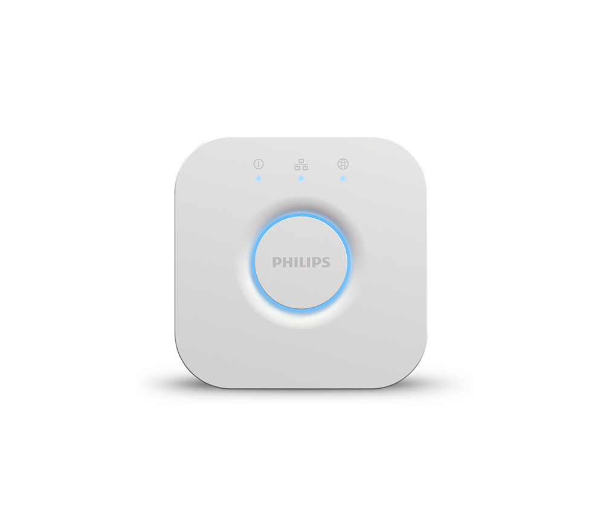

<!--s_name-->
# Hue_driver

<!--e_name-->

<!--s_role-->
<!--e_role-->

## Summary

<!--s_descr-->
This is the Philips Hue driver, to interface to the Philips Hue bridge that drives all the Hue devices

<!--e_descr-->

This driver integrates one or multiple Philips hue bridges that will be programmatic-ally controlled.



These bridges should be defined as a Hue() device in the raspi option. 

The mobile phone app __Hue__ should be used to config the groups and lights.  

The names should match with the rooms and the lights defined in site.conf with the change that here the rooms/lights must be defined with underscore instead of a space.

This because ok google and siri do not accept underscores, but don't worry; the translation is programmed. 

At startup the "light" things_controller will produce an email with the matches/error, so please analyze. 

## Emulating real Philips Hue Bridges

To enable full voice control with Alexa, some raspberry's emulate a Philips Hue bridge.

To allow the hue app to see also these emulators as real, the emulators read the real bridges to make sure they show the same software version.

For this to work, the link activation button should be pressed on every philips bridge for every emulator things_controller at reboot to allow access to it.

You find who are emulating things_controllers in the config parsing email of the deploy role things_controller.

There is typically one for lights, one for climate and one for security controls.

## Name Matching, Lights and Rooms

For Lucy to have full control on all Philips Hue devices, they need to be the same and the room names have to be the same too.

By defining the bridges as raspi Hue() objects and lights with hue pin codes (see example below), Lucy can manage hue lights as any other light under control. 

To facilitate matching identifiers, a report is produced by the ight_manager raspberry, see [__Light_manager__](Light_manager.md) which shows what the issues are (if any) and what is a match.

An example hue parsing report is showed below.

Regularly it is checked that hue light devices are added or disappear, the report gets generated automatically and emailed, so that the corresponding configuration can be updated and stays synchronized.

<!--s_tbl-->
## List of [properties](Properties.md) for __Hue_driver__:

  | Property | Validation | Optional? | Repeat? | Description |
  | --- | --- | --- | --- | --- |
  | fav | str | True | - | is this a favorite element | 
  | hue_port | int | False | - | the Philips Hue bridges port, they are default 80 | 
  | icon | str | True | - | icon file for this element | 
  | notifications | ['hue_parsing'] | True | - | extensive list of notifications, see [__Notifier__](Notifier.md) | 

## List of [Notifications](Notifier.md) for  __Hue_driver__:

  | Notification Suffix | When invoked? |
  | --- | --- | 
  | hue_parsing | when this report runs | 

## List of [Errors/Warnings](Error_Warn.md) for  __Hue_driver__:

  | Error/Warning ID | Error/Warning MSG | Occurring When? |
  | --- | --- | --- | 
  | err_hue_fail | !!hue cmd Failure <{:}> {:} |  
  | err_hue_io2id | !!hue {:} name2id failure for {:} |  
  | err_hue_link | !!<{:}>: error {:} |  
  | err_hue_path | !!hue path error {:}: {:} |  
  | err_hue_scene | !!hue {:} scene failure for path {:} scene {:} -> {:} |  
  | err_hue_sensor | !!hue {:} sensor read {:} not in {:} rcvd {:} |  
  | err_hue_set | !!hue {:} set_it failure for path {:} -> {:} |  
  | err_hue_white | !!<{:}>, <{:}> update failed <{:}> |  
  | err_hue_write | !!hue {:} write failure for path {:} -> {:} |  
  | msg_hue_link | <{:}>: Press link button for pairing |  
  | msg_hue_refreshed | <{:}> config refreshed |  
  | msg_hue_request | <{:}>: {:} |  
  | msg_hue_username | <{:}>: Paired as username <{:}> |  
  | msg_hue_white | <{:}> updated, <{:}> deleted as redundant |  
<!--e_tbl-->

## Example Configuration

In the example below there are 2 Philips bridges defined Hue() as one bridge could not cover the whole area.

Four lights are defined, 3 on Hue_bridge and 1 on Hue_bridge2.  

Observe the pin definitions for the name of the corresponding bridge.  

The name of the light is the same as the given name, therefore the \{:\}.

All lights have an interesting value_logic definition which defines what the light should be given flags and time of day.

One light is a full fledge 3 color led strip, the other ones just monochrome light.

```
[APPS]
    hue_driver={"hue_port":80}

[LIVING_LOUNGE]
    light={"floor_candle": Dimmer(pin="hue:Hue_Bridge,{:}",value_logic={"is_room_secure":"0","00:00":"0","sunset-00:10":"127","22:30":"50"})}
	
[OFFICE]
    raspi={"Hue_Bridge": Hue(ip="192.168.15.136",color="white")}
    light={"office_candle": Dimmer(pin="hue:Hue_Bridge,{:}",value_logic={"00:00":"127","sunrise":"0","sunset":"127"}),

[HALL.GROUND]
    light={"stairs_ledstrip":Dimmer(pin="hue:Hue_Bridge,{:}",value_logic={"is_armed_partial":"254,red","00:00":"100,yellow","sunrise":"100,arctic_aurora","12:00":"150,green","sunset":"100,yellow"},
           properties={"type": "RGB"})}

[MASTER_BED.REAR]
    raspi={"Hue_Bridge2": Hue(ip="192.168.15.159",color="white")}
    light={"bed_candle": Dimmer(pin="hue:Hue_Bridge2,{:}",value_logic={"is_armed":"0","is_holiday":"0","00:00":"0","sunset-00:10":"100"})}
```

* * * 
* * * 
## Example Hue Parsing Report

This parsing report below corresponds with the above configuration example as a real life example.

* * * 
* * * 

<!--s_insert_{"role":"light","suffix":"hue"}-->


[PI-Light_hue.html](PI-Light_hue.html)

<!DOCTYPE html><html><body><h1>Hue Analyzed -> PI-Light_hue.html  2020/06/12 11:29:33</h1><table><thead><tr><th>hue:groups</th><th>hue:device_name/id</th><th>myproject.py/place</th><th>myproject.py/light</th><th>Analysis</th></tr></thead><tbody><tr><td style='background-color:cyan;text-align:center' colspan='5'>***Hue_Bridge/192.168.15.136</td></tr><tr><td>-</td><td>dimmer_floor_candelar/2</td><td>-</td><td>??</td><td>warning : hue sensor not defined in myproject.py</td></tr><tr><td>-</td><td>stairs_ledstrip/6</td><td>-</td><td>stairs_ledstrip</td><td>ok</td></tr><tr><td>-</td><td>dimmer_switch_2_scenecycle/4</td><td>-</td><td>??</td><td>warning : hue sensor not defined in myproject.py</td></tr><tr><td>-</td><td>daylight/1</td><td>-</td><td>??</td><td>warning : hue sensor not defined in myproject.py</td></tr><tr><td>-</td><td>floor_candle/2</td><td>-</td><td>floor_candle</td><td>ok</td></tr><tr><td>-</td><td>office_candle/3</td><td>-</td><td>office_candle</td><td>ok</td></tr><tr><td>-</td><td>stairs_ledstrip</td><td>hall.ground</td><td>stairs_ledstrip</td><td>ok</td></tr><tr><td>-</td><td>floor_candle</td><td>living_lounge</td><td>floor_candle</td><td>ok</td></tr><tr><td>-</td><td>office_candle</td><td>office</td><td>office_candle</td><td>ok</td></tr><tr><td>living lounge</td><td>-</td><td>living lounge</td><td>-</td><td>ok</td></tr><tr><td>living lounge</td><td>floor_candle/2</td><td>living lounge</td><td>floor_candle</td><td>ok</td></tr><tr><td>Office</td><td>-</td><td>Office</td><td>-</td><td>ok</td></tr><tr><td>Office</td><td>office_candle/3</td><td>Office</td><td>office_candle</td><td>ok</td></tr><tr><td>master bed rear</td><td>-</td><td>master bed rear</td><td>-</td><td>ok</td></tr><tr><td>hall ground</td><td>-</td><td>hall ground</td><td>-</td><td>ok</td></tr><tr><td>hall ground</td><td>stairs_ledstrip/6</td><td>hall ground</td><td>stairs_ledstrip</td><td>ok</td></tr><tr><td style='background-color:cyan;text-align:center' colspan='5'>***Hue_Bridge2/192.168.15.159</td></tr><tr><td>-</td><td>daylight/1</td><td>-</td><td>??</td><td>warning : hue sensor not defined in myproject.py</td></tr><tr><td>-</td><td>bad_candle/1</td><td>-</td><td>bad_candle</td><td>ok</td></tr><tr><td>-</td><td>bad_candle</td><td>beauty.bath</td><td>bad_candle</td><td>ok</td></tr><tr><td>beauty bath</td><td>-</td><td>beauty bath</td><td>-</td><td>ok</td></tr><tr><td>beauty bath</td><td>bad_candle/1</td><td>beauty bath</td><td>bad_candle</td><td>ok</td></tr><tr><td>living lounge</td><td>-</td><td>living lounge</td><td>-</td><td>ok</td></tr><tr><td>Office</td><td>-</td><td>Office</td><td>-</td><td>ok</td></tr><tr><td>hall ground</td><td>-</td><td>hall ground</td><td>-</td><td>ok</td></tr></tbody></table></body></html>
<!--e_insert-->

* * * 
* * * 


