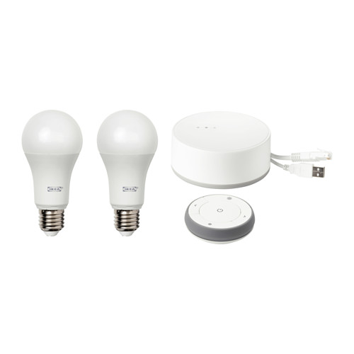

<!--s_name-->
# Ikea_driver

<!--e_name-->

<!--s_role-->
<!--e_role-->

## Summary

<!--s_descr-->
This is the IKEA Tradfri driver, to interface to the IKEA Tradfri light gateways that drives all the Tradfri devices

<!--e_descr-->

This driver integrates one or multiple Ikea Tradfri gateways that will be programmatic-ally controlled.



These devices should be defined as a Ikea() device in the raspi option, including the secret that is printed on the ikea gateway device. 

The mobile phone app __Tradfri__ should be used to config the groups and lights.  

The names should match with the rooms and the lights defined in site.conf with the change that here the rooms/lights must be defined with underscore instead of a space.

This because ok google and siri do not accept underscores, but don't worry; the translation is programmed. 

At startup the "light" things_controller will produce an email with the matches/error, so please analyze for issues.  An example report is presented below.

Tradfri input devices are not reported in the current version and cannot be used reliably, maybe ikea fixes this in future versions.
 

## Name Matching, Lights and Rooms

For this driver to have full control on all Ikea Tradfri light devices, they need to be the same and the room names have to be the same too.

By defining the bridges as raspi Ikea() objects and lights with ikea pin codes (see example below), these light can be managed as any other light under control. 

To facilitate matching identifiers, a report is produced by the light_manager things_controller, see [__Light_manager__](Light_manager.md) which shows what the issues are (if any) and what is a match.

An example ikea parsing report is showed below.

Regularly it is checked that ikea light devices are added or disappear, the report gets generated automatically and emailed, so that the corresponding configuration can be updated and stays synchronized.

<!--s_tbl-->
## List of [properties](Properties.md) for __Ikea_driver__:

  | Property | Validation | Optional? | Repeat? | Description |
  | --- | --- | --- | --- | --- |
  | fav | str | True | - | is this a favorite element | 
  | icon | str | True | - | icon file for this element | 
  | notifications | ['ikea_parsing'] | True | - | extensive list of notifications, see [__Notifier__](Notifier.md) | 

## List of [Notifications](Notifier.md) for  __Ikea_driver__:

  | Notification Suffix | When invoked? |
  | --- | --- | 
  | ikea_parsing | when this report runs | 

## List of [Errors/Warnings](Error_Warn.md) for  __Ikea_driver__:

  | Error/Warning ID | Error/Warning MSG | Occurring When? |
  | --- | --- | --- | 
  | err_ikea_light_c | !!ikea dev <{:}> no light control |  
  | err_ikea_module | !!IKEA pytradfri python module not installed, needed for <{:}> |  
  | err_ikea_path | !!IKEA path {:} missing {:} |  
  | msg_ikea_rebooted | Ikea Gateway <{:}> rebooted, result {:} |  
  | msg_ikea_refreshed | Ikea Gateway <{:}> config refreshed |  
  | msg_ikea_start | IKEA pytradfri started for <{:}> |  
<!--e_tbl-->

Currently no parameters need to be defined.

## Example Configuration

In the example below there is 1 Ikea Tradfri gateway defined Ikea() with one light, observe the pin definition.  

The name of the light is the same as the given name, therefore the \{:\}.

The light has an interesting value_logic definition which defines what the light should be given virtuals and time of day.

<!--s_insert_{"tree":["(o:Ikea_driver)","(dk:guest.sleep).*(o:Lights)","(dk:office).*(o:Things_controllers)"]}-->

from project.py tree:['(o:Ikea_driver)', '(dk:guest.sleep).*(o:Lights)', '(dk:office).*(o:Things_controllers)']
```python3
# --> project.py :<dk:project,o:Project,kw:drivers,lp:3,o:Ikea_driver>

from lucy_app import *

Ikea_driver(
    notifications = {
            "ikea_parsing":Mail(subject='Ikea Tradfri Parsing{app_txt}', to='{prime}', cams=None, cam_groups=None, passes=0, body_file='ikea', files2mail=None, ceiling=None)})

# --> project.py :<dk:project,o:Project,kw:property,lp:0,o:House,kw:places,dk:guest.sleep,o:Room,kw:contents,lp:4,o:Lights>

from lucy_app import *

Lights(my_assistant = True,room_lights = {
            "guest_light":Dim_light(
                    path = "ikea:Ikea_Tradfri,guest_light",
                    value_logic = {"assign":{"00:00":"0","is_armed":"0","sunrise":"0","sunset":"25"}})})

# --> project.py :<dk:project,o:Project,kw:property,lp:0,o:House,kw:places,dk:office,o:Room,kw:contents,lp:0,o:Things_controllers>

from lucy_app import *

Things_controllers(
    items = {
            "DK_Office":Daikin(path = "ip:192.168.15.60"),
            "Hue_Bridge":Hue(path = "ip:192.168.15.136"),
            "Ikea_Tradfri":Ikea(path = "ip:192.168.15.164",secret = "Ua42jpHcvKu3xsKy"),
            "PI-CSlave":Raspi(path = "ip:192.168.15.91"),
            "PI-Dev":Raspi(path = "ip:192.168.15.56"),
            "PI-Notify":Raspi(hw_gws = ["piface:8,8"],path = "ip:192.168.15.106"),
            "PI-Notify2":Raspi(path = "ip:192.168.15.63"),
            "PI-Notify3":Raspi(hw_gws = ["piface:8,8"],path = "ip:192.168.15.133"),
            "PI-Notify4":Raspi(hw_gws = ["piface:8,8"],path = "ip:192.168.15.120"),
            "PI-Stats":Raspi(hw_gws = ["unipi:6,6"],path = "ip:192.168.15.35"),
            "Vera_plus":Vera(path = "ip:192.168.15.75"),
            "imac-lucy":Ubuntu(path = "ip:192.168.15.113"),
            "ow_office":Eds(path = "ip:192.168.15.151")})

```

<!--e_insert-->

* * * 
* * * 
# Example IKEA Trafri Parsing Report

This parsing report below corresponds with the above configuration example as a real life example.

* * * 
* * * 

<!--s_insert_{"role":"light","suffix":"ikea"}-->


[PI-Light_ikea.html](PI-Light_ikea.html)

<!DOCTYPE html><html><body><h1>Ikea Analyzed -> PI-Light_ikea.html  2020/06/12 11:29:33</h1><table><thead><tr><th>ikea:groups</th><th>ikea:devices</th><th>myproject.py/place</th><th>myproject.py/light</th><th>Analysis</th></tr></thead><tbody><tr><td style='background-color:cyan;text-align:center' colspan='5'>***Ikea_Tradfri/192.168.15.164</td></tr><tr><td>-</td><td>TRADFRI remote control</td><td>-</td><td>??</td><td>warning : ikea sensor not defined in myproject.py</td></tr><tr><td>-</td><td>guest_light</td><td>-</td><td>guest_light</td><td>ok</td></tr><tr><td>-</td><td>guest_light</td><td>guest.sleep</td><td>guest_light</td><td>ok</td></tr><tr><td>guest.sleep</td><td>-</td><td>guest.sleep</td><td>-</td><td>ok</td></tr></tbody></table></body></html>
<!--e_insert-->

* * * 
* * *
