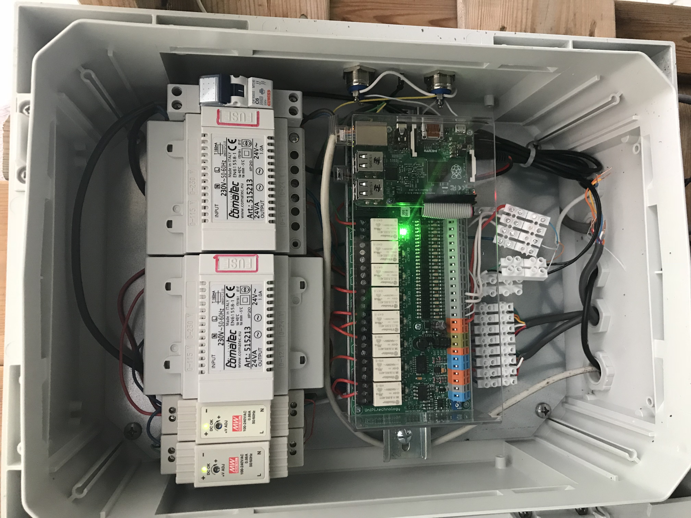
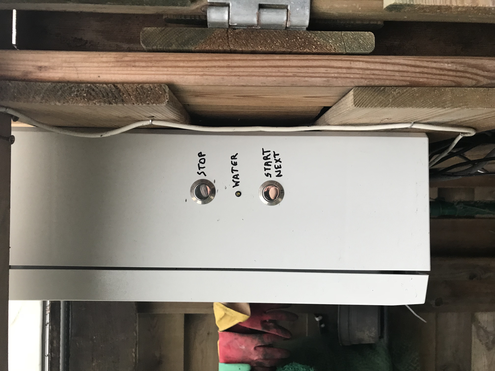
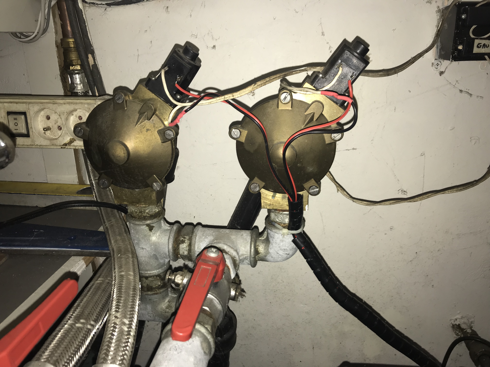
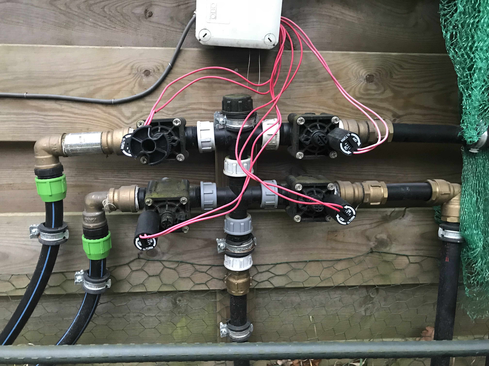
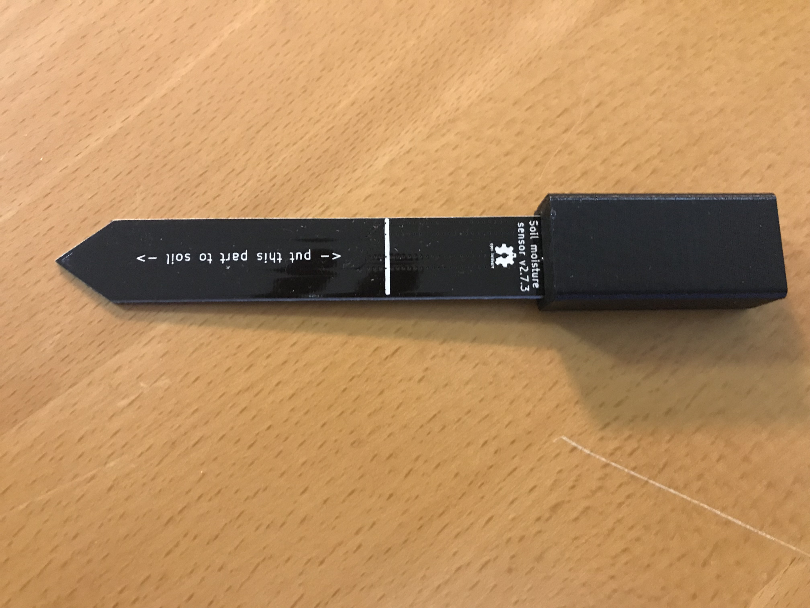

<!--s_name-->
# Irrigation_system

<!--e_name-->

<!--s_role-->
<!--e_role-->

<!--s_descr-->
Interface to the garden irrigation pump(s), activation/deactivation buttons and the watering valves

<!--e_descr-->

## Summary

<!--s_sub_toc_irr-->

Irrigation for a vegetable garden or for other leisure plants is for some people an important aspect of their well being at home.

Many automatic irrigation systems exists, but they lack the comfort or unified usability such as here on offer.
In my experience, these irrigation controllers are cumbersome to use, and typically fail to water just enough what is needed, either not enough or too much.
Also in more complete setups you want to protect against hardware issues, such as pumps not stopping or broken pipes.

How does this app differs from other irrigation systems?

Firstly you can use your google calendar to set when you want that the irrigation process is triggered, alternatively you can determine to run at a fixed time.

Secondly, the time of watering at an irrigation point is determined with lots of brains and considerations, rather than a time that you need to change manually yourself.

Further there is frost protection built in, not only for your valves but also for your pump (if you use one).

Then of course you can trigger the irrigation with buttons, virtuals, using a feed through one of the feeder channels.
Or skip the next irrigation point or just cancel all together a started irrigation.

You can define when are the winter months where you don't want irrigation.

Because irrigation can be supported easily by Artificial Intelligence, you could potentially add plant information, rain captured volume (in a silo), time of the year, and then determine when to water, how much.

So this is just the first version, but we are convinced that we will outsmart any competitors version easily.

<!--e_sub_toc_irr-->


## Watering Duration?

The irrigation base time for each irrigation point is read from site.conf and is multiplied with a temperature adjustment factor:

| Multiplication Factor | When |
| --- | --- |
| 0 | when the low temperature is below 5 degrees, no irrigation below this temperatures |
| 0 | when the high temperature is below 10 degrees, no irrigation below this temperatures |
| 2 | when the high temperature is > 20 degrees | the irrigation time doubles as the water dissipation is medium
| 3 | when the high temperature is > 30 degrees | the irrigation time triples as the water dissipation is high

So this is then resulting in the desired irrigation time per point.

But then we need to consider the rain that has occurred in previous days and in the current day.

The program keeps memory of the decayed rain carry over from previous days and adds the rain duration of the present day into one total.

Therefore this rain duration, considered as watering before the irrigation is triggered, is therefore set against the temperature adjusted irrigation time desired to assess if irrigation is necessary and then for how long.

Then for each irrigation channel, the temperature adjusted duration is reduced with the rain time (or volume) measured before irrigation was triggered.

Should rain duration be higher, then no irrigation happens, and the remaining rain duration is decayed.
 
Decay of remaining rain_duration for carry over purposes is adjusted based on the forecast temperature as this is an indication of the speed of evaporation of the rain:

* halved by temperatures below 20 degrees
* reduces to 33% if the high forecast temperature is above 20 degrees
* reduced to 25% if the high forecast temperature is above 30 degrees

So if it would have rained for half an hour and the temperature is 15 degrees, then this counts as 15 minutes rain for tomorrow.

if the rain_duration decay result is less than the base irrigation time then it is zeroed to clear all smallish decay tails.

When there is no irrigation trigger (f.i. in the winter), the rain decay calculation runs at midnight.

Should the soil sensor signal dryness then irrigation nevertheless happens irrespectively of rain duration.

This evaluation leading to the irrigation time for each irrigation point is clearly presented in a report that is emailed.
When the last irrigation point is serviced, the actual watering time per point is emailed in an overview. 

## Winter protection

Winter mode is automatically enabled when the date is in the winter_months range OR when the low temperature is below "irr_fcst_min_dg" centigrades:

* H2O is cut off and remains cutoff
* when irrigation is triggered, all valves are opened for a determinate time to allow the pump vessel to bleed empty and to remove the pressure on the tubes.  
* The H2O pump is on for a short time to avoid pump rust when not used for a long period

Obviously there are many notifications possible and you find the list below (nty_all) and in the example below there are a few used.

Some app_obj.conf parameters are used for winter protection:

```
time_irr_act_run= 10    # time in seconds the H2O pump runs every day in winter not to rust, an activation run
time_irr_depressure=180 # time in seconds all irr channels are bleeding in the winter every day to remove pressure on the tubes not to break when freezing
```

<!--s_tbl-->
## List of [properties](Properties.md) for __Irrigation_system__:

  | Property | Validation | Optional? | Repeat? | Description |
  | --- | --- | --- | --- | --- |
  | dry_days_max | int | False | - | max number of days without rain to have irrigation (zaps remaining rain decay).  It is very difficult to estimate rain infiltration and having a cut off helps.. | 
  | fav | str | True | - | is this a favorite element | 
  | icon | str | True | - | icon file for this element | 
  | irr_act_button | Button | True | - | the button to press to activate the irrigation, overriding winter shutdown conditions.  A long press (> 2 secs) cancels the irrigation, a short press stops watering the active point, and moves to the next watering point.  | 
  | irr_all_out_dg | int | False | - | if outside temp goes below this value, the pump is shutdown and all valves opened | 
  | irr_daily_at | str | True | - | daily irrigation trigger time, clock is checked every minute - do not change formatting 'hh:mm' in 24 hour format, also alternatively google calendar can be used to irrigation trigger start | 
  | irr_deact_button | Button | True | - | the button to press to cancel irrigation | 
  | irr_fcst_min_dg | int | False | - | day low temp forecast, below this value, no irrigation | 
  | irr_flow_meter | Flow_meter | True | - | a irrigation water flow meter, measuring water consumption with a hall effect sensor | 
  | irr_flow_sensor | Input | True | - | a irrigation water flow sensor, a feedback to working or faulty irrigation because the script can check when water should or should not flow.  The check happens at the first watering point | 
  | irr_time_base | int | False | - | time in minutes, the basis irrigation time used for rain decay adjustment, do not change | 
  | irr_water_supply | Output | True | True | the output(s) to switch the pump | 
  | irr_water_valve | Output | True | True | the output(s) to the main water valve(s) | 
  | notifications | ['irr_cancelled', 'irr_completed', 'irr_depressurised', 'irr_flow_nok', 'irr_freezing', 'irr_ignored', 'irr_new_time', 'irr_rain_decay', 'irr_rain_forecast', 'irr_soil_wet', 'irr_started', 'irr_too_cold', 'irr_too_wet', 'irr_winter_mode'] | True | - | extensive list of notifications, see [__Notifier__](Notifier.md) | 
  | winter_months | int_list | False | - | number of the month list with default winter mode | 

## List of [Notifications](Notifier.md) for  __Irrigation_system__:

  | Notification Suffix | When invoked? |
  | --- | --- | 
  | irr_cancelled |  | 
  | irr_completed |  | 
  | irr_depressurised |  | 
  | irr_flow_nok |  | 
  | irr_freezing |  | 
  | irr_ignored |  | 
  | irr_new_time |  | 
  | irr_rain_decay | merges rain duration plus previous rain decay and highest temperature today into a new, equivalent, rain duration | 
  | irr_rain_forecast |  | 
  | irr_soil_wet |  | 
  | irr_started |  | 
  | irr_too_cold |  | 
  | irr_too_wet |  | 
  | irr_winter_mode |  | 
<!--e_tbl-->

<!--s_name_irr-->
# Irrigation_points

<!--e_name_irr-->

<!--s_descr_irr-->
Irrigation point for water delivery to plants, with the normalized duration irrigation time in minutes

<!--e_descr_irr-->

## List of [properties](Properties.md) for __irrigation_point__:

irrigation_point is a dictionary (you can name them yourself) or a list (automatic named) of irrigation point objects irr.

These can be defined with the following parameters: pin, time_run=0, active_1=1

The time_run is the default watering time in minutes and will be adjusted as described above by the rain and temperature high settings.

## Example configuration

In the example below you can notice that 4 irrigation points are driven by the things_controller PI-Garden, 2 are driven by PI-Pump (as these are closeby the pump).

Some buttons drive the irrigation process, other buttons drive the water pump.

In this example, the irr_daily_at is commented out, this is because the irrigation starts by a calendar trigger when \@ALEXA\@=Irr is inserted in a repetitive calendar event.

You also notice that the water pump is deactivated when the house is armed (there is no need to keep the pump under power), but when the irrigation starts, the pump gets activated anyway.
The flag have_water also switches on a (led) light to visually show that the pump is activated and there should be water pressure.

<!--s_insert_{"tree":["(o:Irrigation_manager)","(o:Irrigation_system)","(dk:garden).*(o:Irrigation_points)"]}-->

from project.py tree:['(o:Irrigation_manager)', '(o:Irrigation_system)', '(dk:garden).*(o:Irrigation_points)']
```python3
# --> project.py :<dk:project,o:Project,kw:apps,lp:12,o:Irrigation_manager>

from lucy_app import *

Irrigation_manager()

# --> project.py :<dk:project,o:Project,kw:property,o:House,kw:places,dk:garden,o:Place,kw:contents,lp:8,o:Irrigation_system>

from lucy_app import *

Irrigation_system(
    dry_days_max = 3,
    irr_act_button = Button(path = "unipi:PI-Garden,input,1"),
    irr_all_out_dg = 6,
    irr_fcst_min_dg = 5,
    irr_flow_meter = Flow_meter(path = "unipi:PI-Water,input,4",q_per_rev = 1.0),
    irr_flow_sensor = Input(path = "unipi:PI-Garden,input,4"),
    irr_time_base = 8,
    irr_water_supply = Output(
            copy_things = {
                    "carbon_copy":Light(path = "unipi:PI-Garden,relay,8")},
            effect_virtuals = {
                    "is_armed":Virtual(
                            play = Effect(maker='self', condition='become_active', effect='make_inactive', taker='parent', delay=None, duration=None))},
            method_things = {
                    "activate_button":Button(active = 0,path = "unipi:PI-Garden,input,8"),
                    "toggle_button":[Button(path = "unipi:PI-Water,input,1"),Button(path = "unipi:PI-Garden,input,2")]},
            path = "unipi:PI-Water,relay,3",
            value_logic = {"disable":['C_outdoor_wc<5', '°C_irr_pump>50'],"disable_delay":{"after":3600}}),
    notifications = {
            "irr_cancelled":[
                Mail(subject='Irrigation canceled! {app_txt}', to=None, cams=None, cam_groups=None, passes=0, body_file='', files2mail=None, ceiling=None),
                Say(txt='{tts_start} irrigation in the garden is interrupted and is not completed{tts_end}', ceiling=None, times=1, override=None, volume=None)],
            "irr_completed":[
                Mail(subject='Irrigation Completed', to='{prime}', cams=None, cam_groups=None, passes=0, body_file='irr_ok', files2mail=None, ceiling=None),
                Say(txt='{tts_start} irrigation in the garden is now completed{tts_end}', ceiling=None, times=1, override=None, volume=None),
                Cal(txt='Irrigation Completed', summary='', ceiling=None)],
            "irr_depressurised":Mail(subject='{app_txt} Irrigation Depressurised!', to=None, cams=None, cam_groups=None, passes=0, body_file='', files2mail=None, ceiling=None),
            "irr_flow_nok":Mail(subject='!Irrigation Flow Sensor, no water detected!', to='{prime}', cams=None, cam_groups=None, passes=0, body_file='', files2mail=None, ceiling=None),
            "irr_freezing":Say(txt='{tts_start} Irrigation protection against freezing is enabled{tts_end}', ceiling=None, times=1, override=None, volume=None),
            "irr_ignored":[
                Mail(subject='Irrigation ignored! {app_txt}', to=None, cams=None, cam_groups=None, passes=0, body_file='irr_time', files2mail=None, ceiling=None),
                Cal(txt='Irrigation ignored! {app_txt}', summary='', ceiling=None)],
            "irr_new_time":Mail(subject='Irrigation starts adjusted{app_txt} mins', to='{prime}', cams=None, cam_groups=None, passes=0, body_file='irr_time', files2mail=None, ceiling=None),
            "irr_rain_decay":Mail(subject='Irr Rain Carry Over, Decayed = {app_txt} rain', to='{prime}', cams=None, cam_groups=None, passes=0, body_file='irr_decay', files2mail=None, ceiling=None),
            "irr_rain_forecast":Say(txt='{tts_start} irrigation in the garden is postponed, it will rain tomorrow{tts_end}', ceiling=None, times=1, override=None, volume=None),
            "irr_soil_wet":Say(txt='{tts_start} irrigation in the garden is postponed, the soil is too wet{tts_end}', ceiling=None, times=1, override=None, volume=None),
            "irr_started":[
                Mail(subject='Irrigation started! {app_txt}', to=None, cams=None, cam_groups=None, passes=0, body_file='', files2mail=None, ceiling=None),
                Say(txt='{tts_start} irrigation in the garden is now started{tts_end}', ceiling=None, times=1, override=None, volume=None),
                Cal(txt='Irrigation Start, {app_txt} minutes', summary='', ceiling=None)],
            "irr_too_cold":Say(txt='{tts_start} irrigation in the garden is postponed, it is too cold outside{tts_end}', ceiling=None, times=1, override=None, volume=None),
            "irr_too_wet":Say(txt='{tts_start} irrigation in the garden is postponed, it is too wet already{tts_end}', ceiling=None, times=1, override=None, volume=None),
            "irr_winter_mode":[
                Mail(subject='{app_txt} Irrigation in Winter Mode!', to=None, cams=None, cam_groups=None, passes=0, body_file='', files2mail=None, ceiling=None),
                Say(txt='{tts_start} no irrigation in the winter months, we just going to routinely activate the pump and valves{tts_end}', ceiling=None, times=1, override=None, volume=None)]},
    role_me = "PI-Garden",
    winter_months = [11,12,1,2,3])

# --> project.py :<dk:project,o:Project,kw:property,o:House,kw:places,dk:garden,o:Place,kw:contents,lp:7,o:Irrigation_points>

from lucy_app import *

Irrigation_points(
    items = {
            "irr1_for_veg_front":Irr(path = "unipi:PI-Garden,relay,4",time_run = 12,usage = {"Qty":6,"Unit":"L/min","type":"Water"}),
            "irr2_for_veg_a_front":Irr(path = "unipi:PI-Garden,relay,3",time_run = 6,usage = {"Qty":6,"Unit":"L/min","type":"Water"}),
            "irr3_for_veg_b_back":Irr(path = "unipi:PI-Garden,relay,2",time_run = 6,usage = {"Qty":6,"Unit":"L/min","type":"Water"}),
            "irr4_for_veg_back":Irr(path = "unipi:PI-Garden,relay,1",time_run = 6,usage = {"Qty":6,"Unit":"L/min","type":"Water"}),
            "irr5_for_roses":Irr(path = "unipi:PI-Water,relay,2",time_run = 6,usage = {"Qty":8,"Unit":"L/min","type":"Water"}),
            "irr6_for_flowers":Irr(path = "unipi:PI-Water,relay,1",time_run = 6,usage = {"Qty":8,"Unit":"L/min","type":"Water"})})

```

<!--e_insert-->

* Google Calendar triggers

The following Google calendar events can be created :
	__\@ALEXA\@=__Irrigation : start irrigation, but also aborts irrigation when the time of the event terminates
	__\@ALEXA\@=__IrrAbort : cancel irrigation
	__\@ALEXA\@=__IrrNow : only triggers the irrigation commencement 
	__\@ALEXA\@=__Irrigation Report : run the irrigation report event (including notifications)

Just ensure the event duration is more than 6  minutes as this is the calendar default sample time.
 
* Example raspberry based irrigation points with unipi hardware: 

 

* Buttons for controlling the irrigation at the side of the above case.



* A watering valve set

 

* Another watering valve set

  

* A rain sensor

This rain sensor is available from https://www.kemo-electronic.de/en/House/Garden/M152-Rain-Sensor-12-V-DC.php


* A soil sensor


This soil humidity sensor is available from https://www.tindie.com/products/miceuz/i2c-soil-moisture-sensor



* * * 
* * * 
# Irrigation Time Calculation Example

* * * 
* * * 

<!--s_insert_{"role":"irr","suffix":"irr_time"}-->


[PI-Garden_irr_time.html](PI-Garden_irr_time.html)

<!DOCTYPE html><html><body><h1>Irrigation Time Calculator -> PI-Garden_irr_time.html  2020/08/16 17:46:30</h1><table><tr><td style='background-color:cyan;text-align:center' colspan='3'>Inputs</td></tr><tr><td>Irrigation Time Basis</td><th style='text-align:center'>00:08:00</th><td>HH:MM:SS</td></tr><tr><td>irr1_for_veg_front</td><td style='text-align:center'>00:12:00</td><td>HH:MM:SS</td></tr><tr><td>irr2_for_veg_a_front</td><td style='text-align:center'>00:06:00</td><td>HH:MM:SS</td></tr><tr><td>irr3_for_veg_b_back</td><td style='text-align:center'>00:06:00</td><td>HH:MM:SS</td></tr><tr><td>irr4_for_veg_back</td><td style='text-align:center'>00:06:00</td><td>HH:MM:SS</td></tr><tr><td>irr5_for_roses</td><td style='text-align:center'>00:06:00</td><td>HH:MM:SS</td></tr><tr><td>irr6_for_flowers</td><td style='text-align:center'>00:06:00</td><td>HH:MM:SS</td></tr><tr><td>High Temp Forecast</td><td style='text-align:center'>+29.00</td><td> &deg;C</td></tr><tr><td>Low  Temp Forecast</td><td style='text-align:center'>+18.00</td><td> &deg;C</td></tr><tr><td>Rain Forecast</td><td style='text-align:center'>0.3642</td><td> mm/day</td></tr><tr><td>Rain Time Today</td><td style='text-align:center'>00:02:05</td><td>HH:MM:SS</td></tr><tr><td>Rain Quantity Today</td><td style='text-align:center'>0.28</td><td>mm/m2</td></tr><tr><td>Prior Dry Days</td><td style='text-align:center'>0</td><td>Count</td></tr><tr><td>Rain Decay Previous Days</td><td style='text-align:center'>00:00:00</td><td>HH:MM:SS</td></tr><tr><td>Previous Irrigation Time</td><td style='text-align:center'>00:14:00</td><td>HH:MM:SS</td></tr><tr><td>Soil Dry Sensor Count</td><td style='text-align:center'>0</td><td>Times</td></tr><tr><td style='background-color:cyan;text-align:center' colspan='3'>Evaluation</td></tr><tr><td>1-&gt; Low &deg;C</td><td style='text-align:center'>No Effect</td><td>-</td></tr><tr><td>2-&gt; High &deg;C : Multiplier</td><td style='text-align:center'>2</td><td>Times</td></tr><tr><td>3-&gt; New Base Duration</td><td style='text-align:center'>00:16:00</td><td>HH:MM:SS</td></tr><tr><td>4-&gt; Soil Dry Sensor Count</td><td style='text-align:center'>No Overruling</td><td>-</td></tr><tr><td>5-&gt; Rain (including decayed)</td><td style='text-align:center'>00:02:00</td><td>HH:MM:SS</td></tr><tr><td>6-&gt; Rained vs Needed</td><td style='text-align:center'>got 2 mins, needed 8 mins</td><td>Minutes Rain/Irrigation</td></tr><tr><td>7-&gt; Rain Today + Decay</td><td style='text-align:center'>LESS</td><td>Than Basis Duration</td></tr><tr><td>7-&gt; Irrigation Need</td><td style='text-align:center'>00:14:00</td><td>HH:MM:SS</td></tr><tr><td>8-&gt; Rain Forecast</td><td style='text-align:center'>Tomorrow 0.3642 mm</td><td>Irrigation Needed</td></tr><tr><td style='background-color:cyan;text-align:center' colspan='3'>Results</td></tr><tr><td>--&gt; Irrigation Base Duration</td><th style='text-align:center'>00:14:00</th><td>HH:MM:SS</td></tr><tr><td>--&gt; irr1_for_veg_front</td><td style='text-align:center'>00:22:00</td><td>HH:MM:SS</td></tr><tr><td>--&gt; irr2_for_veg_a_front</td><td style='text-align:center'>00:10:00</td><td>HH:MM:SS</td></tr><tr><td>--&gt; irr3_for_veg_b_back</td><td style='text-align:center'>00:10:00</td><td>HH:MM:SS</td></tr><tr><td>--&gt; irr4_for_veg_back</td><td style='text-align:center'>00:10:00</td><td>HH:MM:SS</td></tr><tr><td>--&gt; irr5_for_roses</td><td style='text-align:center'>00:10:00</td><td>HH:MM:SS</td></tr><tr><td>--&gt; irr6_for_flowers</td><td style='text-align:center'>00:10:00</td><td>HH:MM:SS</td></tr></table></body></html>
<!--e_insert-->

* * * 
* * * 
# Irrigation Rain Decay Calculation Example

* * * 
* * * 

<!--s_insert_{"role":"irr","suffix":"irr_decay"}-->


[PI-Garden_irr_decay.html](PI-Garden_irr_decay.html)

<!DOCTYPE html><html><body><h1>Irrigation Rain Decay -> PI-Garden_irr_decay.html  2020/08/16 17:38:09</h1><table><tr><td style='background-color:cyan;text-align:center' colspan='3'>Inputs</td></tr><tr><td>Irrigation Time Basis</td><th style='text-align:center'>00:08:00</th><td>HH:MM:SS</td></tr><tr><td>High Temp Forecast</td><td style='text-align:center'>+29.00</td><td> &deg;C</td></tr><tr><td>Low  Temp Forecast</td><td style='text-align:center'>+18.00</td><td> &deg;C</td></tr><tr><td>Rain Forecast</td><td style='text-align:center'>0.3955</td><td> mm/day</td></tr><tr><td>Rain Time</td><td style='text-align:center'>00:03:12</td><td>HH:MM:SS</td></tr><tr><td>Rain Quantity</td><td style='text-align:center'>0.28</td><td>mm/m2</td></tr><tr><td>Prior Dry Days</td><td style='text-align:center'>0</td><td>Count</td></tr><tr><td>Rain Decay</td><td style='text-align:center'>00:00:00</td><td>HH:MM:SS</td></tr><tr><td style='background-color:cyan;text-align:center' colspan='3'>Evaluation</td></tr><tr><td>1-&gt; High &deg;C : Multiplier</td><td style='text-align:center'>2</td><td>Times</td></tr><tr><td>2-&gt; Rain Decay</td><td style='text-align:center'>not changed by</td><td>dry days 0&lt;3</td></tr><tr><td>3-&gt; Rain Decay + Rain Time</td><td style='text-align:center'>00:03:00</td><td>HH:MM:SS</td></tr><tr><td>4-&gt; Rain Decay Factor</td><td style='text-align:center'>2</td><td>Factor</td></tr><tr><td style='background-color:cyan;text-align:center' colspan='3'>Results</td></tr><tr><td>--&gt; Rain Carry Over, New Rain Decay</td><td style='text-align:center'>00:00:00</td><td>HH:MM:SS</td></tr></table></body></html>
<!--e_insert-->

* * * 
* * *

* * * 
* * * 
# Irrigation Completion Report Example

* * * 
* * * 

<!--s_insert_{"role":"irr","suffix":"irr_ok"}-->


[PI-Garden_irr_ok.html](PI-Garden_irr_ok.html)
<html><body><p><h1>Irrigation Report - 2018-07-01 19:02:58</h1><table id="selfgen"><thead><tr><th  align="left">Location</th><th  align="left">Name</th><th  align="left">Start Time</th><th  align="left">End Time</th><th  align="left">Run Time</th></tr></thead><tbody><tr><td  align="left">garden</td><td  align="left">irr1_for_veg_front</td><td  align="left">17:00:27</td><td  align="left">17:19:18</td><td  align="left">00:18:50</td></tr><tr><td  align="left">garden</td><td  align="left">irr2_for_veg_a_front</td><td  align="left">17:19:18</td><td  align="left">17:50:42</td><td  align="left">00:31:23</td></tr><tr><td  align="left">garden</td><td  align="left">irr3_for_veg_b_back</td><td  align="left">17:50:42</td><td  align="left">18:22:05</td><td  align="left">00:31:22</td></tr><tr><td  align="left">garden</td><td  align="left">irr4_for_veg_back</td><td  align="left">18:22:06</td><td  align="left">18:25:15</td><td  align="left">00:03:08</td></tr><tr><td  align="left">garden</td><td  align="left">irr5_for_roses</td><td  align="left">18:25:15</td><td  align="left">18:44:05</td><td  align="left">00:18:50</td></tr><tr><td  align="left">garden</td><td  align="left">irr6_for_flowers</td><td  align="left">18:44:06</td><td  align="left">19:02:58</td><td  align="left">00:18:52</td></tr><tr><td  colspan="5",  align="center">Total Run Time 02:02:30</td></tr></tbody></table>
<!--e_insert-->

* * * 
* * *


