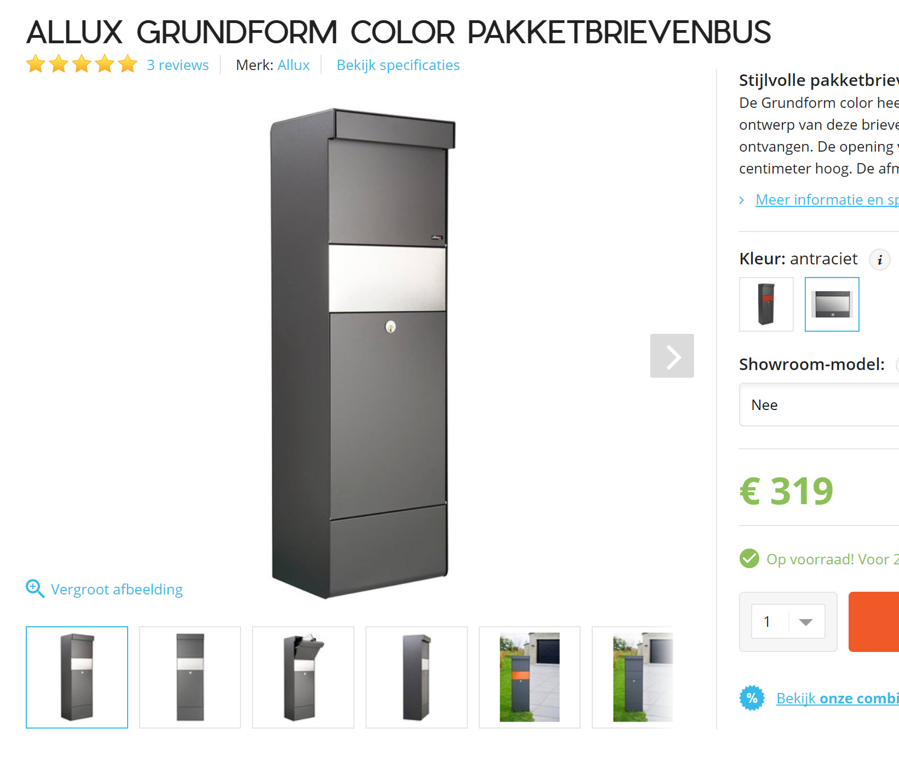

<!--s_name-->
# Mailbox_alert

<!--e_name-->

<!--s_role-->
<!--e_role-->

<!--s_descr-->
To notify incoming and outgoing regular post mail through a magnetic or optical switch in the mailbox

<!--e_descr-->

<!--s_tbl-->
## List of [properties](Properties.md) for __Mailbox_alert__:

  | Property | Validation | Optional? | Repeat? | Description |
  | --- | --- | --- | --- | --- |
  | fav | str | True | - | is this a favorite element | 
  | icon | str | True | - | icon file for this element | 
  | mail_in | Input | False | - | the input to register incoming post mail | 
  | mail_out | Input | True | - | the input to register post mail that is being removed | 
<!--e_tbl-->

## Example mailbox_alert

Below a post box is defined for a packet mailbox with one entrance and one take out (key protected) drawer.
Observe the notifications, but also the creation of a flag __have_mail__ that is used somewhere else to trigger a light, a visible indicator that new mail arrived when you enter with the car. 

<!--s_insert_{"tree":"(o:Mailbox_alert)"}-->

from project.py tree:(o:Mailbox_alert)
```python3
# --> project.py :<dk:project,o:Project,kw:property,o:House,kw:places,dk:street,o:Place,kw:contents,lp:5,o:Mailbox_alert>

from lucy_app import *

Mailbox_alert(mail_in = Input(
            effect_virtuals = {
                    "have_mail":Virtual(
                            play = Effect(maker='parent', condition='become_active', effect='make_active', taker='self', delay=None, duration=None))},
            notifications = {
                    "active":[
                        Mail(subject='{thing+is}', to='{prime}', cams=None, cam_groups=['cams_gate'], passes=2, body_file='', files2mail=None, ceiling=None),
                        Say(txt='{tts_start} new post arrived by mail{tts_end}', ceiling=None, times=1, override=None, volume=None),
                        Cal(txt='Post delivered in the mailbox', summary='', ceiling=None)]},
            path = "unipi:PI-Garden,input,6"),mail_out = Input(
            effect_virtuals = {
                    "have_mail":Virtual(
                            play = Effect(maker='parent', condition='become_inactive', effect='make_inactive', taker='self', delay=None, duration=None))},
            notifications = {
                    "active":Mail(subject='{thing+is}', to=None, cams=None, cam_groups=['cams_gate'], passes=1, body_file='', files2mail=None, ceiling=None)},
            path = "unipi:PI-Garden,input,7"),role_me = "PI-Garden")

```

<!--e_insert-->

The emails that are generated contain pictures from the camera's so that forensically logging of who brings mail and take out mail is registered.

In the house a nice voice message echo's that new post arrived by mail, beautiful!

## Mailbox Picture

A nice packet mailbox from 'Allux Grundform color pakketbrievenbus' can be easily equipped with 2 magnetic sensors.



