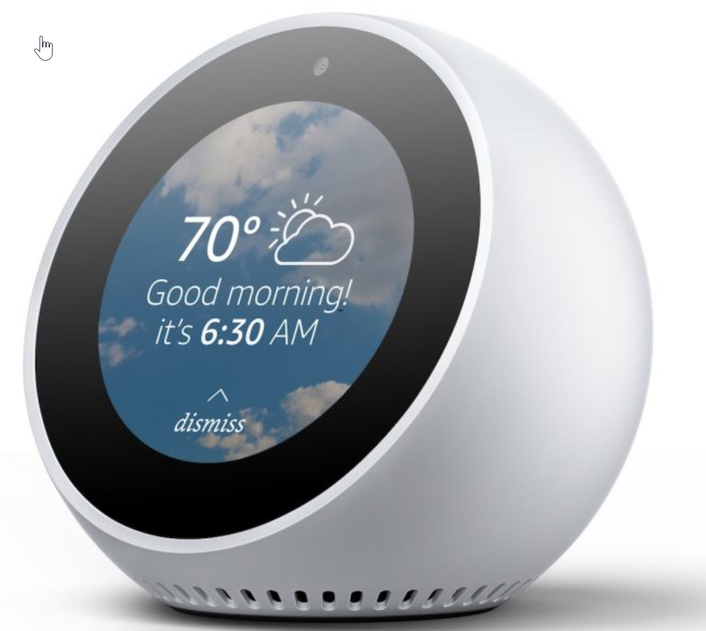
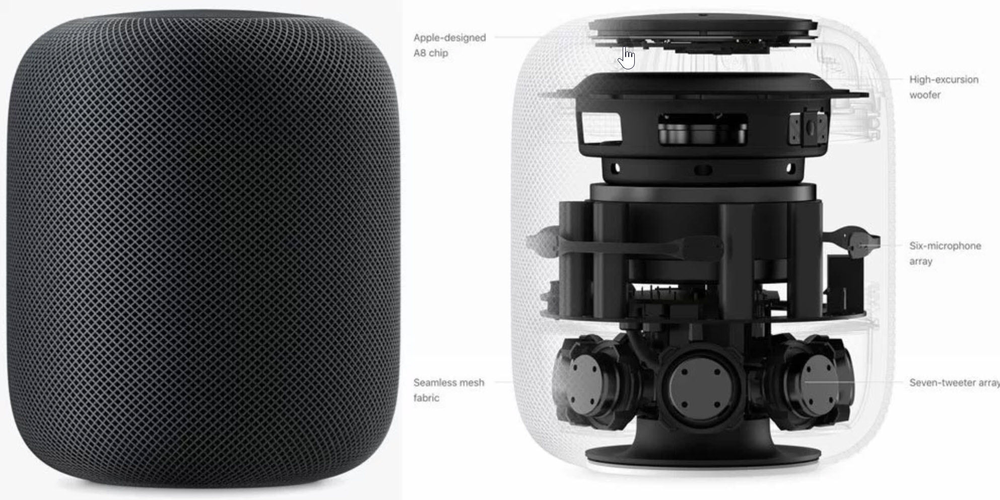

<!--s_name-->
# My_assistant

<!--e_name-->

<!--s_role-->
<!--e_role-->

<!--s_descr-->
Advanced voice control with Amazon's Alexa, ok_Google, Siri Notes and for instructions from calendar and mail and for the Apps that are enabled to receive voice instructions

<!--e_descr-->

## Summary

<!--s_sub_toc_my_a-->

Voice assistants such as Amazon Alexa, ok Google or Siri are wildly popular in the english spoken world, although german, french and japanese versions of amazon echo are being released.
Nobody doubts that voice assistants have a bright future ahead of them, certainly when equipped with smart AI, resulting in a near human experience.
And the future will certainly bring new ways of interacting with virtual assistants when hologram processing is perfected.

It is our believe that Lucy can become the smart home assistant earning a place in that world, integrating but not competing with the broader assistants that exist already.

my_assistant is a first version of such an integration and to achieve this, we have borrowed from the first philips hue bridge that was compatible with amazon echo.

The way this works is that Lucy becomes a multiple hue emulated bridge, one for climate commands, one for lights, and one for general commands.

The way it works is that you say to Amazon Alexa : please discover devices, and then suddenly all your rooms, lights and climate wishes becomes voice enable commands.

Then you can say, Alexa : please turn on the bedlight, please turn on the guest room,...

For ok_Google, it works a little different, but with the same result.
ok_google commands are intercepted by IFTTT, and then brought to the security role things_controller who checks and then "calls" the right emulator and issues the command, all in the blink of an eye.
If you say, ok google, turn on the bedlight, then she'll answer : ok honey, i ll pass the command.

For voice control with Apple Siri, a trick is used where by the user asks Siri to make a note which is then processed as a voice command
Then you can say: "siri make note: turn on bedlight".  This new note is fetched within a second and then played out.

Ensure you have yr gmail account with IMAP enabled and notes active, and link this account with your Apple Siri notes.
The new notes will be fetched by the [Google_driver](Google_driver.md) and offered to My_assistant for processing.

There is however one catch.  For the Hue emulation to work flawlessly, one need to install a real Hue Bridge.  The cost cannot be a burden (i hope).
All the hue emulator things controller have to get a link with this bridge and this is done by pressing the link button on the real bridge ones that emulator things controller is started up.
Fortunately, this need to be done only once, and if you upgrade the software version of the real bridge, then the emulated bridges will automatically follow.

The upside is that you can use the very nice designed Hue App on your apple or android phone to link to these emulated bridges (due the linking within 5 minutes from booting the things_controller) and activate commands as you wish.

As a result, there is NO need for a Lucy mobile app, just use the Philips hue one.

Surely Philips do not object as you use one real bridge for all the emulated ones, and your hue lamps are obviously driven by the real one. 

A more solid integration with the voice assistants of these suppliers can be arranged, especially if this is what many users want.
They cannot block the voice thing to just what they support.

<!--e_sub_toc_my_a-->

With the my_assistant settings, you can determine which services you use, see __i_use__ below, and the emulator functions __may_do__ you want to control. 

Extensive reporting is generated to see all the available voice instructions, and all the commands received by your assistant.

It has been very pleasant to use voice control with Lucy's features of notification and control and it is a real comfort increaser.

## my_assistant via google calendar

Google Calendar is the ideal way of defining a time event that triggers an assistant instruction.
See [Google_driver](Google_driver.md) for more details and instructions.

<!--s_tbl-->
## List of [properties](Properties.md) for __My_assistant__:

  | Property | Validation | Optional? | Repeat? | Description |
  | --- | --- | --- | --- | --- |
  | bridge_prefix | str | False | - | the emulated bridge name will appear in the iphone hue app with this prefix and its role | 
  | fav | str | True | - | is this a favorite element | 
  | i_use | valid_set | False | - | is the list of the voice assistants suppliers you use and the instructions to your butler in google calendar or via email (= To Be Done) | 
  | icon | str | True | - | icon file for this element | 
  | link_button | Virtual | False | - | when this virtual is up, then adding users (just like a real hue bridge) is allowed | 
  | may_do | valid_set | False | - | is the list of the functional apps that your butler may serve | 
  | notifications | ['hue_emul', 'hue_emul_log', 'voice_bad'] | True | - | extensive list of notifications, see [__Notifier__](Notifier.md) | 
  | port | int | False | - | should be an unique port number not in use elsewhere, and as Hue bridges have themselves port 80 as default, Amazon Echo will detect them only if at 80 | 
  | siri_notes | bool | True | - | use apple siri as voice control input, by creating a note in gmail that is the voice command | 
  | siri_users | data_list | True | - | tuples of email address and password so to access the 'notes' section for commands, by default the main email, paswd is automatically included | 

## List of [Notifications](Notifier.md) for  __My_assistant__:

  | Notification Suffix | When invoked? |
  | --- | --- | 
  | hue_emul |  | 
  | hue_emul_log |  | 
  | voice_bad |  | 

## List of [Errors/Warnings](Error_Warn.md) for  __My_assistant__:

  | Error/Warning ID | Error/Warning MSG | Occurring When? |
  | --- | --- | --- | 
  | err_alexa_crashed | !!HUE_EMUL via {:}/{:}/{:}/{:} Crashed |  
  | err_alexa_what | !!Hue item misses 'what' or 'what_on' in {:} |  
  | err_ask_sd | !!Amazon SkillsHandler Skills Dispatch Failed: <{:}> <{:}> <{:}> |  
  | err_ask_vfy | !!Amazon SkillsHandler Request Verification Failed: <{:}> <{:}> <{:}> |  
  | err_gas_json | !!Google Assistant JSON error: <{:}> <{:}> <{:}> |  
  | err_gas_kw | !!Google/Apple Siri keyword {:} for {:} not found in Hue |  
  | err_gas_ky | !!Google Assistant Secret Key error: <{:}> <{:}> |  
  | err_hue_rcv | !!{:} PUT {:} not in [on,off,bri]/state: {:} |  
  | err_hue_req | !!hue emul: Rcvd <{:}> this <{:}>,  returned error <{:}>, <{:}> / type <{:}> |  
  | err_upnp | !!UPNP Responder socket.error {!s} |  
  | msg_gas_kw | Google Assistant: {:} played to {:} <{:}> |  
  | msg_gas_req | Google Assistant: <{:}> <{:}> |  
  | msg_hue_all | HUE_EMUL: <{:}/{:}> requested all |  
  | msg_hue_bright | {:} via {:}/{:}/{:}/{:} -> ON + BRIGHT {:} |  
  | msg_hue_cfg | {:}-> Hue Config Request, usr <{:}> |  
  | msg_hue_index | {:}-> Hue index.html read |  
  | msg_hue_light_req | HUE_EMUL: <{:}> wanted <{:}/{:}> state, i returned <{:}/{:}> |  
  | msg_hue_light_set | HUE_EMUL: <{:}> ordered <{:}/{:}> to <{:}> |  
  | msg_hue_name | HUE_EMUL: <{:}> requested id, app:{:},device:{:}, i returned <{:}> |  
  | msg_hue_off | {:} via {:}/{:}/{:}/{:} -> OFF |  
  | msg_hue_on | {:} via {:}/{:}/{:}/{:} -> ON |  
  | msg_hue_rcv_get | {:} {:} {:} {:} |  
  | msg_no_hue | This pi is not Hue Bridge Emulator |  
  | msg_upnp_reply | UPNP: {:} -> {:} |  
  | msg_upnp_started | UPNP: Responder on {:}/{:}... |  
  | warn_hue_rcv | !HUE_EMUL {:} GET {:} but is not a known item |  
<!--e_tbl-->

## Example

my_assistant parameters are for the voice control by Amazon Echo, Google Home or Siri using Philips Hue emulation by things_controllers that cluster purpose specific commands.
For this to work well, one real hue bridge has to be defined in the system as the fake bridges use the real one to emulate almost perfect voice commands work f.i with Amazon Echo by saying : Alexa, turn... on/off
The generated list of commands based on the settings below will be emailed by the deploy things_controller at start up.

<!--s_insert_{"tree":"(o:My_assistant)"}-->

from project.py tree:(o:My_assistant)
```python3
# --> project.py :<dk:project,o:Project,kw:apps,lp:3,o:My_assistant>

from lucy import *

My_assistant(
    bridge_prefix = "House",
    i_use = ["amazon_alexa","ok_google","apple_siri","google_cal"],
    link_button = Virtual(duration = 300,effect_virtuals = {
                    "is_reboot":Virtual(
                            play = Effect(maker='self', condition='become_active', effect='make_active', taker='parent', delay=None, duration=None))}),
    may_do = ["everything"],
    notifications = {
            "hue_emul":Mail(subject='Hue Emulation', to='{prime}', cams=None, cam_groups=None, passes=0, body_file='echo', files2mail=['alexa_ask.json'], ceiling=None),
            "hue_emul_log":Mail(subject='Hue Emulation Logging - {app_txt} new items', to=None, cams=None, cam_groups=None, passes=0, body_file='hue_emul_log', files2mail=None, ceiling=None),
            "voice_bad":[
                Mail(subject='{app_txt}', to=None, cams=None, cam_groups=None, passes=0, body_file='', files2mail=None, ceiling=None),
                Say(txt='{tts_start} your request is sadly not understood {tts_end}', ceiling=None, times=1, override=None, volume=None)]},
    port = 80,
    role_me = "PI-Security",
    siri_notes = True)

```

<!--e_insert-->


# Available home_assistants







# Reporting

Below are presented the following reports : (as there are 3 possible emulators):

[1] overview of all commands and how to phrase them
[2] emulation logging of Climate Commands
[3] emulation logging of Light Commands
[4] emulation logging of General and Security Commands

* * * 
* * * 
## Emulation Commands Overview, emailed when things_controller boots

* * * 
* * * 

<!--s_insert_{"role":"m.clim","suffix":"echo"}-->


[PI-Climate_echo.html](PI-Climate_echo.html)

<!DOCTYPE html><html><body><h1>Hue Emulation by PI-Climate  2020/06/18 10:05:08</h1><h2>Examples</h2><table><thead><tr><th>id</th><th>Alexa CMD</th><th>does what?</th><th>special for off</th></tr></thead><tbody><tr><td>41730688122</td><td>Alexa/ok Google/Siri(make note), please turn on Comfort</td><td>enable/disable climatisation comfort</td><td>enable/disable climatisation comfort</td></tr><tr><td>42141571223</td><td>Alexa/ok Google/Siri(make note), please turn on Economy</td><td>enable/disable climatisation economy</td><td>enable/disable climatisation economy</td></tr><tr><td>43758947371</td><td>Alexa/ok Google/Siri(make note), please turn on Climate Report</td><td>run and email the climatisation report</td><td>-</td></tr><tr><td>44036657365</td><td>Alexa/ok Google/Siri(make note), please turn on Air Removal</td><td>enable/disable air removal from the radiators</td><td>enable/disable air removal from the radiators</td></tr><tr><td>50228307427</td><td>Alexa/ok Google/Siri(make note), please turn on dining room comfort</td><td>enable/disable comfort climatisation for the room</td><td>enable/disable comfort climatisation for the room</td></tr><tr><td>50353783054</td><td>Alexa/ok Google/Siri(make note), please turn on dining room economy</td><td>enable/disable economy climatisation for the room</td><td>enable/disable economy climatisation for the room</td></tr><tr><td>50564515411</td><td>Alexa/ok Google/Siri(make note), please turn on living room economy</td><td>enable/disable economy climatisation for the room</td><td>enable/disable economy climatisation for the room</td></tr><tr><td>50765449513</td><td>Alexa/ok Google/Siri(make note), please turn on daughter room comfort</td><td>enable/disable comfort climatisation for the room</td><td>enable/disable comfort climatisation for the room</td></tr><tr><td>50890382788</td><td>Alexa/ok Google/Siri(make note), please turn on daughter room economy</td><td>enable/disable economy climatisation for the room</td><td>enable/disable economy climatisation for the room</td></tr><tr><td>50958934718</td><td>Alexa/ok Google/Siri(make note), please turn on living room comfort</td><td>enable/disable comfort climatisation for the room</td><td>enable/disable comfort climatisation for the room</td></tr><tr><td>51046942079</td><td>Alexa/ok Google/Siri(make note), please turn on office</td><td>enable/disable climatisation for the room</td><td>enable/disable climatisation for the room</td></tr><tr><td>51129595811</td><td>Alexa/ok Google/Siri(make note), please turn on rebeccas room economy</td><td>enable/disable economy climatisation for the room</td><td>enable/disable economy climatisation for the room</td></tr><tr><td>51227531911</td><td>Alexa/ok Google/Siri(make note), please turn on kings bedroom comfort</td><td>enable/disable comfort climatisation for the room</td><td>enable/disable comfort climatisation for the room</td></tr><tr><td>51234389908</td><td>Alexa/ok Google/Siri(make note), please turn on kitchen economy</td><td>enable/disable economy climatisation for the room</td><td>enable/disable economy climatisation for the room</td></tr><tr><td>51265221775</td><td>Alexa/ok Google/Siri(make note), please turn on guest room comfort</td><td>enable/disable comfort climatisation for the room</td><td>enable/disable comfort climatisation for the room</td></tr><tr><td>51322948872</td><td>Alexa/ok Google/Siri(make note), please turn on kings bathroom</td><td>enable/disable climatisation for the room</td><td>enable/disable climatisation for the room</td></tr><tr><td>51360967545</td><td>Alexa/ok Google/Siri(make note), please turn on kitchen comfort</td><td>enable/disable comfort climatisation for the room</td><td>enable/disable comfort climatisation for the room</td></tr><tr><td>51369922154</td><td>Alexa/ok Google/Siri(make note), please turn on kings bedroom economy</td><td>enable/disable economy climatisation for the room</td><td>enable/disable economy climatisation for the room</td></tr><tr><td>51407466594</td><td>Alexa/ok Google/Siri(make note), please turn on guest room economy</td><td>enable/disable economy climatisation for the room</td><td>enable/disable economy climatisation for the room</td></tr><tr><td>51540996942</td><td>Alexa/ok Google/Siri(make note), please turn on rebeccas room comfort</td><td>enable/disable comfort climatisation for the room</td><td>enable/disable comfort climatisation for the room</td></tr><tr><td>51664353212</td><td>Alexa/ok Google/Siri(make note), please turn on beauty room economy</td><td>enable/disable economy climatisation for the room</td><td>enable/disable economy climatisation for the room</td></tr><tr><td>51861756988</td><td>Alexa/ok Google/Siri(make note), please turn on veranda comfort</td><td>enable/disable comfort climatisation for the room</td><td>enable/disable comfort climatisation for the room</td></tr><tr><td>51987433681</td><td>Alexa/ok Google/Siri(make note), please turn on veranda economy</td><td>enable/disable economy climatisation for the room</td><td>enable/disable economy climatisation for the room</td></tr><tr><td>52075787089</td><td>Alexa/ok Google/Siri(make note), please turn on beauty room comfort</td><td>enable/disable comfort climatisation for the room</td><td>enable/disable comfort climatisation for the room</td></tr><tr><td>52414580346</td><td>Alexa/ok Google/Siri(make note), please turn on dining room</td><td>enable/disable climatisation for the room</td><td>enable/disable climatisation for the room</td></tr><tr><td>52761608715</td><td>Alexa/ok Google/Siri(make note), please turn on office economy</td><td>enable/disable economy climatisation for the room</td><td>enable/disable economy climatisation for the room</td></tr><tr><td>52951739056</td><td>Alexa/ok Google/Siri(make note), please turn on daughter room</td><td>enable/disable climatisation for the room</td><td>enable/disable climatisation for the room</td></tr><tr><td>53143109927</td><td>Alexa/ok Google/Siri(make note), please turn on living room</td><td>enable/disable climatisation for the room</td><td>enable/disable climatisation for the room</td></tr><tr><td>53155636966</td><td>Alexa/ok Google/Siri(make note), please turn on office comfort</td><td>enable/disable comfort climatisation for the room</td><td>enable/disable comfort climatisation for the room</td></tr><tr><td>53373916950</td><td>Alexa/ok Google/Siri(make note), please turn on guest room</td><td>enable/disable climatisation for the room</td><td>enable/disable climatisation for the room</td></tr><tr><td>53411707166</td><td>Alexa/ok Google/Siri(make note), please turn on kings bedroom</td><td>enable/disable climatisation for the room</td><td>enable/disable climatisation for the room</td></tr><tr><td>53433740945</td><td>Alexa/ok Google/Siri(make note), please turn on kings bathroom comfort</td><td>enable/disable comfort climatisation for the room</td><td>enable/disable comfort climatisation for the room</td></tr><tr><td>53547239648</td><td>Alexa/ok Google/Siri(make note), please turn on kitchen</td><td>enable/disable climatisation for the room</td><td>enable/disable climatisation for the room</td></tr><tr><td>53559343740</td><td>Alexa/ok Google/Siri(make note), please turn on kings bathroom economy</td><td>enable/disable economy climatisation for the room</td><td>enable/disable economy climatisation for the room</td></tr><tr><td>53651771607</td><td>Alexa/ok Google/Siri(make note), please turn on rebeccas room</td><td>enable/disable climatisation for the room</td><td>enable/disable climatisation for the room</td></tr><tr><td>53968338853</td><td>Alexa/ok Google/Siri(make note), please turn on veranda</td><td>enable/disable climatisation for the room</td><td>enable/disable climatisation for the room</td></tr><tr><td>54190756040</td><td>Alexa/ok Google/Siri(make note), please turn on beauty room</td><td>enable/disable climatisation for the room</td><td>enable/disable climatisation for the room</td></tr><tr><td>10385222809</td><td>Alexa/ok Google/Siri(make note), please turn on office candle</td><td>switch on/off light office candle in office</td><td>switch on/off light office candle in office</td></tr><tr><td>10596535917</td><td>Alexa/ok Google/Siri(make note), please turn on bed light</td><td>switch on/off light bed light in master_bed.rear</td><td>switch on/off light bed light in master_bed.rear</td></tr><tr><td>10875521274</td><td>Alexa/ok Google/Siri(make note), please turn on floor candle</td><td>switch on/off light floor candle in living_lounge</td><td>switch on/off light floor candle in living_lounge</td></tr><tr><td>10949033382</td><td>Alexa/ok Google/Siri(make note), please turn on closet RGB</td><td>switch on/off light closet RGB in master_bed.rear</td><td>switch on/off light closet RGB in master_bed.rear</td></tr><tr><td>11423131201</td><td>Alexa/ok Google/Siri(make note), please turn on bathroom wall light</td><td>switch on/off light bathroom wall light in master_bath</td><td>switch on/off light bathroom wall light in master_bath</td></tr><tr><td>11457212432</td><td>Alexa/ok Google/Siri(make note), please turn on office^main light</td><td>switch on/off light office^main light in office</td><td>switch on/off light office^main light in office</td></tr><tr><td>11471753871</td><td>Alexa/ok Google/Siri(make note), please turn on dressing wall light</td><td>switch on/off light dressing wall light in master_bed.rear</td><td>switch on/off light dressing wall light in master_bed.rear</td></tr><tr><td>11554059642</td><td>Alexa/ok Google/Siri(make note), please turn on garage light</td><td>switch on/off light garage light in garage</td><td>switch on/off light garage light in garage</td></tr><tr><td>11561230234</td><td>Alexa/ok Google/Siri(make note), please turn on dressing ventilation</td><td>switch on/off light dressing ventilation in master_bed.dress</td><td>switch on/off light dressing ventilation in master_bed.dress</td></tr><tr><td>11740352226</td><td>Alexa/ok Google/Siri(make note), please turn on stairs ledstrip</td><td>switch on/off light stairs ledstrip in hall.ground</td><td>switch on/off light stairs ledstrip in hall.ground</td></tr><tr><td>12117513296</td><td>Alexa/ok Google/Siri(make note), please turn on veranda main light</td><td>switch on/off light veranda main light in veranda</td><td>switch on/off light veranda main light in veranda</td></tr><tr><td>12128923619</td><td>Alexa/ok Google/Siri(make note), please turn on guest light</td><td>switch on/off light guest light in guest.sleep</td><td>switch on/off light guest light in guest.sleep</td></tr><tr><td>12375208015</td><td>Alexa/ok Google/Siri(make note), please turn on veranda color</td><td>switch on/off light veranda color in veranda</td><td>switch on/off light veranda color in veranda</td></tr><tr><td>12664320032</td><td>Alexa/ok Google/Siri(make note), please turn on TV ledstrip</td><td>switch on/off light TV ledstrip in living_lounge</td><td>switch on/off light TV ledstrip in living_lounge</td></tr><tr><td>13057217402</td><td>Alexa/ok Google/Siri(make note), please turn on bad candle</td><td>switch on/off light bad candle in beauty.bath</td><td>switch on/off light bad candle in beauty.bath</td></tr><tr><td>13106423420</td><td>Alexa/ok Google/Siri(make note), please turn on office^wall light</td><td>switch on/off light office^wall light in office</td><td>switch on/off light office^wall light in office</td></tr><tr><td>13522312580</td><td>Alexa/ok Google/Siri(make note), please turn on light garden toilet</td><td>switch on/off light light garden toilet in garden</td><td>switch on/off light light garden toilet in garden</td></tr><tr><td>13784217884</td><td>Alexa/ok Google/Siri(make note), please turn on christmas tree</td><td>switch on/off light christmas tree in living_lounge</td><td>switch on/off light christmas tree in living_lounge</td></tr><tr><td>14044372920</td><td>Alexa/ok Google/Siri(make note), please turn on hall light</td><td>switch on/off light hall light in hall.upstairs</td><td>switch on/off light hall light in hall.upstairs</td></tr><tr><td>43533208471</td><td>Alexa/ok Google/Siri(make note), please turn on home lights</td><td>set all home lights on or off</td><td>set all home lights on or off</td></tr><tr><td>23224766792</td><td>Alexa/ok Google/Siri(make note), please turn on Curtains</td><td>command vera controller Curtains on/off</td><td>command vera controller Curtains on/off</td></tr><tr><td>31593340156</td><td>Alexa/ok Google/Siri(make note), please turn on main entrance</td><td>open or close door or window main entrance in veranda</td><td>open or close door or window main entrance in veranda</td></tr><tr><td>32670092555</td><td>Alexa/ok Google/Siri(make note), please turn on garage</td><td>open or close door or window garage in garage</td><td>open or close door or window garage in garage</td></tr><tr><td>33089864852</td><td>Alexa/ok Google/Siri(make note), please turn on gate</td><td>open or close door or window gate in street</td><td>open or close door or window gate in street</td></tr><tr><td>40027688520</td><td>Alexa/ok Google/Siri(make note), please turn on Control Report</td><td>run and email the timers report</td><td>-</td></tr><tr><td>40154020331</td><td>Alexa/ok Google/Siri(make note), please turn on sirens test</td><td>run the sirens test program</td><td>-</td></tr><tr><td>40321358760</td><td>Alexa/ok Google/Siri(make note), please turn on Holiday</td><td>enables/disables holiday</td><td>enables/disables holiday</td></tr><tr><td>40438586995</td><td>Alexa/ok Google/Siri(make note), please turn on Report Everything</td><td>run and email all available reports</td><td>-</td></tr><tr><td>40441095436</td><td>Alexa/ok Google/Siri(make note), please turn on Siren</td><td>provokes an alarm</td><td>stops all alarms and unarms the alarm</td></tr><tr><td>40447528227</td><td>Alexa/ok Google/Siri(make note), please turn on Vacation</td><td>enables/disables holiday setting</td><td>enables/disables holiday setting</td></tr><tr><td>40641365823</td><td>Alexa/ok Google/Siri(make note), please turn on Voice</td><td>enables/disables voice response through voice system</td><td>enables/disables voice response through voice system</td></tr><tr><td>41006664890</td><td>Alexa/ok Google/Siri(make note), please turn on Silent</td><td>enables/disables voice response through voice system</td><td>enables/disables voice response through voice system</td></tr><tr><td>41022211991</td><td>Alexa/ok Google/Siri(make note), please turn on Security</td><td>arms the &#x27;sleep&#x27; alarm</td><td>stops all alarms and unarms the alarm</td></tr><tr><td>41122927639</td><td>Alexa/ok Google/Siri(make note), please turn on Security_off</td><td>does nothing</td><td>unarms the security system when it is armed</td></tr><tr><td>41376517771</td><td>Alexa/ok Google/Siri(make note), please turn on Weatherstation Report</td><td>run and email the weather report</td><td>-</td></tr><tr><td>41390684562</td><td>Alexa/ok Google/Siri(make note), please turn on Amazon Report</td><td>run and email the amazon echo report</td><td>-</td></tr><tr><td>41737038587</td><td>Alexa/ok Google/Siri(make note), please turn on Security Report</td><td>run and email the security report</td><td>-</td></tr><tr><td>41758470383</td><td>Alexa/ok Google/Siri(make note), please turn on Logging Report</td><td>run and email the logging</td><td>-</td></tr><tr><td>41993649614</td><td>Alexa/ok Google/Siri(make note), please turn on Network Report</td><td>run and email the network report</td><td>-</td></tr><tr><td>42041674081</td><td>Alexa/ok Google/Siri(make note), please turn on Irrigation Report</td><td>run and email the irrigation report</td><td>-</td></tr><tr><td>42377192066</td><td>Alexa/ok Google/Siri(make note), please turn on IrrNow</td><td>start the irrigation as if it was triggered to run in the calendar</td><td>-</td></tr><tr><td>42478507866</td><td>Alexa/ok Google/Siri(make note), please turn on IrrAbort</td><td>cancel the irrigation</td><td>-</td></tr><tr><td>42830496658</td><td>Alexa/ok Google/Siri(make note), please turn on Help</td><td>provokes an alarm</td><td>stops all alarms and unarms the alarm</td></tr><tr><td>43019117719</td><td>Alexa/ok Google/Siri(make note), please turn on Sonos</td><td>enables/disables voice response through voice system</td><td>enables/disables voice response through voice system</td></tr><tr><td>43140143727</td><td>Alexa/ok Google/Siri(make note), please turn on Start my Day</td><td>run the new day scenes in simulation mode</td><td>-</td></tr><tr><td>44122783192</td><td>Alexa/ok Google/Siri(make note), please turn on Irrigation</td><td>start the irrigation as if it was triggered to run in the calendar</td><td>abort the irrigation</td></tr><tr><td>44176258801</td><td>Alexa/ok Google/Siri(make note), please turn on Fire</td><td>generates a fire alarm</td><td>stops all alarms and unarms the alarm</td></tr><tr><td>44273915916</td><td>Alexa/ok Google/Siri(make note), please turn on Cameras Time</td><td>synchronises all the camera&#x27;s watch with router time</td><td>-</td></tr></tbody></table><h2>Reference</h2><table><thead><tr><th style='text-align:center'>id</th><th style='text-align:center'>type</th><th style='text-align:center'>name</th><th style='text-align:center'>Alexa/ok Google/Apple Siri CMD</th><th style='text-align:center'>room</th><th style='text-align:center'>group</th><th style='text-align:center'>on</th><th style='text-align:center'>off</th></tr></thead><tbody><tr><td style='background-color:cyan;text-align:center' colspan='8'>***Hue Bridge PI-Climate-37</td></tr><tr><td style='text-align:center'>41730688122</td><td style='text-align:center'>clim</td><td style='text-align:center'>Comfort</td><td style='background-color:gray;text-align:center'>Comfort</td><td style='text-align:center'>m.clim</td><td style='text-align:center'>indoor climate</td><td style='text-align:center'>{&quot;type&quot;:&quot;cmd&quot;,&quot;comfort&quot;:1}</td><td style='text-align:center'>{&quot;type&quot;:&quot;cmd&quot;,&quot;comfort&quot;:0}</td></tr><tr><td style='text-align:center'>42141571223</td><td style='text-align:center'>clim</td><td style='text-align:center'>Economy</td><td style='background-color:gray;text-align:center'>Economy</td><td style='text-align:center'>m.clim</td><td style='text-align:center'>indoor climate</td><td style='text-align:center'>{&quot;type&quot;:&quot;cmd&quot;,&quot;economy&quot;:1}</td><td style='text-align:center'>{&quot;type&quot;:&quot;cmd&quot;,&quot;economy&quot;:0}</td></tr><tr><td style='text-align:center'>43758947371</td><td style='text-align:center'>cmd</td><td style='text-align:center'>Climate_Report</td><td style='background-color:gray;text-align:center'>Climate Report</td><td style='text-align:center'>m.clim</td><td style='text-align:center'>indoor climate</td><td style='text-align:center'>{&quot;type&quot;:&quot;cmd&quot;,&quot;cmd&quot;:&quot;Climate_manager.climate_report&quot;}</td><td style='text-align:center'>None</td></tr><tr><td style='text-align:center'>44036657365</td><td style='text-align:center'>th</td><td style='text-align:center'>Air_Removal</td><td style='background-color:gray;text-align:center'>Air Removal</td><td style='text-align:center'>m.clim</td><td style='text-align:center'>indoor climate</td><td style='text-align:center'>air_removal.mk_active()</td><td style='text-align:center'>air_removal.mk_inactive()</td></tr><tr><td style='text-align:center'>50228307427</td><td style='text-align:center'>clim</td><td style='text-align:center'>living_dining_comfort</td><td style='background-color:gray;text-align:center'>dining room comfort</td><td style='text-align:center'>[&#x27;living_dining&#x27;]</td><td style='text-align:center'>living dining</td><td style='text-align:center'>{&quot;type&quot;:&quot;clim&quot;,&quot;living_dining&quot;:{&quot;comfort&quot;:1}}</td><td style='text-align:center'>{&quot;type&quot;:&quot;clim&quot;,&quot;living_dining&quot;:{&quot;comfort&quot;:0}}</td></tr><tr><td style='text-align:center'>50353783054</td><td style='text-align:center'>clim</td><td style='text-align:center'>living_dining_economy</td><td style='background-color:gray;text-align:center'>dining room economy</td><td style='text-align:center'>[&#x27;living_dining&#x27;]</td><td style='text-align:center'>living dining</td><td style='text-align:center'>{&quot;type&quot;:&quot;clim&quot;,&quot;living_dining&quot;:{&quot;economy&quot;:1}}</td><td style='text-align:center'>{&quot;type&quot;:&quot;clim&quot;,&quot;living_dining&quot;:{&quot;economy&quot;:0}}</td></tr><tr><td style='text-align:center'>50564515411</td><td style='text-align:center'>clim</td><td style='text-align:center'>living_lounge_economy</td><td style='background-color:gray;text-align:center'>living room economy</td><td style='text-align:center'>[&#x27;living_lounge&#x27;]</td><td style='text-align:center'>living lounge</td><td style='text-align:center'>{&quot;type&quot;:&quot;clim&quot;,&quot;living_lounge&quot;:{&quot;economy&quot;:1}}</td><td style='text-align:center'>{&quot;type&quot;:&quot;clim&quot;,&quot;living_lounge&quot;:{&quot;economy&quot;:0}}</td></tr><tr><td style='text-align:center'>50765449513</td><td style='text-align:center'>clim</td><td style='text-align:center'>daughter_comfort</td><td style='background-color:gray;text-align:center'>daughter room comfort</td><td style='text-align:center'>[&#x27;daughter.sleep&#x27;]</td><td style='text-align:center'>daughter</td><td style='text-align:center'>{&quot;type&quot;:&quot;clim&quot;,&quot;daughter&quot;:{&quot;comfort&quot;:1}}</td><td style='text-align:center'>{&quot;type&quot;:&quot;clim&quot;,&quot;daughter&quot;:{&quot;comfort&quot;:0}}</td></tr><tr><td style='text-align:center'>50890382788</td><td style='text-align:center'>clim</td><td style='text-align:center'>daughter_economy</td><td style='background-color:gray;text-align:center'>daughter room economy</td><td style='text-align:center'>[&#x27;daughter.sleep&#x27;]</td><td style='text-align:center'>daughter</td><td style='text-align:center'>{&quot;type&quot;:&quot;clim&quot;,&quot;daughter&quot;:{&quot;economy&quot;:1}}</td><td style='text-align:center'>{&quot;type&quot;:&quot;clim&quot;,&quot;daughter&quot;:{&quot;economy&quot;:0}}</td></tr><tr><td style='text-align:center'>50958934718</td><td style='text-align:center'>clim</td><td style='text-align:center'>living_lounge_comfort</td><td style='background-color:gray;text-align:center'>living room comfort</td><td style='text-align:center'>[&#x27;living_lounge&#x27;]</td><td style='text-align:center'>living lounge</td><td style='text-align:center'>{&quot;type&quot;:&quot;clim&quot;,&quot;living_lounge&quot;:{&quot;comfort&quot;:1}}</td><td style='text-align:center'>{&quot;type&quot;:&quot;clim&quot;,&quot;living_lounge&quot;:{&quot;comfort&quot;:0}}</td></tr><tr><td style='text-align:center'>51046942079</td><td style='text-align:center'>clim</td><td style='text-align:center'>office_clim_on</td><td style='background-color:gray;text-align:center'>office</td><td style='text-align:center'>[&#x27;office&#x27;]</td><td style='text-align:center'>office</td><td style='text-align:center'>{&quot;type&quot;:&quot;clim&quot;,&quot;office&quot;:{&quot;clim_on&quot;:1}}</td><td style='text-align:center'>{&quot;type&quot;:&quot;clim&quot;,&quot;office&quot;:{&quot;clim_on&quot;:0}}</td></tr><tr><td style='text-align:center'>51129595811</td><td style='text-align:center'>clim</td><td style='text-align:center'>daughter_bath_economy</td><td style='background-color:gray;text-align:center'>rebeccas room economy</td><td style='text-align:center'>[&#x27;daughter_bath&#x27;]</td><td style='text-align:center'>daughter bath</td><td style='text-align:center'>{&quot;type&quot;:&quot;clim&quot;,&quot;daughter_bath&quot;:{&quot;economy&quot;:1}}</td><td style='text-align:center'>{&quot;type&quot;:&quot;clim&quot;,&quot;daughter_bath&quot;:{&quot;economy&quot;:0}}</td></tr><tr><td style='text-align:center'>51227531911</td><td style='text-align:center'>clim</td><td style='text-align:center'>master_bed_comfort</td><td style='background-color:gray;text-align:center'>kings bedroom comfort</td><td style='text-align:center'>[&#x27;master_bed.front&#x27;, &#x27;master_bed.rear&#x27;]</td><td style='text-align:center'>master bed</td><td style='text-align:center'>{&quot;type&quot;:&quot;clim&quot;,&quot;master_bed&quot;:{&quot;comfort&quot;:1}}</td><td style='text-align:center'>{&quot;type&quot;:&quot;clim&quot;,&quot;master_bed&quot;:{&quot;comfort&quot;:0}}</td></tr><tr><td style='text-align:center'>51234389908</td><td style='text-align:center'>clim</td><td style='text-align:center'>kitchen_economy</td><td style='background-color:gray;text-align:center'>kitchen economy</td><td style='text-align:center'>[&#x27;kitchen&#x27;]</td><td style='text-align:center'>kitchen</td><td style='text-align:center'>{&quot;type&quot;:&quot;clim&quot;,&quot;kitchen&quot;:{&quot;economy&quot;:1}}</td><td style='text-align:center'>{&quot;type&quot;:&quot;clim&quot;,&quot;kitchen&quot;:{&quot;economy&quot;:0}}</td></tr><tr><td style='text-align:center'>51265221775</td><td style='text-align:center'>clim</td><td style='text-align:center'>guest_comfort</td><td style='background-color:gray;text-align:center'>guest room comfort</td><td style='text-align:center'>[&#x27;guest.sleep&#x27;, &#x27;guest.bath&#x27;]</td><td style='text-align:center'>guest</td><td style='text-align:center'>{&quot;type&quot;:&quot;clim&quot;,&quot;guest&quot;:{&quot;comfort&quot;:1}}</td><td style='text-align:center'>{&quot;type&quot;:&quot;clim&quot;,&quot;guest&quot;:{&quot;comfort&quot;:0}}</td></tr><tr><td style='text-align:center'>51322948872</td><td style='text-align:center'>clim</td><td style='text-align:center'>master_bath_clim_on</td><td style='background-color:gray;text-align:center'>kings bathroom</td><td style='text-align:center'>[&#x27;master_bath&#x27;]</td><td style='text-align:center'>master bath</td><td style='text-align:center'>{&quot;type&quot;:&quot;clim&quot;,&quot;master_bath&quot;:{&quot;clim_on&quot;:1}}</td><td style='text-align:center'>{&quot;type&quot;:&quot;clim&quot;,&quot;master_bath&quot;:{&quot;clim_on&quot;:0}}</td></tr><tr><td style='text-align:center'>51360967545</td><td style='text-align:center'>clim</td><td style='text-align:center'>kitchen_comfort</td><td style='background-color:gray;text-align:center'>kitchen comfort</td><td style='text-align:center'>[&#x27;kitchen&#x27;]</td><td style='text-align:center'>kitchen</td><td style='text-align:center'>{&quot;type&quot;:&quot;clim&quot;,&quot;kitchen&quot;:{&quot;comfort&quot;:1}}</td><td style='text-align:center'>{&quot;type&quot;:&quot;clim&quot;,&quot;kitchen&quot;:{&quot;comfort&quot;:0}}</td></tr><tr><td style='text-align:center'>51369922154</td><td style='text-align:center'>clim</td><td style='text-align:center'>master_bed_economy</td><td style='background-color:gray;text-align:center'>kings bedroom economy</td><td style='text-align:center'>[&#x27;master_bed.front&#x27;, &#x27;master_bed.rear&#x27;]</td><td style='text-align:center'>master bed</td><td style='text-align:center'>{&quot;type&quot;:&quot;clim&quot;,&quot;master_bed&quot;:{&quot;economy&quot;:1}}</td><td style='text-align:center'>{&quot;type&quot;:&quot;clim&quot;,&quot;master_bed&quot;:{&quot;economy&quot;:0}}</td></tr><tr><td style='text-align:center'>51407466594</td><td style='text-align:center'>clim</td><td style='text-align:center'>guest_economy</td><td style='background-color:gray;text-align:center'>guest room economy</td><td style='text-align:center'>[&#x27;guest.sleep&#x27;, &#x27;guest.bath&#x27;]</td><td style='text-align:center'>guest</td><td style='text-align:center'>{&quot;type&quot;:&quot;clim&quot;,&quot;guest&quot;:{&quot;economy&quot;:1}}</td><td style='text-align:center'>{&quot;type&quot;:&quot;clim&quot;,&quot;guest&quot;:{&quot;economy&quot;:0}}</td></tr><tr><td style='text-align:center'>51540996942</td><td style='text-align:center'>clim</td><td style='text-align:center'>daughter_bath_comfort</td><td style='background-color:gray;text-align:center'>rebeccas room comfort</td><td style='text-align:center'>[&#x27;daughter_bath&#x27;]</td><td style='text-align:center'>daughter bath</td><td style='text-align:center'>{&quot;type&quot;:&quot;clim&quot;,&quot;daughter_bath&quot;:{&quot;comfort&quot;:1}}</td><td style='text-align:center'>{&quot;type&quot;:&quot;clim&quot;,&quot;daughter_bath&quot;:{&quot;comfort&quot;:0}}</td></tr><tr><td style='text-align:center'>51664353212</td><td style='text-align:center'>clim</td><td style='text-align:center'>beauty_economy</td><td style='background-color:gray;text-align:center'>beauty room economy</td><td style='text-align:center'>[&#x27;beauty.bath&#x27;, &#x27;beauty.work&#x27;]</td><td style='text-align:center'>beauty</td><td style='text-align:center'>{&quot;type&quot;:&quot;clim&quot;,&quot;beauty&quot;:{&quot;economy&quot;:1}}</td><td style='text-align:center'>{&quot;type&quot;:&quot;clim&quot;,&quot;beauty&quot;:{&quot;economy&quot;:0}}</td></tr><tr><td style='text-align:center'>51861756988</td><td style='text-align:center'>clim</td><td style='text-align:center'>veranda_comfort</td><td style='background-color:gray;text-align:center'>veranda comfort</td><td style='text-align:center'>[&#x27;veranda&#x27;]</td><td style='text-align:center'>veranda</td><td style='text-align:center'>{&quot;type&quot;:&quot;clim&quot;,&quot;veranda&quot;:{&quot;comfort&quot;:1}}</td><td style='text-align:center'>{&quot;type&quot;:&quot;clim&quot;,&quot;veranda&quot;:{&quot;comfort&quot;:0}}</td></tr><tr><td style='text-align:center'>51987433681</td><td style='text-align:center'>clim</td><td style='text-align:center'>veranda_economy</td><td style='background-color:gray;text-align:center'>veranda economy</td><td style='text-align:center'>[&#x27;veranda&#x27;]</td><td style='text-align:center'>veranda</td><td style='text-align:center'>{&quot;type&quot;:&quot;clim&quot;,&quot;veranda&quot;:{&quot;economy&quot;:1}}</td><td style='text-align:center'>{&quot;type&quot;:&quot;clim&quot;,&quot;veranda&quot;:{&quot;economy&quot;:0}}</td></tr><tr><td style='text-align:center'>52075787089</td><td style='text-align:center'>clim</td><td style='text-align:center'>beauty_comfort</td><td style='background-color:gray;text-align:center'>beauty room comfort</td><td style='text-align:center'>[&#x27;beauty.bath&#x27;, &#x27;beauty.work&#x27;]</td><td style='text-align:center'>beauty</td><td style='text-align:center'>{&quot;type&quot;:&quot;clim&quot;,&quot;beauty&quot;:{&quot;comfort&quot;:1}}</td><td style='text-align:center'>{&quot;type&quot;:&quot;clim&quot;,&quot;beauty&quot;:{&quot;comfort&quot;:0}}</td></tr><tr><td style='text-align:center'>52414580346</td><td style='text-align:center'>clim</td><td style='text-align:center'>living_dining_clim_on</td><td style='background-color:gray;text-align:center'>dining room</td><td style='text-align:center'>[&#x27;living_dining&#x27;]</td><td style='text-align:center'>living dining</td><td style='text-align:center'>{&quot;type&quot;:&quot;clim&quot;,&quot;living_dining&quot;:{&quot;clim_on&quot;:1}}</td><td style='text-align:center'>{&quot;type&quot;:&quot;clim&quot;,&quot;living_dining&quot;:{&quot;clim_on&quot;:0}}</td></tr><tr><td style='text-align:center'>52761608715</td><td style='text-align:center'>clim</td><td style='text-align:center'>office_economy</td><td style='background-color:gray;text-align:center'>office economy</td><td style='text-align:center'>[&#x27;office&#x27;]</td><td style='text-align:center'>office</td><td style='text-align:center'>{&quot;type&quot;:&quot;clim&quot;,&quot;office&quot;:{&quot;economy&quot;:1}}</td><td style='text-align:center'>{&quot;type&quot;:&quot;clim&quot;,&quot;office&quot;:{&quot;economy&quot;:0}}</td></tr><tr><td style='text-align:center'>52951739056</td><td style='text-align:center'>clim</td><td style='text-align:center'>daughter_clim_on</td><td style='background-color:gray;text-align:center'>daughter room</td><td style='text-align:center'>[&#x27;daughter.sleep&#x27;]</td><td style='text-align:center'>daughter</td><td style='text-align:center'>{&quot;type&quot;:&quot;clim&quot;,&quot;daughter&quot;:{&quot;clim_on&quot;:1}}</td><td style='text-align:center'>{&quot;type&quot;:&quot;clim&quot;,&quot;daughter&quot;:{&quot;clim_on&quot;:0}}</td></tr><tr><td style='text-align:center'>53143109927</td><td style='text-align:center'>clim</td><td style='text-align:center'>living_lounge_clim_on</td><td style='background-color:gray;text-align:center'>living room</td><td style='text-align:center'>[&#x27;living_lounge&#x27;]</td><td style='text-align:center'>living lounge</td><td style='text-align:center'>{&quot;type&quot;:&quot;clim&quot;,&quot;living_lounge&quot;:{&quot;clim_on&quot;:1}}</td><td style='text-align:center'>{&quot;type&quot;:&quot;clim&quot;,&quot;living_lounge&quot;:{&quot;clim_on&quot;:0}}</td></tr><tr><td style='text-align:center'>53155636966</td><td style='text-align:center'>clim</td><td style='text-align:center'>office_comfort</td><td style='background-color:gray;text-align:center'>office comfort</td><td style='text-align:center'>[&#x27;office&#x27;]</td><td style='text-align:center'>office</td><td style='text-align:center'>{&quot;type&quot;:&quot;clim&quot;,&quot;office&quot;:{&quot;comfort&quot;:1}}</td><td style='text-align:center'>{&quot;type&quot;:&quot;clim&quot;,&quot;office&quot;:{&quot;comfort&quot;:0}}</td></tr><tr><td style='text-align:center'>53373916950</td><td style='text-align:center'>clim</td><td style='text-align:center'>guest_clim_on</td><td style='background-color:gray;text-align:center'>guest room</td><td style='text-align:center'>[&#x27;guest.sleep&#x27;, &#x27;guest.bath&#x27;]</td><td style='text-align:center'>guest</td><td style='text-align:center'>{&quot;type&quot;:&quot;clim&quot;,&quot;guest&quot;:{&quot;clim_on&quot;:1}}</td><td style='text-align:center'>{&quot;type&quot;:&quot;clim&quot;,&quot;guest&quot;:{&quot;clim_on&quot;:0}}</td></tr><tr><td style='text-align:center'>53411707166</td><td style='text-align:center'>clim</td><td style='text-align:center'>master_bed_clim_on</td><td style='background-color:gray;text-align:center'>kings bedroom</td><td style='text-align:center'>[&#x27;master_bed.front&#x27;, &#x27;master_bed.rear&#x27;]</td><td style='text-align:center'>master bed</td><td style='text-align:center'>{&quot;type&quot;:&quot;clim&quot;,&quot;master_bed&quot;:{&quot;clim_on&quot;:1}}</td><td style='text-align:center'>{&quot;type&quot;:&quot;clim&quot;,&quot;master_bed&quot;:{&quot;clim_on&quot;:0}}</td></tr><tr><td style='text-align:center'>53433740945</td><td style='text-align:center'>clim</td><td style='text-align:center'>master_bath_comfort</td><td style='background-color:gray;text-align:center'>kings bathroom comfort</td><td style='text-align:center'>[&#x27;master_bath&#x27;]</td><td style='text-align:center'>master bath</td><td style='text-align:center'>{&quot;type&quot;:&quot;clim&quot;,&quot;master_bath&quot;:{&quot;comfort&quot;:1}}</td><td style='text-align:center'>{&quot;type&quot;:&quot;clim&quot;,&quot;master_bath&quot;:{&quot;comfort&quot;:0}}</td></tr><tr><td style='text-align:center'>53547239648</td><td style='text-align:center'>clim</td><td style='text-align:center'>kitchen_clim_on</td><td style='background-color:gray;text-align:center'>kitchen</td><td style='text-align:center'>[&#x27;kitchen&#x27;]</td><td style='text-align:center'>kitchen</td><td style='text-align:center'>{&quot;type&quot;:&quot;clim&quot;,&quot;kitchen&quot;:{&quot;clim_on&quot;:1}}</td><td style='text-align:center'>{&quot;type&quot;:&quot;clim&quot;,&quot;kitchen&quot;:{&quot;clim_on&quot;:0}}</td></tr><tr><td style='text-align:center'>53559343740</td><td style='text-align:center'>clim</td><td style='text-align:center'>master_bath_economy</td><td style='background-color:gray;text-align:center'>kings bathroom economy</td><td style='text-align:center'>[&#x27;master_bath&#x27;]</td><td style='text-align:center'>master bath</td><td style='text-align:center'>{&quot;type&quot;:&quot;clim&quot;,&quot;master_bath&quot;:{&quot;economy&quot;:1}}</td><td style='text-align:center'>{&quot;type&quot;:&quot;clim&quot;,&quot;master_bath&quot;:{&quot;economy&quot;:0}}</td></tr><tr><td style='text-align:center'>53651771607</td><td style='text-align:center'>clim</td><td style='text-align:center'>daughter_bath_clim_on</td><td style='background-color:gray;text-align:center'>rebeccas room</td><td style='text-align:center'>[&#x27;daughter_bath&#x27;]</td><td style='text-align:center'>daughter bath</td><td style='text-align:center'>{&quot;type&quot;:&quot;clim&quot;,&quot;daughter_bath&quot;:{&quot;clim_on&quot;:1}}</td><td style='text-align:center'>{&quot;type&quot;:&quot;clim&quot;,&quot;daughter_bath&quot;:{&quot;clim_on&quot;:0}}</td></tr><tr><td style='text-align:center'>53968338853</td><td style='text-align:center'>clim</td><td style='text-align:center'>veranda_clim_on</td><td style='background-color:gray;text-align:center'>veranda</td><td style='text-align:center'>[&#x27;veranda&#x27;]</td><td style='text-align:center'>veranda</td><td style='text-align:center'>{&quot;type&quot;:&quot;clim&quot;,&quot;veranda&quot;:{&quot;clim_on&quot;:1}}</td><td style='text-align:center'>{&quot;type&quot;:&quot;clim&quot;,&quot;veranda&quot;:{&quot;clim_on&quot;:0}}</td></tr><tr><td style='text-align:center'>54190756040</td><td style='text-align:center'>clim</td><td style='text-align:center'>beauty_clim_on</td><td style='background-color:gray;text-align:center'>beauty room</td><td style='text-align:center'>[&#x27;beauty.bath&#x27;, &#x27;beauty.work&#x27;]</td><td style='text-align:center'>beauty</td><td style='text-align:center'>{&quot;type&quot;:&quot;clim&quot;,&quot;beauty&quot;:{&quot;clim_on&quot;:1}}</td><td style='text-align:center'>{&quot;type&quot;:&quot;clim&quot;,&quot;beauty&quot;:{&quot;clim_on&quot;:0}}</td></tr><tr><td style='background-color:cyan;text-align:center' colspan='8'>***Hue Bridge PI-Light-20</td></tr><tr><td style='text-align:center'>10385222809</td><td style='text-align:center'>th</td><td style='text-align:center'>office_candle</td><td style='background-color:gray;text-align:center'>office candle</td><td style='text-align:center'>office</td><td style='text-align:center'>office</td><td style='text-align:center'>office_candle.mk_active(skip_deco=True)</td><td style='text-align:center'>office_candle.mk_inactive(skip_deco=True)</td></tr><tr><td style='text-align:center'>10596535917</td><td style='text-align:center'>th</td><td style='text-align:center'>bed_light</td><td style='background-color:gray;text-align:center'>bed light</td><td style='text-align:center'>master_bed.rear</td><td style='text-align:center'>master bed</td><td style='text-align:center'>bed_light.mk_active(skip_deco=True)</td><td style='text-align:center'>bed_light.mk_inactive(skip_deco=True)</td></tr><tr><td style='text-align:center'>10875521274</td><td style='text-align:center'>th</td><td style='text-align:center'>floor_candle</td><td style='background-color:gray;text-align:center'>floor candle</td><td style='text-align:center'>living_lounge</td><td style='text-align:center'>living lounge</td><td style='text-align:center'>floor_candle.mk_active(skip_deco=True)</td><td style='text-align:center'>floor_candle.mk_inactive(skip_deco=True)</td></tr><tr><td style='text-align:center'>10949033382</td><td style='text-align:center'>th</td><td style='text-align:center'>closet_RGB</td><td style='background-color:gray;text-align:center'>closet RGB</td><td style='text-align:center'>master_bed.rear</td><td style='text-align:center'>master bed</td><td style='text-align:center'>closet_RGB.mk_active(skip_deco=True)</td><td style='text-align:center'>closet_RGB.mk_inactive(skip_deco=True)</td></tr><tr><td style='text-align:center'>11423131201</td><td style='text-align:center'>th</td><td style='text-align:center'>bathroom_wall_light</td><td style='background-color:gray;text-align:center'>bathroom wall light</td><td style='text-align:center'>master_bath</td><td style='text-align:center'>master bath</td><td style='text-align:center'>bathroom_wall_light.mk_active(skip_deco=True)</td><td style='text-align:center'>bathroom_wall_light.mk_inactive(skip_deco=True)</td></tr><tr><td style='text-align:center'>11457212432</td><td style='text-align:center'>th</td><td style='text-align:center'>office^main_light</td><td style='background-color:gray;text-align:center'>office^main light</td><td style='text-align:center'>office</td><td style='text-align:center'>office</td><td style='text-align:center'>office^main_light.mk_active(skip_deco=True)</td><td style='text-align:center'>office^main_light.mk_inactive(skip_deco=True)</td></tr><tr><td style='text-align:center'>11471753871</td><td style='text-align:center'>th</td><td style='text-align:center'>dressing_wall_light</td><td style='background-color:gray;text-align:center'>dressing wall light</td><td style='text-align:center'>master_bed.rear</td><td style='text-align:center'>master bed</td><td style='text-align:center'>dressing_wall_light.mk_active(skip_deco=True)</td><td style='text-align:center'>dressing_wall_light.mk_inactive(skip_deco=True)</td></tr><tr><td style='text-align:center'>11554059642</td><td style='text-align:center'>th</td><td style='text-align:center'>garage_light</td><td style='background-color:gray;text-align:center'>garage light</td><td style='text-align:center'>garage</td><td style='text-align:center'>garage</td><td style='text-align:center'>garage_light.mk_active(skip_deco=True)</td><td style='text-align:center'>garage_light.mk_inactive(skip_deco=True)</td></tr><tr><td style='text-align:center'>11561230234</td><td style='text-align:center'>th</td><td style='text-align:center'>dressing_ventilation</td><td style='background-color:gray;text-align:center'>dressing ventilation</td><td style='text-align:center'>master_bed.dress</td><td style='text-align:center'>master bed</td><td style='text-align:center'>dressing_ventilation.mk_active(skip_deco=True)</td><td style='text-align:center'>dressing_ventilation.mk_inactive(skip_deco=True)</td></tr><tr><td style='text-align:center'>11740352226</td><td style='text-align:center'>th</td><td style='text-align:center'>stairs_ledstrip</td><td style='background-color:gray;text-align:center'>stairs ledstrip</td><td style='text-align:center'>hall.ground</td><td style='text-align:center'>hall</td><td style='text-align:center'>stairs_ledstrip.mk_active(skip_deco=True)</td><td style='text-align:center'>stairs_ledstrip.mk_inactive(skip_deco=True)</td></tr><tr><td style='text-align:center'>12117513296</td><td style='text-align:center'>th</td><td style='text-align:center'>veranda_main_light</td><td style='background-color:gray;text-align:center'>veranda main light</td><td style='text-align:center'>veranda</td><td style='text-align:center'>veranda</td><td style='text-align:center'>veranda_main_light.mk_active(skip_deco=True)</td><td style='text-align:center'>veranda_main_light.mk_inactive(skip_deco=True)</td></tr><tr><td style='text-align:center'>12128923619</td><td style='text-align:center'>th</td><td style='text-align:center'>guest_light</td><td style='background-color:gray;text-align:center'>guest light</td><td style='text-align:center'>guest.sleep</td><td style='text-align:center'>guest</td><td style='text-align:center'>guest_light.mk_active(skip_deco=True)</td><td style='text-align:center'>guest_light.mk_inactive(skip_deco=True)</td></tr><tr><td style='text-align:center'>12375208015</td><td style='text-align:center'>th</td><td style='text-align:center'>veranda_color</td><td style='background-color:gray;text-align:center'>veranda color</td><td style='text-align:center'>veranda</td><td style='text-align:center'>veranda</td><td style='text-align:center'>veranda_color.mk_active(skip_deco=True)</td><td style='text-align:center'>veranda_color.mk_inactive(skip_deco=True)</td></tr><tr><td style='text-align:center'>12664320032</td><td style='text-align:center'>th</td><td style='text-align:center'>TV_ledstrip</td><td style='background-color:gray;text-align:center'>TV ledstrip</td><td style='text-align:center'>living_lounge</td><td style='text-align:center'>living lounge</td><td style='text-align:center'>TV_ledstrip.mk_active(skip_deco=True)</td><td style='text-align:center'>TV_ledstrip.mk_inactive(skip_deco=True)</td></tr><tr><td style='text-align:center'>13057217402</td><td style='text-align:center'>th</td><td style='text-align:center'>bad_candle</td><td style='background-color:gray;text-align:center'>bad candle</td><td style='text-align:center'>beauty.bath</td><td style='text-align:center'>beauty</td><td style='text-align:center'>bad_candle.mk_active(skip_deco=True)</td><td style='text-align:center'>bad_candle.mk_inactive(skip_deco=True)</td></tr><tr><td style='text-align:center'>13106423420</td><td style='text-align:center'>th</td><td style='text-align:center'>office^wall_light</td><td style='background-color:gray;text-align:center'>office^wall light</td><td style='text-align:center'>office</td><td style='text-align:center'>office</td><td style='text-align:center'>office^wall_light.mk_active(skip_deco=True)</td><td style='text-align:center'>office^wall_light.mk_inactive(skip_deco=True)</td></tr><tr><td style='text-align:center'>13522312580</td><td style='text-align:center'>th</td><td style='text-align:center'>light_garden_toilet</td><td style='background-color:gray;text-align:center'>light garden toilet</td><td style='text-align:center'>garden</td><td style='text-align:center'>garden</td><td style='text-align:center'>light_garden_toilet.mk_active(skip_deco=True)</td><td style='text-align:center'>light_garden_toilet.mk_inactive(skip_deco=True)</td></tr><tr><td style='text-align:center'>13784217884</td><td style='text-align:center'>th</td><td style='text-align:center'>christmas_tree</td><td style='background-color:gray;text-align:center'>christmas tree</td><td style='text-align:center'>living_lounge</td><td style='text-align:center'>living lounge</td><td style='text-align:center'>christmas_tree.mk_active(skip_deco=True)</td><td style='text-align:center'>christmas_tree.mk_inactive(skip_deco=True)</td></tr><tr><td style='text-align:center'>14044372920</td><td style='text-align:center'>th</td><td style='text-align:center'>hall_light</td><td style='background-color:gray;text-align:center'>hall light</td><td style='text-align:center'>hall.upstairs</td><td style='text-align:center'>hall</td><td style='text-align:center'>hall_light.mk_active(skip_deco=True)</td><td style='text-align:center'>hall_light.mk_inactive(skip_deco=True)</td></tr><tr><td style='text-align:center'>43533208471</td><td style='text-align:center'>cmd</td><td style='text-align:center'>home_lights</td><td style='background-color:gray;text-align:center'>home lights</td><td style='text-align:center'>light</td><td style='text-align:center'>light</td><td style='text-align:center'>{&quot;type&quot;:&quot;cmd&quot;,&quot;cmd&quot;:&quot;Light_manager.light_set_do&quot;,&quot;args&quot;:[&quot;&quot;,1]}</td><td style='text-align:center'>{&quot;type&quot;:&quot;cmd&quot;,&quot;cmd&quot;:&quot;Light_manager.light_set_do&quot;,&quot;args&quot;:[&quot;&quot;,0]}</td></tr><tr><td style='background-color:cyan;text-align:center' colspan='8'>***Hue Bridge PI-Security-28</td></tr><tr><td style='text-align:center'>23224766792</td><td style='text-align:center'>vera</td><td style='text-align:center'>Curtains</td><td style='background-color:gray;text-align:center'>Curtains</td><td style='text-align:center'>security</td><td style='text-align:center'>security</td><td style='text-align:center'>vera_close_curtains</td><td style='text-align:center'>vera_open_curtains</td></tr><tr><td style='text-align:center'>31593340156</td><td style='text-align:center'>th</td><td style='text-align:center'>main_entrance</td><td style='background-color:gray;text-align:center'>main entrance</td><td style='text-align:center'>veranda</td><td style='text-align:center'>veranda</td><td style='text-align:center'>main_entrance^pulse2open.mk_active()</td><td style='text-align:center'>None</td></tr><tr><td style='text-align:center'>32670092555</td><td style='text-align:center'>th</td><td style='text-align:center'>garage</td><td style='background-color:gray;text-align:center'>garage</td><td style='text-align:center'>garage</td><td style='text-align:center'>garage</td><td style='text-align:center'>garage^pulse2open.mk_active()</td><td style='text-align:center'>garage^pulse2close.mk_active()</td></tr><tr><td style='text-align:center'>33089864852</td><td style='text-align:center'>th</td><td style='text-align:center'>gate</td><td style='background-color:gray;text-align:center'>gate</td><td style='text-align:center'>street</td><td style='text-align:center'>street</td><td style='text-align:center'>gate^pulse2open.mk_active()</td><td style='text-align:center'>gate^pulse2close.mk_active()</td></tr><tr><td style='text-align:center'>40027688520</td><td style='text-align:center'>cmd</td><td style='text-align:center'>Control_Report</td><td style='background-color:gray;text-align:center'>Control Report</td><td style='text-align:center'>security</td><td style='text-align:center'>security</td><td style='text-align:center'>{&quot;type&quot;:&quot;cmd&quot;,&quot;cmd&quot;:&quot;Timers.report_timers&quot;}</td><td style='text-align:center'>None</td></tr><tr><td style='text-align:center'>40154020331</td><td style='text-align:center'>cmd</td><td style='text-align:center'>sirens_test</td><td style='background-color:gray;text-align:center'>sirens test</td><td style='text-align:center'>security</td><td style='text-align:center'>security</td><td style='text-align:center'>{&quot;type&quot;:&quot;cmd&quot;,&quot;cmd&quot;:&quot;Security_system.sirens_test&quot;}</td><td style='text-align:center'>None</td></tr><tr><td style='text-align:center'>40321358760</td><td style='text-align:center'>th</td><td style='text-align:center'>Holiday</td><td style='background-color:gray;text-align:center'>Holiday</td><td style='text-align:center'>security</td><td style='text-align:center'>security</td><td style='text-align:center'>is_holiday.mk_active()</td><td style='text-align:center'>is_holiday.mk_inactive()</td></tr><tr><td style='text-align:center'>40438586995</td><td style='text-align:center'>cmd</td><td style='text-align:center'>Report_Everything</td><td style='background-color:gray;text-align:center'>Report Everything</td><td style='text-align:center'>security</td><td style='text-align:center'>security</td><td style='text-align:center'>{&quot;type&quot;:&quot;cmd&quot;,&quot;cmd&quot;:&quot;Deployer.collect_report&quot;}</td><td style='text-align:center'>None</td></tr><tr><td style='text-align:center'>40441095436</td><td style='text-align:center'>th</td><td style='text-align:center'>Siren</td><td style='background-color:gray;text-align:center'>Siren</td><td style='text-align:center'>security</td><td style='text-align:center'>security</td><td style='text-align:center'>do_alarm.mk_active()</td><td style='text-align:center'>do_unarm.mk_active()</td></tr><tr><td style='text-align:center'>40447528227</td><td style='text-align:center'>th</td><td style='text-align:center'>Vacation</td><td style='background-color:gray;text-align:center'>Vacation</td><td style='text-align:center'>security</td><td style='text-align:center'>security</td><td style='text-align:center'>is_holiday.mk_active()</td><td style='text-align:center'>is_holiday.mk_inactive()</td></tr><tr><td style='text-align:center'>40641365823</td><td style='text-align:center'>th</td><td style='text-align:center'>Voice</td><td style='background-color:gray;text-align:center'>Voice</td><td style='text-align:center'>security</td><td style='text-align:center'>security</td><td style='text-align:center'>do_say.update(1,skip_deco=True)</td><td style='text-align:center'>do_say.update(0,skip_deco=True)</td></tr><tr><td style='text-align:center'>41006664890</td><td style='text-align:center'>th</td><td style='text-align:center'>Silent</td><td style='background-color:gray;text-align:center'>Silent</td><td style='text-align:center'>security</td><td style='text-align:center'>security</td><td style='text-align:center'>do_say.update(1,skip_deco=True)</td><td style='text-align:center'>do_say.update(0,skip_deco=True)</td></tr><tr><td style='text-align:center'>41022211991</td><td style='text-align:center'>th</td><td style='text-align:center'>Security</td><td style='background-color:gray;text-align:center'>Security</td><td style='text-align:center'>security</td><td style='text-align:center'>security</td><td style='text-align:center'>do_arm_partial_req.mk_active()</td><td style='text-align:center'>do_unarm.mk_active()</td></tr><tr><td style='text-align:center'>41122927639</td><td style='text-align:center'>th</td><td style='text-align:center'>Security_off</td><td style='background-color:gray;text-align:center'>Security_off</td><td style='text-align:center'>security</td><td style='text-align:center'>security</td><td style='text-align:center'>.mk_active()</td><td style='text-align:center'>do_unarm.mk_active()</td></tr><tr><td style='text-align:center'>41376517771</td><td style='text-align:center'>cmd</td><td style='text-align:center'>Weatherstation_Report</td><td style='background-color:gray;text-align:center'>Weatherstation Report</td><td style='text-align:center'>security</td><td style='text-align:center'>security</td><td style='text-align:center'>{&quot;type&quot;:&quot;cmd&quot;,&quot;cmd&quot;:&quot;Weather_station.weather_report&quot;}</td><td style='text-align:center'>None</td></tr><tr><td style='text-align:center'>41390684562</td><td style='text-align:center'>cmd</td><td style='text-align:center'>Amazon_Report</td><td style='background-color:gray;text-align:center'>Amazon Report</td><td style='text-align:center'>security</td><td style='text-align:center'>security</td><td style='text-align:center'>{&quot;type&quot;:&quot;cmd&quot;,&quot;cmd&quot;:&quot;My_assistant.hue_emul_report&quot;}</td><td style='text-align:center'>None</td></tr><tr><td style='text-align:center'>41737038587</td><td style='text-align:center'>cmd</td><td style='text-align:center'>Security_Report</td><td style='background-color:gray;text-align:center'>Security Report</td><td style='text-align:center'>security</td><td style='text-align:center'>security</td><td style='text-align:center'>{&quot;type&quot;:&quot;cmd&quot;,&quot;cmd&quot;:&quot;Security_system.security_report&quot;}</td><td style='text-align:center'>None</td></tr><tr><td style='text-align:center'>41758470383</td><td style='text-align:center'>cmd</td><td style='text-align:center'>Logging_Report</td><td style='background-color:gray;text-align:center'>Logging Report</td><td style='text-align:center'>security</td><td style='text-align:center'>security</td><td style='text-align:center'>{&quot;type&quot;:&quot;cmd&quot;,&quot;cmd&quot;:&quot;Things_forensics.things_forensics_report&quot;,&quot;args&quot;:[]}</td><td style='text-align:center'>None</td></tr><tr><td style='text-align:center'>41993649614</td><td style='text-align:center'>cmd</td><td style='text-align:center'>Network_Report</td><td style='background-color:gray;text-align:center'>Network Report</td><td style='text-align:center'>security</td><td style='text-align:center'>security</td><td style='text-align:center'>{&quot;type&quot;:&quot;cmd&quot;,&quot;cmd&quot;:&quot;Network_controller.network_report&quot;}</td><td style='text-align:center'>None</td></tr><tr><td style='text-align:center'>42041674081</td><td style='text-align:center'>cmd</td><td style='text-align:center'>Irrigation_Report</td><td style='background-color:gray;text-align:center'>Irrigation Report</td><td style='text-align:center'>security</td><td style='text-align:center'>security</td><td style='text-align:center'>{&quot;type&quot;:&quot;cmd&quot;,&quot;cmd&quot;:&quot;Irrigation_system.irr_report&quot;}</td><td style='text-align:center'>None</td></tr><tr><td style='text-align:center'>42377192066</td><td style='text-align:center'>cmd</td><td style='text-align:center'>IrrNow</td><td style='background-color:gray;text-align:center'>IrrNow</td><td style='text-align:center'>security</td><td style='text-align:center'>security</td><td style='text-align:center'>{&quot;type&quot;:&quot;cmd&quot;,&quot;cmd&quot;:&quot;Irrigation_system.irr_start&quot;,&quot;args&quot;:[&quot;CMD_hue&quot;]}</td><td style='text-align:center'>None</td></tr><tr><td style='text-align:center'>42478507866</td><td style='text-align:center'>cmd</td><td style='text-align:center'>IrrAbort</td><td style='background-color:gray;text-align:center'>IrrAbort</td><td style='text-align:center'>security</td><td style='text-align:center'>security</td><td style='text-align:center'>{&quot;type&quot;:&quot;cmd&quot;,&quot;cmd&quot;:&quot;Irrigation_system.irr_abort&quot;,&quot;args&quot;:[&quot;CMD_hue&quot;]}</td><td style='text-align:center'>None</td></tr><tr><td style='text-align:center'>42830496658</td><td style='text-align:center'>th</td><td style='text-align:center'>Help</td><td style='background-color:gray;text-align:center'>Help</td><td style='text-align:center'>security</td><td style='text-align:center'>security</td><td style='text-align:center'>do_alarm.mk_active()</td><td style='text-align:center'>do_unarm.mk_active()</td></tr><tr><td style='text-align:center'>43019117719</td><td style='text-align:center'>th</td><td style='text-align:center'>Sonos</td><td style='background-color:gray;text-align:center'>Sonos</td><td style='text-align:center'>security</td><td style='text-align:center'>security</td><td style='text-align:center'>do_say.update(1,skip_deco=True)</td><td style='text-align:center'>do_say.update(0,skip_deco=True)</td></tr><tr><td style='text-align:center'>43140143727</td><td style='text-align:center'>cmd</td><td style='text-align:center'>Start_my_Day</td><td style='background-color:gray;text-align:center'>Start my Day</td><td style='text-align:center'>security</td><td style='text-align:center'>security</td><td style='text-align:center'>{&quot;type&quot;:&quot;cmd&quot;,&quot;cmd&quot;:&quot;Site_settings.new_day_cmd&quot;}</td><td style='text-align:center'>None</td></tr><tr><td style='text-align:center'>44122783192</td><td style='text-align:center'>cmd</td><td style='text-align:center'>Irrigation</td><td style='background-color:gray;text-align:center'>Irrigation</td><td style='text-align:center'>security</td><td style='text-align:center'>security</td><td style='text-align:center'>{&quot;type&quot;:&quot;cmd&quot;,&quot;cmd&quot;:&quot;Irrigation_system.irr_start&quot;,  &quot;args&quot;:[&quot;CMD_hue&quot;]}</td><td style='text-align:center'>{&quot;type&quot;:&quot;cmd&quot;,&quot;cmd&quot;:&quot;Irrigation_system.irr_abort&quot;,&quot;args&quot;:[&quot;CMD_hue&quot;]}</td></tr><tr><td style='text-align:center'>44176258801</td><td style='text-align:center'>th</td><td style='text-align:center'>Fire</td><td style='background-color:gray;text-align:center'>Fire</td><td style='text-align:center'>security</td><td style='text-align:center'>security</td><td style='text-align:center'>do_fire.mk_active()</td><td style='text-align:center'>do_unarm.mk_active()</td></tr><tr><td style='text-align:center'>44273915916</td><td style='text-align:center'>cmd</td><td style='text-align:center'>Cameras_Time</td><td style='background-color:gray;text-align:center'>Cameras Time</td><td style='text-align:center'>security</td><td style='text-align:center'>security</td><td style='text-align:center'>{&quot;type&quot;:&quot;cmd&quot;,&quot;cmd&quot;:&quot;Security_system.do_cams_dtime_all&quot;}</td><td style='text-align:center'>None</td></tr></tbody></table></body></html>
<!--e_insert-->

* * * 
* * * 
## Climate Commands Logging Example, emailed daily

* * * 
* * * 

<!--s_insert_{"role":"m.clim","suffix":"hue_emul_log"}-->


[PI-Climate_hue_emul_log.html](PI-Climate_hue_emul_log.html)

<!DOCTYPE html><html><body><h1>Hue Emul Incoming Requests -> PI-Climate_cum.html  2020/06/19 00:01:12</h1><table><thead><tr><th>Bridge</th><th>Date</th><th>Time</th><th>who_id</th><th>who_is</th><th>id_num</th><th>what</th><th>to_do</th></tr></thead><tbody><tr><td>PI-Climate</td><td>2020-06-15</td><td>14:23:25</td><td>192.168.15.8</td><td>192.168.15.8</td><td>daughter_bath_clim_on</td><td>enable/disable climatisation for the room</td><td>b&#x27;{&quot;on&quot;: false}&#x27;</td></tr><tr><td>PI-Climate</td><td>2020-06-15</td><td>14:23:18</td><td>192.168.15.9</td><td>192.168.15.9</td><td>daughter_bath_clim_on</td><td>enable/disable climatisation for the room</td><td>b&#x27;{&quot;on&quot;: false}&#x27;</td></tr><tr><td>PI-Climate</td><td>2020-06-14</td><td>21:46:29</td><td>192.168.15.9</td><td>192.168.15.9</td><td>daughter_bath_clim_on</td><td>enable/disable climatisation for the room</td><td>b&#x27;{&quot;on&quot;: true}&#x27;</td></tr><tr><td>PI-Climate</td><td>2020-06-12</td><td>20:18:29</td><td>192.168.15.9</td><td>192.168.15.9</td><td>daughter_bath_clim_on</td><td>enable/disable climatisation for the room</td><td>b&#x27;{&quot;on&quot;: true}&#x27;</td></tr><tr><td>PI-Climate</td><td>2020-06-12</td><td>20:18:28</td><td>192.168.15.173</td><td>192.168.15.173</td><td>-</td><td>-</td><td>b&#x27;{&quot;on&quot;:true}&#x27;</td></tr><tr><td>PI-Climate</td><td>2020-06-10</td><td>17:35:21</td><td>192.168.15.9</td><td>192.168.15.9</td><td>daughter_bath_clim_on</td><td>enable/disable climatisation for the room</td><td>b&#x27;{&quot;on&quot;: true}&#x27;</td></tr><tr><td>PI-Climate</td><td>2020-06-09</td><td>17:22:54</td><td>192.168.15.9</td><td>192.168.15.9</td><td>daughter_bath_clim_on</td><td>enable/disable climatisation for the room</td><td>b&#x27;{&quot;on&quot;: true}&#x27;</td></tr><tr><td>PI-Climate</td><td>2020-06-09</td><td>17:22:54</td><td>192.168.15.172</td><td>192.168.15.172</td><td>-</td><td>-</td><td>b&#x27;{&quot;on&quot;:true}&#x27;</td></tr><tr><td>PI-Climate</td><td>2020-05-17</td><td>22:00:21</td><td>192.168.15.9</td><td>192.168.15.9</td><td>Comfort</td><td>enable/disable climatisation comfort</td><td>b&#x27;{&quot;on&quot;: false}&#x27;</td></tr><tr><td>PI-Climate</td><td>2020-05-17</td><td>18:12:48</td><td>192.168.15.9</td><td>192.168.15.9</td><td>Comfort</td><td>enable/disable climatisation comfort</td><td>b&#x27;{&quot;on&quot;: true}&#x27;</td></tr><tr><td>PI-Climate</td><td>2020-05-15</td><td>23:52:29</td><td>192.168.15.172</td><td>192.168.15.172</td><td>-</td><td>-</td><td>b&#x27;{&quot;on&quot;:false}&#x27;</td></tr><tr><td>PI-Climate</td><td>2020-05-15</td><td>17:40:52</td><td>192.168.15.9</td><td>192.168.15.9</td><td>kitchen_clim_on</td><td>enable/disable climatisation for the room</td><td>b&#x27;{&quot;on&quot;: true}&#x27;</td></tr><tr><td>PI-Climate</td><td>2020-05-15</td><td>17:40:51</td><td>192.168.15.104</td><td>192.168.15.104</td><td>kitchen_clim_on</td><td>enable/disable climatisation for the room</td><td>b&#x27;{&quot;bri&quot;:254}&#x27;</td></tr><tr><td>PI-Climate</td><td>2020-05-15</td><td>17:40:51</td><td>192.168.15.104</td><td>192.168.15.104</td><td>kitchen_clim_on</td><td>enable/disable climatisation for the room</td><td>b&#x27;{&quot;on&quot;:true}&#x27;</td></tr><tr><td>PI-Climate</td><td>2020-05-13</td><td>17:38:47</td><td>192.168.15.9</td><td>192.168.15.9</td><td>Comfort</td><td>enable/disable climatisation comfort</td><td>b&#x27;{&quot;on&quot;: false}&#x27;</td></tr><tr><td>PI-Climate</td><td>2020-05-12</td><td>16:11:00</td><td>192.168.15.9</td><td>192.168.15.9</td><td>Comfort</td><td>enable/disable climatisation comfort</td><td>b&#x27;{&quot;on&quot;: false}&#x27;</td></tr><tr><td>PI-Climate</td><td>2020-05-11</td><td>18:49:49</td><td>192.168.15.9</td><td>192.168.15.9</td><td>Comfort</td><td>enable/disable climatisation comfort</td><td>b&#x27;{&quot;on&quot;: true}&#x27;</td></tr><tr><td>PI-Climate</td><td>2020-05-07</td><td>10:38:35</td><td>192.168.15.9</td><td>192.168.15.9</td><td>Comfort</td><td>enable/disable climatisation comfort</td><td>b&#x27;{&quot;on&quot;: false}&#x27;</td></tr><tr><td>PI-Climate</td><td>2020-05-07</td><td>10:38:01</td><td>192.168.15.9</td><td>192.168.15.9</td><td>Comfort</td><td>enable/disable climatisation comfort</td><td>b&#x27;{&quot;on&quot;: true}&#x27;</td></tr><tr><td>PI-Climate</td><td>2020-05-05</td><td>07:38:29</td><td>192.168.15.9</td><td>192.168.15.9</td><td>Comfort</td><td>enable/disable climatisation comfort</td><td>b&#x27;{&quot;on&quot;: false}&#x27;</td></tr><tr><td>PI-Climate</td><td>2020-05-01</td><td>11:36:42</td><td>192.168.15.9</td><td>192.168.15.9</td><td>Comfort</td><td>enable/disable climatisation comfort</td><td>b&#x27;{&quot;on&quot;: true}&#x27;</td></tr><tr><td>PI-Climate</td><td>2020-04-18</td><td>23:19:40</td><td>192.168.15.8</td><td>192.168.15.8</td><td>Comfort</td><td>enable/disable climatisation comfort</td><td>b&#x27;{&quot;on&quot;: false}&#x27;</td></tr><tr><td>PI-Climate</td><td>2020-04-18</td><td>23:19:34</td><td>192.168.15.9</td><td>192.168.15.9</td><td>Comfort</td><td>enable/disable climatisation comfort</td><td>b&#x27;{&quot;on&quot;: false}&#x27;</td></tr><tr><td>PI-Climate</td><td>2020-04-18</td><td>20:49:41</td><td>192.168.15.9</td><td>192.168.15.9</td><td>Comfort</td><td>enable/disable climatisation comfort</td><td>b&#x27;{&quot;on&quot;: true}&#x27;</td></tr><tr><td>PI-Climate</td><td>2020-04-14</td><td>15:28:43</td><td>192.168.15.9</td><td>192.168.15.9</td><td>Comfort</td><td>enable/disable climatisation comfort</td><td>b&#x27;{&quot;on&quot;: false}&#x27;</td></tr><tr><td>PI-Climate</td><td>2020-04-14</td><td>14:50:58</td><td>192.168.15.9</td><td>192.168.15.9</td><td>Comfort</td><td>enable/disable climatisation comfort</td><td>b&#x27;{&quot;on&quot;: true}&#x27;</td></tr><tr><td>PI-Climate</td><td>2020-04-11</td><td>18:04:12</td><td>192.168.15.9</td><td>192.168.15.9</td><td>guest_clim_on</td><td>enable/disable climatisation for the room</td><td>b&#x27;{&quot;on&quot;: false}&#x27;</td></tr><tr><td>PI-Climate</td><td>2020-04-11</td><td>18:04:00</td><td>192.168.15.9</td><td>192.168.15.9</td><td>guest_clim_on</td><td>enable/disable climatisation for the room</td><td>b&#x27;{&quot;on&quot;: true}&#x27;</td></tr><tr><td>PI-Climate</td><td>2020-04-11</td><td>17:56:00</td><td>192.168.15.9</td><td>192.168.15.9</td><td>guest_clim_on</td><td>enable/disable climatisation for the room</td><td>b&#x27;{&quot;on&quot;: false}&#x27;</td></tr><tr><td>PI-Climate</td><td>2020-04-11</td><td>17:50:30</td><td>192.168.15.9</td><td>192.168.15.9</td><td>guest_clim_on</td><td>enable/disable climatisation for the room</td><td>b&#x27;{&quot;on&quot;: false}&#x27;</td></tr><tr><td>PI-Climate</td><td>2020-04-11</td><td>17:50:12</td><td>192.168.15.9</td><td>192.168.15.9</td><td>beauty_clim_on</td><td>enable/disable climatisation for the room</td><td>b&#x27;{&quot;on&quot;: false}&#x27;</td></tr><tr><td>PI-Climate</td><td>2020-04-11</td><td>17:02:34</td><td>192.168.15.9</td><td>192.168.15.9</td><td>Comfort</td><td>enable/disable climatisation comfort</td><td>b&#x27;{&quot;on&quot;: false}&#x27;</td></tr><tr><td>PI-Climate</td><td>2020-04-11</td><td>17:01:19</td><td>192.168.15.9</td><td>192.168.15.9</td><td>Comfort</td><td>enable/disable climatisation comfort</td><td>b&#x27;{&quot;on&quot;: false}&#x27;</td></tr><tr><td>PI-Climate</td><td>2020-04-11</td><td>17:00:58</td><td>192.168.15.9</td><td>192.168.15.9</td><td>Comfort</td><td>enable/disable climatisation comfort</td><td>b&#x27;{&quot;on&quot;: true}&#x27;</td></tr><tr><td>PI-Climate</td><td>2020-04-10</td><td>18:02:55</td><td>192.168.15.9</td><td>192.168.15.9</td><td>Comfort</td><td>enable/disable climatisation comfort</td><td>b&#x27;{&quot;on&quot;: true}&#x27;</td></tr><tr><td>PI-Climate</td><td>2020-04-10</td><td>17:51:44</td><td>192.168.15.9</td><td>192.168.15.9</td><td>guest_clim_on</td><td>enable/disable climatisation for the room</td><td>b&#x27;{&quot;on&quot;: true}&#x27;</td></tr><tr><td>PI-Climate</td><td>2020-04-10</td><td>17:50:58</td><td>192.168.15.9</td><td>192.168.15.9</td><td>guest_clim_on</td><td>enable/disable climatisation for the room</td><td>b&#x27;{&quot;on&quot;: true}&#x27;</td></tr><tr><td>PI-Climate</td><td>2020-04-10</td><td>17:50:57</td><td>192.168.15.173</td><td>192.168.15.173</td><td>guest_clim_on</td><td>enable/disable climatisation for the room</td><td>b&#x27;{&quot;bri&quot;:254}&#x27;</td></tr><tr><td>PI-Climate</td><td>2020-04-10</td><td>17:50:55</td><td>192.168.15.173</td><td>192.168.15.173</td><td>guest_clim_on</td><td>enable/disable climatisation for the room</td><td>b&#x27;{&quot;on&quot;:true}&#x27;</td></tr><tr><td>PI-Climate</td><td>2020-04-09</td><td>09:00:12</td><td>192.168.15.9</td><td>192.168.15.9</td><td>beauty_clim_on</td><td>enable/disable climatisation for the room</td><td>b&#x27;{&quot;on&quot;: true}&#x27;</td></tr><tr><td>PI-Climate</td><td>2020-04-08</td><td>19:17:30</td><td>192.168.15.9</td><td>192.168.15.9</td><td>beauty_clim_on</td><td>enable/disable climatisation for the room</td><td>b&#x27;{&quot;on&quot;: true}&#x27;</td></tr><tr><td>PI-Climate</td><td>2020-04-08</td><td>19:17:30</td><td>192.168.15.172</td><td>192.168.15.172</td><td>beauty_clim_on</td><td>enable/disable climatisation for the room</td><td>b&#x27;{&quot;bri&quot;:254}&#x27;</td></tr><tr><td>PI-Climate</td><td>2020-04-08</td><td>19:17:29</td><td>192.168.15.172</td><td>192.168.15.172</td><td>beauty_clim_on</td><td>enable/disable climatisation for the room</td><td>b&#x27;{&quot;on&quot;:true}&#x27;</td></tr><tr><td>PI-Climate</td><td>2020-04-06</td><td>10:26:00</td><td>192.168.15.9</td><td>192.168.15.9</td><td>beauty_clim_on</td><td>enable/disable climatisation for the room</td><td>b&#x27;{&quot;on&quot;: true}&#x27;</td></tr><tr><td>PI-Climate</td><td>2020-04-06</td><td>10:25:59</td><td>192.168.15.104</td><td>192.168.15.104</td><td>beauty_clim_on</td><td>enable/disable climatisation for the room</td><td>b&#x27;{&quot;bri&quot;:254}&#x27;</td></tr><tr><td>PI-Climate</td><td>2020-04-06</td><td>10:25:59</td><td>192.168.15.104</td><td>192.168.15.104</td><td>beauty_clim_on</td><td>enable/disable climatisation for the room</td><td>b&#x27;{&quot;on&quot;:true}&#x27;</td></tr><tr><td>PI-Climate</td><td>2020-04-05</td><td>11:48:01</td><td>192.168.15.9</td><td>192.168.15.9</td><td>beauty_clim_on</td><td>enable/disable climatisation for the room</td><td>b&#x27;{&quot;on&quot;: true}&#x27;</td></tr><tr><td>PI-Climate</td><td>2020-04-05</td><td>00:16:14</td><td>192.168.15.9</td><td>192.168.15.9</td><td>beauty_clim_on</td><td>enable/disable climatisation for the room</td><td>b&#x27;{&quot;on&quot;: false}&#x27;</td></tr><tr><td>PI-Climate</td><td>2020-04-04</td><td>08:10:59</td><td>192.168.15.9</td><td>192.168.15.9</td><td>beauty_clim_on</td><td>enable/disable climatisation for the room</td><td>b&#x27;{&quot;on&quot;: true}&#x27;</td></tr><tr><td>PI-Climate</td><td>2020-04-03</td><td>11:27:33</td><td>192.168.15.9</td><td>192.168.15.9</td><td>beauty_clim_on</td><td>enable/disable climatisation for the room</td><td>b&#x27;{&quot;on&quot;: false}&#x27;</td></tr><tr><td>PI-Climate</td><td>2020-04-02</td><td>18:08:03</td><td>192.168.15.9</td><td>192.168.15.9</td><td>Comfort</td><td>enable/disable climatisation comfort</td><td>b&#x27;{&quot;on&quot;: false}&#x27;</td></tr><tr><td>PI-Climate</td><td>2020-04-02</td><td>16:25:51</td><td>192.168.15.9</td><td>192.168.15.9</td><td>beauty_clim_on</td><td>enable/disable climatisation for the room</td><td>b&#x27;{&quot;on&quot;: true}&#x27;</td></tr><tr><td>PI-Climate</td><td>2020-04-02</td><td>16:25:50</td><td>192.168.15.6</td><td>192.168.15.6</td><td>beauty_clim_on</td><td>enable/disable climatisation for the room</td><td>b&#x27;{&quot;bri&quot;:254}&#x27;</td></tr><tr><td>PI-Climate</td><td>2020-04-02</td><td>16:25:49</td><td>192.168.15.6</td><td>192.168.15.6</td><td>beauty_clim_on</td><td>enable/disable climatisation for the room</td><td>b&#x27;{&quot;on&quot;:true}&#x27;</td></tr><tr><td>PI-Climate</td><td>2020-04-02</td><td>13:14:42</td><td>192.168.15.9</td><td>192.168.15.9</td><td>Comfort</td><td>enable/disable climatisation comfort</td><td>b&#x27;{&quot;on&quot;: true}&#x27;</td></tr><tr><td>PI-Climate</td><td>2020-03-30</td><td>17:54:33</td><td>192.168.15.9</td><td>192.168.15.9</td><td>beauty_clim_on</td><td>enable/disable climatisation for the room</td><td>b&#x27;{&quot;on&quot;: false}&#x27;</td></tr><tr><td>PI-Climate</td><td>2020-03-30</td><td>15:41:06</td><td>192.168.15.9</td><td>192.168.15.9</td><td>beauty_clim_on</td><td>enable/disable climatisation for the room</td><td>b&#x27;{&quot;on&quot;: true}&#x27;</td></tr><tr><td>PI-Climate</td><td>2020-03-30</td><td>15:41:06</td><td>192.168.15.172</td><td>192.168.15.172</td><td>beauty_clim_on</td><td>enable/disable climatisation for the room</td><td>b&#x27;{&quot;bri&quot;:254}&#x27;</td></tr><tr><td>PI-Climate</td><td>2020-03-30</td><td>15:41:05</td><td>192.168.15.172</td><td>192.168.15.172</td><td>beauty_clim_on</td><td>enable/disable climatisation for the room</td><td>b&#x27;{&quot;on&quot;:true}&#x27;</td></tr><tr><td>PI-Climate</td><td>2020-03-29</td><td>19:29:01</td><td>192.168.15.9</td><td>192.168.15.9</td><td>Comfort</td><td>enable/disable climatisation comfort</td><td>b&#x27;{&quot;on&quot;: false}&#x27;</td></tr><tr><td>PI-Climate</td><td>2020-03-29</td><td>12:07:33</td><td>192.168.15.9</td><td>192.168.15.9</td><td>Comfort</td><td>enable/disable climatisation comfort</td><td>b&#x27;{&quot;on&quot;: true}&#x27;</td></tr><tr><td>PI-Climate</td><td>2020-03-27</td><td>22:33:36</td><td>192.168.15.9</td><td>192.168.15.9</td><td>Comfort</td><td>enable/disable climatisation comfort</td><td>b&#x27;{&quot;on&quot;: false}&#x27;</td></tr><tr><td>PI-Climate</td><td>2020-03-26</td><td>20:26:19</td><td>192.168.15.9</td><td>192.168.15.9</td><td>beauty_clim_on</td><td>enable/disable climatisation for the room</td><td>b&#x27;{&quot;on&quot;: false}&#x27;</td></tr><tr><td>PI-Climate</td><td>2020-03-26</td><td>19:45:13</td><td>192.168.15.9</td><td>192.168.15.9</td><td>beauty_clim_on</td><td>enable/disable climatisation for the room</td><td>b&#x27;{&quot;on&quot;: true}&#x27;</td></tr><tr><td>PI-Climate</td><td>2020-03-26</td><td>19:45:13</td><td>192.168.15.172</td><td>192.168.15.172</td><td>beauty_clim_on</td><td>enable/disable climatisation for the room</td><td>b&#x27;{&quot;bri&quot;:254}&#x27;</td></tr><tr><td>PI-Climate</td><td>2020-03-26</td><td>19:45:12</td><td>192.168.15.172</td><td>192.168.15.172</td><td>beauty_clim_on</td><td>enable/disable climatisation for the room</td><td>b&#x27;{&quot;on&quot;:true}&#x27;</td></tr><tr><td>PI-Climate</td><td>2020-03-26</td><td>18:54:07</td><td>192.168.15.9</td><td>192.168.15.9</td><td>Comfort</td><td>enable/disable climatisation comfort</td><td>b&#x27;{&quot;on&quot;: true}&#x27;</td></tr><tr><td>PI-Climate</td><td>2020-03-26</td><td>18:16:16</td><td>192.168.15.8</td><td>192.168.15.8</td><td>Comfort</td><td>enable/disable climatisation comfort</td><td>b&#x27;{&quot;on&quot;: false}&#x27;</td></tr><tr><td>PI-Climate</td><td>2020-03-26</td><td>18:16:16</td><td>192.168.15.9</td><td>192.168.15.9</td><td>Comfort</td><td>enable/disable climatisation comfort</td><td>b&#x27;{&quot;on&quot;: false}&#x27;</td></tr><tr><td>PI-Climate</td><td>2020-03-26</td><td>18:06:16</td><td>192.168.15.9</td><td>192.168.15.9</td><td>Comfort</td><td>enable/disable climatisation comfort</td><td>b&#x27;{&quot;on&quot;: true}&#x27;</td></tr><tr><td>PI-Climate</td><td>2020-03-25</td><td>15:16:41</td><td>192.168.15.10</td><td>192.168.15.10</td><td>Comfort</td><td>enable/disable climatisation comfort</td><td>b&#x27;{&quot;on&quot;: false}&#x27;</td></tr><tr><td>PI-Climate</td><td>2020-03-21</td><td>20:39:31</td><td>192.168.15.9</td><td>192.168.15.9</td><td>beauty_clim_on</td><td>enable/disable climatisation for the room</td><td>{&#x27;on&#x27;: False}</td></tr><tr><td>PI-Climate</td><td>2020-03-21</td><td>15:59:13</td><td>192.168.15.9</td><td>192.168.15.9</td><td>beauty_clim_on</td><td>enable/disable climatisation for the room</td><td>{&#x27;on&#x27;: True}</td></tr><tr><td>PI-Climate</td><td>2020-03-21</td><td>12:50:52</td><td>192.168.15.9</td><td>192.168.15.9</td><td>beauty_clim_on</td><td>enable/disable climatisation for the room</td><td>{&#x27;on&#x27;: True}</td></tr><tr><td>PI-Climate</td><td>2020-03-20</td><td>22:23:48</td><td>192.168.15.8</td><td>192.168.15.8</td><td>Comfort</td><td>enable/disable climatisation comfort</td><td>{&#x27;on&#x27;: False}</td></tr><tr><td>PI-Climate</td><td>2020-03-20</td><td>20:51:55</td><td>192.168.15.9</td><td>192.168.15.9</td><td>beauty_clim_on</td><td>enable/disable climatisation for the room</td><td>{&#x27;on&#x27;: False}</td></tr><tr><td>PI-Climate</td><td>2020-03-20</td><td>17:25:08</td><td>192.168.15.9</td><td>192.168.15.9</td><td>beauty_clim_on</td><td>enable/disable climatisation for the room</td><td>{&#x27;on&#x27;: True}</td></tr><tr><td>PI-Climate</td><td>2020-03-20</td><td>13:34:29</td><td>192.168.15.9</td><td>192.168.15.9</td><td>Comfort</td><td>enable/disable climatisation comfort</td><td>{&#x27;on&#x27;: True}</td></tr><tr><td>PI-Climate</td><td>2020-03-20</td><td>10:24:05</td><td>192.168.15.9</td><td>192.168.15.9</td><td>beauty_clim_on</td><td>enable/disable climatisation for the room</td><td>{&#x27;on&#x27;: True}</td></tr><tr><td>PI-Climate</td><td>2020-03-20</td><td>08:29:59</td><td>192.168.15.9</td><td>192.168.15.9</td><td>Air_Removal</td><td>enable/disable air removal from the radiators</td><td>{&#x27;on&#x27;: False}</td></tr><tr><td>PI-Climate</td><td>2020-03-20</td><td>08:26:30</td><td>192.168.15.9</td><td>192.168.15.9</td><td>Air_Removal</td><td>enable/disable air removal from the radiators</td><td>{&#x27;on&#x27;: True}</td></tr><tr><td>PI-Climate</td><td>2020-03-16</td><td>22:51:12</td><td>192.168.15.10</td><td>192.168.15.10</td><td>beauty_clim_on</td><td>enable/disable climatisation for the room</td><td>{&#x27;on&#x27;: False}</td></tr><tr><td>PI-Climate</td><td>2020-03-16</td><td>20:11:34</td><td>192.168.15.10</td><td>192.168.15.10</td><td>Comfort</td><td>enable/disable climatisation comfort</td><td>{&#x27;on&#x27;: False}</td></tr><tr><td>PI-Climate</td><td>2020-03-16</td><td>17:44:06</td><td>192.168.15.10</td><td>192.168.15.10</td><td>Comfort</td><td>enable/disable climatisation comfort</td><td>{&#x27;on&#x27;: True}</td></tr><tr><td>PI-Climate</td><td>2020-03-16</td><td>17:43:44</td><td>192.168.15.10</td><td>192.168.15.10</td><td>beauty_clim_on</td><td>enable/disable climatisation for the room</td><td>{&#x27;on&#x27;: True}</td></tr><tr><td>PI-Climate</td><td>2020-03-16</td><td>17:16:32</td><td>192.168.15.10</td><td>192.168.15.10</td><td>beauty_clim_on</td><td>enable/disable climatisation for the room</td><td>{&#x27;on&#x27;: True}</td></tr><tr><td>PI-Climate</td><td>2020-03-16</td><td>15:18:32</td><td>192.168.15.10</td><td>192.168.15.10</td><td>beauty_clim_on</td><td>enable/disable climatisation for the room</td><td>{&#x27;on&#x27;: True}</td></tr><tr><td>PI-Climate</td><td>2020-03-16</td><td>15:18:31</td><td>192.168.15.173</td><td>192.168.15.173</td><td>beauty_clim_on</td><td>enable/disable climatisation for the room</td><td>{&#x27;bri&#x27;: 254}</td></tr><tr><td>PI-Climate</td><td>2020-03-16</td><td>15:18:31</td><td>192.168.15.173</td><td>192.168.15.173</td><td>beauty_clim_on</td><td>enable/disable climatisation for the room</td><td>{&#x27;on&#x27;: True}</td></tr><tr><td>PI-Climate</td><td>2020-03-15</td><td>19:03:03</td><td>192.168.15.8</td><td>192.168.15.8</td><td>Comfort</td><td>enable/disable climatisation comfort</td><td>{&#x27;on&#x27;: False}</td></tr><tr><td>PI-Climate</td><td>2020-03-15</td><td>14:36:30</td><td>192.168.15.8</td><td>192.168.15.8</td><td>Comfort</td><td>enable/disable climatisation comfort</td><td>{&#x27;on&#x27;: True}</td></tr><tr><td>PI-Climate</td><td>2020-03-12</td><td>20:15:03</td><td>192.168.15.8</td><td>192.168.15.8</td><td>beauty_clim_on</td><td>enable/disable climatisation for the room</td><td>{&#x27;on&#x27;: False}</td></tr><tr><td>PI-Climate</td><td>2020-03-12</td><td>08:10:58</td><td>192.168.15.9</td><td>192.168.15.9</td><td>beauty_clim_on</td><td>enable/disable climatisation for the room</td><td>{&#x27;on&#x27;: True}</td></tr><tr><td>PI-Climate</td><td>2020-03-09</td><td>15:27:39</td><td>192.168.15.10</td><td>192.168.15.10</td><td>beauty_clim_on</td><td>enable/disable climatisation for the room</td><td>{&#x27;on&#x27;: False}</td></tr><tr><td>PI-Climate</td><td>2020-03-09</td><td>08:20:09</td><td>192.168.15.9</td><td>192.168.15.9</td><td>beauty_clim_on</td><td>enable/disable climatisation for the room</td><td>{&#x27;on&#x27;: True}</td></tr><tr><td>PI-Climate</td><td>2020-03-08</td><td>11:34:06</td><td>192.168.15.9</td><td>192.168.15.9</td><td>Comfort</td><td>enable/disable climatisation comfort</td><td>{&#x27;on&#x27;: False}</td></tr><tr><td>PI-Climate</td><td>2020-03-08</td><td>11:33:49</td><td>192.168.15.9</td><td>192.168.15.9</td><td>Comfort</td><td>enable/disable climatisation comfort</td><td>{&#x27;on&#x27;: True}</td></tr><tr><td>PI-Climate</td><td>2020-03-08</td><td>10:28:25</td><td>192.168.15.9</td><td>192.168.15.9</td><td>Comfort</td><td>enable/disable climatisation comfort</td><td>{&#x27;on&#x27;: False}</td></tr><tr><td>PI-Climate</td><td>2020-03-07</td><td>14:54:03</td><td>192.168.15.10</td><td>192.168.15.10</td><td>Comfort</td><td>enable/disable climatisation comfort</td><td>{&#x27;on&#x27;: True}</td></tr><tr><td>PI-Climate</td><td>2020-03-06</td><td>16:06:01</td><td>192.168.15.10</td><td>192.168.15.10</td><td>Air_Removal</td><td>enable/disable air removal from the radiators</td><td>{&#x27;on&#x27;: False}</td></tr><tr><td>PI-Climate</td><td>2020-03-06</td><td>16:03:24</td><td>192.168.15.10</td><td>192.168.15.10</td><td>Air_Removal</td><td>enable/disable air removal from the radiators</td><td>{&#x27;on&#x27;: True}</td></tr><tr><td>PI-Climate</td><td>2020-03-06</td><td>14:22:28</td><td>192.168.15.10</td><td>192.168.15.10</td><td>beauty_clim_on</td><td>enable/disable climatisation for the room</td><td>{&#x27;on&#x27;: False}</td></tr><tr><td>PI-Climate</td><td>2020-03-06</td><td>13:43:33</td><td>192.168.15.10</td><td>192.168.15.10</td><td>beauty_clim_on</td><td>enable/disable climatisation for the room</td><td>{&#x27;on&#x27;: True}</td></tr><tr><td>PI-Climate</td><td>2020-03-02</td><td>22:13:32</td><td>192.168.15.11</td><td>192.168.15.11</td><td>Comfort</td><td>enable/disable climatisation comfort</td><td>{&#x27;on&#x27;: False}</td></tr><tr><td>PI-Climate</td><td>2020-03-02</td><td>22:13:24</td><td>192.168.15.11</td><td>192.168.15.11</td><td>beauty_clim_on</td><td>enable/disable climatisation for the room</td><td>{&#x27;on&#x27;: False}</td></tr><tr><td>PI-Climate</td><td>2020-03-02</td><td>22:13:15</td><td>192.168.15.11</td><td>192.168.15.11</td><td>guest_clim_on</td><td>enable/disable climatisation for the room</td><td>{&#x27;on&#x27;: False}</td></tr><tr><td>PI-Climate</td><td>2020-03-02</td><td>19:19:23</td><td>192.168.15.11</td><td>192.168.15.11</td><td>beauty_clim_on</td><td>enable/disable climatisation for the room</td><td>{&#x27;on&#x27;: False}</td></tr><tr><td>PI-Climate</td><td>2020-03-02</td><td>15:36:30</td><td>192.168.15.11</td><td>192.168.15.11</td><td>beauty_clim_on</td><td>enable/disable climatisation for the room</td><td>{&#x27;on&#x27;: True}</td></tr><tr><td>PI-Climate</td><td>2020-03-02</td><td>09:00:16</td><td>192.168.15.11</td><td>192.168.15.11</td><td>beauty_clim_on</td><td>enable/disable climatisation for the room</td><td>{&#x27;on&#x27;: True}</td></tr><tr><td>PI-Climate</td><td>2020-03-01</td><td>23:10:44</td><td>192.168.15.11</td><td>192.168.15.11</td><td>Comfort</td><td>enable/disable climatisation comfort</td><td>{&#x27;on&#x27;: False}</td></tr><tr><td>PI-Climate</td><td>2020-03-01</td><td>22:56:31</td><td>192.168.15.11</td><td>192.168.15.11</td><td>veranda_clim_on</td><td>enable/disable climatisation for the room</td><td>{&#x27;on&#x27;: False}</td></tr><tr><td>PI-Climate</td><td>2020-03-01</td><td>19:43:53</td><td>192.168.15.11</td><td>192.168.15.11</td><td>veranda_clim_on</td><td>enable/disable climatisation for the room</td><td>{&#x27;on&#x27;: True}</td></tr><tr><td>PI-Climate</td><td>2020-03-01</td><td>19:43:53</td><td>192.168.15.172</td><td>192.168.15.172</td><td>veranda_clim_on</td><td>enable/disable climatisation for the room</td><td>{&#x27;bri&#x27;: 254}</td></tr><tr><td>PI-Climate</td><td>2020-03-01</td><td>19:43:52</td><td>192.168.15.172</td><td>192.168.15.172</td><td>veranda_clim_on</td><td>enable/disable climatisation for the room</td><td>{&#x27;on&#x27;: True}</td></tr><tr><td>PI-Climate</td><td>2020-03-01</td><td>13:51:23</td><td>192.168.15.11</td><td>192.168.15.11</td><td>Comfort</td><td>enable/disable climatisation comfort</td><td>{&#x27;on&#x27;: True}</td></tr><tr><td>PI-Climate</td><td>2020-02-29</td><td>10:16:18</td><td>192.168.15.10</td><td>192.168.15.10</td><td>beauty_clim_on</td><td>enable/disable climatisation for the room</td><td>{&#x27;on&#x27;: True}</td></tr><tr><td>PI-Climate</td><td>2020-02-28</td><td>19:30:49</td><td>192.168.15.10</td><td>192.168.15.10</td><td>beauty_clim_on</td><td>enable/disable climatisation for the room</td><td>{&#x27;on&#x27;: False}</td></tr><tr><td>PI-Climate</td><td>2020-02-28</td><td>16:19:51</td><td>192.168.15.10</td><td>192.168.15.10</td><td>beauty_clim_on</td><td>enable/disable climatisation for the room</td><td>{&#x27;on&#x27;: True}</td></tr><tr><td>PI-Climate</td><td>2020-02-28</td><td>14:48:18</td><td>192.168.15.10</td><td>192.168.15.10</td><td>beauty_clim_on</td><td>enable/disable climatisation for the room</td><td>{&#x27;on&#x27;: True}</td></tr><tr><td>PI-Climate</td><td>2020-02-28</td><td>14:43:09</td><td>192.168.15.10</td><td>192.168.15.10</td><td>Comfort</td><td>enable/disable climatisation comfort</td><td>{&#x27;on&#x27;: True}</td></tr><tr><td>PI-Climate</td><td>2020-02-27</td><td>00:30:08</td><td>192.168.15.11</td><td>192.168.15.11</td><td>Comfort</td><td>enable/disable climatisation comfort</td><td>{&#x27;on&#x27;: False}</td></tr><tr><td>PI-Climate</td><td>2020-02-26</td><td>19:17:20</td><td>192.168.15.11</td><td>192.168.15.11</td><td>Comfort</td><td>enable/disable climatisation comfort</td><td>{&#x27;on&#x27;: True}</td></tr><tr><td>PI-Climate</td><td>2020-02-26</td><td>10:30:12</td><td>192.168.15.11</td><td>192.168.15.11</td><td>guest_clim_on</td><td>enable/disable climatisation for the room</td><td>{&#x27;on&#x27;: True}</td></tr><tr><td>PI-Climate</td><td>2020-02-24</td><td>08:50:13</td><td>192.168.15.11</td><td>192.168.15.11</td><td>daughter_bath_clim_on</td><td>enable/disable climatisation for the room</td><td>{&#x27;on&#x27;: False}</td></tr><tr><td>PI-Climate</td><td>2020-02-24</td><td>08:02:01</td><td>192.168.15.11</td><td>192.168.15.11</td><td>beauty_clim_on</td><td>enable/disable climatisation for the room</td><td>{&#x27;on&#x27;: True}</td></tr><tr><td>PI-Climate</td><td>2020-02-22</td><td>17:40:50</td><td>192.168.15.11</td><td>192.168.15.11</td><td>Comfort</td><td>enable/disable climatisation comfort</td><td>{&#x27;on&#x27;: True}</td></tr><tr><td>PI-Climate</td><td>2020-02-20</td><td>15:07:35</td><td>192.168.15.10</td><td>192.168.15.10</td><td>guest_clim_on</td><td>enable/disable climatisation for the room</td><td>{&#x27;on&#x27;: False}</td></tr><tr><td>PI-Climate</td><td>2020-02-20</td><td>13:33:18</td><td>192.168.15.10</td><td>192.168.15.10</td><td>beauty_clim_on</td><td>enable/disable climatisation for the room</td><td>{&#x27;on&#x27;: True}</td></tr><tr><td>PI-Climate</td><td>2020-02-20</td><td>13:33:17</td><td>192.168.15.172</td><td>192.168.15.172</td><td>beauty_clim_on</td><td>enable/disable climatisation for the room</td><td>{&#x27;bri&#x27;: 254}</td></tr><tr><td>PI-Climate</td><td>2020-02-20</td><td>13:33:17</td><td>192.168.15.172</td><td>192.168.15.172</td><td>beauty_clim_on</td><td>enable/disable climatisation for the room</td><td>{&#x27;on&#x27;: True}</td></tr><tr><td>PI-Climate</td><td>2020-02-20</td><td>13:30:00</td><td>192.168.15.10</td><td>192.168.15.10</td><td>guest_clim_on</td><td>enable/disable climatisation for the room</td><td>{&#x27;on&#x27;: True}</td></tr><tr><td>PI-Climate</td><td>2020-02-20</td><td>13:29:59</td><td>192.168.15.172</td><td>192.168.15.172</td><td>guest_clim_on</td><td>enable/disable climatisation for the room</td><td>{&#x27;bri&#x27;: 254}</td></tr><tr><td>PI-Climate</td><td>2020-02-20</td><td>13:29:59</td><td>192.168.15.172</td><td>192.168.15.172</td><td>guest_clim_on</td><td>enable/disable climatisation for the room</td><td>{&#x27;on&#x27;: True}</td></tr><tr><td>PI-Climate</td><td>2020-02-20</td><td>08:42:28</td><td>192.168.15.10</td><td>192.168.15.10</td><td>beauty_clim_on</td><td>enable/disable climatisation for the room</td><td>{&#x27;on&#x27;: True}</td></tr><tr><td>PI-Climate</td><td>2020-02-20</td><td>08:42:27</td><td>192.168.15.173</td><td>192.168.15.173</td><td>beauty_clim_on</td><td>enable/disable climatisation for the room</td><td>{&#x27;bri&#x27;: 254}</td></tr><tr><td>PI-Climate</td><td>2020-02-20</td><td>08:42:27</td><td>192.168.15.173</td><td>192.168.15.173</td><td>beauty_clim_on</td><td>enable/disable climatisation for the room</td><td>{&#x27;on&#x27;: True}</td></tr><tr><td>PI-Climate</td><td>2020-02-17</td><td>09:03:34</td><td>192.168.15.9</td><td>192.168.15.9</td><td>beauty_clim_on</td><td>enable/disable climatisation for the room</td><td>{&#x27;on&#x27;: True}</td></tr><tr><td>PI-Climate</td><td>2020-02-17</td><td>08:12:14</td><td>192.168.15.9</td><td>192.168.15.9</td><td>beauty_clim_on</td><td>enable/disable climatisation for the room</td><td>{&#x27;on&#x27;: True}</td></tr><tr><td>PI-Climate</td><td>2020-02-17</td><td>08:12:14</td><td>192.168.15.173</td><td>192.168.15.173</td><td>beauty_clim_on</td><td>enable/disable climatisation for the room</td><td>{&#x27;bri&#x27;: 254}</td></tr><tr><td>PI-Climate</td><td>2020-02-17</td><td>08:12:14</td><td>192.168.15.173</td><td>192.168.15.173</td><td>beauty_clim_on</td><td>enable/disable climatisation for the room</td><td>{&#x27;on&#x27;: True}</td></tr><tr><td>PI-Climate</td><td>2020-02-16</td><td>19:17:29</td><td>192.168.15.9</td><td>192.168.15.9</td><td>daughter_bath_clim_on</td><td>enable/disable climatisation for the room</td><td>{&#x27;on&#x27;: True}</td></tr><tr><td>PI-Climate</td><td>2020-02-14</td><td>14:22:28</td><td>192.168.15.8</td><td>192.168.15.8</td><td>beauty_clim_on</td><td>enable/disable climatisation for the room</td><td>{&#x27;on&#x27;: True}</td></tr><tr><td>PI-Climate</td><td>2020-02-13</td><td>14:52:52</td><td>192.168.15.11</td><td>192.168.15.11</td><td>beauty_clim_on</td><td>enable/disable climatisation for the room</td><td>{&#x27;on&#x27;: True}</td></tr><tr><td>PI-Climate</td><td>2020-02-13</td><td>14:52:51</td><td>192.168.15.173</td><td>192.168.15.173</td><td>beauty_clim_on</td><td>enable/disable climatisation for the room</td><td>{&#x27;bri&#x27;: 254}</td></tr><tr><td>PI-Climate</td><td>2020-02-13</td><td>14:52:51</td><td>192.168.15.173</td><td>192.168.15.173</td><td>beauty_clim_on</td><td>enable/disable climatisation for the room</td><td>{&#x27;on&#x27;: True}</td></tr><tr><td>PI-Climate</td><td>2020-02-10</td><td>14:03:50</td><td>192.168.15.11</td><td>192.168.15.11</td><td>beauty_clim_on</td><td>enable/disable climatisation for the room</td><td>{&#x27;on&#x27;: True}</td></tr><tr><td>PI-Climate</td><td>2020-02-10</td><td>13:35:20</td><td>192.168.15.11</td><td>192.168.15.11</td><td>beauty_clim_on</td><td>enable/disable climatisation for the room</td><td>{&#x27;on&#x27;: False}</td></tr><tr><td>PI-Climate</td><td>2020-02-10</td><td>13:35:10</td><td>192.168.15.11</td><td>192.168.15.11</td><td>beauty_clim_on</td><td>enable/disable climatisation for the room</td><td>{&#x27;on&#x27;: True}</td></tr><tr><td>PI-Climate</td><td>2020-02-10</td><td>13:35:10</td><td>192.168.15.104</td><td>192.168.15.104</td><td>beauty_clim_on</td><td>enable/disable climatisation for the room</td><td>{&#x27;bri&#x27;: 254}</td></tr><tr><td>PI-Climate</td><td>2020-02-10</td><td>13:35:09</td><td>192.168.15.104</td><td>192.168.15.104</td><td>beauty_clim_on</td><td>enable/disable climatisation for the room</td><td>{&#x27;on&#x27;: True}</td></tr><tr><td>PI-Climate</td><td>2020-02-09</td><td>18:26:50</td><td>192.168.15.8</td><td>192.168.15.8</td><td>Comfort</td><td>enable/disable climatisation comfort</td><td>{&#x27;on&#x27;: False}</td></tr><tr><td>PI-Climate</td><td>2020-02-09</td><td>10:49:02</td><td>192.168.15.8</td><td>192.168.15.8</td><td>Comfort</td><td>enable/disable climatisation comfort</td><td>{&#x27;on&#x27;: True}</td></tr><tr><td>PI-Climate</td><td>2020-02-08</td><td>20:50:19</td><td>192.168.15.10</td><td>192.168.15.10</td><td>Comfort</td><td>enable/disable climatisation comfort</td><td>{&#x27;on&#x27;: False}</td></tr><tr><td>PI-Climate</td><td>2020-02-08</td><td>15:01:40</td><td>192.168.15.10</td><td>192.168.15.10</td><td>Comfort</td><td>enable/disable climatisation comfort</td><td>{&#x27;on&#x27;: True}</td></tr><tr><td>PI-Climate</td><td>2020-02-08</td><td>14:36:43</td><td>192.168.15.10</td><td>192.168.15.10</td><td>Comfort</td><td>enable/disable climatisation comfort</td><td>{&#x27;on&#x27;: True}</td></tr><tr><td>PI-Climate</td><td>2020-02-08</td><td>14:14:06</td><td>192.168.15.10</td><td>192.168.15.10</td><td>beauty_clim_on</td><td>enable/disable climatisation for the room</td><td>{&#x27;on&#x27;: False}</td></tr><tr><td>PI-Climate</td><td>2020-02-08</td><td>10:57:24</td><td>192.168.15.10</td><td>192.168.15.10</td><td>Comfort</td><td>enable/disable climatisation comfort</td><td>{&#x27;on&#x27;: True}</td></tr><tr><td>PI-Climate</td><td>2020-02-07</td><td>18:23:41</td><td>192.168.15.10</td><td>192.168.15.10</td><td>Air_Removal</td><td>enable/disable air removal from the radiators</td><td>{&#x27;on&#x27;: False}</td></tr><tr><td>PI-Climate</td><td>2020-02-07</td><td>18:17:56</td><td>192.168.15.10</td><td>192.168.15.10</td><td>Air_Removal</td><td>enable/disable air removal from the radiators</td><td>{&#x27;on&#x27;: True}</td></tr><tr><td>PI-Climate</td><td>2020-02-06</td><td>19:40:15</td><td>192.168.15.9</td><td>192.168.15.9</td><td>beauty_clim_on</td><td>enable/disable climatisation for the room</td><td>{&#x27;on&#x27;: False}</td></tr><tr><td>PI-Climate</td><td>2020-02-06</td><td>16:27:54</td><td>192.168.15.9</td><td>192.168.15.9</td><td>beauty_clim_on</td><td>enable/disable climatisation for the room</td><td>{&#x27;on&#x27;: True}</td></tr><tr><td>PI-Climate</td><td>2020-02-06</td><td>16:27:53</td><td>192.168.15.104</td><td>192.168.15.104</td><td>beauty_clim_on</td><td>enable/disable climatisation for the room</td><td>{&#x27;bri&#x27;: 254}</td></tr><tr><td>PI-Climate</td><td>2020-02-06</td><td>16:27:52</td><td>192.168.15.104</td><td>192.168.15.104</td><td>beauty_clim_on</td><td>enable/disable climatisation for the room</td><td>{&#x27;on&#x27;: True}</td></tr><tr><td>PI-Climate</td><td>2020-02-02</td><td>11:15:23</td><td>192.168.15.10</td><td>192.168.15.10</td><td>guest_clim_on</td><td>enable/disable climatisation for the room</td><td>{&#x27;on&#x27;: True}</td></tr><tr><td>PI-Climate</td><td>2020-02-01</td><td>19:42:01</td><td>192.168.15.10</td><td>192.168.15.10</td><td>Comfort</td><td>enable/disable climatisation comfort</td><td>{&#x27;on&#x27;: False}</td></tr><tr><td>PI-Climate</td><td>2020-02-01</td><td>19:41:23</td><td>192.168.15.10</td><td>192.168.15.10</td><td>Comfort</td><td>enable/disable climatisation comfort</td><td>{&#x27;on&#x27;: False}</td></tr><tr><td>PI-Climate</td><td>2020-02-01</td><td>15:05:26</td><td>192.168.15.10</td><td>192.168.15.10</td><td>guest_economy</td><td>enable/disable economy climatisation for the room</td><td>{&#x27;on&#x27;: True}</td></tr><tr><td>PI-Climate</td><td>2020-02-01</td><td>15:05:25</td><td>192.168.15.172</td><td>192.168.15.172</td><td>guest_economy</td><td>enable/disable economy climatisation for the room</td><td>{&#x27;bri&#x27;: 254}</td></tr><tr><td>PI-Climate</td><td>2020-02-01</td><td>15:05:24</td><td>192.168.15.172</td><td>192.168.15.172</td><td>guest_economy</td><td>enable/disable economy climatisation for the room</td><td>{&#x27;on&#x27;: True}</td></tr><tr><td>PI-Climate</td><td>2020-02-01</td><td>15:03:25</td><td>192.168.15.10</td><td>192.168.15.10</td><td>Comfort</td><td>enable/disable climatisation comfort</td><td>{&#x27;on&#x27;: False}</td></tr><tr><td>PI-Climate</td><td>2020-02-01</td><td>11:30:31</td><td>192.168.15.9</td><td>192.168.15.9</td><td>guest_clim_on</td><td>enable/disable climatisation for the room</td><td>{&#x27;on&#x27;: True}</td></tr><tr><td>PI-Climate</td><td>2020-02-01</td><td>09:00:07</td><td>192.168.15.9</td><td>192.168.15.9</td><td>Comfort</td><td>enable/disable climatisation comfort</td><td>{&#x27;on&#x27;: True}</td></tr><tr><td>PI-Climate</td><td>2020-01-31</td><td>13:00:30</td><td>192.168.15.11</td><td>192.168.15.11</td><td>guest_clim_on</td><td>enable/disable climatisation for the room</td><td>{&#x27;on&#x27;: True}</td></tr><tr><td>PI-Climate</td><td>2020-01-31</td><td>13:00:30</td><td>192.168.15.172</td><td>192.168.15.172</td><td>guest_clim_on</td><td>enable/disable climatisation for the room</td><td>{&#x27;bri&#x27;: 254}</td></tr><tr><td>PI-Climate</td><td>2020-01-31</td><td>13:00:29</td><td>192.168.15.172</td><td>192.168.15.172</td><td>guest_clim_on</td><td>enable/disable climatisation for the room</td><td>{&#x27;on&#x27;: True}</td></tr><tr><td>PI-Climate</td><td>2020-01-30</td><td>23:06:22</td><td>192.168.15.11</td><td>192.168.15.11</td><td>beauty_clim_on</td><td>enable/disable climatisation for the room</td><td>{&#x27;on&#x27;: False}</td></tr><tr><td>PI-Climate</td><td>2020-01-30</td><td>23:05:36</td><td>192.168.15.11</td><td>192.168.15.11</td><td>beauty_clim_on</td><td>enable/disable climatisation for the room</td><td>{&#x27;on&#x27;: True}</td></tr><tr><td>PI-Climate</td><td>2020-01-30</td><td>08:46:13</td><td>192.168.15.8</td><td>192.168.15.8</td><td>kitchen_clim_on</td><td>enable/disable climatisation for the room</td><td>{&#x27;on&#x27;: True}</td></tr><tr><td>PI-Climate</td><td>2020-01-30</td><td>08:46:13</td><td>192.168.15.6</td><td>192.168.15.6</td><td>kitchen_clim_on</td><td>enable/disable climatisation for the room</td><td>{&#x27;bri&#x27;: 254}</td></tr><tr><td>PI-Climate</td><td>2020-01-30</td><td>08:46:13</td><td>192.168.15.6</td><td>192.168.15.6</td><td>kitchen_clim_on</td><td>enable/disable climatisation for the room</td><td>{&#x27;on&#x27;: True}</td></tr><tr><td>PI-Climate</td><td>2020-01-29</td><td>18:40:37</td><td>192.168.15.172</td><td>192.168.15.172</td><td>guest_clim_on</td><td>enable/disable climatisation for the room</td><td>{&#x27;on&#x27;: False}</td></tr><tr><td>PI-Climate</td><td>2020-01-29</td><td>18:40:15</td><td>192.168.15.172</td><td>192.168.15.172</td><td>guest_clim_on</td><td>enable/disable climatisation for the room</td><td>{&#x27;on&#x27;: False}</td></tr><tr><td>PI-Climate</td><td>2020-01-29</td><td>18:40:02</td><td>192.168.15.8</td><td>192.168.15.8</td><td>beauty_clim_on</td><td>enable/disable climatisation for the room</td><td>{&#x27;on&#x27;: False}</td></tr><tr><td>PI-Climate</td><td>2020-01-29</td><td>15:16:45</td><td>192.168.15.8</td><td>192.168.15.8</td><td>beauty_clim_on</td><td>enable/disable climatisation for the room</td><td>{&#x27;on&#x27;: True}</td></tr><tr><td>PI-Climate</td><td>2020-01-29</td><td>15:16:22</td><td>192.168.15.8</td><td>192.168.15.8</td><td>beauty_clim_on</td><td>enable/disable climatisation for the room</td><td>{&#x27;on&#x27;: True}</td></tr><tr><td>PI-Climate</td><td>2020-01-29</td><td>15:16:21</td><td>192.168.15.104</td><td>192.168.15.104</td><td>beauty_clim_on</td><td>enable/disable climatisation for the room</td><td>{&#x27;bri&#x27;: 254}</td></tr><tr><td>PI-Climate</td><td>2020-01-29</td><td>15:16:21</td><td>192.168.15.104</td><td>192.168.15.104</td><td>beauty_clim_on</td><td>enable/disable climatisation for the room</td><td>{&#x27;on&#x27;: True}</td></tr><tr><td>PI-Climate</td><td>2020-01-29</td><td>09:55:13</td><td>192.168.15.11</td><td>192.168.15.11</td><td>beauty_clim_on</td><td>enable/disable climatisation for the room</td><td>{&#x27;on&#x27;: True}</td></tr><tr><td>PI-Climate</td><td>2020-01-29</td><td>09:55:13</td><td>192.168.15.104</td><td>192.168.15.104</td><td>beauty_clim_on</td><td>enable/disable climatisation for the room</td><td>{&#x27;bri&#x27;: 254}</td></tr><tr><td>PI-Climate</td><td>2020-01-29</td><td>09:55:12</td><td>192.168.15.104</td><td>192.168.15.104</td><td>beauty_clim_on</td><td>enable/disable climatisation for the room</td><td>{&#x27;on&#x27;: True}</td></tr><tr><td>PI-Climate</td><td>2020-01-27</td><td>16:40:22</td><td>192.168.15.9</td><td>192.168.15.9</td><td>Air_Removal</td><td>enable/disable air removal from the radiators</td><td>{&#x27;on&#x27;: False}</td></tr><tr><td>PI-Climate</td><td>2020-01-27</td><td>16:40:03</td><td>192.168.15.9</td><td>192.168.15.9</td><td>Air_Removal</td><td>enable/disable air removal from the radiators</td><td>{&#x27;on&#x27;: True}</td></tr><tr><td>PI-Climate</td><td>2020-01-27</td><td>16:26:53</td><td>192.168.15.9</td><td>192.168.15.9</td><td>Comfort</td><td>enable/disable climatisation comfort</td><td>{&#x27;on&#x27;: False}</td></tr><tr><td>PI-Climate</td><td>2020-01-27</td><td>16:26:21</td><td>192.168.15.9</td><td>192.168.15.9</td><td>Comfort</td><td>enable/disable climatisation comfort</td><td>{&#x27;on&#x27;: True}</td></tr><tr><td>PI-Climate</td><td>2020-01-27</td><td>15:49:44</td><td>192.168.15.9</td><td>192.168.15.9</td><td>Air_Removal</td><td>enable/disable air removal from the radiators</td><td>{&#x27;on&#x27;: True}</td></tr><tr><td>PI-Climate</td><td>2020-01-27</td><td>13:24:18</td><td>192.168.15.10</td><td>192.168.15.10</td><td>daughter_clim_on</td><td>enable/disable climatisation for the room</td><td>{&#x27;on&#x27;: False}</td></tr><tr><td>PI-Climate</td><td>2020-01-27</td><td>13:24:04</td><td>192.168.15.10</td><td>192.168.15.10</td><td>daughter_clim_on</td><td>enable/disable climatisation for the room</td><td>{&#x27;on&#x27;: True}</td></tr><tr><td>PI-Climate</td><td>2020-01-27</td><td>12:29:30</td><td>PI-Security</td><td>192.168.15.33</td><td>guest_clim_on</td><td>enable/disable climatisation for the room</td><td>{&#x27;on&#x27;: False}</td></tr><tr><td>PI-Climate</td><td>2020-01-27</td><td>12:26:39</td><td>PI-Security</td><td>192.168.15.33</td><td>guest_clim_on</td><td>enable/disable climatisation for the room</td><td>{&#x27;on&#x27;: False}</td></tr><tr><td>PI-Climate</td><td>2020-01-27</td><td>12:26:10</td><td>PI-Security</td><td>192.168.15.33</td><td>guest_clim_on</td><td>enable/disable climatisation for the room</td><td>{&#x27;on&#x27;: True}</td></tr></tbody></table></body></html>
<!--e_insert-->


* * * 
* * * 
## Light Commands Logging Example, emailed daily

* * * 
* * * 

<!--s_insert_{"role":"light","suffix":"hue_emul_log"}-->


[PI-Light_hue_emul_log.html](PI-Light_hue_emul_log.html)

<!DOCTYPE html><html><body><h1>Hue Emul Incoming Requests -> PI-Light_vera.html  2020/06/19 00:00:38</h1><table><thead><tr><th>Bridge</th><th>Date</th><th>Time</th><th>who_id</th><th>who_is</th><th>id_num</th><th>what</th><th>to_do</th></tr></thead><tbody><tr><td>PI-Light</td><td>2020-06-18</td><td>23:30:42</td><td>192.168.15.8</td><td>192.168.15.8</td><td>bed_light</td><td>switch on/off light bed light in master_bed.rear</td><td>b&#x27;{&quot;on&quot;: false}&#x27;</td></tr><tr><td>PI-Light</td><td>2020-06-17</td><td>23:08:51</td><td>192.168.15.8</td><td>192.168.15.8</td><td>bed_light</td><td>switch on/off light bed light in master_bed.rear</td><td>b&#x27;{&quot;on&quot;: false}&#x27;</td></tr><tr><td>PI-Light</td><td>2020-06-16</td><td>23:17:43</td><td>192.168.15.8</td><td>192.168.15.8</td><td>bed_light</td><td>switch on/off light bed light in master_bed.rear</td><td>b&#x27;{&quot;on&quot;: false}&#x27;</td></tr><tr><td>PI-Light</td><td>2020-06-15</td><td>22:50:59</td><td>192.168.15.8</td><td>192.168.15.8</td><td>bed_light</td><td>switch on/off light bed light in master_bed.rear</td><td>b&#x27;{&quot;on&quot;: false}&#x27;</td></tr><tr><td>PI-Light</td><td>2020-06-14</td><td>23:23:23</td><td>192.168.15.8</td><td>192.168.15.8</td><td>bed_light</td><td>switch on/off light bed light in master_bed.rear</td><td>b&#x27;{&quot;on&quot;: false}&#x27;</td></tr><tr><td>PI-Light</td><td>2020-06-13</td><td>23:44:10</td><td>192.168.15.8</td><td>192.168.15.8</td><td>bed_light</td><td>switch on/off light bed light in master_bed.rear</td><td>b&#x27;{&quot;on&quot;: false}&#x27;</td></tr><tr><td>PI-Light</td><td>2020-06-12</td><td>23:37:28</td><td>192.168.15.8</td><td>192.168.15.8</td><td>bed_light</td><td>switch on/off light bed light in master_bed.rear</td><td>b&#x27;{&quot;on&quot;: false}&#x27;</td></tr><tr><td>PI-Light</td><td>2020-06-12</td><td>11:28:24</td><td>PI-Security</td><td>192.168.15.33</td><td>bed_light</td><td>switch on/off light bed light in master_bed.rear</td><td>b&#x27;{&quot;on&quot;: true}&#x27;</td></tr><tr><td>PI-Light</td><td>2020-06-11</td><td>23:13:35</td><td>192.168.15.8</td><td>192.168.15.8</td><td>bed_light</td><td>switch on/off light bed light in master_bed.rear</td><td>b&#x27;{&quot;on&quot;: false}&#x27;</td></tr><tr><td>PI-Light</td><td>2020-06-10</td><td>23:54:00</td><td>192.168.15.8</td><td>192.168.15.8</td><td>bed_light</td><td>switch on/off light bed light in master_bed.rear</td><td>b&#x27;{&quot;on&quot;: false}&#x27;</td></tr><tr><td>PI-Light</td><td>2020-06-09</td><td>22:51:17</td><td>192.168.15.8</td><td>192.168.15.8</td><td>bed_light</td><td>switch on/off light bed light in master_bed.rear</td><td>b&#x27;{&quot;on&quot;: false}&#x27;</td></tr><tr><td>PI-Light</td><td>2020-06-08</td><td>20:07:55</td><td>PI-Security</td><td>192.168.15.33</td><td>bed_light</td><td>switch on/off light bed light in master_bed.rear</td><td>b&#x27;{&quot;on&quot;: true}&#x27;</td></tr><tr><td>PI-Light</td><td>2020-06-08</td><td>19:56:50</td><td>PI-Security</td><td>192.168.15.33</td><td>bed_light</td><td>switch on/off light bed light in master_bed.rear</td><td>b&#x27;{&quot;on&quot;: true}&#x27;</td></tr><tr><td>PI-Light</td><td>2020-06-08</td><td>19:54:27</td><td>PI-Security</td><td>192.168.15.33</td><td>bed_light</td><td>switch on/off light bed light in master_bed.rear</td><td>b&#x27;{&quot;on&quot;: true}&#x27;</td></tr><tr><td>PI-Light</td><td>2020-06-08</td><td>19:38:03</td><td>PI-Security</td><td>192.168.15.33</td><td>bed_light</td><td>switch on/off light bed light in master_bed.rear</td><td>b&#x27;{&quot;on&quot;: true}&#x27;</td></tr><tr><td>PI-Light</td><td>2020-06-08</td><td>19:27:06</td><td>PI-Security</td><td>192.168.15.33</td><td>bed_light</td><td>switch on/off light bed light in master_bed.rear</td><td>b&#x27;{&quot;on&quot;: true}&#x27;</td></tr><tr><td>PI-Light</td><td>2020-06-08</td><td>19:22:18</td><td>PI-Security</td><td>192.168.15.33</td><td>bed_light</td><td>switch on/off light bed light in master_bed.rear</td><td>b&#x27;{&quot;on&quot;: true}&#x27;</td></tr><tr><td>PI-Light</td><td>2020-06-08</td><td>14:23:14</td><td>PI-Security</td><td>192.168.15.33</td><td>bed_light</td><td>switch on/off light bed light in master_bed.rear</td><td>b&#x27;{&quot;on&quot;: true}&#x27;</td></tr><tr><td>PI-Light</td><td>2020-06-07</td><td>23:20:00</td><td>192.168.15.8</td><td>192.168.15.8</td><td>bed_light</td><td>switch on/off light bed light in master_bed.rear</td><td>b&#x27;{&quot;on&quot;: false}&#x27;</td></tr><tr><td>PI-Light</td><td>2020-06-07</td><td>23:13:49</td><td>192.168.15.8</td><td>192.168.15.8</td><td>bed_light</td><td>switch on/off light bed light in master_bed.rear</td><td>b&#x27;{&quot;on&quot;: false}&#x27;</td></tr><tr><td>PI-Light</td><td>2020-06-06</td><td>23:28:51</td><td>192.168.15.8</td><td>192.168.15.8</td><td>bed_light</td><td>switch on/off light bed light in master_bed.rear</td><td>b&#x27;{&quot;on&quot;: false}&#x27;</td></tr><tr><td>PI-Light</td><td>2020-06-06</td><td>02:22:47</td><td>192.168.15.8</td><td>192.168.15.8</td><td>bed_light</td><td>switch on/off light bed light in master_bed.rear</td><td>b&#x27;{&quot;on&quot;: true}&#x27;</td></tr><tr><td>PI-Light</td><td>2020-06-05</td><td>11:51:01</td><td>PI-Security</td><td>192.168.15.33</td><td>bed_light</td><td>switch on/off light bed light in master_bed.rear</td><td>b&#x27;{&quot;on&quot;: true}&#x27;</td></tr><tr><td>PI-Light</td><td>2020-06-04</td><td>23:01:34</td><td>192.168.15.8</td><td>192.168.15.8</td><td>bed_light</td><td>switch on/off light bed light in master_bed.rear</td><td>b&#x27;{&quot;on&quot;: false}&#x27;</td></tr><tr><td>PI-Light</td><td>2020-06-03</td><td>22:56:12</td><td>192.168.15.8</td><td>192.168.15.8</td><td>bed_light</td><td>switch on/off light bed light in master_bed.rear</td><td>b&#x27;{&quot;on&quot;: false}&#x27;</td></tr><tr><td>PI-Light</td><td>2020-06-03</td><td>17:57:35</td><td>PI-Security</td><td>192.168.15.33</td><td>bed_light</td><td>switch on/off light bed light in master_bed.rear</td><td>b&#x27;{&quot;on&quot;: true}&#x27;</td></tr><tr><td>PI-Light</td><td>2020-06-02</td><td>23:07:25</td><td>192.168.15.8</td><td>192.168.15.8</td><td>bed_light</td><td>switch on/off light bed light in master_bed.rear</td><td>b&#x27;{&quot;on&quot;: false}&#x27;</td></tr><tr><td>PI-Light</td><td>2020-06-01</td><td>23:59:51</td><td>192.168.15.8</td><td>192.168.15.8</td><td>bed_light</td><td>switch on/off light bed light in master_bed.rear</td><td>b&#x27;{&quot;on&quot;: false}&#x27;</td></tr><tr><td>PI-Light</td><td>2020-05-31</td><td>23:27:27</td><td>192.168.15.8</td><td>192.168.15.8</td><td>bed_light</td><td>switch on/off light bed light in master_bed.rear</td><td>b&#x27;{&quot;on&quot;: false}&#x27;</td></tr><tr><td>PI-Light</td><td>2020-05-29</td><td>23:44:29</td><td>192.168.15.8</td><td>192.168.15.8</td><td>bed_light</td><td>switch on/off light bed light in master_bed.rear</td><td>b&#x27;{&quot;on&quot;: false}&#x27;</td></tr><tr><td>PI-Light</td><td>2020-05-28</td><td>23:36:15</td><td>192.168.15.8</td><td>192.168.15.8</td><td>bed_light</td><td>switch on/off light bed light in master_bed.rear</td><td>b&#x27;{&quot;on&quot;: false}&#x27;</td></tr><tr><td>PI-Light</td><td>2020-05-27</td><td>23:06:57</td><td>192.168.15.8</td><td>192.168.15.8</td><td>bed_light</td><td>switch on/off light bed light in master_bed.rear</td><td>b&#x27;{&quot;on&quot;: false}&#x27;</td></tr><tr><td>PI-Light</td><td>2020-05-27</td><td>18:08:07</td><td>PI-Security</td><td>192.168.15.33</td><td>bed_light</td><td>switch on/off light bed light in master_bed.rear</td><td>b&#x27;{&quot;on&quot;: true}&#x27;</td></tr><tr><td>PI-Light</td><td>2020-05-26</td><td>23:21:05</td><td>192.168.15.8</td><td>192.168.15.8</td><td>bed_light</td><td>switch on/off light bed light in master_bed.rear</td><td>b&#x27;{&quot;on&quot;: false}&#x27;</td></tr><tr><td>PI-Light</td><td>2020-05-25</td><td>23:20:33</td><td>192.168.15.8</td><td>192.168.15.8</td><td>bed_light</td><td>switch on/off light bed light in master_bed.rear</td><td>b&#x27;{&quot;on&quot;: false}&#x27;</td></tr><tr><td>PI-Light</td><td>2020-05-24</td><td>22:03:46</td><td>192.168.15.8</td><td>192.168.15.8</td><td>bed_light</td><td>switch on/off light bed light in master_bed.rear</td><td>b&#x27;{&quot;on&quot;: false}&#x27;</td></tr><tr><td>PI-Light</td><td>2020-05-23</td><td>23:00:28</td><td>192.168.15.8</td><td>192.168.15.8</td><td>bed_light</td><td>switch on/off light bed light in master_bed.rear</td><td>b&#x27;{&quot;on&quot;: false}&#x27;</td></tr><tr><td>PI-Light</td><td>2020-05-23</td><td>00:49:55</td><td>192.168.15.8</td><td>192.168.15.8</td><td>bed_light</td><td>switch on/off light bed light in master_bed.rear</td><td>b&#x27;{&quot;on&quot;: true}&#x27;</td></tr><tr><td>PI-Light</td><td>2020-05-21</td><td>22:21:36</td><td>192.168.15.8</td><td>192.168.15.8</td><td>bed_light</td><td>switch on/off light bed light in master_bed.rear</td><td>b&#x27;{&quot;on&quot;: false}&#x27;</td></tr><tr><td>PI-Light</td><td>2020-05-20</td><td>23:17:32</td><td>192.168.15.8</td><td>192.168.15.8</td><td>bed_light</td><td>switch on/off light bed light in master_bed.rear</td><td>b&#x27;{&quot;on&quot;: false}&#x27;</td></tr><tr><td>PI-Light</td><td>2020-05-20</td><td>20:42:27</td><td>192.168.15.8</td><td>192.168.15.8</td><td>bed_light</td><td>switch on/off light bed light in master_bed.rear</td><td>b&#x27;{&quot;on&quot;: true}&#x27;</td></tr><tr><td>PI-Light</td><td>2020-05-20</td><td>20:42:18</td><td>192.168.15.8</td><td>192.168.15.8</td><td>bed_light</td><td>switch on/off light bed light in master_bed.rear</td><td>b&#x27;{&quot;on&quot;: false}&#x27;</td></tr><tr><td>PI-Light</td><td>2020-05-20</td><td>09:32:07</td><td>PI-Security</td><td>192.168.15.33</td><td>bed_light</td><td>switch on/off light bed light in master_bed.rear</td><td>b&#x27;{&quot;on&quot;: true}&#x27;</td></tr><tr><td>PI-Light</td><td>2020-05-20</td><td>00:26:11</td><td>192.168.15.8</td><td>192.168.15.8</td><td>bed_light</td><td>switch on/off light bed light in master_bed.rear</td><td>b&#x27;{&quot;on&quot;: true}&#x27;</td></tr><tr><td>PI-Light</td><td>2020-05-20</td><td>00:20:24</td><td>192.168.15.8</td><td>192.168.15.8</td><td>bed_light</td><td>switch on/off light bed light in master_bed.rear</td><td>b&#x27;{&quot;on&quot;: true}&#x27;</td></tr><tr><td>PI-Light</td><td>2020-05-20</td><td>00:20:01</td><td>192.168.15.8</td><td>192.168.15.8</td><td>bed_light</td><td>switch on/off light bed light in master_bed.rear</td><td>b&#x27;{&quot;on&quot;: true}&#x27;</td></tr><tr><td>PI-Light</td><td>2020-05-20</td><td>00:19:45</td><td>192.168.15.8</td><td>192.168.15.8</td><td>bed_light</td><td>switch on/off light bed light in master_bed.rear</td><td>b&#x27;{&quot;on&quot;: true}&#x27;</td></tr><tr><td>PI-Light</td><td>2020-05-18</td><td>23:21:44</td><td>192.168.15.8</td><td>192.168.15.8</td><td>bed_light</td><td>switch on/off light bed light in master_bed.rear</td><td>b&#x27;{&quot;on&quot;: false}&#x27;</td></tr><tr><td>PI-Light</td><td>2020-05-18</td><td>19:34:55</td><td>PI-Security</td><td>192.168.15.33</td><td>bed_light</td><td>switch on/off light bed light in master_bed.rear</td><td>b&#x27;{&quot;on&quot;: true}&#x27;</td></tr><tr><td>PI-Light</td><td>2020-05-18</td><td>19:23:43</td><td>PI-Security</td><td>192.168.15.33</td><td>bed_light</td><td>switch on/off light bed light in master_bed.rear</td><td>b&#x27;{&quot;on&quot;: true}&#x27;</td></tr><tr><td>PI-Light</td><td>2020-05-18</td><td>19:21:50</td><td>PI-Security</td><td>192.168.15.33</td><td>bed_light</td><td>switch on/off light bed light in master_bed.rear</td><td>b&#x27;{&quot;on&quot;: true}&#x27;</td></tr><tr><td>PI-Light</td><td>2020-05-18</td><td>19:18:50</td><td>PI-Security</td><td>192.168.15.33</td><td>bed_light</td><td>switch on/off light bed light in master_bed.rear</td><td>b&#x27;{&quot;on&quot;: true}&#x27;</td></tr><tr><td>PI-Light</td><td>2020-05-18</td><td>19:15:44</td><td>PI-Security</td><td>192.168.15.33</td><td>bed_light</td><td>switch on/off light bed light in master_bed.rear</td><td>b&#x27;{&quot;on&quot;: true}&#x27;</td></tr><tr><td>PI-Light</td><td>2020-05-17</td><td>23:29:43</td><td>192.168.15.8</td><td>192.168.15.8</td><td>bed_light</td><td>switch on/off light bed light in master_bed.rear</td><td>b&#x27;{&quot;on&quot;: false}&#x27;</td></tr><tr><td>PI-Light</td><td>2020-05-17</td><td>00:02:59</td><td>192.168.15.8</td><td>192.168.15.8</td><td>bed_light</td><td>switch on/off light bed light in master_bed.rear</td><td>b&#x27;{&quot;on&quot;: true}&#x27;</td></tr><tr><td>PI-Light</td><td>2020-05-16</td><td>17:23:51</td><td>PI-Security</td><td>192.168.15.33</td><td>bed_light</td><td>switch on/off light bed light in master_bed.rear</td><td>b&#x27;{&quot;on&quot;: true}&#x27;</td></tr><tr><td>PI-Light</td><td>2020-05-15</td><td>23:53:11</td><td>192.168.15.8</td><td>192.168.15.8</td><td>bed_light</td><td>switch on/off light bed light in master_bed.rear</td><td>b&#x27;{&quot;on&quot;: false}&#x27;</td></tr><tr><td>PI-Light</td><td>2020-05-14</td><td>23:45:34</td><td>192.168.15.8</td><td>192.168.15.8</td><td>bed_light</td><td>switch on/off light bed light in master_bed.rear</td><td>b&#x27;{&quot;on&quot;: false}&#x27;</td></tr><tr><td>PI-Light</td><td>2020-05-13</td><td>23:53:31</td><td>192.168.15.8</td><td>192.168.15.8</td><td>bed_light</td><td>switch on/off light bed light in master_bed.rear</td><td>b&#x27;{&quot;on&quot;: false}&#x27;</td></tr><tr><td>PI-Light</td><td>2020-05-12</td><td>18:04:11</td><td>PI-Security</td><td>192.168.15.33</td><td>bed_light</td><td>switch on/off light bed light in master_bed.rear</td><td>b&#x27;{&quot;on&quot;: true}&#x27;</td></tr><tr><td>PI-Light</td><td>2020-05-11</td><td>22:55:25</td><td>192.168.15.8</td><td>192.168.15.8</td><td>bed_light</td><td>switch on/off light bed light in master_bed.rear</td><td>b&#x27;{&quot;on&quot;: false}&#x27;</td></tr><tr><td>PI-Light</td><td>2020-05-11</td><td>20:10:08</td><td>192.168.15.8</td><td>192.168.15.8</td><td>closet_RGB</td><td>switch on/off light closet RGB in master_bed.rear</td><td>b&#x27;{&quot;on&quot;: true}&#x27;</td></tr><tr><td>PI-Light</td><td>2020-05-11</td><td>20:09:55</td><td>192.168.15.8</td><td>192.168.15.8</td><td>closet_RGB</td><td>switch on/off light closet RGB in master_bed.rear</td><td>b&#x27;{&quot;on&quot;: false}&#x27;</td></tr><tr><td>PI-Light</td><td>2020-05-11</td><td>20:05:26</td><td>192.168.15.8</td><td>192.168.15.8</td><td>bed_light</td><td>switch on/off light bed light in master_bed.rear</td><td>b&#x27;{&quot;on&quot;: true}&#x27;</td></tr><tr><td>PI-Light</td><td>2020-05-11</td><td>20:05:02</td><td>192.168.15.8</td><td>192.168.15.8</td><td>bed_light</td><td>switch on/off light bed light in master_bed.rear</td><td>b&#x27;{&quot;on&quot;: false}&#x27;</td></tr><tr><td>PI-Light</td><td>2020-05-11</td><td>18:28:40</td><td>192.168.15.8</td><td>192.168.15.8</td><td>bed_light</td><td>switch on/off light bed light in master_bed.rear</td><td>b&#x27;{&quot;on&quot;: true}&#x27;</td></tr><tr><td>PI-Light</td><td>2020-05-11</td><td>16:08:40</td><td>PI-Security</td><td>192.168.15.33</td><td>bed_light</td><td>switch on/off light bed light in master_bed.rear</td><td>b&#x27;{&quot;on&quot;: true}&#x27;</td></tr><tr><td>PI-Light</td><td>2020-05-11</td><td>14:20:19</td><td>PI-Security</td><td>192.168.15.33</td><td>bed_light</td><td>switch on/off light bed light in master_bed.rear</td><td>b&#x27;{&quot;on&quot;: true}&#x27;</td></tr><tr><td>PI-Light</td><td>2020-05-11</td><td>14:18:12</td><td>PI-Security</td><td>192.168.15.33</td><td>bed_light</td><td>switch on/off light bed light in master_bed.rear</td><td>b&#x27;{&quot;on&quot;: true}&#x27;</td></tr><tr><td>PI-Light</td><td>2020-05-11</td><td>12:23:38</td><td>PI-Security</td><td>192.168.15.33</td><td>bed_light</td><td>switch on/off light bed light in master_bed.rear</td><td>b&#x27;{&quot;on&quot;: true}&#x27;</td></tr><tr><td>PI-Light</td><td>2020-05-11</td><td>12:22:17</td><td>PI-Security</td><td>192.168.15.33</td><td>bed_light</td><td>switch on/off light bed light in master_bed.rear</td><td>b&#x27;{&quot;on&quot;: true}&#x27;</td></tr><tr><td>PI-Light</td><td>2020-05-11</td><td>12:20:41</td><td>PI-Security</td><td>192.168.15.33</td><td>bed_light</td><td>switch on/off light bed light in master_bed.rear</td><td>b&#x27;{&quot;on&quot;: true}&#x27;</td></tr><tr><td>PI-Light</td><td>2020-05-11</td><td>12:19:14</td><td>PI-Security</td><td>192.168.15.33</td><td>bed_light</td><td>switch on/off light bed light in master_bed.rear</td><td>b&#x27;{&quot;on&quot;: true}&#x27;</td></tr><tr><td>PI-Light</td><td>2020-05-11</td><td>11:52:06</td><td>PI-Security</td><td>192.168.15.33</td><td>bed_light</td><td>switch on/off light bed light in master_bed.rear</td><td>b&#x27;{&quot;on&quot;: true}&#x27;</td></tr><tr><td>PI-Light</td><td>2020-05-11</td><td>11:50:10</td><td>PI-Security</td><td>192.168.15.33</td><td>bed_light</td><td>switch on/off light bed light in master_bed.rear</td><td>b&#x27;{&quot;on&quot;: true}&#x27;</td></tr><tr><td>PI-Light</td><td>2020-05-10</td><td>23:39:43</td><td>192.168.15.8</td><td>192.168.15.8</td><td>bed_light</td><td>switch on/off light bed light in master_bed.rear</td><td>b&#x27;{&quot;on&quot;: false}&#x27;</td></tr><tr><td>PI-Light</td><td>2020-05-10</td><td>19:52:49</td><td>PI-Security</td><td>192.168.15.33</td><td>bed_light</td><td>switch on/off light bed light in master_bed.rear</td><td>b&#x27;{&quot;on&quot;: true}&#x27;</td></tr><tr><td>PI-Light</td><td>2020-05-10</td><td>17:52:46</td><td>PI-Security</td><td>192.168.15.33</td><td>bed_light</td><td>switch on/off light bed light in master_bed.rear</td><td>b&#x27;{&quot;on&quot;: true}&#x27;</td></tr><tr><td>PI-Light</td><td>2020-05-10</td><td>17:50:28</td><td>PI-Security</td><td>192.168.15.33</td><td>bed_light</td><td>switch on/off light bed light in master_bed.rear</td><td>b&#x27;{&quot;on&quot;: true}&#x27;</td></tr><tr><td>PI-Light</td><td>2020-05-10</td><td>16:07:56</td><td>PI-Security</td><td>192.168.15.33</td><td>bed_light</td><td>switch on/off light bed light in master_bed.rear</td><td>b&#x27;{&quot;on&quot;: true}&#x27;</td></tr><tr><td>PI-Light</td><td>2020-05-10</td><td>15:41:47</td><td>PI-Security</td><td>192.168.15.33</td><td>bed_light</td><td>switch on/off light bed light in master_bed.rear</td><td>b&#x27;{&quot;on&quot;: true}&#x27;</td></tr><tr><td>PI-Light</td><td>2020-05-10</td><td>12:50:15</td><td>PI-Security</td><td>192.168.15.33</td><td>bed_light</td><td>switch on/off light bed light in master_bed.rear</td><td>b&#x27;{&quot;on&quot;: true}&#x27;</td></tr><tr><td>PI-Light</td><td>2020-05-10</td><td>00:13:26</td><td>192.168.15.8</td><td>192.168.15.8</td><td>bed_light</td><td>switch on/off light bed light in master_bed.rear</td><td>b&#x27;{&quot;on&quot;: true}&#x27;</td></tr><tr><td>PI-Light</td><td>2020-05-10</td><td>00:13:15</td><td>192.168.15.8</td><td>192.168.15.8</td><td>bed_light</td><td>switch on/off light bed light in master_bed.rear</td><td>b&#x27;{&quot;on&quot;: true}&#x27;</td></tr><tr><td>PI-Light</td><td>2020-05-08</td><td>23:09:19</td><td>192.168.15.8</td><td>192.168.15.8</td><td>bed_light</td><td>switch on/off light bed light in master_bed.rear</td><td>b&#x27;{&quot;on&quot;: false}&#x27;</td></tr><tr><td>PI-Light</td><td>2020-05-08</td><td>18:15:09</td><td>PI-Security</td><td>192.168.15.33</td><td>bed_light</td><td>switch on/off light bed light in master_bed.rear</td><td>b&#x27;{&quot;on&quot;: true}&#x27;</td></tr><tr><td>PI-Light</td><td>2020-05-07</td><td>23:17:29</td><td>192.168.15.8</td><td>192.168.15.8</td><td>bed_light</td><td>switch on/off light bed light in master_bed.rear</td><td>b&#x27;{&quot;on&quot;: false}&#x27;</td></tr><tr><td>PI-Light</td><td>2020-05-07</td><td>21:03:30</td><td>PI-Security</td><td>192.168.15.33</td><td>bed_light</td><td>switch on/off light bed light in master_bed.rear</td><td>b&#x27;{&quot;on&quot;: true}&#x27;</td></tr><tr><td>PI-Light</td><td>2020-05-07</td><td>18:26:52</td><td>PI-Security</td><td>192.168.15.33</td><td>bed_light</td><td>switch on/off light bed light in master_bed.rear</td><td>b&#x27;{&quot;on&quot;: true}&#x27;</td></tr><tr><td>PI-Light</td><td>2020-05-07</td><td>17:20:10</td><td>PI-Security</td><td>192.168.15.33</td><td>bed_light</td><td>switch on/off light bed light in master_bed.rear</td><td>b&#x27;{&quot;on&quot;: true}&#x27;</td></tr><tr><td>PI-Light</td><td>2020-05-07</td><td>17:18:56</td><td>PI-Security</td><td>192.168.15.33</td><td>bed_light</td><td>switch on/off light bed light in master_bed.rear</td><td>b&#x27;{&quot;on&quot;: true}&#x27;</td></tr><tr><td>PI-Light</td><td>2020-05-07</td><td>17:17:26</td><td>PI-Security</td><td>192.168.15.33</td><td>bed_light</td><td>switch on/off light bed light in master_bed.rear</td><td>b&#x27;{&quot;on&quot;: true}&#x27;</td></tr><tr><td>PI-Light</td><td>2020-05-07</td><td>17:15:08</td><td>PI-Security</td><td>192.168.15.33</td><td>bed_light</td><td>switch on/off light bed light in master_bed.rear</td><td>b&#x27;{&quot;on&quot;: true}&#x27;</td></tr><tr><td>PI-Light</td><td>2020-05-07</td><td>17:11:26</td><td>PI-Security</td><td>192.168.15.33</td><td>bed_light</td><td>switch on/off light bed light in master_bed.rear</td><td>b&#x27;{&quot;on&quot;: true}&#x27;</td></tr><tr><td>PI-Light</td><td>2020-05-07</td><td>17:08:42</td><td>PI-Security</td><td>192.168.15.33</td><td>bed_light</td><td>switch on/off light bed light in master_bed.rear</td><td>b&#x27;{&quot;on&quot;: true}&#x27;</td></tr><tr><td>PI-Light</td><td>2020-05-07</td><td>17:06:40</td><td>PI-Security</td><td>192.168.15.33</td><td>bed_light</td><td>switch on/off light bed light in master_bed.rear</td><td>b&#x27;{&quot;on&quot;: true}&#x27;</td></tr><tr><td>PI-Light</td><td>2020-05-07</td><td>17:00:16</td><td>PI-Security</td><td>192.168.15.33</td><td>bed_light</td><td>switch on/off light bed light in master_bed.rear</td><td>b&#x27;{&quot;on&quot;: true}&#x27;</td></tr><tr><td>PI-Light</td><td>2020-05-07</td><td>16:47:50</td><td>PI-Security</td><td>192.168.15.33</td><td>bed_light</td><td>switch on/off light bed light in master_bed.rear</td><td>b&#x27;{&quot;on&quot;: true}&#x27;</td></tr><tr><td>PI-Light</td><td>2020-05-07</td><td>16:45:56</td><td>PI-Security</td><td>192.168.15.33</td><td>bed_light</td><td>switch on/off light bed light in master_bed.rear</td><td>b&#x27;{&quot;on&quot;: true}&#x27;</td></tr><tr><td>PI-Light</td><td>2020-05-07</td><td>16:42:34</td><td>PI-Security</td><td>192.168.15.33</td><td>bed_light</td><td>switch on/off light bed light in master_bed.rear</td><td>b&#x27;{&quot;on&quot;: true}&#x27;</td></tr><tr><td>PI-Light</td><td>2020-05-07</td><td>16:42:00</td><td>PI-Security</td><td>192.168.15.33</td><td>bed_light</td><td>switch on/off light bed light in master_bed.rear</td><td>b&#x27;{&quot;on&quot;: true}&#x27;</td></tr><tr><td>PI-Light</td><td>2020-05-07</td><td>16:37:40</td><td>PI-Security</td><td>192.168.15.33</td><td>bed_light</td><td>switch on/off light bed light in master_bed.rear</td><td>b&#x27;{&quot;on&quot;: true}&#x27;</td></tr><tr><td>PI-Light</td><td>2020-05-07</td><td>16:35:41</td><td>PI-Security</td><td>192.168.15.33</td><td>bed_light</td><td>switch on/off light bed light in master_bed.rear</td><td>b&#x27;{&quot;on&quot;: true}&#x27;</td></tr><tr><td>PI-Light</td><td>2020-05-07</td><td>16:28:12</td><td>PI-Security</td><td>192.168.15.33</td><td>bed_light</td><td>switch on/off light bed light in master_bed.rear</td><td>b&#x27;{&quot;on&quot;: true}&#x27;</td></tr><tr><td>PI-Light</td><td>2020-05-07</td><td>16:16:55</td><td>PI-Security</td><td>192.168.15.33</td><td>bed_light</td><td>switch on/off light bed light in master_bed.rear</td><td>b&#x27;{&quot;on&quot;: true}&#x27;</td></tr><tr><td>PI-Light</td><td>2020-05-07</td><td>16:12:58</td><td>PI-Security</td><td>192.168.15.33</td><td>bed_light</td><td>switch on/off light bed light in master_bed.rear</td><td>b&#x27;{&quot;on&quot;: true}&#x27;</td></tr><tr><td>PI-Light</td><td>2020-05-06</td><td>22:44:03</td><td>192.168.15.8</td><td>192.168.15.8</td><td>bed_light</td><td>switch on/off light bed light in master_bed.rear</td><td>b&#x27;{&quot;on&quot;: false}&#x27;</td></tr><tr><td>PI-Light</td><td>2020-05-05</td><td>23:43:26</td><td>192.168.15.8</td><td>192.168.15.8</td><td>bed_light</td><td>switch on/off light bed light in master_bed.rear</td><td>b&#x27;{&quot;on&quot;: false}&#x27;</td></tr><tr><td>PI-Light</td><td>2020-05-04</td><td>07:54:17</td><td>192.168.15.8</td><td>192.168.15.8</td><td>bed_light</td><td>switch on/off light bed light in master_bed.rear</td><td>b&#x27;{&quot;on&quot;: false}&#x27;</td></tr><tr><td>PI-Light</td><td>2020-05-04</td><td>07:26:01</td><td>PI-Security</td><td>192.168.15.33</td><td>bed_light</td><td>switch on/off light bed light in master_bed.rear</td><td>b&#x27;{&quot;on&quot;: true}&#x27;</td></tr><tr><td>PI-Light</td><td>2020-05-03</td><td>22:39:29</td><td>192.168.15.8</td><td>192.168.15.8</td><td>bed_light</td><td>switch on/off light bed light in master_bed.rear</td><td>b&#x27;{&quot;on&quot;: false}&#x27;</td></tr><tr><td>PI-Light</td><td>2020-05-03</td><td>00:12:09</td><td>192.168.15.8</td><td>192.168.15.8</td><td>bed_light</td><td>switch on/off light bed light in master_bed.rear</td><td>b&#x27;{&quot;on&quot;: false}&#x27;</td></tr><tr><td>PI-Light</td><td>2020-05-03</td><td>00:03:12</td><td>192.168.15.8</td><td>192.168.15.8</td><td>bed_light</td><td>switch on/off light bed light in master_bed.rear</td><td>b&#x27;{&quot;on&quot;: true}&#x27;</td></tr><tr><td>PI-Light</td><td>2020-04-30</td><td>23:29:41</td><td>192.168.15.8</td><td>192.168.15.8</td><td>bed_light</td><td>switch on/off light bed light in master_bed.rear</td><td>b&#x27;{&quot;on&quot;: false}&#x27;</td></tr><tr><td>PI-Light</td><td>2020-04-30</td><td>22:52:24</td><td>192.168.15.8</td><td>192.168.15.8</td><td>bed_light</td><td>switch on/off light bed light in master_bed.rear</td><td>b&#x27;{&quot;on&quot;: true}&#x27;</td></tr><tr><td>PI-Light</td><td>2020-04-29</td><td>23:05:32</td><td>192.168.15.8</td><td>192.168.15.8</td><td>bed_light</td><td>switch on/off light bed light in master_bed.rear</td><td>b&#x27;{&quot;on&quot;: false}&#x27;</td></tr><tr><td>PI-Light</td><td>2020-04-28</td><td>22:45:54</td><td>192.168.15.8</td><td>192.168.15.8</td><td>bed_light</td><td>switch on/off light bed light in master_bed.rear</td><td>b&#x27;{&quot;on&quot;: false}&#x27;</td></tr><tr><td>PI-Light</td><td>2020-04-27</td><td>22:46:02</td><td>192.168.15.8</td><td>192.168.15.8</td><td>bed_light</td><td>switch on/off light bed light in master_bed.rear</td><td>b&#x27;{&quot;on&quot;: false}&#x27;</td></tr><tr><td>PI-Light</td><td>2020-04-27</td><td>19:06:29</td><td>PI-Security</td><td>192.168.15.33</td><td>bed_light</td><td>switch on/off light bed light in master_bed.rear</td><td>b&#x27;{&quot;on&quot;: true}&#x27;</td></tr><tr><td>PI-Light</td><td>2020-04-26</td><td>23:14:39</td><td>192.168.15.8</td><td>192.168.15.8</td><td>bed_light</td><td>switch on/off light bed light in master_bed.rear</td><td>b&#x27;{&quot;on&quot;: false}&#x27;</td></tr><tr><td>PI-Light</td><td>2020-04-25</td><td>22:54:57</td><td>192.168.15.8</td><td>192.168.15.8</td><td>bed_light</td><td>switch on/off light bed light in master_bed.rear</td><td>b&#x27;{&quot;on&quot;: false}&#x27;</td></tr><tr><td>PI-Light</td><td>2020-04-25</td><td>00:42:10</td><td>192.168.15.8</td><td>192.168.15.8</td><td>bed_light</td><td>switch on/off light bed light in master_bed.rear</td><td>b&#x27;{&quot;on&quot;: false}&#x27;</td></tr><tr><td>PI-Light</td><td>2020-04-25</td><td>00:29:53</td><td>192.168.15.8</td><td>192.168.15.8</td><td>bed_light</td><td>switch on/off light bed light in master_bed.rear</td><td>b&#x27;{&quot;on&quot;: true}&#x27;</td></tr><tr><td>PI-Light</td><td>2020-04-25</td><td>00:28:34</td><td>192.168.15.8</td><td>192.168.15.8</td><td>bed_light</td><td>switch on/off light bed light in master_bed.rear</td><td>b&#x27;{&quot;on&quot;: true}&#x27;</td></tr><tr><td>PI-Light</td><td>2020-04-22</td><td>22:59:24</td><td>192.168.15.8</td><td>192.168.15.8</td><td>bed_light</td><td>switch on/off light bed light in master_bed.rear</td><td>b&#x27;{&quot;on&quot;: false}&#x27;</td></tr><tr><td>PI-Light</td><td>2020-04-22</td><td>10:37:57</td><td>PI-Security</td><td>192.168.15.33</td><td>bed_light</td><td>switch on/off light bed light in master_bed.rear</td><td>b&#x27;{&quot;on&quot;: false}&#x27;</td></tr><tr><td>PI-Light</td><td>2020-04-22</td><td>10:37:43</td><td>PI-Security</td><td>192.168.15.33</td><td>bed_light</td><td>switch on/off light bed light in master_bed.rear</td><td>b&#x27;{&quot;on&quot;: true}&#x27;</td></tr><tr><td>PI-Light</td><td>2020-04-21</td><td>23:59:33</td><td>192.168.15.8</td><td>192.168.15.8</td><td>bed_light</td><td>switch on/off light bed light in master_bed.rear</td><td>b&#x27;{&quot;on&quot;: false}&#x27;</td></tr><tr><td>PI-Light</td><td>2020-04-21</td><td>00:16:18</td><td>192.168.15.8</td><td>192.168.15.8</td><td>bed_light</td><td>switch on/off light bed light in master_bed.rear</td><td>b&#x27;{&quot;on&quot;: false}&#x27;</td></tr><tr><td>PI-Light</td><td>2020-04-21</td><td>00:13:21</td><td>192.168.15.8</td><td>192.168.15.8</td><td>bed_light</td><td>switch on/off light bed light in master_bed.rear</td><td>b&#x27;{&quot;on&quot;: true}&#x27;</td></tr><tr><td>PI-Light</td><td>2020-04-21</td><td>00:05:38</td><td>192.168.15.8</td><td>192.168.15.8</td><td>bed_light</td><td>switch on/off light bed light in master_bed.rear</td><td>b&#x27;{&quot;on&quot;: true}&#x27;</td></tr><tr><td>PI-Light</td><td>2020-04-19</td><td>23:28:13</td><td>192.168.15.8</td><td>192.168.15.8</td><td>bed_light</td><td>switch on/off light bed light in master_bed.rear</td><td>b&#x27;{&quot;on&quot;: false}&#x27;</td></tr><tr><td>PI-Light</td><td>2020-04-19</td><td>18:29:59</td><td>PI-Security</td><td>192.168.15.33</td><td>bed_light</td><td>switch on/off light bed light in master_bed.rear</td><td>b&#x27;{&quot;on&quot;: true}&#x27;</td></tr><tr><td>PI-Light</td><td>2020-04-19</td><td>17:17:39</td><td>PI-Security</td><td>192.168.15.33</td><td>bed_light</td><td>switch on/off light bed light in master_bed.rear</td><td>b&#x27;{&quot;on&quot;: true}&#x27;</td></tr><tr><td>PI-Light</td><td>2020-04-18</td><td>23:29:36</td><td>192.168.15.8</td><td>192.168.15.8</td><td>bed_light</td><td>switch on/off light bed light in master_bed.rear</td><td>b&#x27;{&quot;on&quot;: false}&#x27;</td></tr><tr><td>PI-Light</td><td>2020-04-18</td><td>23:26:03</td><td>192.168.15.8</td><td>192.168.15.8</td><td>bed_light</td><td>switch on/off light bed light in master_bed.rear</td><td>b&#x27;{&quot;on&quot;: true}&#x27;</td></tr><tr><td>PI-Light</td><td>2020-04-18</td><td>13:10:03</td><td>PI-Security</td><td>192.168.15.33</td><td>bed_light</td><td>switch on/off light bed light in master_bed.rear</td><td>b&#x27;{&quot;on&quot;: true}&#x27;</td></tr><tr><td>PI-Light</td><td>2020-04-16</td><td>23:00:31</td><td>192.168.15.8</td><td>192.168.15.8</td><td>bed_light</td><td>switch on/off light bed light in master_bed.rear</td><td>b&#x27;{&quot;on&quot;: false}&#x27;</td></tr><tr><td>PI-Light</td><td>2020-04-16</td><td>19:00:36</td><td>PI-Security</td><td>192.168.15.33</td><td>bed_light</td><td>switch on/off light bed light in master_bed.rear</td><td>b&#x27;{&quot;on&quot;: true}&#x27;</td></tr><tr><td>PI-Light</td><td>2020-04-16</td><td>18:44:04</td><td>PI-Security</td><td>192.168.15.33</td><td>bed_light</td><td>switch on/off light bed light in master_bed.rear</td><td>b&#x27;{&quot;on&quot;: true}&#x27;</td></tr><tr><td>PI-Light</td><td>2020-04-16</td><td>15:40:41</td><td>PI-Security</td><td>192.168.15.33</td><td>bed_light</td><td>switch on/off light bed light in master_bed.rear</td><td>b&#x27;{&quot;on&quot;: true}&#x27;</td></tr><tr><td>PI-Light</td><td>2020-04-15</td><td>23:47:08</td><td>192.168.15.8</td><td>192.168.15.8</td><td>bed_light</td><td>switch on/off light bed light in master_bed.rear</td><td>b&#x27;{&quot;on&quot;: false}&#x27;</td></tr><tr><td>PI-Light</td><td>2020-04-15</td><td>18:51:33</td><td>PI-Security</td><td>192.168.15.33</td><td>bed_light</td><td>switch on/off light bed light in master_bed.rear</td><td>b&#x27;{&quot;on&quot;: true}&#x27;</td></tr><tr><td>PI-Light</td><td>2020-04-15</td><td>17:38:26</td><td>PI-Security</td><td>192.168.15.33</td><td>bed_light</td><td>switch on/off light bed light in master_bed.rear</td><td>b&#x27;{&quot;on&quot;: true}&#x27;</td></tr><tr><td>PI-Light</td><td>2020-04-15</td><td>01:09:04</td><td>192.168.15.8</td><td>192.168.15.8</td><td>bed_light</td><td>switch on/off light bed light in master_bed.rear</td><td>b&#x27;{&quot;on&quot;: false}&#x27;</td></tr><tr><td>PI-Light</td><td>2020-04-15</td><td>01:04:33</td><td>192.168.15.8</td><td>192.168.15.8</td><td>bed_light</td><td>switch on/off light bed light in master_bed.rear</td><td>b&#x27;{&quot;on&quot;: true}&#x27;</td></tr><tr><td>PI-Light</td><td>2020-04-15</td><td>01:03:05</td><td>192.168.15.8</td><td>192.168.15.8</td><td>bed_light</td><td>switch on/off light bed light in master_bed.rear</td><td>b&#x27;{&quot;on&quot;: true}&#x27;</td></tr><tr><td>PI-Light</td><td>2020-04-14</td><td>18:47:37</td><td>PI-Security</td><td>192.168.15.33</td><td>bed_light</td><td>switch on/off light bed light in master_bed.rear</td><td>b&#x27;{&quot;on&quot;: true}&#x27;</td></tr><tr><td>PI-Light</td><td>2020-04-14</td><td>18:08:37</td><td>PI-Security</td><td>192.168.15.33</td><td>bed_light</td><td>switch on/off light bed light in master_bed.rear</td><td>b&#x27;{&quot;on&quot;: true}&#x27;</td></tr><tr><td>PI-Light</td><td>2020-04-12</td><td>23:42:56</td><td>192.168.15.8</td><td>192.168.15.8</td><td>bed_light</td><td>switch on/off light bed light in master_bed.rear</td><td>b&#x27;{&quot;on&quot;: false}&#x27;</td></tr><tr><td>PI-Light</td><td>2020-04-10</td><td>23:45:28</td><td>192.168.15.8</td><td>192.168.15.8</td><td>bed_light</td><td>switch on/off light bed light in master_bed.rear</td><td>b&#x27;{&quot;on&quot;: false}&#x27;</td></tr><tr><td>PI-Light</td><td>2020-04-09</td><td>23:54:53</td><td>192.168.15.8</td><td>192.168.15.8</td><td>bed_light</td><td>switch on/off light bed light in master_bed.rear</td><td>b&#x27;{&quot;on&quot;: false}&#x27;</td></tr><tr><td>PI-Light</td><td>2020-04-09</td><td>18:49:11</td><td>PI-Security</td><td>192.168.15.33</td><td>bed_light</td><td>switch on/off light bed light in master_bed.rear</td><td>b&#x27;{&quot;on&quot;: true}&#x27;</td></tr><tr><td>PI-Light</td><td>2020-04-09</td><td>17:45:11</td><td>PI-Security</td><td>192.168.15.33</td><td>bed_light</td><td>switch on/off light bed light in master_bed.rear</td><td>b&#x27;{&quot;on&quot;: true}&#x27;</td></tr><tr><td>PI-Light</td><td>2020-04-09</td><td>17:38:19</td><td>PI-Security</td><td>192.168.15.33</td><td>bed_light</td><td>switch on/off light bed light in master_bed.rear</td><td>b&#x27;{&quot;on&quot;: true}&#x27;</td></tr><tr><td>PI-Light</td><td>2020-04-09</td><td>17:37:06</td><td>PI-Security</td><td>192.168.15.33</td><td>bed_light</td><td>switch on/off light bed light in master_bed.rear</td><td>b&#x27;{&quot;on&quot;: true}&#x27;</td></tr><tr><td>PI-Light</td><td>2020-04-09</td><td>17:35:45</td><td>PI-Security</td><td>192.168.15.33</td><td>bed_light</td><td>switch on/off light bed light in master_bed.rear</td><td>b&#x27;{&quot;on&quot;: true}&#x27;</td></tr><tr><td>PI-Light</td><td>2020-04-09</td><td>17:30:10</td><td>PI-Security</td><td>192.168.15.33</td><td>bed_light</td><td>switch on/off light bed light in master_bed.rear</td><td>b&#x27;{&quot;on&quot;: true}&#x27;</td></tr><tr><td>PI-Light</td><td>2020-04-09</td><td>17:28:45</td><td>PI-Security</td><td>192.168.15.33</td><td>bed_light</td><td>switch on/off light bed light in master_bed.rear</td><td>b&#x27;{&quot;on&quot;: true}&#x27;</td></tr><tr><td>PI-Light</td><td>2020-04-09</td><td>17:26:52</td><td>PI-Security</td><td>192.168.15.33</td><td>bed_light</td><td>switch on/off light bed light in master_bed.rear</td><td>b&#x27;{&quot;on&quot;: true}&#x27;</td></tr><tr><td>PI-Light</td><td>2020-04-09</td><td>17:25:20</td><td>PI-Security</td><td>192.168.15.33</td><td>bed_light</td><td>switch on/off light bed light in master_bed.rear</td><td>b&#x27;{&quot;on&quot;: true}&#x27;</td></tr><tr><td>PI-Light</td><td>2020-04-09</td><td>17:12:07</td><td>PI-Security</td><td>192.168.15.33</td><td>bed_light</td><td>switch on/off light bed light in master_bed.rear</td><td>b&#x27;{&quot;on&quot;: true}&#x27;</td></tr><tr><td>PI-Light</td><td>2020-04-09</td><td>16:59:55</td><td>PI-Security</td><td>192.168.15.33</td><td>bed_light</td><td>switch on/off light bed light in master_bed.rear</td><td>b&#x27;{&quot;on&quot;: false}&#x27;</td></tr><tr><td>PI-Light</td><td>2020-04-09</td><td>16:59:41</td><td>PI-Security</td><td>192.168.15.33</td><td>bed_light</td><td>switch on/off light bed light in master_bed.rear</td><td>b&#x27;{&quot;on&quot;: true}&#x27;</td></tr><tr><td>PI-Light</td><td>2020-04-09</td><td>16:23:26</td><td>192.168.15.8</td><td>192.168.15.8</td><td>bed_light</td><td>switch on/off light bed light in master_bed.rear</td><td>b&#x27;{&quot;on&quot;: true}&#x27;</td></tr><tr><td>PI-Light</td><td>2020-04-09</td><td>16:17:30</td><td>PI-Security</td><td>192.168.15.33</td><td>bed_light</td><td>switch on/off light bed light in master_bed.rear</td><td>b&#x27;{&quot;on&quot;: true}&#x27;</td></tr><tr><td>PI-Light</td><td>2020-04-09</td><td>16:01:16</td><td>PI-Security</td><td>192.168.15.33</td><td>bed_light</td><td>switch on/off light bed light in master_bed.rear</td><td>b&#x27;{&quot;on&quot;: true}&#x27;</td></tr><tr><td>PI-Light</td><td>2020-04-09</td><td>15:26:19</td><td>PI-Security</td><td>192.168.15.33</td><td>bed_light</td><td>switch on/off light bed light in master_bed.rear</td><td>b&#x27;{&quot;on&quot;: true}&#x27;</td></tr><tr><td>PI-Light</td><td>2020-04-09</td><td>15:22:09</td><td>PI-Security</td><td>192.168.15.33</td><td>bed_light</td><td>switch on/off light bed light in master_bed.rear</td><td>b&#x27;{&quot;on&quot;: true}&#x27;</td></tr><tr><td>PI-Light</td><td>2020-04-09</td><td>14:52:07</td><td>PI-Security</td><td>192.168.15.33</td><td>bed_light</td><td>switch on/off light bed light in master_bed.rear</td><td>b&#x27;{&quot;on&quot;: true}&#x27;</td></tr><tr><td>PI-Light</td><td>2020-04-09</td><td>14:48:48</td><td>PI-Security</td><td>192.168.15.33</td><td>bed_light</td><td>switch on/off light bed light in master_bed.rear</td><td>b&#x27;{&quot;on&quot;: true}&#x27;</td></tr><tr><td>PI-Light</td><td>2020-04-09</td><td>14:45:14</td><td>PI-Security</td><td>192.168.15.33</td><td>bed_light</td><td>switch on/off light bed light in master_bed.rear</td><td>b&#x27;{&quot;on&quot;: true}&#x27;</td></tr><tr><td>PI-Light</td><td>2020-04-09</td><td>14:34:35</td><td>PI-Security</td><td>192.168.15.33</td><td>bed_light</td><td>switch on/off light bed light in master_bed.rear</td><td>b&#x27;{&quot;on&quot;: true}&#x27;</td></tr><tr><td>PI-Light</td><td>2020-04-09</td><td>14:33:21</td><td>PI-Security</td><td>192.168.15.33</td><td>bed_light</td><td>switch on/off light bed light in master_bed.rear</td><td>b&#x27;{&quot;on&quot;: true}&#x27;</td></tr><tr><td>PI-Light</td><td>2020-04-09</td><td>14:07:42</td><td>PI-Security</td><td>192.168.15.33</td><td>bed_light</td><td>switch on/off light bed light in master_bed.rear</td><td>b&#x27;{&quot;on&quot;: true}&#x27;</td></tr><tr><td>PI-Light</td><td>2020-04-09</td><td>13:56:41</td><td>PI-Security</td><td>192.168.15.33</td><td>bed_light</td><td>switch on/off light bed light in master_bed.rear</td><td>b&#x27;{&quot;on&quot;: true}&#x27;</td></tr><tr><td>PI-Light</td><td>2020-04-09</td><td>13:51:16</td><td>PI-Security</td><td>192.168.15.33</td><td>bed_light</td><td>switch on/off light bed light in master_bed.rear</td><td>b&#x27;{&quot;on&quot;: true}&#x27;</td></tr><tr><td>PI-Light</td><td>2020-04-08</td><td>23:11:27</td><td>192.168.15.8</td><td>192.168.15.8</td><td>bed_light</td><td>switch on/off light bed light in master_bed.rear</td><td>b&#x27;{&quot;on&quot;: false}&#x27;</td></tr><tr><td>PI-Light</td><td>2020-04-08</td><td>18:16:00</td><td>PI-Security</td><td>192.168.15.33</td><td>bed_light</td><td>switch on/off light bed light in master_bed.rear</td><td>b&#x27;{&quot;on&quot;: true}&#x27;</td></tr><tr><td>PI-Light</td><td>2020-04-08</td><td>16:39:44</td><td>PI-Security</td><td>192.168.15.33</td><td>bed_light</td><td>switch on/off light bed light in master_bed.rear</td><td>b&#x27;{&quot;on&quot;: false}&#x27;</td></tr><tr><td>PI-Light</td><td>2020-04-08</td><td>16:39:21</td><td>PI-Security</td><td>192.168.15.33</td><td>bed_light</td><td>switch on/off light bed light in master_bed.rear</td><td>b&#x27;{&quot;on&quot;: true}&#x27;</td></tr><tr><td>PI-Light</td><td>2020-04-07</td><td>23:29:27</td><td>192.168.15.8</td><td>192.168.15.8</td><td>bed_light</td><td>switch on/off light bed light in master_bed.rear</td><td>b&#x27;{&quot;on&quot;: false}&#x27;</td></tr><tr><td>PI-Light</td><td>2020-04-06</td><td>19:35:59</td><td>PI-Security</td><td>192.168.15.33</td><td>bed_light</td><td>switch on/off light bed light in master_bed.rear</td><td>b&#x27;{&quot;on&quot;: true}&#x27;</td></tr><tr><td>PI-Light</td><td>2020-04-05</td><td>23:41:30</td><td>192.168.15.9</td><td>192.168.15.9</td><td>bed_light</td><td>switch on/off light bed light in master_bed.rear</td><td>b&#x27;{&quot;on&quot;: false}&#x27;</td></tr><tr><td>PI-Light</td><td>2020-04-05</td><td>12:46:38</td><td>PI-Security</td><td>192.168.15.33</td><td>bed_light</td><td>switch on/off light bed light in master_bed.rear</td><td>b&#x27;{&quot;on&quot;: true}&#x27;</td></tr><tr><td>PI-Light</td><td>2020-04-05</td><td>12:45:36</td><td>PI-Security</td><td>192.168.15.33</td><td>bed_light</td><td>switch on/off light bed light in master_bed.rear</td><td>b&#x27;{&quot;on&quot;: true}&#x27;</td></tr><tr><td>PI-Light</td><td>2020-04-05</td><td>00:24:45</td><td>192.168.15.9</td><td>192.168.15.9</td><td>bed_light</td><td>switch on/off light bed light in master_bed.rear</td><td>b&#x27;{&quot;on&quot;: true}&#x27;</td></tr><tr><td>PI-Light</td><td>2020-04-05</td><td>00:17:52</td><td>192.168.15.9</td><td>192.168.15.9</td><td>bed_light</td><td>switch on/off light bed light in master_bed.rear</td><td>b&#x27;{&quot;on&quot;: true}&#x27;</td></tr><tr><td>PI-Light</td><td>2020-04-04</td><td>09:48:39</td><td>PI-Security</td><td>192.168.15.33</td><td>bed_light</td><td>switch on/off light bed light in master_bed.rear</td><td>b&#x27;{&quot;on&quot;: true}&#x27;</td></tr><tr><td>PI-Light</td><td>2020-04-04</td><td>09:43:49</td><td>PI-Security</td><td>192.168.15.33</td><td>bed_light</td><td>switch on/off light bed light in master_bed.rear</td><td>b&#x27;{&quot;on&quot;: true}&#x27;</td></tr><tr><td>PI-Light</td><td>2020-04-02</td><td>23:27:33</td><td>192.168.15.9</td><td>192.168.15.9</td><td>bed_light</td><td>switch on/off light bed light in master_bed.rear</td><td>b&#x27;{&quot;on&quot;: false}&#x27;</td></tr><tr><td>PI-Light</td><td>2020-04-02</td><td>20:37:38</td><td>PI-Security</td><td>192.168.15.33</td><td>bed_light</td><td>switch on/off light bed light in master_bed.rear</td><td>b&#x27;{&quot;on&quot;: true}&#x27;</td></tr><tr><td>PI-Light</td><td>2020-04-02</td><td>18:32:09</td><td>192.168.15.9</td><td>192.168.15.9</td><td>bed_light</td><td>switch on/off light bed light in master_bed.rear</td><td>b&#x27;{&quot;on&quot;: true}&#x27;</td></tr><tr><td>PI-Light</td><td>2020-04-02</td><td>18:31:41</td><td>192.168.15.9</td><td>192.168.15.9</td><td>bed_light</td><td>switch on/off light bed light in master_bed.rear</td><td>b&#x27;{&quot;on&quot;: false}&#x27;</td></tr><tr><td>PI-Light</td><td>2020-04-02</td><td>18:31:32</td><td>192.168.15.9</td><td>192.168.15.9</td><td>bed_light</td><td>switch on/off light bed light in master_bed.rear</td><td>b&#x27;{&quot;on&quot;: true}&#x27;</td></tr><tr><td>PI-Light</td><td>2020-04-02</td><td>18:27:14</td><td>192.168.15.9</td><td>192.168.15.9</td><td>bed_light</td><td>switch on/off light bed light in master_bed.rear</td><td>b&#x27;{&quot;on&quot;: true}&#x27;</td></tr><tr><td>PI-Light</td><td>2020-04-02</td><td>18:27:01</td><td>192.168.15.9</td><td>192.168.15.9</td><td>bed_light</td><td>switch on/off light bed light in master_bed.rear</td><td>b&#x27;{&quot;on&quot;: false}&#x27;</td></tr><tr><td>PI-Light</td><td>2020-04-02</td><td>18:26:52</td><td>192.168.15.9</td><td>192.168.15.9</td><td>bed_light</td><td>switch on/off light bed light in master_bed.rear</td><td>b&#x27;{&quot;on&quot;: false}&#x27;</td></tr><tr><td>PI-Light</td><td>2020-04-02</td><td>17:50:34</td><td>192.168.15.9</td><td>192.168.15.9</td><td>bed_light</td><td>switch on/off light bed light in master_bed.rear</td><td>b&#x27;{&quot;on&quot;: true}&#x27;</td></tr><tr><td>PI-Light</td><td>2020-04-02</td><td>17:24:32</td><td>192.168.15.9</td><td>192.168.15.9</td><td>bed_light</td><td>switch on/off light bed light in master_bed.rear</td><td>b&#x27;{&quot;on&quot;: true}&#x27;</td></tr></tbody></table></body></html>
<!--e_insert-->

* * * 
* * * 
## Security Commands Logging Example, emailed daily

* * * 
* * * 

<!--s_insert_{"role":"security","suffix":"hue_emul_log"}-->


[PI-Security_hue_emul_log.html](PI-Security_hue_emul_log.html)

<!DOCTYPE html><html><body><h1>Hue Emul Incoming Requests -> PI-Security_wlc.html  2020/06/19 00:00:51</h1><table><thead><tr><th>Bridge</th><th>Date</th><th>Time</th><th>who_id</th><th>who_is</th><th>id_num</th><th>what</th><th>to_do</th></tr></thead><tbody><tr><td>PI-Security</td><td>2020-06-18</td><td>23:20:17</td><td>192.168.15.6</td><td>192.168.15.6</td><td>Curtains</td><td>command vera controller Curtains on/off</td><td>b&#x27;{&quot;bri&quot;:254}&#x27;</td></tr><tr><td>PI-Security</td><td>2020-06-18</td><td>23:20:16</td><td>192.168.15.6</td><td>192.168.15.6</td><td>Curtains</td><td>command vera controller Curtains on/off</td><td>b&#x27;{&quot;on&quot;:true}&#x27;</td></tr><tr><td>PI-Security</td><td>2020-06-18</td><td>23:15:46</td><td>192.168.15.8</td><td>192.168.15.8</td><td>Security</td><td>arms the &#x27;sleep&#x27; alarm</td><td>b&#x27;{&quot;on&quot;: true}&#x27;</td></tr><tr><td>PI-Security</td><td>2020-06-18</td><td>20:17:48</td><td>192.168.15.6</td><td>192.168.15.6</td><td>Curtains</td><td>command vera controller Curtains on/off</td><td>b&#x27;{&quot;bri&quot;:254}&#x27;</td></tr><tr><td>PI-Security</td><td>2020-06-18</td><td>20:17:47</td><td>192.168.15.6</td><td>192.168.15.6</td><td>Curtains</td><td>command vera controller Curtains on/off</td><td>b&#x27;{&quot;on&quot;:true}&#x27;</td></tr><tr><td>PI-Security</td><td>2020-06-18</td><td>20:17:38</td><td>192.168.15.6</td><td>192.168.15.6</td><td>Curtains</td><td>command vera controller Curtains on/off</td><td>b&#x27;{&quot;on&quot;:false}&#x27;</td></tr><tr><td>PI-Security</td><td>2020-06-18</td><td>19:05:01</td><td>PI-Security</td><td>192.168.15.33</td><td>IrrNow</td><td>start the irrigation as if it was triggered to run in the calendar</td><td>b&#x27;{&quot;on&quot;: false}&#x27;</td></tr><tr><td>PI-Security</td><td>2020-06-18</td><td>19:05:01</td><td>cal</td><td>@ALEXA@=</td><td>IrrNow</td><td>-</td><td>OFF</td></tr><tr><td>PI-Security</td><td>2020-06-18</td><td>19:00:01</td><td>PI-Security</td><td>192.168.15.33</td><td>IrrNow</td><td>start the irrigation as if it was triggered to run in the calendar</td><td>b&#x27;{&quot;on&quot;: true}&#x27;</td></tr><tr><td>PI-Security</td><td>2020-06-18</td><td>19:00:01</td><td>cal</td><td>@ALEXA@=</td><td>IrrNow</td><td>start the irrigation as if it was triggered to run in the calendar</td><td>ON</td></tr><tr><td>PI-Security</td><td>2020-06-18</td><td>16:26:35</td><td>192.168.15.8</td><td>192.168.15.8</td><td>Sonos</td><td>enables/disables voice response through voice system</td><td>b&#x27;{&quot;on&quot;: false}&#x27;</td></tr><tr><td>PI-Security</td><td>2020-06-18</td><td>15:33:03</td><td>192.168.15.8</td><td>192.168.15.8</td><td>Sonos</td><td>enables/disables voice response through voice system</td><td>b&#x27;{&quot;on&quot;: false}&#x27;</td></tr><tr><td>PI-Security</td><td>2020-06-18</td><td>08:38:15</td><td>192.168.15.8</td><td>192.168.15.8</td><td>Sonos</td><td>enables/disables voice response through voice system</td><td>b&#x27;{&quot;on&quot;: false}&#x27;</td></tr><tr><td>PI-Security</td><td>2020-06-18</td><td>08:02:11</td><td>192.168.15.8</td><td>192.168.15.8</td><td>Security</td><td>arms the &#x27;sleep&#x27; alarm</td><td>b&#x27;{&quot;on&quot;: false}&#x27;</td></tr><tr><td>PI-Security</td><td>2020-06-17</td><td>22:28:16</td><td>192.168.15.8</td><td>192.168.15.8</td><td>Security</td><td>arms the &#x27;sleep&#x27; alarm</td><td>b&#x27;{&quot;on&quot;: true}&#x27;</td></tr><tr><td>PI-Security</td><td>2020-06-17</td><td>19:05:01</td><td>PI-Security</td><td>192.168.15.33</td><td>IrrNow</td><td>start the irrigation as if it was triggered to run in the calendar</td><td>b&#x27;{&quot;on&quot;: false}&#x27;</td></tr><tr><td>PI-Security</td><td>2020-06-17</td><td>19:05:01</td><td>cal</td><td>@ALEXA@=</td><td>IrrNow</td><td>-</td><td>OFF</td></tr><tr><td>PI-Security</td><td>2020-06-17</td><td>19:00:01</td><td>PI-Security</td><td>192.168.15.33</td><td>IrrNow</td><td>start the irrigation as if it was triggered to run in the calendar</td><td>b&#x27;{&quot;on&quot;: true}&#x27;</td></tr><tr><td>PI-Security</td><td>2020-06-17</td><td>19:00:01</td><td>cal</td><td>@ALEXA@=</td><td>IrrNow</td><td>start the irrigation as if it was triggered to run in the calendar</td><td>ON</td></tr><tr><td>PI-Security</td><td>2020-06-17</td><td>18:59:50</td><td>192.168.15.8</td><td>192.168.15.8</td><td>Sonos</td><td>enables/disables voice response through voice system</td><td>b&#x27;{&quot;on&quot;: true}&#x27;</td></tr><tr><td>PI-Security</td><td>2020-06-17</td><td>07:48:44</td><td>192.168.15.8</td><td>192.168.15.8</td><td>Security</td><td>arms the &#x27;sleep&#x27; alarm</td><td>b&#x27;{&quot;on&quot;: false}&#x27;</td></tr><tr><td>PI-Security</td><td>2020-06-16</td><td>22:41:29</td><td>192.168.15.8</td><td>192.168.15.8</td><td>Security</td><td>arms the &#x27;sleep&#x27; alarm</td><td>b&#x27;{&quot;on&quot;: true}&#x27;</td></tr><tr><td>PI-Security</td><td>2020-06-16</td><td>19:05:01</td><td>PI-Security</td><td>192.168.15.33</td><td>IrrNow</td><td>start the irrigation as if it was triggered to run in the calendar</td><td>b&#x27;{&quot;on&quot;: false}&#x27;</td></tr><tr><td>PI-Security</td><td>2020-06-16</td><td>19:05:00</td><td>cal</td><td>@ALEXA@=</td><td>IrrNow</td><td>-</td><td>OFF</td></tr><tr><td>PI-Security</td><td>2020-06-16</td><td>19:00:00</td><td>PI-Security</td><td>192.168.15.33</td><td>IrrNow</td><td>start the irrigation as if it was triggered to run in the calendar</td><td>b&#x27;{&quot;on&quot;: true}&#x27;</td></tr><tr><td>PI-Security</td><td>2020-06-16</td><td>19:00:00</td><td>cal</td><td>@ALEXA@=</td><td>IrrNow</td><td>start the irrigation as if it was triggered to run in the calendar</td><td>ON</td></tr><tr><td>PI-Security</td><td>2020-06-16</td><td>18:24:40</td><td>192.168.15.6</td><td>192.168.15.6</td><td>Curtains</td><td>command vera controller Curtains on/off</td><td>b&#x27;{&quot;on&quot;:false}&#x27;</td></tr><tr><td>PI-Security</td><td>2020-06-16</td><td>07:43:55</td><td>192.168.15.8</td><td>192.168.15.8</td><td>Security</td><td>arms the &#x27;sleep&#x27; alarm</td><td>b&#x27;{&quot;on&quot;: false}&#x27;</td></tr><tr><td>PI-Security</td><td>2020-06-15</td><td>22:26:16</td><td>192.168.15.8</td><td>192.168.15.8</td><td>Security</td><td>arms the &#x27;sleep&#x27; alarm</td><td>b&#x27;{&quot;on&quot;: true}&#x27;</td></tr><tr><td>PI-Security</td><td>2020-06-15</td><td>21:57:35</td><td>192.168.15.6</td><td>192.168.15.6</td><td>Curtains</td><td>command vera controller Curtains on/off</td><td>b&#x27;{&quot;bri&quot;:254}&#x27;</td></tr><tr><td>PI-Security</td><td>2020-06-15</td><td>21:57:34</td><td>192.168.15.6</td><td>192.168.15.6</td><td>Curtains</td><td>command vera controller Curtains on/off</td><td>b&#x27;{&quot;on&quot;:true}&#x27;</td></tr><tr><td>PI-Security</td><td>2020-06-15</td><td>19:05:01</td><td>PI-Security</td><td>192.168.15.33</td><td>IrrNow</td><td>start the irrigation as if it was triggered to run in the calendar</td><td>b&#x27;{&quot;on&quot;: false}&#x27;</td></tr><tr><td>PI-Security</td><td>2020-06-15</td><td>19:05:01</td><td>cal</td><td>@ALEXA@=</td><td>IrrNow</td><td>-</td><td>OFF</td></tr><tr><td>PI-Security</td><td>2020-06-15</td><td>19:00:01</td><td>PI-Security</td><td>192.168.15.33</td><td>IrrNow</td><td>start the irrigation as if it was triggered to run in the calendar</td><td>b&#x27;{&quot;on&quot;: true}&#x27;</td></tr><tr><td>PI-Security</td><td>2020-06-15</td><td>19:00:01</td><td>cal</td><td>@ALEXA@=</td><td>IrrNow</td><td>start the irrigation as if it was triggered to run in the calendar</td><td>ON</td></tr><tr><td>PI-Security</td><td>2020-06-15</td><td>07:33:20</td><td>192.168.15.9</td><td>192.168.15.9</td><td>Security</td><td>arms the &#x27;sleep&#x27; alarm</td><td>b&#x27;{&quot;on&quot;: false}&#x27;</td></tr><tr><td>PI-Security</td><td>2020-06-15</td><td>07:33:17</td><td>192.168.15.8</td><td>192.168.15.8</td><td>Security</td><td>arms the &#x27;sleep&#x27; alarm</td><td>b&#x27;{&quot;on&quot;: false}&#x27;</td></tr><tr><td>PI-Security</td><td>2020-06-14</td><td>23:13:24</td><td>192.168.15.8</td><td>192.168.15.8</td><td>Security</td><td>arms the &#x27;sleep&#x27; alarm</td><td>b&#x27;{&quot;on&quot;: true}&#x27;</td></tr><tr><td>PI-Security</td><td>2020-06-14</td><td>19:05:01</td><td>PI-Security</td><td>192.168.15.33</td><td>IrrNow</td><td>start the irrigation as if it was triggered to run in the calendar</td><td>b&#x27;{&quot;on&quot;: false}&#x27;</td></tr><tr><td>PI-Security</td><td>2020-06-14</td><td>19:05:01</td><td>cal</td><td>@ALEXA@=</td><td>IrrNow</td><td>-</td><td>OFF</td></tr><tr><td>PI-Security</td><td>2020-06-14</td><td>19:00:01</td><td>PI-Security</td><td>192.168.15.33</td><td>IrrNow</td><td>start the irrigation as if it was triggered to run in the calendar</td><td>b&#x27;{&quot;on&quot;: true}&#x27;</td></tr><tr><td>PI-Security</td><td>2020-06-14</td><td>19:00:01</td><td>cal</td><td>@ALEXA@=</td><td>IrrNow</td><td>start the irrigation as if it was triggered to run in the calendar</td><td>ON</td></tr><tr><td>PI-Security</td><td>2020-06-14</td><td>10:28:43</td><td>192.168.15.8</td><td>192.168.15.8</td><td>Security</td><td>arms the &#x27;sleep&#x27; alarm</td><td>b&#x27;{&quot;on&quot;: false}&#x27;</td></tr><tr><td>PI-Security</td><td>2020-06-13</td><td>23:37:58</td><td>192.168.15.8</td><td>192.168.15.8</td><td>Security</td><td>arms the &#x27;sleep&#x27; alarm</td><td>b&#x27;{&quot;on&quot;: true}&#x27;</td></tr><tr><td>PI-Security</td><td>2020-06-13</td><td>23:17:35</td><td>192.168.15.6</td><td>192.168.15.6</td><td>Curtains</td><td>command vera controller Curtains on/off</td><td>b&#x27;{&quot;bri&quot;:254}&#x27;</td></tr><tr><td>PI-Security</td><td>2020-06-13</td><td>23:17:34</td><td>192.168.15.6</td><td>192.168.15.6</td><td>Curtains</td><td>command vera controller Curtains on/off</td><td>b&#x27;{&quot;on&quot;:true}&#x27;</td></tr><tr><td>PI-Security</td><td>2020-06-13</td><td>19:05:01</td><td>PI-Security</td><td>192.168.15.33</td><td>IrrNow</td><td>start the irrigation as if it was triggered to run in the calendar</td><td>b&#x27;{&quot;on&quot;: false}&#x27;</td></tr><tr><td>PI-Security</td><td>2020-06-13</td><td>19:05:01</td><td>cal</td><td>@ALEXA@=</td><td>IrrNow</td><td>-</td><td>OFF</td></tr><tr><td>PI-Security</td><td>2020-06-13</td><td>19:00:01</td><td>PI-Security</td><td>192.168.15.33</td><td>IrrNow</td><td>start the irrigation as if it was triggered to run in the calendar</td><td>b&#x27;{&quot;on&quot;: true}&#x27;</td></tr><tr><td>PI-Security</td><td>2020-06-13</td><td>19:00:00</td><td>cal</td><td>@ALEXA@=</td><td>IrrNow</td><td>start the irrigation as if it was triggered to run in the calendar</td><td>ON</td></tr><tr><td>PI-Security</td><td>2020-06-13</td><td>16:23:44</td><td>192.168.15.8</td><td>192.168.15.8</td><td>Sonos</td><td>enables/disables voice response through voice system</td><td>b&#x27;{&quot;on&quot;: false}&#x27;</td></tr><tr><td>PI-Security</td><td>2020-06-13</td><td>02:49:15</td><td>192.168.15.8</td><td>192.168.15.8</td><td>Security</td><td>arms the &#x27;sleep&#x27; alarm</td><td>b&#x27;{&quot;on&quot;: false}&#x27;</td></tr><tr><td>PI-Security</td><td>2020-06-12</td><td>23:15:23</td><td>192.168.15.8</td><td>192.168.15.8</td><td>Security</td><td>arms the &#x27;sleep&#x27; alarm</td><td>b&#x27;{&quot;on&quot;: true}&#x27;</td></tr><tr><td>PI-Security</td><td>2020-06-12</td><td>23:05:58</td><td>192.168.15.8</td><td>192.168.15.8</td><td>Security</td><td>arms the &#x27;sleep&#x27; alarm</td><td>b&#x27;{&quot;on&quot;: false}&#x27;</td></tr><tr><td>PI-Security</td><td>2020-06-12</td><td>23:02:03</td><td>192.168.15.8</td><td>192.168.15.8</td><td>Security</td><td>arms the &#x27;sleep&#x27; alarm</td><td>b&#x27;{&quot;on&quot;: true}&#x27;</td></tr><tr><td>PI-Security</td><td>2020-06-12</td><td>22:44:02</td><td>192.168.15.6</td><td>192.168.15.6</td><td>Curtains</td><td>command vera controller Curtains on/off</td><td>b&#x27;{&quot;bri&quot;:254}&#x27;</td></tr><tr><td>PI-Security</td><td>2020-06-12</td><td>22:44:01</td><td>192.168.15.6</td><td>192.168.15.6</td><td>Curtains</td><td>command vera controller Curtains on/off</td><td>b&#x27;{&quot;on&quot;:true}&#x27;</td></tr><tr><td>PI-Security</td><td>2020-06-12</td><td>21:48:31</td><td>192.168.15.6</td><td>192.168.15.6</td><td>Curtains</td><td>command vera controller Curtains on/off</td><td>b&#x27;{&quot;on&quot;:false}&#x27;</td></tr><tr><td>PI-Security</td><td>2020-06-12</td><td>19:05:01</td><td>PI-Security</td><td>192.168.15.33</td><td>IrrNow</td><td>start the irrigation as if it was triggered to run in the calendar</td><td>b&#x27;{&quot;on&quot;: false}&#x27;</td></tr><tr><td>PI-Security</td><td>2020-06-12</td><td>19:05:01</td><td>cal</td><td>@ALEXA@=</td><td>IrrNow</td><td>-</td><td>OFF</td></tr><tr><td>PI-Security</td><td>2020-06-12</td><td>19:00:01</td><td>PI-Security</td><td>192.168.15.33</td><td>IrrNow</td><td>start the irrigation as if it was triggered to run in the calendar</td><td>b&#x27;{&quot;on&quot;: true}&#x27;</td></tr><tr><td>PI-Security</td><td>2020-06-12</td><td>19:00:01</td><td>cal</td><td>@ALEXA@=</td><td>IrrNow</td><td>start the irrigation as if it was triggered to run in the calendar</td><td>ON</td></tr><tr><td>PI-Light</td><td>2020-06-12</td><td>11:28:24</td><td>192.168.15.91</td><td>IFTTT_ok_google</td><td>BED LIGHT</td><td>switch on/off light bed light in master_bed.rear</td><td>BED LIGHT</td></tr><tr><td>PI-Security</td><td>2020-06-12</td><td>07:48:49</td><td>192.168.15.8</td><td>192.168.15.8</td><td>Security</td><td>arms the &#x27;sleep&#x27; alarm</td><td>b&#x27;{&quot;on&quot;: false}&#x27;</td></tr><tr><td>PI-Security</td><td>2020-06-11</td><td>22:33:13</td><td>192.168.15.8</td><td>192.168.15.8</td><td>Security</td><td>arms the &#x27;sleep&#x27; alarm</td><td>b&#x27;{&quot;on&quot;: true}&#x27;</td></tr><tr><td>PI-Security</td><td>2020-06-11</td><td>19:05:01</td><td>PI-Security</td><td>192.168.15.33</td><td>IrrNow</td><td>start the irrigation as if it was triggered to run in the calendar</td><td>b&#x27;{&quot;on&quot;: false}&#x27;</td></tr><tr><td>PI-Security</td><td>2020-06-11</td><td>19:05:01</td><td>cal</td><td>@ALEXA@=</td><td>IrrNow</td><td>-</td><td>OFF</td></tr><tr><td>PI-Security</td><td>2020-06-11</td><td>19:00:01</td><td>PI-Security</td><td>192.168.15.33</td><td>IrrNow</td><td>start the irrigation as if it was triggered to run in the calendar</td><td>b&#x27;{&quot;on&quot;: true}&#x27;</td></tr><tr><td>PI-Security</td><td>2020-06-11</td><td>19:00:01</td><td>cal</td><td>@ALEXA@=</td><td>IrrNow</td><td>start the irrigation as if it was triggered to run in the calendar</td><td>ON</td></tr><tr><td>PI-Security</td><td>2020-06-11</td><td>11:09:58</td><td>192.168.15.8</td><td>192.168.15.8</td><td>Sonos</td><td>enables/disables voice response through voice system</td><td>b&#x27;{&quot;on&quot;: false}&#x27;</td></tr><tr><td>PI-Security</td><td>2020-06-11</td><td>07:45:36</td><td>192.168.15.8</td><td>192.168.15.8</td><td>Security</td><td>arms the &#x27;sleep&#x27; alarm</td><td>b&#x27;{&quot;on&quot;: false}&#x27;</td></tr><tr><td>PI-Security</td><td>2020-06-10</td><td>23:35:59</td><td>192.168.15.8</td><td>192.168.15.8</td><td>Security</td><td>arms the &#x27;sleep&#x27; alarm</td><td>b&#x27;{&quot;on&quot;: true}&#x27;</td></tr><tr><td>PI-Security</td><td>2020-06-10</td><td>19:05:00</td><td>PI-Security</td><td>192.168.15.33</td><td>IrrNow</td><td>start the irrigation as if it was triggered to run in the calendar</td><td>b&#x27;{&quot;on&quot;: false}&#x27;</td></tr><tr><td>PI-Security</td><td>2020-06-10</td><td>19:05:00</td><td>cal</td><td>@ALEXA@=</td><td>IrrNow</td><td>-</td><td>OFF</td></tr><tr><td>PI-Security</td><td>2020-06-10</td><td>19:00:01</td><td>PI-Security</td><td>192.168.15.33</td><td>IrrNow</td><td>start the irrigation as if it was triggered to run in the calendar</td><td>b&#x27;{&quot;on&quot;: true}&#x27;</td></tr><tr><td>PI-Security</td><td>2020-06-10</td><td>19:00:00</td><td>cal</td><td>@ALEXA@=</td><td>IrrNow</td><td>start the irrigation as if it was triggered to run in the calendar</td><td>ON</td></tr><tr><td>PI-Security</td><td>2020-06-10</td><td>17:36:34</td><td>192.168.15.8</td><td>192.168.15.8</td><td>Sonos</td><td>enables/disables voice response through voice system</td><td>b&#x27;{&quot;on&quot;: true}&#x27;</td></tr><tr><td>PI-Security</td><td>2020-06-10</td><td>17:36:21</td><td>192.168.15.8</td><td>192.168.15.8</td><td>Sonos</td><td>enables/disables voice response through voice system</td><td>b&#x27;{&quot;on&quot;: false}&#x27;</td></tr><tr><td>PI-Security</td><td>2020-06-10</td><td>17:36:16</td><td>192.168.15.8</td><td>192.168.15.8</td><td>Sonos</td><td>enables/disables voice response through voice system</td><td>b&#x27;{&quot;on&quot;: false}&#x27;</td></tr><tr><td>PI-Security</td><td>2020-06-10</td><td>07:49:23</td><td>192.168.15.8</td><td>192.168.15.8</td><td>Sonos</td><td>enables/disables voice response through voice system</td><td>b&#x27;{&quot;on&quot;: false}&#x27;</td></tr><tr><td>PI-Security</td><td>2020-06-10</td><td>07:30:31</td><td>192.168.15.8</td><td>192.168.15.8</td><td>Security</td><td>arms the &#x27;sleep&#x27; alarm</td><td>b&#x27;{&quot;on&quot;: false}&#x27;</td></tr><tr><td>PI-Security</td><td>2020-06-09</td><td>22:41:24</td><td>192.168.15.8</td><td>192.168.15.8</td><td>Security</td><td>arms the &#x27;sleep&#x27; alarm</td><td>b&#x27;{&quot;on&quot;: true}&#x27;</td></tr><tr><td>PI-Security</td><td>2020-06-09</td><td>20:49:29</td><td>192.168.15.172</td><td>192.168.15.172</td><td>garage</td><td>open or close door or window garage in garage</td><td>b&#x27;{&quot;on&quot;:false}&#x27;</td></tr><tr><td>PI-Security</td><td>2020-06-09</td><td>19:05:01</td><td>PI-Security</td><td>192.168.15.33</td><td>IrrNow</td><td>start the irrigation as if it was triggered to run in the calendar</td><td>b&#x27;{&quot;on&quot;: false}&#x27;</td></tr><tr><td>PI-Security</td><td>2020-06-09</td><td>19:05:00</td><td>cal</td><td>@ALEXA@=</td><td>IrrNow</td><td>-</td><td>OFF</td></tr><tr><td>PI-Security</td><td>2020-06-09</td><td>19:00:01</td><td>PI-Security</td><td>192.168.15.33</td><td>IrrNow</td><td>start the irrigation as if it was triggered to run in the calendar</td><td>b&#x27;{&quot;on&quot;: true}&#x27;</td></tr><tr><td>PI-Security</td><td>2020-06-09</td><td>19:00:01</td><td>cal</td><td>@ALEXA@=</td><td>IrrNow</td><td>start the irrigation as if it was triggered to run in the calendar</td><td>ON</td></tr><tr><td>PI-Security</td><td>2020-06-09</td><td>08:08:15</td><td>192.168.15.8</td><td>192.168.15.8</td><td>Security</td><td>arms the &#x27;sleep&#x27; alarm</td><td>b&#x27;{&quot;on&quot;: false}&#x27;</td></tr><tr><td>PI-Security</td><td>2020-06-09</td><td>00:19:54</td><td>192.168.15.8</td><td>192.168.15.8</td><td>Security</td><td>arms the &#x27;sleep&#x27; alarm</td><td>b&#x27;{&quot;on&quot;: true}&#x27;</td></tr><tr><td>PI-Light</td><td>2020-06-08</td><td>20:07:55</td><td>192.168.15.91</td><td>IFTTT_ok_google</td><td>BED LIGHT</td><td>switch on/off light bed light in master_bed.rear</td><td>BED LIGHT</td></tr><tr><td>PI-Light</td><td>2020-06-08</td><td>19:56:50</td><td>192.168.15.91</td><td>IFTTT_ok_google</td><td>BED LIGHT</td><td>switch on/off light bed light in master_bed.rear</td><td>BED LIGHT</td></tr><tr><td>PI-Light</td><td>2020-06-08</td><td>19:54:27</td><td>192.168.15.91</td><td>IFTTT_ok_google</td><td>BED LIGHT</td><td>switch on/off light bed light in master_bed.rear</td><td>BED LIGHT</td></tr><tr><td>PI-Light</td><td>2020-06-08</td><td>19:38:03</td><td>192.168.15.91</td><td>IFTTT_ok_google</td><td>BED LIGHT</td><td>switch on/off light bed light in master_bed.rear</td><td>BED LIGHT</td></tr><tr><td>PI-Light</td><td>2020-06-08</td><td>19:27:06</td><td>192.168.15.91</td><td>IFTTT_ok_google</td><td>BED LIGHT</td><td>switch on/off light bed light in master_bed.rear</td><td>BED LIGHT</td></tr><tr><td>PI-Light</td><td>2020-06-08</td><td>19:22:18</td><td>192.168.15.91</td><td>IFTTT_ok_google</td><td>BED LIGHT</td><td>switch on/off light bed light in master_bed.rear</td><td>BED LIGHT</td></tr><tr><td>PI-Security</td><td>2020-06-08</td><td>19:05:01</td><td>PI-Security</td><td>192.168.15.33</td><td>IrrNow</td><td>start the irrigation as if it was triggered to run in the calendar</td><td>b&#x27;{&quot;on&quot;: false}&#x27;</td></tr><tr><td>PI-Security</td><td>2020-06-08</td><td>19:05:01</td><td>cal</td><td>@ALEXA@=</td><td>IrrNow</td><td>-</td><td>OFF</td></tr><tr><td>PI-Security</td><td>2020-06-08</td><td>19:00:01</td><td>PI-Security</td><td>192.168.15.33</td><td>IrrNow</td><td>start the irrigation as if it was triggered to run in the calendar</td><td>b&#x27;{&quot;on&quot;: true}&#x27;</td></tr><tr><td>PI-Security</td><td>2020-06-08</td><td>19:00:01</td><td>cal</td><td>@ALEXA@=</td><td>IrrNow</td><td>start the irrigation as if it was triggered to run in the calendar</td><td>ON</td></tr><tr><td>PI-Light</td><td>2020-06-08</td><td>14:23:14</td><td>192.168.15.91</td><td>IFTTT_ok_google</td><td>BED LIGHT</td><td>switch on/off light bed light in master_bed.rear</td><td>BED LIGHT</td></tr><tr><td>PI-Security</td><td>2020-06-08</td><td>09:33:46</td><td>192.168.15.104</td><td>192.168.15.104</td><td>gate</td><td>open or close door or window gate in street</td><td>b&#x27;{&quot;on&quot;:false}&#x27;</td></tr><tr><td>PI-Security</td><td>2020-06-08</td><td>08:57:46</td><td>192.168.15.104</td><td>192.168.15.104</td><td>gate</td><td>open or close door or window gate in street</td><td>b&#x27;{&quot;on&quot;:false}&#x27;</td></tr><tr><td>PI-Security</td><td>2020-06-08</td><td>08:30:19</td><td>192.168.15.8</td><td>192.168.15.8</td><td>Security</td><td>arms the &#x27;sleep&#x27; alarm</td><td>b&#x27;{&quot;on&quot;: false}&#x27;</td></tr><tr><td>PI-Security</td><td>2020-06-07</td><td>23:18:14</td><td>192.168.15.8</td><td>192.168.15.8</td><td>Security</td><td>arms the &#x27;sleep&#x27; alarm</td><td>b&#x27;{&quot;on&quot;: true}&#x27;</td></tr><tr><td>PI-Security</td><td>2020-06-07</td><td>23:16:19</td><td>192.168.15.8</td><td>192.168.15.8</td><td>Security</td><td>arms the &#x27;sleep&#x27; alarm</td><td>b&#x27;{&quot;on&quot;: false}&#x27;</td></tr><tr><td>PI-Security</td><td>2020-06-07</td><td>22:59:03</td><td>192.168.15.8</td><td>192.168.15.8</td><td>Security</td><td>arms the &#x27;sleep&#x27; alarm</td><td>b&#x27;{&quot;on&quot;: true}&#x27;</td></tr><tr><td>PI-Security</td><td>2020-06-07</td><td>19:05:01</td><td>PI-Security</td><td>192.168.15.33</td><td>IrrNow</td><td>start the irrigation as if it was triggered to run in the calendar</td><td>b&#x27;{&quot;on&quot;: false}&#x27;</td></tr><tr><td>PI-Security</td><td>2020-06-07</td><td>19:05:01</td><td>cal</td><td>@ALEXA@=</td><td>IrrNow</td><td>-</td><td>OFF</td></tr><tr><td>PI-Security</td><td>2020-06-07</td><td>19:00:01</td><td>PI-Security</td><td>192.168.15.33</td><td>IrrNow</td><td>start the irrigation as if it was triggered to run in the calendar</td><td>b&#x27;{&quot;on&quot;: true}&#x27;</td></tr><tr><td>PI-Security</td><td>2020-06-07</td><td>19:00:01</td><td>cal</td><td>@ALEXA@=</td><td>IrrNow</td><td>start the irrigation as if it was triggered to run in the calendar</td><td>ON</td></tr><tr><td>PI-Security</td><td>2020-06-07</td><td>10:04:12</td><td>192.168.15.8</td><td>192.168.15.8</td><td>Security</td><td>arms the &#x27;sleep&#x27; alarm</td><td>b&#x27;{&quot;on&quot;: false}&#x27;</td></tr><tr><td>PI-Security</td><td>2020-06-06</td><td>23:14:32</td><td>192.168.15.8</td><td>192.168.15.8</td><td>Security</td><td>arms the &#x27;sleep&#x27; alarm</td><td>b&#x27;{&quot;on&quot;: true}&#x27;</td></tr><tr><td>PI-Security</td><td>2020-06-06</td><td>19:05:00</td><td>PI-Security</td><td>192.168.15.33</td><td>IrrNow</td><td>start the irrigation as if it was triggered to run in the calendar</td><td>b&#x27;{&quot;on&quot;: false}&#x27;</td></tr><tr><td>PI-Security</td><td>2020-06-06</td><td>19:05:00</td><td>cal</td><td>@ALEXA@=</td><td>IrrNow</td><td>-</td><td>OFF</td></tr><tr><td>PI-Security</td><td>2020-06-06</td><td>19:00:00</td><td>PI-Security</td><td>192.168.15.33</td><td>IrrNow</td><td>start the irrigation as if it was triggered to run in the calendar</td><td>b&#x27;{&quot;on&quot;: true}&#x27;</td></tr><tr><td>PI-Security</td><td>2020-06-06</td><td>19:00:00</td><td>cal</td><td>@ALEXA@=</td><td>IrrNow</td><td>start the irrigation as if it was triggered to run in the calendar</td><td>ON</td></tr><tr><td>PI-Security</td><td>2020-06-06</td><td>09:16:19</td><td>192.168.15.8</td><td>192.168.15.8</td><td>Security</td><td>arms the &#x27;sleep&#x27; alarm</td><td>b&#x27;{&quot;on&quot;: false}&#x27;</td></tr><tr><td>PI-Security</td><td>2020-06-06</td><td>02:23:04</td><td>192.168.15.8</td><td>192.168.15.8</td><td>Security</td><td>arms the &#x27;sleep&#x27; alarm</td><td>b&#x27;{&quot;on&quot;: true}&#x27;</td></tr><tr><td>PI-Security</td><td>2020-06-05</td><td>19:05:01</td><td>PI-Security</td><td>192.168.15.33</td><td>IrrNow</td><td>start the irrigation as if it was triggered to run in the calendar</td><td>b&#x27;{&quot;on&quot;: false}&#x27;</td></tr><tr><td>PI-Security</td><td>2020-06-05</td><td>19:05:01</td><td>cal</td><td>@ALEXA@=</td><td>IrrNow</td><td>-</td><td>OFF</td></tr><tr><td>PI-Security</td><td>2020-06-05</td><td>19:00:01</td><td>PI-Security</td><td>192.168.15.33</td><td>IrrNow</td><td>start the irrigation as if it was triggered to run in the calendar</td><td>b&#x27;{&quot;on&quot;: true}&#x27;</td></tr><tr><td>PI-Security</td><td>2020-06-05</td><td>19:00:01</td><td>cal</td><td>@ALEXA@=</td><td>IrrNow</td><td>start the irrigation as if it was triggered to run in the calendar</td><td>ON</td></tr><tr><td>PI-Light</td><td>2020-06-05</td><td>11:51:01</td><td>192.168.15.91</td><td>IFTTT_ok_google</td><td>BED LIGHT</td><td>switch on/off light bed light in master_bed.rear</td><td>BED LIGHT</td></tr><tr><td>PI-Security</td><td>2020-06-05</td><td>10:24:47</td><td>192.168.15.8</td><td>192.168.15.8</td><td>Sonos</td><td>enables/disables voice response through voice system</td><td>b&#x27;{&quot;on&quot;: false}&#x27;</td></tr><tr><td>PI-Security</td><td>2020-06-05</td><td>07:45:34</td><td>192.168.15.8</td><td>192.168.15.8</td><td>Security</td><td>arms the &#x27;sleep&#x27; alarm</td><td>b&#x27;{&quot;on&quot;: false}&#x27;</td></tr><tr><td>PI-Security</td><td>2020-06-04</td><td>22:55:34</td><td>192.168.15.8</td><td>192.168.15.8</td><td>Security</td><td>arms the &#x27;sleep&#x27; alarm</td><td>b&#x27;{&quot;on&quot;: true}&#x27;</td></tr><tr><td>PI-Security</td><td>2020-06-04</td><td>19:05:01</td><td>PI-Security</td><td>192.168.15.33</td><td>IrrNow</td><td>start the irrigation as if it was triggered to run in the calendar</td><td>b&#x27;{&quot;on&quot;: false}&#x27;</td></tr><tr><td>PI-Security</td><td>2020-06-04</td><td>19:05:01</td><td>cal</td><td>@ALEXA@=</td><td>IrrNow</td><td>-</td><td>OFF</td></tr><tr><td>PI-Security</td><td>2020-06-04</td><td>19:00:01</td><td>PI-Security</td><td>192.168.15.33</td><td>IrrNow</td><td>start the irrigation as if it was triggered to run in the calendar</td><td>b&#x27;{&quot;on&quot;: true}&#x27;</td></tr><tr><td>PI-Security</td><td>2020-06-04</td><td>19:00:01</td><td>cal</td><td>@ALEXA@=</td><td>IrrNow</td><td>start the irrigation as if it was triggered to run in the calendar</td><td>ON</td></tr><tr><td>PI-Security</td><td>2020-06-04</td><td>14:39:46</td><td>192.168.15.8</td><td>192.168.15.8</td><td>Sonos</td><td>enables/disables voice response through voice system</td><td>b&#x27;{&quot;on&quot;: false}&#x27;</td></tr><tr><td>PI-Security</td><td>2020-06-04</td><td>07:45:54</td><td>192.168.15.8</td><td>192.168.15.8</td><td>Security</td><td>arms the &#x27;sleep&#x27; alarm</td><td>b&#x27;{&quot;on&quot;: false}&#x27;</td></tr><tr><td>PI-Security</td><td>2020-06-03</td><td>22:45:15</td><td>192.168.15.8</td><td>192.168.15.8</td><td>Security</td><td>arms the &#x27;sleep&#x27; alarm</td><td>b&#x27;{&quot;on&quot;: true}&#x27;</td></tr><tr><td>PI-Security</td><td>2020-06-03</td><td>19:05:01</td><td>PI-Security</td><td>192.168.15.33</td><td>IrrNow</td><td>start the irrigation as if it was triggered to run in the calendar</td><td>b&#x27;{&quot;on&quot;: false}&#x27;</td></tr><tr><td>PI-Security</td><td>2020-06-03</td><td>19:05:01</td><td>cal</td><td>@ALEXA@=</td><td>IrrNow</td><td>-</td><td>OFF</td></tr><tr><td>PI-Security</td><td>2020-06-03</td><td>19:00:01</td><td>PI-Security</td><td>192.168.15.33</td><td>IrrNow</td><td>start the irrigation as if it was triggered to run in the calendar</td><td>b&#x27;{&quot;on&quot;: true}&#x27;</td></tr><tr><td>PI-Security</td><td>2020-06-03</td><td>19:00:01</td><td>cal</td><td>@ALEXA@=</td><td>IrrNow</td><td>start the irrigation as if it was triggered to run in the calendar</td><td>ON</td></tr><tr><td>PI-Light</td><td>2020-06-03</td><td>17:57:35</td><td>192.168.15.91</td><td>IFTTT_ok_google</td><td>BED LIGHT</td><td>switch on/off light bed light in master_bed.rear</td><td>BED LIGHT</td></tr><tr><td>PI-Security</td><td>2020-06-03</td><td>07:42:11</td><td>192.168.15.8</td><td>192.168.15.8</td><td>Security</td><td>arms the &#x27;sleep&#x27; alarm</td><td>b&#x27;{&quot;on&quot;: false}&#x27;</td></tr><tr><td>PI-Security</td><td>2020-06-02</td><td>22:50:34</td><td>192.168.15.8</td><td>192.168.15.8</td><td>Security</td><td>arms the &#x27;sleep&#x27; alarm</td><td>b&#x27;{&quot;on&quot;: true}&#x27;</td></tr><tr><td>PI-Security</td><td>2020-06-02</td><td>19:05:01</td><td>PI-Security</td><td>192.168.15.33</td><td>IrrNow</td><td>start the irrigation as if it was triggered to run in the calendar</td><td>b&#x27;{&quot;on&quot;: false}&#x27;</td></tr><tr><td>PI-Security</td><td>2020-06-02</td><td>19:05:01</td><td>cal</td><td>@ALEXA@=</td><td>IrrNow</td><td>-</td><td>OFF</td></tr><tr><td>PI-Security</td><td>2020-06-02</td><td>19:04:09</td><td>192.168.15.104</td><td>192.168.15.104</td><td>gate</td><td>open or close door or window gate in street</td><td>b&#x27;{&quot;on&quot;:false}&#x27;</td></tr><tr><td>PI-Security</td><td>2020-06-02</td><td>19:00:01</td><td>PI-Security</td><td>192.168.15.33</td><td>IrrNow</td><td>start the irrigation as if it was triggered to run in the calendar</td><td>b&#x27;{&quot;on&quot;: true}&#x27;</td></tr><tr><td>PI-Security</td><td>2020-06-02</td><td>19:00:01</td><td>cal</td><td>@ALEXA@=</td><td>IrrNow</td><td>start the irrigation as if it was triggered to run in the calendar</td><td>ON</td></tr><tr><td>PI-Security</td><td>2020-06-02</td><td>18:59:29</td><td>192.168.15.104</td><td>192.168.15.104</td><td>gate</td><td>open or close door or window gate in street</td><td>b&#x27;{&quot;on&quot;:false}&#x27;</td></tr><tr><td>PI-Security</td><td>2020-06-02</td><td>11:00:25</td><td>192.168.15.8</td><td>192.168.15.8</td><td>Sonos</td><td>enables/disables voice response through voice system</td><td>b&#x27;{&quot;on&quot;: false}&#x27;</td></tr><tr><td>PI-Security</td><td>2020-06-02</td><td>09:21:08</td><td>192.168.15.104</td><td>192.168.15.104</td><td>gate</td><td>open or close door or window gate in street</td><td>b&#x27;{&quot;on&quot;:false}&#x27;</td></tr><tr><td>PI-Security</td><td>2020-06-02</td><td>07:48:35</td><td>192.168.15.8</td><td>192.168.15.8</td><td>Security</td><td>arms the &#x27;sleep&#x27; alarm</td><td>b&#x27;{&quot;on&quot;: false}&#x27;</td></tr><tr><td>PI-Security</td><td>2020-06-01</td><td>23:54:53</td><td>192.168.15.8</td><td>192.168.15.8</td><td>Security</td><td>arms the &#x27;sleep&#x27; alarm</td><td>b&#x27;{&quot;on&quot;: true}&#x27;</td></tr><tr><td>PI-Security</td><td>2020-06-01</td><td>19:05:01</td><td>PI-Security</td><td>192.168.15.33</td><td>IrrNow</td><td>start the irrigation as if it was triggered to run in the calendar</td><td>b&#x27;{&quot;on&quot;: false}&#x27;</td></tr><tr><td>PI-Security</td><td>2020-06-01</td><td>19:05:01</td><td>cal</td><td>@ALEXA@=</td><td>IrrNow</td><td>-</td><td>OFF</td></tr><tr><td>PI-Security</td><td>2020-06-01</td><td>19:00:00</td><td>PI-Security</td><td>192.168.15.33</td><td>IrrNow</td><td>start the irrigation as if it was triggered to run in the calendar</td><td>b&#x27;{&quot;on&quot;: true}&#x27;</td></tr><tr><td>PI-Security</td><td>2020-06-01</td><td>19:00:00</td><td>cal</td><td>@ALEXA@=</td><td>IrrNow</td><td>start the irrigation as if it was triggered to run in the calendar</td><td>ON</td></tr><tr><td>PI-Security</td><td>2020-06-01</td><td>12:01:27</td><td>192.168.15.8</td><td>192.168.15.8</td><td>Sonos</td><td>enables/disables voice response through voice system</td><td>b&#x27;{&quot;on&quot;: false}&#x27;</td></tr><tr><td>PI-Security</td><td>2020-06-01</td><td>12:00:21</td><td>192.168.15.8</td><td>192.168.15.8</td><td>Sonos</td><td>enables/disables voice response through voice system</td><td>b&#x27;{&quot;on&quot;: true}&#x27;</td></tr><tr><td>PI-Security</td><td>2020-06-01</td><td>11:43:42</td><td>192.168.15.104</td><td>192.168.15.104</td><td>gate</td><td>open or close door or window gate in street</td><td>b&#x27;{&quot;on&quot;:false}&#x27;</td></tr><tr><td>PI-Security</td><td>2020-06-01</td><td>08:30:34</td><td>192.168.15.8</td><td>192.168.15.8</td><td>Security</td><td>arms the &#x27;sleep&#x27; alarm</td><td>b&#x27;{&quot;on&quot;: false}&#x27;</td></tr><tr><td>PI-Security</td><td>2020-05-31</td><td>23:11:56</td><td>192.168.15.8</td><td>192.168.15.8</td><td>Security</td><td>arms the &#x27;sleep&#x27; alarm</td><td>b&#x27;{&quot;on&quot;: true}&#x27;</td></tr><tr><td>PI-Security</td><td>2020-05-31</td><td>19:05:01</td><td>PI-Security</td><td>192.168.15.33</td><td>IrrNow</td><td>start the irrigation as if it was triggered to run in the calendar</td><td>b&#x27;{&quot;on&quot;: false}&#x27;</td></tr><tr><td>PI-Security</td><td>2020-05-31</td><td>19:05:01</td><td>cal</td><td>@ALEXA@=</td><td>IrrNow</td><td>-</td><td>OFF</td></tr><tr><td>PI-Security</td><td>2020-05-31</td><td>19:00:01</td><td>PI-Security</td><td>192.168.15.33</td><td>IrrNow</td><td>start the irrigation as if it was triggered to run in the calendar</td><td>b&#x27;{&quot;on&quot;: true}&#x27;</td></tr><tr><td>PI-Security</td><td>2020-05-31</td><td>19:00:00</td><td>cal</td><td>@ALEXA@=</td><td>IrrNow</td><td>start the irrigation as if it was triggered to run in the calendar</td><td>ON</td></tr><tr><td>PI-Security</td><td>2020-05-31</td><td>08:22:37</td><td>192.168.15.8</td><td>192.168.15.8</td><td>Security</td><td>arms the &#x27;sleep&#x27; alarm</td><td>b&#x27;{&quot;on&quot;: false}&#x27;</td></tr><tr><td>PI-Security</td><td>2020-05-31</td><td>00:17:43</td><td>192.168.15.8</td><td>192.168.15.8</td><td>Security</td><td>arms the &#x27;sleep&#x27; alarm</td><td>b&#x27;{&quot;on&quot;: true}&#x27;</td></tr><tr><td>PI-Security</td><td>2020-05-30</td><td>19:05:01</td><td>PI-Security</td><td>192.168.15.33</td><td>IrrNow</td><td>start the irrigation as if it was triggered to run in the calendar</td><td>b&#x27;{&quot;on&quot;: false}&#x27;</td></tr><tr><td>PI-Security</td><td>2020-05-30</td><td>19:05:01</td><td>cal</td><td>@ALEXA@=</td><td>IrrNow</td><td>-</td><td>OFF</td></tr><tr><td>PI-Security</td><td>2020-05-30</td><td>19:00:01</td><td>PI-Security</td><td>192.168.15.33</td><td>IrrNow</td><td>start the irrigation as if it was triggered to run in the calendar</td><td>b&#x27;{&quot;on&quot;: true}&#x27;</td></tr><tr><td>PI-Security</td><td>2020-05-30</td><td>19:00:01</td><td>cal</td><td>@ALEXA@=</td><td>IrrNow</td><td>start the irrigation as if it was triggered to run in the calendar</td><td>ON</td></tr><tr><td>PI-Security</td><td>2020-05-30</td><td>11:31:39</td><td>192.168.15.104</td><td>192.168.15.104</td><td>gate</td><td>open or close door or window gate in street</td><td>b&#x27;{&quot;on&quot;:false}&#x27;</td></tr><tr><td>PI-Security</td><td>2020-05-30</td><td>10:07:47</td><td>192.168.15.8</td><td>192.168.15.8</td><td>Sonos</td><td>enables/disables voice response through voice system</td><td>b&#x27;{&quot;on&quot;: true}&#x27;</td></tr><tr><td>PI-Security</td><td>2020-05-30</td><td>08:09:47</td><td>192.168.15.8</td><td>192.168.15.8</td><td>Security</td><td>arms the &#x27;sleep&#x27; alarm</td><td>b&#x27;{&quot;on&quot;: false}&#x27;</td></tr><tr><td>PI-Security</td><td>2020-05-29</td><td>23:27:28</td><td>192.168.15.8</td><td>192.168.15.8</td><td>Security</td><td>arms the &#x27;sleep&#x27; alarm</td><td>b&#x27;{&quot;on&quot;: true}&#x27;</td></tr><tr><td>PI-Security</td><td>2020-05-29</td><td>19:05:01</td><td>PI-Security</td><td>192.168.15.33</td><td>IrrNow</td><td>start the irrigation as if it was triggered to run in the calendar</td><td>b&#x27;{&quot;on&quot;: false}&#x27;</td></tr><tr><td>PI-Security</td><td>2020-05-29</td><td>19:05:01</td><td>cal</td><td>@ALEXA@=</td><td>IrrNow</td><td>-</td><td>OFF</td></tr><tr><td>PI-Security</td><td>2020-05-29</td><td>19:00:01</td><td>PI-Security</td><td>192.168.15.33</td><td>IrrNow</td><td>start the irrigation as if it was triggered to run in the calendar</td><td>b&#x27;{&quot;on&quot;: true}&#x27;</td></tr><tr><td>PI-Security</td><td>2020-05-29</td><td>19:00:01</td><td>cal</td><td>@ALEXA@=</td><td>IrrNow</td><td>start the irrigation as if it was triggered to run in the calendar</td><td>ON</td></tr><tr><td>PI-Security</td><td>2020-05-29</td><td>09:27:57</td><td>192.168.15.8</td><td>192.168.15.8</td><td>Sonos</td><td>enables/disables voice response through voice system</td><td>b&#x27;{&quot;on&quot;: false}&#x27;</td></tr><tr><td>PI-Security</td><td>2020-05-29</td><td>08:06:42</td><td>192.168.15.8</td><td>192.168.15.8</td><td>Security</td><td>arms the &#x27;sleep&#x27; alarm</td><td>b&#x27;{&quot;on&quot;: false}&#x27;</td></tr><tr><td>PI-Security</td><td>2020-05-28</td><td>23:31:08</td><td>192.168.15.8</td><td>192.168.15.8</td><td>Security</td><td>arms the &#x27;sleep&#x27; alarm</td><td>b&#x27;{&quot;on&quot;: true}&#x27;</td></tr><tr><td>PI-Security</td><td>2020-05-28</td><td>23:23:39</td><td>192.168.15.8</td><td>192.168.15.8</td><td>Security</td><td>arms the &#x27;sleep&#x27; alarm</td><td>b&#x27;{&quot;on&quot;: true}&#x27;</td></tr><tr><td>PI-Security</td><td>2020-05-28</td><td>19:05:01</td><td>PI-Security</td><td>192.168.15.33</td><td>IrrNow</td><td>start the irrigation as if it was triggered to run in the calendar</td><td>b&#x27;{&quot;on&quot;: false}&#x27;</td></tr><tr><td>PI-Security</td><td>2020-05-28</td><td>19:05:01</td><td>cal</td><td>@ALEXA@=</td><td>IrrNow</td><td>-</td><td>OFF</td></tr><tr><td>PI-Security</td><td>2020-05-28</td><td>19:00:01</td><td>PI-Security</td><td>192.168.15.33</td><td>IrrNow</td><td>start the irrigation as if it was triggered to run in the calendar</td><td>b&#x27;{&quot;on&quot;: true}&#x27;</td></tr><tr><td>PI-Security</td><td>2020-05-28</td><td>19:00:01</td><td>cal</td><td>@ALEXA@=</td><td>IrrNow</td><td>start the irrigation as if it was triggered to run in the calendar</td><td>ON</td></tr><tr><td>PI-Security</td><td>2020-05-28</td><td>11:43:41</td><td>192.168.15.8</td><td>192.168.15.8</td><td>Sonos</td><td>enables/disables voice response through voice system</td><td>b&#x27;{&quot;on&quot;: false}&#x27;</td></tr><tr><td>PI-Security</td><td>2020-05-28</td><td>07:50:32</td><td>192.168.15.8</td><td>192.168.15.8</td><td>Security</td><td>arms the &#x27;sleep&#x27; alarm</td><td>b&#x27;{&quot;on&quot;: false}&#x27;</td></tr><tr><td>PI-Security</td><td>2020-05-27</td><td>22:52:25</td><td>192.168.15.8</td><td>192.168.15.8</td><td>Security</td><td>arms the &#x27;sleep&#x27; alarm</td><td>b&#x27;{&quot;on&quot;: true}&#x27;</td></tr><tr><td>PI-Security</td><td>2020-05-27</td><td>19:05:01</td><td>PI-Security</td><td>192.168.15.33</td><td>IrrNow</td><td>start the irrigation as if it was triggered to run in the calendar</td><td>b&#x27;{&quot;on&quot;: false}&#x27;</td></tr><tr><td>PI-Security</td><td>2020-05-27</td><td>19:05:01</td><td>cal</td><td>@ALEXA@=</td><td>IrrNow</td><td>-</td><td>OFF</td></tr><tr><td>PI-Security</td><td>2020-05-27</td><td>19:00:00</td><td>PI-Security</td><td>192.168.15.33</td><td>IrrNow</td><td>start the irrigation as if it was triggered to run in the calendar</td><td>b&#x27;{&quot;on&quot;: true}&#x27;</td></tr><tr><td>PI-Security</td><td>2020-05-27</td><td>19:00:00</td><td>cal</td><td>@ALEXA@=</td><td>IrrNow</td><td>start the irrigation as if it was triggered to run in the calendar</td><td>ON</td></tr><tr><td>PI-Light</td><td>2020-05-27</td><td>18:08:07</td><td>192.168.15.91</td><td>IFTTT_ok_google</td><td>BED LIGHT</td><td>switch on/off light bed light in master_bed.rear</td><td>BED LIGHT</td></tr><tr><td>PI-Security</td><td>2020-05-27</td><td>14:12:17</td><td>192.168.15.8</td><td>192.168.15.8</td><td>Sonos</td><td>enables/disables voice response through voice system</td><td>b&#x27;{&quot;on&quot;: false}&#x27;</td></tr><tr><td>PI-Security</td><td>2020-05-27</td><td>07:41:30</td><td>192.168.15.8</td><td>192.168.15.8</td><td>Security</td><td>arms the &#x27;sleep&#x27; alarm</td><td>b&#x27;{&quot;on&quot;: false}&#x27;</td></tr><tr><td>PI-Security</td><td>2020-05-26</td><td>22:51:24</td><td>192.168.15.8</td><td>192.168.15.8</td><td>Security</td><td>arms the &#x27;sleep&#x27; alarm</td><td>b&#x27;{&quot;on&quot;: true}&#x27;</td></tr><tr><td>PI-Security</td><td>2020-05-26</td><td>19:05:01</td><td>PI-Security</td><td>192.168.15.33</td><td>IrrNow</td><td>start the irrigation as if it was triggered to run in the calendar</td><td>b&#x27;{&quot;on&quot;: false}&#x27;</td></tr><tr><td>PI-Security</td><td>2020-05-26</td><td>19:05:01</td><td>cal</td><td>@ALEXA@=</td><td>IrrNow</td><td>-</td><td>OFF</td></tr><tr><td>PI-Security</td><td>2020-05-26</td><td>19:00:01</td><td>PI-Security</td><td>192.168.15.33</td><td>IrrNow</td><td>start the irrigation as if it was triggered to run in the calendar</td><td>b&#x27;{&quot;on&quot;: true}&#x27;</td></tr><tr><td>PI-Security</td><td>2020-05-26</td><td>19:00:00</td><td>cal</td><td>@ALEXA@=</td><td>IrrNow</td><td>start the irrigation as if it was triggered to run in the calendar</td><td>ON</td></tr></tbody></table></body></html>
<!--e_insert-->

* * * 
* * *


