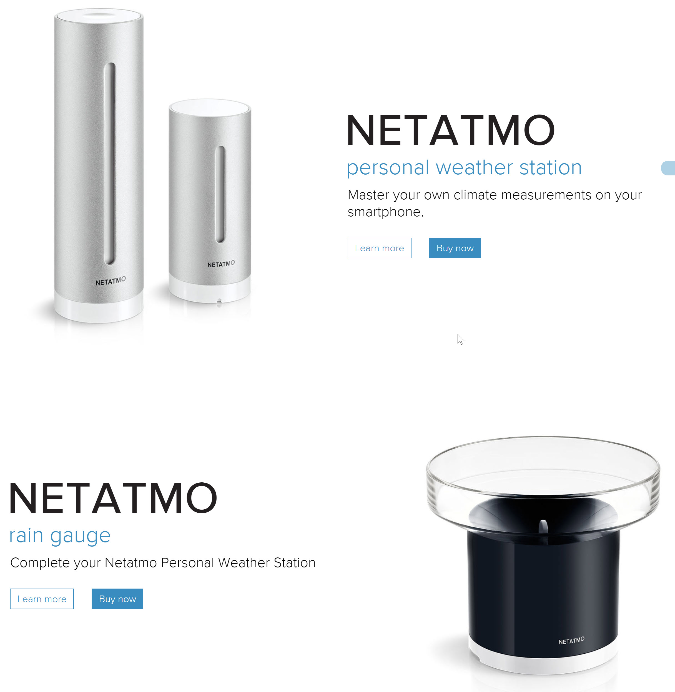

# NetAtmo

Netatmo is a supplier of stylish weather stations and security products.
They are similar to nest, but they do not charge a monthly subscription fee. 

As an example of how to integrate products of leading suppliers into Lucy, two drivers have been created to facilitate this and demonstrate the benefits and ease of use.

# Introduction to Netatmo weather station products

The weather system of [netatmo](https://www.netatmo.com/en-US/product/weather) is totally integrated into Lucy's [Weather system](Weather_station.md).

They have some beautiful products:





Once you do the Netatmo app registration at http://dev.netatmo.com/dev/listapps, you have to past the client_id, client_secret, netatmo password and user name in the configuration, and the system can start the read you personal rain gauge and in_door/out_door stations.

Lucy will check several aspects of your netatmo weather station such as pressure, humidity, rain last hour, rain last 24 hours, wind and gust.
It also checks indoor parameters such as noise, co2, and humidity, the batteries of every of your netatmo devices.

<!--s_name_ws-->
# Netatmo_ws_driver

<!--e_name_ws-->

<!--s_role_ws-->
<!--e_role_ws-->

<!--s_descr_ws-->
Netatmo weather station driver -> make a different id compared with the netatmo welcome system.  Name your inhouse and outhouse station to the room where they are placed, e.g. 'garden','office' and rainmeter / windmeter for these modules

<!--e_descr_ws-->

<!--s_tbl_ws-->
## List of [properties](Properties.md) for __Netatmo_ws_driver__:

  | Property | Validation | Optional? | Repeat? | Description |
  | --- | --- | --- | --- | --- |
  | fav | str | True | - | is this a favorite element | 
  | icon | str | True | - | icon file for this element | 
  | netatmo_client_id | str | False | - | Your client ID from Netatmo app registration at http://dev.netatmo.com/dev/listapps | 
  | netatmo_client_secret | str | False | - | Your client app secret | 
  | netatmo_home | str | False | - | ''= default is the first station if you have defined many, else name your desired station | 
  | netatmo_password | str | True | - | ''= same as your email notification | 
  | netatmo_user_name | str | True | - | ''= default is your email notification address | 
  | notifications | ['ws_air_quality', 'ws_gust', 'ws_humidity', 'ws_noise', 'ws_pressure', 'ws_rain_1', 'ws_rain_24', 'ws_report', 'ws_rf_stat', 'ws_wifi_stat', 'ws_wind'] | True | - | extensive list of notifications, see [__Notifier__](Notifier.md) | 

## List of [Notifications](Notifier.md) for  __Netatmo_ws_driver__:

  | Notification Suffix | When invoked? |
  | --- | --- | 
  | ws_air_quality |  | 
  | ws_gust |  | 
  | ws_humidity |  | 
  | ws_noise |  | 
  | ws_pressure |  | 
  | ws_rain_1 |  | 
  | ws_rain_24 |  | 
  | ws_report |  | 
  | ws_rf_stat |  | 
  | ws_wifi_stat |  | 
  | ws_wind |  | 
<!--e_tbl_ws-->

## Example Configuration

```
[APPS]
netatmo_ws_driver= {
    # name your inhouse and outhouse station to the room where they are placed, e.g. "garden","office" and rainmeter / windmeter for these modules
    "netatmo_client_id":    "XYZ",             # Your client ID from Netatmo app registration at http://dev.netatmo.com/dev/listapps
    "netatmo_client_secret":"XYZ",  		   # Your client app secret
    "netatmo_user_name":    "",                # ""= default is your email notification address
    "netatmo_password":     ""}                # ""= same as your email notification
```

## Netatmo weather and indoor warning messages

The netatmo driver produces notifications, on air quality, rain_1 (last hour), rain_24 (last 24 hours), strength of gust and strength of wind.

The thresholds on which these notifications are triggered come from app_obj.conf:
```
    time_netatmo_ws = 660   # the netamo cloud is updated every 10 minutes, so we read every 11 mins
    # netatmo checks and dicts
    na_chk_dict    ={"CO2":         ["air_qual",{0:"EXCELLENT",1000:"GOOD",1200:"!LESS THAN GOOD",1900:"!!POOR AIR Quality",2500:"!!PLEASE AIR THE ROOM"}],
                    "Pressure":     [None,{0:"LOW",1050:"NORMAL",1100:"HIGH"}],
                    "Humidity":     [None,{0:"DRY",50:"NORMAL",80:"!HUMID",95:"!!VERY HUMID"}],
                    "Noise":        [None,{0:"None",36:"NORMAL",85:"!NEED EAR PROTECTION",105:"!!VERY LOUD - DISCO LEVEL",115:"!!PAIN LEVEL, YOUR EARS??",125:"!!DEAFNESS"}],
                    "sum_rain_1":   ["rain_1",{0:"DRY",1:"A LITTLE",5:"A LOT",10:"!! MUCH RAIN",15:"!!FLOODING"}],  
                    "sum_rain_24":  ["rain_24",{0:"NOTHING",2:"A TICKLE",5:"A LOT",10:"!!A LOT",15:"!!FLOODING"}],
                    "max_wind_str": ["gust",{0:"NO WIND",40:"LITTLE WINDY",60:"!STRONG WIND",90:"!!ALARM STORM WIND",120:"!!ALARM VIOLENT STORM"}],
                    "GustStrength": ["gust",{0:"NO WIND",40:"LITTLE WINDY",60:"!STRONG WIND GUST",80:"!!ALARM STORM GUST"}],
                    "rf_status":    [None,{0:"GOOD",56:"AVERAGE",71:"WEAK",86:"BAD"}],
                    "wifi_status":  [None,{0:"GOOD",56:"AVERAGE",71:"WEAK",86:"BAD"}]}
    na_chk_batt    ={"Rainmeter":[0,4000,4500,5000,5500,6000],
                    "OUTDOOR":[0,4000,4500,5000,5500,6000],
                    "Windmeter":[0,4360,4770,5180,5590,6000],
                    "INDOOR": [0,4560,4920,5280,5640,6000]}
    na_chk_batt_txt=["!!EMPTY","!!LOW","MEDIUM","HIGH","FULL","MAX"]
    na_beaufort    ={0:[1,"calm"],1:[5,"Light Air"],2:[11,"Light Breeze"],3:[19,"Gentle Breeze"],4:[28,"Moderate Breeze"],5:[38,"Fresh Breeze"],
                     6:[49,"!!Strong Breeze"],7:[61,"!!High Wind"],8:[74,"!!Strong Wind"],9:[88,"!!Very Strong Wind"],10:[102,"!!Storm"],
                     11:[117,"!!Violent Storm"],12:[118,"Hurricane"]}
    nac_chk_dict   ={"battery_percent":[None,{100:"FULL",75:"GOOD",50:"HALF",35:"!WEAK",25:"!!REPLACE",10:"!!URGENT REPLACE"}],
                     "rf":[None,{100:"MAX STRENGTH",75:"GOOD",50:"OK",35:"!WEAK",15:"!!ALMOST GONE"}]}
```

When __!!__ is put before a message, then this triggers a notification if this level is reached.   A single __!__ just triggers a warning.

The data is accurate on 11 minutes, as the netatmo cloud is updated by the netatmo devices only once every 10 minutes.

## Netatmo Reporting

for example reports, see [Weather_station](Weather_station.md)

<!--s_name_wlc-->
# Netatmo_wlc_driver

<!--e_name_wlc-->

<!--s_role_wlc-->
<!--e_role_wlc-->

<!--s_descr_wlc-->
Netatmo welcome system driver -> make a different id compared with the netatmo weather station.  Netatmo Welcome: name your netatmo welcome camera and tags.

<!--e_descr_wlc-->

Honestly i am disappointed with the netatmo tags, they give false alarms and the battery goes down faster than the speed of light.   It could be that the tags do not work very well on my metal (aluminum) windows, but then they should have warned me.
Also the time lag between the netatmo cloud and the getting the result in Lucy does show that this is not a good and stable proof option.
The netatmo welcome camera is a nice gadget, but for daily reliable home coming use, not so much unfortunately.
 
This demonstrates that reliability is home control is a quality aspect not to compromise on, ever!

For that reason, the integration between netatmo welcome and lucy's [Security system](Security.md) is disabled, unless netatmo improves significantly their product.

<!--s_tbl_wlc-->
## List of [properties](Properties.md) for __Netatmo_wlc_driver__:

  | Property | Validation | Optional? | Repeat? | Description |
  | --- | --- | --- | --- | --- |
  | fav | str | True | - | is this a favorite element | 
  | icon | str | True | - | icon file for this element | 
  | netatmo_client_id | str | False | - | Your client ID from Netatmo app registration at http://dev.netatmo.com/dev/listapps | 
  | netatmo_client_secret | str | False | - | Your client app secret | 
  | netatmo_home | str | False | - | specify yr netatmo home name | 
  | netatmo_password | str | True | - | ''= same as your email notification | 
  | netatmo_user_name | str | True | - | ''= default is your email notification address | 
  | notifications | ['na_welcome'] | True | - | extensive list of notifications, see [__Notifier__](Notifier.md) | 

## List of [Notifications](Notifier.md) for  __Netatmo_wlc_driver__:

  | Notification Suffix | When invoked? |
  | --- | --- | 
  | na_welcome | when this report runs | 
<!--e_tbl_wlc-->

## Example

```
[APPS]
netatmo_wlc_driver = {      # **** Netatmo welcome system -> make a different id compared with the netatmo weather station
    "netatmo_client_id":    "XYZ",  # Your client ID from Netatmo app registration at http://dev.netatmo.com/dev/listapps
    "netatmo_client_secret":"XYZ",  # Your client app secret
    "netatmo_user_name":    "",     # ""= default is your email notification address
    "netatmo_password":     "",     # ""= same as your email notification
    "netatmo_home":         "Home"} # specify yr netatmo home name
```

## Netatmo Welcome report generated and daily emailed at midnight

* * * 
* * * 

<!--s_insert_{"role":"security","suffix":"wlc"}-->


[PI-Security_wlc.html](PI-Security_wlc.html)

<!DOCTYPE html><html><body><h1>Netatmo Welcome Report -> PI-Security_wlc.html  2020/06/19 00:00:51</h1><h2>Netatmo Tags</h2><table><thead><tr><th>Netatmo Tags</th><th>Status</th><th style='text-align:center'>Last Active</th><th style='text-align:center'>Battery</th><th style='text-align:center'>RF-Signal</th></tr></thead><tbody><tr><td>Living Side Rear</td><td>maintenance- door/window is open/moving</td><td style='background-color:plum;text-align:center'>2019-01-27 12:01:31</td><td style='background-color:plum;text-align:center'>14% - !!URGENT REPLACE</td><td style='text-align:center'>98 - GOOD</td></tr><tr><td>Dining Rear</td><td>maintenance- door/window is open/moving</td><td style='background-color:plum;text-align:center'>2018-11-13 11:26:05</td><td style='background-color:plum;text-align:center'>14% - !!URGENT REPLACE</td><td style='text-align:center'>74 - OK</td></tr><tr><td>Dining Front</td><td>no_news</td><td style='background-color:plum;text-align:center'>2019-11-10 20:21:52</td><td style='background-color:plum;text-align:center'>0% - !!EMPTY</td><td style='text-align:center'>71 - OK</td></tr><tr><td>Living Rear North</td><td>maintenance- door/window is open/moving</td><td style='background-color:plum;text-align:center'>2018-05-27 15:39:27</td><td style='background-color:plum;text-align:center'>0% - !!EMPTY</td><td style='text-align:center'>100 - MAX STRENGTH</td></tr><tr><td>Living Side Front</td><td>open- door/window is closed</td><td style='background-color:plum;text-align:center'>2020-06-02 21:52:32</td><td style='background-color:plum;text-align:center'>18% - !!URGENT REPLACE</td><td style='text-align:center'>87 - GOOD</td></tr><tr><td>Living Front</td><td>open- door/window is closed</td><td style='background-color:plum;text-align:center'>2020-04-05 19:34:44</td><td style='background-color:plum;text-align:center'>8% - !!EMPTY</td><td style='text-align:center'>83 - GOOD</td></tr></tbody></table><h2>Persons</h2><table><thead><tr><th>Person</th><th>Last Seen</th><th>Out of Sight</th></tr></thead><tbody><tr><td>Rudy</td><td>2020-06-18 12:12:29</td><td>Yes</td></tr><tr><td>Lucy</td><td>2020-06-18 15:38:21</td><td>Yes</td></tr><tr><td>Rebecca</td><td>2020-06-11 13:27:53</td><td>Yes</td></tr><tr><td>unknown person</td><td>2020-06-11 13:25:38</td><td>Yes</td></tr><tr><td>unknown person</td><td>2020-06-11 16:17:20</td><td>Yes</td></tr><tr><td>unknown person</td><td>2020-06-11 17:52:17</td><td>Yes</td></tr><tr><td>unknown person</td><td>2020-06-12 09:24:11</td><td>Yes</td></tr><tr><td>unknown person</td><td>2020-06-12 11:29:03</td><td>Yes</td></tr><tr><td>unknown person</td><td>2020-06-12 16:16:23</td><td>Yes</td></tr><tr><td>unknown person</td><td>2020-06-12 16:30:02</td><td>Yes</td></tr><tr><td>unknown person</td><td>2020-06-12 16:45:03</td><td>Yes</td></tr><tr><td>unknown person</td><td>2020-06-12 17:00:30</td><td>Yes</td></tr><tr><td>unknown person</td><td>2020-06-13 09:43:07</td><td>Yes</td></tr><tr><td>unknown person</td><td>2020-06-13 12:50:05</td><td>Yes</td></tr><tr><td>unknown person</td><td>2020-06-13 21:41:16</td><td>Yes</td></tr><tr><td>unknown person</td><td>2020-06-13 21:36:42</td><td>Yes</td></tr><tr><td>unknown person</td><td>2020-06-15 09:23:04</td><td>Yes</td></tr><tr><td>unknown person</td><td>2020-06-15 09:29:04</td><td>Yes</td></tr><tr><td>unknown person</td><td>2020-06-15 12:14:59</td><td>Yes</td></tr><tr><td>unknown person</td><td>2020-06-15 14:28:48</td><td>Yes</td></tr><tr><td>unknown person</td><td>2020-06-15 15:11:56</td><td>Yes</td></tr><tr><td>unknown person</td><td>2020-06-15 15:36:51</td><td>Yes</td></tr><tr><td>unknown person</td><td>2020-06-16 12:34:43</td><td>Yes</td></tr><tr><td>unknown person</td><td>2020-06-16 12:36:25</td><td>Yes</td></tr><tr><td>unknown person</td><td>2020-06-16 12:39:24</td><td>Yes</td></tr><tr><td>unknown person</td><td>2020-06-16 13:33:23</td><td>Yes</td></tr><tr><td>unknown person</td><td>2020-06-17 17:19:12</td><td>Yes</td></tr><tr><td>unknown person</td><td>2020-06-18 09:27:50</td><td>Yes</td></tr></tbody></table><h2>Events</h2><table><thead><tr><th>Events</th><th style='text-align:center'>Time</th><th>Type</th><th>Arrival?</th></tr></thead><tbody><tr><td>&lt;b&gt;Lucy&lt;/b&gt; seen</td><td style='text-align:center'>2020-06-18 15:38:21</td><td>person</td><td>Yes</td></tr><tr><td>WelcomeCam connected</td><td style='text-align:center'>2020-06-18 15:00:20</td><td>connection</td><td>No</td></tr><tr><td>Living Front: still open</td><td style='text-align:center'>2020-06-18 14:48:42</td><td>tag_open</td><td>No</td></tr><tr><td>Living Side Front: still open</td><td style='text-align:center'>2020-06-18 14:48:32</td><td>tag_open</td><td>No</td></tr><tr><td>WelcomeCam disconnected</td><td style='text-align:center'>2020-06-18 14:01:49</td><td>disconnection</td><td>No</td></tr><tr><td>&lt;b&gt;Rudy&lt;/b&gt; seen</td><td style='text-align:center'>2020-06-18 12:12:29</td><td>person</td><td>No</td></tr><tr><td>&lt;b&gt;Rudy&lt;/b&gt; seen</td><td style='text-align:center'>2020-06-18 11:33:08</td><td>person</td><td>No</td></tr><tr><td>&lt;b&gt;Rudy&lt;/b&gt; seen</td><td style='text-align:center'>2020-06-18 11:14:42</td><td>person</td><td>No</td></tr><tr><td>&lt;b&gt;Rudy&lt;/b&gt; seen</td><td style='text-align:center'>2020-06-18 11:04:45</td><td>person</td><td>No</td></tr><tr><td>&lt;b&gt;Lucy&lt;/b&gt; seen</td><td style='text-align:center'>2020-06-18 10:35:20</td><td>person</td><td>Yes</td></tr><tr><td>&lt;b&gt;Rudy&lt;/b&gt; seen</td><td style='text-align:center'>2020-06-18 10:31:35</td><td>person</td><td>No</td></tr><tr><td>&lt;b&gt;Rudy&lt;/b&gt; seen</td><td style='text-align:center'>2020-06-18 10:17:57</td><td>person</td><td>No</td></tr><tr><td>&lt;b&gt;Rudy&lt;/b&gt; seen</td><td style='text-align:center'>2020-06-18 10:15:31</td><td>person</td><td>No</td></tr><tr><td>&lt;b&gt;Rudy&lt;/b&gt; seen</td><td style='text-align:center'>2020-06-18 10:04:00</td><td>person</td><td>No</td></tr><tr><td>&lt;b&gt;Rudy&lt;/b&gt; seen</td><td style='text-align:center'>2020-06-18 09:54:41</td><td>person</td><td>No</td></tr><tr><td>&lt;b&gt;Unknown face&lt;/b&gt; seen</td><td style='text-align:center'>2020-06-18 09:27:49</td><td>person</td><td>No</td></tr><tr><td>&lt;b&gt;Rudy&lt;/b&gt; seen</td><td style='text-align:center'>2020-06-18 09:27:24</td><td>person</td><td>Yes</td></tr><tr><td>&lt;b&gt;Motion&lt;/b&gt; detected</td><td style='text-align:center'>2020-06-18 09:24:58</td><td>movement</td><td>No</td></tr><tr><td>&lt;b&gt;Motion&lt;/b&gt; detected</td><td style='text-align:center'>2020-06-18 09:23:46</td><td>movement</td><td>No</td></tr><tr><td>&lt;b&gt;Motion&lt;/b&gt; detected</td><td style='text-align:center'>2020-06-18 09:22:40</td><td>movement</td><td>No</td></tr><tr><td>&lt;b&gt;Motion&lt;/b&gt; detected</td><td style='text-align:center'>2020-06-18 09:17:32</td><td>movement</td><td>No</td></tr><tr><td>&lt;b&gt;Motion&lt;/b&gt; detected</td><td style='text-align:center'>2020-06-18 09:16:17</td><td>movement</td><td>No</td></tr><tr><td>&lt;b&gt;Motion&lt;/b&gt; detected</td><td style='text-align:center'>2020-06-18 09:10:29</td><td>movement</td><td>No</td></tr><tr><td>&lt;b&gt;Motion&lt;/b&gt; detected</td><td style='text-align:center'>2020-06-18 09:09:44</td><td>movement</td><td>No</td></tr><tr><td>&lt;b&gt;Motion&lt;/b&gt; detected</td><td style='text-align:center'>2020-06-18 09:09:03</td><td>movement</td><td>No</td></tr><tr><td>&lt;b&gt;Motion&lt;/b&gt; detected</td><td style='text-align:center'>2020-06-18 09:08:23</td><td>movement</td><td>No</td></tr><tr><td>&lt;b&gt;Motion&lt;/b&gt; detected</td><td style='text-align:center'>2020-06-18 09:07:23</td><td>movement</td><td>No</td></tr><tr><td>&lt;b&gt;Motion&lt;/b&gt; detected</td><td style='text-align:center'>2020-06-18 09:05:00</td><td>movement</td><td>No</td></tr><tr><td>&lt;b&gt;Motion&lt;/b&gt; detected</td><td style='text-align:center'>2020-06-18 09:02:43</td><td>movement</td><td>No</td></tr><tr><td>&lt;b&gt;Rudy&lt;/b&gt; seen</td><td style='text-align:center'>2020-06-17 17:45:53</td><td>person</td><td>No</td></tr></tbody></table></body></html>
<!--e_insert-->

* * * 
* * * 


