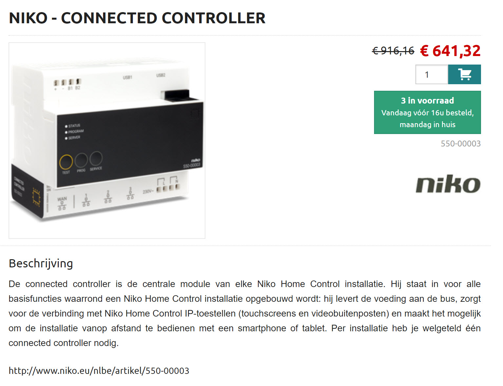

<!--s_name-->
# Niko_driver

<!--e_name-->

<!--s_role-->
<!--e_role-->

<!--s_descr-->
is the driver for Niko

<!--e_descr-->

<!--s_tbl-->
## List of [properties](Properties.md) for __Niko_driver__:

  | Property | Validation | Optional? | Repeat? | Description |
  | --- | --- | --- | --- | --- |
  | fav | str | True | - | is this a favorite element | 
  | icon | str | True | - | icon file for this element | 
  | role_me | {tc} | False | - | role_me of 'Niko_driver', adds <niko> to the roles of the specified tc | 
<!--e_tbl-->

