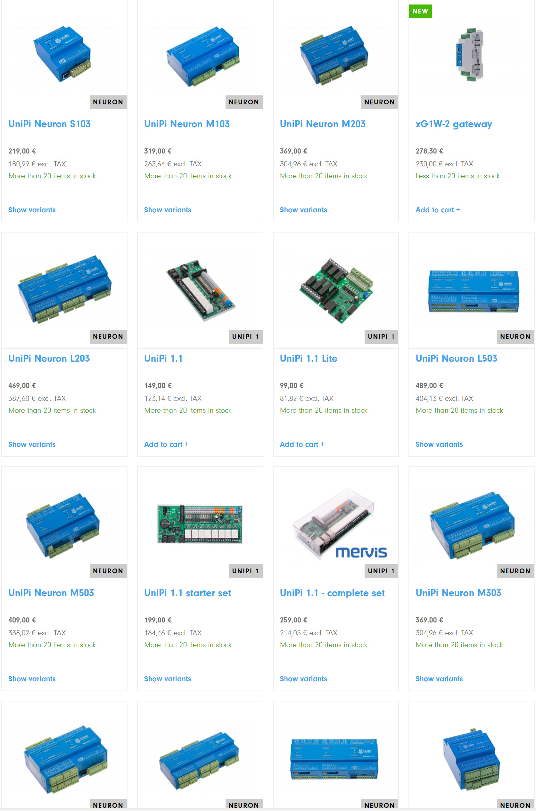

# Referencing Things through path Definitions

## What is a (hardware) path?

In all input or output derived objects, the definition of a __path=__ is mandatory.

It is a hardware identification string to get to an electrical signal somewhere on a device.
It is more than a symbolic representations, it allows the computer to get to the source of the signal to just read (Inputs) or change it (Outputs).

## In Brief, Referencing Things

<!--s_sub_toc_path-->

Real Things need a reference to the physical world, and __path=__ is the way to make this link and it is therefore mandatory.
Path definitions come in different types and prj_parser checks that a Button cannot be defined as a temperature path, which can only be assigned to a sensor.

Path types define the physical input / output aspect and they have to follow a specific syntax:

| path Type   | Description                                               | Syntax                                        
| ---        | ---                                                       | ---                                                   
| __piface__ | thing linked to a raspberry with piface                   | piface:{pi_name},{do,di},{hw_pin}                                 
| __unipi__  | thing linked to a raspberry with a unipi or Evok webserver| unipi:{pi_name},{relay,input,ai,ao},{hw_pin}                                 
| __arduino__| thing linked to a arduino with things_sync protocol       | arduino:{pi_name},{"di","do","ao"},{hw_pin}                                 
| __ow__     | thing linked to a 1wire device                            | ow:{A or B},{1w_device} if it concerns a digital device else ow:{1w_device} for a sensor                               
| __zw__     | thing linked to a vera zwave device                       | zw:{zw_name},{zw_dev_nr},{zw_attr}                    
| __vera__   | vera scene or device                                      | vera:{gw_name} or {:} -> given name                 
| __ikea__   | Ikea tradfri light element                                | ikea:{gw_name},{thing_name} or {:} -> given name   
| __hue__    | Philips Hue light element                                 | hue:{gw_name},{thing_name} or {:} -> given name
| __lutron__ | Lutron light element or switch                            | lutron:{gw_name},{thing_name} or {:} -> given name
| __daikin__ | Daikin soll element, default is soll temperature          | daikin:{gw_name},{thing_name} or {:} -> given name
| __knx__    | KNX thing                                                 | knx:{gw_name},{thing_name} or {:} -> given name
| __modbus__ | Modbus thing                                              | modbus:{gw_name},{thing_name} or {:} -> given name
| __niko__   | niko thing                                                | niko:{gw_name},{thing_name} or {:} -> given name  
| __somfy__  | somfy thing                                               | somfy:{gw_name},{thing_name} or {:} -> given name 
| __shelly__ | shelly thing                                              | shelly:{ip},{channel}  (channel is optional and only when white shelly mode is used)
| __tcp__    | a tcp message                                             | tcp:{pi_name},{ip},{port},'ip_txt'                       
| __udp__    | a udp message                                             | udp:{pi_name},{ip},{port},'ip_txt'                 
| __usb__    | a usb serial device such as an arduino                    | usb:{pi_name},{usb_driver setting_id}                    
| __na_tag__ | a netatmo movement tag                                    | na_tag:{netatmo name of tag}                    

For tcp and udp, 'ip_txt' string can contain python string formatting, whereby the variables are {name} for substituting the device name and {val} the current value of the device.

Path definition Examples:

```python3                     
"iButton_out_red":     Light(path="pi:AR-1W-OUT,do,1",duration=2)        # path is an arduino, output path 1
"door_kitchen_terras": Door(path="ow:A,12742ECC000000B4")                # path is one wire DS2406 path A 
"HVAC_test":           Clim_SP(path="zw:p_switch,135,1",i_make={"wind"}) # path is zw device 135 variable 1
"wall_light":          Light(path="vera:{:}")                            # path is vera device named wall_light
"guest_light":         Dim_light(path="ikea:Ikea_Tradfri,{:}")           # path is tradfri device guest_light
"bed_candle":          Dim_light(path="hue:Hue_Bridge2,{:}")             # path is on Hue Bridge 2, named bed candle
"temp_outside":        Sensor(path="°C:289574D906000075")                # path is 1w temp sensor 
"tcp_light":           Light(path="tcp:PI-Light,192.168.15.76,5000,'{name}-{val}'") # path is a tcp message that will be sent by PI-Light 
"udp_light":           Light(path="udp:PI-Light,192.168.15.76,5000,'{val}'")        # path is a udp message that will be sent by PI-Light
"iButton_out_garden":  Access_point(path="usb:PI-Garden,serial_arduino,string"}     # path is string data from a serial device
```

<!--e_sub_toc_path-->


## path types per device type

The following table lists the different available device types and the corresponding authorized path types:

| Input Derived     | Output Derived    | Allowed path Types                                     |
| ---               | ---               | ---                                                   |
| Input()           |                   | "unipi","piface","arduino", "ow", "zw", "vera", "usb", "ikea", "hue","knx","modbus","niko","lutron","somfy"               |
| Door() / Window() |                   | "unipi","piface","arduino", "ow", "zw", "vera", "usb", "tcp", "udp", "na_tag","knx","modbus","niko","lutron","somfy"      |
| Button()          |                   | "unipi","piface","arduino", "ow", "zw", "vera", "usb", "ikea", "hue","knx","modbus","niko","lutron","somfy"               |
| Switch()          |                   | "unipi","piface","arduino", "ow", "zw", "vera", "usb", "ikea", "hue","knx","modbus","niko","lutron","somfy"               |
| Optical()         |                   | "unipi","piface","arduino", "ow", "zw", "vera", "usb", "ikea", "hue","knx","modbus","niko","lutron","somfy"               |
| Monitor()         |                   | "unipi","piface","arduino", "ow", "zw", "vera", "usb", "ikea", "hue","knx","modbus","niko","lutron","somfy"               |
| Fire_detector()   |                   | "unipi","piface","arduino", "ow", "zw", "vera", "usb", "ikea", "hue","knx","modbus","niko","lutron","somfy"               |
| Alarm_detector()  |                   | "unipi","piface","arduino", "ow", "zw", "vera", "usb", "ikea", "hue","knx","modbus","niko","lutron","somfy"               |
|                   | Output()          | "unipi","piface","arduino", "ow", "zw", "vera", "usb", "tcp", "udp", "hue", "ikea","knx","modbus","niko","lutron","somfy","shelly" |
|                   | Clim_dev()        | "unipi","piface","arduino", "ow", "zw", "vera", "usb", "tcp", "udp","knx","modbus","niko","lutron","somfy","shelly"       |
|                   | Clim_SP()         | "unipi","piface","arduino", "ow", "zw", "vera", "usb", "tcp", "udp","knx","modbus","niko","lutron","somfy","shelly"       |
|                   | Irr()             | "unipi","piface","arduino", "ow", "zw", "vera", "usb", "tcp", "udp","knx","modbus","niko","lutron","somfy","shelly"       |
|                   | Alarm_sirene()    | "unipi","piface","arduino", "ow", "zw", "vera", "usb", "tcp", "udp","knx","modbus","niko","lutron","somfy","shelly"       |
|                   | Light()           | "unipi","piface","arduino", "ow", "zw", "vera", "usb", "tcp", "udp", "hue", "ikea","knx","modbus","niko","lutron","somfy","shelly" |
|                   | Dim_light(),Color_light(),Dimmer(),Motor(),.. | "pi", "zw", "vera", "usb", "tcp", "udp","hue","ikea","knx","modbus","niko","lutron","somfy"|
|                   | Sensor()          | "unipi","arduino","zw", "vera", "°C", "CO2", "CO", "H%","knx","modbus","niko","lutron","somfy"                 |

Path types define the source of the input / output element and they have each to follow a specific syntax as detailed above.

## Table driving the programming

The below table is used by the parsing program to determine format, ownership, synchronisation, and reading and writing to the physical hardware. 

<!--s_insert_{"prj_parser":"app_obj.conf","section":"PATH","vars":["path_defs"]}-->

from app_obj.conf:
```python3
[PATH]

path_defs=
	{"zw":         {"gw_sleep": 20, "physical":{"write_by":"*",       "scan_by":["light","security","m.clim","wincover","s.clim"],          "ask_from":"light",   "tell_by":"light",   "boot_set" : False}, "format":"tc,zw_id,zw_nr,zw_fld",  "assert":{"am_i_any":["binary","analog","color"], "drv":"Vera_driver",       "owner":["Vera"]}},
	"vera":       {"gw_sleep": 20, "physical":{"write_by":"*",       "scan_by":["light","security","m.clim","wincover","s.clim"],          "ask_from":"light",   "tell_by":"light",   "boot_set" : False}, "format":"tc,th",                  "assert":{"am_i_any":["binary","analog","color"], "drv":"Vera_driver",       "owner":["Vera"]}},
	"hue":        {"gw_sleep": 25, "physical":{"write_by":"light",   "scan_by":["light"],          "ask_from":"light",   "tell_by":"light",   "boot_set" : False}, "format":"tc,th",                  "assert":{"am_i_any":["binary","analog","color"], "drv":"Hue_driver",        "owner":["Hue"]}},
	"ikea":       {"gw_sleep": 20, "physical":{"write_by":"light",   "scan_by":["light"],          "ask_from":"light",   "tell_by":"light",   "boot_set" : False}, "format":"tc,th",                  "assert":{"am_i_any":["binary","analog","color"], "drv":"Ikea_driver",       "owner":["Ikea"]}},
	"shelly":     {"gw_sleep":2.5, "physical":{"write_by":"*",       "scan_by":["light"],          "ask_from":"light",   "tell_by":"",        "boot_set" : False}, "format":"ip,shelly_id",           "assert":{"am_i_any":["binary","analog","color"],"shelly_id":["1","2","3","4",""]}},
	"tcp":        {"gw_sleep":  0, "physical":{"write_by":"*",       "scan_by":[],                 "ask_from":"",        "tell_by":"*",       "boot_set" : False}, "format":"tc,ip,port,msg",         "assert":{"am_i_all":["output"],                  "drv":"Tcp_driver",        "owner":["Raspi"]}},
	"udp":        {"gw_sleep":  0, "physical":{"write_by":"*",       "scan_by":[],                 "ask_from":"",        "tell_by":"*",       "boot_set" : False}, "format":"tc,ip,port,msg",         "assert":{"am_i_all":["output"],                  "drv":"Udp_driver",        "owner":["Raspi"]}},
	"daikin":     {"gw_sleep":  5, "physical":{"write_by":"m.clim",  "scan_by":["m.clim","s.clim"],"ask_from":"m.clim",  "tell_by":"m.clim",  "boot_set" : False}, "format":"tc,dk_tpe",              "assert":{"am_i_any":["binary","analog","string"],"drv":"Daikin_driver",     "owner":["Daikin"],"dk_tpe":["","sp","mode","h_humid","o_temp","is_on","h_temp","f_dir","f_rate","dry_sp"]}},
	"renson":     {"gw_sleep": 20, "physical":{"write_by":"m.clim",  "scan_by":["m.clim","s.clim"],"ask_from":"m.clim",  "tell_by":"m.clim",  "boot_set" : False}, "format":"tc,th",                  "assert":{"am_i_any":["analog"],                                             "owner":["Renson"]}},
	"unipi":      {"gw_sleep": 20, "physical":{"write_by":"*",       "scan_by":["*"],              "ask_from":"",        "tell_by":"",        "boot_set" : False}, "format":"tc,xy_tpe,nr",           "assert":{"am_i_any":["binary","analog"],         "drv":"Unipi_driver",      "owner":["Raspi","Unipi_Evok"],"xy_tpe":["relay","input","ai","ao"]}},
	"piface":     {"gw_sleep":0.3, "physical":{"write_by":"owner",   "scan_by":["owner"],          "ask_from":"owner",   "tell_by":"owner",   "boot_set" : True }, "format":"tc,xy_tpe,nr",           "assert":{"am_i_any":["binary"],                  "drv":"Piface_driver",     "owner":["Raspi"],"xy_tpe":["di","do"]}},
	"arduino":    {"gw_sleep":  1, "physical":{"write_by":"owner",   "scan_by":["owner"],          "ask_from":"owner",   "tell_by":"owner",   "boot_set" : True }, "format":"tc,xy_tpe,nr",           "assert":{"am_i_any":["binary","analog","string"],                           "owner":["Arduino"],"xy_tpe":["di","do","ao"]}},
	"ip_building":{"gw_sleep":2.0, "physical":{"write_by":"*",       "scan_by":["light"],          "ask_from":"light",   "tell_by":"light",   "boot_set" : False}, "format":"tc,xy_tpe,th,chan",      "assert":{"am_i_any":["binary","analog"],         "drv":"Ip_building_driver","owner":["IP_Building"],"xy_tpe":["1w_button","1w_sensor","1w_in","1w_out","out_analog","out_relay"]}},
	"loxone":     {"gw_sleep":2.0, "physical":{"write_by":"*",       "scan_by":["*"],              "ask_from":"",        "tell_by":"",        "boot_set" : False}, "format":"tc,xy_tpe,nr",           "assert":{"am_i_any":["binary","analog"],         "drv":"Loxone_driver",     "owner":["Loxone"]}},
	"na_tag":     {"gw_sleep": 10, "physical":{"write_by":"",        "scan_by":["security"],       "ask_from":"security","tell_by":"security","boot_set" : True }, "format":"th",                     "assert":{"am_i_all":["input"],                   "drv":"Netatmo_wlc_driver"}},
	"na_ws":      {"gw_sleep": 10, "physical":{"write_by":"",        "scan_by":["weather"],        "ask_from":"weather", "tell_by":"weather", "boot_set" : False}, "format":"th",                     "assert":{"am_i_all":["input"],                   "drv":"Netatmo_ws_driver"}},
	"niko":       {"gw_sleep":2.0, "physical":{"write_by":"*",       "scan_by":["light"],          "ask_from":"light",   "tell_by":"light",   "boot_set" : False}, "format":"tc,xy_tpe,nr",           "assert":{"am_i_any":["binary","analog"],         "drv":"Niko_driver",       "owner":["Niko"]}},
	"knx":        {"gw_sleep":2.0, "physical":{"write_by":"*",       "scan_by":["*"],              "ask_from":"",        "tell_by":"",        "boot_set" : False}, "format":"tc,xy_tpe,nr",           "assert":{"am_i_any":["binary","analog"],         "drv":"KNX_driver",        "owner":["KNX"]}},
	"modbus":     {"gw_sleep":2.0, "physical":{"write_by":"*",       "scan_by":["*"],              "ask_from":"",        "tell_by":"",        "boot_set" : False}, "format":"tc,xy_tpe,nr",           "assert":{"am_i_any":["binary","analog"],         "drv":"Modbus_driver",     "owner":["Modbus"]}},
	"btle":       {"gw_sleep":0.1, "physical":{"write_by":"",        "scan_by":["*"],              "ask_from":"",        "tell_by":"*",       "boot_set" : False}, "format":"tc,mac,uuid,major,minor","assert":{"am_i_any":["analog","binary"],         "drv":"Btle_driver",       "owner":["Raspi"]},"path_aid":["btle:{mac}","BtleThing"]},
	"ow":         {"gw_sleep":1.5, "physical":{"write_by":"",        "scan_by":["*"],              "ask_from":"",        "tell_by":"",        "boot_set" : False}, "format":"tc,th,th_tpe,chan,lbl",  "assert":{"am_i_any":["binary","analog"],         "drv":"One_wire_driver",   "owner":["Raspi","Ow_eds"],"th_tpe":["EDS0068","DS2406","DS18B20","DS2401"]},"chan":["","A","B"],"path_aid":["ow:{th}","OwThing"]},
	"usb":        {"gw_sleep":0.8, "physical":{"write_by":"owner",   "scan_by":["owner"],          "ask_from":"owner",   "tell_by":"owner",   "boot_set" : True }, "format":"tc,usb_path,xy_tpe,nr",  "assert":{"am_i_any":["digital","string"],        "drv":"Usb_driver",        "owner":["Raspi","Ubuntu"],"xy_tpe":["1w_button","o","i"]}},
	"ean":        {"gw_sleep":  0, "physical":{"write_by":"",        "scan_by":["owner"],          "ask_from":"owner",   "tell_by":"owner",   "boot_set" : True }, "format":"tc,utility,ean_nr,meter_nr,value_format,unit,unit_rate,unit2,unit2_rate,sum_total","assert":{"am_i_any":["string","analog"]}},
	"virtual":    {"gw_sleep":  0, "physical":{"write_by":"",        "scan_by":[],                 "ask_from":"owner",   "tell_by":"*",       "boot_set" : True }, "format":"",                       "assert":{"am_i_any":["binary","analog","virtual"]}}}

```

<!--e_insert-->

* This script:
    - validates the path using a path type specific format 
    - updates the static dictionaries path2ths, pathtpe2ths, paths_free and path_aid     
    - creates self.path_tpe and self.path_kws dict with all the path keywords and value
* path definition dictionary app_obj.conf[PATH][path_defs] is used as a parsing guide:
    path definitions have their possibilities as defined in app_obj.conf["PATH"]["path_defs"]:
    "assert" : contains the assert logic to verify path strings
    "drv"    : information for reading and writing to the physical hardware of the thing
    "sync"   : information for syncing the cur_state of the thing between the thingscontrollers
    "format" : to verify the syntax of the path string
    "path_aid": create ow_thing or btle_thing objects for storing path thing specific data such as one wire sensor found/lost and btle gateway rssi values
* path markers {tc} and {th} in the path are substituted at parse time with the real values
    if {tc} is used in path, then depending of the path type the corresponding name of things controller is searched
    in the assumption that only one such things_controller exist
    if {th} is used in path, then the name of the thing is substituted in the path
       
## Hardware Device Types

Hardware suppliers of Raspberry Hats (modules that attach to the raspberry) come in different sizes and capabilities.

As supporting many different interfaces is cumbersome, 2 systems have been selected and tested:

1. UniPi from UniPi Technologies : https://www.unipi.technology

Unipi has different models some including a galvanic separated 1 wire interface, ideally for temperature and other sensors.



For UniPi, the path numbers go from 0 to the number of inputs and outputs and the system automatically assigns input or output type based on the analog or digital type of device.

2. PiFace from piface digital


For piface the path numbers go from 0 to 7 and the system automatically assigns input or output type based on the device type.

3. Shelly devices such as the shelly RGBW2 in color mode or white mode, see  and  

### 1wire Sensors

Unipi has a range of sensors and 1 wire installation hardware.


These 1 wire sensors or wire devices have to be defined in app_data.conf

You can give them a label and the raspberry to which they are connected over 1 wire.

All the available 1 wire devices. Ensure that the file /etc/evok.conf from the UniPi contains the sensor definition

WARNING : path in A= or B= should be one less than the input number in the in the /etc/evok.conf file!!!!!!!!!!!

label is an identification number that can be used to tag the sensor as using the long number in cable identification is not practical

UniPi is the name of the pi-raspberry that contains the sensor in its 1w network

The string after "A"= or "B"= is I for input and O for output followed by the path number.

These can be used to activate objects such as doors, windows, digital inputs/outputs, etc..

When there are issues with the cabling (length of the wire, capacitive coupling, speed, improper closure of the wire), then it can happen that a 1w device is not always visible.

To allow issues to surface, for every device sweep it is noted if the 1w item was absent or found.

This statistic is reported and is an excellent tool to assess issues upfront.

See example free paths below:

<!--s_insert_{"prj_parser":"app_data.conf","section":"PATH","var":"paths_free"}-->

from app_data.conf:
```python3
[PATH]

paths_free=['ow:,28FF340665040071,DS18B20,,-89',
	'ow:,28FFE30F6304003C,DS18B20,,-91',
	'ow:,28FFB00863040061,DS18B20,,-90',
	'ow:,1213F3CB000000C6,DS2406,A,-41',
	'ow:,1213F3CB000000C6,DS2406,B,-41',
	'ow:,123644CC00000003,DS2406,A,-26',
	'ow:,123644CC00000003,DS2406,B,-26',
	'ow:,12B044CC0000005B,DS2406,A,-28',
	'ow:,12B044CC0000005B,DS2406,B,-28',
	'ow:,122B2ECC000000BE,DS2406,A,-29',
	'ow:,122B2ECC000000BE,DS2406,B,-29',
	'ow:,12602ECC00000033,DS2406,A,-30',
	'ow:,12602ECC00000033,DS2406,B,-30',
	'ow:,12202ECC00000046,DS2406,A,-31',
	'ow:,12202ECC00000046,DS2406,B,-31',
	'ow:,121544CC000000EC,DS2406,A,-32',
	'ow:,121544CC000000EC,DS2406,B,-32',
	'ow:,129E20CC000000F0,DS2406,A,-33',
	'ow:,129E20CC000000F0,DS2406,B,-33',
	'ow:,12C02DCC00000021,DS2406,A,-34',
	'ow:,12C02DCC00000021,DS2406,B,-34',
	'ow:,12E02DCC00000097,DS2406,A,-35',
	'ow:,12E02DCC00000097,DS2406,B,-35',
	'ow:,122044CC000000EA,DS2406,A,-36',
	'ow:,122044CC000000EA,DS2406,B,-36',
	'ow:,120C05CC00000005,DS2406,A,-37',
	'ow:,120C05CC00000005,DS2406,B,-37',
	'ow:,129009CC000000E8,DS2406,A,-38',
	'ow:,129009CC000000E8,DS2406,B,-38',
	'ow:,12B3F2CB00000057,DS2406,A,-39',
	'ow:,12B3F2CB00000057,DS2406,B,-39',
	'ow:,122144CC000000DD,DS2406,A,-40',
	'ow:,122144CC000000DD,DS2406,B,-40',
	['ow:PI-Test,12D62DCC000000C8,DS2406,B,-27',
	'unipi:PI-Test,input,13',
	'unipi:PI-Test,input,14'],
	'ow:PI-Test,2890925F070000A3,DS18B20,,',
	'ow:PI-Test,28240DA808000008,DS18B20,,',
	['ow:PI-Light,12AC04CC00000094,DS2406,B,-19', 'unipi:PI-Light,input,23'],
	['ow:PI-Light,12BDF2CB00000044,DS2406,B,-21', 'unipi:PI-Light,input,27'],
	['ow:PI-Light,12032ECC000000A9,DS2406,B,-22', 'unipi:PI-Light,input,29'],
	['ow:PI-Light,12C81DCC00000004,DS2406,B,-23', 'unipi:PI-Light,input,31'],
	['ow:PI-Light,128509CC00000058,DS2406,B,-25', 'unipi:PI-Light,input,35'],
	['ow:PI-Climate,12F31DCC00000011,DS2406,B,-12', 'unipi:PI-Climate,input,34'],
	['ow:PI-Climate,122C44CC00000097,DS2406,B,-13', 'unipi:PI-Climate,input,36'],
	['ow:PI-Climate,12F343CC00000026,DS2406,B,-17', 'unipi:PI-Climate,input,44'],
	['ow:PI-Climate,12E843CC00000085,DS2406,A,-16', 'unipi:PI-Climate,input,41'],
	['ow:PI-Climate,12E843CC00000085,DS2406,B,-16', 'unipi:PI-Climate,input,42'],
	['ow:PI-Climate,126B2ECC000000CB,DS2406,B,-18', 'unipi:PI-Climate,input,46'],
	'ow:,006D00001939D336,DS2401,,1',
	'ow:,00B20000181BDB68,DS2401,,2',
	'ow:,0006000019389F75,DS2401,,3',
	'ow:,00020000193E2C1F,DS2401,,4',
	'ow:,00FA000019389F58,DS2401,,7',
	'ow:,00D40000193E7738,DS2401,,8',
	'ow:,00F6000019384006,DS2401,,9',
	'ow:,00030000010DC35D,DS2401,,Red1',
	'ow:,005C000001508A5D,DS2401,,Red2',
	'ow:,0051000001057C5F,DS2401,,Green1',
	'ow:,00350000012EEC5E,DS2401,,Green2',
	'ow:,003100000174B67D,DS2401,,Blue1',
	'ow:,00F3000001C7BB7C,DS2401,,Blue2',
	'ow:,00420000010BBF7B,DS2401,,Yellow1',
	'ow:,00A70000014DFA7A,DS2401,,Yellow2',
	'ow:,004000000112665D,DS2401,,Black1',
	'ow:,007700000127255E,DS2401,,Black2',
	'ow:PI-Climate,12E843CC00000085,DS2406,,',
	'ow:PI-Soccer,28D4747A0B000006,DS18B20',
	'ow:PI-RearDoor,2813807A0B0000A5,DS18B20']

```

<!--e_insert-->

See example used paths below:

<!--s_insert_{"prj_parser":"app_data.conf","section":"PATH","var":"paths_used"}-->

from app_data.conf:
```python3
[PATH]

paths_used={'btle:PI-Security,0117c58556ac,23a01af0232a45189c0e323fb773f5ef,1,1': 'car',
	 'btle:PI-Security,0117c587fea6,23a01af0232a45189c0e323fb773f5ef,2,2': 'motor',
	 'btle:PI-Security,0117c58b0b9b,23a01af0232a45189c0e323fb773f5ef,3,3': 'scooter',
	 'btle:PI-Security,0117c58c73aa,23a01af0232a45189c0e323fb773f5ef,52,52': 'bruna_twingo',
	 'btle:PI-Security,0117c58d426a,23a01af0232a45189c0e323fb773f5ef,5,5': 'test',
	 'btle:PI-Soccer,0117c5838753,23a01af0232a45189c0e323fb773f5ef,4,4': 'soccer_beacon',
	 'daikin:DK_Beauty,f_dir': 'DK_Beauty^f_dir',
	 'daikin:DK_Beauty,f_rate': 'DK_Beauty^f_rate',
	 'daikin:DK_Beauty,h_humid': 'DK_Beauty^%H_room',
	 'daikin:DK_Beauty,h_temp': 'DK_Beauty^°C_room',
	 'daikin:DK_Beauty,is_on': 'dk_beauty_sp^is_on',
	 'daikin:DK_Beauty,mode': 'DK_Beauty^mode',
	 'daikin:DK_Beauty,o_temp': 'DK_Beauty^°C_outdoor',
	 'daikin:DK_Beauty,sp': 'dk_beauty_sp',
	 'daikin:DK_Bedroom,f_dir': 'DK_Bedroom^f_dir',
	 'daikin:DK_Bedroom,f_rate': 'DK_Bedroom^f_rate',
	 'daikin:DK_Bedroom,h_humid': 'DK_Bedroom^%H_room',
	 'daikin:DK_Bedroom,h_temp': 'DK_Bedroom^°C_room',
	 'daikin:DK_Bedroom,is_on': 'dk_bedroom_sp^is_on',
	 'daikin:DK_Bedroom,mode': 'DK_Bedroom^mode',
	 'daikin:DK_Bedroom,o_temp': 'DK_Bedroom^°C_outdoor',
	 'daikin:DK_Bedroom,sp': 'dk_bedroom_sp',
	 'daikin:DK_Daughter,f_dir': 'DK_Daughter^f_dir',
	 'daikin:DK_Daughter,f_rate': 'DK_Daughter^f_rate',
	 'daikin:DK_Daughter,h_humid': 'DK_Daughter^%H_room',
	 'daikin:DK_Daughter,h_temp': 'DK_Daughter^°C_room',
	 'daikin:DK_Daughter,is_on': 'dk_daughter_sp^is_on',
	 'daikin:DK_Daughter,mode': 'DK_Daughter^mode',
	 'daikin:DK_Daughter,o_temp': 'DK_Daughter^°C_outdoor',
	 'daikin:DK_Daughter,sp': 'dk_daughter_sp',
	 'daikin:DK_Guest,f_dir': 'DK_Guest^f_dir',
	 'daikin:DK_Guest,f_rate': 'DK_Guest^f_rate',
	 'daikin:DK_Guest,h_humid': 'DK_Guest^%H_room',
	 'daikin:DK_Guest,h_temp': 'DK_Guest^°C_room',
	 'daikin:DK_Guest,is_on': 'dk_guest_sp^is_on',
	 'daikin:DK_Guest,mode': 'DK_Guest^mode',
	 'daikin:DK_Guest,o_temp': 'DK_Guest^°C_outdoor',
	 'daikin:DK_Guest,sp': 'dk_guest_sp',
	 'daikin:DK_Living,f_dir': 'dk_living_fan_dir',
	 'daikin:DK_Living,f_rate': 'DK_Living^f_rate',
	 'daikin:DK_Living,h_humid': 'DK_Living^%H_room',
	 'daikin:DK_Living,h_temp': 'DK_Living^°C_room',
	 'daikin:DK_Living,is_on': 'dk_living_sp^is_on',
	 'daikin:DK_Living,mode': 'DK_Living^mode',
	 'daikin:DK_Living,o_temp': 'DK_Living^°C_outdoor',
	 'daikin:DK_Living,sp': 'dk_living_sp',
	 'daikin:DK_Office,f_dir': 'DK_Office^f_dir',
	 'daikin:DK_Office,f_rate': 'DK_Office^f_rate',
	 'daikin:DK_Office,h_humid': 'DK_Office^%H_room',
	 'daikin:DK_Office,h_temp': 'DK_Office^°C_room',
	 'daikin:DK_Office,is_on': 'dk_office_sp^is_on',
	 'daikin:DK_Office,mode': 'DK_Office^mode',
	 'daikin:DK_Office,o_temp': 'DK_Office^°C_outdoor',
	 'daikin:DK_Office,sp': 'dk_office_sp',
	 'daikin:DK_Veranda,f_dir': 'dk_veranda_f_dir',
	 'daikin:DK_Veranda,f_rate': 'dk_veranda_f_rate',
	 'daikin:DK_Veranda,h_humid': 'DK_Veranda^%H_room',
	 'daikin:DK_Veranda,h_temp': '°C_veranda2',
	 'daikin:DK_Veranda,is_on': 'dk_veranda_sp^is_on',
	 'daikin:DK_Veranda,mode': 'DK_Veranda^mode',
	 'daikin:DK_Veranda,o_temp': 'DK_Veranda^°C_outdoor',
	 'daikin:DK_Veranda,sp': 'dk_veranda_dry_sp,dk_veranda_sp',
	 'ean:PI-Climate,electricity,541448820048316727,4117-Dal,XXXXXX00,kW/h,0.125,,,': 'electricity_night',
	 'ean:PI-Climate,electricity,541448820048316727,4117-Piek,XXXXXX00,kW/h,0.25,,,': 'electricity_day',
	 'ean:PI-Climate,gas,,000042698,XXXXX.XX,m3,0.4078,kwH,9.99,yes': 'gas_boiler',
	 'ean:PI-Climate,gas,41448820048316734,6237,XXXXX.x,m3,0.4078,kwH,9.99,': 'gas',
	 'ean:PI-Climate,water,,200901118A,XXXXX.XXX,m3,7.925,,,no': 'domestic_hot_water',
	 'ean:PI-Climate,water,,43828915,XXXXX,m3,41.7,,,': 'water',
	 'ean:PI-Climate,water,,8-ZRI20-1540-8777,XXXXX,m3,3.11,,,yes': 'domestic_water',
	 'hue:Hue_Bridge,floor_candle': 'floor_candle',
	 'hue:Hue_Bridge,office_candle': 'office_candle',
	 'hue:Hue_Bridge,stairs_ledstrip': 'stairs_ledstrip',
	 'hue:Hue_Bridge2,bad_candle': 'bad_candle',
	 'ikea:Ikea_Tradfri,guest_light': 'guest_light',
	 'na_tag:Dining Front': 'win_dining_front',
	 'na_tag:Dining Rear': 'win_dining_rear',
	 'na_tag:Living Front': 'win_living_front',
	 'na_tag:Living Rear North': 'win_living_rear_north',
	 'na_tag:Living Side Front': 'win_living_side_front',
	 'na_tag:Living Side Rear': 'win_living_side_rear',
	 'ow:PI-Climate,12212ECC00000071,DS2406,A,14': 'win_kitchen_left',
	 'ow:PI-Climate,12212ECC00000071,DS2406,B,14': 'win_kitchen_middle',
	 'ow:PI-Climate,122C44CC00000097,DS2406,A,13': 'win_master_front',
	 'ow:PI-Climate,126B2ECC000000CB,DS2406,A,18': 'win_beauty_right',
	 'ow:PI-Climate,12742ECC000000B4,DS2406,A,15': 'door_kitchen_terras',
	 'ow:PI-Climate,12742ECC000000B4,DS2406,B,15': 'win_kitchen_right',
	 'ow:PI-Climate,12F31DCC00000011,DS2406,A,12': 'win_master_bath',
	 'ow:PI-Climate,12F343CC00000026,DS2406,A,17': 'win_master_rear',
	 'ow:PI-Climate,28014BAF0400001D,DS18B20,,42': 'living_dining_°C,living_lounge_sensor',
	 'ow:PI-Climate,2806895F070000AC,DS18B20,,62': 'r08^C_fluid,toilet.ground_sensor',
	 'ow:PI-Climate,2817805F07000033,DS18B20,,81': 'r23_front^C_fluid',
	 'ow:PI-Climate,2818525F070000CA,DS18B20,,76': '°C_case_clim_under',
	 'ow:PI-Climate,281CFE5F07000004,DS18B20,,58': 'r15_rear^C_fluid',
	 'ow:PI-Climate,2826236007000046,DS18B20,,83': 'r26_rear^C_fluid',
	 'ow:PI-Climate,282BF05F070000CE,DS18B20,,45': 'r13^C_fluid',
	 'ow:PI-Climate,2846EE5F07000099,DS18B20,,65': 'r12^C_fluid',
	 'ow:PI-Climate,28503AAF040000A4,DS18B20,,43': 'kitchen_sensor',
	 'ow:PI-Climate,2859115F0700002F,DS18B20,,79': 'r06^C_fluid',
	 'ow:PI-Climate,285BFB5E070000A9,DS18B20,,69': 'r27_front^C_fluid',
	 'ow:PI-Climate,286CCB5F070000CA,DS18B20,,47': 'r21_rear^C_fluid',
	 'ow:PI-Climate,2870835F0700003B,DS18B20,,53': 'r18_south_rear^C_fluid',
	 'ow:PI-Climate,287B4A740600005D,DS18B20,,92': 'C_domestic_hot_water',
	 'ow:PI-Climate,28835A600700006F,DS18B20,,72': 'r20_north_rear^C_fluid',
	 'ow:PI-Climate,288B1D6007000076,DS18B20,,51': 'r30_passthrough^C_fluid',
	 'ow:PI-Climate,288F23600700008C,DS18B20,,55': 'r28_front^C_fluid',
	 'ow:PI-Climate,28A2FC5F07000093,DS18B20,,74': 'garage_sensor_1',
	 'ow:PI-Climate,28A91F600700002D,DS18B20,,84': 'r25^C_fluid,hot_water_tank^C_fluid',
	 'ow:PI-Climate,28B82760070000FB,DS18B20,,63': 'garage_dressing_sensor',
	 'ow:PI-Climate,28BEDC5F0700004D,DS18B20,,49': 'r29_rear^C_fluid',
	 'ow:PI-Climate,28C12C6007000085,DS18B20,,75': 'garage_sensor_2',
	 'ow:PI-Climate,28CC0560070000C4,DS18B20,,66': 'r19_south_front^C_fluid',
	 'ow:PI-Climate,28CD3A7406000085,DS18B20,,95': '°C_case_clim_top',
	 'ow:PI-Climate,28E01A600700001C,DS18B20,,46': 'r24_rear^C_fluid',
	 'ow:PI-Climate,28E6B45F070000ED,DS18B20,,96': 'gas_heater^C_out',
	 'ow:PI-Climate,28EBB05F070000B8,DS18B20,,54': 'r11_front^C_fluid',
	 'ow:PI-Climate,28ED006007000097,DS18B20,,60': 'r07^C_fluid,toilet.hall_sensor',
	 'ow:PI-Climate,28F1EE5E07000094,DS18B20,,77': 'gas_heater^C_in',
	 'ow:PI-Climate,28FDD25F070000C3,DS18B20,,56': 'r09^C_fluid',
	 'ow:PI-Garden,284BF15E0700004F,DS18B20,,100': '°C_garden_toilet',
	 'ow:PI-Gate,28DAE37306000070,DS18B20,,99': 'C_outdoor_cm,C_outdoor_wc,C_outdoor',
	 'ow:PI-Light,12032ECC000000A9,DS2406,A,22': 'door_office_balcony',
	 'ow:PI-Light,1214F3CB00000043,DS2406,A,24': 'win_guest_middle',
	 'ow:PI-Light,1214F3CB00000043,DS2406,B,24': 'win_guest_right',
	 'ow:PI-Light,12612ECC00000004,DS2406,A,20': 'win_daughter_right',
	 'ow:PI-Light,12612ECC00000004,DS2406,B,20': 'win_daughter_left',
	 'ow:PI-Light,128509CC00000058,DS2406,A,25': 'win_guest_left',
	 'ow:PI-Light,12AC04CC00000094,DS2406,A,19': 'win_beauty_left',
	 'ow:PI-Light,12BDF2CB00000044,DS2406,A,21': 'win_daughter_bath',
	 'ow:PI-Light,12C81DCC00000004,DS2406,A,23': 'win_office',
	 'ow:PI-Light,280EFA5F0700002E,DS18B20,,52': 'r01_front^C_fluid',
	 'ow:PI-Light,2826C95F070000F3,DS18B20,,48': 'beauty.work_sensor',
	 'ow:PI-Light,282FF65E07000001,DS18B20,,82': 'guest.bath_sensor_1',
	 'ow:PI-Light,283B336407000025,DS18B20,,73': 'r03^C_fluid',
	 'ow:PI-Light,283BED5F07000005,DS18B20,,70': 'r02_south^C_fluid',
	 'ow:PI-Light,283BF65F07000009,DS18B20,,59': 'daughter_bath_sensor_1',
	 'ow:PI-Light,284D016007000006,DS18B20,,57': 'daughter_bath_sensor_2',
	 'ow:PI-Light,287B58600700003F,DS18B20,,86': 'daughter.sleep_sensor_1',
	 'ow:PI-Light,288AE573060000C2,DS18B20,,98': 'r10^C_fluid',
	 'ow:PI-Light,288FF55F0700009C,DS18B20,,68': 'beauty.bath_sensor_1',
	 'ow:PI-Light,289D905F0700006A,DS18B20,,64': 'office_sensor_1',
	 'ow:PI-Light,289EF35F0700006C,DS18B20,,80': 'r14^C_fluid',
	 'ow:PI-Light,28BDB65F070000B8,DS18B20,,71': 'hall.ground_sensor,hall.upstairs_sensor_1',
	 'ow:PI-Light,28C2CB5F07000085,DS18B20,,78': 'master_bath_sensor_1',
	 'ow:PI-Light,28C90674060000FC,DS18B20,,97': 'r05^C_fluid',
	 'ow:PI-Light,28CF845F07000049,DS18B20,,50': 'master_bed_sensor_2',
	 'ow:PI-Light,28E2586007000018,DS18B20,,85': 'master_bed_sensor_1',
	 'ow:PI-Light,28E5775F070000D8,DS18B20,,67': 'r04^C_fluid',
	 'ow:PI-Light,28FEF35F070000AF,DS18B20,,61': 'guest.sleep_sensor',
	 'ow:PI-Light,28FF5F2465040067,DS18B20,,88': '°C_case_light_front',
	 'ow:PI-Light,28FF7C1965040004,DS18B20,,87': '°C_case_light_rear',
	 'ow:PI-RearDoor,,DS18B20,2813807A0B0000A5,105': '°C_rear_door_case',
	 'ow:PI-Security,00020000193E2C1F,DS2401,,supervisor': 'Ronald',
	 'ow:PI-Security,0006000019389F75,DS2401,,owner': 'Rudy',
	 'ow:PI-Security,003100000174B67D,DS2401,,neighbor': 'Isabel',
	 'ow:PI-Security,00350000012EEC5E,DS2401,,trainer': 'Leandro',
	 'ow:PI-Security,0051000001057C5F,DS2401,,worker': 'Tony',
	 'ow:PI-Security,006D00001939D336,DS2401,,cleaner': 'Zoulikha',
	 'ow:PI-Security,00B20000181BDB68,DS2401,,owner': 'Lucy',
	 'ow:PI-Security,00D40000193E7738,DS2401,,owner': 'Rudy_motor',
	 'ow:PI-Security,00F3000001C7BB7C,DS2401,,daughter': 'Rebecca',
	 'ow:PI-Security,00FA000019389F58,DS2401,,owner': 'Rudy_scooter',
	 'ow:PI-Security,2890B6A8080000EC,DS18B20,,103': '°C_security_case',
	 'ow:PI-Soccer,,DS18B20,28D4747A0B000006,106': '°C_soccer_case',
	 'ow:PI-Test,289574D906000075,DS18B20,,44': '°C_case_test',
	 'ow:PI-Veranda,284572ED0500008F,DS18B20,,104': '°C_veranda',
	 'ow:PI-Water,284FFC7306000039,DS18B20,,94': '°C_irr_pump',
	 'ow:ow_office,7700100000319A7E,EDS0068,,42': 'office_sensor_2,office_sensor_3,office_sensor_4,office_sensor_5,office_sensor_6',
	 'piface:PI-Notify,do,1': 'app_output_1',
	 'piface:PI-Notify3,do,1': 'app_output_2',
	 'piface:PI-Notify4,do,1': 'app_output_3',
	 'renson:Healthbox_North,attic_north': 'attic_sensor_1',
	 'renson:Healthbox_North,beauty.bath': 'beauty.bath_sensor_2',
	 'renson:Healthbox_North,guest.bath': 'guest.bath_sensor_2',
	 'renson:Healthbox_North,master_bath': 'master_bath_sensor_2',
	 'renson:Healthbox_North,master_bed.dress': 'master_bed.dress_sensor',
	 'renson:Healthbox_North,master_bed.front': 'master_bed_sensor_3',
	 'renson:Healthbox_North,master_bed.rear': 'master_bed_sensor_4',
	 'renson:Healthbox_South,attic_front': 'attic_sensor_4',
	 'renson:Healthbox_South,attic_rear': 'attic_sensor_3',
	 'renson:Healthbox_South,attic_south': 'attic_sensor_2',
	 'renson:Healthbox_South,daughter.sleep': 'daughter.sleep_sensor_2',
	 'renson:Healthbox_South,daughter_bath': 'daughter_bath_sensor_3',
	 'renson:Healthbox_South,hall.upstairs': 'hall.upstairs_sensor_2',
	 'renson:Healthbox_South,office': 'office_sensor_7',
	 'shelly:192.168.15.67,': 'dressing_wall_light',
	 'shelly:192.168.15.76,': 'swimpool_pump',
	 'shelly:192.168.15.79,': 'closet_RGB',
	 'shelly:192.168.15.81,1': 'TV_ledstrip',
	 'shelly:192.168.15.81,2': 'veranda_main_light^carbon_copy',
	 'shelly:192.168.15.95,': 'bed_light',
	 'unipi:PI-Climate,ao,1': 'pump',
	 'unipi:PI-Climate,input,1': 'pwr_clim_relay_top',
	 'unipi:PI-Climate,input,2': 'pwr_clim_relay_under',
	 'unipi:PI-Climate,input,33': 'win_master_bath',
	 'unipi:PI-Climate,input,35': 'win_master_front',
	 'unipi:PI-Climate,input,37': 'win_kitchen_left',
	 'unipi:PI-Climate,input,38': 'win_kitchen_middle',
	 'unipi:PI-Climate,input,39': 'door_kitchen_terras',
	 'unipi:PI-Climate,input,4': 'Thermostat1',
	 'unipi:PI-Climate,input,40': 'win_kitchen_right',
	 'unipi:PI-Climate,input,43': 'win_master_rear',
	 'unipi:PI-Climate,input,45': 'win_beauty_right',
	 'unipi:PI-Climate,input,5': 'domestic_water',
	 'unipi:PI-Climate,input,6': 'domestic_hot_water',
	 'unipi:PI-Climate,input,7': 'gas_boiler',
	 'unipi:PI-Climate,relay,1': 'pump^on_off_relay',
	 'unipi:PI-Climate,relay,10': 'r24_rear',
	 'unipi:PI-Climate,relay,11': 'r06',
	 'unipi:PI-Climate,relay,12': 'r27_front',
	 'unipi:PI-Climate,relay,13': 'r18_south_rear',
	 'unipi:PI-Climate,relay,14': 'r11_front',
	 'unipi:PI-Climate,relay,15': 'r13',
	 'unipi:PI-Climate,relay,16': 'r15_rear',
	 'unipi:PI-Climate,relay,17': 'r20_north_rear',
	 'unipi:PI-Climate,relay,18': 'r29_rear',
	 'unipi:PI-Climate,relay,19': 'r28_front',
	 'unipi:PI-Climate,relay,2': 'gas_heater',
	 'unipi:PI-Climate,relay,21': 'r08',
	 'unipi:PI-Climate,relay,22': 'r25',
	 'unipi:PI-Climate,relay,23': 'r30_passthrough',
	 'unipi:PI-Climate,relay,24': 'r07',
	 'unipi:PI-Climate,relay,3': 'gas_heater^carbon_copy',
	 'unipi:PI-Climate,relay,4': 'r09',
	 'unipi:PI-Climate,relay,5': 'r23_front',
	 'unipi:PI-Climate,relay,6': 'r19_south_front',
	 'unipi:PI-Climate,relay,7': 'r21_rear',
	 'unipi:PI-Climate,relay,8': 'r26_rear',
	 'unipi:PI-Climate,relay,9': 'r12',
	 'unipi:PI-Garden,ai,1': 'sun_light_wc,sun_light',
	 'unipi:PI-Garden,input,1': 'irr_act_button',
	 'unipi:PI-Garden,input,11': 'rain_gauge',
	 'unipi:PI-Garden,input,12': 'wind_speed_wc,wind_speed',
	 'unipi:PI-Garden,input,2': 'irr_water_supply^button_2',
	 'unipi:PI-Garden,input,3': 'soil_dry',
	 'unipi:PI-Garden,input,4': 'irr_flow_sensor',
	 'unipi:PI-Garden,input,5': 'raining_wc,raining',
	 'unipi:PI-Garden,input,6': 'mail_in',
	 'unipi:PI-Garden,input,7': 'mail_out',
	 'unipi:PI-Garden,input,8': 'light_garden_toilet^activate_button,irr_water_supply^activate_button',
	 'unipi:PI-Garden,relay,1': 'irr4_for_veg_back',
	 'unipi:PI-Garden,relay,2': 'irr3_for_veg_b_back',
	 'unipi:PI-Garden,relay,3': 'irr2_for_veg_a_front',
	 'unipi:PI-Garden,relay,4': 'irr1_for_veg_front',
	 'unipi:PI-Garden,relay,5': 'light_garden_toilet',
	 'unipi:PI-Garden,relay,6': 'iButton_out_garden^access_red',
	 'unipi:PI-Garden,relay,7': 'iButton_out_garden^access_green',
	 'unipi:PI-Garden,relay,8': 'irr_water_supply^carbon_copy',
	 'unipi:PI-Gate,ao,1': '%vent',
	 'unipi:PI-Gate,input,1': 'gate',
	 'unipi:PI-Gate,input,10': 'pump_rain_water',
	 'unipi:PI-Gate,input,11': 'nold_gate_enter',
	 'unipi:PI-Gate,input,12': 'nold_gate_leave',
	 'unipi:PI-Gate,input,2': 'gate^is_opened',
	 'unipi:PI-Gate,input,3': 'gate^beam_can_open',
	 'unipi:PI-Gate,input,4': 'gate^beam2open',
	 'unipi:PI-Gate,input,5': 'gate^ring_button',
	 'unipi:PI-Gate,input,6': 'gate^beam2close',
	 'unipi:PI-Gate,input,7': 'gate^cmd_close_ign',
	 'unipi:PI-Gate,input,8': 'gate^cmd_open_ign',
	 'unipi:PI-Gate,input,9': 'pump_waste_water',
	 'unipi:PI-Gate,relay,1': 'gate^light_red',
	 'unipi:PI-Gate,relay,10': 'iButton_in_street^access_green,nold_gate_enter^access_green,nold_gate_leave^access_green',
	 'unipi:PI-Gate,relay,13': 'gate^light_warn^carbon_copy',
	 'unipi:PI-Gate,relay,14': 'gate^light_deco^carbon_copy',
	 'unipi:PI-Gate,relay,2': 'gate^light_not_closed',
	 'unipi:PI-Gate,relay,3': 'gate^light_green',
	 'unipi:PI-Gate,relay,4': 'gate^light_warn',
	 'unipi:PI-Gate,relay,5': 'gate^light_deco',
	 'unipi:PI-Gate,relay,6': 'gate^pulse2open',
	 'unipi:PI-Gate,relay,7': 'gate^pulse2close',
	 'unipi:PI-Gate,relay,8': 'gate^light_night',
	 'unipi:PI-Gate,relay,9': 'iButton_in_street^access_red',
	 'unipi:PI-Light,ao,1': 'hall_light',
	 'unipi:PI-Light,input,1': 'attic_fire_detector',
	 'unipi:PI-Light,input,2': 'office_fire_detector',
	 'unipi:PI-Light,input,22': 'win_beauty_left',
	 'unipi:PI-Light,input,24': 'win_daughter_right',
	 'unipi:PI-Light,input,25': 'win_daughter_left',
	 'unipi:PI-Light,input,26': 'win_daughter_bath',
	 'unipi:PI-Light,input,28': 'door_office_balcony',
	 'unipi:PI-Light,input,3': 'hall.upstairs_fire_detector',
	 'unipi:PI-Light,input,30': 'win_office',
	 'unipi:PI-Light,input,32': 'win_guest_middle',
	 'unipi:PI-Light,input,33': 'win_guest_right',
	 'unipi:PI-Light,input,34': 'win_guest_left',
	 'unipi:PI-Light,input,4': 'master_bed_fire_detector',
	 'unipi:PI-Light,input,5': 'guest.sleep_fire_detector',
	 'unipi:PI-Light,input,6': 'daughter.sleep_fire_detector',
	 'unipi:PI-Light,input,7': 'beauty.work_fire_detector',
	 'unipi:PI-Light,input,8': 'pwr_light_relay',
	 'unipi:PI-Light,relay,1': 'hall.upstairs_alarm_siren',
	 'unipi:PI-Light,relay,10': 'r02_south',
	 'unipi:PI-Light,relay,11': 'r03',
	 'unipi:PI-Light,relay,12': 'r04',
	 'unipi:PI-Light,relay,13': 'r10',
	 'unipi:PI-Light,relay,15': 'r05',
	 'unipi:PI-Light,relay,16': 'r14',
	 'unipi:PI-Light,relay,9': 'r01_front',
	 'unipi:PI-RearDoor,input,1': 'garage_light^is_on',
	 'unipi:PI-RearDoor,input,2': 'alp_enter,garage_rear_door^cmd_open',
	 'unipi:PI-RearDoor,input,3': 'garage_rear_door^ring_button',
	 'unipi:PI-RearDoor,input,4': 'rear_door_movement',
	 'unipi:PI-RearDoor,input,5': 'keycode_enter',
	 'unipi:PI-RearDoor,input,6': 'garage_rear_door',
	 'unipi:PI-RearDoor,input,8': 'garage_rear_door^keep_opened',
	 'unipi:PI-RearDoor,input,9': 'garage_rear_door^pulse2open^activate_button',
	 'unipi:PI-RearDoor,relay,1': 'keycode_enter^access_green,alp_enter^access_green,garage_rear_door^pulse2open^carbon_copy',
	 'unipi:PI-RearDoor,relay,2': 'iButton_out_rear_door^access_red,iButton_in_rear_door^access_red',
	 'unipi:PI-RearDoor,relay,3': 'garage_rear_door^pulse2open',
	 'unipi:PI-Security,ao,1': 'closet_led_strip',
	 'unipi:PI-Security,input,1': 'nold_garage_enter',
	 'unipi:PI-Security,input,10': 'garage^is_opened',
	 'unipi:PI-Security,input,11': 'garage^keep_closed',
	 'unipi:PI-Security,input,12': 'garage',
	 'unipi:PI-Security,input,2': 'garage^pulse2open^activate_button',
	 'unipi:PI-Security,input,3': 'master_r_burglar',
	 'unipi:PI-Security,input,4': 'nold_garage_leave',
	 'unipi:PI-Security,input,5': 'master_r_armed_always',
	 'unipi:PI-Security,input,6': 'master_r_armed_partial',
	 'unipi:PI-Security,input,7': 'garage_fire_detector',
	 'unipi:PI-Security,input,8': 'garage_dressing_fire_detector',
	 'unipi:PI-Security,input,9': 'garage^beam2close',
	 'unipi:PI-Security,relay,1': 'garage^pulse2open',
	 'unipi:PI-Security,relay,10': 'garage^light_not_closed',
	 'unipi:PI-Security,relay,11': 'garage^light_red',
	 'unipi:PI-Security,relay,12': 'iButton_out_garage^access_red',
	 'unipi:PI-Security,relay,13': 'iButton_out_garage^access_green,nold_garage_enter^access_green,nold_garage_leave^access_green',
	 'unipi:PI-Security,relay,14': 'slave_s_burglar',
	 'unipi:PI-Security,relay,2': 'garage^pulse2close',
	 'unipi:PI-Security,relay,3': 'slave_s_arm_full_t',
	 'unipi:PI-Security,relay,4': 'slave_s_fire',
	 'unipi:PI-Security,relay,5': 'light_armed_warn',
	 'unipi:PI-Security,relay,6': 'slave_s_arm_partial_t',
	 'unipi:PI-Security,relay,7': 'garage_light',
	 'unipi:PI-Security,relay,9': 'garage^light_green',
	 'unipi:PI-Soccer,input,1': 'soccer_entrance^beam2open',
	 'unipi:PI-Soccer,input,2': 'soccer_entrance^ring_button',
	 'unipi:PI-Soccer,input,3': 'soccer_door_movement',
	 'unipi:PI-Soccer,input,4': 'soccer_entrance^beam2open',
	 'unipi:PI-Soccer,input,5': 'soccer_light^is_on',
	 'unipi:PI-Soccer,input,6': 'soccer_entrance',
	 'unipi:PI-Soccer,relay,1': 'soccer_entrance^pulse2open^carbon_copy',
	 'unipi:PI-Soccer,relay,2': 'iButton_in_soccer^access_red',
	 'unipi:PI-Soccer,relay,3': 'soccer_entrance^pulse2open',
	 'unipi:PI-Soccer,relay,4': 'soccer_light',
	 'unipi:PI-Soccer,relay,5': 'soccer_entrance^light_night',
	 'unipi:PI-Stats,input,1': 'pho_input',
	 'unipi:PI-Stats,input,3': 'power_ok',
	 'unipi:PI-Stats,relay,1': 'pho_say_fire',
	 'unipi:PI-Stats,relay,2': 'pho_say_internet_lost',
	 'unipi:PI-Stats,relay,3': 'pho_say_burglar',
	 'unipi:PI-Stats,relay,4': 'pho_say_power_lost',
	 'unipi:PI-Test,relay,1': 'hot_water_tank',
	 'unipi:PI-Veranda,ao,1': 'veranda_main_light',
	 'unipi:PI-Veranda,input,1': 'main_entrance^is_opened',
	 'unipi:PI-Veranda,input,10': 'veranda_main_light^toggle_button',
	 'unipi:PI-Veranda,input,3': 'old_entrance',
	 'unipi:PI-Veranda,input,4': 'movement_veranda',
	 'unipi:PI-Veranda,input,5': 'tamper_veranda',
	 'unipi:PI-Veranda,input,6': 'main_entrance^beam2open',
	 'unipi:PI-Veranda,input,7': 'veranda_fire_detector',
	 'unipi:PI-Veranda,input,8': 'main_entrance^pulse2open^activate_button',
	 'unipi:PI-Veranda,input,9': 'main_entrance',
	 'unipi:PI-Veranda,relay,2': 'main_entrance^pulse2open',
	 'unipi:PI-Veranda,relay,4': 'main_entrance^light_night',
	 'unipi:PI-Veranda,relay,6': 'iButton_out_veranda^access_green',
	 'unipi:PI-Veranda,relay,7': 'iButton_out_veranda^access_red',
	 'unipi:PI-Veranda,relay,8': 'light_armed_warn^carbon_copy',
	 'unipi:PI-Water,input,1': 'irr_water_supply^button_1',
	 'unipi:PI-Water,input,4': 'irr_flow_meter',
	 'unipi:PI-Water,relay,1': 'irr6_for_flowers',
	 'unipi:PI-Water,relay,2': 'irr5_for_roses',
	 'unipi:PI-Water,relay,3': 'irr_water_supply',
	 'usb:PI-Garden,serial_arduino,1w_button,0': 'iButton_out_garden',
	 'usb:PI-Gate,serial_arduino,1w_button,0': 'iButton_in_street',
	 'usb:PI-RearDoor,serial_arduino,1w_button,0': 'iButton_out_rear_door',
	 'usb:PI-RearDoor,serial_arduino,1w_button,1': 'iButton_in_rear_door',
	 'usb:PI-RearDoor,serial_arduino,i,0': 'garage_rear_door^beam2open,closet_led_strip^button_3,walk_light^button_3',
	 'usb:PI-Security,serial_arduino,1w_button,0': 'iButton_out_garage',
	 'usb:PI-Security,serial_arduino,i,0': 'closet_led_strip^button_1,walk_light^button_1',
	 'usb:PI-Security,serial_arduino,i,1': 'garage_dressing_alarm_detector,closet_led_strip^button_2,walk_light^button_2',
	 'usb:PI-Security,serial_arduino,o,0': 'walk_light',
	 'usb:PI-Soccer,serial_arduino,1w_button,0': 'iButton_in_soccer',
	 'usb:PI-Veranda,serial_arduino,1w_button,0': 'iButton_out_veranda',
	 'vera:Vera_plus,bathroom_wall_light': 'bathroom_wall_light',
	 'vera:Vera_plus,christmas_tree': 'christmas_tree',
	 'vera:Vera_plus,curt_dining_front': 'curt_dining_front',
	 'vera:Vera_plus,curt_dining_rear': 'curt_dining_rear',
	 'vera:Vera_plus,curt_living_front': 'curt_living_front',
	 'vera:Vera_plus,curt_living_side': 'curt_living_side',
	 'vera:Vera_plus,curt_salon_rear': 'curt_salon_rear',
	 'vera:Vera_plus,curt_salon_rear_nrth': 'curt_salon_rear_nrth',
	 'vera:Vera_plus,curt_salon_side': 'curt_salon_side',
	 'vera:Vera_plus,office^main_light': 'office^main_light',
	 'vera:Vera_plus,office^wall_light': 'office^wall_light',
	 'vera:Vera_plus,sun_guest': 'sun_guest',
	 'vera:Vera_plus,sun_master_bath': 'sun_master_bath',
	 'vera:Vera_plus,sun_master_front': 'sun_master_front',
	 'vera:Vera_plus,sun_office_front': 'sun_office_front',
	 'vera:Vera_plus,sun_office_side': 'sun_office_side',
	 'vera:Vera_plus,sun_veranda_side': 'sun_veranda_side',
	 'vera:Vera_plus,sun_veranda_tent': 'sun_veranda_tent',
	 'vera:Vera_plus,veranda_color': 'veranda_color',
	 'zw:Vera_plus,buttonset,146,Status1': 'master_bath^clim_on^twin_copy,master_bed^clim_on^twin_copy',
	 'zw:Vera_plus,buttonset,146,Status2': 'beauty.bath^clim_on^twin_copy,beauty.work^clim_on^twin_copy',
	 'zw:Vera_plus,buttonset,146,Status3': 'veranda^clim_on^twin_copy',
	 'zw:Vera_plus,buttonset,146,Status4': 'living_dining^clim_on^twin_copy,living_lounge^clim_on^twin_copy',
	 'zw:Vera_plus,buttonset,146,Status5': 'daughter_bath^clim_on^twin_copy,daughter.sleep^clim_on^twin_copy',
	 'zw:Vera_plus,buttonset,146,Status6': 'guest.bath^clim_on^twin_copy,guest.sleep^clim_on^twin_copy',
	 'zw:Vera_plus,buttonset,146,Status7': 'office^clim_on^twin_copy',
	 'zw:Vera_plus,buttonset,146,Status8': 'kitchen^clim_on^twin_copy',
	 'zw:Vera_plus,buttonset,151,Status1': 'master_bath^clim_pref^twin_copy@1,master_bed^clim_pref^twin_copy@1',
	 'zw:Vera_plus,buttonset,151,Status2': 'daughter_bath^clim_pref^twin_copy@1,daughter.sleep^clim_pref^twin_copy@1',
	 'zw:Vera_plus,buttonset,151,Status3': 'guest.bath^clim_pref^twin_copy@1,guest.sleep^clim_pref^twin_copy@1',
	 'zw:Vera_plus,buttonset,151,Status4': 'beauty.bath^clim_pref^twin_copy@1,beauty.work^clim_pref^twin_copy@1',
	 'zw:Vera_plus,buttonset,151,Status5': 'master_bath^clim_pref^twin_copy@-1,master_bed^clim_pref^twin_copy@-1',
	 'zw:Vera_plus,buttonset,151,Status6': 'daughter_bath^clim_pref^twin_copy@-1,daughter.sleep^clim_pref^twin_copy@-1',
	 'zw:Vera_plus,buttonset,151,Status7': 'guest.bath^clim_pref^twin_copy@-1,guest.sleep^clim_pref^twin_copy@-1',
	 'zw:Vera_plus,buttonset,151,Status8': 'beauty.bath^clim_pref^twin_copy@-1,beauty.work^clim_pref^twin_copy@-1',
	 'zw:Vera_plus,buttonset,152,Status1': 'is_holiday^twin_copy',
	 'zw:Vera_plus,buttonset,152,Status2': 'climate_comfort_mode^twin_copy@1',
	 'zw:Vera_plus,buttonset,152,Status5': 'air_removal^twin_copy',
	 'zw:Vera_plus,buttonset,152,Status6': 'climate_comfort_mode^twin_copy@-1',
	 'zw:Vera_plus,buttonset,171,Status1': 'veranda^clim_pref^twin_copy@1',
	 'zw:Vera_plus,buttonset,171,Status2': 'office^clim_pref^twin_copy@1',
	 'zw:Vera_plus,buttonset,171,Status3': 'living_dining^clim_pref^twin_copy@1,living_lounge^clim_pref^twin_copy@1',
	 'zw:Vera_plus,buttonset,171,Status4': 'kitchen^clim_pref^twin_copy@1',
	 'zw:Vera_plus,buttonset,171,Status5': 'veranda^clim_pref^twin_copy@-1',
	 'zw:Vera_plus,buttonset,171,Status6': 'office^clim_pref^twin_copy@-1',
	 'zw:Vera_plus,buttonset,171,Status7': 'living_dining^clim_pref^twin_copy@-1,living_lounge^clim_pref^twin_copy@-1',
	 'zw:Vera_plus,buttonset,171,Status8': 'kitchen^clim_pref^twin_copy@-1',
	 'zw:Vera_plus,buttonset,173,Status1': 'hall.upstairs_alarm_siren^carbon_copy',
	 'zw:Vera_plus,buttonset,173,Status6': 'is_alarm^carbon_copy',
	 'zw:Vera_plus,buttonset,173,Status7': 'is_fire^carbon_copy',
	 'zw:Vera_plus,v_switch,135,': 'do_say^twin_copy'}

```

<!--e_insert-->

* * *
* * *
# Parsing Reporting Example

Detailed path reporting is generated by every raspberry when the program starts, but comes emailed  from the deploy_controler.

See below for an example of the extend of the reporting that is available.

see the section ```Real Things```

* * *
* * *

<!--s_insert_{"role":"deploy","suffix":"ref"}-->


[imac-lucy_ref.html](imac-lucy_ref.html)
<!DOCTYPE html><html><body><h1>Report_ref -> imac-lucy_ref.html  2021/02/07 11:25:57</h1>

<!--e_insert-->

* * *
* * *


