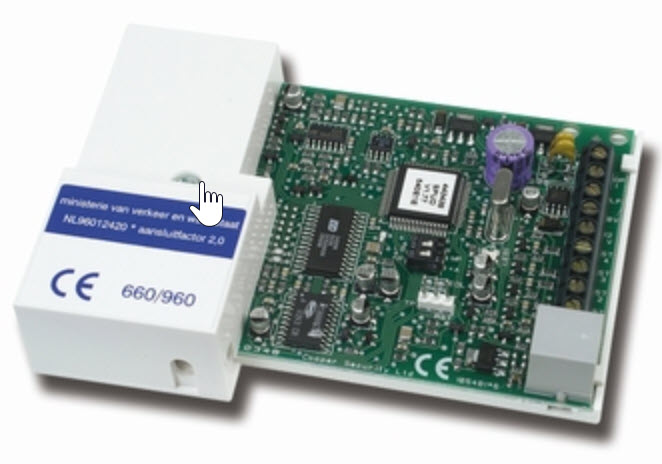

<!--s_name-->
# Phone_dialer

<!--e_name-->

## Summary

<!--s_role-->
<!--e_role-->

<!--s_descr-->
This is the driver to an old fashioned phone dialer to deliver preset voice messages in case of fire, alarm or loss of internet or power

<!--e_descr-->

This is an interface to a (now old fashioned) phone dialer unit - scantronic type 660, or any other type where you can pre-register voice messages and link them to a list of phone numbers do dial.
These phone numbers are dialed and the messages played when a corresponding tripwire (one out of 4) is triggered.

When you receive such a call, you can acknowledge the voice message by pressing the 5 key on your phone, then the dialing stops as otherwise the next number on the list is processed.

Such a phone dialer is mainly used to notify important issues when you are not around at your home.

Alternatively [sms](Sms_driver.md) notifications works as an modern alternative, but for those people who prefer to receive a call, here is it!



<!--s_tbl-->
## List of [properties](Properties.md) for __Phone_dialer__:

  | Property | Validation | Optional? | Repeat? | Description |
  | --- | --- | --- | --- | --- |
  | fav | str | True | - | is this a favorite element | 
  | icon | str | True | - | icon file for this element | 
  | pho_input | Input | True | - | Dialer input virtual, the dial sequence is stopped with key 5 on the receiver phone | 
  | pho_say_burglar | Output | False | - | Dialer to invoke in case of a burglar alarm, the dial sequence is stopped with key 5 on the receiver phone | 
  | pho_say_fire | Output | False | - | Dialer to invoke in case of fire, the dial sequence is stopped with key 5 on the receiver phone | 
  | pho_say_internet_lost | Output | False | - | Dialer to invoke in case the internet is lost, the dial sequence is stopped with key 5 on the receiver phone | 
  | pho_say_power_lost | Output | False | - | Dialer to invoke in case of electricity power interruption, the dial sequence is stopped with key 5 on the receiver phone | 
<!--e_tbl-->

## Example phone_dialer

The 4 inputs of the phone dialer are used to signal burglar alarm, fire alarm, internet or power is down.

When the internet is down and and the home is occupied, then the dialer is ignored as you will notice this anyway or you are not interested because you are sleeping.

<!--s_insert_{"tree":"(o:Phone_dialer)"}-->

from project.py tree:(o:Phone_dialer)
```python3
# --> project.py :<dk:project,o:Project,kw:property,o:House,kw:places,dk:office,o:Room,kw:contents,lp:9,o:Phone_dialer>

from lucy_app import *

Phone_dialer(
    pho_input = Input(active = 0,notifications = {"active":Log(txt='Phone Dialer Input is triggered!', ceiling=None)},path = "unipi:PI-Stats,input,1"),
    pho_say_burglar = Output(duration = 40,effect_virtuals = {
                    "is_burglar":Virtual(
                            duration = 2,
                            play = Effect(maker='self', condition='become_active', effect='make_active', taker='parent', delay=None, duration=None))},path = "unipi:PI-Stats,relay,3"),
    pho_say_fire = Output(duration = 40,effect_virtuals = {
                    "is_fire":Virtual(
                            duration = 2,
                            play = Effect(maker='self', condition='become_active', effect='make_active', taker='parent', delay=None, duration=None))},path = "unipi:PI-Stats,relay,1"),
    pho_say_internet_lost = Output(duration = 40,effect_virtuals = {
                    "internet_lost":Virtual(
                            duration = 2,
                            effect_virtuals = {
                                    "home_occupancy":Virtual_R(
                                            descr_range = ["Day","Away","Sleep","Holiday"],
                                            digital_range = [0,1,2,3],
                                            play = Effect(maker='self', condition=[0, 2], effect='inactive_freeze', taker='parent', delay=None, duration=None))},
                            play = Effect(maker='self', condition='become_active', effect='make_active', taker='parent', delay=None, duration=None))},path = "unipi:PI-Stats,relay,2"),
    pho_say_power_lost = Output(duration = 40,effect_virtuals = {
                    "power_flag":Virtual(
                            play = Effect(maker='self', condition='become_active', effect='make_active', taker='parent', delay=None, duration=None))},path = "unipi:PI-Stats,relay,4"),
    role_me = "PI-Stats")

```

<!--e_insert-->
