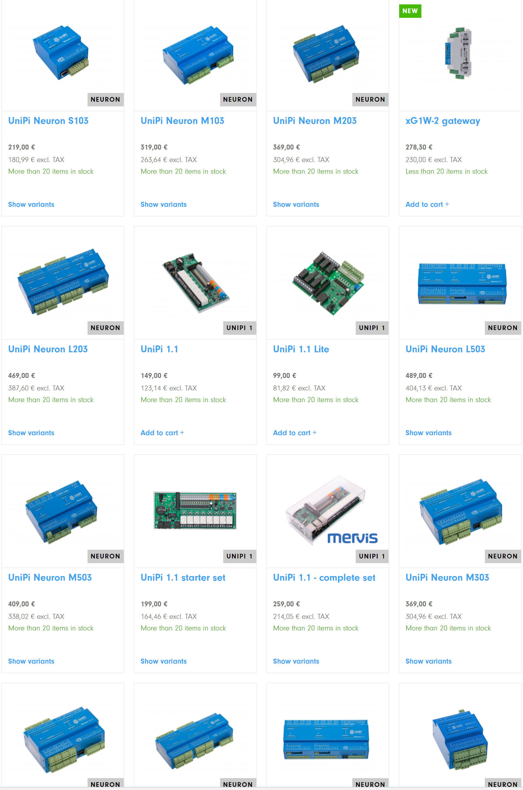
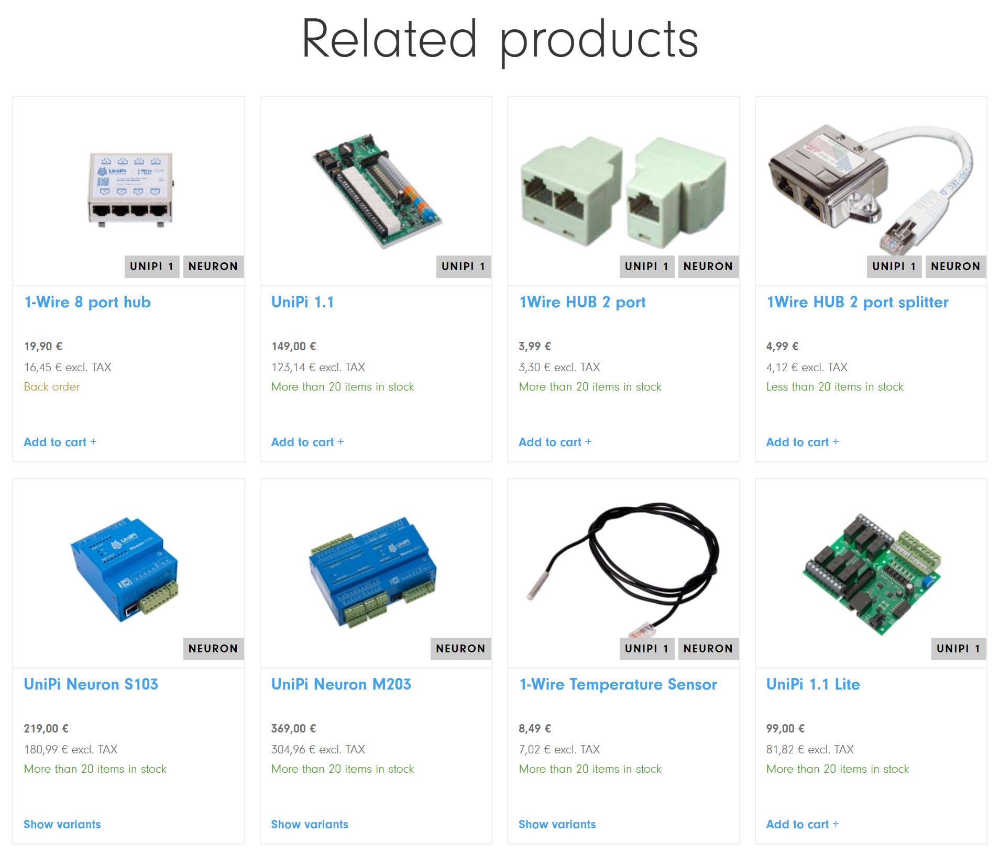

<!--s_name-->
# Unipi_driver

<!--e_name-->

## Summary

<!--s_role-->
<!--e_role-->

<!--s_descr-->
Reads and writes binary and analog inputs and outputs on the unipi and neutron hats using evok, see http://www.unipi.technology

<!--e_descr-->

UniPi is a raspberry hat from UniPi Technologies : https://www.unipi.technology

Unipi has different models some including a galvanic separated 1 wire interface, ideally for temperature and other sensors.



For UniPi, the pin numbers go from 0 to the number of inputs and outputs and the system automatically assigns input or output type based on the analog or digital type of device.

Unipi has a range of sensors and 1 wire installation hardware.



These 1 wire sensors or  wire devices have to be defined in app_data.conf

You can give them a label and the raspberry to which they are connected over 1 wire.

For more information on how to use UniPi, see [things](Things.md) and [path](Path.md).

To reset the driver, use:

```
sudo service evok restart
```

<!--s_tbl-->
## List of [properties](Properties.md) for __Unipi_driver__:

  | Property | Validation | Optional? | Repeat? | Description |
  | --- | --- | --- | --- | --- |
  | fav | str | True | - | is this a favorite element | 
  | icon | str | True | - | icon file for this element | 
<!--e_tbl-->

