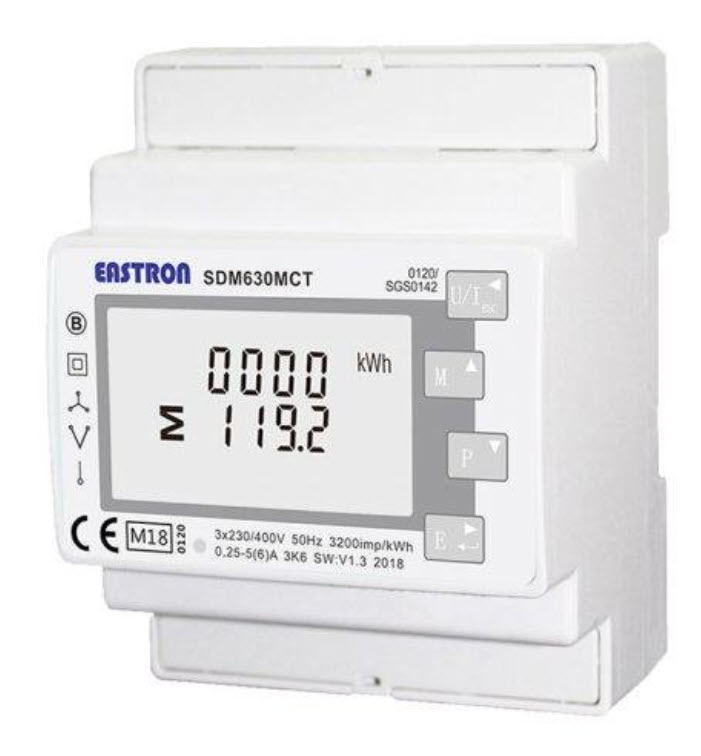

<!--s_name_utilities-->
# Utilities

<!--e_name_utilities-->

<!--s_role_utilities-->
<!--e_role_utilities-->

<!--s_descr_utilities-->
Dictionary of utilities with a designated thingscontroller to manage

<!--e_descr_utilities-->


## Summary

<!--s_sub_toc_ut-->

Consumption and production of utilities such as gas, water and electricity become every more important personal aspects in the dealing with climate change.
Therefore, Lucy contains a simple, yet powerful app to manage and report on utilities with real time decision capabilities.

The minimum is to measure and report on utility production and consumption and for this a Meter thing and an Utility app are the basis.
Obviously the capability of storage of the utility must exist, such as rain water in a tank, or electricity in a battery.

Utilities carry a rate that can be dependent on various factors such as the time of day, weekdays or even if the effect is coming in (f.i. buying electricity from the grid)
or out (a different rate for electricity going in the grid).

Utilities can be defined with the usage and the intensity (kWh / kW for electricity or m3 / °C for hot water), and both factors must be comprehended.

Sometimes complex real time decisions have to be taken, imagine the case of heating an outdoor swimming pool either with a gas_boiler (requiring gas) or alternatively with a heat_pump (requiring electricity) and where the electricity can come from solar panels or from the grid.
Obviously if the solar panels produce plenty, your batteries are full and the rate for producing for the grid is low, using the heat pump makes sense.
Alternatively when it is ice-cold outside during the night (no solar and low heat-pump efficiency), then the gas_boiler is the best option. 
Anything between these extreme cases require careful consideration and automatic switching from one heating mode to another. 

Another complex case exists where you need irrigation for your garden, and you need to select one of 3 potential sources: collected rain water (cheap but limited to you tank), ground water (pump and water quality) or purchased city water (expensive and not always possible because of restrictions during drought). 

So an important factor is when to load or discharge your utility storage (battery)?
When your car has a vehicle to grid capability, you don't want your car battery to be empty when you have to leave for a long trip.

How can this all be managed automatically without you having to resort to several phone apps, and your precious time being wasted on control?
You want to live a life where the right things happen with your utilities and infrastructure while you can focus on living your life with the comfort of them instead? 

See and be surprised what Lucy can do with utility management!

<!--e_sub_toc_ut-->

## Utilities Example

In the below example you find the definition of electricity, gas, collected and domestic water.
Utilities are defined through a certain topology (grid or pipe) and nodes.

Topology type grid is typical for an electricity utility and pipe for liquids.

A node is an entity that either takes (effect="-") or adds (effect="+") or does do both and can be a member of another node to establish hierarchy in a pipe topology.

Every utility can have a fake meter, this is a meter where the value is determined by computation by adding all meters with their effect together and the fake meter then receives the result.

Two other aspects of a node equipped with a meter exists: The unit of measurement, and the rate as you notice in the example below.

<!--s_insert_{"tree":"(o:Utilities)"}-->

from project.py tree:(o:Utilities)
```python3
# --> project.py :<dk:project,o:Project,kw:property,lp:0,o:House,kw:utilities,o:Utilities>

from lucy_app import *

Utilities(
    items = {
            "collected_water":Utility(
                    description = "rain water, supplemented with ground water for the pool, irrigation and toilets",
                    nodes = {
                            "irrigation":Meter(
                                    effect = "-",
                                    i_read = "L",
                                    member_of = ["tank_outflow"],
                                    path = "_:PI-Energy",
                                    where2find = "pool_house"),
                            "pool_topup":Fake_meter(effect = "-",i_read = "L",member_of = ["tank_outflow"]),
                            "rain_domestic_use":Meter(
                                    effect = "-",
                                    i_read = "L",
                                    member_of = ["tank_outflow"],
                                    path = "unipi:PI-RearDoor,input,11",
                                    where2find = "garage"),
                            "tank_outflow":Meter(
                                    effect = "+",
                                    i_read = "L",
                                    path = "_:PI-Energy",
                                    rate_fictive = {"00:00":1.0},
                                    where2find = "pool_house")},
                    scenes = ,
                    storage = {
                            "rain_tank":Utility_storage(
                                    availability = Sensor(
                                            high = 90,
                                            i_read = "%",
                                            low = 5,
                                            notifications = {
                                                    "high":[
                                                        Mail(subject='Rain storage tank is full {thing_state}', to='{prime}', cams=None, cam_groups=None, passes=0, body_file='', files2mail=None, ceiling=None),
                                                        Say(txt='{tts_start} rain storage tank is full again{tts_end}', ceiling='1/day', times=1, override=None, volume=None)],
                                                    "low":[
                                                        Mail(subject='Rain storage tank is empty {thing_state}', to='{prime}', cams=None, cam_groups=None, passes=0, body_file='', files2mail=None, ceiling=None),
                                                        Say(txt='{tts_start}the rain storage tank is empty, where is the rain?{tts_end}', ceiling='1/day', times=1, override=None, volume=None)]},
                                            path = "_:PI-Pool"),
                                    fill_up = [
                                        Output(path = "unipi:PI-RearDoor,relay,3"),
                                        Output(path = "unipi:PI-RearDoor,relay,4"),
                                        Output(path = "unipi:PI-RearDoor,relay,3"),
                                        Output(path = "unipi:PI-RearDoor,relay,4")],
                                    size = 13)},
                    topology = "pipe",
                    unit = {"L":0.001,"format":".XXX","m3":1}),
            "domestic_water":Utility(
                    nodes = {
                            "cold_water":Fake_meter(effect = "-",i_read = "L",member_of = ["purchased_water"]),
                            "heated_water":Meter(
                                    effect = "-",
                                    i_read = "L",
                                    member_of = ["purchased_water"],
                                    method_things = {
                                            "sensor":Sensor(i_read = "°C",path = "unipi:PI-Climate,ow,287B4A740600005D,DS18B20,,92")},
                                    path = "unipi:PI-Climate,input,6",
                                    place = "boiler_room",
                                    rate_fictive = {"00:00":7.925},
                                    where2find = "above the heating"),
                            "pidpa":Meter(
                                    effect = "+",
                                    i_read = "m3",
                                    owned_by = "pidpa",
                                    path = "ean:PI-Climate,,43828915,XXXXX,0"),
                            "pool_fill":Meter(
                                    effect = "-",
                                    i_read = "L",
                                    member_of = ["purchased_water"],
                                    path = "unipi:PI-Climate,input,8",
                                    place = "boiler_room",
                                    where2find = "facing the entry doors"),
                            "purchased_water":Meter(
                                    effect = "+",
                                    i_read = "L",
                                    notifications = {
                                            "sum_hour>=10.5":[
                                                Say(txt='{tts_start} whoa, that was a lot of water consumed last hour{tts_end}', ceiling=None, times=1, override=None, volume=None)],
                                            "sum_weekday[67]>=20":[
                                                Say(txt='{tts_start} whoa, that was a lot of water consumed in the weekend day{tts_end}', ceiling=None, times=1, override=None, volume=None)]},
                                    path = "unipi:PI-Climate,input,5",
                                    place = "boiler_room",
                                    rate = {"00:00":3.11},
                                    where2find = "next to the water softener")},
                    topology = "pipe",
                    unit = {"L":0.001,"format":".XXX","m3":1}),
            "electricity":Utility(
                    nodes = {
                            "car_charger":Meter(
                                    effect = "-+",
                                    i_read = "kWh",
                                    method_things = {
                                            "minus_meter":Meter(i_read = "kWh",path = "modbus:car_energy,EnergyImported_kWh"),
                                            "plus_meter":Meter(i_read = "kWh",path = "modbus:car_energy,EnergyExported_kWh"),
                                            "sensor":Sensor(i_read = "W",path = "modbus:car_energy,Tot_W")},
                                    path = "modbus:car_energy,Tot_kWh",
                                    place = "boiler_room",
                                    where2find = "bord4"),
                            "external_connector":Meter(
                                    effect = "-+",
                                    i_read = "kWh",
                                    method_things = {
                                            "minus_meter":Meter(i_read = "kWh",path = "modbus:generator,EnergyImported_kWh"),
                                            "plus_meter":Meter(i_read = "kWh",path = "modbus:generator,EnergyExported_kWh"),
                                            "sensor":Sensor(i_read = "W",path = "modbus:generator,Tot_W")},
                                    path = "modbus:generator,Tot_kWh",
                                    place = "garden_houses",
                                    where2find = "pool_house -> bord5"),
                            "fluvius_day":Meter(
                                    effect = "+-",
                                    i_read = "kWh",
                                    owned_by = "fluvius",
                                    path = "ean:PI-Energy,541448820048316727,4117-Piek,XXXXXX00,0",
                                    place = "garage_dressing",
                                    where2find = "bord1"),
                            "fluvius_night":Meter(
                                    effect = "+-",
                                    i_read = "kWh",
                                    owned_by = "fluvius",
                                    path = "ean:PI-Energy,541448820048316727,4117-Dal,XXXXXX00,0",
                                    place = "garage_dressing",
                                    where2find = "bord1"),
                            "house_usage":Fake_meter(effect = "-",i_read = "kWh",method_things = {
                                            "fake_sensor":Fake_sensor(i_read = "W")}),
                            "mains_power":Meter(
                                    effect = "+-",
                                    i_read = "kWh",
                                    method_things = {
                                            "minus_meter":Meter(i_read = "kWh",path = "modbus:main_energy,EnergyImported_kWh"),
                                            "plus_meter":Meter(i_read = "kWh",path = "modbus:main_energy,EnergyExported_kWh"),
                                            "sensor":Sensor(i_read = "W",path = "modbus:main_energy,Tot_W")},
                                    path = "modbus:main_energy,Tot_kWh",
                                    place = "garage_dressing",
                                    rate = {"+":{"weekday":{"12345":{"00:00":3.0,"07:00":4.0,"22:00":3.0},"67":{"00:00":3.0}}},"-":-0.5},
                                    where2find = "bord1"),
                            "pool_usage":Meter(
                                    effect = "-",
                                    i_read = "kWh",
                                    method_things = {
                                            "sensor":Sensor(i_read = "W",path = "modbus:pool_energy,Tot_W")},
                                    path = "modbus:pool_energy,Tot_kWh",
                                    place = "boiler_room",
                                    where2find = "bord4"),
                            "solar_power":Meter(
                                    effect = "+",
                                    i_read = "kWh",
                                    method_things = {
                                            "sensor":Sensor(i_read = "W",path = "modbus:solar_energy,Tot_W")},
                                    path = "modbus:solar_energy,Tot_kWh",
                                    place = "boiler_room",
                                    rate = {"00:00":0.0},
                                    where2find = "bord2")},
                    scenes = ,
                    storage = {
                            "car_battery":Utility_storage(occupancy = Sensor(
                                            high = 90,
                                            i_read = "%",
                                            low = 15,
                                            notifications = {
                                                    "high":[
                                                        Mail(subject='Car is {thing_state} charged', to='{prime}', cams=None, cam_groups=None, passes=0, body_file='', files2mail=None, ceiling=None),
                                                        Say(txt='{tts_start} Car is fully charged{tts_end}', ceiling='1/day', times=1, override=None, volume=None)],
                                                    "low":[
                                                        Mail(subject='Car battery is empty {thing_state}', to='{prime}', cams=None, cam_groups=None, passes=0, body_file='', files2mail=None, ceiling=None)]},
                                            path = "_:PI-Energy"),size = 75)},
                    topology = "grid",
                    unit = {"MWh":1000000.0,"Wh":0.001,"format":".XX","kWh":1.0}),
            "gas":Utility(
                    nodes = {
                            "cooking":Fake_meter(effect = "-",i_read = "m3"),
                            "heating":Meter(
                                    effect = "-",
                                    i_read = "m3",
                                    path = "unipi:PI-Climate,input,7",
                                    place = "boiler_room",
                                    rate = {"00:00":9.99},
                                    where2find = "above the heating"),
                            "purchased_gas":Meter(
                                    effect = "+",
                                    i_read = "m3",
                                    owned_by = "fluvius",
                                    path = "ean:PI-Climate,41448820048316734,6237,XXXXX.x,0")},
                    topology = "pipe",
                    unit = {"conversion":{"m3":0.4078},"format":".XX","kwh":1.0}),
            "ground_water":Utility(
                    description = "ground water, pumped up for filling the raintank or irrigation use",
                    nodes = {
                            "irrigation":Meter(
                                    effect = "-",
                                    i_read = "L",
                                    member_of = ["pump_outflow"],
                                    path = "_:PI-Pool",
                                    where2find = "pool_house"),
                            "pump_outflow":Meter(
                                    effect = "+",
                                    i_read = "L",
                                    path = "unipi:PI-RearDoor,input,10",
                                    rate_fictive = {"00:00":1.0},
                                    where2find = "garage"),
                            "rain_tank_topup":Fake_meter(effect = "-",i_read = "L",member_of = ["pump_outflow"])},
                    scenes = ,
                    topology = "pipe",
                    unit = {"L":0.001,"format":".XXX","m3":1})},
    notifications = {
            "daily_cost":Mail(subject='Utility Report{app_txt}', to='{prime}', cams=None, cam_groups=None, passes=0, body_file='', files2mail=None, ceiling=None),
            "monthly_cost":Mail(subject='Monthly Utility Report{app_txt}', to='{prime}', cams=None, cam_groups=None, passes=0, body_file='', files2mail=None, ceiling=None),
            "weekly_cost":Mail(subject='Weekly Utility Report{app_txt}', to='{prime}', cams=None, cam_groups=None, passes=0, body_file='', files2mail=None, ceiling=None),
            "yearly_cost":Mail(subject='Yearly Utility{app_txt}', to='{prime}', cams=None, cam_groups=None, passes=0, body_file='', files2mail=None, ceiling=None)},
    role_me = "PI-Energy")

```

<!--e_insert-->


## Meter examples

Some beautiful products exist for measuring electricity and water/gas




<!--s_tbl_utilities-->
## List of [properties](Properties.md) for __Utilities__:

  | Property | Validation | Optional? | Repeat? | Description |
  | --- | --- | --- | --- | --- |
  | fav | str | True | - | is this a favorite element | 
  | icon | str | True | - | icon file for this element | 
  | items | *Utility | False | True | dict of utility items | 
  | notifications | ['daily_cost', 'monthly_cost', 'weekly_cost', 'yearly_cost'] | True | - | notifications, see [__Notifier__](Notifier.md) | 
  | role_me | {tc} | False | - | role_me of 'Utilities', adds <utilities> to the roles of the specified tc | 

## List of [Notifications](Notifier.md) for  __Utilities__:

  | Notification Suffix | When invoked? |
  | --- | --- | 
  | daily_cost | daily cost reporting | 
  | monthly_cost | monthly cost reporting | 
  | weekly_cost | weekly cost reporting | 
  | yearly_cost | yearly cost reporting | 

## List of [Errors/Warnings](Error_Warn.md) for  __Utilities__:

  | Error/Warning ID | Error/Warning MSG | Occurring When? |
  | --- | --- | --- | 
  | err_mtr_attr | !!Meter <{}> has {:} not in {:} |  
  | err_storage_measure | !!Utility Storage <{}>: either availability OR occupancy, yet: {:} |  
<!--e_tbl_utilities-->


<!--s_name_utility-->
# Utility

<!--e_name_utility-->

<!--s_descr_utility-->
An utility description with meters, sensors, costs, scenes

<!--e_descr_utility-->

<!--s_tbl_utility-->
## List of [properties](Properties.md) for __Utility__:

  | Property | Validation | Optional? | Repeat? | Description |
  | --- | --- | --- | --- | --- |
  | description | str | True | - | free text to identify your utility, will be used in reports and notifications | 
  | fav | str | True | - | is this a favorite element | 
  | icon | str | True | - | icon file for this element | 
  | nodes | ['Meter', 'Fake_meter'] | True | True | nodes in the utility topology where meters are placed to measure usage. To measure intensity in the nodes, use method_things attribute of the meter to add sensors | 
  | scenes | dict | True | True | scenes that can be called in effect scenarios | 
  | sensors | *Sensor | True | - | sensors measuring the utility intensity such as power (watts) for electricity or °C of heated water, preferably use sensors as method_things attached to the meters as they are embedded into the nodes concept | 
  | storage | *Utility_storage | True | True | a tank or battery type storage for storage of utility | 
  | topology | valid_list | False | - | topology is either 'grid' (such as electricity) or 'pipes' (such as water) | 
  | unit | dict | False | - | by default it defines the unit for meters, but you can also specify the unit for the sensors, see the examples of what is possible | 
<!--e_tbl_utility-->

<!--s_name_utility_storage-->
# Utility_storage

<!--e_name_utility_storage-->

<!--s_descr_utility_storage-->
An utility storage such as a battery or a water tank

<!--e_descr_utility_storage-->

<!--s_tbl_utility_storage-->
## List of [properties](Properties.md) for __Utility_storage__:

  | Property | Validation | Optional? | Repeat? | Description |
  | --- | --- | --- | --- | --- |
  | availability | *Sensor | True | - | availability of the storage in %, whereby 100% is empty and 0% is full.  Use either availability OR occupancy, use of both is not allowed | 
  | description | str | True | - | free text to identify your utility storage, will be used in reports and notifications | 
  | drain_out | *Output | True | - | the storage will drain out when this thing is active | 
  | fav | str | True | - | is this a favorite element | 
  | fill_up | *Output | True | - | the storage will fill up when this thing is active | 
  | icon | str | True | - | icon file for this element | 
  | occupancy | *Sensor | True | - | occupancy of the storage in %, whereby 0% is empty and full is 100%.  Use either occupancy OR availability, use of both is not allowed | 
  | size | float | False | - | size of the storage in the utility base unit | 
<!--e_tbl_utility_storage-->


* * * 
* * * 
# Power & Utility Charges : Reporting Example

* * * 

  <--s_insert_{"role":"utilities","suffix":"pwr"}-->


  <--e_insert-->

