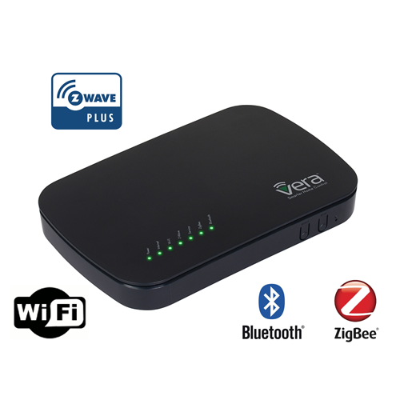
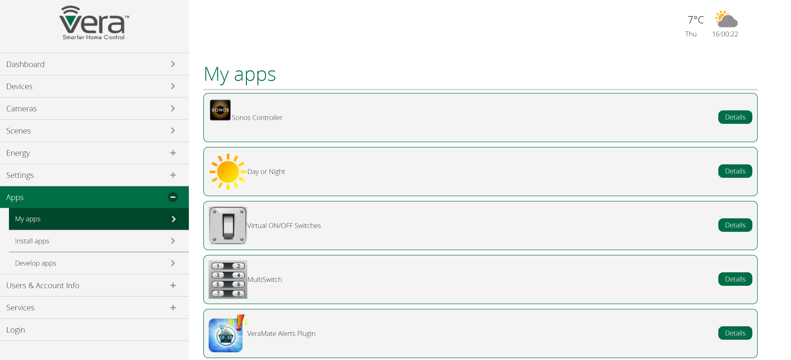
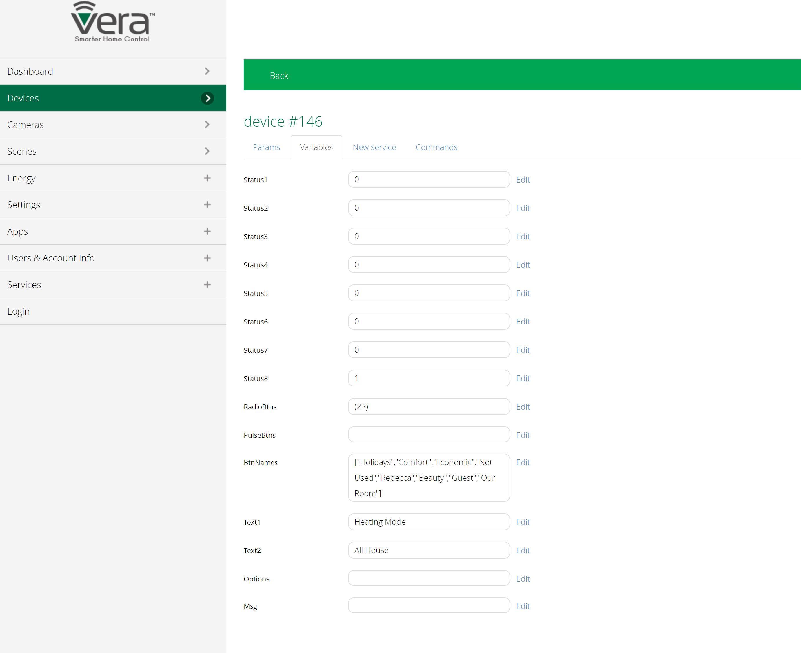
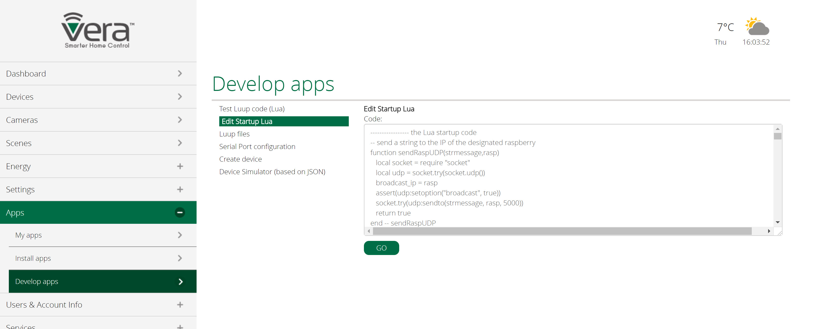

<!--s_name-->
# Vera_driver

<!--e_name-->

<!--s_role-->
<!--e_role-->

## Summary

<!--s_descr-->
The driver to vera devices used for zwave communications and the scene's used for voice triggering.  Vera has the most complete and open zwave and zigbee gateway on the market, supporting the most diverse zwave things

<!--e_descr-->

This driver integrates one or multiple Vera bridges that will be programmatic-ally controlled.



<!--s_sub_toc_vera-->

Vera Controls makes one of the most versatile gateways which are compatible with an extraordinary range of zwave, zigbee and bluetooth devices that this gateway can cover.

Instead of creating a big list of possible devices compatible with Lucy, better and smarter is to leverage on what exists within vera plus as it is already the broadest in the market.

When you purchase the veraplus gateway, make sure you obtain the zwave plus version for your region (US, Europe,..).

Create a free login at veracontrol http://getvera.com/controllers/veraplus and add all your devices, screens, curtains, etc.

Lucy contains some example scripts to trigger the feeder from scenes or to synchronize settings.

Define your veraplus as a Zwave() device in the raspi option in your Home Configuration File. 

Any mobile app that works with vera can be used to make the right setup.  
A good one to mention is VeraMate, available in the apple store.

<!--e_sub_toc_vera-->

## Design Limitation

Currently only one Vera() device can be defined or an error message is generated during parsing.
Vera devices return a lot of data when scanned, and multiple vera's would make light_manager and security unresponsive.


## Name Matching, Lights and Rooms

For Lucy to have full control on all Vera configured devices and scenes, they need to be the same and the room names have to be the same too.
Start by ensuring that the room names in Vera match the first 2 words of the room_say definition for rooms in site.conf

By defining the bridges as raspi Zwave() objects and lights with vera or zw pin codes (see example below), Lucy can manage these devices as any other input or output related device under control. 

Only the vera categories "Dimmable Switch" or "On/Off Switch" are considered and linkable to Lucy devices, the other categories are ignored.

Scene's are also mapped to the rooms and when labeled "success", then they can be defined in the vera_driver with their scene number.

To facilitate matching identifiers, a report is produced by the ight_manager raspberry, see [__light_manager__](light_manager.md) which shows what the issues are (if any) and what is a match.
Below you find an example of such a report.
Just make sure you use small caps for the device names in vera, and spaces will be converted to underscores automatically

Also look at the configuration example below at vera_driver where vera_close_curtains has vera_pars (scene) 48, the same as the id in the parsing report for close_curtains.
This is how scenes are mapped between the 2 environments.

So Vera scenes can be defined in the vera_driver and then used in the vera_active/vera_normal notification declarations as in the example with curtains.

All vera devices that are in "determined rooms" and have category Switch or Dimmable Switch are automatically recognized.

House occupancy mode in vera is set by Lucy through the command vera_house_mode.

All raspberry's needing io's from Vera do the reading in regular intervals or set the value of devices and this is automatically determined on the role and the pin's of the devices where vera or zw is mentioned.

The core parameter 'driver_scan_rate' determines the relative speed of the different drivers (hue to ikea to vera) and Vera reading is set to the slowest speed.

## RGBW lights

To make use of the vera RGBController for color led strips, you can use a multiple of zwave RGB controllers (such as the popular Fibaro RGBW controller).
Install a plugin into vera, see the instructions in [https://github.com/vosmont/Vera-Plugin-RGBController](https://github.com/vosmont/Vera-Plugin-RGBController)

Similar to Hue lamps you can specify one of the animations (case sensitive) : "Fireplace", "Aurora", "LAPD", "Rainbow", "Storm" in value_logic.
You can also specify one of the standard colors, such as red, green, blue, yellow and magenta, or you specify the desired color as 3 hex pairs values preceded with a hash for the intensity of red, green and blue. 

See the following example of the rgb_c_veranda light whereas animation and one hash color (full red, half green and no blue) is used.

<!--s_insert_{"tree":"(dk:veranda).*(o:Lights)"}-->

from project.py tree:(dk:veranda).*(o:Lights)
```python3
# --> project.py :<dk:project,o:Project,kw:property,lp:0,o:House,kw:places,dk:veranda,o:Room,kw:contents,lp:7,o:Lights>

from lucy_app import *

Lights(my_assistant = True,room_lights = {
            "veranda_color":Color_light(
                    my_assistant = True,
                    path = "vera:Vera_plus,veranda_color",
                    usage = {"watts":12},
                    value_logic = {
                            "assign":{
                                    "00:00":C_state(brightness=0, scene='', color=''),
                                    "away":C_state(brightness=5, scene='', color='red'),
                                    "sleep":C_state(brightness=5, scene='', color='red'),
                                    "sunset":C_state(brightness=10, scene='Rainbow', color=''),
                                    "sunset+01:00":C_state(brightness=5, scene='', color='#FFFFFF')}}),
            "veranda_main_light":Dim_light(
                    copy_things = {
                            "carbon_copy":Dim_light(path = "shelly:192.168.15.81,2",usage = {"watts":24})},
                    method_things = {
                            "toggle_button":Button(active = 0,path = "unipi:PI-Veranda,input,10")},
                    path = "unipi:PI-Veranda,ao,1",
                    usage = {"watts":24},
                    value_logic = {"assign":{"00:00":"15","is_armed":"0","sunrise":"0","sunset":"35","sunset-01:00":"25"}})})

```

<!--e_insert-->

The traditional color are also supported : "red","green","yellow","blue","magenta","cool_white","warm_white"

<!--s_tbl-->
## List of [properties](Properties.md) for __Vera_driver__:

  | Property | Validation | Optional? | Repeat? | Description |
  | --- | --- | --- | --- | --- |
  | alexa_cmds | dict | True | - | these become voice commands for Alexa by the security role pi sent to vera | 
  | fav | str | True | - | is this a favorite element | 
  | icon | str | True | - | icon file for this element | 
  | notifications | ['vera_parsing'] | True | - | extensive list of notifications, see [__Notifier__](Notifier.md) | 
  | vera_cmds | dict | False | - | the vera control commands - need to be mapped with the scene/device number used within Vera | 
  | vera_port | int | False | - | the port for access to the vera device | 

## List of [Notifications](Notifier.md) for  __Vera_driver__:

  | Notification Suffix | When invoked? |
  | --- | --- | 
  | vera_parsing | when this report runs | 

## List of [Errors/Warnings](Error_Warn.md) for  __Vera_driver__:

  | Error/Warning ID | Error/Warning MSG | Occurring When? |
  | --- | --- | --- | 
  | err_vera_cms | !!Vera cmd Unknown <{:}> |  
  | err_vera_devnr | !!vera device_nr=<{:}> dissapeared -> name={:} |  
  | err_vera_fail | !!Vera cmd Failure <{:}> {:} {:} |  
  | err_vera_input | !!Vera luup/cmds in obj/main failed <{:}> |  
  | err_vera_pars | !!Alexa {:} command for Vera {:} = {:}, does not exist |  
  | err_vera_path | !!vera path error {:}: {:} |  
  | err_vera_scene | !!vera value_logic error for <{:}> in {:}, error = {:} |  
  | err_zw_path | !!zw path error {:}: {:} |  
  | msg_vera_cmd | Vera cmd <{:}>... |  
<!--e_tbl-->

## Example Configuration

In the example below there is 1 veraplus gateway defined Zwave() located in the office with 8 lights, observe the pin definition of these lights and the value_logic definitions.

Scene's can be defined in the vera gateway, and they are named and mapped in the vera driver to vera objects __Vera_cmd__ where the vera type and parameters are defined.  

Subsequently these scene names can be used in vera notifications as you can observe in the security interface to open/close curtains based on the status change of a flag. 

<!--s_insert_{"tree":["(o:Vera_driver)","(dk:garage).*(o:Lights)","(dk:hall.ground).*(o:Lights)","(dk:living_lounge).*(o:Lights)","(dk:master_bed).*(o:Lights)","(dk:master_bath).*(o:Lights)","(dk:office).*(o:Lights)"]}-->

from project.py tree:['(o:Vera_driver)', '(dk:garage).*(o:Lights)', '(dk:hall.ground).*(o:Lights)', '(dk:living_lounge).*(o:Lights)', '(dk:master_bed).*(o:Lights)', '(dk:master_bath).*(o:Lights)', '(dk:office).*(o:Lights)']
```python3
# --> project.py :<dk:project,o:Project,kw:drivers,lp:11,o:Vera_driver>

from lucy_app import *

Vera_driver(
    alexa_cmds = {
            "Curtains":{"off":"vera_open_curtains","on":"vera_close_curtains"},
            "Screens":{"off":"vera_open_screens","on":"vera_close_screens"}},
    notifications = {
            "vera_parsing":Mail(subject='Vera Parsing', to='{prime}', cams=None, cam_groups=None, passes=0, body_file='vera', files2mail=None, ceiling=None)},
    vera_cmds = {
            "vera_clim_pars":Vera_cmd(log_nty = "Climatisation parameters received",vera_pars = ["82"],vera_type = "RunScene"),
            "vera_close_curtains":Vera_cmd(log_nty = "Vera closed curtains",vera_pars = ["48"],vera_type = "RunScene"),
            "vera_close_screens":Vera_cmd(log_nty = "Vera closed screens",vera_pars = ["117"],vera_type = "RunScene"),
            "vera_house_mode":Vera_cmd(log_nty = "Vera House Mode Set to {home_occ}",vera_pars = [""],vera_type = "SetHouseMode"),
            "vera_is_holiday":Vera_cmd(log_nty = "Holiday parameter received",vera_pars = ["78"],vera_type = "RunScene"),
            "vera_open_curtains":Vera_cmd(log_nty = "Vera opened curtains",vera_pars = ["49"],vera_type = "RunScene"),
            "vera_open_screens":Vera_cmd(log_nty = "Vera opened screens",vera_pars = ["116"],vera_type = "RunScene"),
            "vera_security_pars":Vera_cmd(log_nty = "Security parameters received",vera_pars = ["107"],vera_type = "RunScene")},
    vera_port = 3480)

# --> project.py :<dk:project,o:Project,kw:property,lp:0,o:House,kw:places,dk:garage,o:Room,kw:contents,lp:5,o:Lights>

from lucy_app import *

Lights(my_assistant = True,room_lights = {
            "garage_light":Light(effect_virtuals = {
                            "is_alarm":Virtual(
                                    play = Effect(maker='self', condition='become_active', effect='make_active', taker='parent', delay=None, duration=60)),
                            "is_reboot":Virtual(
                                    play = Effect(maker='self', condition='become_inactive', effect='make_inactive', taker='parent', delay=None, duration=None))},method_things = {
                            "is_on":Input(path = "unipi:PI-RearDoor,input,1",usage = {"watts":250})},path = "unipi:PI-Security,relay,7")})

# --> project.py :<dk:project,o:Project,kw:property,lp:0,o:House,kw:places,dk:hall.ground,o:Room,kw:contents,lp:2,o:Lights>

from lucy_app import *

Lights(my_assistant = True,room_lights = {
            "stairs_ledstrip":Color_light(
                    path = "hue:Hue_Bridge,stairs_ledstrip",
                    value_logic = {
                            "assign":{
                                    "00:00":C_state(brightness=50, scene='', color='yellow'),
                                    "12:00":C_state(brightness=75, scene='', color='green'),
                                    "away":C_state(brightness=0, scene='', color=''),
                                    "sleep":C_state(brightness=100, scene='', color='red'),
                                    "sunrise":C_state(brightness=35, scene='arctic_aurora', color=''),
                                    "sunset":C_state(brightness=35, scene='', color='yellow')}})})

# --> project.py :<dk:project,o:Project,kw:property,lp:0,o:House,kw:places,dk:living_lounge,o:Room,kw:contents,lp:2,o:Lights>

from lucy_app import *

Lights(my_assistant = True,room_lights = {
            "TV_ledstrip":Dim_light(
                    owned_by = "home_user",
                    path = "shelly:192.168.15.81,1",
                    usage = {"watts":12},
                    value_logic = {
                            "assign":{
                                    "08:30":"0",
                                    "18:00":"25",
                                    "19:00":"45",
                                    "20:00":"50",
                                    "21:00":"55",
                                    "22:00":"45",
                                    "23:00":"35",
                                    "is_armed":"0",
                                    "is_holiday":"0",
                                    "sunset-00:10":"35"}}),
            "christmas_tree":Light(
                    path = "vera:Vera_plus,christmas_tree",
                    value_logic = {"assign":{"00:00":"1","is_armed":"0","is_holiday":"0","sunrise+00:15":"0","sunset-00:10":"1"}}),
            "floor_candle":Dim_light(
                    path = "hue:Hue_Bridge,floor_candle",
                    usage = {"watts":15},
                    value_logic = {"assign":{"00:00":"0","22:30":"25","is_room_secure":"0","sunset-00:10":"50"}})})

# --> project.py :<dk:project,o:Project,kw:property,lp:0,o:House,kw:places,dk:master_bed,o:Room,kw:contents,lp:3,o:Lights>

from lucy_app import *

Lights(my_assistant = True,room_lights = {
            "bed_light":Color_light(
                    my_assistant = True,
                    path = "shelly:192.168.15.95,",
                    usage = {"watts":24},
                    value_logic = {
                            "assign":{
                                    "00:00":C_state(brightness=0, scene='', color=''),
                                    "17:00":C_state(brightness=25, scene='meteor_shower', color=''),
                                    "18:00":C_state(brightness=45, scene='meteor_shower', color=''),
                                    "19:00":C_state(brightness=100, scene='meteor_shower', color=''),
                                    "22:00":C_state(brightness=80, scene='', color='blue'),
                                    "is_holiday":C_state(brightness=0, scene='', color=''),
                                    "is_room_secure":C_state(brightness=0, scene='', color='')}}),
            "closet_RGB":Color_light(
                    path = "shelly:192.168.15.79,",
                    usage = {"watts":24},
                    value_logic = {
                            "assign":{
                                    "00:00":C_state(brightness=0, scene='', color=''),
                                    "17:00":C_state(brightness=5, scene='meteor_shower', color=''),
                                    "18:00":C_state(brightness=7, scene='meteor_shower', color=''),
                                    "19:00":C_state(brightness=10, scene='meteor_shower', color=''),
                                    "22:00":C_state(brightness=5, scene='', color='blue'),
                                    "is_holiday":C_state(brightness=0, scene='', color=''),
                                    "is_room_secure":C_state(brightness=0, scene='', color=''),
                                    "sleep":C_state(brightness=0, scene='', color='')}}),
            "dressing_wall_light":Light(
                    path = "shelly:192.168.15.67,",
                    usage = {"watts":2},
                    value_logic = {"assign":{"00:00":"0","17:00":"1","is_armed":"0","is_holiday":"0"}})})

# --> project.py :<dk:project,o:Project,kw:property,lp:0,o:House,kw:places,dk:master_bath,o:Room,kw:contents,lp:3,o:Lights>

from lucy_app import *

Lights(room_lights = {
            "bathroom_wall_light":Light(
                    path = "vera:Vera_plus,bathroom_wall_light",
                    usage = {"watts":2},
                    value_logic = {"assign":{"00:00":"1","17:00":"1","is_holiday":"0","is_room_secure":"0","sunrise":"0"}})})

# --> project.py :<dk:project,o:Project,kw:property,lp:0,o:House,kw:places,dk:office,o:Room,kw:contents,lp:5,o:Lights>

from lucy_app import *

Lights(my_assistant = True,room_lights = {
            "{room}^main_light":Light(path = "vera:Vera_plus,office^main_light",value_logic = {"assign":{"is_room_secure":"0"}}),
            "{room}^wall_light":Light(
                    path = "vera:Vera_plus,office^wall_light",
                    value_logic = {"assign":{"00:00":"1","is_room_secure":"0","sunrise":"0","sunset":"1"}}),
            "{room}_candle":Dim_light(path = "hue:Hue_Bridge,office_candle",value_logic = {"assign":{"00:00":"50","sunrise":"0","sunset":"50"}})})

```

<!--e_insert-->

Use of the vera id's in notifications, and the definition of the vera things_controller:

```
[GARAGE]
    security_system={ # extract... 
        "role_me":              "PI-Security",
        # **** Below are the special status flags, is_holiday does not imply that that alarm system is armed, this should be done separately
        "si_system_type":       Virtual_R("role",digital_range=[-1,0,1,2],description_r=["Slave","Alone","Master","Hybrid"]), # is self determined 
        "daily_routine":        Virtual("role", value_logic={"is_armed_partial":True,"is_day":"True","is_not_day":"False"}, properties={
                "vera_active":  "vera_open_curtains",
                "vera_normal":  "vera_close_curtains"}),            
        "is_burglar":           Virtual("role", properties={
            "vera_active":      "vera_open_curtains"}),
        "is_armed_partial":     Virtual("role", properties={       
            "wakeup_curtains":  Virtual("do_flag_follow", value_logic={"is_not_day":True}, properties={
                "vera_normal":  "vera_open_curtains"})})...
[OFFICE]
    things_controller={"Vera_plus":Vera(ip="192.168.15.75",color="white")}
```

## Multifunction and Virtual Buttons

Vera has multi buttons or virtual switches, see attached how to install.

   

These devices can be used to trigger io devices in Lucy through scenes and Lua udp messaging.

But the other direction is also possible, whereby Lucy set's or cancels a button based on the state of a flag, like in the example below with zw_active/zw_normal on the do_sonos flag.

Specifically for climate_control, activators can be defined that link room comfort or economy with a specific multi button. 

To know the number and key of the multi button, one has to look at the properties of the created multi button in the vera gateway portal.

   

<!--s_insert_{"tree":["(o:Notifier)","(dk:living_lounge).*(o:Climate)"]}-->

from project.py tree:['(o:Notifier)', '(dk:living_lounge).*(o:Climate)']
```python3
# --> project.py :<dk:project,o:Project,kw:apps,lp:4,o:Notifier>

from lucy_app import *

Notifier(
    buzzers = [
        Output(duration = 0.25,path = "piface:PI-Notify,do,1"),
        Output(duration = 0.25,path = "piface:PI-Notify3,do,1"),
        Output(duration = 0.25,path = "piface:PI-Notify4,do,1")],
    do_buzzers = Virtual(effect_virtuals = {
                    "do_say":Virtual(
                            play = Effect(maker='self', condition='i_change', effect='make_same', taker='parent', delay=None, duration=None))}),
    do_say = Virtual(
            copy_things = {
                    "twin_copy":Output(path = "zw:Vera_plus,v_switch,135,")},
            notifications = {"inactive":Ifttt(txt='do_say=off', ceiling=None)},
            value_logic = {"assign":{"00:00":"False","09:15":"True","22:30":"False","is_armed":"False","is_holiday":"False"}}),
    msg_dpls = ["PI-Notify","PI-Notify2","PI-Notify3","PI-Notify4"],
    notifications = {
            "say_log":Mail(subject='Speech Logging - {app_txt} new items', to=None, cams=None, cam_groups=None, passes=0, body_file='say_log', files2mail=None, ceiling=None),
            "timers":Mail(subject='Notify Timers', to='{prime}', cams=None, cam_groups=None, passes=0, body_file='tim', files2mail=None, ceiling=None)},
    role_me = "PI-Stats",
    tts_port = 88,
    tts_request = "http://{ip}:{port}/tts/{wav_file}.wav",
    tts_tags = {
            "tts_break":"<break time='1s'></break>",
            "tts_end":"</prosody>",
            "tts_loud":"<prosody volume='loud'><emphasis level='strong'>i repeat</emphasis></prosody>",
            "tts_prop":"<prosody rate='medium'>",
            "tts_repeat":"<prosody volume='loud'><emphasis level='strong'>i repeat</emphasis></prosody>,",
            "tts_slow":"<prosody rate='slow'>",
            "tts_start":"<prosody rate='medium'>Hi honey,"},
    tts_volume = 30)

# --> project.py :<dk:project,o:Project,kw:property,lp:0,o:House,kw:places,dk:living_lounge,o:Room,kw:contents,lp:3,o:Climate>

from lucy_app import *

Climate(
    clim_makers = {
            "dk_living_fan_dir":Clim_ANY(path = "daikin:DK_Living,f_dir",value_logic = {"assign":{"00:00":"2"}}),
            "dk_living_sp":Clim_SP(i_make = ['cold', 'warm'],method_things = {
                            "is_on":Input(path = "daikin:DK_Living,is_on")},path = "daikin:DK_Living,sp"),
            "r18_south_rear":Clim_SW(
                    i_make = ['warm'],
                    member_of = ["pump"],
                    method_things = {
                            "C_fluid":Sensor(i_read = "°C",path = "ow:PI-Climate,2870835F0700003B,DS18B20,,53")},
                    path = "unipi:PI-Climate,relay,13"),
            "r19_south_front":Clim_SW(
                    i_make = ['warm'],
                    member_of = ["pump"],
                    method_things = {
                            "C_fluid":Sensor(i_read = "°C",path = "ow:PI-Climate,28CC0560070000C4,DS18B20,,66")},
                    path = "unipi:PI-Climate,relay,6"),
            "r20_north_rear":Clim_SW(
                    i_make = ['warm'],
                    member_of = ["pump"],
                    method_things = {
                            "C_fluid":Sensor(i_read = "°C",path = "ow:PI-Climate,28835A600700006F,DS18B20,,72")},
                    path = "unipi:PI-Climate,relay,17"),
            "r21_rear":Clim_SW(
                    i_make = ['warm'],
                    member_of = ["pump"],
                    method_things = {
                            "C_fluid":Sensor(i_read = "°C",path = "ow:PI-Climate,286CCB5F070000CA,DS18B20,,47")},
                    path = "unipi:PI-Climate,relay,7")},
    clim_sensors = [
        Sensor(i_read = "°C",path = "ow:PI-Climate,28014BAF0400001D,DS18B20,,42"),
        Sensor(i_read = "°C",path = "daikin:DK_Living,h_temp",th_grp = "daikin"),
        Sensor(i_read = "%H",path = "daikin:DK_Living,h_humid",th_grp = "daikin")],
    clim_targets = {"cold_sp":{"preset":"cold_preset"},"warm_sp":{"preset":"warm_preset_1"}},
    my_assistant = True,
    room_is_priority = True,
    room_virtuals = {
            "{room}^clim_on":Virtual(copy_things = {
                            "twin_copy":Output(path = "zw:Vera_plus,buttonset,146,Status4")}),
            "{room}^clim_pref":Virtual_R(copy_things = {
                            "twin_copy@-1":Output(path = "zw:Vera_plus,buttonset,171,Status7"),
                            "twin_copy@1":Output(path = "zw:Vera_plus,buttonset,171,Status3")},descr_range = ["Economy","Standard","Comfort"],digital_range = [-1,0,1])})

```

<!--e_insert-->

## Vera Control Programming

The integration between Lucy and Vera is very functional but not very user friendly and much could be improved.

Some Lua code examples are included to extend vera to use vera mobile app as the home away control device for your home.

### Example Lua Code

In the attached example the Lua commands are listed that are manually attached to the scene's, and the overall Lua code that need to be pasted into Apps/Develop Apps/Edit Startup Lua.

This is an example that you can customize for your own needs.  Unfortunately the ip addresses of the raspberry's is hard coded and not retrieved from the site.conf file.

[vera scenes](../vera/Vera_Scenes.txt)


### How to program Lua startup code



* * * 
* * * 
# Example VERA Parsing Report

This parsing report below corresponds with the above configuration example as a real life example.

* * * 
* * * 

<!--s_insert_{"role":"light","suffix":"vera"}-->


[PI-Light_vera.html](PI-Light_vera.html)

<!DOCTYPE html><html><body><h1>Vera Analyzed -> PI-Light_vera.html  2020/06/19 00:00:38</h1><table><thead><tr><th>id</th><th>name</th><th style='text-align:center'>parse result</th><th style='text-align:center'>room group</th><th style='text-align:center'>category</th></tr></thead><tbody><tr><td style='background-color:cyan;text-align:center' colspan='5'>result of Vera rooms analyzed</td></tr><tr><td>10</td><td>Simulation</td><td style='text-align:center'>Success</td><td style='text-align:center'>-</td><td style='text-align:center'>-</td></tr><tr><td>13</td><td>Climate</td><td style='text-align:center'>Success</td><td style='text-align:center'>-</td><td style='text-align:center'>-</td></tr><tr><td>15</td><td>Security</td><td style='text-align:center'>Success</td><td style='text-align:center'>-</td><td style='text-align:center'>-</td></tr><tr><td>1</td><td>Office</td><td style='text-align:center'>Refused</td><td style='text-align:center'>office</td><td style='text-align:center'>-</td></tr><tr><td>2</td><td>Dining Room</td><td style='text-align:center'>Refused</td><td style='text-align:center'>living_dining</td><td style='text-align:center'>-</td></tr><tr><td>5</td><td>Hall</td><td style='text-align:center'>Refused</td><td style='text-align:center'>hall</td><td style='text-align:center'>-</td></tr><tr><td>6</td><td>Kings Bedroom</td><td style='text-align:center'>Refused</td><td style='text-align:center'>master_bed</td><td style='text-align:center'>-</td></tr><tr><td>7</td><td>Kings Bathroom</td><td style='text-align:center'>Refused</td><td style='text-align:center'>master_bath</td><td style='text-align:center'>-</td></tr><tr><td>8</td><td>Garden</td><td style='text-align:center'>Refused</td><td style='text-align:center'>garden</td><td style='text-align:center'>-</td></tr><tr><td>9</td><td>Beauty Room</td><td style='text-align:center'>Refused</td><td style='text-align:center'>beauty</td><td style='text-align:center'>-</td></tr><tr><td>11</td><td>Rebeccas Room</td><td style='text-align:center'>Refused</td><td style='text-align:center'>daughter_bath</td><td style='text-align:center'>-</td></tr><tr><td>12</td><td>Guest Room</td><td style='text-align:center'>Refused</td><td style='text-align:center'>guest</td><td style='text-align:center'>-</td></tr><tr><td>14</td><td>Kitchen</td><td style='text-align:center'>Refused</td><td style='text-align:center'>kitchen</td><td style='text-align:center'>-</td></tr><tr><td>16</td><td>Veranda</td><td style='text-align:center'>Refused</td><td style='text-align:center'>veranda</td><td style='text-align:center'>-</td></tr><tr><td style='background-color:cyan;text-align:center' colspan='5'>result of Vera categories analyzed</td></tr><tr><td>2</td><td>Dimmable Switch</td><td style='text-align:center'>Success</td><td style='text-align:center'>-</td><td style='text-align:center'>-</td></tr><tr><td>3</td><td>On/Off Switch</td><td style='text-align:center'>Success</td><td style='text-align:center'>-</td><td style='text-align:center'>-</td></tr><tr><td>8</td><td>Window covering</td><td style='text-align:center'>Success</td><td style='text-align:center'>-</td><td style='text-align:center'>-</td></tr><tr><td>1</td><td>Interface</td><td style='text-align:center'>Refused</td><td style='text-align:center'>-</td><td style='text-align:center'>-</td></tr><tr><td>11</td><td>Generic IO</td><td style='text-align:center'>Refused</td><td style='text-align:center'>-</td><td style='text-align:center'>-</td></tr><tr><td>14</td><td>Scene Controller</td><td style='text-align:center'>Refused</td><td style='text-align:center'>-</td><td style='text-align:center'>-</td></tr><tr><td>15</td><td>Audio/Video</td><td style='text-align:center'>Refused</td><td style='text-align:center'>-</td><td style='text-align:center'>-</td></tr><tr><td style='background-color:cyan;text-align:center' colspan='5'>result of Vera devices analyzed</td></tr><tr><td>24</td><td style='background-color:plum'>dressing_wall_light</td><td style='text-align:center'>Success</td><td style='text-align:center'>master_bed</td><td style='text-align:center'>On/Off Switch</td></tr><tr><td>26</td><td>dressingwall_light2</td><td style='text-align:center'>Success</td><td style='text-align:center'>master_bed</td><td style='text-align:center'>On/Off Switch</td></tr><tr><td>28</td><td style='background-color:plum'>bathroom_wall_light</td><td style='text-align:center'>Success</td><td style='text-align:center'>master_bath</td><td style='text-align:center'>On/Off Switch</td></tr><tr><td>32</td><td>bathroomwall_light2</td><td style='text-align:center'>Success</td><td style='text-align:center'>master_bath</td><td style='text-align:center'>On/Off Switch</td></tr><tr><td>37</td><td style='background-color:plum'>dressing_ventilation</td><td style='text-align:center'>Success</td><td style='text-align:center'>master_bed</td><td style='text-align:center'>On/Off Switch</td></tr><tr><td>39</td><td>?? Dimmer Licht 39</td><td style='text-align:center'>Success</td><td style='text-align:center'>living_dining</td><td style='text-align:center'>Dimmable Switch</td></tr><tr><td>40</td><td>not used dimmer</td><td style='text-align:center'>Success</td><td style='text-align:center'>master_bed</td><td style='text-align:center'>Dimmable Switch</td></tr><tr><td>44</td><td>office_candelar</td><td style='text-align:center'>Success</td><td style='text-align:center'>office</td><td style='text-align:center'>Dimmable Switch</td></tr><tr><td>60</td><td style='background-color:plum'>dressing ventilation</td><td style='text-align:center'>Success</td><td style='text-align:center'>master_bed</td><td style='text-align:center'>On/Off Switch</td></tr><tr><td>61</td><td>not used dimmer work</td><td style='text-align:center'>Success</td><td style='text-align:center'>office</td><td style='text-align:center'>Dimmable Switch</td></tr><tr><td>65</td><td>?? Dimmer Light 65</td><td style='text-align:center'>Success</td><td style='text-align:center'>living_dining</td><td style='text-align:center'>Dimmable Switch</td></tr><tr><td>70</td><td style='background-color:plum'>christmas_tree</td><td style='text-align:center'>Success</td><td style='text-align:center'>living_dining</td><td style='text-align:center'>On/Off Switch</td></tr><tr><td>93</td><td>office_wall_light</td><td style='text-align:center'>Success</td><td style='text-align:center'>office</td><td style='text-align:center'>On/Off Switch</td></tr><tr><td>95</td><td>office_wall_light2</td><td style='text-align:center'>Success</td><td style='text-align:center'>office</td><td style='text-align:center'>On/Off Switch</td></tr><tr><td>110</td><td style='background-color:plum'>curt_dining_front</td><td style='text-align:center'>Success</td><td style='text-align:center'>living_dining</td><td style='text-align:center'>Window covering</td></tr><tr><td>111</td><td style='background-color:plum'>curt_dining_rear</td><td style='text-align:center'>Success</td><td style='text-align:center'>living_dining</td><td style='text-align:center'>Window covering</td></tr><tr><td>112</td><td style='background-color:plum'>curt_living_side</td><td style='text-align:center'>Success</td><td style='text-align:center'>living_dining</td><td style='text-align:center'>Window covering</td></tr><tr><td>113</td><td style='background-color:plum'>curt_living_front</td><td style='text-align:center'>Success</td><td style='text-align:center'>living_dining</td><td style='text-align:center'>Window covering</td></tr><tr><td>114</td><td style='background-color:plum'>curt_salon_side</td><td style='text-align:center'>Success</td><td style='text-align:center'>living_dining</td><td style='text-align:center'>Window covering</td></tr><tr><td>115</td><td style='background-color:plum'>curt_salon_rear</td><td style='text-align:center'>Success</td><td style='text-align:center'>living_dining</td><td style='text-align:center'>Window covering</td></tr><tr><td>116</td><td style='background-color:plum'>curt_salon_rear_nrth</td><td style='text-align:center'>Success</td><td style='text-align:center'>living_dining</td><td style='text-align:center'>Window covering</td></tr><tr><td>157</td><td>office_main_light</td><td style='text-align:center'>Success</td><td style='text-align:center'>office</td><td style='text-align:center'>On/Off Switch</td></tr><tr><td>174</td><td>office_main_light2</td><td style='text-align:center'>Success</td><td style='text-align:center'>office</td><td style='text-align:center'>On/Off Switch</td></tr><tr><td>175</td><td>Appliance Module 3</td><td style='text-align:center'>Success</td><td style='text-align:center'>office</td><td style='text-align:center'>On/Off Switch</td></tr><tr><td>183</td><td style='background-color:plum'>sun_master_front</td><td style='text-align:center'>Success</td><td style='text-align:center'>master_bed</td><td style='text-align:center'>Window covering</td></tr><tr><td>184</td><td style='background-color:plum'>sun_master_bath</td><td style='text-align:center'>Success</td><td style='text-align:center'>master_bath</td><td style='text-align:center'>Window covering</td></tr><tr><td>185</td><td style='background-color:plum'>sun_guest</td><td style='text-align:center'>Success</td><td style='text-align:center'>guest</td><td style='text-align:center'>Window covering</td></tr><tr><td>188</td><td style='background-color:plum'>sun_office_front</td><td style='text-align:center'>Success</td><td style='text-align:center'>office</td><td style='text-align:center'>Window covering</td></tr><tr><td>189</td><td style='background-color:plum'>sun_office_side</td><td style='text-align:center'>Success</td><td style='text-align:center'>office</td><td style='text-align:center'>Window covering</td></tr><tr><td>190</td><td style='background-color:plum'>sun_veranda_side</td><td style='text-align:center'>Success</td><td style='text-align:center'>veranda</td><td style='text-align:center'>Window covering</td></tr><tr><td>192</td><td>RGB_Veranda</td><td style='text-align:center'>Success</td><td style='text-align:center'>veranda</td><td style='text-align:center'>Dimmable Switch</td></tr><tr><td>193</td><td>Brightness</td><td style='text-align:center'>Success</td><td style='text-align:center'>veranda</td><td style='text-align:center'>Dimmable Switch</td></tr><tr><td>194</td><td>Red</td><td style='text-align:center'>Success</td><td style='text-align:center'>veranda</td><td style='text-align:center'>Dimmable Switch</td></tr><tr><td>195</td><td>Green</td><td style='text-align:center'>Success</td><td style='text-align:center'>veranda</td><td style='text-align:center'>Dimmable Switch</td></tr><tr><td>196</td><td>Blue</td><td style='text-align:center'>Success</td><td style='text-align:center'>veranda</td><td style='text-align:center'>Dimmable Switch</td></tr><tr><td>197</td><td>White</td><td style='text-align:center'>Success</td><td style='text-align:center'>veranda</td><td style='text-align:center'>Dimmable Switch</td></tr><tr><td>198</td><td style='background-color:plum'>sun_veranda_tent</td><td style='text-align:center'>Success</td><td style='text-align:center'>veranda</td><td style='text-align:center'>Window covering</td></tr><tr><td>199</td><td style='background-color:plum'>veranda_color</td><td style='text-align:center'>Success</td><td style='text-align:center'>veranda</td><td style='text-align:center'>On/Off Switch</td></tr><tr><td>35</td><td>Scene Controller 1</td><td style='text-align:center'>Refused</td><td style='text-align:center'>Scene Controller -&gt; not valid category</td><td style='text-align:center'>-</td></tr><tr><td>36</td><td>Scene Controller 2</td><td style='text-align:center'>Refused</td><td style='text-align:center'>Scene Controller -&gt; not valid category</td><td style='text-align:center'>-</td></tr><tr><td>50</td><td>Switch TV Lamp</td><td style='text-align:center'>Refused</td><td style='text-align:center'>Scene Controller -&gt; not valid category</td><td style='text-align:center'>-</td></tr><tr><td>53</td><td>Scene Controller 3</td><td style='text-align:center'>Refused</td><td style='text-align:center'>Scene Controller -&gt; not valid category</td><td style='text-align:center'>-</td></tr><tr><td>72</td><td>Sonos Kitchen</td><td style='text-align:center'>Refused</td><td style='text-align:center'>Audio/Video -&gt; not valid category</td><td style='text-align:center'>-</td></tr><tr><td>83</td><td>Day or Night</td><td style='text-align:center'>Refused</td><td style='text-align:center'>not valid category</td><td style='text-align:center'>-</td></tr><tr><td>109</td><td>Curtains Remote</td><td style='text-align:center'>Refused</td><td style='text-align:center'>Scene Controller -&gt; not valid category</td><td style='text-align:center'>-</td></tr><tr><td>117</td><td>Curtains DUWI</td><td style='text-align:center'>Refused</td><td style='text-align:center'>Scene Controller -&gt; not valid category</td><td style='text-align:center'>-</td></tr><tr><td>135</td><td>Voice Anotations</td><td style='text-align:center'>Refused</td><td style='text-align:center'>not valid category</td><td style='text-align:center'>-</td></tr><tr><td>146</td><td>Rooms On/Off</td><td style='text-align:center'>Refused</td><td style='text-align:center'>not valid category</td><td style='text-align:center'>-</td></tr><tr><td>148</td><td>VeraMate Alerts Plugin</td><td style='text-align:center'>Refused</td><td style='text-align:center'>not valid category</td><td style='text-align:center'>-</td></tr><tr><td>149</td><td>GCal3 Sensor</td><td style='text-align:center'>Refused</td><td style='text-align:center'>not valid category</td><td style='text-align:center'>-</td></tr><tr><td>151</td><td>Comfort Bed Rooms</td><td style='text-align:center'>Refused</td><td style='text-align:center'>not valid category</td><td style='text-align:center'>-</td></tr><tr><td>152</td><td>Climate Settings</td><td style='text-align:center'>Refused</td><td style='text-align:center'>not valid category</td><td style='text-align:center'>-</td></tr><tr><td>156</td><td>Irrigation Pump</td><td style='text-align:center'>Refused</td><td style='text-align:center'>not valid category</td><td style='text-align:center'>-</td></tr><tr><td>160</td><td>Bureau Main Switch</td><td style='text-align:center'>Refused</td><td style='text-align:center'>Scene Controller -&gt; not valid category</td><td style='text-align:center'>-</td></tr><tr><td>161</td><td>Sonos Living</td><td style='text-align:center'>Refused</td><td style='text-align:center'>Audio/Video -&gt; not valid category</td><td style='text-align:center'>-</td></tr><tr><td>162</td><td>Sonos Veranda</td><td style='text-align:center'>Refused</td><td style='text-align:center'>Audio/Video -&gt; not valid category</td><td style='text-align:center'>-</td></tr><tr><td>163</td><td>Sonos Office</td><td style='text-align:center'>Refused</td><td style='text-align:center'>Audio/Video -&gt; not valid category</td><td style='text-align:center'>-</td></tr><tr><td>164</td><td>Sonos Beauty</td><td style='text-align:center'>Refused</td><td style='text-align:center'>Audio/Video -&gt; not valid category</td><td style='text-align:center'>-</td></tr><tr><td>165</td><td>Sonos Rebecca</td><td style='text-align:center'>Refused</td><td style='text-align:center'>Audio/Video -&gt; not valid category</td><td style='text-align:center'>-</td></tr><tr><td>166</td><td>Sonos Guest</td><td style='text-align:center'>Refused</td><td style='text-align:center'>Audio/Video -&gt; not valid category</td><td style='text-align:center'>-</td></tr><tr><td>167</td><td>Sonos Main Bedroom</td><td style='text-align:center'>Refused</td><td style='text-align:center'>Audio/Video -&gt; not valid category</td><td style='text-align:center'>-</td></tr><tr><td>168</td><td>Sonos Main Bathroom</td><td style='text-align:center'>Refused</td><td style='text-align:center'>Audio/Video -&gt; not valid category</td><td style='text-align:center'>-</td></tr><tr><td>169</td><td>VirtualSwitch</td><td style='text-align:center'>Refused</td><td style='text-align:center'>not valid category</td><td style='text-align:center'>-</td></tr><tr><td>170</td><td>House Modes Plugin</td><td style='text-align:center'>Refused</td><td style='text-align:center'>not valid category</td><td style='text-align:center'>-</td></tr><tr><td>171</td><td>Comfort Other Rooms</td><td style='text-align:center'>Refused</td><td style='text-align:center'>not valid category</td><td style='text-align:center'>-</td></tr><tr><td>172</td><td>Security Parameters</td><td style='text-align:center'>Refused</td><td style='text-align:center'>not valid category</td><td style='text-align:center'>-</td></tr><tr><td>173</td><td>Security Outputs</td><td style='text-align:center'>Refused</td><td style='text-align:center'>not valid category</td><td style='text-align:center'>-</td></tr><tr><td>176</td><td>Fibaro Dimmer 2</td><td style='text-align:center'>Refused</td><td style='text-align:center'>not valid room grp</td><td style='text-align:center'>-</td></tr><tr><td>222</td><td>Generic IO</td><td style='text-align:center'>Refused</td><td style='text-align:center'>not valid room grp</td><td style='text-align:center'>-</td></tr><tr><td>224</td><td>Sonos System</td><td style='text-align:center'>Refused</td><td style='text-align:center'>not valid room grp</td><td style='text-align:center'>-</td></tr><tr><td>225</td><td>Kitchen</td><td style='text-align:center'>Refused</td><td style='text-align:center'>not valid room grp</td><td style='text-align:center'>-</td></tr><tr><td>226</td><td>Office</td><td style='text-align:center'>Refused</td><td style='text-align:center'>not valid room grp</td><td style='text-align:center'>-</td></tr><tr><td>227</td><td>Master_Bed</td><td style='text-align:center'>Refused</td><td style='text-align:center'>not valid room grp</td><td style='text-align:center'>-</td></tr><tr><td>228</td><td>Veranda</td><td style='text-align:center'>Refused</td><td style='text-align:center'>not valid room grp</td><td style='text-align:center'>-</td></tr><tr><td>229</td><td>Boost</td><td style='text-align:center'>Refused</td><td style='text-align:center'>not valid room grp</td><td style='text-align:center'>-</td></tr><tr><td>231</td><td>Beauty Room</td><td style='text-align:center'>Refused</td><td style='text-align:center'>not valid room grp</td><td style='text-align:center'>-</td></tr><tr><td>232</td><td>Veranda 1</td><td style='text-align:center'>Refused</td><td style='text-align:center'>not valid room grp</td><td style='text-align:center'>-</td></tr><tr><td>233</td><td>Office 1</td><td style='text-align:center'>Refused</td><td style='text-align:center'>not valid room grp</td><td style='text-align:center'>-</td></tr><tr><td>236</td><td>Move</td><td style='text-align:center'>Refused</td><td style='text-align:center'>not valid room grp</td><td style='text-align:center'>-</td></tr><tr><td style='background-color:cyan;text-align:center' colspan='5'>result of Vera scenes analyzed</td></tr><tr><td>11</td><td>Ventilatie Dressing</td><td style='text-align:center'>Success</td><td style='text-align:center'>master_bed</td><td style='text-align:center'>Scene</td></tr><tr><td>48</td><td>Curtains-Close</td><td style='text-align:center'>Success</td><td style='text-align:center'>living_dining</td><td style='text-align:center'>Scene</td></tr><tr><td>49</td><td>Curtains-Open</td><td style='text-align:center'>Success</td><td style='text-align:center'>living_dining</td><td style='text-align:center'>Scene</td></tr><tr><td>50</td><td>Gate_Open</td><td style='text-align:center'>Success</td><td style='text-align:center'>garden</td><td style='text-align:center'>Scene</td></tr><tr><td>51</td><td>Gate_Close</td><td style='text-align:center'>Success</td><td style='text-align:center'>garden</td><td style='text-align:center'>Scene</td></tr><tr><td>52</td><td>Garage_Open</td><td style='text-align:center'>Success</td><td style='text-align:center'>garden</td><td style='text-align:center'>Scene</td></tr><tr><td>53</td><td>Garage_Close</td><td style='text-align:center'>Success</td><td style='text-align:center'>garden</td><td style='text-align:center'>Scene</td></tr><tr><td>60</td><td>Irrigation</td><td style='text-align:center'>Success</td><td style='text-align:center'>garden</td><td style='text-align:center'>Scene</td></tr><tr><td>88</td><td>Hal Light Off</td><td style='text-align:center'>Success</td><td style='text-align:center'>hall</td><td style='text-align:center'>Scene</td></tr><tr><td>89</td><td>Hal Little Light</td><td style='text-align:center'>Success</td><td style='text-align:center'>hall</td><td style='text-align:center'>Scene</td></tr><tr><td>90</td><td>Hal Full Light</td><td style='text-align:center'>Success</td><td style='text-align:center'>hall</td><td style='text-align:center'>Scene</td></tr><tr><td>91</td><td>SLK RGB Light off</td><td style='text-align:center'>Success</td><td style='text-align:center'>master_bed</td><td style='text-align:center'>Scene</td></tr><tr><td>93</td><td>SLK RGB Light On</td><td style='text-align:center'>Success</td><td style='text-align:center'>master_bed</td><td style='text-align:center'>Scene</td></tr><tr><td>94</td><td>Salon Led Light Off</td><td style='text-align:center'>Success</td><td style='text-align:center'>living_dining</td><td style='text-align:center'>Scene</td></tr><tr><td>95</td><td>Salon Led Light Full</td><td style='text-align:center'>Success</td><td style='text-align:center'>living_dining</td><td style='text-align:center'>Scene</td></tr><tr><td>96</td><td>Bureau Main Light OFF</td><td style='text-align:center'>Success</td><td style='text-align:center'>office</td><td style='text-align:center'>Scene</td></tr><tr><td>97</td><td>Bureau Main Light ON</td><td style='text-align:center'>Success</td><td style='text-align:center'>office</td><td style='text-align:center'>Scene</td></tr><tr><td>103</td><td>Irrigation Cancel</td><td style='text-align:center'>Success</td><td style='text-align:center'>garden</td><td style='text-align:center'>Scene</td></tr><tr><td>118</td><td>Veranda_open</td><td style='text-align:center'>Success</td><td style='text-align:center'>veranda</td><td style='text-align:center'>Scene</td></tr><tr><td>120</td><td>Suntent_rolled_up</td><td style='text-align:center'>Success</td><td style='text-align:center'>veranda</td><td style='text-align:center'>Scene</td></tr><tr><td>121</td><td>Suntent_rolled_out</td><td style='text-align:center'>Success</td><td style='text-align:center'>veranda</td><td style='text-align:center'>Scene</td></tr><tr><td>56</td><td>Sim_Phone_Fire</td><td style='text-align:center'>Refused</td><td style='text-align:center'>Simulation -&gt; not valid room say</td><td style='text-align:center'>-</td></tr><tr><td>57</td><td>Sim_Phone_Internet_Loss</td><td style='text-align:center'>Refused</td><td style='text-align:center'>Simulation -&gt; not valid room say</td><td style='text-align:center'>-</td></tr><tr><td>59</td><td>Sim_Phone_Power_Loss</td><td style='text-align:center'>Refused</td><td style='text-align:center'>Simulation -&gt; not valid room say</td><td style='text-align:center'>-</td></tr><tr><td>61</td><td>Reboot All</td><td style='text-align:center'>Refused</td><td style='text-align:center'>Simulation -&gt; not valid room say</td><td style='text-align:center'>-</td></tr><tr><td>62</td><td>LogFile Deployer</td><td style='text-align:center'>Refused</td><td style='text-align:center'>Simulation -&gt; not valid room say</td><td style='text-align:center'>-</td></tr><tr><td>63</td><td>Reload All</td><td style='text-align:center'>Refused</td><td style='text-align:center'>Simulation -&gt; not valid room say</td><td style='text-align:center'>-</td></tr><tr><td>64</td><td>Reload Deployer</td><td style='text-align:center'>Refused</td><td style='text-align:center'>Simulation -&gt; not valid room say</td><td style='text-align:center'>-</td></tr><tr><td>65</td><td>Reboot Deployer</td><td style='text-align:center'>Refused</td><td style='text-align:center'>Simulation -&gt; not valid room say</td><td style='text-align:center'>-</td></tr><tr><td>66</td><td>Version Deployer</td><td style='text-align:center'>Refused</td><td style='text-align:center'>Simulation -&gt; not valid room say</td><td style='text-align:center'>-</td></tr><tr><td>69</td><td>Weather Report</td><td style='text-align:center'>Refused</td><td style='text-align:center'>Simulation -&gt; not valid room say</td><td style='text-align:center'>-</td></tr><tr><td>72</td><td>Network Report</td><td style='text-align:center'>Refused</td><td style='text-align:center'>Simulation -&gt; not valid room say</td><td style='text-align:center'>-</td></tr><tr><td>73</td><td>NewDay All</td><td style='text-align:center'>Refused</td><td style='text-align:center'>Simulation -&gt; not valid room say</td><td style='text-align:center'>-</td></tr><tr><td>77</td><td>CamerasDateTime</td><td style='text-align:center'>Refused</td><td style='text-align:center'>Simulation -&gt; not valid room say</td><td style='text-align:center'>-</td></tr><tr><td>78</td><td>Security isHoliday</td><td style='text-align:center'>Refused</td><td style='text-align:center'>Security -&gt; not valid room say</td><td style='text-align:center'>-</td></tr><tr><td>79</td><td>Climate Rooms On/Off</td><td style='text-align:center'>Refused</td><td style='text-align:center'>Climate -&gt; not valid room say</td><td style='text-align:center'>-</td></tr><tr><td>80</td><td>Heating-Economy</td><td style='text-align:center'>Refused</td><td style='text-align:center'>Climate -&gt; not valid room say</td><td style='text-align:center'>-</td></tr><tr><td>81</td><td>Climate Comfort</td><td style='text-align:center'>Refused</td><td style='text-align:center'>Climate -&gt; not valid room say</td><td style='text-align:center'>-</td></tr><tr><td>82</td><td>Climate UDP Everything</td><td style='text-align:center'>Refused</td><td style='text-align:center'>Climate -&gt; not valid room say</td><td style='text-align:center'>-</td></tr><tr><td>83</td><td>Bed-Rooms Comfort</td><td style='text-align:center'>Refused</td><td style='text-align:center'>Climate -&gt; not valid room say</td><td style='text-align:center'>-</td></tr><tr><td>84</td><td style='background-color:plum'>Air Removal</td><td style='text-align:center'>Refused</td><td style='text-align:center'>Climate -&gt; not valid room say</td><td style='text-align:center'>-</td></tr><tr><td>98</td><td>Voice play nty All</td><td style='text-align:center'>Refused</td><td style='text-align:center'>Simulation -&gt; not valid room say</td><td style='text-align:center'>-</td></tr><tr><td>99</td><td>Voice On</td><td style='text-align:center'>Refused</td><td style='text-align:center'>Simulation -&gt; not valid room say</td><td style='text-align:center'>-</td></tr><tr><td>100</td><td>Voice Off</td><td style='text-align:center'>Refused</td><td style='text-align:center'>Simulation -&gt; not valid room say</td><td style='text-align:center'>-</td></tr><tr><td>101</td><td>Sirens Test</td><td style='text-align:center'>Refused</td><td style='text-align:center'>Simulation -&gt; not valid room say</td><td style='text-align:center'>-</td></tr><tr><td>104</td><td>Set_Holiday</td><td style='text-align:center'>Refused</td><td style='text-align:center'>Simulation -&gt; not valid room say</td><td style='text-align:center'>-</td></tr><tr><td>105</td><td>unset_holiday</td><td style='text-align:center'>Refused</td><td style='text-align:center'>Simulation -&gt; not valid room say</td><td style='text-align:center'>-</td></tr><tr><td>106</td><td>Other Rooms Comfort</td><td style='text-align:center'>Refused</td><td style='text-align:center'>Climate -&gt; not valid room say</td><td style='text-align:center'>-</td></tr><tr><td>107</td><td>Security Special Flags</td><td style='text-align:center'>Refused</td><td style='text-align:center'>Security -&gt; not valid room say</td><td style='text-align:center'>-</td></tr><tr><td>108</td><td>Security do arm/arm_zones</td><td style='text-align:center'>Refused</td><td style='text-align:center'>Security -&gt; not valid room say</td><td style='text-align:center'>-</td></tr><tr><td>109</td><td>Set spec alarm do flag</td><td style='text-align:center'>Refused</td><td style='text-align:center'>Security -&gt; not valid room say</td><td style='text-align:center'>-</td></tr><tr><td>111</td><td>Security Lights</td><td style='text-align:center'>Refused</td><td style='text-align:center'>Security -&gt; not valid room say</td><td style='text-align:center'>-</td></tr><tr><td>112</td><td>Flags is_alarm is_fire</td><td style='text-align:center'>Refused</td><td style='text-align:center'>Security -&gt; not valid room say</td><td style='text-align:center'>-</td></tr><tr><td>113</td><td>Hue Emul link_button ON 5 mins</td><td style='text-align:center'>Refused</td><td style='text-align:center'>Simulation -&gt; not valid room say</td><td style='text-align:center'>-</td></tr><tr><td>114</td><td>Home Lights OFF</td><td style='text-align:center'>Refused</td><td style='text-align:center'>Simulation -&gt; not valid room say</td><td style='text-align:center'>-</td></tr><tr><td>115</td><td>Version All</td><td style='text-align:center'>Refused</td><td style='text-align:center'>Simulation -&gt; not valid room say</td><td style='text-align:center'>-</td></tr><tr><td>116</td><td>Screens_UP</td><td style='text-align:center'>Refused</td><td style='text-align:center'>Simulation -&gt; not valid room say</td><td style='text-align:center'>-</td></tr><tr><td>117</td><td>Screens_DOWN</td><td style='text-align:center'>Refused</td><td style='text-align:center'>Simulation -&gt; not valid room say</td><td style='text-align:center'>-</td></tr><tr><td>119</td><td>Deployer Collect All Reports</td><td style='text-align:center'>Refused</td><td style='text-align:center'>Simulation -&gt; not valid room say</td><td style='text-align:center'>-</td></tr></tbody></table></body></html>
<!--e_insert-->


* * * 
* * *
