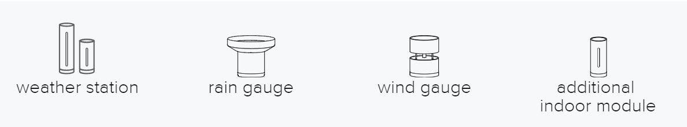
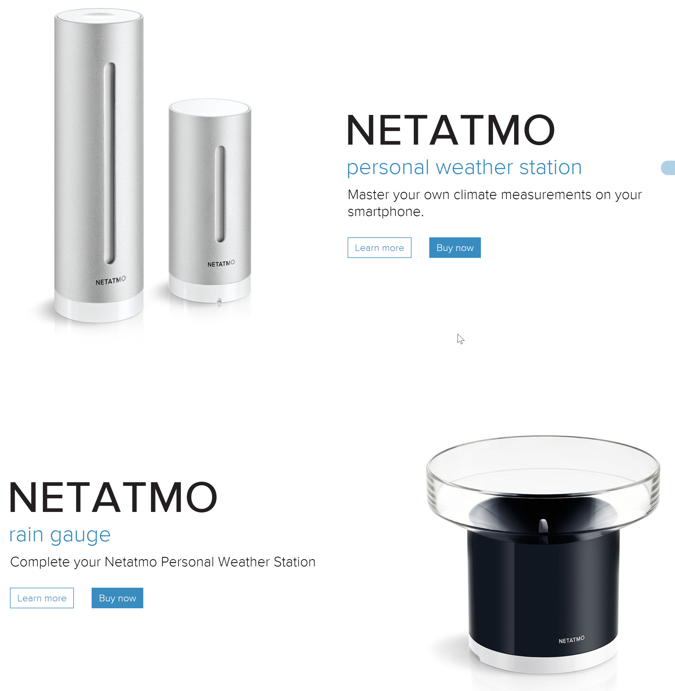
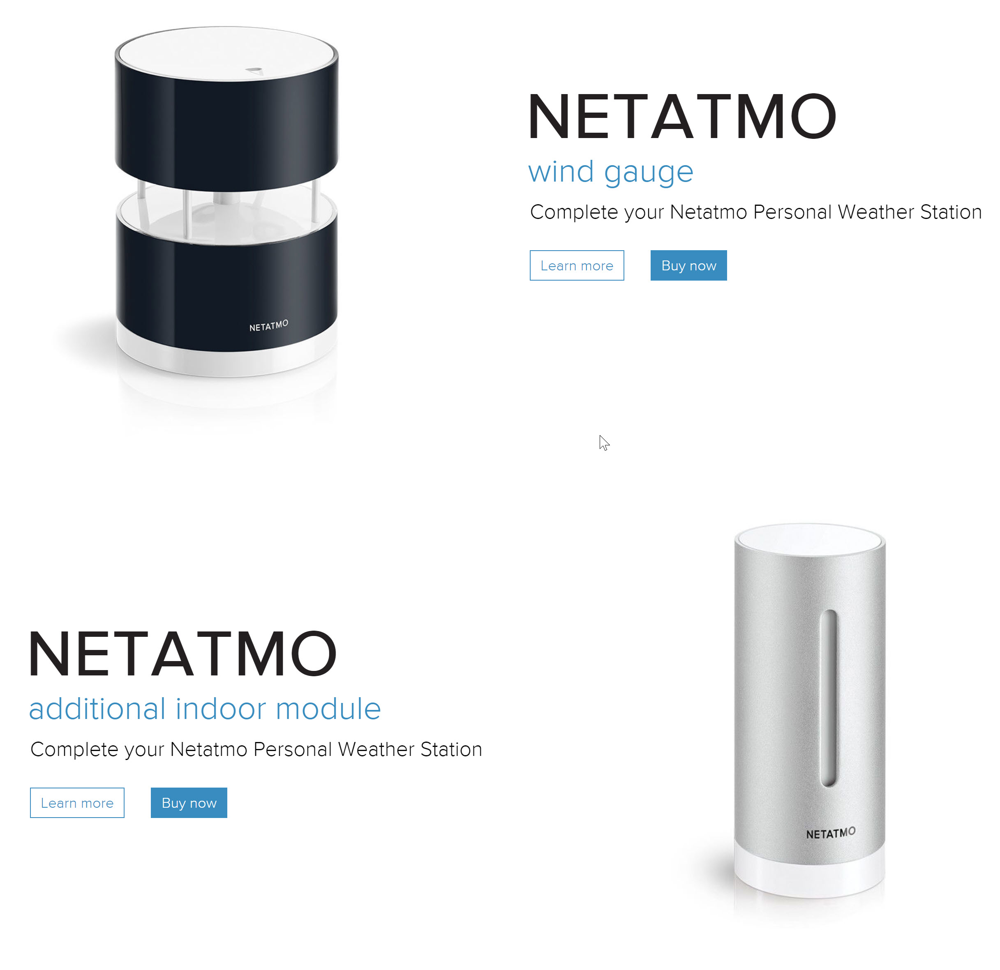
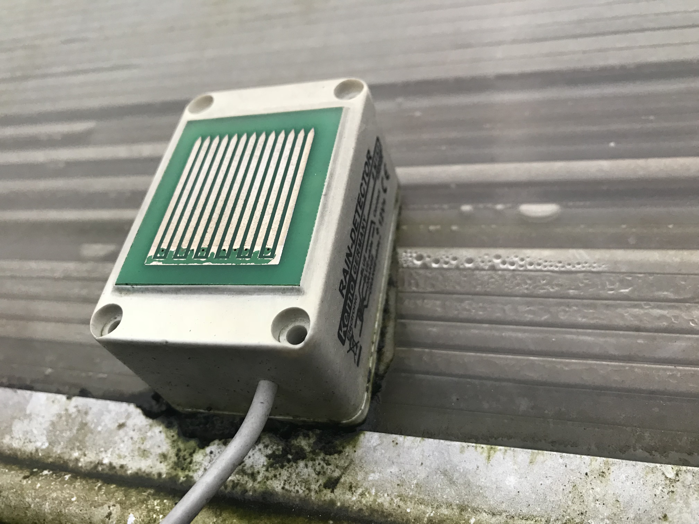
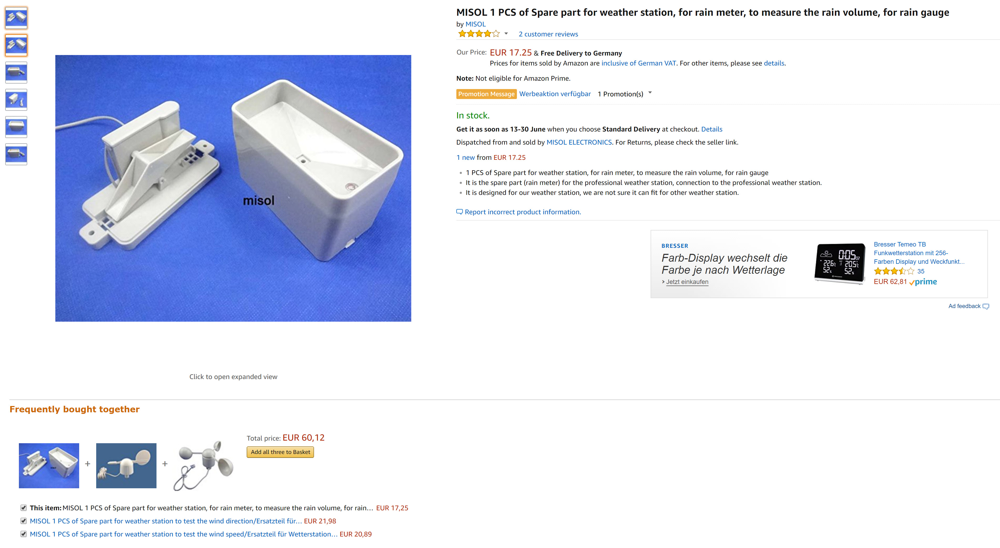
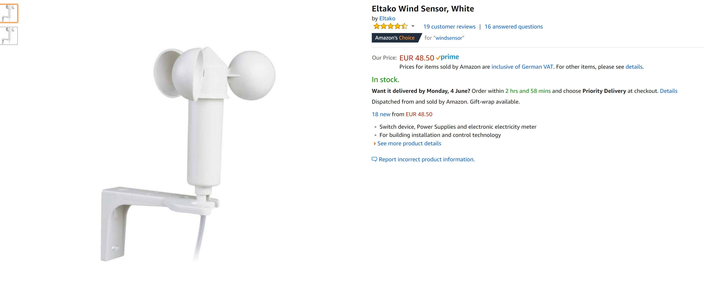

<!--s_name-->
# Weather_station

<!--e_name-->

<!--s_role-->
<!--e_role-->

<!--s_descr-->
wunderground and darksky is used for the weather forecast, Netatmo weather station is used for the wind, rain and other semi real time data. The role involves the weather forecast, weather station (wind, rain, sunshine) and irrigation based on forecast.  Several direct input sensors are supported for rain, wind, temperature, humidity and soil moisture

<!--e_descr-->

## Summary

<!--s_sub_toc_ws-->

Having a weather system that is linked with our [Notifier App](Notifier.md) allows for nice scenario's.
Imagine it rains for the first time in the day, you get a nice warm voice telling you that it is raining outside, making you feeling happy nonetheless.

Many sensors are supported: temperature sensors, rain sensors, rain gauge (measuring rain quantity), soil humidity, sun strength, wind speed, air quality, etc.. 

Many notifications exist linked to the sensors installed, for when it is freezing, thawing, or reaching very cold or very warm temperatures or warming up again after being very cold.

Weather forecast is retrieved from both [darksky](https://darksky.net/dev/) or [wunderground](https://www.wunderground.com/) or [accu weather](https://www.accuweather.com/), and is available to the irrigation app.

It will scan the forecast on extreme wind, temperature or rain and issue a warning in a daily weather email briefing.

If actual sensors are used then actual extreme conditions are just notifications that you can prepare.
 
The weather system of [netatmo](https://www.netatmo.com/en-US/product/weather) is totally integrated into Lucy's weather system.

The [netatmo_ws_driver](Netatmo_driver.md) integrates the netatmo weather station products.  It reports not only on outside weather conditions, but also on indoor air quality (CO2) in the rooms where these sensors are placed.

Reporting is extensive and combining local sensors and netatmo statistics in one overview.
<!--e_sub_toc_ws-->

## Netatmo devices and device driver

It has some beautiful products:





Once you do the Netatmo app registration at http://dev.netatmo.com/dev/listapps, you have to past the client_id, client_secret, netatmo password and user name in the configuration, and the system can start the read you personal rain gauge and in_door/out_door stations.

Lucy will check several aspects of your netatmo weather station such as pressure, humidity, rain last hour, rain last 24 hours, wind and gust.
It also checks indoor parameters such as noise, co2, and humidity, the batteries of every of your netatmo devices.

See the section below on Netatmo weather and indoor warning messages for more detail.

You can also use a digital rain_sensor, this rain sensor is available from https://www.kemo-electronic.de/en/House/Garden/M152-Rain-Sensor-12-V-DC.php



Some other sensors that you can purchase;






<!--s_tbl-->
## List of [properties](Properties.md) for __Weather_station__:

  | Property | Validation | Optional? | Repeat? | Description |
  | --- | --- | --- | --- | --- |
  | C_outdoor | Sensor | False | - | outside temperature sensor | 
  | accu_weather_f | str | True | - | is the accu weather python3 http format string for obtaining a 5 days forecast | 
  | accu_weather_http | str | True | - | is the accu weather python3 http format string for obtaining a location key | 
  | accu_weather_key | str | True | - | accu weather key : see www.accuweather.com; this is the free key which is private to us and allows weather forecasts to be collected.  The site_id is used to obtain a location key and with that the weather forecast | 
  | air_pressure | Sensor | True | - | an analog pressure sensor mbar (milli bar) | 
  | air_quality | Sensor | True | - | an analog air sensor ppm (parts per million) | 
  | darksky_http | str | True | - | darksky weather forecast, and longitude and latitude, see https://darksky.net/dev/ | 
  | darksky_secret | str | True | - | the darksky weather forecast secret, see https://darksky.net/dev/ | 
  | fav | str | True | - | is this a favorite element | 
  | humidity | Sensor | True | - | an analog humidity sensor 0..100% humidity | 
  | icon | str | True | - | icon file for this element | 
  | notifications | ['ws_frc_failed', 'ws_frc_report', 'ws_report'] | True | - | soil sensor is moist/dry, rain sensor raining,temp now going below/above zero, the weather station report, the weather forecast wunderground call failed or report succeeded. , see also [__Notifier__](Notifier.md) | 
  | rain_gauge | Rain_gauge | True | - | an input that generates counter data from the gauge, the input must allow for counter mode | 
  | raining | Input | True | - | input device, active when the sensor is wet.  There is a small heater that dries the sensor, to become inactive when it is dry | 
  | soil_dry | Input | True | - | Input device to monitor when the soil is dry and needs watering | 
  | soil_moist_sensor | Sensor | True | - | an analog moist sensor 0..100% | 
  | sun_light | Sensor | True | - | an analog light sensor 0..300.000 Lux, 0..100% | 
  | wind_speed | Wind_speed | True | - | an input that generates counter data from the wind-fan, the input must allow for counter mode, wind_gust is derived from wind_speed | 
  | wunder_http | str | True | - | is the python3 format string with 2 formatters, where the first is the wunder_key, the second is wunder_location | 
  | wunder_key | str | True | - | wunderground key : this is the free key which is private to us and allows weather forecasts to be collected | 
  | wunder_location | str | True | - | wunderground location, see the website https://www.wunderground.com/ | 

## List of [Notifications](Notifier.md) for  __Weather_station__:

  | Notification Suffix | When invoked? |
  | --- | --- | 
  | ws_frc_failed |  | 
  | ws_frc_report |  | 
  | ws_report |  | 

## List of [Errors/Warnings](Error_Warn.md) for  __Weather_station__:

  | Error/Warning ID | Error/Warning MSG | Occurring When? |
  | --- | --- | --- | 
  | err_accu_weather | !!Weather forecast update accu_weather fail <{:}> |  
  | err_fc_p0 | !!Weather forecast period 0 missing |  
  | err_na_home_id | !!Netatmo Home id is not available |  
  | err_na_mail_id | !!Netatmo mail id unmatch {:} <> {:} |  
  | err_na_station | !!Netatmo {:} ws, {:} |  
  | err_na_tags | !!Netatmo Tags def mismatch: {:} |  
  | err_na_ws_data | !!No Netatmo weather station available |  
  | err_na_ws_wind | !!Netatmo wind types supported are only km/h or beaufort, not {:} (1 is mph, 2 is ms, 4 is knot) |  
  | err_requests_fail | !!http-{:}({:}) failure: {:} |  
  | err_ws_forecast | !!Weather forecast plugin missing |  
  | err_wunderground | !!Weather forecast update wunderground fail <{:}> |  
  | msg_na_token | Netatmo Token valid till {:} |  
  | msg_ws_temp | -> {:}°C |  
<!--e_tbl-->


## Example 

<!--s_insert_{"tree":"(o:Weather_station)"}-->

from project.py tree:(o:Weather_station)
```python3
# --> project.py :<dk:project,o:Project,kw:property,o:House,kw:places,dk:garden,o:Place,kw:contents,lp:9,o:Weather_station>

from lucy import *

Weather_station(
    C_outdoor = Sensor(
            high = 27.0,
            i_read = "°C",
            low = 5.0,
            notifications = {
                    "deicing":[
                        Mail(subject='It is dewing outside {app_txt}', to=None, cams=None, cam_groups=None, passes=0, body_file='', files2mail=None, ceiling=None),
                        Say(txt='{tts_start} temperature is raising above freezing level{tts_end}', ceiling='1/day', times=1, override=None, volume=None)],
                    "freezing":[
                        Mail(subject='Ice Temp Outside {app_txt}', to='{everyone}', cams=None, cam_groups=None, passes=0, body_file='', files2mail=None, ceiling=None),
                        Say(txt='{tts_start} temperature outside is at freezing level{tts_end}', ceiling='1/day', times=1, override=None, volume=None)],
                    "high":[
                        Mail(subject='it is HOT outside, more than {thing_state}°C', to='{prime}', cams=None, cam_groups=None, passes=0, body_file='', files2mail=None, ceiling=None),
                        Say(txt='{tts_start} it is very warm outside, the temperature is above 27 degrees{tts_end}', ceiling='1/day', times=1, override=None, volume=None)],
                    "low":[
                        Mail(subject='it is COLD outside, below {thing_state}°C', to='{prime}', cams=None, cam_groups=None, passes=0, body_file='', files2mail=None, ceiling=None),
                        Say(txt='{tts_start} it is cold outside, the temperature is below 5 degrees{tts_end}', ceiling='1/day', times=1, override=None, volume=None)],
                    "normal":[
                        Mail(subject='Happy! outside temp now {thing_state}°C', to='{prime}', cams=None, cam_groups=None, passes=0, body_file='', files2mail=None, ceiling=None),
                        Say(txt='{tts_start} temperature outside is not extreme any more{tts_end}', ceiling='1/day', times=1, override=None, volume=None)]},
            path = "ow:PI-Gate,28DAE37306000070,DS18B20,,99"),
    accu_weather_f = "http://dataservice.accuweather.com/forecasts/v1/daily/5day/{loc_key}?apikey={api_key}&details=True&metric=True",
    accu_weather_http = "http://dataservice.accuweather.com/locations/v1/cities/geoposition/search?apikey={api_key}&q={lat},{long}",
    accu_weather_key = "AkGbOFNJkFEnaeRYtf9X8fEWu8IglEQb",
    darksky_http = "https://api.darksky.net/forecast/-secret/-latitude,-longitude?exclude=flags,hourly&lang=en&units=auto",
    darksky_secret = "f4eacef5d40b0d974ee5bffcd7375b23",
    notifications = {
            "ws_frc_failed":[
                Mail(subject='Weather Forecast Failed!!, started by{app_txt}', to='{prime}', cams=None, cam_groups=None, passes=0, body_file='', files2mail=None, ceiling=None),
                Say(txt='{tts_start} unfortunately obtaining the weather forecast through internet failed{tts_end}', ceiling=None, times=1, override=None, volume=None)],
            "ws_frc_report":Mail(subject='Weather Forecast{app_txt}', to='{prime}', cams=None, cam_groups=None, passes=0, body_file='fut', files2mail=['wf_plug.log'], ceiling=None),
            "ws_report":Mail(subject='Weather Station Report {app_txt}', to='{prime}', cams=None, cam_groups=None, passes=0, body_file='ws', files2mail=['at_ws.log'], ceiling=None)},
    rain_gauge = Rain_gauge(
            mm_per_rev = 0.2794,
            notifications = {
                    "rain_flooding":[
                        Mail(subject='!Flooding rain:  {app_txt}', to='{prime}', cams=None, cam_groups=None, passes=0, body_file='', files2mail=None, ceiling=None),
                        Say(txt='{tts_start} Attention! Flooding alert as an awful lot of rain fell down today{tts_end}', ceiling=None, times=1, override=None, volume=None),
                        Say(txt='{tts_start} Attention! Put on your swimsuit as we have flooding rain{tts_end}', ceiling=None, times=1, override=None, volume=None)],
                    "rain_lot":[
                        Mail(subject='!Rain A Lot:  {app_txt}', to='{prime}', cams=None, cam_groups=None, passes=0, body_file='', files2mail=None, ceiling=None),
                        Say(txt='{tts_start} a lot of rain fell down today, more than a few buckets{tts_end}', ceiling=None, times=1, override=None, volume=None),
                        Say(txt='{tts_start} lots of rain fell down today, you can almost fill a swimming pool{tts_end}', ceiling=None, times=1, override=None, volume=None)],
                    "rain_nice":[
                        Say(txt='{tts_start} we received some nice rain quantity today{tts_end}', ceiling=None, times=1, override=None, volume=None),
                        Say(txt='{tts_start} we already got more rain than during one of your showers{tts_end}', ceiling=None, times=1, override=None, volume=None)],
                    "rain_tickle":[
                        Say(txt='{tts_start} we got a bucket of rain already{tts_end}', ceiling=None, times=1, override=None, volume=None),
                        Say(txt='{tts_start} more than a few drops of rain came down today{tts_end}', ceiling=None, times=1, override=None, volume=None),
                        Say(txt='{tts_start} see, the plants are getting already some water{tts_end}', ceiling=None, times=1, override=None, volume=None)]},
            path = "unipi:PI-Garden,input,11"),
    raining = Input(
            active = 0,
            notifications = {
                    "active":[
                        Mail(subject='Weather Station :  It started Raining', to='{prime}', cams=None, cam_groups=None, passes=0, body_file='', files2mail=None, ceiling='1/day'),
                        Say(txt='{tts_start} it is raining outside{tts_end}', ceiling='1/day', times=1, override=None, volume=None),
                        Say(txt='{tts_start} the first rain of today is coming down on us{tts_end}', ceiling='1/day', times=1, override=None, volume=None),
                        Say(txt='{tts_start} it is raining outside, i think the plants are happy{tts_end}', ceiling='1/day', times=1, override=None, volume=None),
                        Say(txt='{tts_start} yes it is raining!{tts_end}', ceiling='1/day', times=1, override=None, volume=None)]},
            path = "unipi:PI-Garden,input,5"),
    role_me = "PI-Garden",
    soil_dry = Input(path = "unipi:PI-Garden,input,3"),
    sun_light = Sensor(
            high = 95,
            i_read = "%L",
            notifications = {
                    "high":[
                        Say(txt='{tts_start} it is a bright day outside, surely good for your mood{tts_end}', ceiling='1/day', times=1, override=None, volume=None),
                        Say(txt='{tts_start} what a nice and bright sunshine outside{tts_end}', ceiling='1/day', times=1, override=None, volume=None),
                        Say(txt='{tts_start} i love it when the sun is bright{tts_end}', ceiling='1/day', times=1, override=None, volume=None),
                        Say(txt='{tts_start} your solar panels are generating lots of energy with the sunshine outside{tts_end}', ceiling='1/day', times=1, override=None, volume=None)]},
            path = "unipi:PI-Garden,ai,1",
            threshold = 5),
    wind_speed = Wind_speed(
            edges_per_rev = 2,
            high_speed_factor = 3.013,
            low_speed_factor = 1.761,
            method_things = {
                    "wind_gust":Wind_gust(
                            notifications = {
                                    "wind_hurricane":[
                                        Mail(subject='wind strength:  {app_txt}', to='{prime}', cams=None, cam_groups=None, passes=0, body_file='', files2mail=None, ceiling=None),
                                        Say(txt='{tts_start} Attention! Start praying and hide in the basement, there is a hurricane outside{tts_end}', ceiling=None, times=2, override=True, volume=60)],
                                    "wind_storm":[
                                        Mail(subject='wind strength:  {app_txt}', to='{prime}', cams=None, cam_groups=None, passes=0, body_file='', files2mail=None, ceiling=None),
                                        Say(txt='{tts_start} Attention! It is storming outside{tts_end}', ceiling=None, times=1, override=None, volume=None)],
                                    "wind_strong":[
                                        Mail(subject='wind strength:  {app_txt}', to='{prime}', cams=None, cam_groups=None, passes=0, body_file='', files2mail=None, ceiling=None),
                                        Say(txt='{tts_start} the wind outside is now strong{tts_end}', ceiling=None, times=1, override=None, volume=None),
                                        Say(txt='{tts_start} the wind is blowing nicely{tts_end}', ceiling=None, times=1, override=None, volume=None),
                                        Say(txt='{tts_start} can you hear the wind outside? It is getting stronger.{tts_end}', ceiling=None, times=1, override=None, volume=None)],
                                    "wind_very_strong":[
                                        Mail(subject='wind strength:  {app_txt}', to='{prime}', cams=None, cam_groups=None, passes=0, body_file='', files2mail=None, ceiling=None),
                                        Say(txt='{tts_start} beware, the wind outside is now very strong{tts_end}', ceiling=None, times=1, override=None, volume=None),
                                        Say(txt='{tts_start} make sure everything is wind tight as the wind outside is now very strong{tts_end}', ceiling=None, times=1, override=None, volume=None)],
                                    "wind_violent_storm":[
                                        Mail(subject='wind strength:  {app_txt}', to='{prime}', cams=None, cam_groups=None, passes=0, body_file='', files2mail=None, ceiling=None),
                                        Say(txt='{tts_start} Attention! There is a violent storm outside{tts_end}', ceiling=None, times=2, override=True, volume=60)]})},
            path = "unipi:PI-Garden,input,12"))

```

<!--e_insert-->


* * * 
* * * 
# Weather Forecasting Reporting Example

* * * 
* * * 

<!--s_insert_{"role":"weather","suffix":"fut"}-->


[PI-Garden_fut.html](PI-Garden_fut.html)

<!DOCTYPE html><html><body><h1>Weather_forecast -> PI-Garden_fut.html  2020/06/19 00:01:29</h1><h2>Warnings</h2><table><thead><tr><th>Source</th><th style='text-align:center'>Day</th><th>Warning</th></tr></thead><tbody><thead><tr><td style='background-color:pink'>Darksky</td><td style='background-color:pink;text-align:center'>Sunday</td><td style='background-color:pink'>High Temp : 25.0&deg;C</td></tr><tr><td style='background-color:pink'>Darksky</td><td style='background-color:pink;text-align:center'>Monday</td><td style='background-color:pink'>High Temp : 25.0&deg;C</td></tr><tr><td style='background-color:pink'>Darksky</td><td style='background-color:pink;text-align:center'>Tuesday</td><td style='background-color:pink'>High Temp : 29.0&deg;C</td></tr><tr><td style='background-color:pink'>Darksky</td><td style='background-color:pink;text-align:center'>Wednesday</td><td style='background-color:pink'>High Temp : 31.0&deg;C</td></tr><tr><td style='background-color:pink'>Darksky</td><td style='background-color:pink;text-align:center'>Thursday</td><td style='background-color:pink'>High Temp : 31.0&deg;C</td></tr><tr><td style='background-color:pink'>Darksky</td><td style='background-color:pink;text-align:center'>Friday</td><td style='background-color:pink'>High Temp : 34.0&deg;C</td></tr><tr><td style='background-color:pink'>Accu_weather</td><td style='background-color:pink;text-align:center'>Thursday - Day</td><td style='background-color:pink'>Rain : 4.0mm</td></tr><tr><td style='background-color:pink'>Accu_weather</td><td style='background-color:pink;text-align:center'>Friday - Day</td><td style='background-color:pink'>Rain : 2.8mm</td></tr></tbody></table><h2>Forecast</h2><table><thead><tr><th>Day</th><th style='text-align:center'>Hi&deg;C</th><th style='text-align:center'>Lo&deg;C</th><th style='text-align:center'>H %</th><th style='text-align:center'>W Kph</th><th style='text-align:center'>R mm</th><th style='text-align:center'>Sn cm</th><th>Forecast</th></tr></thead><tbody><tr><td style='text-align:center' colspan='8'>----------Darksky----------</td></tr><tr><td>Friday</td><td style='text-align:center'>22</td><td style='text-align:center'>12</td><td style='text-align:center'>80</td><td style='text-align:center'>3</td><td style='text-align:center'>0.8846</td><td style='text-align:center'>0.0</td><td>Clear throughout the day.</td></tr><tr><td>Saturday</td><td style='text-align:center'>23</td><td style='text-align:center'>10</td><td style='text-align:center'>68</td><td style='text-align:center'>2</td><td style='text-align:center'>0.0063</td><td style='text-align:center'>0.0</td><td>Partly cloudy throughout the day.</td></tr><tr><td>Sunday</td><td style='text-align:center'>25</td><td style='text-align:center'>12</td><td style='text-align:center'>64</td><td style='text-align:center'>3</td><td style='text-align:center'>0.1496</td><td style='text-align:center'>0.0</td><td>Mostly cloudy throughout the day.</td></tr><tr><td>Monday</td><td style='text-align:center'>25</td><td style='text-align:center'>13</td><td style='text-align:center'>56</td><td style='text-align:center'>2</td><td style='text-align:center'>0.0083</td><td style='text-align:center'>0.0</td><td>Clear throughout the day.</td></tr><tr><td>Tuesday</td><td style='text-align:center'>29</td><td style='text-align:center'>13</td><td style='text-align:center'>55</td><td style='text-align:center'>2</td><td style='text-align:center'>0.0</td><td style='text-align:center'>0.0</td><td>Clear throughout the day.</td></tr><tr><td>Wednesday</td><td style='text-align:center'>31</td><td style='text-align:center'>16</td><td style='text-align:center'>49</td><td style='text-align:center'>3</td><td style='text-align:center'>0.0</td><td style='text-align:center'>0.0</td><td>Clear throughout the day.</td></tr><tr><td>Thursday</td><td style='text-align:center'>31</td><td style='text-align:center'>19</td><td style='text-align:center'>47</td><td style='text-align:center'>4</td><td style='text-align:center'>0.1317</td><td style='text-align:center'>0.0</td><td>Clear throughout the day.</td></tr><tr><td>Friday</td><td style='text-align:center'>34</td><td style='text-align:center'>21</td><td style='text-align:center'>44</td><td style='text-align:center'>3</td><td style='text-align:center'>0.209</td><td style='text-align:center'>0.0</td><td>Partly cloudy throughout the day.</td></tr><tr><td style='text-align:center' colspan='8'>----------Accu_weather----------</td></tr><tr><td>Thursday - Day</td><td style='text-align:center'>22</td><td style='text-align:center'>12</td><td style='text-align:center'>-</td><td style='text-align:center'>13</td><td style='text-align:center'>4.0</td><td style='text-align:center'>0.0</td><td>A little morning rain followed by a couple of showers and a thunderstorm this afternoon</td></tr><tr><td>Thursday - Night</td><td style='text-align:center'>22</td><td style='text-align:center'>12</td><td style='text-align:center'>-</td><td style='text-align:center'>7</td><td style='text-align:center'>0.0</td><td style='text-align:center'>0.0</td><td>Clear to partly cloudy</td></tr><tr><td>Friday - Day</td><td style='text-align:center'>22</td><td style='text-align:center'>11</td><td style='text-align:center'>-</td><td style='text-align:center'>11</td><td style='text-align:center'>2.8</td><td style='text-align:center'>0.0</td><td>Times of clouds and sun with a shower or thunderstorm around</td></tr><tr><td>Friday - Night</td><td style='text-align:center'>22</td><td style='text-align:center'>11</td><td style='text-align:center'>-</td><td style='text-align:center'>9</td><td style='text-align:center'>1.3</td><td style='text-align:center'>0.0</td><td>A shower or thunderstorm around in the evening; otherwise, partly cloudy</td></tr><tr><td>Saturday - Day</td><td style='text-align:center'>21</td><td style='text-align:center'>12</td><td style='text-align:center'>-</td><td style='text-align:center'>11</td><td style='text-align:center'>0.0</td><td style='text-align:center'>0.0</td><td>Times of clouds and sun</td></tr><tr><td>Saturday - Night</td><td style='text-align:center'>21</td><td style='text-align:center'>12</td><td style='text-align:center'>-</td><td style='text-align:center'>7</td><td style='text-align:center'>0.0</td><td style='text-align:center'>0.0</td><td>Partly cloudy</td></tr><tr><td>Sunday - Day</td><td style='text-align:center'>24</td><td style='text-align:center'>12</td><td style='text-align:center'>-</td><td style='text-align:center'>13</td><td style='text-align:center'>1.0</td><td style='text-align:center'>0.0</td><td>Times of clouds and sun with a passing shower</td></tr><tr><td>Sunday - Night</td><td style='text-align:center'>24</td><td style='text-align:center'>12</td><td style='text-align:center'>-</td><td style='text-align:center'>11</td><td style='text-align:center'>0.8</td><td style='text-align:center'>0.0</td><td>A passing evening shower; otherwise, clear to partly cloudy</td></tr><tr><td>Monday - Day</td><td style='text-align:center'>23</td><td style='text-align:center'>13</td><td style='text-align:center'>-</td><td style='text-align:center'>11</td><td style='text-align:center'>0.0</td><td style='text-align:center'>0.0</td><td>Mostly sunny and pleasant</td></tr><tr><td>Monday - Night</td><td style='text-align:center'>23</td><td style='text-align:center'>13</td><td style='text-align:center'>-</td><td style='text-align:center'>7</td><td style='text-align:center'>0.0</td><td style='text-align:center'>0.0</td><td>Clear</td></tr></tbody></table></body></html>
<!--e_insert-->

* * * 
* * *


* * * 
* * * 
# Weather Reporting Example, daily emailed

* * * 
* * * 

<!--s_insert_{"role":"weather","suffix":"ws"}-->


[PI-Garden_ws.html](PI-Garden_ws.html)

<!DOCTYPE html><html><body><h1>Weather Report -> PI-Garden_ws.html  2020/06/19 10:19:11</h1><h2>Weather Direct Sensors</h2><table><thead><tr><th>Weather Item</th><th>Result</th><th>Measure</th></tr></thead><tbody><tr><td>Date Report</td><td>2020-06-19</td><td>-</td></tr><tr><td>Sun Rise at</td><td>05:25</td><td>HH:MM</td></tr><tr><td>Sun Set at</td><td>22:01</td><td>HH:MM</td></tr><tr><td>C_outdoor</td><td>currently</td><td>+20.00&deg;C</td></tr><tr><td>-</td><td>times_changed</td><td>1</td></tr><tr><td>-</td><td>highest</td><td>+20.00&deg;C</td></tr><tr><td>-</td><td>lowest</td><td>+20.00&deg;C</td></tr><tr><td>-</td><td>average</td><td>+20.20&deg;C</td></tr><tr><td>-</td><td>lowest_when</td><td>00:01</td></tr><tr><td>-</td><td>highest_when</td><td>00:01</td></tr><tr><td>rain_gauge</td><td>currently</td><td>0mm/m2</td></tr><tr><td>-</td><td>times_changed</td><td>0</td></tr><tr><td>-</td><td>highest</td><td>0mm/m2</td></tr><tr><td>-</td><td>lowest</td><td>0mm/m2</td></tr><tr><td>-</td><td>average</td><td>0mm/m2</td></tr><tr><td>-</td><td>lowest_when</td><td>None </td></tr><tr><td>-</td><td>highest_when</td><td>None </td></tr><tr><td>-</td><td>Today Usage</td><td>0mm/m2</td></tr><tr><td>-</td><td>this Week Usage</td><td>2.30cm/m2</td></tr><tr><td>-</td><td>this Month Usage</td><td>0.27m/m2</td></tr><tr><td>-</td><td>this Year Usage</td><td>0.29m/m2</td></tr><tr><td>-</td><td>rain_gauge actual count</td><td>0mm/m2</td></tr><tr><td>raining</td><td>currently</td><td>open</td></tr><tr><td>-</td><td>count_high</td><td>0</td></tr><tr><td>-</td><td>duration_high</td><td>00:00:00</td></tr><tr><td>-</td><td>duration_low</td><td>00:00:00</td></tr><tr><td>-</td><td>duration_high_average</td><td>None    </td></tr><tr><td>-</td><td>last_high</td><td>None </td></tr><tr><td>-</td><td>last_low</td><td>00:01</td></tr><tr><td>soil_dry</td><td>currently</td><td>open</td></tr><tr><td>-</td><td>count_high</td><td>0</td></tr><tr><td>-</td><td>duration_high</td><td>00:00:00</td></tr><tr><td>-</td><td>duration_low</td><td>00:00:00</td></tr><tr><td>-</td><td>duration_high_average</td><td>None    </td></tr><tr><td>-</td><td>last_high</td><td>None </td></tr><tr><td>-</td><td>last_low</td><td>00:01</td></tr><tr><td>sun_light</td><td>currently</td><td>100%L</td></tr><tr><td>-</td><td>times_changed</td><td>873</td></tr><tr><td>-</td><td>highest</td><td>100%L</td></tr><tr><td>-</td><td>lowest</td><td>00%L</td></tr><tr><td>-</td><td>average</td><td>00%L</td></tr><tr><td>-</td><td>lowest_when</td><td>00:01</td></tr><tr><td>-</td><td>highest_when</td><td>10:18</td></tr><tr><td>wind_speed</td><td>currently</td><td>0.00km/h</td></tr><tr><td>-</td><td>times_changed</td><td>0</td></tr><tr><td>-</td><td>highest</td><td>0.00km/h</td></tr><tr><td>-</td><td>lowest</td><td>0.00km/h</td></tr><tr><td>-</td><td>average</td><td>0.00km/h</td></tr><tr><td>-</td><td>lowest_when</td><td>None </td></tr><tr><td>-</td><td>highest_when</td><td>None </td></tr><tr><td>wind_gust</td><td>currently</td><td>0.00km/h</td></tr><tr><td>-</td><td>times_changed</td><td>0</td></tr><tr><td>-</td><td>highest</td><td>0.00km/h</td></tr><tr><td>-</td><td>lowest</td><td>0.00km/h</td></tr><tr><td>-</td><td>average</td><td>0.00km/h</td></tr><tr><td>-</td><td>lowest_when</td><td>None </td></tr><tr><td>-</td><td>highest_when</td><td>None </td></tr><tr><td>Irrigation</td><td>Rain Decay</td><td>01:50:00</td></tr><tr><td>-</td><td>Dry Days</td><td>0</td></tr><tr><td>-</td><td>Flow Meter: Today Usage</td><td>13.77L</td></tr><tr><td>-</td><td>Flow Meter: this Week Usage</td><td>119.82L</td></tr><tr><td>-</td><td>Flow Meter: this Month Usage</td><td>7.63m3</td></tr><tr><td>-</td><td>Flow Meter: this Year Usage</td><td>53.66m3</td></tr><tr><td>-</td><td>Flow Meter actual count</td><td>53.66m3</td></tr></tbody></table><h2>Netatmo Stations/Modules</h2><table><thead><tr><th>Station</th><th>Module</th><th>In/Outdoor</th><th>last_seen</th></tr></thead><tbody><tr><td style='background-color:plum'>Dennenbad</td><td>Office</td><td>indoor type</td><td>not available</td></tr><tr><td style='background-color:plum'>Dennenbad</td><td>Garden</td><td>outdoor type</td><td>2020-06-19 10:12:11</td></tr><tr><td style='background-color:plum'>Dennenbad</td><td>Rainmeter</td><td>outdoor type</td><td>2020-06-19 10:12:18</td></tr><tr><td style='background-color:plum'>Dennenbad</td><td>Windmeter</td><td>outdoor type</td><td>2020-06-19 10:12:18</td></tr><tr><td style='background-color:plum'>Dennenbad</td><td>Garage_Dressing</td><td>indoor type</td><td>2020-06-19 10:12:05</td></tr><tr><td style='background-color:plum'>Dennenbad</td><td>Master_Bed</td><td>indoor type</td><td>2020-06-19 10:12:18</td></tr></tbody></table><h2>Garage_Dressing Sensor</h2><table><thead><tr><th>Garage_Dressing Item</th><th>Result</th><th>Measure</th><th>Situation</th></tr></thead><tbody><tr><td>battery_vp</td><td>5966</td><td>mV / 6000 mV</td><td>FULL</td></tr><tr><td>CO2</td><td>756</td><td>ppm (parts per million)</td><td>EXCELLENT</td></tr><tr><td>date_max_temp</td><td>2020-06-19 00:01:13</td><td>-</td><td>-</td></tr><tr><td>date_min_temp</td><td>2020-06-19 08:10:51</td><td>-</td><td>-</td></tr><tr><td>Humidity</td><td>66</td><td>% RH</td><td>NORMAL</td></tr><tr><td>last_seen</td><td>2020-06-19 10:12:05</td><td>-</td><td>-</td></tr><tr><td>max_temp</td><td>23.2</td><td>&deg;C</td><td>-</td></tr><tr><td>min_temp</td><td>22.3</td><td>&deg;C</td><td>-</td></tr><tr><td>rf_status</td><td>66</td><td>-</td><td>AVERAGE</td></tr><tr><td>temp_trend</td><td>stable</td><td>-</td><td>-</td></tr><tr><td>Temperature</td><td>22.3</td><td>&deg;C</td><td>-</td></tr><tr><td>When</td><td>2020-06-19 10:11:14</td><td>-</td><td>-</td></tr></tbody></table><h2>Garden Sensor</h2><table><thead><tr><th>Garden Item</th><th>Result</th><th>Measure</th><th>Situation</th></tr></thead><tbody><tr><td>battery_vp</td><td>5396</td><td>mV / 6000 mV</td><td>HIGH</td></tr><tr><td>date_max_temp</td><td>2020-06-19 09:41:32</td><td>-</td><td>-</td></tr><tr><td>date_min_temp</td><td>2020-06-19 05:38:52</td><td>-</td><td>-</td></tr><tr><td>Humidity</td><td>78</td><td>% RH</td><td>NORMAL</td></tr><tr><td>last_seen</td><td>2020-06-19 10:12:11</td><td>-</td><td>-</td></tr><tr><td>max_temp</td><td>19.4</td><td>&deg;C</td><td>-</td></tr><tr><td>min_temp</td><td>12.5</td><td>&deg;C</td><td>-</td></tr><tr><td>rf_status</td><td>61</td><td>-</td><td>AVERAGE</td></tr><tr><td>temp_trend</td><td>up</td><td>-</td><td>-</td></tr><tr><td>Temperature</td><td>19.4</td><td>&deg;C</td><td>-</td></tr><tr><td>When</td><td>2020-06-19 10:11:20</td><td>-</td><td>-</td></tr></tbody></table><h2>Master_Bed Sensor</h2><table><thead><tr><th>Master_Bed Item</th><th>Result</th><th>Measure</th><th>Situation</th></tr></thead><tbody><tr><td>battery_vp</td><td>5419</td><td>mV / 6000 mV</td><td>HIGH</td></tr><tr><td>CO2</td><td>585</td><td>ppm (parts per million)</td><td>EXCELLENT</td></tr><tr><td>date_max_temp</td><td>2020-06-19 00:01:26</td><td>-</td><td>-</td></tr><tr><td>date_min_temp</td><td>2020-06-19 07:55:42</td><td>-</td><td>-</td></tr><tr><td>Humidity</td><td>57</td><td>% RH</td><td>NORMAL</td></tr><tr><td>last_seen</td><td>2020-06-19 10:12:18</td><td>-</td><td>-</td></tr><tr><td>max_temp</td><td>23.8</td><td>&deg;C</td><td>-</td></tr><tr><td>min_temp</td><td>23.2</td><td>&deg;C</td><td>-</td></tr><tr><td>rf_status</td><td>70</td><td>-</td><td>AVERAGE</td></tr><tr><td>temp_trend</td><td>stable</td><td>-</td><td>-</td></tr><tr><td>Temperature</td><td>23.4</td><td>&deg;C</td><td>-</td></tr><tr><td>When</td><td>2020-06-19 10:11:27</td><td>-</td><td>-</td></tr></tbody></table><h2>Office Sensor</h2><table><thead><tr><th>Office Item</th><th>Result</th><th>Measure</th><th>Situation</th></tr></thead><tbody><tr><td>AbsolutePressure</td><td>1010.2</td><td>mbar (milli bar)</td><td>-</td></tr><tr><td>CO2</td><td>528</td><td>ppm (parts per million)</td><td>EXCELLENT</td></tr><tr><td>date_max_temp</td><td>2020-06-19 00:01:43</td><td>-</td><td>-</td></tr><tr><td>date_min_temp</td><td>2020-06-19 06:20:10</td><td>-</td><td>-</td></tr><tr><td>Humidity</td><td>61</td><td>% RH</td><td>NORMAL</td></tr><tr><td>max_temp</td><td>24.3</td><td>&deg;C</td><td>-</td></tr><tr><td>min_temp</td><td>23</td><td>&deg;C</td><td>-</td></tr><tr><td>Noise</td><td>44</td><td>dB (decibel)</td><td>NORMAL</td></tr><tr><td>Pressure</td><td>1012.1</td><td>mbar (milli bar)</td><td>LOW</td></tr><tr><td>pressure_trend</td><td>stable</td><td>-</td><td>-</td></tr><tr><td>temp_trend</td><td>up</td><td>-</td><td>-</td></tr><tr><td>Temperature</td><td>23.9</td><td>&deg;C</td><td>-</td></tr><tr><td>When</td><td>2020-06-19 10:11:59</td><td>-</td><td>-</td></tr><tr><td>wifi_status</td><td>54</td><td>-</td><td>GOOD</td></tr></tbody></table><h2>Rainmeter</h2><table><thead><tr><th>Rainmeter Item</th><th>Result</th><th>Measure</th><th>Situation</th></tr></thead><tbody><tr><td>battery_vp</td><td>5784</td><td>mV / 6000 mV</td><td>FULL</td></tr><tr><td>last_seen</td><td>2020-06-19 10:12:18</td><td>-</td><td>-</td></tr><tr><td>Rain</td><td>0</td><td>mm</td><td>-</td></tr><tr><td>rf_status</td><td>58</td><td>-</td><td>AVERAGE</td></tr><tr><td>sum_rain_1</td><td>0</td><td>mm</td><td>DRY</td></tr><tr><td>sum_rain_24</td><td>0</td><td>mm</td><td>NOTHING</td></tr><tr><td>When</td><td>2020-06-19 10:11:52</td><td>-</td><td>-</td></tr></tbody></table><h2>Windmeter</h2><table><thead><tr><th>Windmeter Item</th><th>Result</th><th>Measure</th><th>Situation</th></tr></thead><tbody><tr><td>battery_vp</td><td>5964</td><td>mV / 6000 mV</td><td>FULL</td></tr><tr><td>date_max_wind_str</td><td>2020-06-19 09:31:42</td><td>-</td><td>-</td></tr><tr><td>GustAngle</td><td>77</td><td>degrees</td><td>-</td></tr><tr><td>GustStrength</td><td>5</td><td>km/hour</td><td>NO WIND</td></tr><tr><td>last_seen</td><td>2020-06-19 10:12:18</td><td>-</td><td>-</td></tr><tr><td>max_wind_angle</td><td>140</td><td>degrees</td><td>-</td></tr><tr><td>max_wind_str</td><td>6</td><td>km/hour</td><td>NO WIND</td></tr><tr><td>rf_status</td><td>73</td><td>-</td><td>WEAK</td></tr><tr><td>When</td><td>2020-06-19 10:11:59</td><td>-</td><td>-</td></tr><tr><td>WindAngle</td><td>62</td><td>degrees</td><td>-</td></tr><tr><td>WindStrength</td><td>2</td><td>km/hour</td><td>calm</td></tr></tbody></table><h2>Wind History</h2><table><thead><tr><th>Time</th><th style='text-align:center'>Strength (km/h)</th><th style='text-align:center'>Angle (degr)</th><th>Strength</th></tr></thead><tbody></tbody></table></body></html>
<!--e_insert-->

* * * 
* * *


